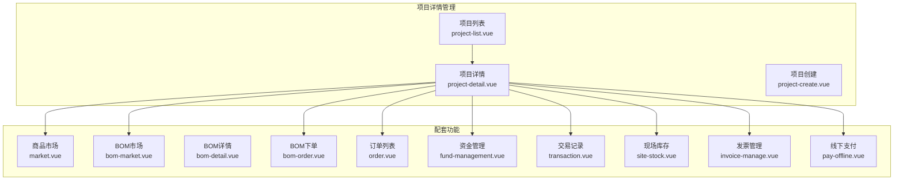
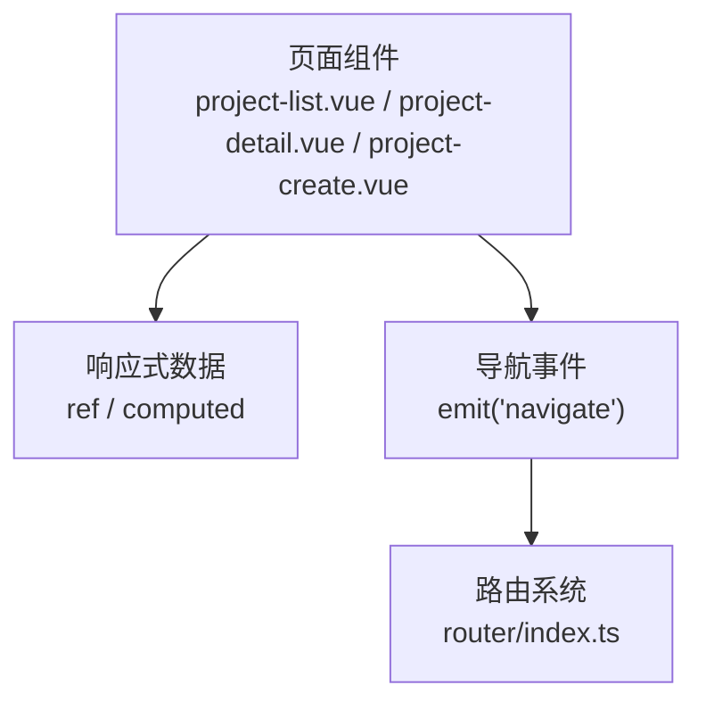
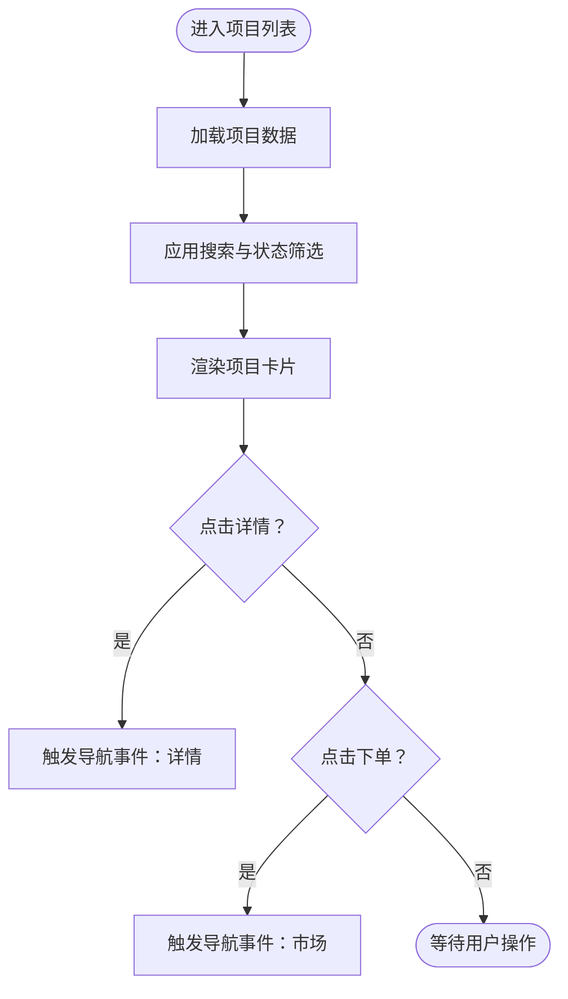
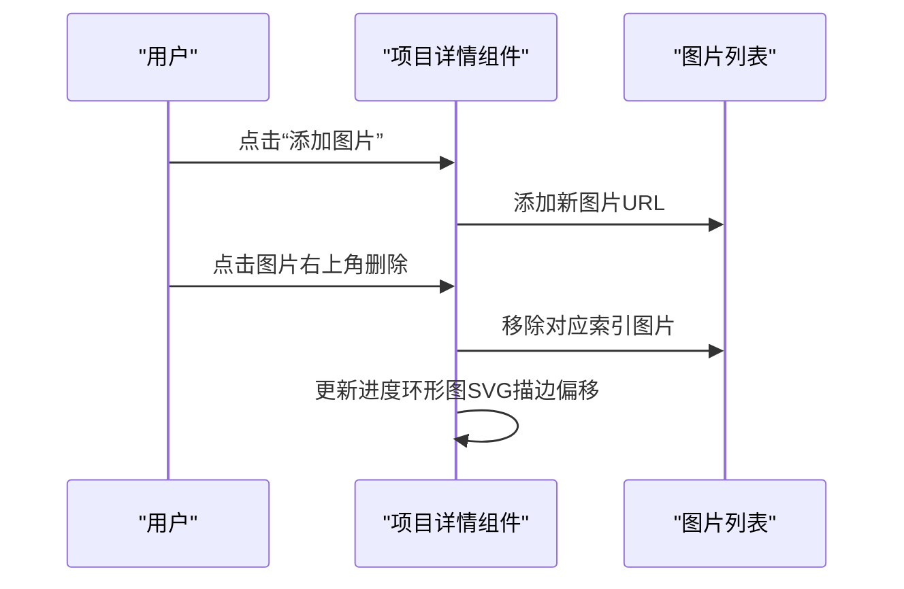
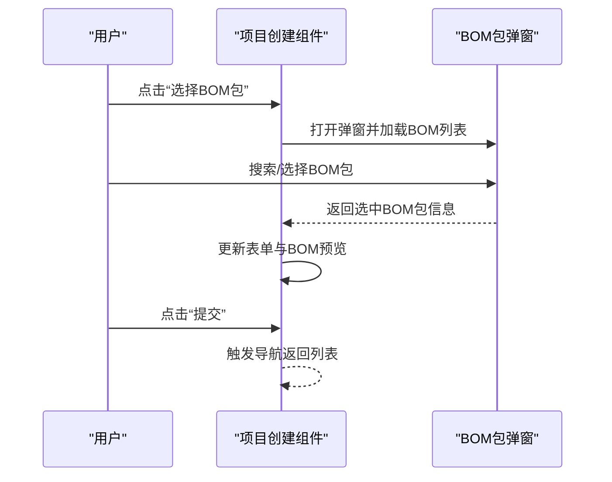
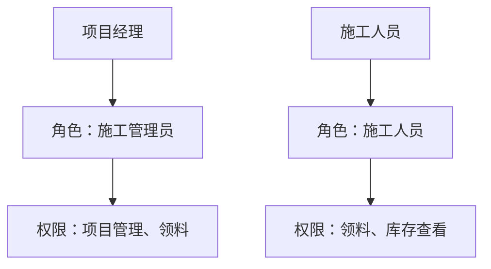
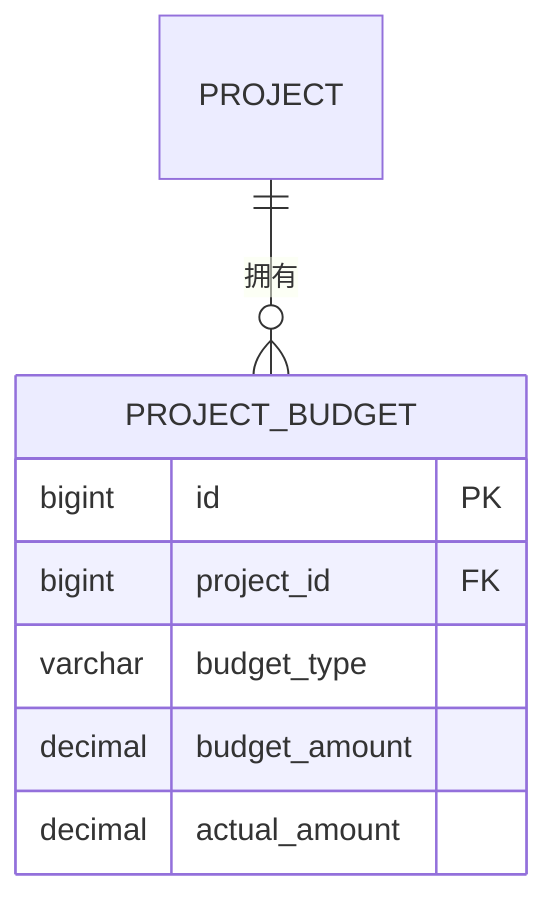
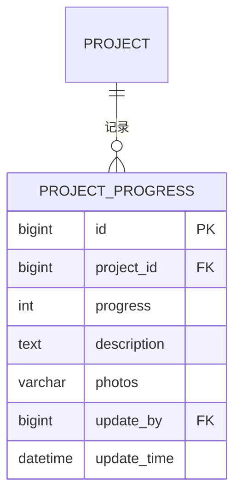
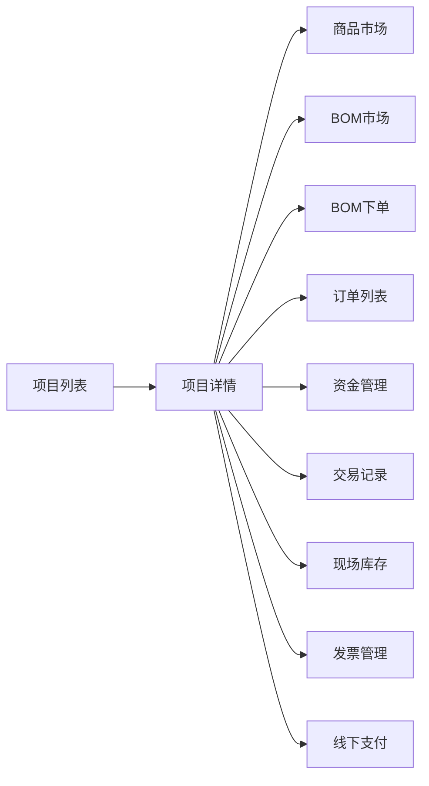

# 项目详情管理

<cite>
**本文档引用的文件**
- [apps/pc/src/views/mp-preview/pages/construction/project-list.vue](file://apps/pc/src/views/mp-preview/pages/construction/project-list.vue)
- [apps/pc/src/views/mp-preview/pages/construction/project-detail.vue](file://apps/pc/src/views/mp-preview/pages/construction/project-detail.vue)
- [apps/pc/src/views/mp-preview/pages/construction/project-create.vue](file://apps/pc/src/views/mp-preview/pages/construction/project-create.vue)
- [apps/pc/src/views/mp-preview/pages/construction/index.vue](file://apps/pc/src/views/mp-preview/pages/construction/index.vue)
- [apps/pc/src/views/mp-preview/pages/construction/bom-order.vue](file://apps/pc/src/views/mp-preview/pages/construction/bom-order.vue)
- [apps/pc/src/views/mp-preview/pages/construction/fund-management.vue](file://apps/pc/src/views/mp-preview/pages/construction/fund-management.vue)
- [apps/pc/src/views/mp-preview/pages/construction/transaction.vue](file://apps/pc/src/views/mp-preview/pages/construction/transaction.vue)
- [apps/pc/src/views/mp-preview/pages/construction/site-stock.vue](file://apps/pc/src/views/mp-preview/pages/construction/site-stock.vue)
- [apps/pc/src/views/mp-preview/pages/construction/order.vue](file://apps/pc/src/views/mp-preview/pages/construction/order.vue)
- [apps/pc/src/views/mp-preview/pages/construction/market.vue](file://apps/pc/src/views/mp-preview/pages/construction/market.vue)
- [apps/pc/src/views/mp-preview/pages/construction/bom-market.vue](file://apps/pc/src/views/mp-preview/pages/construction/bom-market.vue)
- [apps/pc/src/views/mp-preview/pages/construction/bom-detail.vue](file://apps/pc/src/views/mp-preview/pages/construction/bom-detail.vue)
- [apps/pc/src/views/mp-preview/pages/construction/pay-offline.vue](file://apps/pc/src/views/mp-preview/pages/construction/pay-offline.vue)
- [apps/pc/src/views/mp-preview/pages/construction/invoice-manage.vue](file://apps/pc/src/views/mp-preview/pages/construction/invoice-manage.vue)
- [apps/pc/src/views/mp-preview/pages/construction/invoice-title.vue](file://apps/pc/src/views/mp-preview/pages/construction/invoice-title.vue)
- [apps/pc/src/views/mp-preview/pages/construction/message-center.vue](file://apps/pc/src/views/mp-preview/pages/construction/message-center.vue)
- [apps/pc/src/views/mp-preview/pages/construction/settings.vue](file://apps/pc/src/views/mp-preview/pages/construction/settings.vue)
- [apps/pc/src/views/mp-preview/index.vue](file://apps/pc/src/views/mp-preview/index.vue)
- [apps/pc/src/router/index.ts](file://apps/pc/src/router/index.ts)
- [docs/PRD/02-业务流程设计.md](file://docs/PRD/02-业务流程设计.md)
- [docs/PRD/03-数据模型与表结构.md](file://docs/PRD/03-数据模型与表结构.md)
</cite>

## 目录
1. [简介](#简介)
2. [项目结构](#项目结构)
3. [核心组件](#核心组件)
4. [架构总览](#架构总览)
5. [详细组件分析](#详细组件分析)
6. [依赖关系分析](#依赖关系分析)
7. [性能考虑](#性能考虑)
8. [故障排除指南](#故障排除指南)
9. [结论](#结论)
10. [附录](#附录)

## 简介
本文件围绕“项目详情管理”功能，系统化梳理项目基本信息展示、项目状态显示、项目成员列表、项目预算详情、项目进度详情等核心能力，并结合业务流程与数据模型，给出数据展示逻辑、权限控制机制、数据更新流程及操作指南与数据分析方法。目标是帮助研发与运营人员快速理解与使用该功能模块。

## 项目结构
项目详情管理功能主要分布在移动端预览端（mp-preview）的施工方页面中，包含项目列表、项目详情、项目创建等页面，以及与之配套的商品市场、BOM包、订单、资金管理、交易记录、现场库存、发票管理等子功能页面。整体采用Vue单页应用结构，页面通过路由导航进行跳转。

**图表来源**
- [apps/pc/src/views/mp-preview/pages/construction/project-list.vue:1-115](file://apps/pc/src/views/mp-preview/pages/construction/project-list.vue#L1-L115)
- [apps/pc/src/views/mp-preview/pages/construction/project-detail.vue:1-107](file://apps/pc/src/views/mp-preview/pages/construction/project-detail.vue#L1-L107)
- [apps/pc/src/views/mp-preview/pages/construction/project-create.vue:1-129](file://apps/pc/src/views/mp-preview/pages/construction/project-create.vue#L1-L129)

**章节来源**
- [apps/pc/src/views/mp-preview/pages/construction/project-list.vue:1-115](file://apps/pc/src/views/mp-preview/pages/construction/project-list.vue#L1-L115)
- [apps/pc/src/views/mp-preview/pages/construction/project-detail.vue:1-107](file://apps/pc/src/views/mp-preview/pages/construction/project-detail.vue#L1-L107)
- [apps/pc/src/views/mp-preview/pages/construction/project-create.vue:1-129](file://apps/pc/src/views/mp-preview/pages/construction/project-create.vue#L1-L129)

## 核心组件
- 项目列表组件：负责展示项目基础信息、状态标签、进度条、预算与下单入口，支持搜索与状态筛选。
- 项目详情组件：负责展示项目基本信息、状态、施工进度环形图、图纸上传与管理、材料下单入口。
- 项目创建组件：负责输入项目基本信息、选择品牌、地区、BOM包，提交后返回列表。

上述组件均采用Vue组合式API（<script setup>），使用响应式ref与computed实现数据驱动视图，事件处理函数用于交互与导航。

**章节来源**
- [apps/pc/src/views/mp-preview/pages/construction/project-list.vue:117-233](file://apps/pc/src/views/mp-preview/pages/construction/project-list.vue#L117-L233)
- [apps/pc/src/views/mp-preview/pages/construction/project-detail.vue:109-152](file://apps/pc/src/views/mp-preview/pages/construction/project-detail.vue#L109-L152)
- [apps/pc/src/views/mp-preview/pages/construction/project-create.vue:131-193](file://apps/pc/src/views/mp-preview/pages/construction/project-create.vue#L131-L193)

## 架构总览
项目详情管理遵循“页面-组件-数据”的三层结构：
- 页面层：项目列表、详情、创建等页面，负责用户交互与导航。
- 组件层：信息卡片、进度环形图、上传区域、动作栏等UI组件，负责具体展示与交互。
- 数据层：本地响应式数据（如项目信息、进度、图片列表）与外部接口（当前示例为静态数据，后续可替换为真实API）。

**图表来源**
- [apps/pc/src/views/mp-preview/pages/construction/project-list.vue:117-233](file://apps/pc/src/views/mp-preview/pages/construction/project-list.vue#L117-L233)
- [apps/pc/src/views/mp-preview/pages/construction/project-detail.vue:109-152](file://apps/pc/src/views/mp-preview/pages/construction/project-detail.vue#L109-L152)
- [apps/pc/src/views/mp-preview/pages/construction/project-create.vue:131-193](file://apps/pc/src/views/mp-preview/pages/construction/project-create.vue#L131-L193)
- [apps/pc/src/router/index.ts:287-365](file://apps/pc/src/router/index.ts#L287-L365)

**章节来源**
- [apps/pc/src/router/index.ts:287-365](file://apps/pc/src/router/index.ts#L287-L365)

## 详细组件分析

### 项目列表组件分析
- 数据结构：包含项目数组，每项包含门店名称、品牌、地址、状态、BOM包、预算、已下单、已收货、进度、开工日期等字段。
- 功能特性：
  - 搜索过滤：根据门店名称或品牌模糊搜索。
  - 状态筛选：支持“全部/进行中/已完成”切换。
  - 进度展示：进度条与百分比显示，预算与已下单/收货金额展示。
  - 行为操作：点击“下单”与“详情”触发导航事件。
- 性能特征：使用计算属性过滤与统计，避免重复渲染；列表项使用v-for循环渲染，具备良好的可扩展性。

**图表来源**
- [apps/pc/src/views/mp-preview/pages/construction/project-list.vue:117-233](file://apps/pc/src/views/mp-preview/pages/construction/project-list.vue#L117-L233)

**章节来源**
- [apps/pc/src/views/mp-preview/pages/construction/project-list.vue:117-233](file://apps/pc/src/views/mp-preview/pages/construction/project-list.vue#L117-L233)

### 项目详情组件分析
- 数据结构：包含项目基本信息（门店名称、品牌、地址、项目经理、电话、开工/计划完工日期）、状态与进度。
- 功能特性：
  - 基本信息卡片：展示项目关键信息。
  - 施工进度环形图：基于进度百分比绘制SVG进度圆环。
  - 图纸上传：支持“原始框架图”和“复尺图”两类图片上传与删除，限制最多5张。
  - 行动按钮：材料下单入口。
- 交互逻辑：上传与删除通过数组操作实现，进度环形图通过SVG描边偏移实现动态效果。

**图表来源**
- [apps/pc/src/views/mp-preview/pages/construction/project-detail.vue:109-152](file://apps/pc/src/views/mp-preview/pages/construction/project-detail.vue#L109-L152)

**章节来源**
- [apps/pc/src/views/mp-preview/pages/construction/project-detail.vue:1-107](file://apps/pc/src/views/mp-preview/pages/construction/project-detail.vue#L1-L107)

### 项目创建组件分析
- 数据结构：表单数据对象包含门店名称、品牌、省市区、详细地址、开工/竣工日期、BOM包ID与名称。
- 功能特性：
  - 品牌与地区选择器：点击弹出选择面板。
  - BOM包选择：弹窗展示BOM包列表，支持搜索与选中，选中后展示BOM预览信息。
  - 提交：校验必填后触发导航返回列表。
- 扩展建议：品牌与地区选择器可接入字典数据源；BOM包列表可接入远程接口。

**图表来源**
- [apps/pc/src/views/mp-preview/pages/construction/project-create.vue:131-193](file://apps/pc/src/views/mp-preview/pages/construction/project-create.vue#L131-L193)

**章节来源**
- [apps/pc/src/views/mp-preview/pages/construction/project-create.vue:131-193](file://apps/pc/src/views/mp-preview/pages/construction/project-create.vue#L131-L193)

### 项目成员详情（概念性说明）
- 角色权限：依据RBAC模型，项目成员角色包括施工管理员、施工人员等，不同角色拥有不同的操作权限。
- 操作记录：可通过交易记录、订单列表等页面追踪成员在项目中的操作轨迹。
- 联系方式：项目详情中展示项目经理与联系电话，便于沟通协调。

**图表来源**
- [docs/PRD/02-业务流程设计.md:1229-1266](file://docs/PRD/02-业务流程设计.md#L1229-L1266)

**章节来源**
- [docs/PRD/02-业务流程设计.md:1229-1266](file://docs/PRD/02-业务流程设计.md#L1229-L1266)

### 项目预算详情（概念性说明）
- 数据模型：项目预算表包含预算类型、预算金额、实际金额等字段，支持按类型统计与对比。
- 预算管理：可在资金管理与交易记录中查看预算执行情况，结合订单与发票进行核对。
- 余额查询：通过托管账户与资金流水，可计算项目可用余额与冻结金额。

**图表来源**
- [docs/PRD/03-数据模型与表结构.md:273-284](file://docs/PRD/03-数据模型与表结构.md#L273-L284)

**章节来源**
- [docs/PRD/03-数据模型与表结构.md:273-284](file://docs/PRD/03-数据模型与表结构.md#L273-L284)

### 项目进度详情（概念性说明）
- 数据模型：项目进度表包含进度百分比、描述、照片、更新人与时间等字段，支撑进度可视化与审计。
- 进度图表：可在项目详情中以环形图展示当前进度，同时支持上传进度照片。
- 里程碑与延期分析：结合项目状态流转与进度更新记录，可分析里程碑达成情况与延期风险。

**图表来源**
- [docs/PRD/03-数据模型与表结构.md:285-296](file://docs/PRD/03-数据模型与表结构.md#L285-L296)

**章节来源**
- [docs/PRD/03-数据模型与表结构.md:285-296](file://docs/PRD/03-数据模型与表结构.md#L285-L296)

## 依赖关系分析
- 页面间依赖：项目列表依赖项目详情与创建页面；项目详情依赖市场、BOM、订单、资金、交易、现场库存、发票、线下支付等页面。
- 路由依赖：通过router/index.ts定义的路由与导航事件（emit navigate）实现页面跳转。
- 数据依赖：当前示例使用本地响应式数据，后续应对接真实API，确保数据一致性与安全性。

**图表来源**
- [apps/pc/src/views/mp-preview/pages/construction/project-list.vue:222-233](file://apps/pc/src/views/mp-preview/pages/construction/project-list.vue#L222-L233)
- [apps/pc/src/views/mp-preview/pages/construction/project-detail.vue:100-105](file://apps/pc/src/views/mp-preview/pages/construction/project-detail.vue#L100-L105)
- [apps/pc/src/views/mp-preview/index.vue:385-403](file://apps/pc/src/views/mp-preview/index.vue#L385-L403)

**章节来源**
- [apps/pc/src/views/mp-preview/index.vue:385-403](file://apps/pc/src/views/mp-preview/index.vue#L385-L403)

## 性能考虑
- 列表渲染优化：使用计算属性进行过滤与统计，减少不必要的重渲染。
- 图片上传：限制最大上传数量与尺寸，避免内存占用过高；删除操作采用splice原地修改，保证响应速度。
- 进度环形图：通过SVG描边偏移实现动画过渡，避免频繁DOM重排。
- 路由懒加载：建议对大型页面组件采用动态导入，降低首屏加载压力。

## 故障排除指南
- 无法进入详情页：检查导航事件参数与路由配置，确保emit('navigate')与router路径一致。
- 图片上传失败：确认上传逻辑与限制数量，检查网络请求与图片URL有效性。
- 进度环形图不更新：检查进度百分比数据绑定与SVG描边偏移计算。
- 数据不一致：当前示例为静态数据，若接入真实API需确保前后端字段一致与错误处理完善。

**章节来源**
- [apps/pc/src/views/mp-preview/pages/construction/project-detail.vue:137-151](file://apps/pc/src/views/mp-preview/pages/construction/project-detail.vue#L137-L151)
- [apps/pc/src/views/mp-preview/pages/construction/project-list.vue:197-212](file://apps/pc/src/views/mp-preview/pages/construction/project-list.vue#L197-L212)

## 结论
项目详情管理功能以简洁直观的UI与清晰的导航流程为核心，结合项目列表、详情与创建三大页面，覆盖了项目生命周期的关键节点。配合RBAC权限模型与完善的业务流程设计，能够满足施工方对项目管理的日常需求。建议后续重点完善以下方面：
- 将本地静态数据替换为真实API，确保数据一致性与实时性；
- 在项目详情中集成成员列表、预算明细、进度图表与延期分析；
- 强化权限控制与操作审计，保障项目数据安全；
- 优化性能与用户体验，提升移动端适配与交互流畅度。

## 附录
- 操作指南
  - 查看项目：在项目列表中选择项目，点击“详情”进入项目详情页。
  - 查看进度：在详情页查看环形进度图与进度描述。
  - 上传图纸：在详情页的“图纸上传”区域添加或删除图片。
  - 材料下单：在详情页点击“材料下单”，进入商品市场或BOM市场进行下单。
  - 创建项目：在项目列表点击“新建项目”，填写必要信息并提交。
- 数据分析方法
  - 预算分析：结合资金管理与交易记录，对比预算金额与实际支出，评估成本控制。
  - 进度分析：基于项目进度表与现场库存，分析里程碑达成率与延期风险。
  - 成员分析：通过交易记录与订单列表，统计成员在项目中的操作频次与职责分布。