# PRD文档集

<cite>
**本文档引用的文件**
- [更新日志.md](file://apps/pc/public/prd-docs/更新日志.md)
- [PRD编写标准.md](file://docs/03_通用资源/03_规范/PRD编写标准.md)
- [文档命名规范.md](file://docs/03_通用资源/03_规范/文档命名规范.md)
- [PRD_总纲模板.md](file://docs/03_通用资源/02_模板/PRD_总纲模板.md)
- [项目总览.md](file://apps/pc/public/prd-docs/项目总览.md)
- [系统功能说明书.md](file://apps/pc/public/prd-docs/系统功能说明书.md)
- [跨部门协同PRD.md](file://apps/pc/public/prd-docs/跨部门协同PRD.md)
- [平台端/prd.md](file://docs/01_PRD/平台端/prd.md)
- [平台端/01-系统概览与架构.md](file://docs/01_PRD/平台端/01-系统概览与架构.md)
- [平台端/02-业务流程设计.md](file://docs/01_PRD/平台端/02-业务流程设计.md)
- [平台端/03-数据模型与表结构.md](file://docs/01_PRD/平台端/03-数据模型与表结构.md)
- [工程仓端/prd.md](file://docs/01_PRD/工程仓端/prd.md)
- [工程仓端/03-数据模型与表结构.md](file://docs/01_PRD/工程仓端/03-数据模型与表结构.md)
- [供应商端/prd.md](file://docs/01_PRD/供应商端/prd.md)
- [供应商端/01-系统概览与架构.md](file://docs/01_PRD/供应商端/01-系统概览与架构.md)
- [供应商端/02-业务流程设计.md](file://docs/01_PRD/供应商端/02-业务流程设计.md)
- [供应商端/03-数据模型与表结构.md](file://docs/01_PRD/供应商端/03-数据模型与表结构.md)
- [供应商端/06-商品中心功能设计.md](file://docs/01_PRD/供应商端/06-商品中心功能设计.md)
- [施工方端/prd.md](file://docs/01_PRD/施工方端/prd.md)
- [施工方端/03-数据模型与表结构.md](file://docs/01_PRD/施工方端/03-数据模型与表结构.md)
- [施工方端/05-首页与项目功能设计.md](file://docs/01_PRD/施工方端/05-首页与项目功能设计.md)
</cite>

## 更新摘要
**变更内容**
- 新增跨部门协同PRD文档的全面更新，包含分阶段排期计划、沟通机制、系统协同架构图
- 新增平台撮合费记账链路架构图和核心交易链路时序图
- 新增记账跨部门协同分工和记账联调计划
- 更新人资系统交付节点和鸣鸣很忙记账功能
- 新增基础设施层协同的详细说明和提供物清单
- 完善项目里程碑计划和风险管控机制

## 目录
1. [引言](#引言)
2. [标准化文档体系](#标准化文档体系)
3. [核心组件](#核心组件)
4. [架构总览](#架构总览)
5. [详细组件分析](#详细组件分析)
6. [跨部门协同PRD](#跨部门协同prd)
7. [依赖分析](#依赖分析)
8. [性能考虑](#性能考虑)
9. [故障排查指南](#故障排查指南)
10. [结论](#结论)
11. [附录](#附录)

## 引言
本PRD文档集面向工程材料管理采供一体化平台，现已升级为标准化文档体系，包含系统概览、业务流程、数据模型、功能清单与详细设计，旨在为平台端、供应商端、工程仓端、施工方端提供一致的产品理解与开发依据。文档以四端协同为主线，围绕商品中心、订单管理、库存管理、项目管理、领料管理、财务管理等核心模块，形成从架构到落地的完整产品蓝图。

**章节来源**
- [平台端/prd.md:10-15](file://docs/01_PRD/平台端/prd.md#L10-L15)
- [工程仓端/prd.md:10-15](file://docs/01_PRD/工程仓端/prd.md#L10-L15)
- [供应商端/prd.md:10-15](file://docs/01_PRD/供应商端/prd.md#L10-L15)
- [施工方端/prd.md:10-15](file://docs/01_PRD/施工方端/prd.md#L10-L15)

## 标准化文档体系

### PRD文档结构升级
系统已全面升级为11章模板结构，确保文档的完整性和一致性：

**新模板结构（11章）**
1. 版本历史（顶部，4列含修订人）
2. 功能概述（含核心概念+目标用户）
3. 核心设计原则（新增）
4. 业务规则（含Mermaid流程图）
5. 权限矩阵（新增）
6. 非功能性需求（新增）
7. 功能点详细设计（3D模板：交互+原子字段+边界）
8. 异常处理汇总表（新增）
9. 接口依赖建议（新增）
10. 状态流转图（状态模块新增）
11. 状态治理矩阵（增强）

**章节来源**
- [PRD_总纲模板.md:80-163](file://docs/03_通用资源/02_模板/PRD_总纲模板.md#L80-L163)

### 质量保障体系
建立了完善的PRD质量保障体系，确保文档的专业性和可执行性：

**PRD编写标准（V2.1）**
- 字段级细化：每个输入框都要有6维定义
- 全链路流程图：每个交互都要有完整流程
- 权限矩阵：每个按钮都要明确权限
- 列表页7件套标准：搜索筛选、表格列定义、Tag色彩规范、行操作按钮、状态机流转图、权限矩阵、异常场景处理
- 表单页5件套标准：入口规范、完整交互流程图、字段级定义表、分步校验规则、成功/失败反馈

**章节来源**
- [PRD编写标准.md:10-47](file://docs/03_通用资源/03_规范/PRD编写标准.md#L10-L47)

### 文档命名规范
建立了统一的文档命名规范，确保文档管理的标准化：

**命名规范**
- 目录命名：`NN_中文名称/`（下划线连接编号和中文名）
- 文件命名：`NN-中文名称.md`（短横线连接编号和中文名）
- 图片命名：`模块_页面_序号.png`（下划线分隔，全小写英文）
- 版本后缀：`v1.0`、`v1.1`、`v2.0`（语义化版本号）

**章节来源**
- [文档命名规范.md:3-23](file://docs/03_通用资源/03_规范/文档命名规范.md#L3-L23)

## 核心组件
- 用户与权限模块：平台用户、角色、菜单、权限、员工，支撑RBAC权限体系。
- 商户管理模块：商户、供应商、工程仓、施工方、合同，支撑多角色主体管理。
- 项目管理模块：项目、项目成员、项目预算、项目进度，支撑项目生命周期管理。
- 商品管理模块：分类、属性、SPU、SKU、供货价、审核，支撑商品全生命周期。
- 订单管理模块：订单、订单明细、采购单、销售单、BOM包，支撑双交易链路。
- 库存管理模块：库存、入库单、出库单、批次、盘点单、现场库存，支撑工程仓与现场库存。
- 领料管理模块：领料单、退料单、报废单及相关明细，支撑现场发料与退料。
- 财务管理模块：托管账户、流水、结算、账单、发票、分账，支撑资金监管与结算。

**章节来源**
- [平台端/03-数据模型与表结构.md:66-114](file://docs/01_PRD/平台端/03-数据模型与表结构.md#L66-L114)
- [工程仓端/03-数据模型与表结构.md:78-150](file://docs/01_PRD/工程仓端/03-数据模型与表结构.md#L78-L150)
- [供应商端/03-数据模型与表结构.md:57-95](file://docs/01_PRD/供应商端/03-数据模型与表结构.md#L57-L95)
- [施工方端/03-数据模型与表结构.md:55-86](file://docs/01_PRD/施工方端/03-数据模型与表结构.md#L55-L86)

## 架构总览
系统采用前后端分离与多端协同架构，平台端负责商户与商品治理，供应商端负责供货与价格管理，工程仓端负责采购与库存管理，施工方端负责项目与现场库存管理。双交易链路贯穿平台：工程仓采购链路与施工方采购链路，资金通过平台托管账户实现监管与分账。

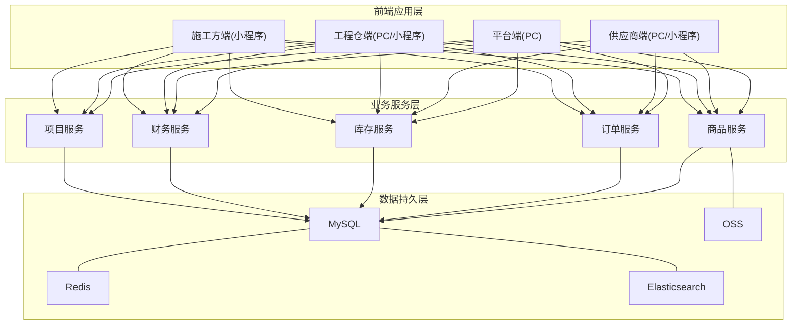

**图表来源**
- [平台端/01-系统概览与架构.md:70-100](file://docs/01_PRD/平台端/01-系统概览与架构.md#L70-L100)
- [工程仓端/03-数据模型与表结构.md:132-150](file://docs/01_PRD/工程仓端/03-数据模型与表结构.md#L132-L150)
- [供应商端/03-数据模型与表结构.md:153-193](file://docs/01_PRD/供应商端/03-数据模型与表结构.md#L153-L193)
- [施工方端/03-数据模型与表结构.md:147-186](file://docs/01_PRD/施工方端/03-数据模型与表结构.md#L147-L186)

**章节来源**
- [平台端/01-系统概览与架构.md:66-100](file://docs/01_PRD/平台端/01-系统概览与架构.md#L66-L100)
- [工程仓端/03-数据模型与表结构.md:132-150](file://docs/01_PRD/工程仓端/03-数据模型与表结构.md#L132-L150)
- [供应商端/03-数据模型与表结构.md:153-193](file://docs/01_PRD/供应商端/03-数据模型与表结构.md#L153-L193)
- [施工方端/03-数据模型与表结构.md:147-186](file://docs/01_PRD/施工方端/03-数据模型与表结构.md#L147-L186)

## 详细组件分析

### 平台端功能设计

#### 核心设计原则
平台端是整个采供一体化平台的**管理中枢**，核心职责是"管"不是"交易"。采用"审核管控+数据统一定义"的设计原则，确保平台对商户、商品、订单、财务等全链路的管控能力。

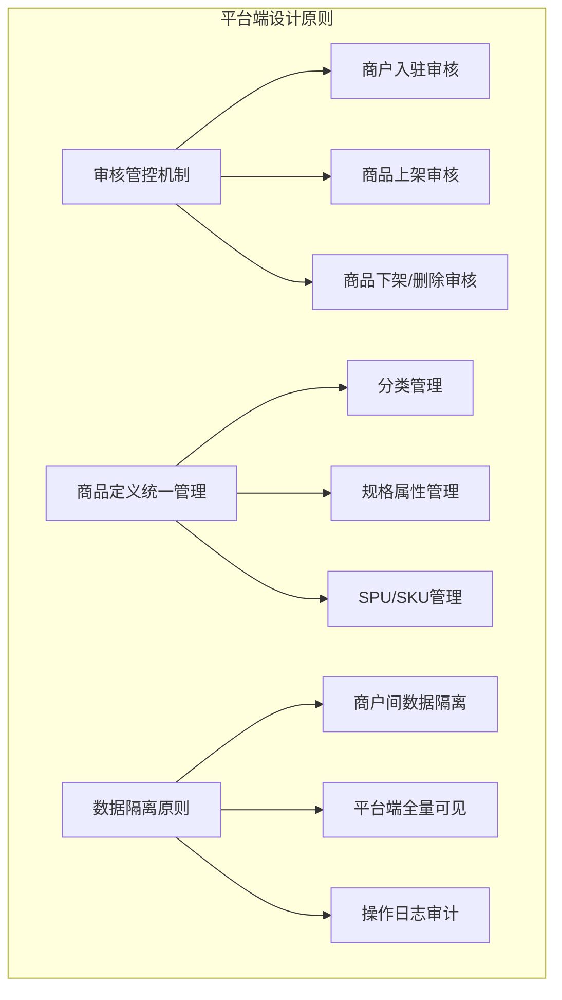

**图表来源**
- [平台端/prd.md:39-89](file://docs/01_PRD/平台端/prd.md#L39-L89)

#### 用户角色与权限矩阵
平台端包含管理员、运营、财务、客服、超管五个核心角色，每个角色具有明确的权限边界和操作范围。

| 角色 | 系统标识 | 核心职责 | 使用端 | 权限范围 |
|------|---------|---------|:------:|---------|
| **平台管理员** | admin | 商户管理、系统配置、全平台监控 | PC | 所有功能 |
| **平台运营** | operator | 商品管理、商品市场、订单监控 | PC | 商品相关功能 |
| **平台财务** | finance | 支付流水、发票管理、分账管理 | PC | 财务相关功能 |
| **平台客服** | service | 订单售后协调、商户服务 | PC | 售后处理 |
| **平台超管** | super_admin | 所有权限，不可修改 | PC | 超级权限 |

**章节来源**
- [平台端/prd.md:106-135](file://docs/01_PRD/平台端/prd.md#L106-L135)

#### 功能全景
平台端涵盖8大模块54个功能点，包括工作台、商户管理、商品管理、商品市场、订单管理、库存管理、财务中心、系统设置等核心功能。

**章节来源**
- [平台端/prd.md:138-197](file://docs/01_PRD/平台端/prd.md#L138-L197)

### 工程仓端功能设计

#### 核心设计原则
工程仓端采用"三状态分离"的设计原则，订单主状态、支付状态、发货状态相互独立运行，适应熟人生意的线下转账特点。

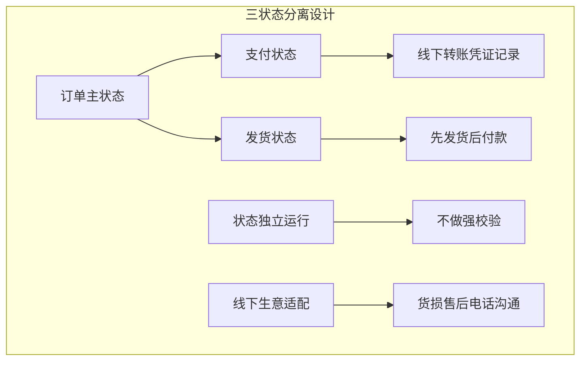

**图表来源**
- [工程仓端/prd.md:41-91](file://docs/01_PRD/工程仓端/prd.md#L41-L91)

#### 用户角色与权限矩阵
工程仓端包含采购员、仓管员、主管、财务人员、销售五个核心角色，每个角色具有明确的操作权限和职责范围。

| 角色 | 系统标识 | 核心职责 | 使用端 | 权限范围 |
|------|---------|---------|:------:|---------|
| **采购员** | purchaser | 浏览商品、购物车、下单采购、采购计划 | PC | 采购相关功能 |
| **仓管员** | storekeeper | 入库收货、出库发货、库存查看 | PC | 仓储相关功能 |
| **主管/管理员** | admin | 数据看板、订单监控、员工权限管理 | PC | 管理相关功能 |
| **财务人员** | finance | 支付记录、发票管理、对账管理 | PC | 财务相关功能 |
| **销售** | seller | 销售订单处理、确认发货 | PC | 销售相关功能 |

**章节来源**
- [工程仓端/prd.md:111-142](file://docs/01_PRD/工程仓端/prd.md#L111-L142)

#### 功能全景
工程仓端涵盖9大模块51个功能点，包括工作台、商户中心、商品市场、采购计划、商品中心、采购订单、销售订单、仓库管理、财务中心、系统设置等核心功能。

**章节来源**
- [工程仓端/prd.md:145-200](file://docs/01_PRD/工程仓端/prd.md#L145-L200)

### 供应商端功能设计

#### 核心设计原则
供应商端采用"订单三状态分离+商品两段定义"的设计原则，供应商作为商品供应方和订单履约方，核心职责是"接单+发货"。

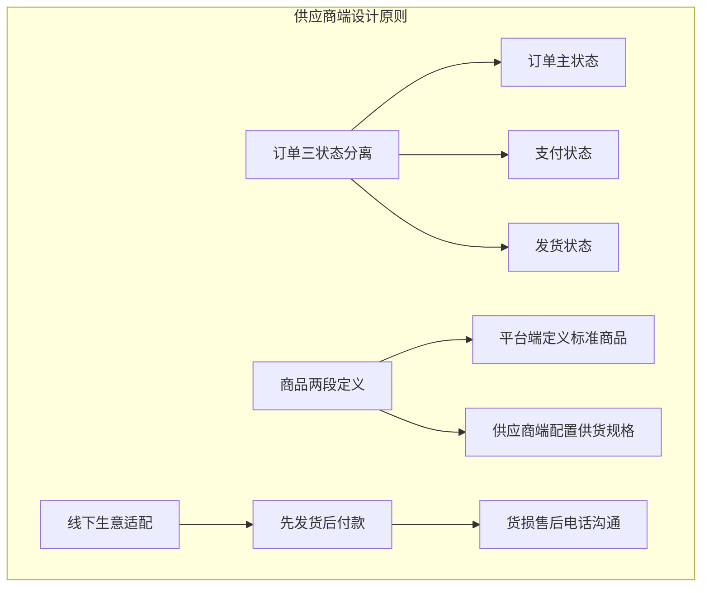

**图表来源**
- [供应商端/prd.md:36-75](file://docs/01_PRD/供应商端/prd.md#L36-L75)

#### 用户角色与权限矩阵
供应商端包含管理员、业务员、仓管员、财务人员、客服五个核心角色，每个角色具有明确的操作权限和职责范围。

| 角色 | 系统标识 | 核心职责 | 使用端 | 权限范围 |
|------|---------|---------|:------:|---------|
| **管理员** | admin | 全功能管理，含账号/角色配置 | PC | 所有功能 |
| **业务员** | operator | 日常订单处理、商品管理 | PC | 业务相关功能 |
| **仓管员** | warehouse | 发货操作、库存管理 | PC | 仓储相关功能 |
| **财务人员** | finance | 发票管理、结算对账 | PC | 财务相关功能 |
| **客服** | service | 售后处理、补发管理 | PC | 售后相关功能 |

**章节来源**
- [供应商端/prd.md:92-118](file://docs/01_PRD/供应商端/prd.md#L92-L118)

#### 功能全景
供应商端涵盖8大模块31个功能点，包括工作台、商户信息、商品中心、订单管理、财务中心、系统设置等核心功能。

**章节来源**
- [供应商端/prd.md:121-156](file://docs/01_PRD/供应商端/prd.md#L121-L156)

### 施工方端功能设计

#### 核心设计原则
施工方端采用"轻量采购+移动优先"的设计原则，以项目为组织维度管理采购，移动端为主要使用端。

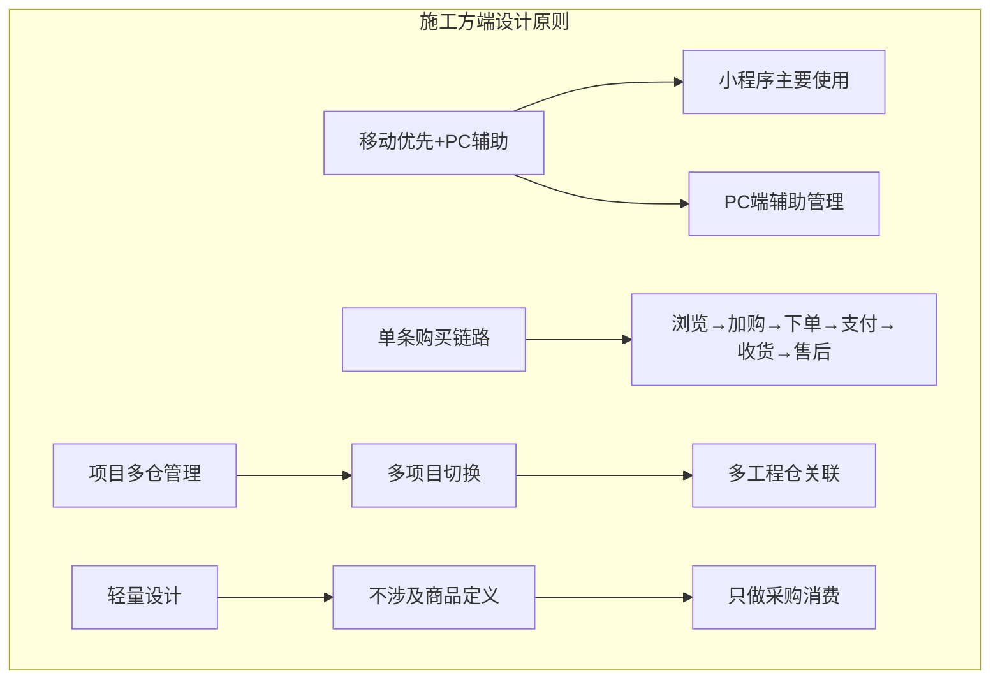

**图表来源**
- [施工方端/prd.md:36-78](file://docs/01_PRD/施工方端/prd.md#L36-L78)

#### 用户角色与权限矩阵
施工方端包含项目管理员、采购员、仓管员、项目成员四个核心角色，每个角色具有明确的操作权限和职责范围。

| 角色 | 系统标识 | 核心职责 | 使用端 | 权限范围 |
|------|---------|---------|:------:|---------|
| **项目管理员** | admin | 项目采购管理、订单审批 | PC/小程序 | 项目管理功能 |
| **采购员** | buyer | 日常商品选购、下单 | 📱 小程序 | 采购相关功能 |
| **仓管员** | warehouse | 收货确认、库存查询 | 📱 小程序 | 仓储相关功能 |
| **项目成员** | member | 商品浏览、查看订单 | 📱 小程序 | 基础查看功能 |

**章节来源**
- [施工方端/prd.md:93-118](file://docs/01_PRD/施工方端/prd.md#L93-L118)

#### 功能全景
施工方端涵盖9大模块28个功能点，包括首页、商品市场、购物车、订单管理、库存与个人中心等核心功能。

**章节来源**
- [施工方端/prd.md:121-154](file://docs/01_PRD/施工方端/prd.md#L121-L154)

### 供应商商品中心功能设计

#### 核心设计原则
供应商商品中心遵循"两段定义"中的第二段——供应商负责商品价格和库存，不干预商品规格定义。

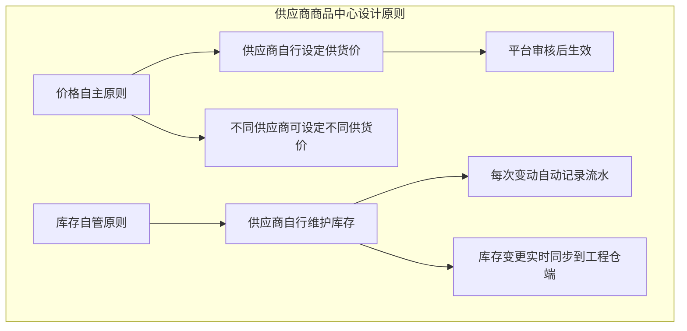

**图表来源**
- [供应商端/06-商品中心功能设计.md:55-70](file://docs/01_PRD/供应商端/06-商品中心功能设计.md#L55-L70)

#### 用户角色与权限矩阵
供应商商品中心包含管理员、业务员、运营专员三个核心角色，每个角色具有明确的操作权限和职责范围。

| 角色 | 系统标识 | 核心职责 | 使用端 | 权限范围 |
|------|---------|---------|:------:|---------|
| **管理员** | admin | 全功能管理，含账号/角色配置 | PC | 所有功能 |
| **业务员** | operator | 日常订单处理、商品管理 | PC | 业务相关功能 |
| **运营专员** | operator-assistant | 协助管理商品信息 | PC | 商品相关功能 |

**章节来源**
- [供应商端/06-商品中心功能设计.md:114-124](file://docs/01_PRD/供应商端/06-商品中心功能设计.md#L114-L124)

#### 功能全景
供应商商品中心涵盖商品管理、库存管理两大模块，共计7个功能点，包括商品列表、新增商品、编辑商品、详情、上下架、库存查询、库存流水等核心功能。

**章节来源**
- [供应商端/06-商品中心功能设计.md:137-213](file://docs/01_PRD/供应商端/06-商品中心功能设计.md#L137-L213)

#### 非功能性需求
供应商商品中心功能的性能要求如下：

| 接口/场景 | P95要求 |
|:---------|:-------:|
| 商品列表查询 | ≤ 500ms |
| 新增商品提交 | ≤ 1s |
| 库存查询 | ≤ 300ms |

**章节来源**
- [供应商端/06-商品中心功能设计.md:127-134](file://docs/01_PRD/供应商端/06-商品中心功能设计.md#L127-L134)

#### 异常处理汇总表
供应商商品中心功能的异常处理如下：

| 异常场景 | 前端处理 | 提示文案 |
|:--------|:--------|---------|
| 供货价≤0 | 表单标红 | "供货价必须大于0" |
| 重复添加SKU | Toast | "该商品已添加，请勿重复操作" |
| 审核不通过→上架 | Toast | "该商品审核不通过，请重新提交" |
| 商品列表加载失败 | 重试按钮 | "商品列表加载失败" |

**章节来源**
- [供应商端/06-商品中心功能设计.md:215-223](file://docs/01_PRD/供应商端/06-商品中心功能设计.md#L215-L223)

#### 接口依赖建议
供应商商品中心功能的接口依赖如下：

| 接口 | 用途 | 性能要求 |
|:----|:----|:--------:|
| `/api/supplier/product/list` | 商品列表 | P95 ≤ 500ms |
| `/api/supplier/product/create` | 新增商品 | P95 ≤ 1s |
| `/api/supplier/product/toggle-status` | 上下架 | P95 ≤ 500ms |
| `/api/supplier/product/edit` | 编辑商品 | P95 ≤ 500ms |
| `/api/supplier/inventory/list` | 库存查询 | P95 ≤ 300ms |
| `/api/supplier/inventory/flow` | 库存流水 | P95 ≤ 300ms |

**章节来源**
- [供应商端/06-商品中心功能设计.md:226-235](file://docs/01_PRD/供应商端/06-商品中心功能设计.md#L226-L235)

#### 状态流转图
供应商商品中心商品状态流转如下：

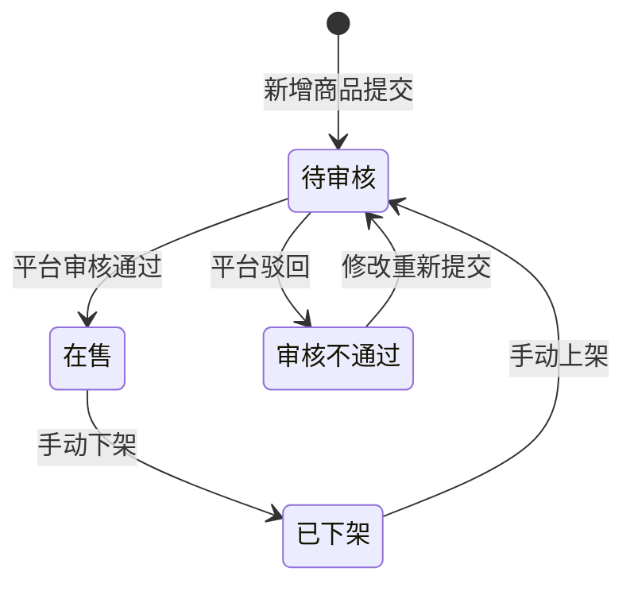

**图表来源**
- [供应商端/06-商品中心功能设计.md:239-251](file://docs/01_PRD/供应商端/06-商品中心功能设计.md#L239-L251)

#### 状态治理矩阵
供应商商品中心功能的状态治理矩阵如下：

##### 动作定义表
| 动作ID | 动作名称 | 触发方式 | 说明 |
|:-----:|---------|---------|------|
| SPD-01 | 新增商品 | 点击按钮 | 从平台库选择并提交审核 |
| SPD-02 | 编辑商品 | 点击编辑 | 修改供货价/库存 |
| SPD-03 | 上架商品 | 点击上架 | 商品提交审核 |
| SPD-04 | 下架商品 | 点击下架 | 商品变为下架状态 |

##### 状态×操作矩阵
| 状态 \ 操作 | SPD-01新增 | SPD-02编辑 | SPD-03上架 | SPD-04下架 |
|:----------:|:----------:|:----------:|:----------:|:----------:|
| **待审核** | ✅ | ✅ | ❌ | ❌ |
| **在售** | ✅ | ✅ | ❌ | ✅ |
| **已下架** | ✅ | ✅ | ✅ | ❌ |
| **审核不通过** | ✅ | ✅ | ❌ | ❌ |

**章节来源**
- [供应商端/06-商品中心功能设计.md:255-282](file://docs/01_PRD/供应商端/06-商品中心功能设计.md#L255-L282)

### 数据模型与表结构

#### 平台端数据模型
平台端采用统一的商户管理、商品定义、市场管理、系统配置等核心数据模型，确保平台对全链路的管控能力。

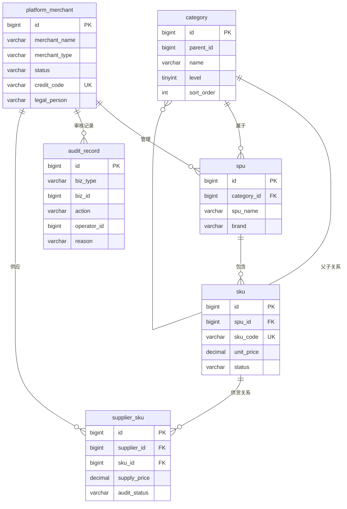

**图表来源**
- [平台端/03-数据模型与表结构.md:201-255](file://docs/01_PRD/平台端/03-数据模型与表结构.md#L201-L255)

**章节来源**
- [平台端/03-数据模型与表结构.md:66-114](file://docs/01_PRD/平台端/03-数据模型与表结构.md#L66-L114)

#### 工程仓端数据模型
工程仓端采用三状态分离的订单设计、乐观锁并发控制、批次追溯等核心数据模型，确保仓储管理的准确性。

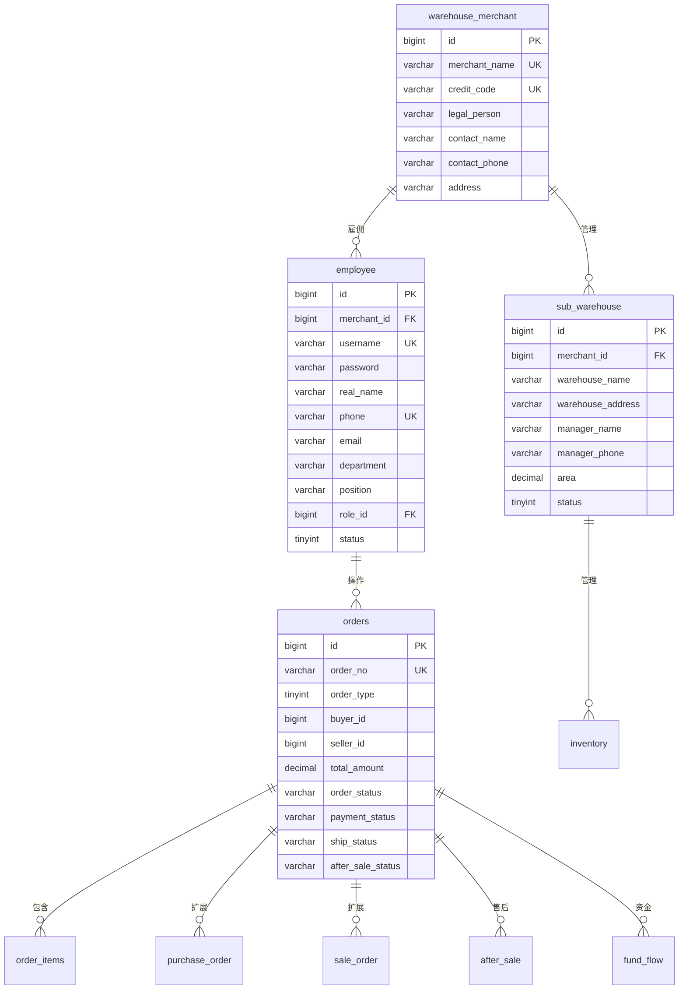

**图表来源**
- [工程仓端/03-数据模型与表结构.md:357-373](file://docs/01_PRD/工程仓端/03-数据模型与表结构.md#L357-L373)

**章节来源**
- [工程仓端/03-数据模型与表结构.md:78-150](file://docs/01_PRD/工程仓端/03-数据模型与表结构.md#L78-L150)

#### 供应商端数据模型
供应商端采用标准商品引用、订单履约、售后处理、发票管理等核心数据模型，确保供应链管理的完整性。

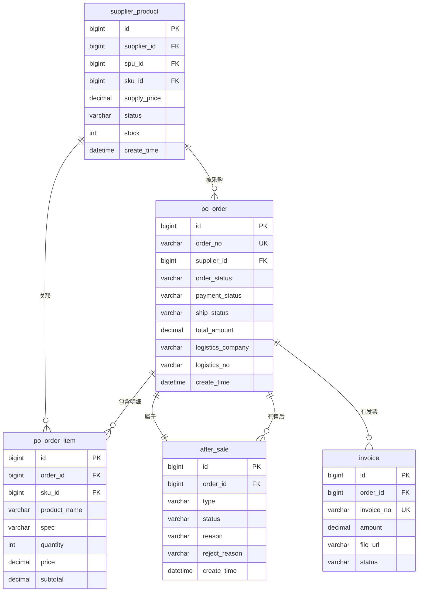

**图表来源**
- [供应商端/03-数据模型与表结构.md:153-193](file://docs/01_PRD/供应商端/03-数据模型与表结构.md#L153-L193)

**章节来源**
- [供应商端/03-数据模型与表结构.md:57-95](file://docs/01_PRD/供应商端/03-数据模型与表结构.md#L57-L95)

#### 施工方端数据模型
施工方端采用项目组织、购物车管理、销售订单、售后处理等核心数据模型，确保项目采购管理的完整性。

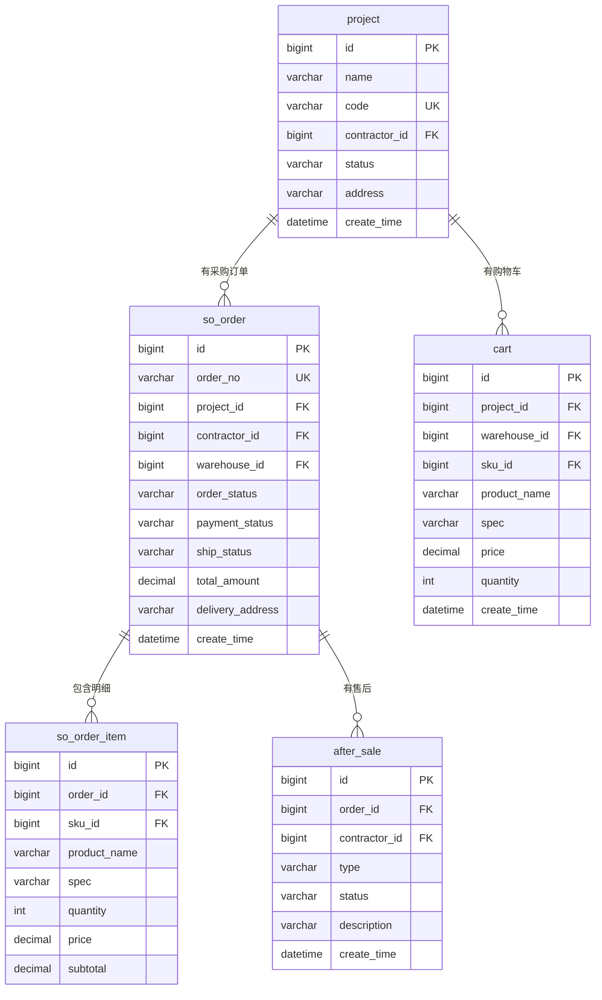

**图表来源**
- [施工方端/03-数据模型与表结构.md:147-186](file://docs/01_PRD/施工方端/03-数据模型与表结构.md#L147-L186)

**章节来源**
- [施工方端/03-数据模型与表结构.md:55-86](file://docs/01_PRD/施工方端/03-数据模型与表结构.md#L55-L86)

### 业务流程设计

#### 平台端核心业务流程
平台端涵盖商户入驻审核、商品全生命周期管理、全平台订单监控、供应商供货管理等四大核心业务流程。

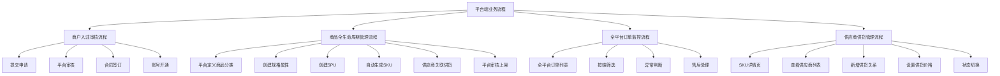

**图表来源**
- [平台端/02-业务流程设计.md:40-208](file://docs/01_PRD/平台端/02-业务流程设计.md#L40-L208)

**章节来源**
- [平台端/02-业务流程设计.md:15-120](file://docs/01_PRD/平台端/02-业务流程设计.md#L15-L120)

#### 工程仓端核心业务流程
工程仓端涵盖双交易链路、采购订单三状态流转、入库货损售后流程、出库发货流程等四大核心业务流程。

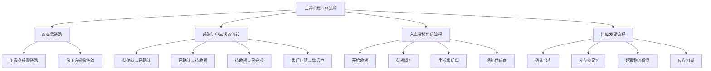

**图表来源**
- [工程仓端/prd.md:622-700](file://docs/01_PRD/工程仓端/prd.md#L622-L700)

**章节来源**
- [工程仓端/prd.md:622-700](file://docs/01_PRD/工程仓端/prd.md#L622-L700)

#### 供应商端核心业务流程
供应商端涵盖订单履约链路、商品上架审核流程、售后补发流程等三大核心业务流程。

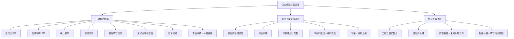

**图表来源**
- [供应商端/02-业务流程设计.md:67-196](file://docs/01_PRD/供应商端/02-业务流程设计.md#L67-L196)

**章节来源**
- [供应商端/02-业务流程设计.md:67-196](file://docs/01_PRD/供应商端/02-业务流程设计.md#L67-L196)

#### 施工方端核心业务流程
施工方端涵盖施工方采购流程、订单生命周期等两大核心业务流程。

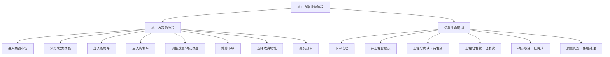

**图表来源**
- [施工方端/prd.md:157-196](file://docs/01_PRD/施工方端/prd.md#L157-L196)

**章节来源**
- [施工方端/prd.md:157-196](file://docs/01_PRD/施工方端/prd.md#L157-L196)

### 功能清单与详细设计

#### 平台端功能清单
平台端涵盖8大模块54个功能点，包括工作台、商户管理、商品管理、商品市场、订单管理、库存管理、财务中心、系统设置等核心功能。

**章节来源**
- [平台端/prd.md:138-197](file://docs/01_PRD/平台端/prd.md#L138-L197)

#### 工程仓端功能清单
工程仓端涵盖9大模块51个功能点，包括工作台、商户中心、商品市场、采购计划、商品中心、采购订单、销售订单、仓库管理、财务中心、系统设置等核心功能。

**章节来源**
- [工程仓端/prd.md:145-200](file://docs/01_PRD/工程仓端/prd.md#L145-L200)

#### 供应商端功能清单
供应商端涵盖8大模块31个功能点，包括工作台、商户信息、商品中心、订单管理、财务中心、系统设置等核心功能。

**章节来源**
- [供应商端/prd.md:121-156](file://docs/01_PRD/供应商端/prd.md#L121-L156)

#### 施工方端功能清单
施工方端涵盖9大模块28个功能点，包括首页、商品市场、购物车、订单管理、库存与个人中心等核心功能。

**章节来源**
- [施工方端/prd.md:121-154](file://docs/01_PRD/施工方端/prd.md#L121-L154)

## 跨部门协同PRD

### 项目团队与里程碑

#### 核心团队
项目团队成员已进行调整，确保跨部门协同的有效推进：

| 角色 | 负责人 |
|:-----|:------|
| **业务负责人** | 刘朗云 |
| **产品负责人** | 王飞 |
| **项目负责人** | 韩立平 |
| **技术负责人** | 徐俊 |
| **前端负责人** | 黄模荣 |
| **测试负责人** | 周云鹏 |

#### 项目组成员
项目组成员涵盖前端、后端、测试三个方向：

| 方向 | 成员 |
|:-----|:------|
| **前端** | 黄模荣、李瑞禧 |
| **后端** | 徐俊、郭纪伟、彭涛、朱俊池 |
| **测试** | 周云鹏、关铭伟 |

#### 项目里程碑计划
项目里程碑计划已更新，关键交付物和时间安排如下：

| 里程碑 | 计划完成日期 | 关键交付物 | 负责人 |
|:-------|:-----------|:----------|:------|
| 项目启动会 | 4-22 | 项目章程、团队组建 | 韩立平/王飞/刘荣蓉 |
| 需求评审完成（已内部评审部分） | 3-20 | 需求文档/系统demo | 王飞 |
| 设计评审完成 | - | UI 设计稿、技术方案 | - |
| 开发/执行完成 | 待定 | 可交付的成果 | 徐俊 |
| 测试验收完成 | 6-30 | 测试报告、用户验收确认 | 周云鹏 |
| 正式上线/发布 | 6-30 | 上线部署 | 徐俊 |
| 项目复盘/结项 | 7-20 | 结项报告 | 王飞 |

#### 分阶段排期计划
项目已制定详细的分阶段排期计划，确保各阶段有序推进：

| 阶段 | 内容 | 当前进度 | 预计完成日期 |
|:-----|:-----|:--------|:------------|
| **第一阶段** | 基建：商户管理能力，商品管理，商品市场 | 测试阶段 | 3-4月 |
| **第二阶段** | 工程仓-供应商的交易链路，工程仓端管理功能（仓库管理，采购订单交易） | 研发阶段 | 5月初 |
| **第三阶段** | 施工方与工程仓端交易链路，施工方端管理功能-联动工程系统项目管理 | 待评审 | 5月底 |
| **第四阶段** | 工程仓虚拟户管理，销售交易链路涉及的财务分账能力（重点） | 待评审 | 6月初 |
| **第五阶段** | 整体联调，上线测试 | 待启动 | 6月底 |
| **第六阶段** | 培训阶段，切换老系统（切换方案） | 待启动 | 7月 |
| **第七阶段** | 正式上线 | 待启动 | 7月 |

#### 沟通机制
建立完善的沟通机制，确保项目进展透明：

| 沟通内容 | 频率/时机 | 方式 | 参与人 | 目的 |
|:--------|:---------|:-----|:------|:-----|
| 项目例会 | 每日5点半 | 现场/视频会议 | 核心团队 | 同步进度、解决问题 |
| 项目周报 | 每周周五下班前 | 邮件 | 全员 | 正式汇报状态 |
| 双周汇报 | 双周周五 | 现场/视频会议 | 核心团队/业务人员 | 跨部门进度对齐 |
| 里程碑评审 | 里程碑节点 | 评审会议 | 核心团队+协同团队 | 确认阶段成果、调整方向 |
| 风险/问题升级 | 发生时 | 即时消息 + 邮件 | 项目经理 + 相关决策者 | 快速响应 |

### 系统协同架构

#### 系统协同架构图
项目采用四端协同 + 多中台集成的复杂系统架构，跨部门协同分为两个层面：

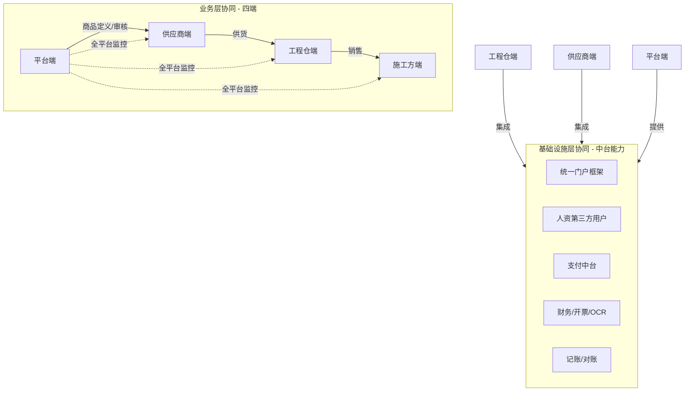

#### 平台撮合费记账链路架构图
项目采用非空中分账模式，资金不经过平台对公户，全程闭环在支付中台虚拟户体系内：


**平台记账核心原则**：
- ✅ **平台收入**：施工方与工程仓交易产生的撮合服务费（订单金额 × 约定费率（按商品））
- ❌ **不记账范围**：施工方货款、采购支付等（属于代收代付，不确认为平台收入）

#### 记账跨部门协同分工
建立明确的记账跨部门协同分工：

| 部门/系统 | 记账相关职责 | 关键输出 | 对接财务时间点 |
|:---------|:------------|:---------|:--------------|
| **工程仓产品部** | 1. 计算撮合费率<br/>2. 触发划扣时机<br/>3. 提供订单业务数据 | 撮合费计算结果、划扣指令 | T+1 日 10:00 前 |
| **支付中台** | 1. 执行撮合费划扣<br/>2. 生成划扣成功/失败流水<br/>3. 自动重试机制 | 划扣记录、支付流水 | 实时推送 → 记账系统 |
| **鸣鸣很忙财务系统** | 1. 接收划扣流水自动记账<br/>2. 生成记账凭证<br/>3. 登记入账簿 | 记账凭证数据、入账确认 | 划扣成功后 30 分钟内 |
| **对账系统/财务部** | 1. 业务应收 vs 实收对账<br/>2. 差异处理<br/>3. 最终记账确认 | 对账报告、记账确认标记 | T+1 日 15:00 前完成 |

#### 核心交易链路时序图
销售与采购独立双主线：工程仓先收款 → 再主动向平台支付撮合费（非空中分账模式）。

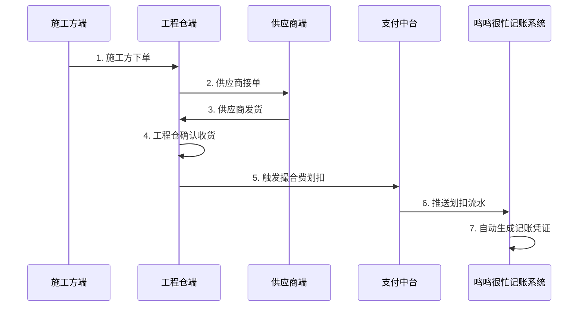

### 跨部门干系人与提供物清单

#### 业务层协同 — 四端职责矩阵
四端在业务层协同中的核心职责：

| 端 | 核心职责 | 提供物 | 消费物 |
|:--|:--------|:------|:------|
| **平台端** | 商品标准定义、商户入驻审核、全平台监控 | 分类/属性/SPU/SKU标准、审核结果、监控数据 | 各端业务数据 |
| **供应商端** | 商品供应、订单履约、售后处理 | 供货价/库存、接单/发货、售后单处理 | 采购订单、商品标准 |
| **工程仓端** | 商品采购、销售、仓库管理 | 采购订单、销售订单、库存变动 | 供货价、销售价、商品信息 |
| **施工方端** | 商品选购、订单跟踪 | 销售订单、收货确认 | 商品信息、销售价 |

#### 基础设施层协同 — 各部门提供物清单
基础设施层协同涉及多个部门的提供物：

| 部门/系统 | 负责人 | 交付节点 | 需提供内容 | 消费方 |
|:---------|:------|:--------|:----------|:------|
| **基础平台** | 李强 / 李论/ 王飞 | 进行中 | ① Portal SDK（统一登录、Token管理）<br/>② RBAC权限模型接口（角色/菜单/按钮权限）<br/>③ 门户框架组件（布局、导航、顶部栏） | 工程仓端、各端 |
| **人资系统** | 廖宇 | 5-8 | ① 第三方用户创建 API<br/>② 用户信息同步接口（人资→门户→各端）<br/>③ 角色绑定接口<br/>④ 用户生命周期管理（创建/禁用/续期/删除） | 工程仓端 |
| **支付中台** | 畅岩凝 | （待评估） | ① 虚拟账户开立 API（一期不用）<br/>② 充值接口 + 到账回调<br/>③ 提现接口（虚拟户→银行账户）<br/>④ 触发划扣接口<br/>⑤ 余额查询接口<br/>⑥ 流水查询接口 | 工程仓端 |
| **财务系统（开票）** | 黄焜 | 现有能力（联调提前通知） | ① 电子发票开具 API<br/>② 发票 OCR 识别 API<br/>③ 开票结果回调通知 | 工程仓端 |
| **鸣鸣很忙（记账）** | 李欣欣 / 畅岩凝 | 现有能力 | ① 撮合费记账 API（仅记录平台收入）<br/>② 记账凭证生成接口<br/>③ 记账状态回调通知<br/>④ 凭证数据查询接口 | 工程仓端 → 支付中台 |
| **财务系统（对账）** | — | 现有能力 | ① 交易对账数据接口<br/>② 支付对账数据接口<br/>③ 发票对账数据接口 | 工程仓端 |

#### 各方接口对接依赖
建立详细的接口对接依赖关系：

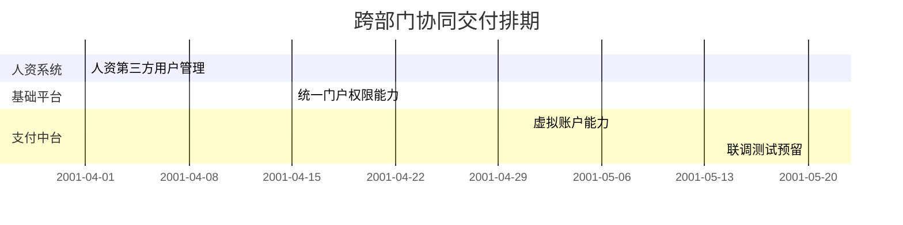

### 工程仓端跨部门集成架构
工程仓端采用统一集成层架构，实现与各外部系统的无缝对接：

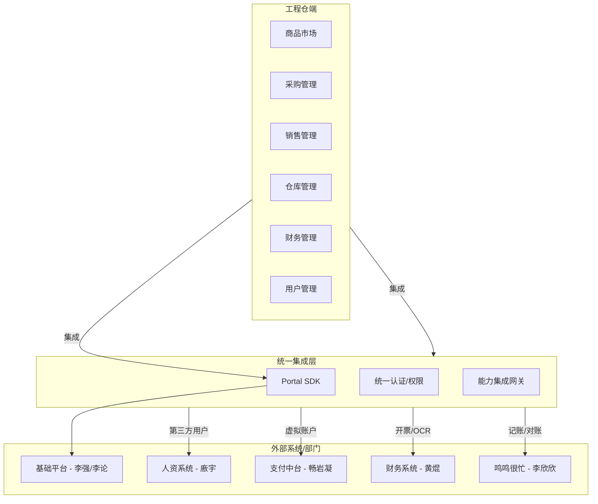

### 各部门提供内容详解

#### 基础平台（李强/李论）
**提供物**：Portal SDK 集成包

| 模块 | 提供形式 | 说明 |
|:----|:--------|:----|
| 统一登录 | SDK / API | 账号密码登录、SSO、Token 发放与刷新 |
| 权限认证 | SDK / API | 角色校验、功能菜单权限、按钮权限 |
| 门户框架 | UI 组件 | 公共布局、导航菜单、顶部栏、个人中心 |
| 用户信息 | API | 当前登录用户信息、角色列表 |

**工程仓端集成方式**：引入 Portal SDK → 配置应用信息 → 对接登录/权限接口

#### 人资系统（廖宇）
**提供物**：第三方用户管理 API

| 接口 | 方向 | 说明 |
|:----|:----|:----|
| 第三方用户创建 | 人资 → 门户 | 创建临时账号，指定角色和有效期 |
| 用户同步 | 人资 → 门户 → 各端 | 新增/变更/禁用时同步到门户，门户再同步到各端 |
| 角色绑定 | 人资 → 门户 | 第三方账号关联 RBAC 角色 |
| 生命周期管理 | 人资 → 门户 | 到期自动禁用 / 手动续期 / 提前删除 |

**工程仓端关注点**：
- 第三方用户登录后能正常访问工程仓端
- 权限按角色配置生效
- 用户到期后自动退出并锁定

#### 支付中台（畅岩凝）
**提供物**：虚拟账户能力 API

| 能力 | 接口方向 | 触发时机 | 同步/异步 |
|:----|:--------|:--------|:--------:|
| 账户开立 | 工程仓→支付中台 | 工程仓商户入驻完成 | 同步 |
| 充值 | 工程仓→支付中台 | 线下转账→上传凭证→确认到账 | 异步（人工确认） |
| 提现 | 工程仓→支付中台 | 财务发起提现申请 | 异步（银行处理） |
| 触发划扣 | 订单系统→支付中台 | 订单进入结算阶段 | 同步 |
| 余额查询 | 工程仓→支付中台 | 实时查询 | 同步 |
| 流水查询 | 工程仓→支付中台 | 查询历史记录 | 同步 |

**注意**：当前无在线支付网关，充值为线下转账→上传凭证→支付中台人工确认到账

#### 财务系统 - 开票 & OCR（黄焜）
**提供物**：开票 + OCR API

| 接口 | 说明 | 前置条件 |
|:----|:----|:--------|
| 开票申请 | 工程仓发起开票请求 → 平台端开票 | 订单已完成 |
| 开票结果回调 | 开票完成后通知工程仓 | 平台端开票完成 |
| OCR 识别 | 上传发票图片 → 返回结构化字段（金额、税号、日期等） | 发票图片清晰 |

**联调要求**：需提前通知黄焜，对齐接口字段和回调协议

#### 鸣鸣很忙 — 撮合费记账（李欣欣/畅岩凝）
**记账边界重申**：平台视角仅记录撮合费收入

- ✅ **记**：订单完成时，从工程仓虚拟户划扣到平台账户的撮合服务费
- ❌ **不记**：施工方货款、采购支付、工程仓钱包内的资金流转

**提供物**：撮合费记账专属 API

| 接口名称 | 调用方向 | 触发时机 | 关键字段 | 记账动作 |
|:---------|:--------|:--------|:---------|:---------|
| 撮合费划扣流水推送 | 支付中台 → 记账系统 | 划扣成功实时推送 | `订单号`、`划扣金额`、`费率`、`划扣时间`、`工程仓ID` | 预记账 |
| 记账凭证生成接口 | 记账系统 → 财务系统 | 划扣成功后自动生成 | `凭证号`、`借贷分录`、`制单人`、`制单时间` | 生成会计凭证 |
| 记账状态回调通知 | 记账系统 → 支付中台/工程仓 | 记账完成后通知 | `凭证号`、`记账状态`、`记账时间` | 记账确认 |
| 凭证数据查询接口 | 工程仓 → 记账系统 | 对账时调用 | `订单号`、`记账金额`、`凭证编号` | 对账依据 |

**对接方式**：
1. 支付中台撮合费划扣成功 → 自动推送流水到记账系统
2. 记账系统接收流水 → 自动生成凭证并登记入账簿
3. 对账系统调用凭证数据 → 与业务预期撮合费金额核对

#### 记账联调计划（核心）
建立详细的记账联调计划：

| 联调阶段 | 计划时间 | 参与方 | 联调内容 | 验收标准 |
|:--------|:--------|:-------|:---------|:---------|
| **接口对齐** | T-7 日 | 支付中台 + 记账系统 | 流水推送字段、回调协议 | 接口文档签字确认 |
| **单系统联调** | T-5 日 | 记账系统 | 流水接收 → 生成凭证 | 凭证借贷平衡、科目正确 |
| **跨系统联调** | T-3 日 | 支付中台 ⟷ 记账系统 | 划扣成功 → 推送流水 → 记账 → 回调 | 端到端流程跑通 |
| **对账联调** | T-2 日 | 工程仓 ⟷ 记账系统 ⟷ 财务部 | 预期应收 vs 实际记账 | 差异率 < 0.1% |
| **生产验证** | T日 | 全部门 | 真实订单全链路验证 | 3笔连续订单验证通过 |

**异常场景必须覆盖**：
- ✅ 划扣成功 → 推送失败 → 重试机制
- ✅ 重复推送同一条流水 → 幂等处理
- ✅ 记账失败 → 告警通知财务介入
- ✅ 金额不一致 → 自动标记差异待人工

#### 对账能力
建立完善的对账能力：

| 对账类型 | 数据来源 | 对账周期 | 主责 |
|:--------|:--------|:--------|:----|
| 交易对账 | 采购订单金额核对 | 每日 | 工程仓 ⟷ 供应商 |
| 支付对账 | 虚拟账户流水核对 | 每日 | 工程仓 ⟷ 支付中台 |
| 发票对账 | 开票记录核对 | 定期 | 工程仓 ⟷ 平台端 |

### 协同风险与依赖
建立风险管控机制：

| 风险 | 影响 | 等级 | 应对措施 |
|:----|:----|:----:|:--------|
| 支付中台排期未确认 | 虚拟账户依赖支付中台排期 | 🔴 高 | 提前与畅岩凝沟通排期，备选方案：暂用线下转账 |
| 联调窗口协调风险 | 开票/OCR 联调需提前通知 | 🟡 中 | 提前两周通知黄焜，预留 3-5 天联调时间 |
| 多系统集成复杂度 | 统一门户 SDK 版本兼容性 | 🟡 中 | 分模块分批验收，优先完成登录/权限集成 |
| 人资系统接口变更 | 第三方用户管理依赖人资接口 | 🟢 低 | 接口变更后按约定更新时间窗口 |

### 跨部门泳道图

#### 典型场景：供应商完整业务流程
```mermaid
sequenceDiagram
participant P as 平台端
participant S as 供应商端
participant W as 工程仓端
participant HR as 人资系统
participant PAY as 支付中台
participant FIN as 财务系统
Note over P,FIN : 一、供应商入驻流程
P->>HR : 审核通过，调用创建第三方用户
HR-->>P : 返回用户ID + Token
P->>S : 发送入驻成功通知
S->>P : 登录Portal统一SDK
Note over P,FIN : 二、供货结算流程
S->>W : 提交供货价 + 库存
W->>S : 确认供货采购单
S->>W : 发货
W->>PAY : 结算打款触发划扣
PAY-->>W : 返回划扣结果
W->>FIN : 记账调用鸣鸣很忙
W->>FIN : 开票申请
FIN-->>W : 返回电子发票
Note over P,FIN : 三、权限校验每次请求
S->>P : 请求携带Token
P-->>S : Portal SDK统一校验权限
```

#### 技术集成泳道图
```mermaid
graph TB
subgraph 工程仓端
FE[前端页面]
BE[后端服务]
end
subgraph 基础平台
SDK[Portal SDK]
RBAC[权限中心]
end
subgraph 人资系统
HRAPI[第三方用户API]
end
subgraph 支付中台
PAYAPI[虚拟账户API]
end
subgraph 财务系统
INV[开票API]
OCR[OCR识别API]
ACC[记账API]
end
FE --> SDK
BE --> SDK
SDK --> RBAC
BE --> HRAPI
BE --> PAYAPI
BE --> INV
BE --> OCR
BE --> ACC
```

### 接口契约（待评审后填写）
**填写说明**：本章节为预留模板，评审通过后由各系统对接人在此补充具体接口定义。

✅ **填写原则**：
- 每个跨系统对接接口，必须在此填写一份
- 请求/响应字段与类型，必须与代码一致
- 错误码与处理方式，必须明确可执行
- 本页更新后，群内周知所有消费方

#### 接口总览表（对接人评审后填写）

| 序号 | 接口名称 | 调用方 | 提供方 | 对接人 | 计划联调日期 | 状态 |
|:----|:--------|:------|:------|:------|:-----------:|:----:|
| 1 | 创建第三方用户 | 工程仓端 | 人资系统 | ☐ 廖宇 | | ☐ 待确认 |
| 2 | 虚拟账户开立 | 工程仓端 | 支付中台 | ☐ 畅岩凝 | | ☐ 待确认 |
| 3 | 开具电子发票 | 工程仓端 | 财务系统 | ☐ 黄焜 | | ☐ 待确认 |
| 4 | 发票OCR识别 | 工程仓端 | 财务系统 | ☐ 黄焜 | | ☐ 待确认 |
| 5 | 业务记账 | 工程仓端 | 鸣鸣很忙 | ☐ 李欣欣 | | ☐ 待确认 |

#### 接口填写模板（复制使用）
各对接人请按以下模板补充接口详情：

```markdown
#### 接口N：[接口中文名称]

| 属性 | 内容 |
|------|------|
| 接口路径 | [HTTP方法 + URL，如：POST /api/hr/user] |
| 调用方 | [哪个系统调用] |
| 提供方 | [哪个系统提供] |
| 对接人 | [姓名 + 飞书号] |
| SLA承诺 | [响应时间 + 可用性，如：<500ms 99.95%] |

**请求示例**：
```json
{
  "key": "请在此填写实际请求字段"
}
```

**响应示例**：
```json
{
  "code": 0,
  "message": "success",
  "data": {}
}
```

**错误码说明**：

| 错误码 | 含义 | 消费方处理方式 |
|-------|------|:-------------|
| 40001 | 错误含义 | 重试/提示用户/告警 |
```

### 联调计划

#### 联测试环境
建立完善的联测试环境：

| 环境 | 地址 | 负责人 | 可用时间 |
|:-----|:-----|:------|:--------|
| 沙箱环境 | https://sandbox-gongcang.bytedance.net | 徐俊 | 5-15 起可用 |
| 测试环境 | https://test-gongcang.bytedance.net | 各系统对接人 | 联调期间7x24可用 |

#### 联调排期
制定详细的联调排期：

| 阶段 | 时间 | 参与方 | 联调内容 |
|:-----|:-----|:------|:---------|
| 第一阶段 | 5-15 ~ 5-20 | 基础平台 + 人资 + 工程仓 | 登录 + 用户创建 |
| 第二阶段 | 5-25 ~ 5-31 | 支付中台 + 工程仓 | 虚拟账户 + 充值/提现 |
| 第三阶段 | 6-05 ~ 6-10 | 财务系统 + 工程仓 | 开票 + OCR + 记账 |

#### 联调用例清单
建立联调用例清单：

| 用例ID | 场景 | 预期结果 | 测试人 |
|:-------|:-----|:---------|:-------|
| TC-001 | 供应商入驻 → 创建第三方用户 | 用户创建成功，可登录 | 李瑞禧 |
| TC-002 | 结算 → 触发划扣 | 账户余额扣减成功 | 郭纪伟 |
| TC-003 | 开票申请 → 获取电子发票 | PDF文件返回成功 | 彭涛 |

### SLA承诺与降级策略

#### 服务等级承诺
建立完善的SLA承诺：

| 系统 | 可用性 | 响应时间P99 | 数据一致性 | 降级方案 |
|:-----|:------:|:-----------:|:----------:|:--------|
| 基础平台Portal | 99.95% | < 200ms | 强一致 | 本地权限缓存兜底 |
| 人资第三方用户 | 99.9% | < 500ms | 最终一致 | 预创建测试账号 |
| 支付中台 | 99.99% | < 1000ms | 强一致 | 充值码 + 人工审核 |
| 开票/OCR | 99.5% | < 3000ms | 最终一致 | 手工开票 |
| 记账 | 99.9% | < 1000ms | 最终一致 | 异步重试 + 日终对账 |

#### 问题升级机制
建立问题升级机制：

| 故障等级 | 定义 | 通知方式 | 响应时间 | 升级路径 |
|:-------|:-----|:---------|:--------|:---------|
| P0 | 核心流程阻塞，影响线上 | 电话 + 群@所有人 | 15分钟 | 接口人 → 技术负责人 → 部门总监 |
| P1 | 非核心功能异常 | 群@对接人 | 1小时 | 接口人 → 技术负责人 |
| P2 | 体验类问题 | 飞书消息 | 4小时 | 对接人处理 |

### 协同目标量化
建立协同目标量化指标：

| 目标 | 衡量指标 | 责任方 |
|:-----|:---------|:------|
| 减少对接沟通成本 | 跨部门沟通会议减少 50% | 韩立平/王飞 |
| 提升联调效率 | 联调时间控制在 3 天/系统内 | 徐俊 |
| 降低线上故障率 | 跨部门接口故障率 < 0.1% | 各系统负责人 |
| 提升交付准时率 | 跨部门交付物准时率 100% | 韩立平 |

### 协同沟通机制
建立协同沟通机制：

| 场景 | 方式 | 频率 | 参与方 |
|:----|:----|:----:|:------|
| 进度同步 | 周会 | 每周三下午 | 各对接负责人 |
| 联调协作 | 专项群「工仓-跨部门联调」 | 联调期间每日站会 | 技术对接人 |
| 接口变更 | 群通知 + 更新文档 | 变更前3个工作日 | 变更方通知所有消费方 |
| 问题升级 | 按P0/P1/P2等级 | 见升级机制表 | 接口人 → 部门负责人 |

### 签字确认
建立签字确认机制：

| 部门/系统 | 负责人签字 | 日期 | 联系方式 |
|:---------|:----------|:-----|:---------|
| 业务负责人 | __________ | ______ | 刘朗云 |
| 产品负责人 | __________ | ______ | 王飞 |
| 项目负责人 | __________ | ______ | 韩立平 |
| 技术负责人 | __________ | ______ | 徐俊 |
| 基础平台 | __________ | ______ | 李强/李论 |
| 人资系统 | __________ | ______ | 廖宇 |
| 支付中台 | __________ | ______ | 畅岩凝 |
| 财务系统 | __________ | ______ | 黄焜 |
| 鸣鸣很忙 | __________ | ______ | 李欣欣 |
| 测试负责人 | __________ | ______ | 周云鹏 |

### 附录：术语表
建立术语表：

| 术语 | 说明 |
|:----|:----|
| Portal SDK | 统一门户框架的集成开发工具包，封装登录/权限/布局能力 |
| RBAC | 基于角色的访问控制模型 |
| 第三方用户 | 非企业正式员工，如临聘人员、外部合作方的账号 |
| 虚拟账户 | 支付中台为工程仓创建的资金账户，用于充值/提现/划扣 |
| 触发划扣 | 订单结算时，系统自动从虚拟账户扣减对应金额 |
| OCR | 光学字符识别，用于发票图片自动识别录入 |

## 依赖分析
- 前端依赖：Vue生态、路由与状态管理、UI组件库、构建工具（Vite/PNPM）。
- 后端依赖：API网关、微服务拆分（商品、订单、库存、财务、项目）、数据库与缓存、搜索引擎与对象存储。
- 多端协同：小程序与PC端共享后端能力，通过统一的API与数据模型实现跨端一致性。
- **跨部门协同**：统一门户SDK、人资系统第三方用户管理、支付中台虚拟账户、财务系统开票与OCR、鸣鸣很忙记账系统。

```mermaid
graph TB
Frontend["前端应用层"] --> API["API网关"]
API --> Services["业务服务层"]
Services --> DB["MySQL"]
Services --> Cache["Redis"]
Services --> Search["Elasticsearch"]
Services --> Storage["OSS"]
```

**图表来源**
- [平台端/01-系统概览与架构.md:66-100](file://docs/01_PRD/平台端/01-系统概览与架构.md#L66-L100)

**章节来源**
- [平台端/01-系统概览与架构.md:66-100](file://docs/01_PRD/平台端/01-系统概览与架构.md#L66-L100)

## 性能考虑
- 页面加载与接口响应：首屏加载时间<2秒，95%接口响应<500ms。
- 并发与可用性：支持1000+并发用户，系统可用性≥99.9%。
- 存储与检索：MySQL主从、Redis缓存热点数据，Elasticsearch支撑商品搜索与报表。
- 图片与静态资源：OSS存储与CDN加速，图片压缩与懒加载优化。
- **跨部门协同性能**：统一门户SDK响应时间<200ms，人资系统第三方用户响应时间<500ms，支付中台虚拟账户响应时间<1000ms。

**章节来源**
- [平台端/01-系统概览与架构.md:197-206](file://docs/01_PRD/平台端/01-系统概览与架构.md#L197-L206)

## 故障排查指南
- 登录与权限：检查JWT Token与权限配置，确认角色与菜单权限映射。
- 商品与库存：核对SPU/SKU状态、规格组合唯一性、库存锁定与扣减逻辑。
- 订单与资金：核对订单状态流转、支付冻结与解冻、结算与分账规则。
- 协议与合同：核对协议状态、签署流程、有效期与终止条件。
- 日志与审计：通过操作日志定位问题，必要时进行日志归档与导出。
- **跨部门协同故障**：检查统一门户SDK版本兼容性、人资系统接口变更、支付中台虚拟账户状态、财务系统开票与OCR接口可用性。

**章节来源**
- [平台端/03-数据模型与表结构.md:201-255](file://docs/01_PRD/平台端/03-数据模型与表结构.md#L201-L255)

## 结论
本PRD文档集以四端协同为核心，围绕商品中心、订单与库存、项目与领料、财务与资金等模块，构建了从架构到功能的完整产品蓝图。通过标准化的11章模板结构、完善的PRD编写标准和文档命名规范，确保平台端、供应商端、工程仓端、施工方端在统一的产品目标下高效协作，支撑工程材料采供一体化的数字化转型。

**跨部门协同PRD维护更新**进一步明确了项目团队成员、交付状态和基础设施层协同的具体要求，为项目的顺利推进提供了清晰的指导和保障。新增的分阶段排期计划、沟通机制、系统协同架构图、平台撮合费记账链路、记账跨部门协同分工、核心交易链路时序图、记账联调计划等内容，使跨部门协同更加规范化、系统化和可执行化。

## 附录
- 术语定义：平台端、供应商、工程仓、施工方、SPU、SKU、BOM、托管账户、分账、领料、现场库存等。
- 版本历史：v1.0初始版，v2.0全面升级为11章模板，v3.0新增运营专员角色定义。
- 标准化文档体系：包含系统功能说明书、跨部门协同PRD、项目总览等标准化文档。
- **跨部门协同更新**：团队成员调整、交付状态更新、基础设施层协同要求、平台撮合费记账链路、记账联调计划等。

**章节来源**
- [更新日志.md:10-125](file://apps/pc/public/prd-docs/更新日志.md#L10-L125)
- [PRD编写标准.md:140-147](file://docs/03_通用资源/03_规范/PRD编写标准.md#L140-L147)
- [跨部门协同PRD.md:10-498](file://apps/pc/public/prd-docs/跨部门协同PRD.md#L10-L498)