# SPU管理功能详细设计

<cite>
**本文档引用的文件**
- [18-SPU管理功能详细设计.md](file://docs/PRD/18-SPU管理功能详细设计.md)
- [index.vue](file://apps/pc/src/views/product/spu/index.vue)
- [detail.vue](file://apps/pc/src/views/product/spu/detail.vue)
- [view.vue](file://apps/pc/src/views/product/spu/view.vue)
- [SpuCreateDrawer.vue](file://apps/pc/src/views/product/spu/components/SpuCreateDrawer.vue)
- [SpuFormDrawer.vue](file://apps/pc/src/views/product/spu/components/SpuFormDrawer.vue)
- [Step1BasicInfo.vue](file://apps/pc/src/views/product/spu/components/Step1BasicInfo.vue)
- [Step2SpecConfig.vue](file://apps/pc/src/views/product/spu/components/Step2SpecConfig.vue)
- [Step3SkuPrice.vue](file://apps/pc/src/views/product/spu/components/Step3SkuPrice.vue)
- [SpuDetailDrawer.vue](file://apps/pc/src/views/product/spu/components/SpuDetailDrawer.vue)
- [SkuManageDrawer.vue](file://apps/pc/src/views/product/spu/components/SkuManageDrawer.vue)
</cite>

## 目录
1. [功能概述](#功能概述)
2. [核心概念与关系](#核心概念与关系)
3. [系统架构与组件](#系统架构与组件)
4. [SPU基本信息管理](#spu基本信息管理)
5. [图片管理](#图片管理)
6. [规格配置管理](#规格配置管理)
7. [SKU管理](#sku管理)
8. [数据流程与业务规则](#数据流程与业务规则)
9. [权限控制](#权限控制)
10. [界面设计规范](#界面设计规范)
11. [性能优化策略](#性能优化策略)
12. [故障排查指南](#故障排查指南)
13. [总结](#总结)

## 功能概述

SPU（标准产品单元）管理是工程材料采供一体化平台商品体系的核心功能，负责定义商品的标准化信息。SPU是商品信息聚合的最小单位，是一组可复用、易检索的标准化信息的集合，该集合描述了一个商品的特性。SPU管理为商品SKU的创建提供基础支撑，是商品定价、库存管理、订单管理的前置条件。

SPU管理功能涵盖SPU基本信息管理、图片管理、规格配置、SKU管理、删除约束等多个方面，支持平台管理员、运营人员、供应商、工程仓、施工方等多角色使用。

## 核心概念与关系

### SPU与SKU的关系

- **SPU（标准产品单元）**：描述商品的通用特性，如华为P40 5G手机
- **SKU（库存保有单位）**：SPU的具体实例，如华为P40 8GB+128GB 黑色
- **规格属性**：用于区分同一SPU下不同SKU的属性，如颜色、尺寸、型号
- **规格组合**：规格属性值的组合，用于生成SKU

### 核心业务规则

- SPU名称在系统中唯一，最多支持100个字符
- SPU编码在系统中唯一，支持自动生成
- 所属分类必须选择最末级分类
- 计量单位支持预设单位（吨、米、个、件、套等）
- 商品主图支持JPG、PNG格式，建议尺寸800×800像素
- 商品相册最多支持9张图片，每张不超过2MB
- 规格属性至少选择一个，规格值至少设置一个
- SKU数量建议控制在合理范围内（一般不超过100个）

## 系统架构与组件

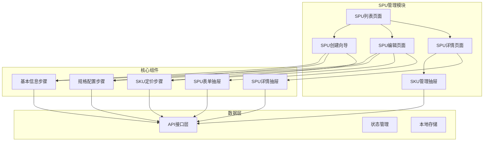

**图表来源**
- [index.vue:1-473](file://apps/pc/src/views/product/spu/index.vue#L1-L473)
- [SpuCreateDrawer.vue:1-235](file://apps/pc/src/views/product/spu/components/SpuCreateDrawer.vue#L1-L235)
- [SpuFormDrawer.vue:1-176](file://apps/pc/src/views/product/spu/components/SpuFormDrawer.vue#L1-L176)

## SPU基本信息管理

### 基本信息字段设计

SPU基本信息包含以下核心字段：

| 字段名称 | 数据类型 | 必填 | 说明 | 长度限制 |
|---------|---------|------|------|----------|
| SPU名称 | VARCHAR(100) | ✅ | 商品名称，唯一标识 | 最多100字符 |
| SPU编码 | VARCHAR(50) | ❌ | 系统自动生成，唯一标识 | 最多50字符 |
| 所属分类 | VARCHAR(32) | ✅ | 商品分类ID，最末级分类 | 无限制 |
| 计量单位 | VARCHAR(20) | ✅ | 商品计量单位 | 无限制 |
| 商品主图 | VARCHAR(255) | ❌ | 主要展示图片URL | 无限制 |
| 商品相册 | JSON | ❌ | 详细展示图片URL列表 | 最多9张 |
| 商品描述 | VARCHAR(500) | ❌ | 详细描述信息 | 最多500字符 |
| 商品备注 | VARCHAR(500) | ❌ | 备注信息 | 最多500字符 |

### 基本信息表单验证

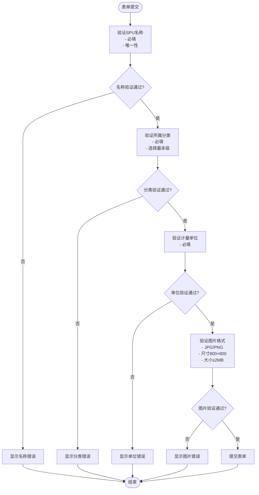

**图表来源**
- [Step1BasicInfo.vue:1-142](file://apps/pc/src/views/product/spu/components/Step1BasicInfo.vue#L1-L142)

### 基本信息页面布局

SPU基本信息页面采用垂直布局，包含以下区域：

1. **SPU名称区域**：输入框，支持最多100字符
2. **SPU编码区域**：只读显示，系统自动生成
3. **所属分类区域**：级联选择器，支持三级分类
4. **计量单位区域**：下拉选择，支持预设单位
5. **商品主图区域**：图片上传，支持JPG/PNG格式
6. **商品相册区域**：多图上传，最多9张
7. **商品描述区域**：文本域，最多500字符
8. **商品备注区域**：文本域，最多500字符

**章节来源**
- [Step1BasicInfo.vue:1-142](file://apps/pc/src/views/product/spu/components/Step1BasicInfo.vue#L1-L142)
- [SpuFormDrawer.vue:1-176](file://apps/pc/src/views/product/spu/components/SpuFormDrawer.vue#L1-L176)

## 图片管理

### 图片上传规范

SPU图片管理支持两种类型的图片上传：

#### 商品主图
- **格式要求**：JPG、PNG格式
- **尺寸要求**：建议800×800像素
- **大小限制**：不超过2MB
- **显示效果**：48×48像素缩略图，cover裁剪模式

#### 商品相册
- **数量限制**：最多9张图片
- **格式要求**：JPG、PNG格式
- **尺寸要求**：建议800×800像素
- **大小限制**：单张不超过2MB
- **显示效果**：80×80像素缩略图，支持预览

### 图片上传组件

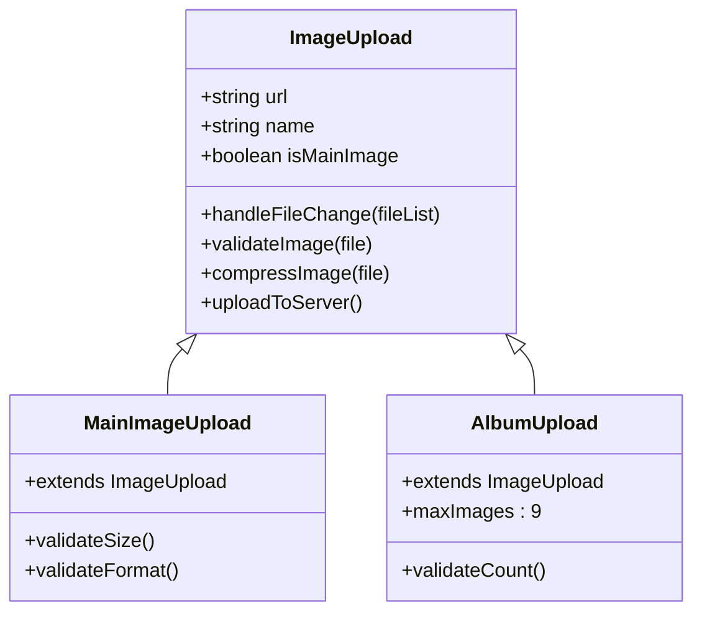

**图表来源**
- [Step1BasicInfo.vue:43-63](file://apps/pc/src/views/product/spu/components/Step1BasicInfo.vue#L43-L63)

### 图片处理流程

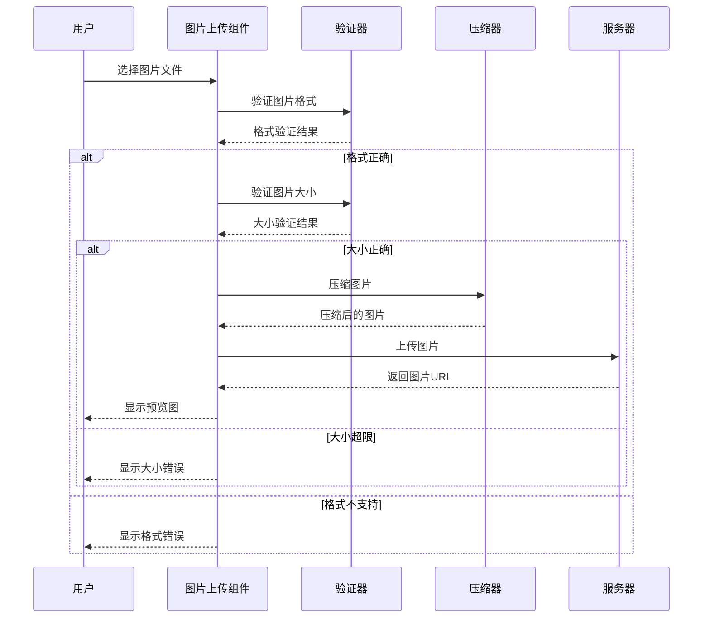

**图表来源**
- [Step1BasicInfo.vue:56-62](file://apps/pc/src/views/product/spu/components/Step1BasicInfo.vue#L56-L62)

**章节来源**
- [Step1BasicInfo.vue:1-142](file://apps/pc/src/views/product/spu/components/Step1BasicInfo.vue#L1-L142)
- [detail.vue:59-96](file://apps/pc/src/views/product/spu/detail.vue#L59-L96)

## 规格配置管理

### 规格属性设计

规格配置是SPU管理的核心功能，支持动态管理商品规格属性：

#### 规格属性类型
- **系统预设属性**：颜色、尺寸、材质等
- **自定义属性**：用户可创建的新属性
- **输入型属性**：允许用户自由输入值
- **选项型属性**：从预设选项中选择

#### 规格值管理
- **选项值**：从系统属性中继承的预设值
- **自定义值**：用户添加的自定义规格值
- **去重机制**：同一属性下值不能重复

### 规格配置流程

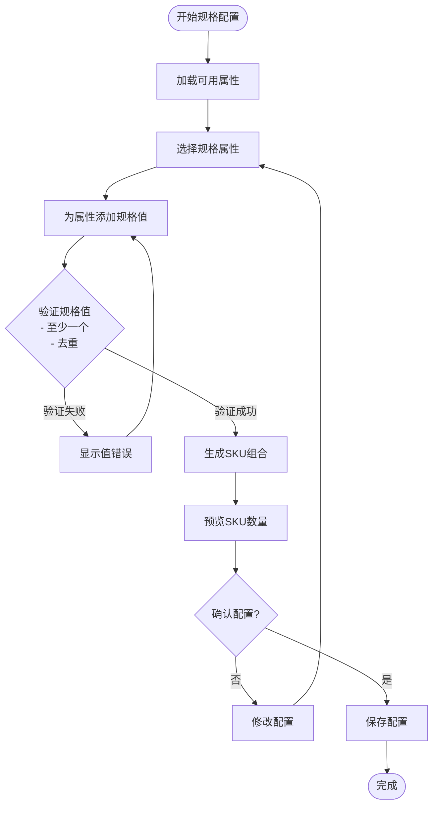

**图表来源**
- [Step2SpecConfig.vue:185-220](file://apps/pc/src/views/product/spu/components/Step2SpecConfig.vue#L185-L220)

### SKU生成算法

系统采用笛卡尔积算法自动生成SKU：

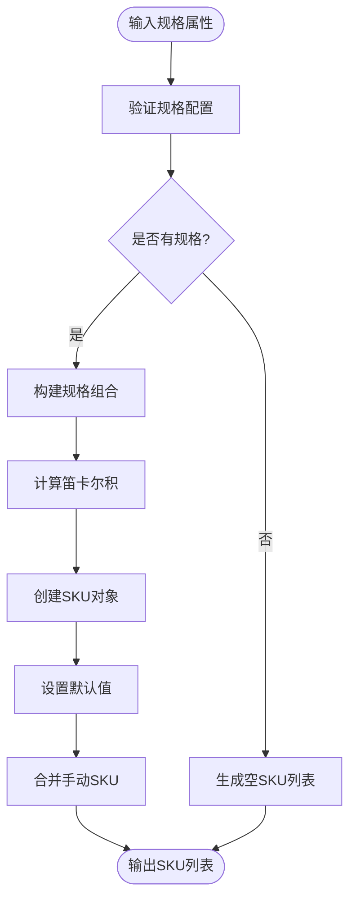

**图表来源**
- [Step2SpecConfig.vue:193-220](file://apps/pc/src/views/product/spu/components/Step2SpecConfig.vue#L193-L220)

### 规格配置页面功能

规格配置页面包含以下功能：

1. **属性选择器**：支持搜索和筛选可用属性
2. **规格值输入**：支持键盘回车快速添加
3. **规格预览**：实时显示将生成的SKU数量
4. **组合预览**：展示前20个SKU组合示例
5. **动态更新**：规格变更时自动重新生成SKU

**章节来源**
- [Step2SpecConfig.vue:1-331](file://apps/pc/src/views/product/spu/components/Step2SpecConfig.vue#L1-L331)

## SKU管理

### SKU数据结构

SKU（库存保有单位）是SPU的具体实例，包含以下核心字段：

| 字段名称 | 数据类型 | 必填 | 说明 |
|---------|---------|------|------|
| SKU编码 | VARCHAR(50) | ❌ | 系统自动生成或手动输入 |
| SKU名称 | VARCHAR(200) | ✅ | SKU名称，支持手动修改 |
| 规格组合 | JSON | ✅ | 规格属性值映射 |
| 主图 | VARCHAR(255) | ❌ | SKU主图URL，优先级高于SPU主图 |
| 供货价 | DECIMAL(18,2) | ❌ | 供应商供货价格 |
| 销售价 | DECIMAL(18,2) | ❌ | 平台销售价格 |
| 库存 | INT | ❌ | 初始库存数量 |
| 来源 | ENUM | ❌ | auto(规格生成)/manual(手动新增) |

### SKU管理功能

#### 批量设置价格
- 支持对所有SKU批量设置价格
- 留空的价格字段不会被修改
- 提供确认对话框防止误操作

#### 单独新增SKU
- 支持手动创建SKU
- 可自定义规格组合
- 支持设置价格和库存

#### 按规格生成SKU
- 基于现有规格属性生成SKU
- 支持选择特定规格值组合
- 预览生成的SKU列表

### SKU管理抽屉

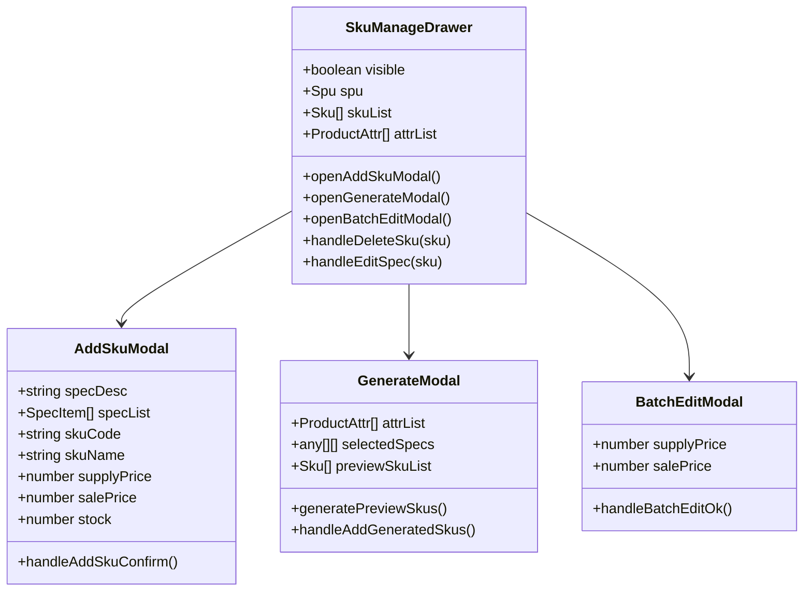

**图表来源**
- [SkuManageDrawer.vue:1-777](file://apps/pc/src/views/product/spu/components/SkuManageDrawer.vue#L1-L777)

### SKU管理流程

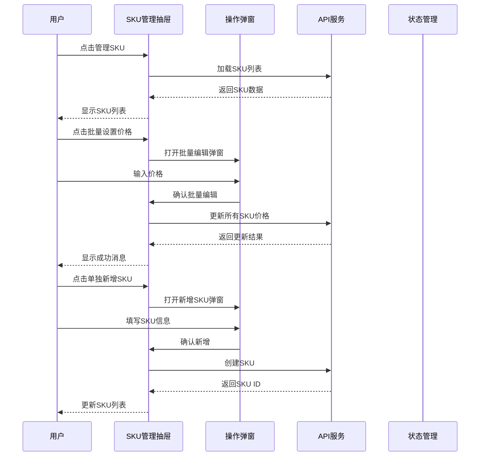

**图表来源**
- [SkuManageDrawer.vue:482-536](file://apps/pc/src/views/product/spu/components/SkuManageDrawer.vue#L482-L536)

**章节来源**
- [SkuManageDrawer.vue:1-777](file://apps/pc/src/views/product/spu/components/SkuManageDrawer.vue#L1-L777)
- [Step3SkuPrice.vue:1-601](file://apps/pc/src/views/product/spu/components/Step3SkuPrice.vue#L1-L601)

## 数据流程与业务规则

### SPU创建流程

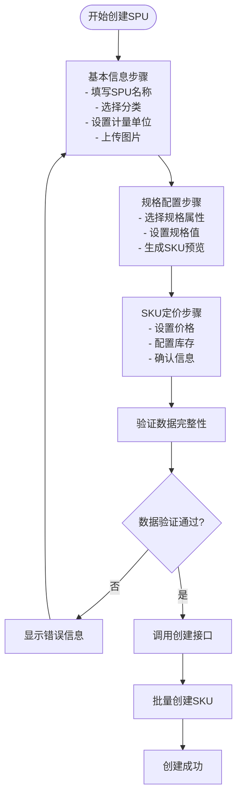

**图表来源**
- [SpuCreateDrawer.vue:159-210](file://apps/pc/src/views/product/spu/components/SpuCreateDrawer.vue#L159-L210)

### SPU删除约束

SPU删除操作包含严格的关联数据检查：

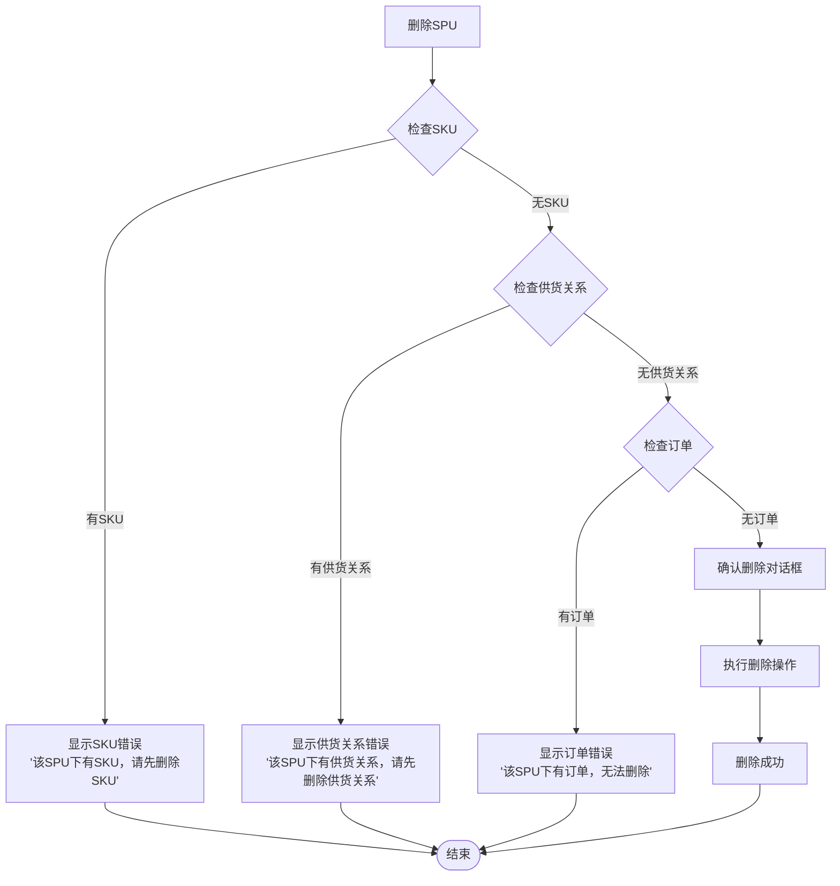

**图表来源**
- [index.vue:457-471](file://apps/pc/src/views/product/spu/index.vue#L457-L471)

### 数据校验规则

#### 表单校验规则

| 字段名称 | 校验规则 | 错误提示 |
|---------|---------|---------|
| SPU名称 | 必填，最多100个字符 | 请输入SPU名称 |
| 所属分类 | 必填，选择最末级分类 | 请选择所属分类 |
| 计量单位 | 必填 | 请选择计量单位 |
| 供货价 | 大于0 | 供货价必须大于0 |
| 销售价 | 大于0 | 销售价必须大于0 |

#### 业务校验规则

| 校验项 | 校验规则 | 错误提示 |
|-------|---------|---------|
| SPU名称唯一 | SPU名称在系统中唯一 | SPU名称已存在 |
| SPU编码唯一 | SPU编码在系统中唯一 | SPU编码已存在 |
| 规格属性数量 | 至少选择一个规格属性 | 请至少选择一个规格属性 |
| 规格值数量 | 每个规格属性至少设置一个属性值 | 请为规格属性设置至少一个属性值 |
| SKU数量 | 至少生成一个SKU | 请先生成SKU |
| SPU删除校验 | 删除前检查是否有SKU、供货关系、订单 | 该SPU下有关联数据，无法删除 |

**章节来源**
- [18-SPU管理功能详细设计.md:514-536](file://docs/PRD/18-SPU管理功能详细设计.md#L514-L536)
- [SpuCreateDrawer.vue:159-210](file://apps/pc/src/views/product/spu/components/SpuCreateDrawer.vue#L159-L210)

## 权限控制

### 功能权限矩阵

SPU管理功能的权限控制遵循"看不见即不存在"的原则：

| 功能 | 平台管理员 | 平台运营 | 供应商 | 工程仓 | 施工方 |
|-----|-----------|---------|--------|--------|--------|
| 查看SPU列表 | ✅ | ✅ | ✅ | ✅ | ✅ |
| 搜索SPU | ✅ | ✅ | ✅ | ✅ | ✅ |
| 筛选SPU | ✅ | ✅ | ✅ | ✅ | ✅ |
| 查看SPU详情 | ✅ | ✅ | ✅ | ✅ | ✅ |
| 新增SPU | ✅ | ✅ | ❌ | ❌ | ❌ |
| 编辑SPU | ✅ | ✅ | ❌ | ❌ | ❌ |
| 删除SPU | ✅ | ✅ | ❌ | ❌ | ❌ |
| 管理SKU | ✅ | ✅ | ✅ | ✅ | ✅ |

### 前端权限实现

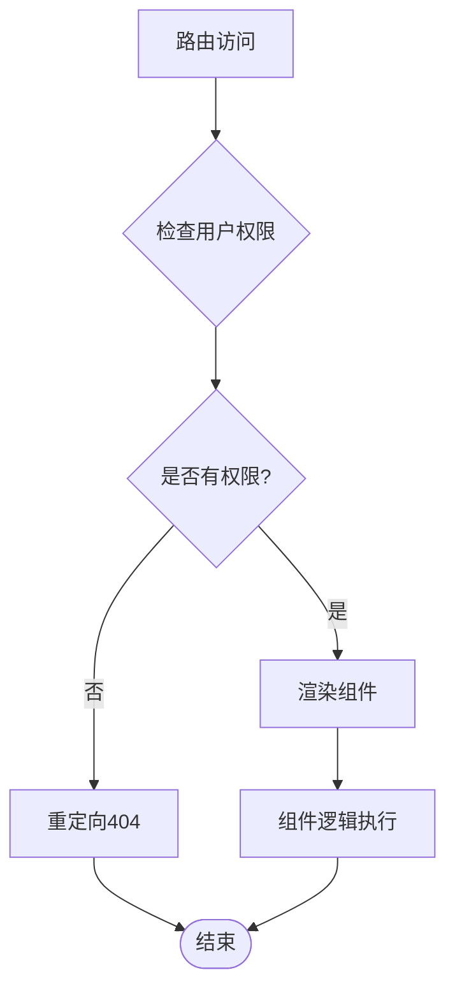

**图表来源**
- [index.vue:368-368](file://apps/pc/src/views/product/spu/index.vue#L368-L368)

### 权限控制原则

1. **按钮级权限**：无权限的按钮直接不渲染，不显示灰色禁用状态
2. **路由级权限**：无权限访问的路由直接404跳转
3. **数据级权限**：根据用户角色过滤可操作的数据集
4. **功能级权限**：根据角色显示相应的功能模块

**章节来源**
- [18-SPU管理功能详细设计.md:539-553](file://docs/PRD/18-SPU管理功能详细设计.md#L539-L553)
- [index.vue:368-368](file://apps/pc/src/views/product/spu/index.vue#L368-L368)

## 界面设计规范

### SPU列表页面设计

SPU列表页面采用卡片布局，包含以下核心元素：

#### 搜索筛选区域
- **搜索框**：支持SPU名称和编码的模糊搜索
- **分类级联选择器**：支持三级分类选择
- **新增按钮**：平台管理员专用

#### 表格展示区域
- **主图列**：48×48像素缩略图，支持点击预览
- **SPU编码列**：120px宽度，居中显示
- **SPU名称列**：200px宽度，主标题样式
- **所属分类列**：120px宽度
- **计量单位列**：80px宽度
- **关联属性列**：Tag标签列表，最多显示3行
- **SKU数量列**：100px宽度
- **创建时间列**：180px宽度，标准日期格式
- **操作列**：固定右侧，包含详情、编辑、管理SKU、删除按钮

#### 分页控制
- 支持分页加载，避免一次性加载大量数据
- 提供页码切换和每页数量选择

### SPU详情页面设计

SPU详情页面采用卡片布局，分为以下区域：

#### 基本信息区域
- **SPU名称**：主标题展示
- **SPU编码**：文本展示
- **所属分类**：分类完整路径
- **计量单位**：文本展示
- **SKU数量**：数字展示
- **状态**：Tag标签展示（启用/禁用）
- **商品主图**：200×200像素预览
- **商品相册**：80×80像素缩略图网格
- **商品描述**：文本内容展示

#### SKU列表区域
- **SKU编码**：文本展示
- **SKU名称**：文本展示
- **规格组合**：Tag标签列表
- **供货价**：金额格式展示
- **销售价**：金额格式展示
- **状态**：Tag标签展示（上架/下架）

#### 分账配置区域
- **规则名称**：文本展示
- **规则类型**：Tag标签展示
- **分账比例**：百分比格式展示
- **生效时间**：时间段展示
- **状态**：Tag标签展示（生效中/已失效）

### SPU创建向导设计

SPU创建采用三步向导模式：

#### 第一步：基本信息
- **SPU名称**：必填，最多100字符
- **SPU编码**：可选，系统自动生成
- **所属分类**：必填，三级级联选择
- **计量单位**：必填，支持预设和自定义
- **商品主图**：可选，支持图片上传
- **商品相册**：可选，最多9张
- **商品描述**：可选，最多500字符
- **商品备注**：可选，最多500字符

#### 第二步：规格配置
- **规格属性选择**：从系统属性库选择
- **规格值设置**：每个属性至少设置一个值
- **SKU预览**：实时显示生成的SKU数量
- **组合预览**：展示前20个SKU组合示例

#### 第三步：SKU定价
- **SKU列表表格**：展示所有生成的SKU
- **价格设置**：支持批量设置和单独设置
- **库存配置**：支持设置初始库存
- **图片上传**：支持SKU主图上传

**章节来源**
- [index.vue:1-473](file://apps/pc/src/views/product/spu/index.vue#L1-L473)
- [detail.vue:1-800](file://apps/pc/src/views/product/spu/detail.vue#L1-L800)
- [view.vue:1-314](file://apps/pc/src/views/product/spu/view.vue#L1-L314)

## 性能优化策略

### 列表查询优化

1. **数据库索引优化**
   - 为spuName、spuCode、categoryId建立复合索引
   - 优化查询性能，减少全表扫描

2. **分页加载策略**
   - 默认每页10条记录
   - 支持自定义每页数量（10/20/50/100）
   - 滚动到底部时自动加载下一页

3. **图片懒加载**
   - 表格中的图片采用懒加载
   - 减少首屏加载时间
   - 支持图片预加载

### SKU生成优化

1. **前端预生成**
   - 在前端计算规格组合，减少后端压力
   - 实时预览SKU数量，提升用户体验

2. **SKU数量限制**
   - 建议单个SPU的SKU数量不超过100个
   - 超过限制时提示用户优化规格设计

### 图片优化

1. **图片压缩**
   - 前端压缩图片到合理尺寸
   - 减少网络传输时间和存储空间

2. **CDN加速**
   - 图片资源通过CDN分发
   - 提升图片加载速度

3. **图片裁剪**
   - 统一图片尺寸，减少CSS处理开销
   - 优化移动端显示效果

### 缓存优化

1. **分类树缓存**
   - 缓存商品分类树数据
   - 减少重复请求，提升响应速度

2. **属性列表缓存**
   - 缓存规格属性列表
   - 支持属性搜索和筛选

3. **SPU详情缓存**
   - 缓存SPU详情数据
   - 支持快速查看详情页面

## 故障排查指南

### 常见问题及解决方案

#### SPU创建失败
**问题现象**：SPU创建时报错，提示"保存失败"
**可能原因**：
- SPU名称重复
- 所属分类选择错误
- 图片上传失败
- 规格配置不完整

**解决步骤**：
1. 检查SPU名称是否唯一
2. 确认所属分类选择最末级
3. 验证图片格式和大小
4. 确认规格属性和值的完整性

#### SKU生成异常
**问题现象**：规格配置后无法生成SKU
**可能原因**：
- 规格值为空
- 规格属性重复
- 规格值重复

**解决步骤**：
1. 确认每个规格属性至少有一个值
2. 检查规格属性名称唯一性
3. 验证规格值不重复

#### 图片上传失败
**问题现象**：图片上传报错，提示格式或大小错误
**可能原因**：
- 文件格式不支持
- 文件大小超过限制
- 网络连接异常

**解决步骤**：
1. 确认文件格式为JPG或PNG
2. 检查文件大小是否超过2MB
3. 重新尝试上传或更换网络环境

#### 权限访问问题
**问题现象**：无法看到某些功能按钮或页面
**可能原因**：
- 用户角色权限不足
- 路由权限配置错误
- 缓存数据过期

**解决步骤**：
1. 检查用户角色和权限
2. 刷新页面清除缓存
3. 联系系统管理员检查权限配置

### 错误处理机制

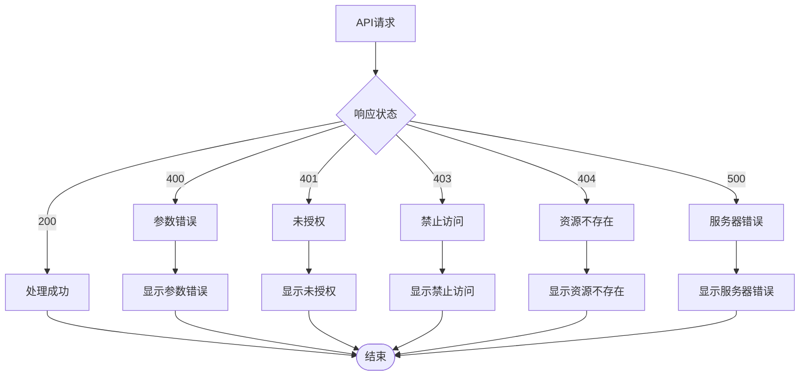

**图表来源**
- [18-SPU管理功能详细设计.md:744-760](file://docs/PRD/18-SPU管理功能详细设计.md#L744-L760)

**章节来源**
- [18-SPU管理功能详细设计.md:744-760](file://docs/PRD/18-SPU管理功能详细设计.md#L744-L760)

## 总结

SPU管理功能作为工程材料采供一体化平台的核心组成部分，提供了完整的商品标准化管理体系。通过SPU基本信息管理、图片管理、规格配置、SKU管理等功能，实现了从商品定义到销售的全流程管理。

### 核心优势

1. **完整的SPU生命周期管理**：从创建、编辑到删除的全生命周期管理
2. **灵活的规格配置**：支持多种规格属性类型和自定义规格
3. **高效的SKU生成**：基于笛卡尔积算法自动生成SKU组合
4. **完善的权限控制**：基于角色的精细化权限管理
5. **优秀的用户体验**：直观的界面设计和流畅的操作体验

### 技术特点

1. **模块化设计**：采用组件化架构，便于维护和扩展
2. **数据驱动**：基于Vue 3 Composition API的响应式数据管理
3. **性能优化**：多维度性能优化策略，确保系统高效运行
4. **错误处理**：完善的错误处理和用户反馈机制
5. **安全考虑**：严格的数据验证和权限控制

### 发展前景

随着业务的发展，SPU管理功能将继续演进，支持更多复杂的商品管理需求，为用户提供更加智能化的商品管理解决方案。通过持续的功能优化和技术升级，SPU管理将成为平台商品管理的核心基础设施。