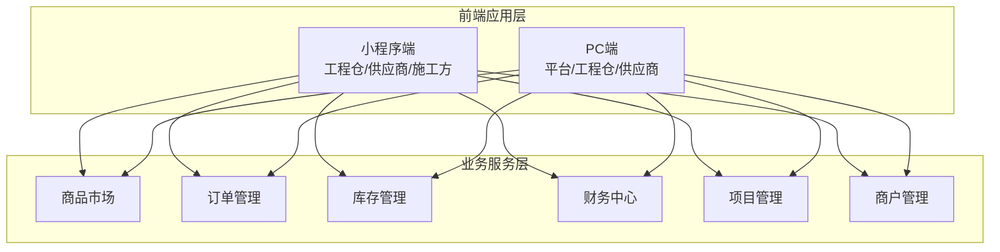
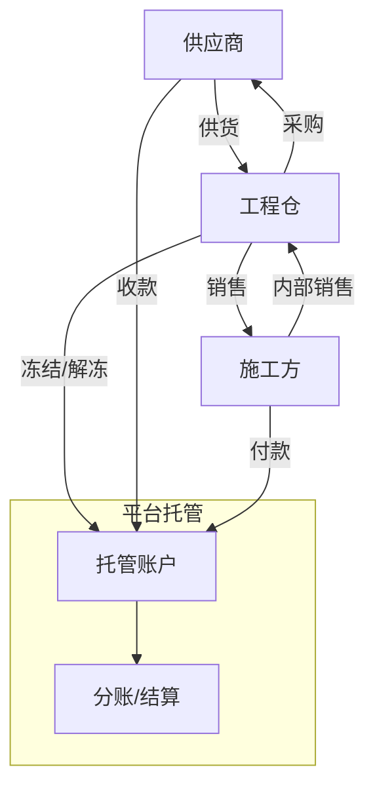
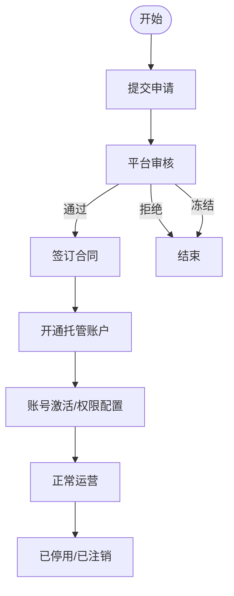
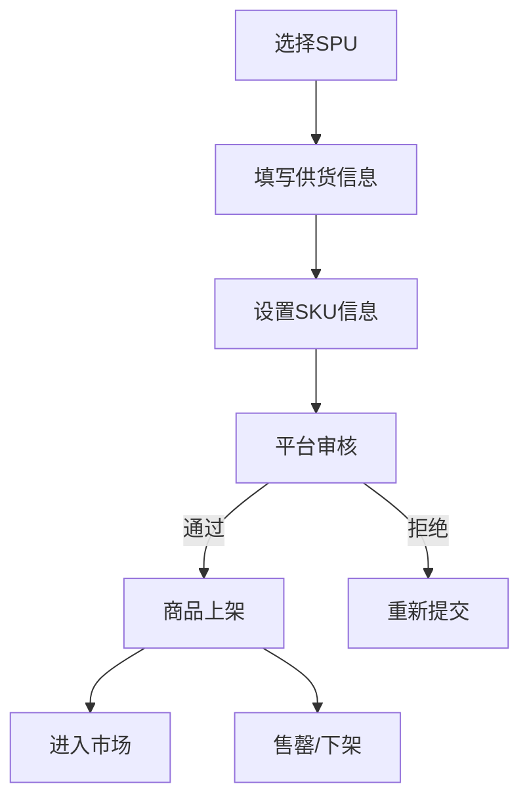
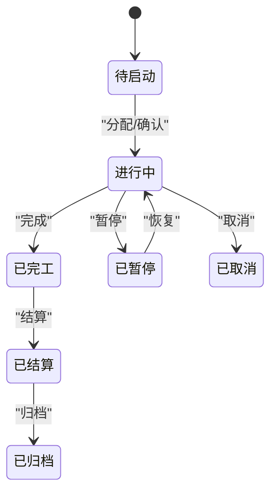
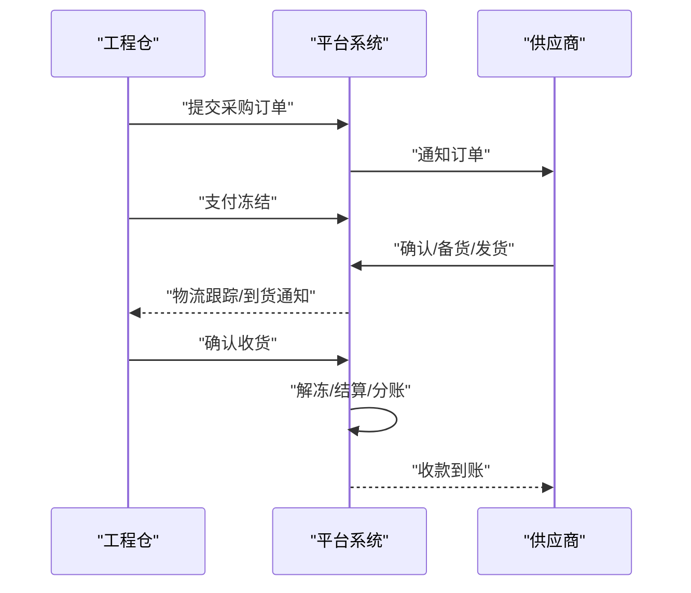
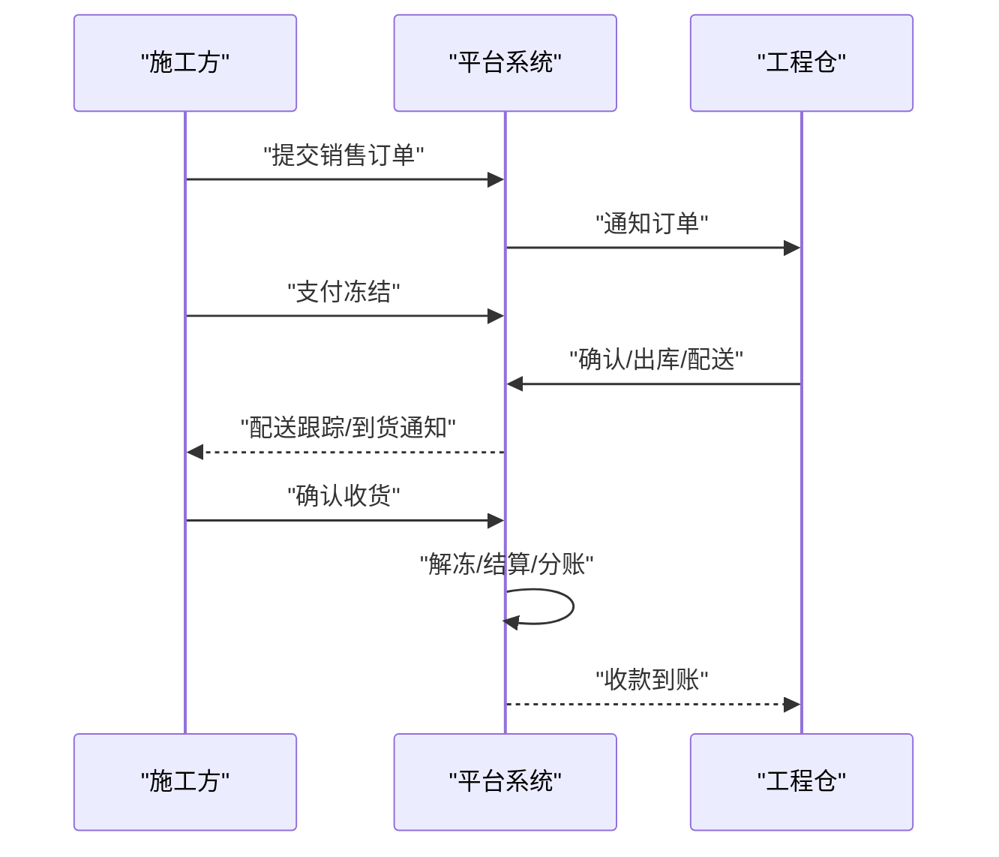
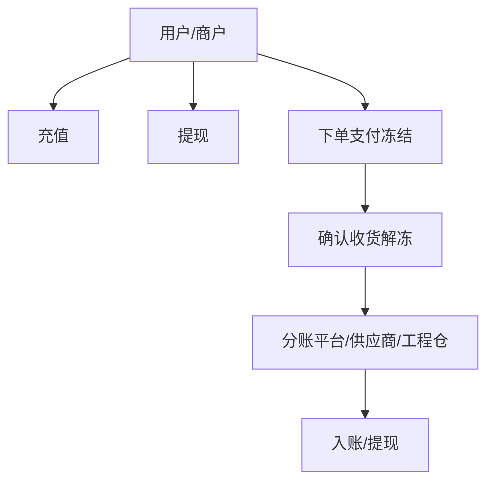
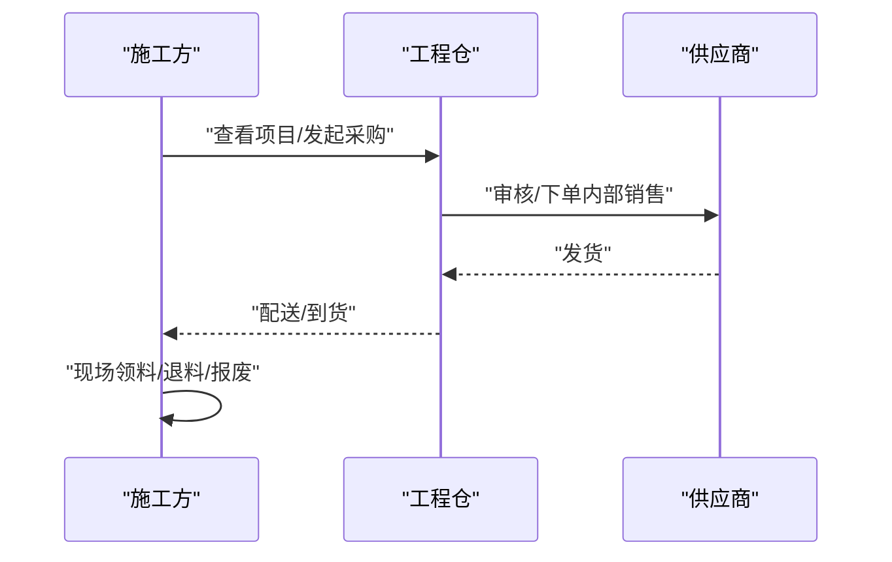
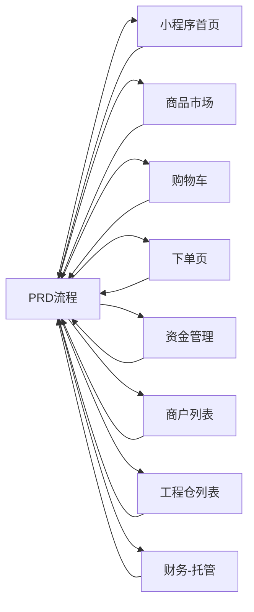

# 业务流程设计

<cite>
**本文引用的文件**
- [业务流程设计.md](file://docs/PRD/02-业务流程设计.md)
- [系统概览与架构.md](file://docs/PRD/01-系统概览与架构.md)
- [index.vue](file://apps/mp/src/pages/index/index.vue)
- [index.vue](file://apps/mp/src/pages/market/index.vue)
- [create.vue](file://apps/mp/src/pages/order/create.vue)
- [index.vue](file://apps/mp/src/pages/cart/index.vue)
- [custody.vue](file://apps/mp/src/pages/mine/custody.vue)
- [account.vue](file://apps/mp/src/pages/mine/account.vue)
- [index.vue](file://apps/pc/src/views/construction/list/index.vue)
- [index.vue](file://apps/pc/src/views/finance/custody/index.vue)
- [index.vue](file://apps/pc/src/views/merchant/list/index.vue)
</cite>

## 目录
1. [引言](#引言)
2. [项目结构](#项目结构)
3. [核心组件](#核心组件)
4. [架构总览](#架构总览)
5. [详细组件分析](#详细组件分析)
6. [依赖分析](#依赖分析)
7. [性能考虑](#性能考虑)
8. [故障排查指南](#故障排查指南)
9. [结论](#结论)
10. [附录](#附录)

## 引言
本文件面向产品经理、开发与测试团队，系统化梳理工程材料管理采供一体化平台的关键业务流程，覆盖商户入驻、商品上架、项目创建、采购下单、订单履约、资金托管与分账、施工方业务等核心场景，并配套流程图、时序图与状态转换图，确保跨端（小程序/PC）对齐一致。

## 项目结构
平台采用四端协同架构：平台端（PC）、供应商端（PC+小程序）、工程仓端（PC+小程序）、施工方端（小程序）。业务流程围绕“商户—商品—订单—库存—资金—项目”闭环展开，前端页面与PRD文档共同定义了各角色的操作路径与交互行为。

图表来源
- [系统概览与架构.md:66-94](file://docs/PRD/01-系统概览与架构.md#L66-L94)

章节来源
- [系统概览与架构.md:11-135](file://docs/PRD/01-系统概览与架构.md#L11-L135)

## 核心组件
- 商户管理：商户入驻、资质审核、合同管理、账号权限管理
- 商品管理：SPU/SKU、价格策略、商品审核、市场展示
- 订单管理：采购/销售订单、状态流转、履约跟踪
- 库存管理：入库/出库/盘点、批次管理、现场库存
- 财务中心：托管账户、资金冻结/解冻、分账、发票
- 项目管理：项目创建、分配、进度、预算

章节来源
- [系统概览与架构.md:137-209](file://docs/PRD/01-系统概览与架构.md#L137-L209)

## 架构总览
平台采用“四端 + 业务服务层”的分层架构，业务流程贯穿商品、订单、库存、财务、项目五大中心，资金通过托管账户实现闭环，支持B2B采购与内部销售两条交易链路。

图表来源
- [系统概览与架构.md:411-440](file://docs/PRD/01-系统概览与架构.md#L411-L440)

章节来源
- [系统概览与架构.md:387-472](file://docs/PRD/01-系统概览与架构.md#L387-L472)

## 详细组件分析

### 商户入驻流程
- 总流程：提交申请 → 平台审核 → 签订合同 → 开通账户 → 账号激活
- 供应商/工程仓/施工方分别走不同审核与配置路径
- 状态机：待审核 → 审核通过/审核拒绝/已冻结 → 正常运营 → 已停用/已注销

图表来源
- [业务流程设计.md:76-273](file://docs/PRD/02-业务流程设计.md#L76-L273)

章节来源
- [业务流程设计.md:76-273](file://docs/PRD/02-业务流程设计.md#L76-L273)

### 商品上架流程（供应商）
- 选择SPU/申请新SPU → 填写供货信息（价格/起订量/区域/交货周期）→ 设置SKU（规格/库存/图片）→ 平台审核 → 上架/下架/售罄

图表来源
- [业务流程设计.md:277-347](file://docs/PRD/02-业务流程设计.md#L277-L347)

章节来源
- [业务流程设计.md:277-347](file://docs/PRD/02-业务流程设计.md#L277-L347)

### 项目管理流程
- 项目创建：工程仓创建 → 分配施工方 → 平台通知 → 施工方确认 → 项目启动
- 状态机：待启动 → 进行中 → 已完工 → 已结算；支持暂停/归档/取消

图表来源
- [业务流程设计.md:625-676](file://docs/PRD/02-业务流程设计.md#L625-L676)

章节来源
- [业务流程设计.md:625-676](file://docs/PRD/02-业务流程设计.md#L625-L676)

### 链路一：工程仓采购流程
- 下单：浏览市场 → 加入购物车 → 提交采购订单 → 支付（托管账户冻结）→ 通知供应商
- 履约：供应商确认/备货/发货 → 物流跟踪 → 到货通知 → 工程仓验货入库 → 确认收货 → 解冻结算/分账 → 供应商收款

图表来源
- [业务流程设计.md:383-494](file://docs/PRD/02-业务流程设计.md#L383-L494)

章节来源
- [业务流程设计.md:383-494](file://docs/PRD/02-业务流程设计.md#L383-L494)

### 链路二：施工方采购流程
- 下单：选择项目 → 浏览商品市场（含BOM包）→ 加入购物车 → 提交销售订单 → 支付（托管账户冻结）→ 通知工程仓
- 履约：工程仓确认/备货出库/配送发货 → 配送跟踪/到货通知 → 施工方验收入场 → 确认收货 → 解冻结算/分账 → 工程仓收款

图表来源
- [业务流程设计.md:498-621](file://docs/PRD/02-业务流程设计.md#L498-L621)

章节来源
- [业务流程设计.md:498-621](file://docs/PRD/02-业务流程设计.md#L498-L621)

### 资金托管与分账流程
- 充值/提现：小程序端“我的-资金管理”入口，支持充值/提现
- 托管账户：PC端“财务-托管账户”查看可用/冻结/总余额，支持同步余额
- 分账：订单完成后平台根据规则进行分账，供应商/工程仓/平台分别入账

图表来源
- [业务流程设计.md:411-440](file://docs/PRD/02-业务流程设计.md#L411-L440)

章节来源
- [业务流程设计.md:411-440](file://docs/PRD/02-业务流程设计.md#L411-L440)

### 施工方业务流程
- 施工方视角：查看分配项目 → 发起采购申请 → 工程仓审核/下单 → 发货/收货 → 领料使用/退料/报废

图表来源
- [系统概览与架构.md:442-471](file://docs/PRD/01-系统概览与架构.md#L442-L471)

章节来源
- [系统概览与架构.md:442-471](file://docs/PRD/01-系统概览与架构.md#L442-L471)

## 依赖分析
- 前端页面与PRD流程强耦合：小程序首页、商品市场、购物车、下单页、资金管理、商户列表、工程仓列表、财务托管等页面均映射到具体业务环节
- 端内一致性：同一业务（如“下单”）在工程仓/供应商/施工方端的交互路径一致，但角色职责不同
- 数据依赖：订单状态、库存扣减、资金冻结/解冻、项目进度等强关联

图表来源
- [index.vue:1-146](file://apps/mp/src/pages/index/index.vue#L1-L146)
- [index.vue:1-1379](file://apps/mp/src/pages/market/index.vue#L1-L1379)
- [index.vue:1-332](file://apps/mp/src/pages/cart/index.vue#L1-L332)
- [create.vue:1-680](file://apps/mp/src/pages/order/create.vue#L1-L680)
- [custody.vue:1-265](file://apps/mp/src/pages/mine/custody.vue#L1-L265)
- [index.vue:1-731](file://apps/pc/src/views/merchant/list/index.vue#L1-L731)
- [index.vue:1-237](file://apps/pc/src/views/construction/list/index.vue#L1-L237)
- [index.vue:1-222](file://apps/pc/src/views/finance/custody/index.vue#L1-L222)

章节来源
- [index.vue:1-146](file://apps/mp/src/pages/index/index.vue#L1-L146)
- [index.vue:1-1379](file://apps/mp/src/pages/market/index.vue#L1-L1379)
- [index.vue:1-332](file://apps/mp/src/pages/cart/index.vue#L1-L332)
- [create.vue:1-680](file://apps/mp/src/pages/order/create.vue#L1-L680)
- [custody.vue:1-265](file://apps/mp/src/pages/mine/custody.vue#L1-L265)
- [index.vue:1-731](file://apps/pc/src/views/merchant/list/index.vue#L1-L731)
- [index.vue:1-237](file://apps/pc/src/views/construction/list/index.vue#L1-L237)
- [index.vue:1-222](file://apps/pc/src/views/finance/custody/index.vue#L1-L222)

## 性能考虑
- 页面加载与接口响应：首屏与关键交互建议在2秒内完成，接口95%响应时间<500ms
- 并发与可用性：支持千级并发，年度可用性≥99.9%
- 安全与兼容：HTTPS、JWT+RefreshToken、RBAC、浏览器/移动端/小程序兼容

章节来源
- [系统概览与架构.md:554-581](file://docs/PRD/01-系统概览与架构.md#L554-L581)

## 故障排查指南
- 商户状态异常：检查“商户列表”中的入驻状态与启用状态，必要时重试开启或同步余额
- 资金问题：通过“财务-托管账户”查看可用/冻结/总余额，手动同步余额；若冻结/解冻异常，检查订单状态与履约节点
- 订单异常：核对订单状态机（待确认/待发货/待收货/已完成/售后中），定位冻结/解冻/分账节点
- 施工方项目：确认项目分配与权限配置，核对工程仓列表与项目进度

章节来源
- [index.vue:1-731](file://apps/pc/src/views/merchant/list/index.vue#L1-L731)
- [index.vue:1-222](file://apps/pc/src/views/finance/custody/index.vue#L1-L222)
- [business-process-design.md:423-454](file://docs/PRD/02-业务流程设计.md#L423-L454)
- [index.vue:1-237](file://apps/pc/src/views/construction/list/index.vue#L1-L237)

## 结论
本文基于PRD与前端页面，构建了覆盖商户、商品、项目、订单、库存、资金、项目的全链路业务流程图谱，明确了两条交易链路与资金托管分账机制，提供了状态机与关键决策点说明，为产品、研发、测试达成一致理解与实现方案提供依据。

## 附录
- 术语定义：平台端、供应商、工程仓、施工方、SPU、SKU、BOM、托管账户、分账、领料、现场库存
- 版本与状态：PRD版本v1.1，文档状态“评审中”

章节来源
- [系统概览与架构.md:599-627](file://docs/PRD/01-系统概览与架构.md#L599-L627)