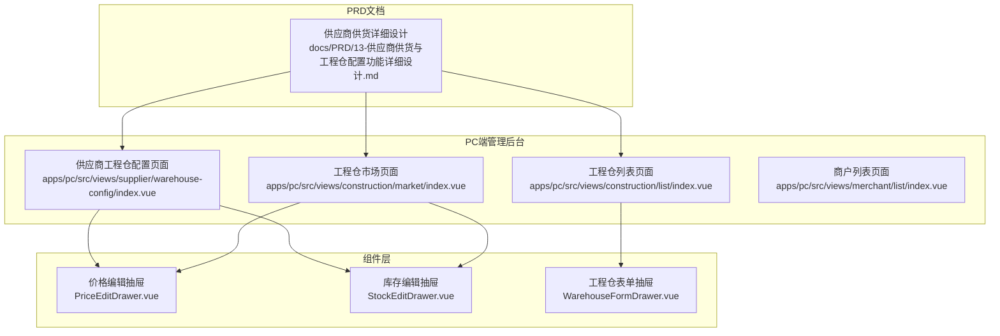
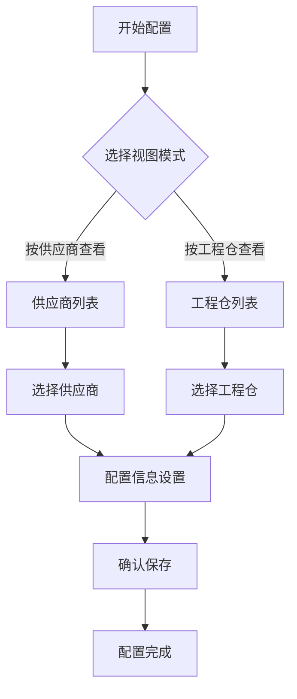
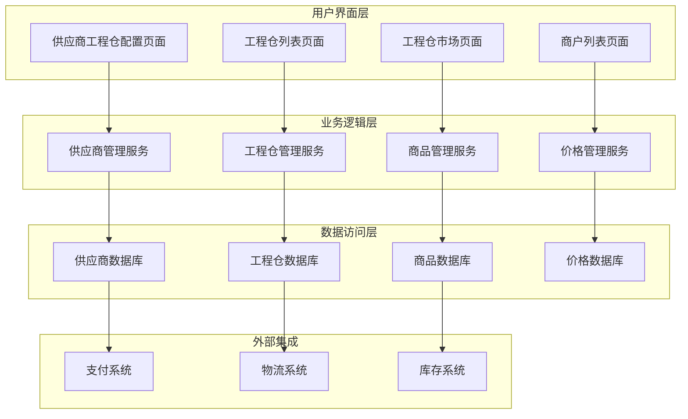
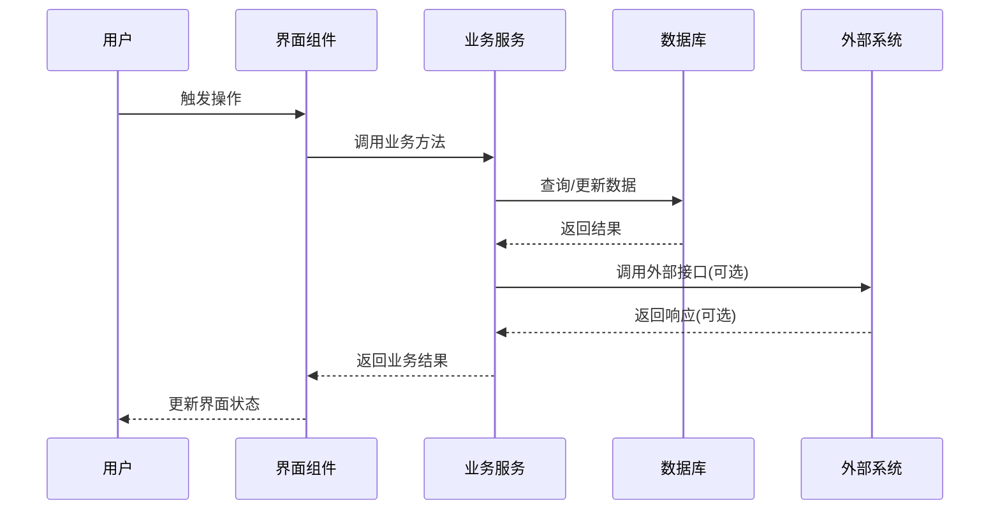
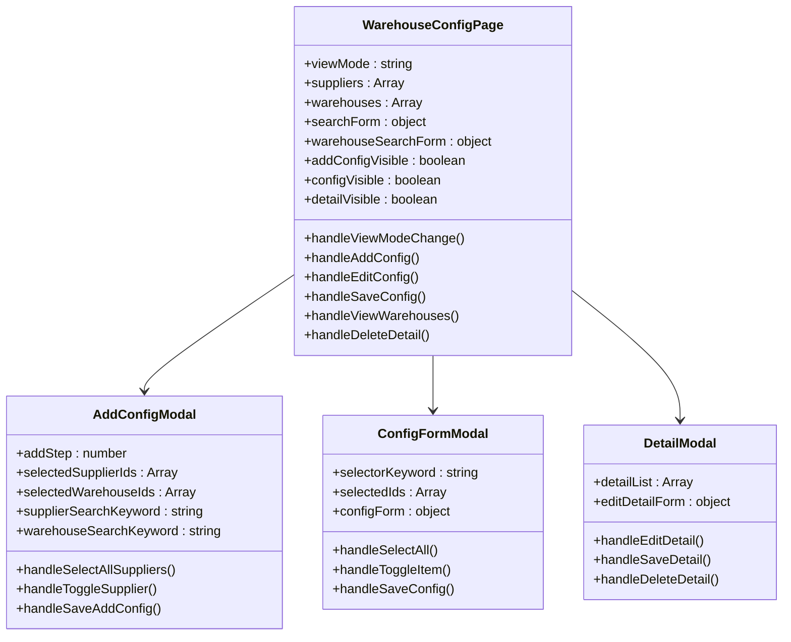
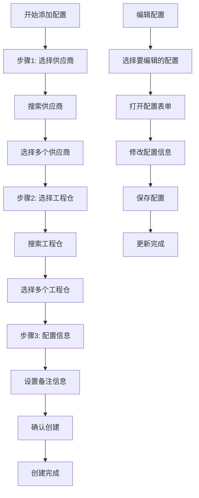
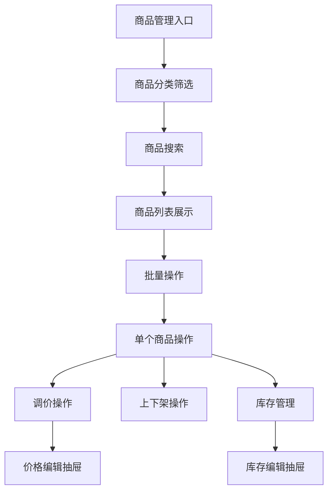
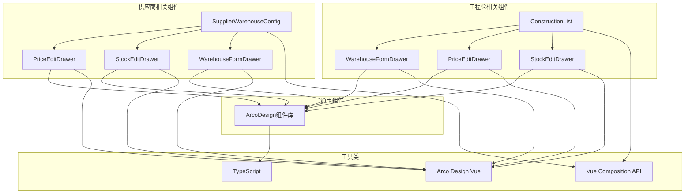

# 供应商供货与工程仓配置功能详细设计

<cite>
**本文档引用的文件**
- [供应商供货与工程仓配置功能详细设计.md](file://docs/PRD/13-供应商供货与工程仓配置功能详细设计.md)
- [供应商工程仓配置页面](file://apps/pc/src/views/supplier/warehouse-config/index.vue)
- [工程仓列表页面](file://apps/pc/src/views/construction/list/index.vue)
- [工程仓市场页面](file://apps/pc/src/views/construction/market/index.vue)
- [工程仓价格编辑抽屉](file://apps/pc/src/views/construction/market/components/PriceEditDrawer.vue)
- [工程仓库存编辑抽屉](file://apps/pc/src/views/construction/market/components/StockEditDrawer.vue)
- [商户列表页面](file://apps/pc/src/views/merchant/list/index.vue)
</cite>

## 目录
1. [引言](#引言)
2. [项目结构](#项目结构)
3. [核心组件](#核心组件)
4. [架构概览](#架构概览)
5. [详细组件分析](#详细组件分析)
6. [依赖分析](#依赖分析)
7. [性能考虑](#性能考虑)
8. [故障排除指南](#故障排除指南)
9. [结论](#结论)

## 引言

供应商供货与工程仓配置功能是工程材料管理采供一体化平台供应链管理的核心功能模块。该功能负责管理供应商与工程仓之间的供货关系，以及供应商向工程仓供货的完整业务流程。

### 功能定位

该功能模块主要服务于以下目标用户：
- **平台管理员**：负责整体系统的配置和监管
- **平台运营人员**：负责日常运营和协调工作
- **供应商**：管理自己的供货关系和供货商品
- **工程仓**：管理自己的供应商和供货商品

### 核心概念

| 概念 | 说明 | 示例 |
|------|------|------|
| 供应商 | 提供商品的企业或个人 | 海螺水泥供应商 |
| 工程仓 | 采购商品的仓库或企业 | 北京工程仓、上海工程仓 |
| 供货关系 | 供应商与工程仓之间的供货合作关系 | 海螺水泥供应商 → 北京工程仓 |
| 供货商品 | 供应商向工程仓供货的商品 | 普通硅酸盐水泥 32.5级 |
| 供货价格 | 供应商向工程仓供货的价格 | ¥100.00/吨 |

## 项目结构

基于代码库分析，供应商供货与工程仓配置功能主要分布在以下目录结构中：

**图表来源**
- [供应商工程仓配置页面](file://apps/pc/src/views/supplier/warehouse-config/index.vue)
- [工程仓列表页面](file://apps/pc/src/views/construction/list/index.vue)
- [工程仓市场页面](file://apps/pc/src/views/construction/market/index.vue)
- [供应商供货与工程仓配置功能详细设计.md](file://docs/PRD/13-供应商供货与工程仓配置功能详细设计.md)

**章节来源**
- [供应商工程仓配置页面](file://apps/pc/src/views/supplier/warehouse-config/index.vue)
- [工程仓列表页面](file://apps/pc/src/views/construction/list/index.vue)
- [工程仓市场页面](file://apps/pc/src/views/construction/market/index.vue)
- [供应商供货与工程仓配置功能详细设计.md](file://docs/PRD/13-供应商供货与工程仓配置功能详细设计.md)

## 核心组件

### 供应商工程仓配置组件

供应商工程仓配置页面提供了完整的供应商与工程仓关系管理功能：

#### 主要功能特性

1. **双视图模式**
   - 按供应商查看模式
   - 按工程仓查看模式

2. **配置管理**
   - 添加新的供应商工程仓配置
   - 编辑现有配置关系
   - 删除配置关系
   - 查看详细配置信息

3. **批量操作**
   - 支持批量选择供应商
   - 支持批量选择工程仓
   - 支持批量配置操作

#### 配置流程

**图表来源**
- [供应商工程仓配置页面](file://apps/pc/src/views/supplier/warehouse-config/index.vue)

### 工程仓管理组件

工程仓列表页面提供了工程仓的完整生命周期管理：

#### 管理功能

1. **工程仓信息管理**
   - 新增工程仓
   - 编辑工程仓信息
   - 删除工程仓
   - 查看工程仓详情

2. **状态管理**
   - 启用/停用工程仓
   - 状态变更追踪

3. **权限配置**
   - 商品权限管理
   - 价格策略配置

**章节来源**
- [工程仓列表页面](file://apps/pc/src/views/construction/list/index.vue)

## 架构概览

### 系统架构设计

**图表来源**
- [供应商工程仓配置页面](file://apps/pc/src/views/supplier/warehouse-config/index.vue)
- [工程仓列表页面](file://apps/pc/src/views/construction/list/index.vue)
- [工程仓市场页面](file://apps/pc/src/views/construction/market/index.vue)

### 数据流架构

**图表来源**
- [供应商工程仓配置页面](file://apps/pc/src/views/supplier/warehouse-config/index.vue)

## 详细组件分析

### 供应商工程仓配置组件详细分析

#### 组件结构

**图表来源**
- [供应商工程仓配置页面](file://apps/pc/src/views/supplier/warehouse-config/index.vue)

#### 配置流程详细分析

**图表来源**
- [供应商工程仓配置页面](file://apps/pc/src/views/supplier/warehouse-config/index.vue)

**章节来源**
- [供应商工程仓配置页面](file://apps/pc/src/views/supplier/warehouse-config/index.vue)

### 工程仓市场管理组件分析

#### 商品管理功能

工程仓市场页面提供了完整的商品管理功能：

**图表来源**
- [工程仓市场页面](file://apps/pc/src/views/construction/market/index.vue)

#### 价格管理组件

价格编辑抽屉提供了直观的价格调整界面：

| 字段名称 | 类型 | 必填 | 说明 |
|----------|------|------|------|
| 商品名称 | String | 否 | 显示当前商品名称 |
| 规格 | String | 否 | 显示商品规格信息 |
| 当前销售价 | Number | 否 | 显示当前销售价格 |
| 新销售价 | Number | 是 | 输入新的销售价格 |
| 价格精度 | Number | - | 保留两位小数 |

**章节来源**
- [工程仓市场页面](file://apps/pc/src/views/construction/market/index.vue)
- [工程仓价格编辑抽屉](file://apps/pc/src/views/construction/market/components/PriceEditDrawer.vue)

### 工程仓库存管理组件

库存编辑抽屉提供了灵活的库存调整功能：

| 字段名称 | 类型 | 必填 | 说明 |
|----------|------|------|------|
| 商品名称 | String | 否 | 显示当前商品名称 |
| 规格 | String | 否 | 显示商品规格信息 |
| 当前库存 | Number | 否 | 显示当前库存数量 |
| 调整类型 | String | 是 | 入库/出库选择 |
| 调整数量 | Number | 是 | 输入调整的数量 |
| 备注 | String | 否 | 输入调整备注信息 |

**章节来源**
- [工程仓库存编辑抽屉](file://apps/pc/src/views/construction/market/components/StockEditDrawer.vue)

## 依赖分析

### 组件依赖关系

**图表来源**
- [供应商工程仓配置页面](file://apps/pc/src/views/supplier/warehouse-config/index.vue)
- [工程仓列表页面](file://apps/pc/src/views/construction/list/index.vue)
- [工程仓市场页面](file://apps/pc/src/views/construction/market/index.vue)

### 数据依赖分析

| 组件 | 数据源 | 依赖关系 | 用途 |
|------|--------|----------|------|
| 供应商工程仓配置 | 供应商数据 | suppliers | 显示供应商列表 |
| 供应商工程仓配置 | 工程仓数据 | warehouses | 显示工程仓列表 |
| 工程仓列表 | 工程仓数据 | constructionWarehouses | 管理工程仓信息 |
| 工程仓市场 | 商品数据 | products | 商品管理 |
| 价格编辑抽屉 | 商品数据 | product | 价格调整 |
| 库存编辑抽屉 | 商品数据 | product | 库存调整 |

**章节来源**
- [供应商工程仓配置页面](file://apps/pc/src/views/supplier/warehouse-config/index.vue)
- [工程仓列表页面](file://apps/pc/src/views/construction/list/index.vue)
- [工程仓市场页面](file://apps/pc/src/views/construction/market/index.vue)

## 性能考虑

### 前端性能优化

1. **虚拟滚动**
   - 大数据量列表使用虚拟滚动技术
   - 仅渲染可视区域内的数据项

2. **懒加载**
   - 抽屉组件按需加载
   - Modal组件卸载时清理资源

3. **缓存策略**
   - 分页数据缓存
   - 搜索结果缓存
   - 表单数据本地缓存

### 后端性能优化

1. **数据库优化**
   - 合理的索引设计
   - 查询语句优化
   - 连接池配置

2. **API优化**
   - 接口幂等性设计
   - 批量操作支持
   - 分页查询优化

## 故障排除指南

### 常见问题及解决方案

#### 1. 配置保存失败

**问题现象**：点击保存后提示配置失败

**可能原因**：
- 网络连接异常
- 数据验证失败
- 服务器错误

**解决步骤**：
1. 检查网络连接状态
2. 验证必填字段是否完整
3. 查看浏览器控制台错误信息
4. 重新尝试保存操作

#### 2. 数据加载超时

**问题现象**：页面长时间处于加载状态

**可能原因**：
- 数据量过大
- 网络延迟
- 服务器响应慢

**解决步骤**：
1. 使用搜索功能缩小数据范围
2. 检查网络连接质量
3. 清除浏览器缓存
4. 联系技术支持

#### 3. 权限不足

**问题现象**：某些操作按钮不可见或无法点击

**可能原因**：
- 用户角色权限不足
- 功能模块未授权
- 浏览器兼容性问题

**解决步骤**：
1. 检查当前用户角色
2. 确认功能模块授权状态
3. 更换浏览器或升级版本
4. 联系系统管理员

**章节来源**
- [供应商工程仓配置页面](file://apps/pc/src/views/supplier/warehouse-config/index.vue)
- [工程仓列表页面](file://apps/pc/src/views/construction/list/index.vue)

## 结论

供应商供货与工程仓配置功能通过模块化的设计和清晰的业务流程，为工程材料管理采供一体化平台提供了完整的供应链管理解决方案。

### 主要优势

1. **功能完整性**：涵盖了供应商管理、工程仓管理、商品管理、价格管理等核心功能
2. **用户体验友好**：提供了直观的界面设计和流畅的操作体验
3. **扩展性强**：模块化架构便于功能扩展和维护
4. **性能优化**：采用了多种性能优化策略确保系统稳定运行

### 技术特点

1. **前后端分离**：采用现代化的前端技术栈
2. **组件化设计**：高度模块化的组件架构
3. **数据驱动**：基于数据的状态管理和响应式更新
4. **权限控制**：完善的权限管理体系

该功能设计充分考虑了实际业务需求，通过详细的PRD文档和完整的代码实现，为开发团队提供了清晰的开发指导和技术实现方案。