# 商品SKU菜单功能详细设计

<cite>
**本文档引用的文件**
- [商品SKU菜单功能详细设计.md](file://docs/PRD/16-商品SKU菜单功能详细设计.md)
- [数据模型与表结构.md](file://docs/PRD/03-数据模型与表结构.md)
- [SKU列表页面](file://apps/pc/src/views/product/sku/index.vue)
- [SKU编辑页面](file://apps/pc/src/views/product/sku/edit.vue)
- [SKU详情页面](file://apps/pc/src/views/product/sku/view.vue)
- [SKU表单抽屉](file://apps/pc/src/views/product/sku/components/SkuFormDrawer.vue)
- [SKU管理抽屉](file://apps/pc/src/views/product/sku/components/SkuManageDrawer.vue)
- [SPU管理SKU抽屉](file://apps/pc/src/views/product/spu/components/SkuManageDrawer.vue)
- [SPU详情页面](file://apps/pc/src/views/product/spu/detail.vue)
</cite>

## 目录
1. [功能概述](#功能概述)
2. [项目结构](#项目结构)
3. [核心组件](#核心组件)
4. [架构概览](#架构概览)
5. [详细组件分析](#详细组件分析)
6. [依赖关系分析](#依赖关系分析)
7. [性能考虑](#性能考虑)
8. [故障排除指南](#故障排除指南)
9. [结论](#结论)

## 功能概述

商品SKU（Stock Keeping Unit，库存量单位）是商品中心的核心功能，负责管理商品的具体规格和库存信息。SKU是SPU下的具体商品实例，每个SKU都有唯一的规格组合，是实际交易和库存管理的基本单位。

### 功能定位
- **规格管理**：精确管理商品的不同规格组合
- **库存管理**：为每个SKU单独管理库存
- **价格管理**：支持不同规格设置不同价格
- **供应链支撑**：为供应商供货提供基础数据

### 功能价值
- **规格管理**：精确管理商品的不同规格组合
- **库存管理**：为每个SKU单独管理库存
- **价格管理**：支持不同规格设置不同价格
- **供应链支撑**：为供应商供货提供基础数据

## 项目结构

基于代码库分析，SKU菜单功能主要分布在PC端管理系统中：

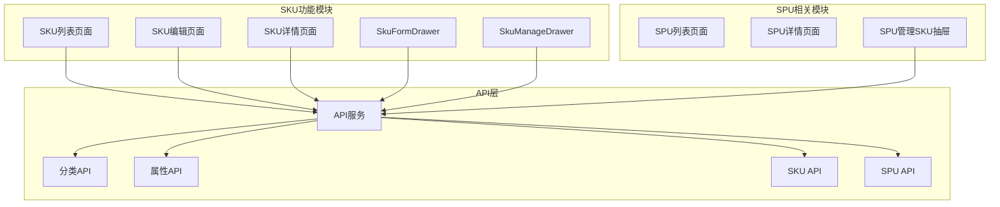

**图表来源**
- [SKU列表页面:1-886](file://apps/pc/src/views/product/sku/index.vue#L1-L886)
- [SKU编辑页面:1-296](file://apps/pc/src/views/product/sku/edit.vue#L1-L296)
- [SKU详情页面:1-319](file://apps/pc/src/views/product/sku/view.vue#L1-L319)

**章节来源**
- [SKU列表页面:1-886](file://apps/pc/src/views/product/sku/index.vue#L1-L886)
- [SKU编辑页面:1-296](file://apps/pc/src/views/product/sku/edit.vue#L1-L296)
- [SKU详情页面:1-319](file://apps/pc/src/views/product/sku/view.vue#L1-L319)

## 核心组件

### 数据模型设计

SKU功能涉及的核心数据模型包括：

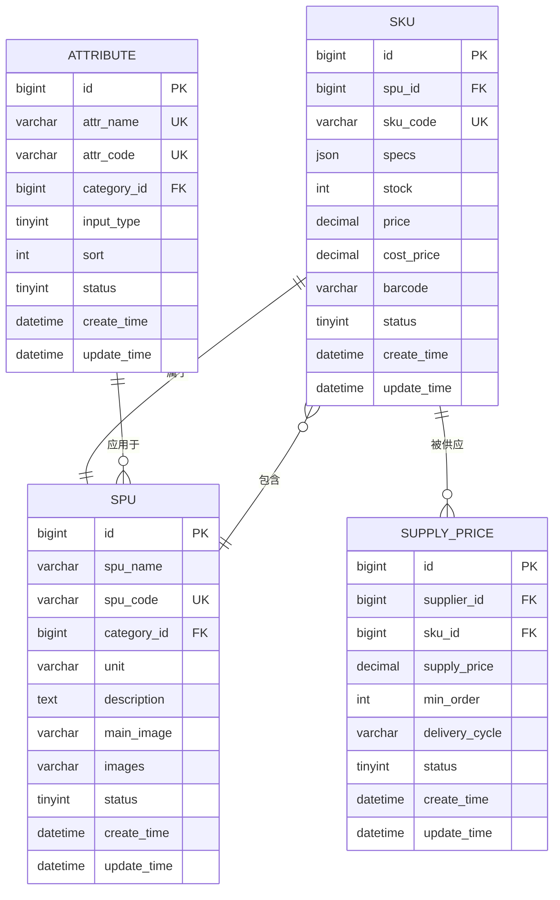

**图表来源**
- [数据模型与表结构.md:358-372](file://docs/PRD/03-数据模型与表结构.md#L358-L372)

### 核心业务规则

#### SKU编码规则
- **编码唯一性**：SKU编码在系统中唯一
- **编码格式**：建议使用SPU编码-规格值1-规格值2格式
- **编码不可修改**：SKU编码创建后不可修改
- **编码长度限制**：建议不超过50字符

#### SKU命名规则
- **名称必填**：SKU名称必须填写
- **名称长度限制**：建议不超过100字符
- **名称唯一性**：同一SPU下SKU名称不可重复
- **规格清晰**：SKU名称应包含明确的规格信息

#### SKU规格规则
- **规格必填**：SKU必须关联到具体的规格组合
- **规格唯一性**：同一SPU下规格组合不可重复
- **规格变更**：SKU创建后规格不可修改，只能删除重建
- **规格继承**：SKU继承SPU的基本属性

**章节来源**
- [商品SKU菜单功能详细设计.md:24-52](file://docs/PRD/16-商品SKU菜单功能详细设计.md#L24-L52)

## 架构概览

SKU菜单功能采用前后端分离架构，前端使用Vue 3 + TypeScript，后端提供RESTful API服务：

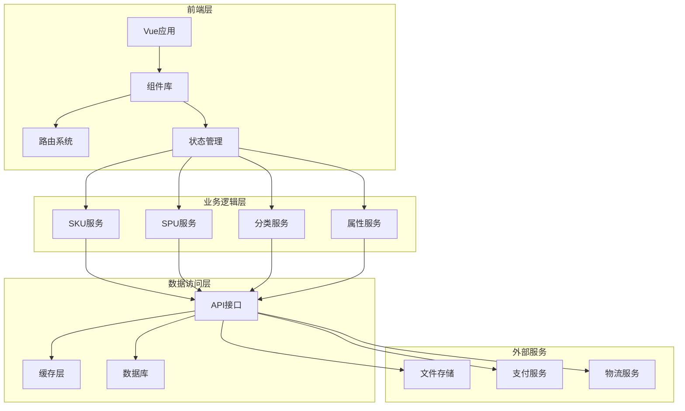

**图表来源**
- [SKU列表页面:251-256](file://apps/pc/src/views/product/sku/index.vue#L251-L256)
- [SKU表单抽屉:282-287](file://apps/pc/src/views/product/sku/components/SkuFormDrawer.vue#L282-L287)

## 详细组件分析

### SKU列表管理组件

SKU列表页面提供了完整的SKU管理功能：

#### 核心功能特性

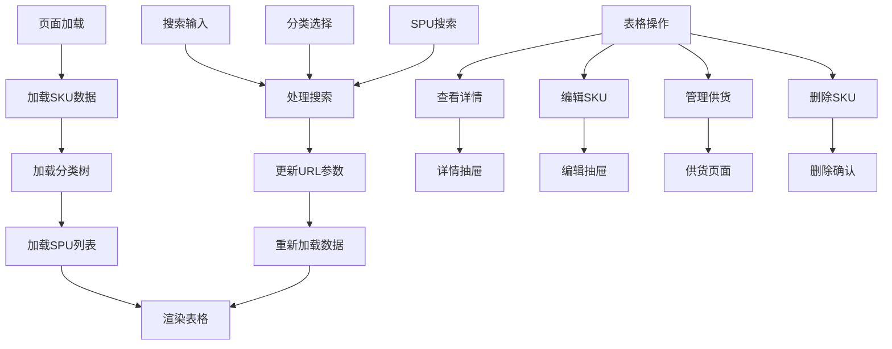

**图表来源**
- [SKU列表页面:526-584](file://apps/pc/src/views/product/sku/index.vue#L526-L584)

#### 数据展示规范

| 列名 | 宽度 | 对齐 | 特殊渲染 |
|------|------|------|----------|
| 主图 | 80px | 居中 | 48×48 圆角缩略图 |
| SKU编码 | 150px | 左 | 纯文本 |
| SKU名称 | 200px | 左 | 纯文本 |
| 所属SPU | 150px | 左 | 纯文本 |
| 所属分类 | 100px | 左 | 纯文本 |
| 规格 | 200px | 左 | key:value 小型Tag组合 |
| 单位 | 60px | 左 | 纯文本 |
| 供货价 | 100px | 右 | ¥ + 2位小数 格式化 |
| 销售价 | 100px | 右 | ¥ + 2位小数 格式化 |
| 状态 | 80px | 居中 | Switch 开关 |
| 创建时间 | 180px | 左 | 标准日期格式 |
| 操作 | 200px | 左 | 固定在右侧 |

#### 筛选和搜索功能

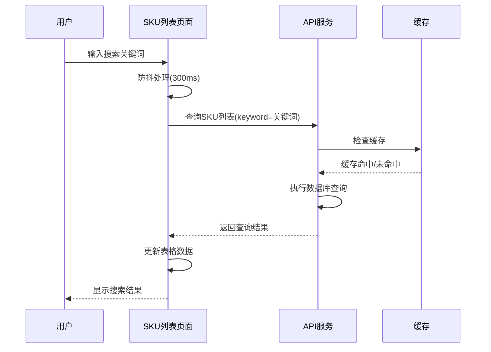

**图表来源**
- [SKU列表页面:586-589](file://apps/pc/src/views/product/sku/index.vue#L586-L589)

**章节来源**
- [SKU列表页面:1-886](file://apps/pc/src/views/product/sku/index.vue#L1-L886)

### SKU表单管理组件

SKU表单抽屉提供了完整的SKU创建和编辑功能：

#### 表单字段设计

| 字段名 | 组件类型 | 必填 | 长度限制 | 验证规则 | 占位提示 |
|--------|---------|------|----------|----------|----------|
| **所属SPU** | Select下拉 | ✅ 是 | - | 必选 | 请选择所属SPU |
| **主图** | Upload上传 | ❌ 否 | 最多1张 | 图片格式 | 上传主图（48×48） |
| **SKU编码** | Input输入 | ❌ 否 | 最多 50 字符 | 无 | 系统自动生成或手动输入 |
| **SKU名称** | Input输入 | ✅ 是 | 最多 200 字符 | 非空 | SKU名称 |
| **SKU规格属性** | 动态键值对 | ❌ 否 | 最多 10 组 | 无 | 点击添加规格项 |
| **供货价** | InputNumber | ❌ 否 | ≥ 0 | 数字 | 请输入供货价（元） |
| **销售价** | InputNumber | ❌ 否 | ≥ 0 | 数字 | 请输入销售价（元） |

#### 规格属性管理

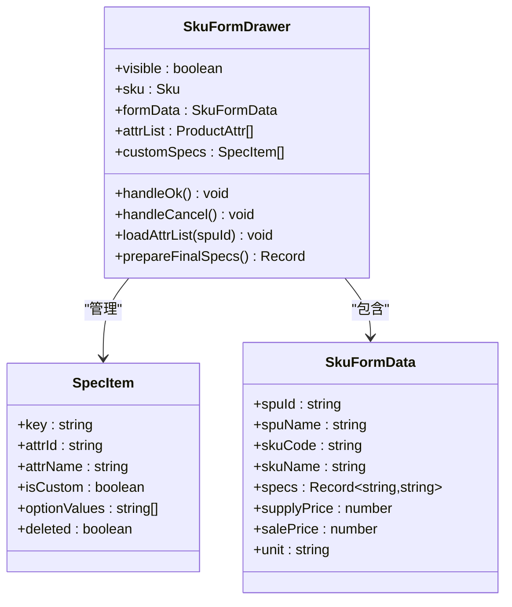

**图表来源**
- [SKU表单抽屉:282-330](file://apps/pc/src/views/product/sku/components/SkuFormDrawer.vue#L282-L330)

**章节来源**
- [SKU表单抽屉:1-721](file://apps/pc/src/views/product/sku/components/SkuFormDrawer.vue#L1-L721)

### SKU批量管理组件

SKU管理抽屉提供了批量SKU生成和管理功能：

#### 生成SKU流程

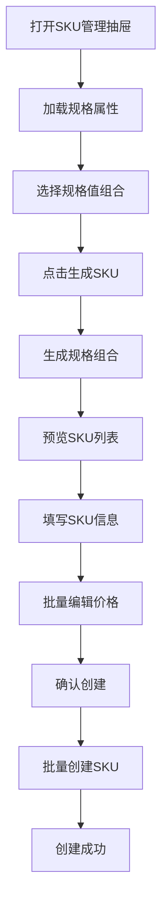

**图表来源**
- [SKU管理抽屉:354-381](file://apps/pc/src/views/product/sku/components/SkuManageDrawer.vue#L354-L381)

#### 批量操作功能

| 功能 | 描述 | 使用场景 |
|------|------|----------|
| **规格组合生成** | 基于选择的规格值生成所有可能的SKU组合 | 新商品上架、规格扩展 |
| **批量编辑价格** | 对生成的所有SKU批量设置供货价和销售价 | 价格调整、促销活动 |
| **批量删除SKU** | 删除不需要的SKU组合 | 清理无效规格、规格调整 |
| **批量导入SKU** | 从Excel文件批量导入SKU数据 | 系统初始化、数据迁移 |

**章节来源**
- [SKU管理抽屉:1-621](file://apps/pc/src/views/product/sku/components/SkuManageDrawer.vue#L1-L621)

### SPU集成管理组件

SPU详情页面集成了SKU管理功能：

#### SKU管理集成

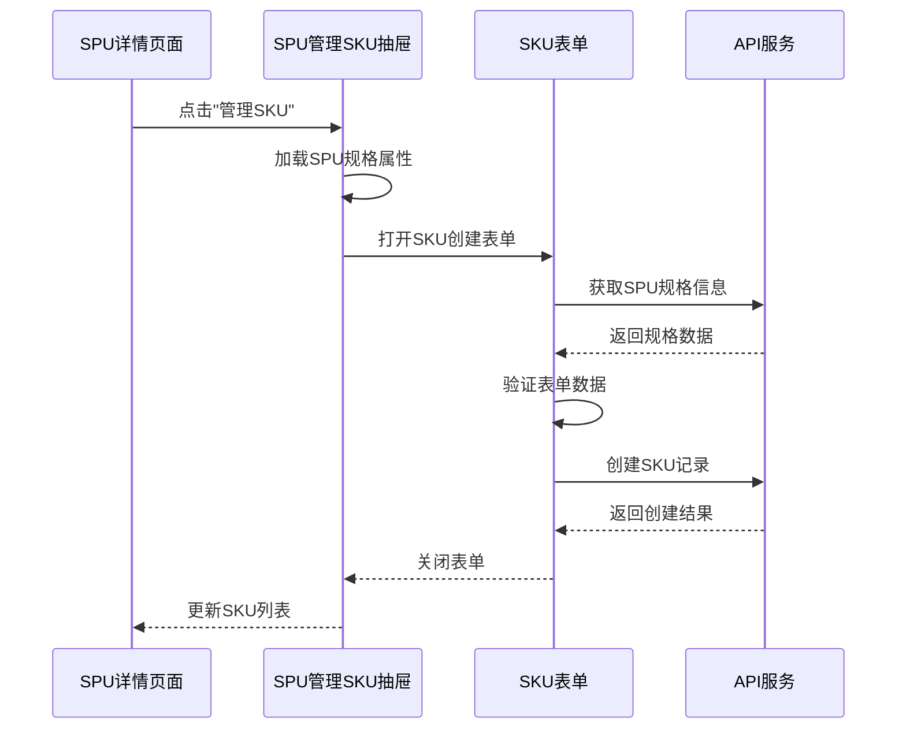

**图表来源**
- [SPU详情页面:186-193](file://apps/pc/src/views/product/spu/detail.vue#L186-L193)

**章节来源**
- [SPU详情页面:1-800](file://apps/pc/src/views/product/spu/detail.vue#L1-L800)

## 依赖关系分析

### 组件间依赖关系

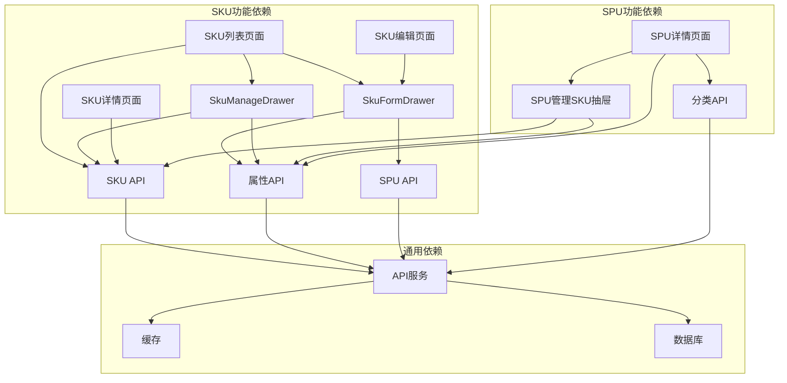

**图表来源**
- [SKU列表页面:251-256](file://apps/pc/src/views/product/sku/index.vue#L251-L256)
- [SKU表单抽屉:282-287](file://apps/pc/src/views/product/sku/components/SkuFormDrawer.vue#L282-L287)

### 数据流依赖

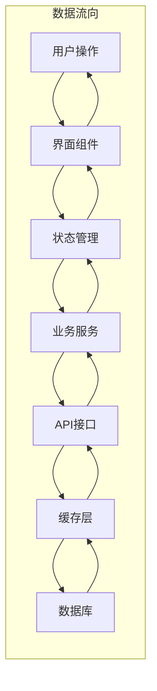

**图表来源**
- [SKU列表页面:483-524](file://apps/pc/src/views/product/sku/index.vue#L483-L524)

**章节来源**
- [SKU列表页面:251-524](file://apps/pc/src/views/product/sku/index.vue#L251-L524)

## 性能考虑

### 缓存策略

#### 多级缓存架构

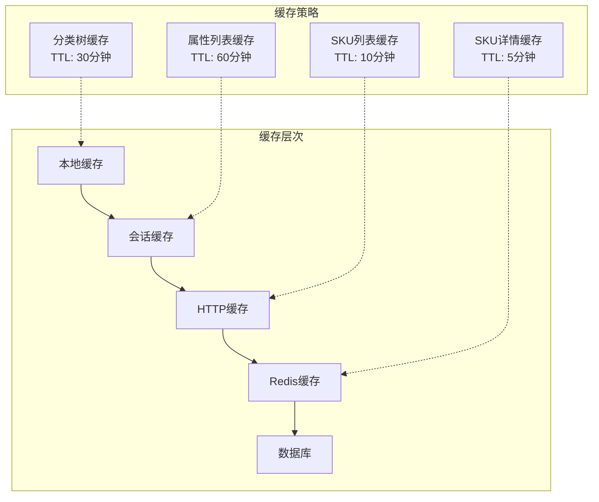

#### 缓存失效策略

| 缓存类型 | TTL设置 | 失效触发条件 | 更新策略 |
|----------|---------|--------------|----------|
| 分类树缓存 | 30分钟 | 分类数据变更 | 主动失效 + 定时刷新 |
| 属性列表缓存 | 60分钟 | 属性数据变更 | 主动失效 + 增量更新 |
| SKU列表缓存 | 10分钟 | SKU数据变更 | 主动失效 + 分页缓存 |
| SKU详情缓存 | 5分钟 | SKU详情变更 | 主动失效 + 即时更新 |

### 性能优化措施

#### 前端优化

1. **虚拟滚动**：对于大量SKU数据采用虚拟滚动技术
2. **懒加载**：图片和详情内容采用懒加载
3. **防抖搜索**：搜索输入添加300ms防抖
4. **分页加载**：默认每页20条，支持10/20/50/100条切换

#### 后端优化

1. **索引优化**：SKU编码、SPU关联、分类关联建立合适索引
2. **查询优化**：使用JOIN查询减少数据库访问次数
3. **批量操作**：支持批量创建、更新、删除SKU
4. **并发控制**：SKU创建和更新操作的并发控制

## 故障排除指南

### 常见问题及解决方案

#### SKU创建失败

**问题现象**：创建SKU时报错"SKU编码已存在"

**排查步骤**：
1. 检查SKU编码是否唯一
2. 验证SPU规格组合是否重复
3. 确认规格属性是否正确选择

**解决方案**：
```javascript
// 检查SKU编码唯一性
const checkSkuCode = async (skuCode) => {
  try {
    const response = await getSkuDetail(skuCode);
    if (response) {
      throw new Error('SKU编码已存在');
    }
  } catch (error) {
    // 编码不存在，可以使用
  }
};
```

#### 规格组合冲突

**问题现象**：编辑SKU时提示"规格组合已存在"

**排查步骤**：
1. 检查同一SPU下的规格组合
2. 验证规格属性值的唯一性
3. 确认规格组合的JSON结构

**解决方案**：
```javascript
// 验证规格组合唯一性
const validateSpecCombination = (specs, existingSkus) => {
  const specKey = JSON.stringify(specs);
  const exists = existingSkus.some(sku => 
    JSON.stringify(sku.specs) === specKey
  );
  return !exists;
};
```

#### 性能问题

**问题现象**：SKU列表加载缓慢

**排查步骤**：
1. 检查网络请求响应时间
2. 分析数据库查询性能
3. 监控前端渲染性能

**优化方案**：
1. 实施分页加载
2. 添加搜索索引
3. 优化图片加载
4. 实现缓存策略

**章节来源**
- [SKU列表页面:604-620](file://apps/pc/src/views/product/sku/index.vue#L604-L620)

## 结论

商品SKU菜单功能通过模块化的组件设计和完善的业务逻辑，实现了灵活高效的SKU管理能力。系统采用前后端分离架构，具备良好的扩展性和维护性。

### 核心优势

1. **功能完整**：涵盖SKU的创建、编辑、查询、删除等完整生命周期
2. **用户体验**：提供直观的界面和流畅的交互体验
3. **性能优化**：通过缓存和分页等技术保证系统性能
4. **扩展性强**：模块化设计便于功能扩展和维护

### 技术亮点

1. **响应式设计**：适配不同屏幕尺寸的设备
2. **权限控制**：基于角色的精细化权限管理
3. **数据验证**：前后端双重数据验证机制
4. **错误处理**：完善的异常处理和用户反馈机制

该设计为开发团队提供了清晰的实现指导，能够满足不同业务场景的需求，为商品SKU管理提供了稳定可靠的技术支撑。