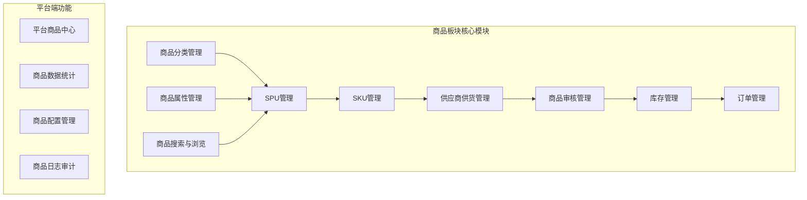
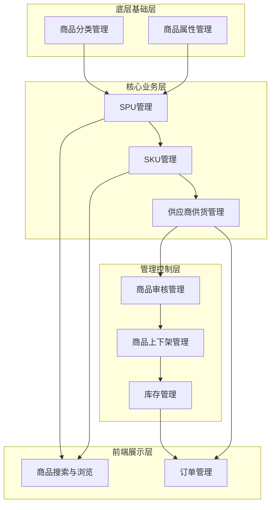
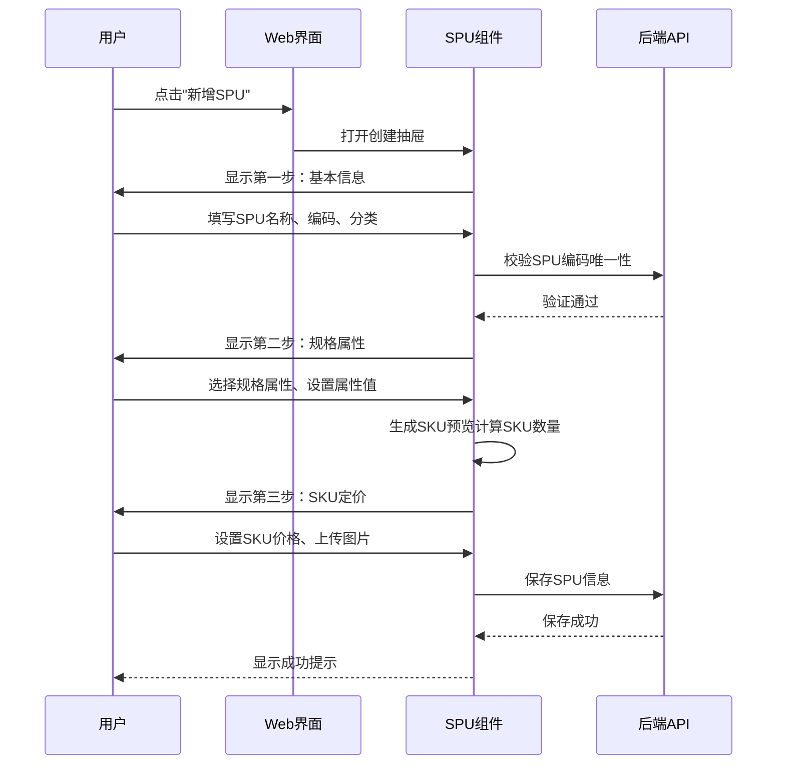
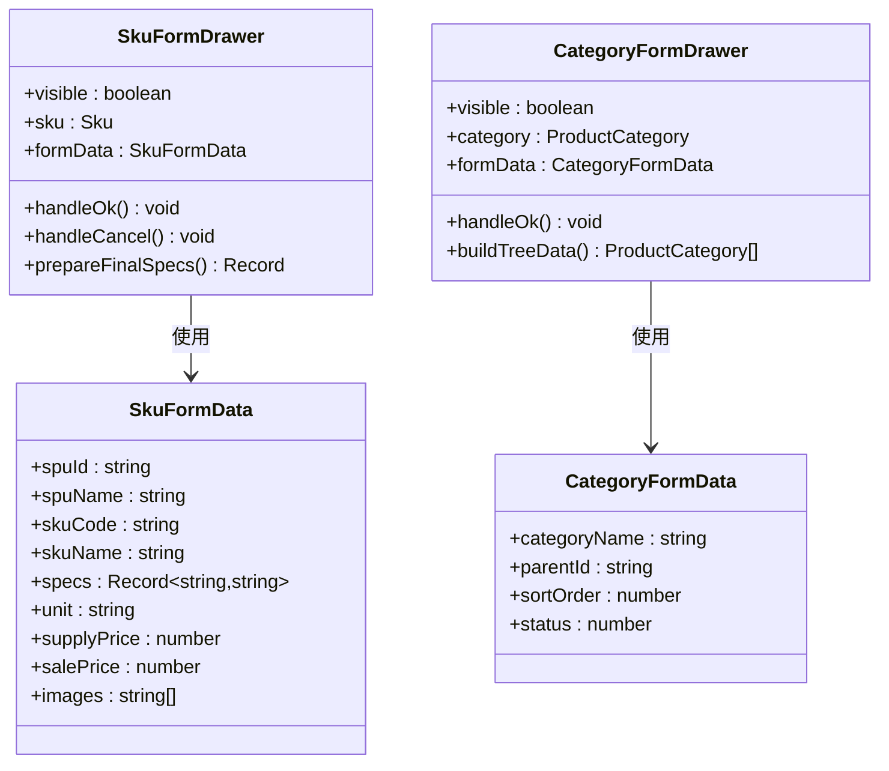
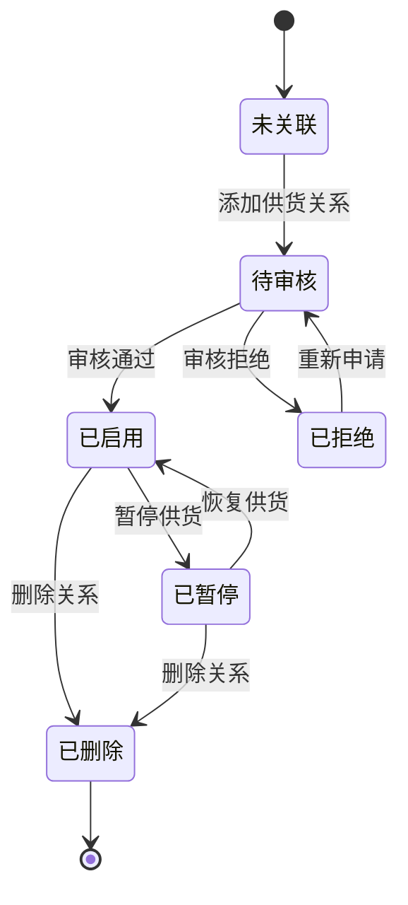

# 商品板块功能清单

<cite>
**本文档引用的文件**
- [商品板块功能清单.md](file://docs/PRD/06-商品板块功能清单.md)
- [平台端商品中心功能清单.md](file://docs/PRD/07-平台端商品中心功能清单.md)
- [SPU管理功能详细设计.md](file://docs/PRD/18-SPU管理功能详细设计.md)
- [商品SKU菜单功能详细设计.md](file://docs/PRD/16-商品SKU菜单功能详细设计.md)
- [Step1BasicInfo.vue](file://apps/pc/src/views/product/spu/components/Step1BasicInfo.vue)
- [Step2SpecConfig.vue](file://apps/pc/src/views/product/spu/components/Step2SpecConfig.vue)
- [Step3SkuPrice.vue](file://apps/pc/src/views/product/spu/components/Step3SkuPrice.vue)
- [SkuFormDrawer.vue](file://apps/pc/src/views/product/sku/components/SkuFormDrawer.vue)
- [CategoryFormDrawer.vue](file://apps/pc/src/views/product/category/components/CategoryFormDrawer.vue)
- [AttrFormDrawer.vue](file://apps/pc/src/views/product/attr/components/AttrFormDrawer.vue)
- [index.vue](file://apps/pc/src/views/product/supply/index.vue)
- [index.vue](file://apps/pc/src/views/product/supplier-audit/index.vue)
- [index.vue](file://apps/pc/src/views/product/attr/index.vue)
</cite>

## 目录
1. [项目概述](#项目概述)
2. [功能模块总览](#功能模块总览)
3. [核心功能清单](#核心功能清单)
4. [功能优先级分析](#功能优先级分析)
5. [功能依赖关系图](#功能依赖关系图)
6. [详细功能设计](#详细功能设计)
7. [验收标准与边界定义](#验收标准与边界定义)
8. [扩展性考虑](#扩展性考虑)
9. [开发实施建议](#开发实施建议)
10. [总结](#总结)

## 项目概述

工程材料管理采供一体化平台的商品板块是整个系统的核心功能模块，负责商品全生命周期的管理。该模块采用前后端分离架构，基于Vue 3 + TypeScript技术栈开发，为平台管理员、供应商、工程仓、施工方等不同角色提供完整的商品管理能力。

商品板块主要包含商品分类管理、规格属性管理、SPU管理、SKU管理、供应商供货管理、商品审核管理等核心功能，通过模块化的组件设计实现了高度的可扩展性和可维护性。

## 功能模块总览

商品板块按照业务功能划分为以下主要模块：

**图表来源**
- [商品板块功能清单.md:1-273](file://docs/PRD/06-商品板块功能清单.md#L1-L273)
- [平台端商品中心功能清单.md:1-280](file://docs/PRD/07-平台端商品中心功能清单.md#L1-L280)

## 核心功能清单

### 商品分类管理

| 功能点 | 描述 | 业务场景 | 关键字段 |
|--------|------|----------|----------|
| 分类列表查询 | 查看商品分类列表 | 平台管理员查看所有分类 | 分类名称、分类编码、层级、状态 |
| 分类详情查看 | 查看分类详细信息 | 了解分类具体信息 | 分类ID、父分类ID、排序、图标 |
| 分类创建 | 新增商品分类 | 平台新增分类 | 分类名称、父分类、排序、状态 |
| 分类编辑 | 编辑分类信息 | 更新分类信息 | 分类名称、排序、状态 |
| 分类删除 | 删除商品分类 | 移除不再使用的分类 | 关联检查：子分类、商品关联 |
| 分类启用/禁用 | 控制分类状态 | 管理分类可用性 | 状态字段 |
| 分类排序 | 调整显示顺序 | 优化用户体验 | 排序号 |

### 商品属性管理

| 功能点 | 描述 | 业务场景 | 关键字段 |
|--------|------|----------|----------|
| 属性列表查询 | 查看商品属性列表 | 管理员查看属性 | 属性名称、编码、类型、状态 |
| 属性详情查看 | 查看属性详细信息 | 了解属性及值列表 | 属性ID、类型、可选值 |
| 属性创建 | 新增商品属性 | 为分类添加属性 | 属性名称、编码、类型、必填 |
| 属性编辑 | 编辑属性信息 | 更新属性配置 | 属性信息、排序 |
| 属性删除 | 删除商品属性 | 移除不再使用的属性 | 关联检查：属性值、商品使用 |
| 属性启用/禁用 | 控制属性状态 | 管理属性可用性 | 状态字段 |
| 属性值管理 | 管理属性可选值 | 设置规格选项 | 属性值名称、编码、排序 |

### SPU管理

| 功能点 | 描述 | 业务场景 | 关键字段 |
|--------|------|----------|----------|
| SPU列表查询 | 查看SPU列表 | 管理员查看商品 | SPU名称、编码、分类、状态 |
| SPU详情查看 | 查看SPU详细信息 | 了解SPU完整信息 | SPU基本信息、规格参数、SKU列表 |
| SPU创建 | 创建新SPU | 供应商新增商品 | 基本信息、规格属性、图片、描述 |
| SPU编辑 | 编辑SPU信息 | 更新商品信息 | 基本信息、规格参数、价格 |
| SPU删除 | 删除SPU | 移除不再使用的商品 | 关联检查：SKU、库存、订单 |
| SPU提交审核 | 提交SPU审核 | 商品创建完成后的审核流程 | 审核状态、审核记录 |
| SPU上架/下架 | 控制商品销售状态 | 管理商品上下架 | 上架状态、时间戳 |
| SPU导入/导出 | 批量管理SPU | 大量商品数据处理 | 批量操作、模板下载 |

### SKU管理

| 功能点 | 描述 | 业务场景 | 关键字段 |
|--------|------|----------|----------|
| SKU列表查询 | 查看SKU列表 | 管理员查看SKU | SKU名称、编码、规格、状态 |
| SKU详情查看 | 查看SKU详细信息 | 了解SKU完整信息 | SKU基本信息、规格属性、价格 |
| SKU创建 | 创建新SKU | 为SPU添加规格 | SKU名称、编码、规格属性、价格 |
| SKU编辑 | 编辑SKU信息 | 更新SKU信息 | SKU信息、规格、价格 |
| SKU删除 | 删除SKU | 移除不再使用的规格 | 关联检查：库存、订单 |
| SKU启用/禁用 | 控制SKU状态 | 管理SKU可用性 | 状态字段 |
| SKU批量生成 | 批量生成SKU | 根据规格组合生成 | 规格组合、批量操作 |

### 供应商供货管理

| 功能点 | 描述 | 业务场景 | 关键字段 |
|--------|------|----------|----------|
| 供货关系管理 | 管理商品与供应商关系 | 建立商品供应链 | 供应商、商品、价格、条件 |
| 供货价格设置 | 设置商品供货价格 | 供应商报价管理 | 供货价、起订量、交货周期 |
| 供货价格调整 | 调整现有价格 | 价格变更管理 | 新价格、生效日期、原因 |
| 供货状态控制 | 控制供货状态 | 供应商服务管理 | 状态：启用/暂停/停用 |
| 供货数据分析 | 分析供货情况 | 供应链优化 | 价格对比、供应商评分 |
| 供货批量管理 | 批量管理供货关系 | 大规模供应链管理 | 批量操作、模板导入 |

### 商品审核管理

| 功能点 | 描述 | 业务场景 | 关键字段 |
|--------|------|----------|----------|
| 审核列表查询 | 查看待审核商品 | 审核员处理审核 | 商品信息、审核状态、提交时间 |
| 审核详情查看 | 查看审核详细信息 | 了解审核具体内容 | 商品信息、审核记录、历史 |
| 审核通过 | 通过商品审核 | 商品正式上线 | 审核意见、审核人、时间 |
| 审核拒绝 | 拒绝商品审核 | 商品退回修改 | 拒绝原因、审核意见 |
| 重新提交审核 | 重新发起审核 | 修改后再次审核 | 重新提交、审核状态 |
| 审核记录查询 | 查看审核历史 | 审核追溯 | 审核历史、操作记录 |

**章节来源**
- [商品板块功能清单.md:24-273](file://docs/PRD/06-商品板块功能清单.md#L24-L273)
- [平台端商品中心功能清单.md:26-280](file://docs/PRD/07-平台端商品中心功能清单.md#L26-L280)

## 功能优先级分析

根据业务重要性和紧急程度，将功能模块分为三个优先级层次：

### P0级（核心功能，必须实现）
- 商品分类管理：基础组织结构
- 商品属性管理：规格定义基础
- SPU管理：商品主体管理
- SKU管理：商品规格管理
- 供应商供货管理：供应链核心
- 商品审核管理：质量保证

### P1级（重要功能，建议实现）
- 商品上下架管理：销售控制
- 供应商商品管理：供应商管理
- 商品数据统计：运营分析
- 价格管理：商业核心

### P2级（辅助功能，可选实现）
- 商品配置管理：系统配置
- 商品日志审计：合规管理
- 商品导入导出：数据处理

**章节来源**
- [平台端商品中心功能清单.md:40-52](file://docs/PRD/07-平台端商品中心功能清单.md#L40-L52)

## 功能依赖关系图

**图表来源**
- [商品板块功能清单.md:1-273](file://docs/PRD/06-商品板块功能清单.md#L1-L273)
- [平台端商品中心功能清单.md:26-280](file://docs/PRD/07-平台端商品中心功能清单.md#L26-L280)

## 详细功能设计

### SPU创建流程设计

SPU创建采用三步流程设计，确保商品信息的完整性和准确性：

**图表来源**
- [Step1BasicInfo.vue:1-142](file://apps/pc/src/views/product/spu/components/Step1BasicInfo.vue#L1-L142)
- [Step2SpecConfig.vue:1-331](file://apps/pc/src/views/product/spu/components/Step2SpecConfig.vue#L1-L331)
- [Step3SkuPrice.vue:1-601](file://apps/pc/src/views/product/spu/components/Step3SkuPrice.vue#L1-L601)

### SKU管理功能设计

SKU管理提供完整的规格商品管理能力：

**图表来源**
- [SkuFormDrawer.vue:1-721](file://apps/pc/src/views/product/sku/components/SkuFormDrawer.vue#L1-L721)
- [CategoryFormDrawer.vue:1-169](file://apps/pc/src/views/product/category/components/CategoryFormDrawer.vue#L1-L169)

### 供应商供货管理设计

供应商供货管理提供灵活的供应链关系管理：

**图表来源**
- [index.vue:1-800](file://apps/pc/src/views/product/supply/index.vue#L1-L800)

**章节来源**
- [SPU管理功能详细设计.md:1-829](file://docs/PRD/18-SPU管理功能详细设计.md#L1-L829)
- [商品SKU菜单功能详细设计.md:1-1116](file://docs/PRD/16-商品SKU菜单功能详细设计.md#L1-L1116)

## 验收标准与边界定义

### 功能验收标准

#### 数据完整性标准
- **SPU创建**：SPU名称、编码、分类、计量单位必填，编码唯一
- **SKU创建**：SKU名称、编码、规格组合、计量单位必填，编码唯一
- **属性管理**：属性名称、编码、类型必填，单选/多选类型需设置可选值
- **分类管理**：分类名称必填，支持层级结构

#### 业务流程标准
- **审核流程**：待审核、审核中、已通过、已拒绝状态流转完整
- **库存管理**：库存数量准确，出入库记录完整
- **价格管理**：价格生效时间控制，历史价格可追溯
- **权限控制**：不同角色操作权限明确，数据访问控制严格

#### 界面交互标准
- **响应时间**：页面加载时间≤3秒，操作响应时间≤2秒
- **错误处理**：错误信息友好，提供解决方案
- **移动端适配**：在移动设备上功能完整可用
- **国际化支持**：支持多语言显示

### 功能边界定义

#### 内部边界
- **商品中心**：平台管理员专用功能模块
- **供应商端**：供应商自助管理功能
- **工程仓端**：工程仓商品管理功能
- **施工方端**：施工方商品浏览功能

#### 外部边界
- **第三方集成**：物流接口、支付接口、短信通知
- **数据交换**：与ERP系统、财务系统的数据对接
- **安全边界**：用户认证、权限控制、数据加密

**章节来源**
- [商品板块功能清单.md:239-255](file://docs/PRD/06-商品板块功能清单.md#L239-L255)
- [平台端商品中心功能清单.md:246-262](file://docs/PRD/07-平台端商品中心功能清单.md#L246-L262)

## 扩展性考虑

### 技术扩展性

#### 架构扩展
- **微服务化**：商品服务独立部署，支持水平扩展
- **缓存策略**：Redis缓存热点数据，提升访问性能
- **消息队列**：异步处理大批量数据导入导出
- **搜索引擎**：Elasticsearch支持商品搜索和推荐

#### 功能扩展
- **多租户支持**：支持多个平台实例运行
- **多语言支持**：国际化功能扩展
- **多币种支持**：国际化价格管理
- **移动端APP**：原生移动应用支持

### 业务扩展性

#### 商业模式扩展
- **B2B/B2C混合**：支持多种商业模式
- **多平台接入**：支持多个电商平台接入
- **供应链金融**：提供供应链金融服务
- **智能推荐**：基于AI的商品推荐系统

#### 数据分析扩展
- **实时分析**：流式数据处理和分析
- **预测分析**：基于历史数据的预测模型
- **商业智能**：可视化报表和仪表板
- **用户画像**：精细化用户行为分析

## 开发实施建议

### 开发阶段规划

#### 第一阶段（2-3周）
- 商品分类管理基础功能
- 商品属性管理基础功能
- SPU管理核心功能
- SKU管理核心功能

#### 第二阶段（3-4周）
- 供应商供货管理
- 商品审核管理
- 库存管理基础功能
- 订单管理基础功能

#### 第三阶段（2-3周）
- 商品搜索与浏览
- 商品数据统计
- 系统配置管理
- 权限控制完善

### 技术实现要点

#### 前端技术栈
- **框架**：Vue 3 + TypeScript
- **UI库**：Arco Design
- **状态管理**：Pinia
- **路由**：Vue Router
- **构建工具**：Vite

#### 后端技术栈
- **框架**：Spring Boot
- **数据库**：MySQL + Redis
- **消息队列**：RabbitMQ
- **搜索引擎**：Elasticsearch
- **文件存储**：MinIO

#### 开发规范
- **代码规范**：ESLint + Prettier
- **Git工作流**：Git Flow
- **测试覆盖**：单元测试 + 集成测试
- **文档标准**：Swagger + Markdown

### 质量保证措施

#### 测试策略
- **单元测试**：覆盖率≥80%
- **集成测试**：接口测试完整
- **性能测试**：并发用户≥1000
- **安全测试**：渗透测试通过

#### 监控运维
- **应用监控**：APM监控系统
- **日志管理**：ELK日志分析
- **告警系统**：多级告警机制
- **备份策略**：自动备份和恢复

## 总结

商品板块作为工程材料管理采供一体化平台的核心模块，通过完善的商品管理体系实现了从商品创建、规格管理到供应链协同的全链路覆盖。该功能清单详细描述了各个功能模块的设计思路、业务流程和技术实现方案，为开发团队提供了清晰的开发指导。

通过合理的功能优先级划分、严格的验收标准定义和充分的扩展性考虑，确保了商品板块能够满足当前业务需求的同时，具备良好的可扩展性和可维护性。开发团队应严格按照功能清单要求进行开发，确保各功能模块的质量和一致性。

在实施过程中，建议重点关注以下方面：
1. **数据一致性**：确保商品数据在各模块间的同步和一致性
2. **性能优化**：针对大数据量场景进行性能优化
3. **用户体验**：持续改进界面交互和操作流程
4. **安全保障**：加强数据安全和用户权限控制
5. **监控运维**：建立完善的监控和运维体系

通过以上措施，商品板块将成为一个功能完善、性能优异、易于维护的高质量系统模块。