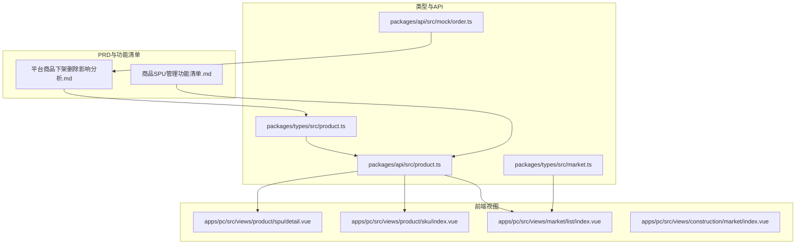
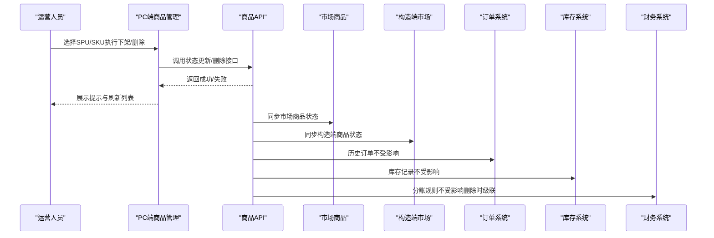
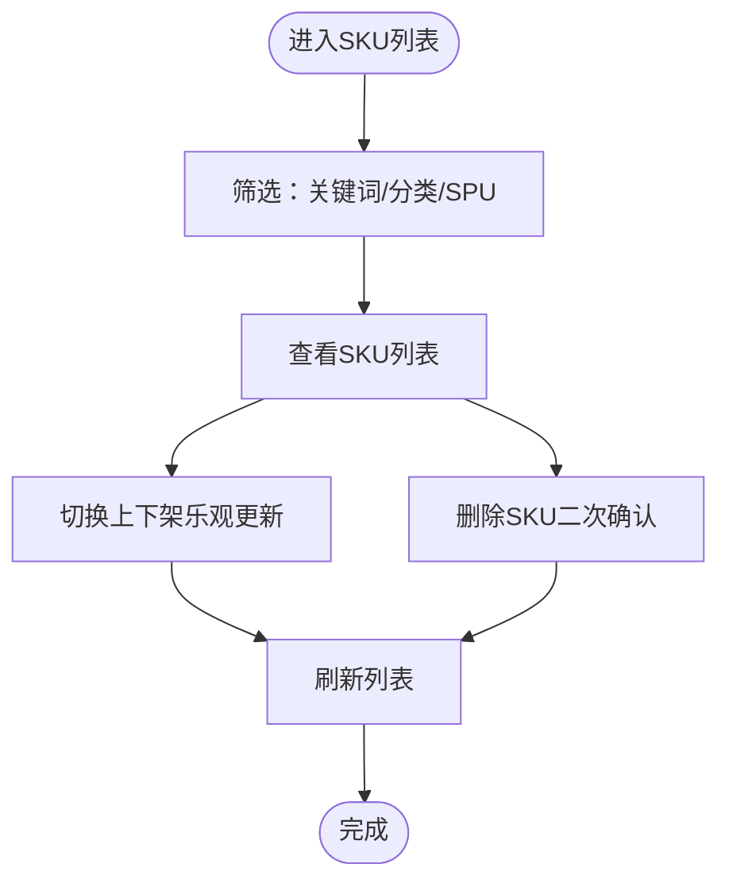
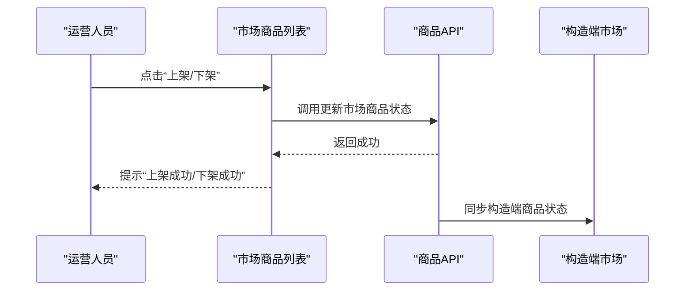
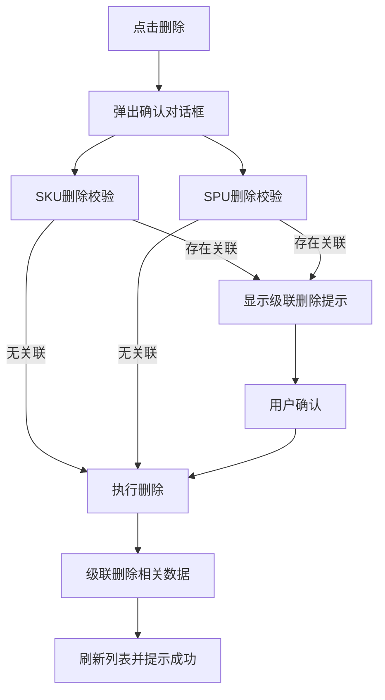
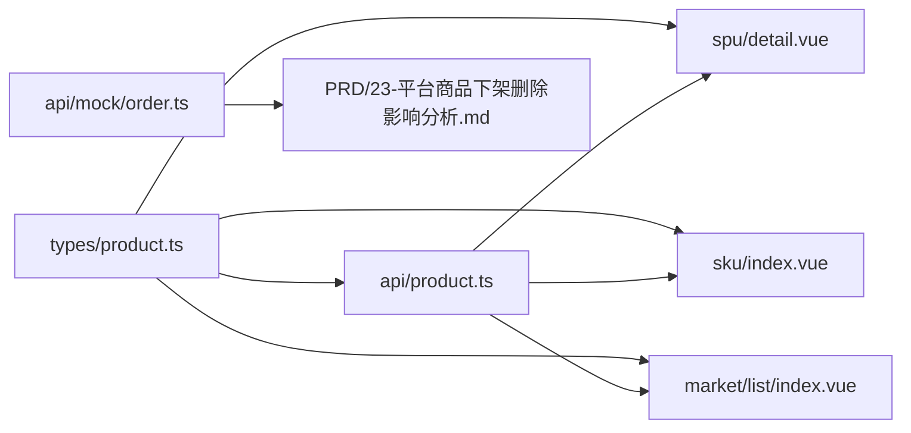

# 平台商品下架删除影响分析

<cite>
**本文引用的文件**
- [平台商品下架删除影响分析.md](file://docs/PRD/23-平台商品下架删除影响分析.md)
- [商品SPU管理功能清单.md](file://docs/PRD/07-平台端商品中心功能清单.md)
- [market.ts](file://packages/types/src/market.ts)
- [product.ts](file://packages/types/src/product.ts)
- [product.ts](file://packages/api/src/product.ts)
- [spu/detail.vue](file://apps/pc/src/views/product/spu/detail.vue)
- [sku/index.vue](file://apps/pc/src/views/product/sku/index.vue)
- [market/list/index.vue](file://apps/pc/src/views/market/list/index.vue)
- [construction/market/index.vue](file://apps/pc/src/views/construction/market/index.vue)
- [order.ts](file://packages/api/src/mock/order.ts)
- [供应商端产品PRD.md](file://docs/供应商端产品PRD.md)
- [平台端_产品功能清单.md](file://scripts/产品功能清单/平台端_产品功能清单.md)
</cite>

## 目录
1. [引言](#引言)
2. [项目结构](#项目结构)
3. [核心组件](#核心组件)
4. [架构总览](#架构总览)
5. [详细组件分析](#详细组件分析)
6. [依赖分析](#依赖分析)
7. [性能考虑](#性能考虑)
8. [故障排查指南](#故障排查指南)
9. [结论](#结论)
10. [附录](#附录)

## 引言
本文件面向平台运营方，系统化梳理“平台商品下架/删除”对订单系统、库存系统、财务系统、用户界面等模块的影响，并给出业务流程、数据清理策略、状态同步机制、用户通知机制、影响范围评估、风险控制措施、回滚机制与数据备份策略，帮助以最小化业务影响的方式安全执行商品下架/删除操作。

## 项目结构
围绕商品下架/删除的关键路径，涉及以下模块与文件：
- PRD与功能清单：用于明确业务规则与操作边界
- 类型定义：统一SPU/SKU/市场商品状态与字段
- 前端视图：SPU/SKU管理、市场商品上下架、构造端商品列表
- API与Mock：商品状态更新、删除、统计与日志查询
- 订单与财务：订单状态机、财务合规与凭证管理

**图表来源**
- [平台商品下架删除影响分析.md](file://docs/PRD/23-平台商品下架删除影响分析.md)
- [商品SPU管理功能清单.md](file://docs/PRD/07-平台端商品中心功能清单.md)
- [product.ts](file://packages/types/src/product.ts)
- [market.ts](file://packages/types/src/market.ts)
- [product.ts](file://packages/api/src/product.ts)
- [order.ts](file://packages/api/src/mock/order.ts)
- [spu/detail.vue](file://apps/pc/src/views/product/spu/detail.vue)
- [sku/index.vue](file://apps/pc/src/views/product/sku/index.vue)
- [market/list/index.vue](file://apps/pc/src/views/market/list/index.vue)
- [construction/market/index.vue](file://apps/pc/src/views/construction/market/index.vue)

**章节来源**
- [平台商品下架删除影响分析.md](file://docs/PRD/23-平台商品下架删除影响分析.md)
- [商品SPU管理功能清单.md](file://docs/PRD/07-平台端商品中心功能清单.md)

## 核心组件
- 商品状态枚举与模型
  - SPU/SKU状态：上架/下架
  - 市场商品状态：在线/离线
  - 价格调整状态：待审/已审/已拒
- 前端管理组件
  - SPU详情与SKU列表管理
  - 市场商品上下架与价格设置
  - 构造端商品列表展示
- API与Mock
  - SKU状态更新、删除、批量更新
  - 商品统计与操作日志查询
  - 订单Mock数据

**章节来源**
- [product.ts](file://packages/types/src/product.ts)
- [market.ts](file://packages/types/src/market.ts)
- [product.ts](file://packages/api/src/product.ts)
- [order.ts](file://packages/api/src/mock/order.ts)
- [spu/detail.vue](file://apps/pc/src/views/product/spu/detail.vue)
- [sku/index.vue](file://apps/pc/src/views/product/sku/index.vue)
- [market/list/index.vue](file://apps/pc/src/views/market/list/index.vue)
- [construction/market/index.vue](file://apps/pc/src/views/construction/market/index.vue)

## 架构总览
下架/删除操作在平台侧通过“状态更新/删除API”驱动，前端组件负责交互与提示；市场侧商品状态与构造端商品列表实时反映变化；历史订单、库存与财务数据保持不变并受保护。

**图表来源**
- [spu/detail.vue](file://apps/pc/src/views/product/spu/detail.vue)
- [sku/index.vue](file://apps/pc/src/views/product/sku/index.vue)
- [market/list/index.vue](file://apps/pc/src/views/market/list/index.vue)
- [product.ts](file://packages/api/src/product.ts)
- [platform端_产品功能清单.md](file://scripts/产品功能清单/平台端_产品功能清单.md)

## 详细组件分析

### 商品状态与模型
- SPU/SKU状态
  - SPU状态：启用/禁用
  - SKU状态：上架/下架
- 市场商品状态
  - 在线/离线
- 价格调整状态
  - 待审/已审/已拒

这些状态贯穿下架/删除流程，决定前端交互与后端行为。

**章节来源**
- [product.ts](file://packages/types/src/product.ts)
- [market.ts](file://packages/types/src/market.ts)

### SPU管理与SKU管理
- SPU详情页
  - 支持编辑SPU信息、管理SKU组合
  - SKU列表支持批量设置价格、单独新增SKU
- SKU列表页
  - 支持按关键词、分类、SPU筛选
  - 支持切换上下架状态（乐观更新+失败回滚）
  - 支持删除SKU（二次确认）

**图表来源**
- [sku/index.vue](file://apps/pc/src/views/product/sku/index.vue)

**章节来源**
- [spu/detail.vue](file://apps/pc/src/views/product/spu/detail.vue)
- [sku/index.vue](file://apps/pc/src/views/product/sku/index.vue)

### 市场商品上下架与价格设置
- 市场商品列表页
  - 支持上架/下架操作
  - 支持设置价格与标签
- 构造端市场
  - 展示在线/离线商品，离线商品标记为“离线”

**图表来源**
- [market/list/index.vue](file://apps/pc/src/views/market/list/index.vue)
- [construction/market/index.vue](file://apps/pc/src/views/construction/market/index.vue)

**章节来源**
- [market/list/index.vue](file://apps/pc/src/views/market/list/index.vue)
- [construction/market/index.vue](file://apps/pc/src/views/construction/market/index.vue)

### 删除前校验与确认流程
- SKU删除前校验
  - 供货关系是否存在
  - 分账规则是否存在
  - 是否被工程仓引用
  - 是否有历史订单
- SPU删除前校验
  - 是否包含SKU
  - 是否包含供货关系
  - 是否包含分账规则
  - 是否被工程仓引用
  - 是否有历史订单
- 删除确认流程
  - 弹出确认对话框
  - 根据校验结果显示不同提示
  - 用户确认后执行删除与级联清理

**图表来源**
- [平台商品下架删除影响分析.md](file://docs/PRD/23-平台商品下架删除影响分析.md)

**章节来源**
- [平台商品下架删除影响分析.md](file://docs/PRD/23-平台商品下架删除影响分析.md)

### 影响范围与业务规则
- SKU下架
  - 供货关系状态：保持不变
  - 工程仓商品状态：保持不变（列表中显示“已下架”标签）
  - 历史订单：保持不变（列表中显示“已下架”标签）
  - 库存记录：保持不变
  - 分账规则：保持不变
  - 新增业务：禁止（新增供货/创建采购/新增分账）
- SPU下架
  - 级联下架其下所有SKU
  - 供货关系状态：保持不变
  - 工程仓商品状态：保持不变（列表中显示“已下架”标签）
  - 历史订单：保持不变（列表中显示“已下架”标签）
  - 库存记录：保持不变
  - 分账规则：保持不变
  - 新增业务：禁止（新增供货/创建采购/新增分账/上架SKU）
- SKU删除
  - 级联删除该SKU下的所有供货关系与分账规则
  - 工程仓商品状态：保持不变（列表中显示“已删除”标签）
  - 历史订单：保持不变（列表中显示“已删除”标签）
  - 库存记录：保持不变
- SPU删除
  - 级联删除其下所有SKU、供货关系与分账规则
  - 工程仓商品状态：保持不变（列表中显示“已删除”标签）
  - 历史订单：保持不变（列表中显示“已删除”标签）
  - 库存记录：保持不变

**章节来源**
- [平台商品下架删除影响分析.md](file://docs/PRD/23-平台商品下架删除影响分析.md)

### 界面提示与用户体验
- 下架提示
  - “该SKU/SPU已下架，部分功能可能受限制”
  - “该SKU/SPU已下架，不能新增供货关系/创建采购订单/新增分账规则”
- 删除提示
  - “该SKU/SPU已删除，部分功能可能受限制”
  - “该SKU/SPU已删除，不能新增供货关系/创建采购订单/新增分账规则”
- 提示展示方式
  - 警告提示：黄色背景
  - 错误提示：红色背景
  - 标签提示：已下架/已删除

**章节来源**
- [平台商品下架删除影响分析.md](file://docs/PRD/23-平台商品下架删除影响分析.md)

### 数据恢复策略与软删除
- 软删除机制
  - 使用“deleted_at”字段进行软删除，支持后台恢复
- 数据保留策略
  - 历史订单、库存记录、操作日志、供货关系、分账记录永久保留
- 数据归档策略
  - 已删除的SPU/SKU/供货关系/分账规则在一年后归档至历史表

**章节来源**
- [平台商品下架删除影响分析.md](file://docs/PRD/23-平台商品下架删除影响分析.md)

### 业务场景示例
- SKU下架：仅影响后续业务，历史数据与库存不受影响
- SKU删除：级联删除供货关系与分账规则，工程仓商品与历史订单标记为“已删除”
- SPU下架：级联下架其下SKU，其余影响同SKU下架
- SPU删除：级联删除其下SKU、供货关系与分账规则，工程仓商品与历史订单标记为“已删除”

**章节来源**
- [平台商品下架删除影响分析.md](file://docs/PRD/23-平台商品下架删除影响分析.md)

## 依赖分析
- 类型依赖
  - SPU/SKU状态枚举与模型定义
  - 市场商品状态与价格调整状态
- 前端依赖
  - SPU详情页依赖SKU列表与规格属性
  - SKU列表页依赖筛选器与状态切换
  - 市场商品列表页依赖状态更新与价格设置
- API依赖
  - SKU状态更新、删除、批量更新
  - 商品统计与操作日志查询
  - Mock订单数据用于测试与演示

**图表来源**
- [product.ts](file://packages/types/src/product.ts)
- [market.ts](file://packages/types/src/market.ts)
- [product.ts](file://packages/api/src/product.ts)
- [spu/detail.vue](file://apps/pc/src/views/product/spu/detail.vue)
- [sku/index.vue](file://apps/pc/src/views/product/sku/index.vue)
- [market/list/index.vue](file://apps/pc/src/views/market/list/index.vue)
- [order.ts](file://packages/api/src/mock/order.ts)
- [平台商品下架删除影响分析.md](file://docs/PRD/23-平台商品下架删除影响分析.md)

**章节来源**
- [product.ts](file://packages/types/src/product.ts)
- [market.ts](file://packages/types/src/market.ts)
- [product.ts](file://packages/api/src/product.ts)
- [spu/detail.vue](file://apps/pc/src/views/product/spu/detail.vue)
- [sku/index.vue](file://apps/pc/src/views/product/sku/index.vue)
- [market/list/index.vue](file://apps/pc/src/views/market/list/index.vue)
- [order.ts](file://packages/api/src/mock/order.ts)
- [平台商品下架删除影响分析.md](file://docs/PRD/23-平台商品下架删除影响分析.md)

## 性能考虑
- 前端交互
  - SKU状态切换采用乐观更新，提升响应速度；失败时精确回滚
  - 列表分页与筛选降低一次性渲染压力
- 后端接口
  - 批量更新SKU状态接口支持批量操作，减少网络往返
  - 商品统计与操作日志查询支持分页，避免大列表查询阻塞
- 数据一致性
  - 软删除与归档策略保障历史数据可追溯与可恢复

[本节为通用指导，无需特定文件引用]

## 故障排查指南
- SKU状态切换失败
  - 检查网络与后端服务状态
  - 查看前端错误提示并回滚状态
- 删除失败或误删
  - 使用软删除机制进行恢复
  - 检查操作日志定位问题
- 市场商品状态不同步
  - 确认API调用成功与前端刷新
  - 检查构造端市场缓存与刷新

**章节来源**
- [product.ts](file://packages/api/src/product.ts)
- [spu/detail.vue](file://apps/pc/src/views/product/spu/detail.vue)
- [sku/index.vue](file://apps/pc/src/views/product/sku/index.vue)
- [market/list/index.vue](file://apps/pc/src/views/market/list/index.vue)

## 结论
- 下架与删除在业务层面遵循“保护历史、最小影响”的原则
- 下架不破坏历史数据与库存，仅限制新增业务；删除会进行级联清理
- 前端提供明确提示与二次确认，后端提供软删除与归档策略
- 建议优先使用“下架”进行临时处理，确认后再执行“删除”，以降低风险

[本节为总结，无需特定文件引用]

## 附录
- 相关PRD与功能清单
  - 商品SPU管理功能清单
  - 平台商品下架删除影响分析
- 订单与财务参考
  - 订单状态机与财务合规三原则
  - 平台端功能清单与模块匹配度

**章节来源**
- [商品SPU管理功能清单.md](file://docs/PRD/07-平台端商品中心功能清单.md)
- [平台商品下架删除影响分析.md](file://docs/PRD/23-平台商品下架删除影响分析.md)
- [供应商端产品PRD.md](file://docs/供应商端产品PRD.md)
- [平台端_产品功能清单.md](file://scripts/产品功能清单/平台端_产品功能清单.md)