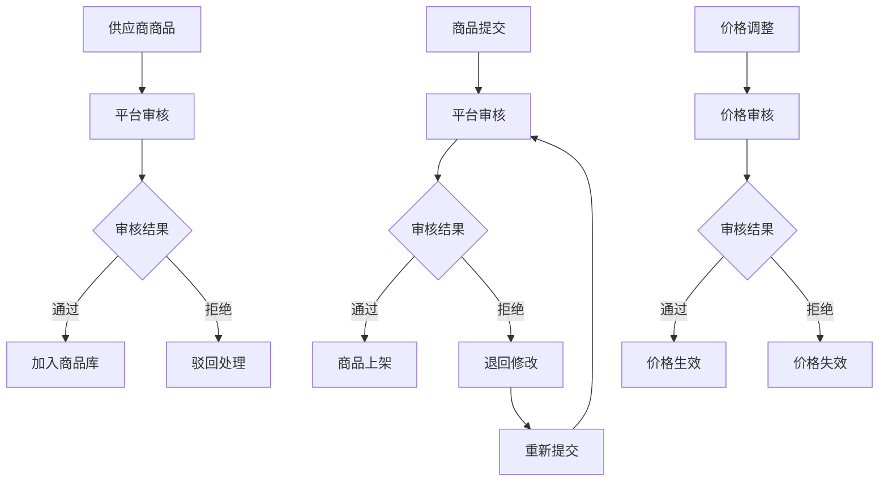
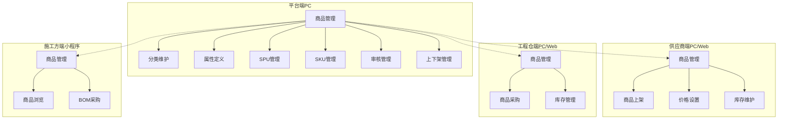
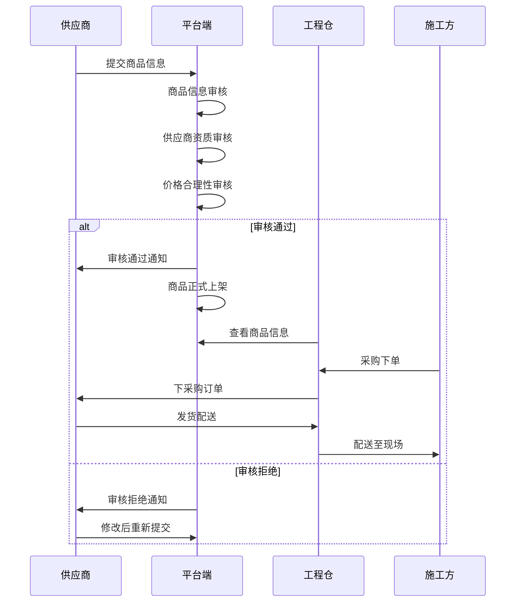
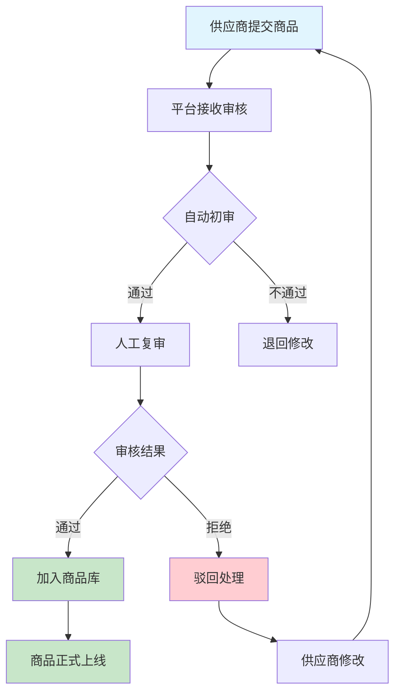

# 平台端商品中心功能清单

<cite>
**本文档引用的文件**
- [平台端商品中心功能清单.md](file://docs/PRD/07-平台端商品中心功能清单.md)
- [商品板块功能清单.md](file://docs/PRD/06-商品板块功能清单.md)
- [平台端商品中心功能详细设计.md](file://docs/PRD/17-平台端商品中心功能详细设计.md)
- [系统概览与架构.md](file://docs/PRD/01-系统概览与架构.md)
- [业务流程设计.md](file://docs/PRD/02-业务流程设计.md)
- [商品分类页面组件](file://apps/pc/src/views/product/category/index.vue)
- [商品属性页面组件](file://apps/pc/src/views/product/attr/index.vue)
- [商品SPU页面组件](file://apps/pc/src/views/product/spu/index.vue)
- [商品SKU页面组件](file://apps/pc/src/views/product/sku/index.vue)
- [供应商商品审核页面组件](file://apps/pc/src/views/product/supplier-audit/index.vue)
- [价格管理页面组件](file://apps/pc/src/views/product/price/index.vue)
- [角色管理页面组件](file://apps/pc/src/views/system/role/index.vue)
- [菜单管理页面组件](file://apps/pc/src/views/system/menu/index.vue)
- [商品分类表单抽屉组件](file://apps/pc/src/views/product/category/components/CategoryFormDrawer.vue)
- [商品属性表单抽屉组件](file://apps/pc/src/views/product/attr/components/AttrFormDrawer.vue)
</cite>

## 目录
1. [功能概述](#功能概述)
2. [核心功能模块](#核心功能模块)
3. [平台端特有能力](#平台端特有能力)
4. [审核流程设计](#审核流程设计)
5. [权限控制体系](#权限控制体系)
6. [批量操作功能](#批量操作功能)
7. [功能矩阵对比](#功能矩阵对比)
8. [操作流程图](#操作流程图)
9. [技术实现要点](#技术实现要点)
10. [总结](#总结)

## 功能概述

平台端商品中心是工程材料管理采供一体化平台的核心管理模块，主要服务于平台运营方对商品生态的全面管控。该模块提供从商品基础数据维护到全生命周期管理的完整解决方案，确保平台商品质量标准的一致性和商品生态的健康发展。

### 功能定位

平台端商品中心作为平台管理员和运营人员的管理中心，承担着以下核心职责：
- 商品基础数据标准化管理
- 商品分类体系维护
- 属性和规格属性配置
- SPU/SKU全生命周期管理
- 供应商商品质量把控
- 商品审核流程监管
- 商品上下架策略执行

### 目标用户

- **平台管理员**：拥有最高权限，负责商品中心的全面管理
- **平台运营人员**：负责日常商品运营维护工作
- **平台审核人员**：专门负责商品信息的质量审核

## 核心功能模块

平台端商品中心包含12个核心功能模块，每个模块都有明确的业务边界和操作权限：

### 1. 商品分类管理

商品分类管理是商品组织的基础，支持三级分类结构，提供完整的分类维护能力。

**核心功能**：
- 分类树形展示和拖拽排序
- 分类详情查看和编辑
- 分类启用/禁用管理
- 分类批量导入导出
- 分类关联商品统计

**技术特点**：
- 支持最多3级分类层级
- 拖拽调整分类层级关系
- 实时搜索和筛选功能
- 分类数量自动统计

### 2. 商品属性管理

商品属性管理负责定义商品的特征维度，支持多种属性类型和值管理。

**核心功能**：
- 属性类型定义（单选、多选、输入框）
- 属性值管理（预设值和自定义值）
- 属性启用/禁用控制
- 属性批量导入导出
- 属性使用统计分析

**技术特点**：
- 支持3种属性类型
- 动态属性值管理
- 属性与分类关联
- 可选值数量限制

### 3. 商品SPU管理

SPU（标准产品单元）管理负责商品基本信息的维护和管理。

**核心功能**：
- SPU信息查看、编辑、删除
- SPU批量状态更新
- SPU强制下架管理
- SPU操作记录查看
- SPU批量导出功能

**技术特点**：
- 支持SPU级别的批量操作
- 强制下架原因记录
- 完整的操作审计功能
- 与SKU的关联管理

### 4. 商品SKU管理

SKU（库存在库单元）管理负责具体规格商品的精细化管理。

**核心功能**：
- SKU信息查看、编辑、删除
- SKU启用/禁用管理
- SKU批量导出功能
- SKU状态实时切换
- SKU规格属性管理

**技术特点**：
- 支持开关式状态管理
- 实时状态切换反馈
- 规格属性动态管理
- 与SPU的强关联关系

### 5. 供货价格管理

供货价格管理负责供应商商品价格的审核和管理。

**核心功能**：
- 供货价格列表查看
- 供货价格详情查看
- 供货价格审核管理
- 供货价格启用/禁用
- 供货价格历史查询
- 供货价格批量导出

**技术特点**：
- 价格审核流程控制
- 生效/失效时间管理
- 价格历史追踪
- 批量价格管理

### 6. 商品审核管理

商品审核管理是平台质量控制的核心环节。

**核心功能**：
- 审核列表查看和筛选
- 审核详情查看
- 商品审核通过/拒绝
- 批量审核功能
- 审核记录查询
- 待审核数量统计

**技术特点**：
- 审核状态实时追踪
- 批量审核提高效率
- 审核原因记录
- 审核流程可视化

### 7. 商品上下架管理

商品上下架管理负责商品销售状态的精准控制。

**核心功能**：
- 商品上下架状态查看
- 商品手动上下架
- 商品定时上下架
- 商品批量上下架
- 上下架记录查询
- 上下架状态统计

**技术特点**：
- 支持定时上下架功能
- 批量操作提高效率
- 状态变更记录完整
- 自动化上下架执行

### 8. 供应商商品管理

供应商商品管理负责对各供应商商品的集中监控和管理。

**核心功能**：
- 供应商列表查看
- 供应商商品统计
- 供应商商品导出
- 供应商商品批量操作
- 供应商商品详情查看

**技术特点**：
- 供应商维度统计分析
- 批量操作支持
- 商品关联关系清晰
- 导出功能完善

### 9. 商品数据统计

商品数据统计提供全面的商品运营数据分析。

**核心功能**：
- 商品数量统计
- 商品分类统计
- 供应商商品统计
- 商品销量统计
- 库存统计分析
- 价格统计分析
- 商品趋势分析
- 数据批量导出

**技术特点**：
- 多维度统计分析
- 图表化展示
- 时间范围筛选
- 批量数据导出

### 10. 商品配置管理

商品配置管理负责商品相关参数的全局配置。

**核心功能**：
- 商品图片配置
- 商品编码配置
- 价格规则配置
- 库存规则配置
- 审核流程配置
- 上架规则配置
- 通知配置管理

**技术特点**：
- 全局参数控制
- 规则化配置管理
- 灵活的配置选项
- 影响范围明确

### 11. 商品日志审计

商品日志审计提供完整的操作追踪和审计功能。

**核心功能**：
- 操作日志查询
- 操作日志详情查看
- 操作日志导出
- 操作日志归档
- 操作日志删除
- 操作统计分析

**技术特点**：
- 完整的操作追踪
- 审计日志管理
- 导出功能完善
- 统计分析支持

### 12. 系统配置管理

系统配置管理负责平台端商品中心的系统级配置。

**核心功能**：
- 角色权限管理
- 菜单权限配置
- 系统参数设置
- 用户权限控制
- 系统功能开关

**技术特点**：
- RBAC权限模型
- 细粒度权限控制
- 系统级配置管理
- 权限继承机制

## 平台端特有能力

平台端商品中心具备以下平台专属能力，这些能力在其他端无法实现：

### 1. 商品生态治理能力

平台端拥有对整个商品生态的治理权，包括：
- 商品分类的最终决策权
- 商品属性的标准制定权
- 商品审核的最终裁决权
- 商品上下架的强制执行权

### 2. 供应商质量管控能力

平台端具备完善的供应商质量管控体系：
- 供应商商品的集中审核
- 供应商商品的批量处理
- 供应商商品的质量监控
- 供应商违规的处罚执行

### 3. 商品数据标准化能力

平台端负责商品数据的标准化建设：
- 统一的商品分类标准
- 标准化的商品属性体系
- 规范化的商品信息格式
- 标准化的商品编码规则

### 4. 商品质量保障能力

平台端建立多层次的商品质量保障机制：
- 多级审核流程
- 质量标准检查
- 异常商品处理
- 质量问题追溯

## 审核流程设计

平台端商品中心建立了完善的审核流程体系，确保商品质量的严格把控。

### 审核流程架构

**图表来源**
- [平台端商品中心功能详细设计.md:327-347](file://docs/PRD/17-平台端商品中心功能详细设计.md#L327-L347)

### 审核流程特点

**多层级审核机制**：
- 商品信息审核：确保商品信息的准确性和完整性
- 供应商资质审核：验证供应商的合法性和合规性
- 价格合理性审核：确保商品价格的市场合理性
- 资质匹配审核：验证商品与供应商资质的匹配度

**自动化审核辅助**：
- AI智能识别商品异常
- 自动化规则检查
- 智能风险评估
- 实时审核建议

**人工审核把关**：
- 复杂情况的人工判断
- 特殊案例的专家评审
- 质疑商品的深度审核
- 争议问题的最终裁决

## 权限控制体系

平台端商品中心采用严格的权限控制体系，确保不同角色只能访问相应的功能。

### 权限矩阵设计

| 功能模块 | 平台管理员 | 平台运营 | 平台审核 |
|---------|----------|---------|---------|
| 商品分类管理 | ✓ | ✓ | - |
| 商品属性管理 | ✓ | ✓ | - |
| 商品SPU管理 | ✓ | ✓ | - |
| 商品SKU管理 | ✓ | ✓ | - |
| 供货价格管理 | ✓ | ✓ | ✓ |
| 商品审核管理 | ✓ | - | ✓ |
| 商品上下架管理 | ✓ | ✓ | - |
| 供应商商品管理 | ✓ | ✓ | - |
| 商品数据统计 | ✓ | ✓ | ✓ |
| 商品配置管理 | ✓ | - | - |
| 商品日志审计 | ✓ | - | - |

### 权限控制机制

**基于角色的权限控制（RBAC）**：
- 角色定义：平台管理员、平台运营、平台审核
- 权限分配：基于角色的细粒度权限控制
- 权限继承：角色权限的层次化继承
- 权限验证：实时的权限验证机制

**功能权限控制**：
- 按钮级权限控制：不可见即不可用
- 路由级权限控制：无权限直接跳转404
- 数据级权限控制：只能访问授权的数据
- 操作级权限控制：精确的操作权限控制

**安全防护措施**：
- 操作日志记录：完整记录所有操作行为
- 权限变更审计：监控权限的任何变更
- 异常行为检测：自动检测异常权限使用
- 安全策略执行：严格执行安全策略

## 批量操作功能

平台端商品中心提供强大的批量操作能力，提高运营效率。

### 批量操作类型

**1. 批量状态管理**
- 批量上下架操作
- 批量启用/禁用
- 批量状态更新
- 批量删除操作

**2. 批量数据处理**
- 批量导入商品数据
- 批量导出商品信息
- 批量价格调整
- 批量属性设置

**3. 批量审核处理**
- 批量商品审核
- 批量价格审核
- 批量供应商审核
- 批量异常处理

### 批量操作特点

**高效性**：
- 支持数千条数据的批量处理
- 异步处理机制，不影响系统性能
- 进度实时监控和反馈
- 失败自动重试机制

**安全性**：
- 批量操作前的确认机制
- 操作结果的详细记录
- 失败操作的回滚机制
- 审计日志的完整记录

**灵活性**：
- 支持多种筛选条件
- 灵活的批量操作配置
- 自定义批量处理规则
- 操作结果的灵活展示

## 功能矩阵对比

### 平台端 vs 供应商端功能对比

| 功能模块 | 平台端 | 供应商端 | 功能差异说明 |
|---------|--------|----------|-------------|
| 商品分类管理 | ✅ 完整管理 | ❌ 只读查看 | 平台端负责标准制定 |
| 商品属性管理 | ✅ 完整管理 | ❌ 只读查看 | 平台端制定统一标准 |
| 商品SPU管理 | ✅ 审核管理 | ✅ 商品上架 | 平台端审核供应商商品 |
| 商品SKU管理 | ✅ 状态管理 | ✅ 库存维护 | 平台端控制销售状态 |
| 供货价格管理 | ✅ 审核管理 | ✅ 价格设置 | 平台端审核价格合理性 |
| 商品审核管理 | ✅ 审核执行 | ❌ 审核参与 | 平台端拥有最终裁决权 |
| 商品上下架管理 | ✅ 强制执行 | ❌ 受限管理 | 平台端可强制下架 |
| 供应商商品管理 | ✅ 质量监控 | ✅ 商品维护 | 平台端负责质量把关 |

### 四端功能矩阵

**图表来源**
- [系统概览与架构.md:119-134](file://docs/PRD/01-系统概览与架构.md#L119-L134)

## 操作流程图

### 商品上架完整流程

**图表来源**
- [业务流程设计.md:279-325](file://docs/PRD/02-业务流程设计.md#L279-L325)

### 供应商商品审核流程

**图表来源**
- [平台端商品中心功能详细设计.md:306-316](file://docs/PRD/17-平台端商品中心功能详细设计.md#L306-L316)

## 技术实现要点

### 前端技术架构

平台端商品中心采用现代化的前端技术栈，确保良好的用户体验和开发效率。

**Vue 3 + TypeScript**：
- 组件化开发模式
- 类型安全保证
- 组合式API使用
- 响应式数据管理

**Ant Design Vue 4.0**：
- 丰富的UI组件库
- 一致的设计规范
- 移动端适配
- 主题定制能力

**状态管理**：
- Pinia状态管理
- Vuex兼容模式
- 组件间数据共享
- 状态持久化

### 后端技术架构

平台端商品中心采用微服务架构，确保系统的可扩展性和稳定性。

**Spring Boot + Spring Cloud**：
- 微服务架构
- 服务注册发现
- 负载均衡
- 熔断器保护

**数据库设计**：
- MySQL主从复制
- 分库分表策略
- 缓存层优化
- 事务一致性保证

**消息队列**：
- RabbitMQ异步处理
- 消息幂等性保证
- 消息重试机制
- 死信队列处理

### 安全技术实现

**权限控制**：
- JWT Token认证
- RBAC权限模型
- 接口级权限控制
- 操作日志审计

**数据安全**：
- 敏感数据加密
- SQL注入防护
- XSS攻击防护
- CSRF攻击防护

**系统安全**：
- 限流降压机制
- 熔断器保护
- 异常监控告警
- 安全漏洞扫描

## 总结

平台端商品中心功能清单详细描述了平台运营方对商品进行统一管理的所有核心功能。该功能体系具有以下显著特点：

### 核心优势

**1. 完整的管理体系**
- 从商品基础数据到全生命周期管理的完整覆盖
- 多层级的审核机制确保商品质量
- 强大的批量操作能力提升运营效率

**2. 平台级治理能力**
- 对整个商品生态的最终控制权
- 标准化的商品数据管理体系
- 供应商质量的严格把控机制

**3. 现代化技术架构**
- 基于Vue 3的现代化前端技术
- 微服务架构的后端设计
- 完善的安全防护体系

### 应用价值

**对平台运营的价值**：
- 建立统一的商品标准和规范
- 提升商品质量和用户体验
- 增强平台的商业竞争力
- 降低运营成本和风险

**对供应商的价值**：
- 明确的商品准入标准
- 公平透明的审核机制
- 质量可控的市场环境
- 更好的商业机会

**对工程仓和施工方的价值**：
- 丰富优质的商品资源
- 透明的价格和质量信息
- 稳定可靠的供应链
- 高效便捷的采购体验

平台端商品中心功能清单为工程材料管理采供一体化平台的成功实施提供了坚实的技术基础和完善的业务指导，是平台实现高质量发展的关键支撑。