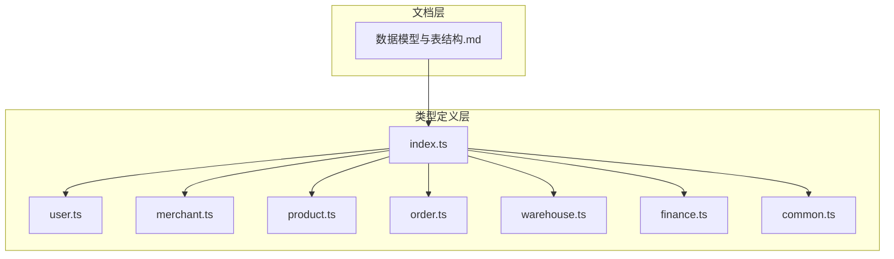
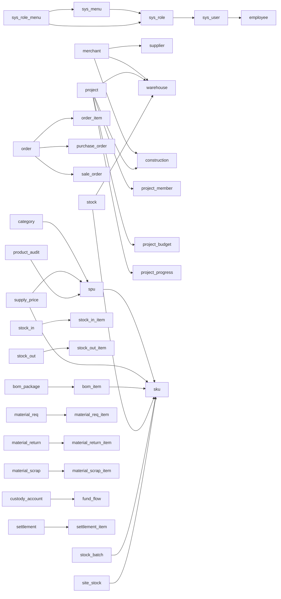

# 数据模型与表结构

<cite>
**本文引用的文件**
- [数据模型与表结构.md](file://docs/PRD/03-数据模型与表结构.md)
- [index.ts](file://packages/types/src/index.ts)
- [user.ts](file://packages/types/src/user.ts)
- [merchant.ts](file://packages/types/src/merchant.ts)
- [product.ts](file://packages/types/src/product.ts)
- [order.ts](file://packages/types/src/order.ts)
- [warehouse.ts](file://packages/types/src/warehouse.ts)
- [finance.ts](file://packages/types/src/finance.ts)
- [common.ts](file://packages/types/src/common.ts)
</cite>

## 目录
1. [简介](#简介)
2. [项目结构](#项目结构)
3. [核心组件](#核心组件)
4. [架构总览](#架构总览)
5. [详细组件分析](#详细组件分析)
6. [依赖分析](#依赖分析)
7. [性能考虑](#性能考虑)
8. [故障排查指南](#故障排查指南)
9. [结论](#结论)
10. [附录](#附录)

## 简介
本文件面向工程材料管理平台，系统化梳理数据模型与表结构，覆盖用户与权限、商户管理、项目管理、商品管理、订单管理、库存管理、领料管理、财务管理等业务域。文档以实体关系图为纲，辅以各表字段定义、数据类型、约束条件、索引策略与一致性保障机制，帮助开发与运维团队高效落地与维护数据库。

## 项目结构
- 数据模型文档位于 PRD 文档目录，提供 ER 关系与数据字典。
- 类型定义位于 packages/types，涵盖用户、商户、商品、订单、仓库、财务等前端/后端通用接口模型，用于前后端契约与数据库映射参考。

图表来源
- [数据模型与表结构.md:1-794](file://docs/PRD/03-数据模型与表结构.md#L1-L794)
- [index.ts:1-10](file://packages/types/src/index.ts#L1-L10)

章节来源
- [数据模型与表结构.md:1-794](file://docs/PRD/03-数据模型与表结构.md#L1-L794)
- [index.ts:1-10](file://packages/types/src/index.ts#L1-L10)

## 核心组件
- 用户与权限：平台用户、角色、菜单、权限、员工
- 商户管理：商户主体、供应商、工程仓、施工方、合同
- 项目管理：项目、项目成员、项目预算、项目进度
- 商品管理：分类、属性、SPU、SKU、供货价、审核
- 订单管理：订单、订单明细、采购单、销售单、BOM包
- 库存管理：库存、入库单、出库单、批次、盘点单、现场库存
- 领料管理：领料单、退料单、报废单及明细
- 财务管理：托管账户、资金流水、结算、账单、发票、分账规则

章节来源
- [数据模型与表结构.md:88-794](file://docs/PRD/03-数据模型与表结构.md#L88-L794)

## 架构总览
平台采用“多租户+多角色”的数据架构，围绕“商户-项目-商品-订单-库存-财务”主线组织数据。核心实体关系如下：

```mermaid
erDiagram
SYS_USER ||--o{ EMPLOYEE : "归属"
MERCHANT ||--o{ SUPPLIER : "类型"
MERCHANT ||--o{ WAREHOUSE : "类型"
MERCHANT ||--o{ CONSTRUCTION : "类型"
CONTRACT }o--|| MERCHANT : "签署"
PROJECT ||--|| WAREHOUSE : "使用"
PROJECT ||--o{ CONSTRUCTION : "所属"
PROJECT ||--o{ PROJECT_MEMBER : "成员"
PROJECT ||--o{ PROJECT_BUDGET : "预算"
CATEGORY ||--o{ SPU : "包含"
SPU ||--o{ SKU : "包含"
SUPPLY_PRICE }o--|| SPU : "定价"
SUPPLY_PRICE }o--|| SKU : "定价"
PRODUCT_AUDIT }o--|| SPU : "审核"
ORDER ||--o{ ORDER_ITEM : "明细"
ORDER }o--|| PURCHASE_ORDER : "对应"
ORDER }o--|| SALE_ORDER : "对应"
BOM_PACKAGE ||--o{ BOM_ITEM : "组成"
BOM_ITEM }o--|| SKU : "包含"
STOCK }o--|| SKU : "对应"
STOCK }o--|| WAREHOUSE : "所在"
STOCK_IN ||--o{ STOCK_IN_ITEM : "明细"
STOCK_OUT ||--o{ STOCK_OUT_ITEM : "明细"
STOCK_BATCH ||--|| SKU : "批次"
SITE_STOCK }o--|| SKU : "现场库存"
MATERIAL_REQ ||--o{ MATERIAL_REQ_ITEM : "明细"
MATERIAL_RETURN ||--o{ MATERIAL_RETURN_ITEM : "明细"
MATERIAL_SCRAP ||--o{ MATERIAL_SCRAP_ITEM : "明细"
CUSTODY_ACCOUNT ||--o{ FUND_FLOW : "资金流水"
SETTLEMENT ||--o{ SETTLEMENT_ITEM : "明细"
```

图表来源
- [数据模型与表结构.md:11-70](file://docs/PRD/03-数据模型与表结构.md#L11-L70)

## 详细组件分析

### 用户与权限模块
- 平台用户 sys_user：用户名唯一、密码加密存储、状态枚举、时间戳默认值
- 角色 sys_role：角色名与编码唯一、状态枚举
- 菜单 sys_menu：父子关系、路由与权限标识、排序与状态
- 角色菜单关联 sys_role_menu：多对多桥接
- 员工 employee：商户绑定、唯一登录名、部门职位、状态与时间戳

章节来源
- [数据模型与表结构.md:90-160](file://docs/PRD/03-数据模型与表结构.md#L90-L160)
- [user.ts:6-71](file://packages/types/src/user.ts#L6-L71)

### 商户管理模块
- 商户 merchant：类型枚举、统一信用代码唯一、状态枚举、资质与联系信息
- 供应商 supplier：与商户一对一、银行账户信息、交货周期
- 工程仓 warehouse：仓库名称与地址唯一、容量与管理员信息
- 施工方 construction：资质与项目数量统计
- 合同 contract：合同编号唯一、起止日期、金额、状态与文件

章节来源
- [数据模型与表结构.md:165-238](file://docs/PRD/03-数据模型与表结构.md#L165-L238)
- [merchant.ts:31-122](file://packages/types/src/merchant.ts#L31-L122)

### 项目管理模块
- 项目 project：项目编号唯一、地址、预算、起止时间、状态与进度
- 项目成员 project_member：项目-员工多对多、角色与时间维度
- 项目预算 project_budget：预算类型与金额、实际消耗
- 项目进度 project_progress：进度百分比、描述、照片与更新人

章节来源
- [数据模型与表结构.md:243-296](file://docs/PRD/03-数据模型与表结构.md#L243-L296)

### 商品管理模块
- 分类 category：树形父子关系、排序与状态
- 属性 attribute：输入类型枚举、分类绑定
- 属性值 attribute_value：值编码唯一、排序
- SPU spu：商品编码唯一、品牌单位、状态与图片
- SKU sku：规格JSON、价格与成本、条码、状态
- 供货价 supply_price：最小起订量、交货周期、状态
- 审核 product_audit：上架/价格调整、状态与审核人

章节来源
- [数据模型与表结构.md:301-402](file://docs/PRD/03-数据模型与表结构.md#L301-L402)
- [product.ts:22-196](file://packages/types/src/product.ts#L22-L196)

### 订单管理模块
- 订单 order：订单号唯一、买卖双方、项目关联、订单类型、金额与状态
- 订单明细 order_item：单价数量金额、状态
- 采购单 purchase_order：仓库、预计到货、供应商备注
- 销售单 sale_order：仓库、施工方、物流信息
- BOM包 bom_package：套餐编码唯一、描述与状态
- BOM包商品 bom_item：组成SKU、数量与单价

章节来源
- [数据模型与表结构.md:407-497](file://docs/PRD/03-数据模型与表结构.md#L407-L497)
- [order.ts:3-63](file://packages/types/src/order.ts#L3-L63)

### 库存管理模块
- 库存 stock：仓库-SKU唯一、可用/锁定数量、成本与金额
- 入库单 stock_in：入库类型枚举、金额与状态
- 入库明细 stock_in_item：批次号与有效期
- 出库单 stock_out：出库类型枚举、金额与状态
- 出库明细 stock_out_item：批次号
- 批次库存 stock_batch：批次号唯一、成本与有效期
- 盘点单 stock_check：盘点类型与状态、起止时间
- 盘点明细 stock_check_item：系统数与实盘数差异
- 现场库存 site_stock：项目-施工方-SKU唯一、成本与金额

章节来源
- [数据模型与表结构.md:502-635](file://docs/PRD/03-数据模型与表结构.md#L502-L635)
- [warehouse.ts:72-112](file://packages/types/src/warehouse.ts#L72-L112)

### 领料管理模块
- 领料申请 material_req：申请人/审批人、状态与时间轴
- 领料明细 material_req_item：单价金额与实际领料数量
- 退料申请 material_return：退料原因、状态与时间轴
- 退料明细 material_return_item：单价金额与实际退料数量
- 报废申请 material_scrap：报废原因、照片与状态
- 报废明细 material_scrap_item：单价金额

章节来源
- [数据模型与表结构.md:640-737](file://docs/PRD/03-数据模型与表结构.md#L640-L737)

### 财务管理模块
- 托管账户 custody_account：账户编号唯一、余额与冻结金额、状态
- 资金流水 fund_flow：流水类型与方向、订单关联、余额追踪
- 结算 settlement：结算单号唯一、服务费与实际金额、起止日期
- 结算明细 settlement_item：订单结算明细

章节来源
- [数据模型与表结构.md:742-794](file://docs/PRD/03-数据模型与表结构.md#L742-L794)
- [finance.ts:4-51](file://packages/types/src/finance.ts#L4-L51)

## 依赖分析
- 表间依赖：主从关系清晰，如订单与订单明细、出入库单与其明细、项目与成员/预算/进度等。
- 多租户依赖：商户作为业务主体，贯穿供应商、工程仓、施工方、合同、账户、库存、订单等。
- 类型契约：前端/后端通过 types 定义的接口模型与数据库字段形成契约，降低耦合。

图表来源
- [数据模型与表结构.md:90-794](file://docs/PRD/03-数据模型与表结构.md#L90-L794)

章节来源
- [数据模型与表结构.md:90-794](file://docs/PRD/03-数据模型与表结构.md#L90-L794)
- [index.ts:1-10](file://packages/types/src/index.ts#L1-L10)

## 性能考虑
- 索引策略建议
  - 唯一性字段：用户名、手机号、邮箱、订单号、商品编码、合同编号、账户编号、批次号等建立唯一索引。
  - 外键字段：所有外键（如 merchant_id、warehouse_id、project_id、sku_id、order_id）建立普通索引，加速 JOIN 与过滤。
  - 高频查询字段：状态、时间范围（create_time/update_time）、项目编号、SKU编码、商户类型等建立复合索引或单独索引。
  - 聚合与报表：库存、流水、结算等高频聚合表可考虑分区或物化视图。
- 事务与一致性
  - 订单-库存-财务：下单时先扣减可用库存并写入冻结库存，支付成功后转移至可用并生成流水；失败则解冻。
  - BOM 包：下单时按 BOM 包拆解为多个 SKU 明细，确保库存与成本准确。
  - 盘点差异：差异金额与原因记录，支持后续财务调整。
- 缓存与异步
  - 商品价格、库存快照缓存于应用层，定时同步至数据库。
  - 财务结算、发票生成采用消息队列异步处理，保证主流程低延迟。

## 故障排查指南
- 常见问题定位
  - 订单状态异常：检查 order、order_item、purchase_order/sale_order 的状态流转是否一致。
  - 库存不平：对比 stock、stock_in/out、stock_batch、site_stock 的数量与金额，核对出入库单状态。
  - 财务不平：核对 custody_account 余额与 fund_flow 流水方向与金额，排查重复记账或遗漏。
  - 权限问题：确认 sys_user 的角色与 sys_role_menu 的菜单授权是否匹配。
- 日志与审计
  - 使用 product_audit、project_progress、material_req/return/scrap 的时间轴字段定位变更节点。
  - 对关键操作（冻结/解冻、调拨、报废）增加审计日志字段。

章节来源
- [数据模型与表结构.md:90-794](file://docs/PRD/03-数据模型与表结构.md#L90-L794)

## 结论
该数据模型以“商户-项目-商品-订单-库存-财务”为主线，覆盖工程材料管理全链路。通过明确的主外键关系、唯一性与索引策略、以及事务与一致性保障机制，既能满足复杂业务场景，又能兼顾性能与可维护性。建议在落地阶段结合类型定义完善 ORM 映射，并持续优化热点查询与批量处理流程。

## 附录

### 数据字典（节选）
- 用户与权限
  - sys_user：用户名唯一、密码加密、状态枚举、时间戳默认值
  - sys_role：角色名与编码唯一、状态枚举
  - sys_menu：父级、类型、权限标识、排序与状态
  - sys_role_menu：角色-菜单多对多
  - employee：商户绑定、唯一登录名、部门职位、状态与时间戳
- 商户管理
  - merchant：类型枚举、统一信用代码唯一、状态枚举
  - supplier：银行账户信息、交货周期
  - warehouse：仓库名称与地址唯一、容量与管理员
  - construction：资质与项目数量统计
  - contract：合同编号唯一、起止日期、金额、状态与文件
- 项目管理
  - project：项目编号唯一、地址、预算、起止时间、状态与进度
  - project_member：项目-员工多对多、角色与时间维度
  - project_budget：预算类型与金额、实际消耗
  - project_progress：进度百分比、描述、照片与更新人
- 商品管理
  - category：树形父子关系、排序与状态
  - attribute：输入类型枚举、分类绑定
  - attribute_value：值编码唯一、排序
  - spu：商品编码唯一、品牌单位、状态与图片
  - sku：规格JSON、价格与成本、条码、状态
  - supply_price：最小起订量、交货周期、状态
  - product_audit：上架/价格调整、状态与审核人
- 订单管理
  - order：订单号唯一、买卖双方、项目关联、订单类型、金额与状态
  - order_item：单价数量金额、状态
  - purchase_order：仓库、预计到货、供应商备注
  - sale_order：仓库、施工方、物流信息
  - bom_package：套餐编码唯一、描述与状态
  - bom_item：组成SKU、数量与单价
- 库存管理
  - stock：仓库-SKU唯一、可用/锁定数量、成本与金额
  - stock_in：入库类型枚举、金额与状态
  - stock_in_item：批次号与有效期
  - stock_out：出库类型枚举、金额与状态
  - stock_out_item：批次号
  - stock_batch：批次号唯一、成本与有效期
  - stock_check：盘点类型与状态、起止时间
  - stock_check_item：系统数与实盘数差异
  - site_stock：项目-施工方-SKU唯一、成本与金额
- 领料管理
  - material_req：申请人/审批人、状态与时间轴
  - material_req_item：单价金额与实际领料数量
  - material_return：退料原因、状态与时间轴
  - material_return_item：单价金额与实际退料数量
  - material_scrap：报废原因、照片与状态
  - material_scrap_item：单价金额
- 财务管理
  - custody_account：账户编号唯一、余额与冻结金额、状态
  - fund_flow：流水类型与方向、订单关联、余额追踪
  - settlement：结算单号唯一、服务费与实际金额、起止日期
  - settlement_item：订单结算明细

章节来源
- [数据模型与表结构.md:90-794](file://docs/PRD/03-数据模型与表结构.md#L90-L794)