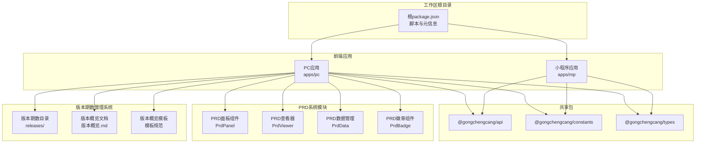
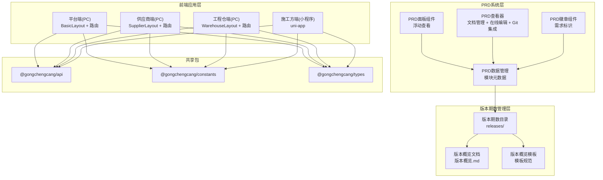
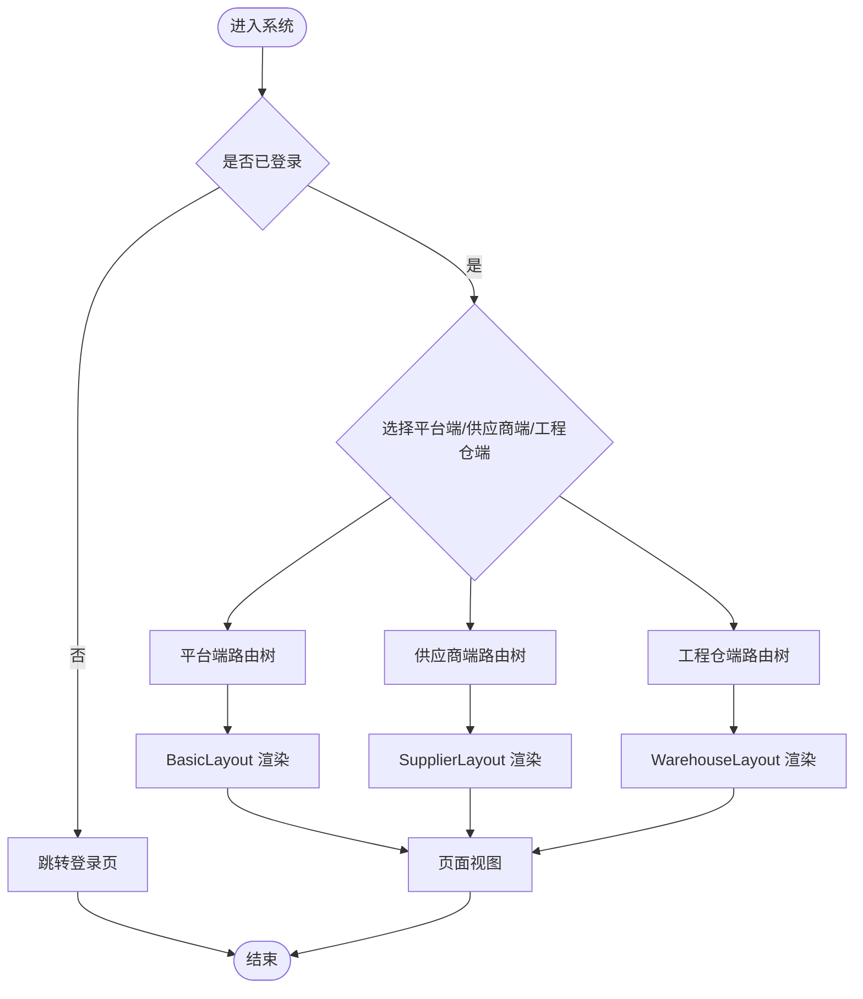
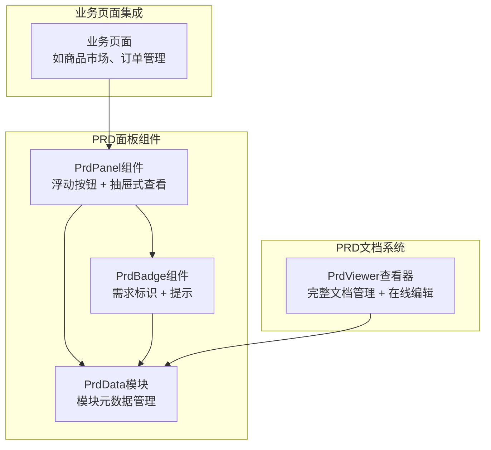
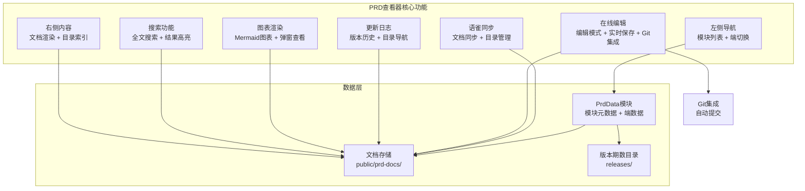
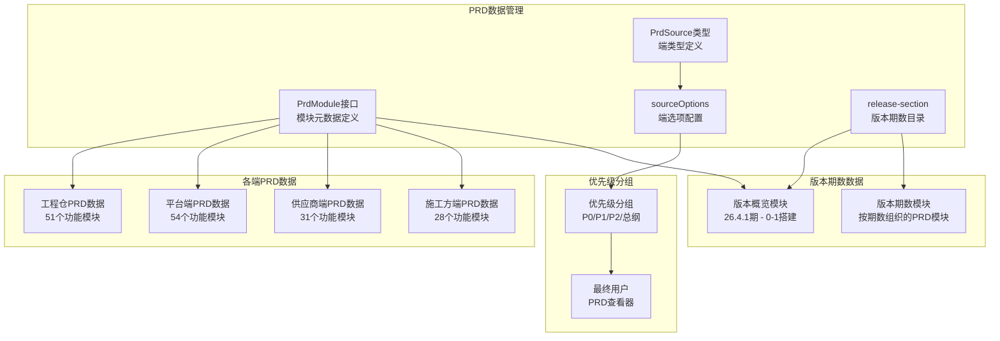
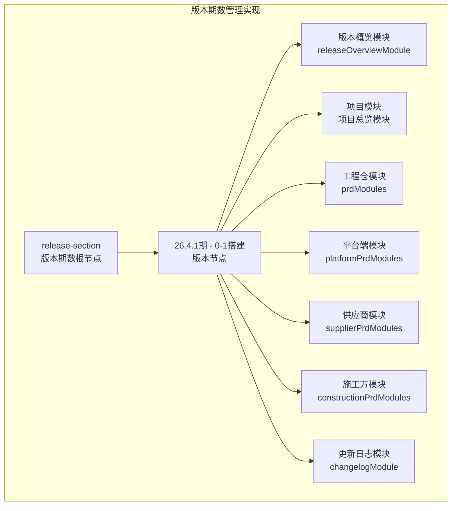
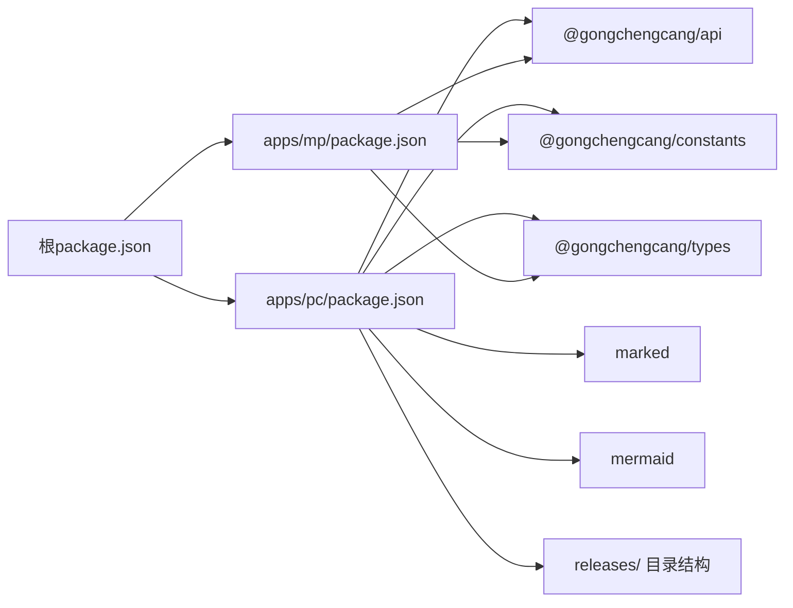

# 系统概览与架构设计

<cite>
**本文档引用的文件**
- [package.json](file://package.json)
- [apps/pc/package.json](file://apps/pc/package.json)
- [apps/mp/package.json](file://apps/mp/package.json)
- [docs/PRD/01-系统概览与架构.md](file://docs/PRD/01-系统概览与架构.md)
- [apps/pc/src/main.ts](file://apps/pc/src/main.ts)
- [apps/mp/src/main.ts](file://apps/mp/src/main.ts)
- [apps/pc/src/router/index.ts](file://apps/pc/src/router/index.ts)
- [apps/pc/src/layouts/BasicLayout.vue](file://apps/pc/src/layouts/BasicLayout.vue)
- [apps/pc/src/layouts/SupplierLayout.vue](file://apps/pc/src/layouts/SupplierLayout.vue)
- [apps/pc/src/layouts/WarehouseLayout.vue](file://apps/pc/src/layouts/WarehouseLayout.vue)
- [apps/pc/src/store/index.ts](file://apps/pc/src/store/index.ts)
- [packages/api/package.json](file://packages/api/package.json)
- [packages/constants/package.json](file://packages/constants/package.json)
- [packages/types/package.json](file://packages/types/package.json)
- [apps/pc/src/components/PrdPanel/prdData.ts](file://apps/pc/src/components/PrdPanel/prdData.ts)
- [apps/pc/src/views/warehouse/prd/index.vue](file://apps/pc/src/views/warehouse/prd/index.vue)
- [apps/pc/src/components/PrdPanel/index.vue](file://apps/pc/src/components/PrdPanel/index.vue)
- [apps/pc/src/components/PrdBadge/index.vue](file://apps/pc/src/components/PrdBadge/index.vue)
- [apps/pc/public/prd-docs/prd.md](file://apps/pc/public/prd-docs/prd.md)
- [脚手架PRD专业模版/00_文档体系架构/02-PRD版本期数管理规范.md](file://脚手架PRD专业模版/00_文档体系架构/02-PRD版本期数管理规范.md)
- [apps/pc/public/prd-docs/releases/26.4.1-0-1搭建/版本概览.md](file://apps/pc/public/prd-docs/releases/26.4.1-0-1搭建/版本概览.md)
</cite>

## 更新摘要
**所做更改**
- 新增PRD查看器在线编辑功能架构说明
- 更新PRD查看器Git集成机制
- 增强搜索功能和目录导航功能说明
- 完善版本期数管理架构设计
- 更新PRD系统核心特性描述

## 目录
1. [引言](#引言)
2. [项目结构](#项目结构)
3. [核心组件](#核心组件)
4. [架构总览](#架构总览)
5. [详细组件分析](#详细组件分析)
6. [PRD系统架构设计](#prd系统架构设计)
7. [版本期数管理系统架构](#版本期数管理系统架构)
8. [依赖分析](#依赖分析)
9. [性能考虑](#性能考虑)
10. [故障排查指南](#故障排查指南)
11. [结论](#结论)
12. [附录](#附录)

## 引言
本文件面向工程材料管理采供一体化平台，系统定位为建筑工程行业B2B电商基础设施，连接平台运营方、供应商、工程仓与施工方，覆盖商品、订单、库存、财务、项目与领料等核心业务闭环。本文档聚焦系统架构设计，阐述四端架构（平台端、供应商端、工程仓端、施工方端）的设计理念与技术实现，给出系统拓扑、多端架构、四端功能矩阵、核心业务模块划分，并补充PRD系统架构设计，包含PRD面板组件、PRD查看器、PRD数据管理等新模块的架构说明，以及新增的版本期数管理系统架构设计，帮助开发团队形成统一的认知基础。

**更新** 新增PRD查看器在线编辑功能、Git集成机制、增强搜索功能和目录导航功能。

## 项目结构
本项目采用多包工作区（monorepo）组织方式，前端分为PC端与小程序端，公共能力以packages形式共享，脚手架与构建工具基于Vite与Vite插件生态，PC端使用Vue3 + Pinia + Vue Router，小程序端基于uni-app跨端框架。新增PRD系统模块，提供完整的PRD文档管理与查看能力；新增版本期数管理系统，提供按版本期数组织PRD文档的能力，包含版本期数命名规范、目录组织结构、版本概览文档模板等。



**图表来源**
- [package.json:1-23](file://package.json#L1-L23)
- [apps/pc/package.json:1-36](file://apps/pc/package.json#L1-L36)
- [apps/mp/package.json:1-39](file://apps/mp/package.json#L1-L39)
- [packages/api/package.json:1-11](file://packages/api/package.json#L1-L11)
- [packages/constants/package.json:1-11](file://packages/constants/package.json#L1-L11)
- [packages/types/package.json:1-11](file://packages/types/package.json#L1-L11)
- [脚手架PRD专业模版/00_文档体系架构/02-PRD版本期数管理规范.md:34-50](file://脚手架PRD专业模版/00_文档体系架构/02-PRD版本期数管理规范.md#L34-L50)

**章节来源**
- [package.json:1-23](file://package.json#L1-L23)
- [apps/pc/package.json:1-36](file://apps/pc/package.json#L1-L36)
- [apps/mp/package.json:1-39](file://apps/mp/package.json#L1-L39)

## 核心组件
- 应用入口与运行时
  - PC端入口：创建Vue实例、注册Arco组件、安装Pinia与Router，挂载到DOM。
  - 小程序端入口：基于uni-app创建SSR应用，返回app与pinia实例。
- 路由与导航
  - PC端路由：包含平台端、供应商端、工程仓端三套布局与路由树，支持鉴权守卫与面包屑生成。
  - 布局组件：BasicLayout（平台端）、SupplierLayout（供应商端）、WarehouseLayout（工程仓端），均包含侧边菜单、头部工具栏与面包屑。
- 状态管理
  - PC端使用Pinia集中管理应用状态，导出用户、商户、应用等store模块。
- 共享能力
  - @gongchengcang/api：统一API封装与调用约定
  - @gongchengcang/constants：常量定义
  - @gongchengcang/types：类型声明
- PRD系统组件
  - PRD面板组件：提供页面级PRD需求的浮动查看功能
  - PRD查看器：完整的PRD文档管理系统，支持多端切换、全文搜索、目录导航、在线编辑、Git集成
  - PRD数据管理：统一的PRD模块元数据管理，包含版本期数目录结构
  - PRD徽章组件：需求标识与提示工具
- 版本期数管理组件
  - 版本期数目录：按版本期数组织PRD文档的目录结构
  - 版本概览文档：每期需求的全景总览文档
  - 版本概览模板：标准化的版本概览文档格式

**更新** PRD查看器新增在线编辑功能和Git集成机制，增强搜索功能和目录导航功能。

**章节来源**
- [apps/pc/src/main.ts:1-19](file://apps/pc/src/main.ts#L1-L19)
- [apps/mp/src/main.ts:1-14](file://apps/mp/src/main.ts#L1-L14)
- [apps/pc/src/router/index.ts:1-790](file://apps/pc/src/router/index.ts#L1-L790)
- [apps/pc/src/layouts/BasicLayout.vue:1-349](file://apps/pc/src/layouts/BasicLayout.vue#L1-L349)
- [apps/pc/src/layouts/SupplierLayout.vue:1-325](file://apps/pc/src/layouts/SupplierLayout.vue#L1-L325)
- [apps/pc/src/layouts/WarehouseLayout.vue:1-323](file://apps/pc/src/layouts/WarehouseLayout.vue#L1-L323)
- [apps/pc/src/store/index.ts:1-10](file://apps/pc/src/store/index.ts#L1-L10)
- [packages/api/package.json:1-11](file://packages/api/package.json#L1-L11)
- [packages/constants/package.json:1-11](file://packages/constants/package.json#L1-L11)
- [packages/types/package.json:1-11](file://packages/types/package.json#L1-L11)
- [脚手架PRD专业模版/00_文档体系架构/02-PRD版本期数管理规范.md:9-31](file://脚手架PRD专业模版/00_文档体系架构/02-PRD版本期数管理规范.md#L9-L31)

## 架构总览
系统采用"四端一体"的多端架构：平台端（PC Web）、供应商端（PC Web + 小程序）、工程仓端（PC Web + 小程序）、施工方端（小程序）。前端通过各自入口与路由体系承载业务模块，共享包提供API、常量与类型定义，确保跨端一致性与可维护性。新增PRD系统架构，提供完整的PRD文档管理与查看能力，支持多端PRD数据管理与统一的PRD查看体验。新增版本期数管理系统，提供按版本期数组织PRD文档的能力，包含版本期数命名规范、目录组织结构、版本概览文档模板等。



**图表来源**
- [apps/pc/src/layouts/BasicLayout.vue:1-349](file://apps/pc/src/layouts/BasicLayout.vue#L1-L349)
- [apps/pc/src/layouts/SupplierLayout.vue:1-325](file://apps/pc/src/layouts/SupplierLayout.vue#L1-L325)
- [apps/pc/src/layouts/WarehouseLayout.vue:1-323](file://apps/pc/src/layouts/WarehouseLayout.vue#L1-L323)
- [apps/pc/src/router/index.ts:1-790](file://apps/pc/src/router/index.ts#L1-L790)
- [apps/mp/src/main.ts:1-14](file://apps/mp/src/main.ts#L1-L14)
- [packages/api/package.json:1-11](file://packages/api/package.json#L1-L11)
- [packages/constants/package.json:1-11](file://packages/constants/package.json#L1-L11)
- [packages/types/package.json:1-11](file://packages/types/package.json#L1-L11)
- [脚手架PRD专业模版/00_文档体系架构/02-PRD版本期数管理规范.md:34-50](file://脚手架PRD专业模版/00_文档体系架构/02-PRD版本期数管理规范.md#L34-L50)

**章节来源**
- [docs/PRD/01-系统概览与架构.md:62-117](file://docs/PRD/01-系统概览与架构.md#L62-L117)

## 详细组件分析

### 四端功能矩阵与职责
- 平台端（PC Web）
  - 商户管理、商品管理、交易监管、财务管理、系统运营
- 供应商端（PC Web + 小程序）
  - 商户信息、商品管理、订单处理、财务管理、系统设置
- 工程仓端（PC Web + 小程序）
  - 商户信息、项目管理、采购管理、库存管理、发料管理、销售管理、财务管理、系统设置
- 施工方端（小程序）
  - 项目管理、采购管理、订单管理、现场库存、领料管理、财务管理、消息中心、个人中心

**章节来源**
- [docs/PRD/01-系统概览与架构.md:119-134](file://docs/PRD/01-系统概览与架构.md#L119-L134)
- [docs/PRD/01-系统概览与架构.md:211-383](file://docs/PRD/01-系统概览与架构.md#L211-L383)

### 路由与布局组件
- 路由体系
  - 平台端：/、/merchant、/product、/market、/order、/stock、/finance、/system 等
  - 供应商端：/supplier/dashboard、/supplier/product、/supplier/order、/supplier/finance、/supplier/system 等
  - 工程仓端：/warehouse/dashboard、/warehouse/market、/warehouse/product、/warehouse/warehouse、/warehouse/order、/warehouse/finance、/warehouse/system 等
  - 登录与兜底：/login、/:pathMatch(.*)*
- 布局组件
  - BasicLayout：平台端通用布局，支持平台切换、面包屑、用户信息与消息通知
  - SupplierLayout：供应商端通用布局，支持平台切换、面包屑、用户信息与消息通知
  - WarehouseLayout：工程仓端通用布局，支持平台切换、面包屑、用户信息与消息通知



**图表来源**
- [apps/pc/src/router/index.ts:1-790](file://apps/pc/src/router/index.ts#L1-L790)
- [apps/pc/src/layouts/BasicLayout.vue:1-349](file://apps/pc/src/layouts/BasicLayout.vue#L1-L349)
- [apps/pc/src/layouts/SupplierLayout.vue:1-325](file://apps/pc/src/layouts/SupplierLayout.vue#L1-L325)
- [apps/pc/src/layouts/WarehouseLayout.vue:1-323](file://apps/pc/src/layouts/WarehouseLayout.vue#L1-L323)

**章节来源**
- [apps/pc/src/router/index.ts:1-790](file://apps/pc/src/router/index.ts#L1-L790)
- [apps/pc/src/layouts/BasicLayout.vue:1-349](file://apps/pc/src/layouts/BasicLayout.vue#L1-L349)
- [apps/pc/src/layouts/SupplierLayout.vue:1-325](file://apps/pc/src/layouts/SupplierLayout.vue#L1-L325)
- [apps/pc/src/layouts/WarehouseLayout.vue:1-323](file://apps/pc/src/layouts/WarehouseLayout.vue#L1-L323)

### 状态管理与应用启动
- PC端应用启动
  - 注册Arco Design组件库与图标
  - 安装Pinia与Vue Router
  - 挂载应用实例
- 状态管理
  - 导出Pinia实例，提供用户、商户、应用等store模块

**章节来源**
- [apps/pc/src/main.ts:1-19](file://apps/pc/src/main.ts#L1-L19)
- [apps/pc/src/store/index.ts:1-10](file://apps/pc/src/store/index.ts#L1-L10)

### 共享包与依赖
- @gongchengcang/api：统一API封装，供PC与小程序端复用
- @gongchengcang/constants：常量定义，供PC与小程序端复用
- @gongchengcang/types：类型声明，供PC与小程序端复用

**章节来源**
- [packages/api/package.json:1-11](file://packages/api/package.json#L1-L11)
- [packages/constants/package.json:1-11](file://packages/constants/package.json#L1-L11)
- [packages/types/package.json:1-11](file://packages/types/package.json#L1-L11)

## PRD系统架构设计

### PRD面板组件架构
PRD面板组件提供页面级PRD需求的浮动查看功能，集成在各个业务页面中，通过PrdPanel组件实现。



**图表来源**
- [apps/pc/src/components/PrdPanel/index.vue:1-45](file://apps/pc/src/components/PrdPanel/index.vue#L1-L45)
- [apps/pc/src/components/PrdBadge/index.vue:1-303](file://apps/pc/src/components/PrdBadge/index.vue#L1-L303)
- [apps/pc/src/components/PrdPanel/prdData.ts:1-531](file://apps/pc/src/components/PrdPanel/prdData.ts#L1-L531)

### PRD查看器架构
PRD查看器是PRD系统的核心组件，提供完整的PRD文档管理与查看功能，支持多端切换、全文搜索、目录导航、在线编辑、Git集成等特性。



**图表来源**
- [apps/pc/src/views/warehouse/prd/index.vue:1-1706](file://apps/pc/src/views/warehouse/prd/index.vue#L1-L1706)
- [apps/pc/src/components/PrdPanel/prdData.ts:1-531](file://apps/pc/src/components/PrdPanel/prdData.ts#L1-L531)

### PRD数据管理架构
PRD数据管理模块提供统一的PRD模块元数据管理，支持四个端的PRD数据组织与访问，现已扩展支持版本期数目录结构。



**图表来源**
- [apps/pc/src/components/PrdPanel/prdData.ts:9-531](file://apps/pc/src/components/PrdPanel/prdData.ts#L9-L531)
- [apps/pc/src/components/PrdPanel/prdData.ts:749-844](file://apps/pc/src/components/PrdPanel/prdData.ts#L749-L844)

### PRD系统核心特性
- **多端支持**：支持平台端、供应商端、工程仓端、施工方端的PRD文档切换
- **全文搜索**：提供高效的PRD文档全文搜索功能，支持关键词高亮与结果导航
- **Mermaid图表**：支持Mermaid图表的渲染与放大查看
- **目录导航**：自动生成文档目录，支持滚动定位与高亮
- **响应式设计**：适配不同屏幕尺寸的PRD查看体验
- **更新日志**：集成PRD更新日志功能，支持版本追踪
- **版本期数管理**：支持按版本期数组织PRD文档，提供版本概览与模板规范
- **在线编辑**：支持PRD文档的在线编辑功能，提供实时保存和Git集成
- **Git集成**：自动提交PRD文档变更到Git仓库，确保版本控制和协作
- **语雀同步**：支持PRD文档同步到语雀知识库，便于团队协作和知识管理

**更新** 新增在线编辑功能、Git集成机制、语雀同步功能。

**章节来源**
- [apps/pc/src/views/warehouse/prd/index.vue:1-1706](file://apps/pc/src/views/warehouse/prd/index.vue#L1-L1706)
- [apps/pc/src/components/PrdPanel/prdData.ts:1-531](file://apps/pc/src/components/PrdPanel/prdData.ts#L1-L531)
- [apps/pc/src/components/PrdBadge/index.vue:1-303](file://apps/pc/src/components/PrdBadge/index.vue#L1-L303)

## 版本期数管理系统架构

### 版本期数命名规范
版本期数采用统一的命名规范，确保每个需求期次的唯一性和可追溯性：

- **命名公式**：`YY.M.N-关键词`
- **组成部分**：
  - `YY`：年份后两位（如：26 = 2026年）
  - `M`：月份（如：4 = 4月）
  - `N`：本月第N个需求
  - `关键词`：该期需求核心主题

**示例**：
- `26.4.1-0-1搭建`：2026年4月第1个需求，系统从0到1搭建
- `26.5.1-购物车优化`：2026年5月第1个需求，购物车体验优化
- `26.5.2-支付接入`：2026年5月第2个需求，支付系统接入

**章节来源**
- [脚手架PRD专业模版/00_文档体系架构/02-PRD版本期数管理规范.md:9-31](file://脚手架PRD专业模版/00_文档体系架构/02-PRD版本期数管理规范.md#L9-L31)

### 目录组织结构
版本期数文档采用层次化的目录组织结构，便于管理和查找：

```
prd-docs/
├── releases/                           # 🔝 推荐：按版本期数查看
│   ├── 26.4.1-0-1搭建/
│   │   ├── 版本概览.md                 # ✨ 本期全景总览
│   │   └── （实际文档复用根目录文件）
│   └── 26.5.1-购物车优化/
│       ├── 版本概览.md
│       └── 变更功能文档.md
├── warehouse/ platform/ supplier/ ...  # 📍 按端查看
│   └── 各端完整PRD文档
└── archives/                           # 📦 历史归档
```

**章节来源**
- [脚手架PRD专业模版/00_文档体系架构/02-PRD版本期数管理规范.md:34-50](file://脚手架PRD专业模版/00_文档体系架构/02-PRD版本期数管理规范.md#L34-L50)

### 版本期数添加流程
版本期数的创建遵循标准化的流程，确保文档质量和一致性：

1. **创建版本目录**
   ```bash
   mkdir prd-docs/releases/YY.M.N-关键词
   ```

2. **编写版本概览文档**
   - 位置：`prd-docs/releases/YY.M.N-关键词/版本概览.md`
   - 必须包含：版本信息表、本期核心变更列表、四端影响范围、下版本路标

3. **更新 `prdData.ts` 数据**
   - 在 `release-section` 下新增版本节点
   - 挂入本期涉及的具体文档模块

4. **复用或新增文档**
   - 一期新增的功能 → 新建对应模块的PRD
   - 优化原有功能 → 直接在原文档中补充 ✨/🔄 标记
   - 不重复编写相同内容的文档，直接复用

**章节来源**
- [脚手架PRD专业模版/00_文档体系架构/02-PRD版本期数管理规范.md:54-81](file://脚手架PRD专业模版/00_文档体系架构/02-PRD版本期数管理规范.md#L54-L81)

### 版本概览文档模板
版本概览文档提供标准化的模板，确保每期需求的信息完整性：

```markdown
# YY.M.N 期 - 关键词

## 📅 版本信息
| 项 | 值 |
|---|---|
| 版本号 | YY.M.N |
| 核心目标 | 一句话描述 |
| 包含端 | 工程仓/平台/供应商/施工方 |
| PRD数量 | N个功能点 |

## 🎯 本期核心范围

### 功能变更对比表
| 模块 | V1 | V2 | 说明 |
|:-----|:----|:----|:------|
| 购物车 | 旧逻辑 | 新逻辑 | 优化点说明 |

## 📚 本期PRD文档清单
- [x] 文档1
- [x] 文档2

## 🔄 下版本路标
| 期数 | 计划时间 | 核心主题 |
|:-----|:---------|:---------|
| YY.M+1.1 | YYYY年M+1月 | 主题 |
```

**章节来源**
- [脚手架PRD专业模版/00_文档体系架构/02-PRD版本期数管理规范.md:84-112](file://脚手架PRD专业模版/00_文档体系架构/02-PRD版本期数管理规范.md#L84-L112)

### 版本期数管理实现
版本期数管理已在PRD数据管理中得到完整实现，具体体现在以下方面：

- **版本概览模块**：`releaseOverviewModule` 定义了版本概览文档的元数据
- **树形目录结构**：在 `prdDocTree` 中新增 `release-section` 节点
- **版本期数节点**：每个版本期数作为独立的树节点存在
- **文档集成**：版本概览文档与各端PRD文档的集成



**图表来源**
- [apps/pc/src/components/PrdPanel/prdData.ts:749-844](file://apps/pc/src/components/PrdPanel/prdData.ts#L749-L844)

**章节来源**
- [apps/pc/src/components/PrdPanel/prdData.ts:749-844](file://apps/pc/src/components/PrdPanel/prdData.ts#L749-L844)
- [apps/pc/src/components/PrdPanel/prdData.ts:800-844](file://apps/pc/src/components/PrdPanel/prdData.ts#L800-L844)

### 版本期数最佳实践
- **小优化合并**：3个功能点以内小优化合并到一个期数，放在同一个版本概览里
- **跨端大需求**：单独一个期数，详细拆分各端影响
- **Bug修复类**：不单独建期数，记入更新日志即可
- **架构重构**：必须单独建期数，风险和影响单独评估

**重要提醒**：
- 永远不要删除历史期数，归档是唯一正确方式
- 永远不要修改已上线期数的文档，有变更开新期数
- 跨部门协同时，直接发「期数+文档名」的链接

**章节来源**
- [脚手架PRD专业模版/00_文档体系架构/02-PRD版本期数管理规范.md:116-128](file://脚手架PRD专业模版/00_文档体系架构/02-PRD版本期数管理规范.md#L116-L128)

## 依赖分析
- 包依赖关系
  - apps/pc 与 apps/mp 均依赖 @gongchengcang/api、@gongchengcang/constants、@gongchengcang/types
  - apps/pc 依赖 Arco Design、dayjs、pinia、vue、vue-router
  - apps/mp 依赖 uni-app 生态与 vue
  - PRD系统依赖 marked（Markdown解析）、mermaid（图表渲染）
  - 版本期数系统依赖标准的文件系统组织和PRD数据管理
- 运行脚本
  - 根package.json提供统一脚本：dev:pc、dev:mp、build:pc、build:mp、lint、typecheck



**图表来源**
- [package.json:6-12](file://package.json#L6-L12)
- [apps/pc/package.json:14-24](file://apps/pc/package.json#L14-L24)
- [apps/mp/package.json:12-24](file://apps/mp/package.json#L12-L24)
- [packages/api/package.json:1-11](file://packages/api/package.json#L1-L11)
- [packages/constants/package.json:1-11](file://packages/constants/package.json#L1-L11)
- [packages/types/package.json:1-11](file://packages/types/package.json#L1-L11)
- [脚手架PRD专业模版/00_文档体系架构/02-PRD版本期数管理规范.md:34-50](file://脚手架PRD专业模版/00_文档体系架构/02-PRD版本期数管理规范.md#L34-L50)

**章节来源**
- [package.json:1-23](file://package.json#L1-L23)
- [apps/pc/package.json:1-36](file://apps/pc/package.json#L1-L36)
- [apps/mp/package.json:1-39](file://apps/mp/package.json#L1-L39)

## 性能考虑
- 页面加载与接口响应
  - 首屏加载时间 < 2秒
  - 95%接口响应时间 < 500ms
  - PRD文档按需加载，支持缓存机制
  - 版本期数文档支持目录化组织，提升查找效率
  - 在线编辑功能支持实时保存，减少等待时间
  - Git集成支持增量提交，提高版本控制效率
- 并发与可用性
  - 支持1000+并发在线用户
  - 年可用性 ≥ 99.9%
  - PRD查看器支持搜索结果缓存
  - 版本期数目录支持快速导航
  - 语雀同步支持批量处理，提高同步效率
- 前端优化建议
  - 路由懒加载与代码分割
  - 组件按需引入与图标按需加载
  - 图片与静态资源CDN与缓存策略
  - 长列表虚拟滚动与分页加载
  - 状态缓存与本地存储合理使用
  - PRD文档内容分块渲染，避免阻塞
  - 版本期数目录树的懒加载优化
  - 在线编辑器的性能优化和内存管理

**更新** 新增在线编辑、Git集成、语雀同步的性能考虑。

**章节来源**
- [docs/PRD/01-系统概览与架构.md:556-564](file://docs/PRD/01-系统概览与架构.md#L556-L564)

## 故障排查指南
- 登录与鉴权
  - 路由守卫检查Token，未登录跳转登录页并携带redirect参数
- 平台切换
  - BasicLayout支持在平台端内切换供应商端/工程仓端，切换后跳转对应工作台
  - 供应商端与工程仓端布局支持回到平台端/对方端
- 小程序预览
  - 布局组件提供"小程序预览"入口，支持传入角色参数
- PRD系统故障排查
  - PRD文档加载失败：检查public/prd-docs/路径下的文档文件是否存在
  - 搜索功能异常：检查搜索缓存与网络请求状态
  - Mermaid图表渲染失败：检查图表语法与渲染环境
  - 目录导航异常：检查标题ID生成与滚动监听器状态
  - 在线编辑功能异常：检查编辑模式切换与保存接口
  - Git集成失败：检查Git配置与提交权限
  - 语雀同步失败：检查Token配置与网络连接
- 版本期数系统故障排查
  - 版本期数目录加载失败：检查releases/目录结构是否正确
  - 版本概览文档显示异常：检查版本概览.md文件格式和内容
  - 版本期数导航不显示：检查prdData.ts中的release-section配置
  - 版本期数命名不规范：检查是否符合YY.M.N-关键词格式
- 常见问题定位
  - 路由不生效：检查路由meta.requiresAuth与守卫逻辑
  - 菜单不显示：检查路由meta.hideInMenu与layout过滤逻辑
  - 平台切换失效：检查setLocal与路由push逻辑

**更新** 新增在线编辑、Git集成、语雀同步的故障排查指南。

**章节来源**
- [apps/pc/src/router/index.ts:776-787](file://apps/pc/src/router/index.ts#L776-L787)
- [apps/pc/src/layouts/BasicLayout.vue:226-238](file://apps/pc/src/layouts/BasicLayout.vue#L226-L238)
- [apps/pc/src/layouts/SupplierLayout.vue:205-212](file://apps/pc/src/layouts/SupplierLayout.vue#L205-L212)
- [apps/pc/src/layouts/WarehouseLayout.vue:204-211](file://apps/pc/src/layouts/WarehouseLayout.vue#L204-L211)
- [apps/pc/src/views/warehouse/prd/index.vue:510-593](file://apps/pc/src/views/warehouse/prd/index.vue#L510-L593)

## 结论
本系统以"四端一体"为核心，通过统一的前端入口、路由与布局组件，结合共享包实现跨端一致性与可维护性。新增的PRD系统架构提供了完整的PRD文档管理与查看能力，包含PRD面板组件、PRD查看器、PRD数据管理等核心模块，支持多端PRD数据管理与统一的PRD查看体验。新增的版本期数管理系统提供了按版本期数组织PRD文档的能力，包含版本期数命名规范、目录组织结构、版本概览文档模板等，确保每个需求期次的唯一性、可追溯性和可管理性。配合PRD中的业务模块与流程设计，开发团队可据此快速落地各端功能，确保平台在业务与技术层面的一致理解与高效协作。

**更新** 新增PRD查看器在线编辑功能、Git集成机制、增强搜索功能和目录导航功能，进一步完善了PRD系统的功能完整性。

## 附录
- 非功能性需求摘要
  - 性能：首屏加载<2s、接口响应<500ms、并发≥1000、可用性≥99.9%
  - 安全：JWT + 刷新Token、RBAC权限模型、敏感数据AES加密、HTTPS、操作审计
  - 兼容性：Chrome/Firefox/Safari/Edge 80+、iOS 12+/Android 8+、微信/支付宝小程序、最小分辨率1366×768
  - PRD系统：支持多端PRD文档管理、全文搜索、Mermaid图表渲染、响应式设计、在线编辑、Git集成、语雀同步
  - 版本期数系统：支持版本期数命名规范、目录组织结构、版本概览模板、标准化流程

**更新** 新增PRD在线编辑、Git集成、语雀同步的非功能性需求。

**章节来源**
- [docs/PRD/01-系统概览与架构.md:555-581](file://docs/PRD/01-系统概览与架构.md#L555-L581)
- [apps/pc/public/prd-docs/prd.md:1-769](file://apps/pc/public/prd-docs/prd.md#L1-L769)
- [脚手架PRD专业模版/00_文档体系架构/02-PRD版本期数管理规范.md:1-129](file://脚手架PRD专业模版/00_文档体系架构/02-PRD版本期数管理规范.md#L1-L129)