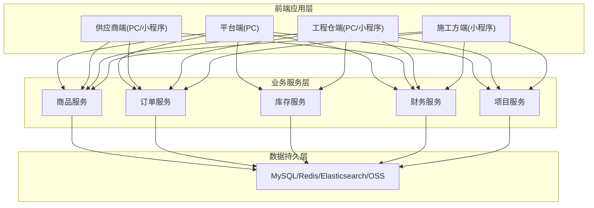
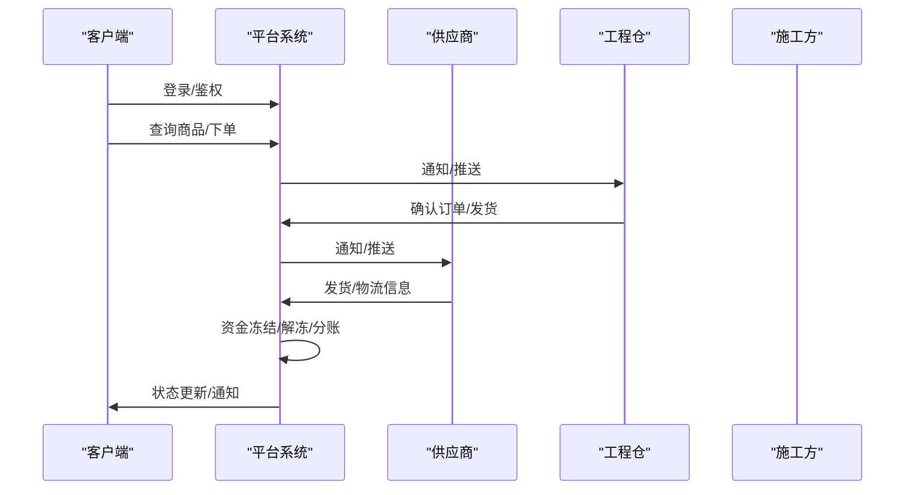
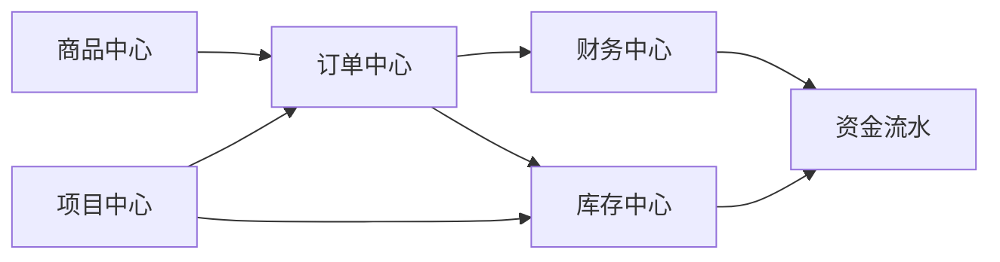
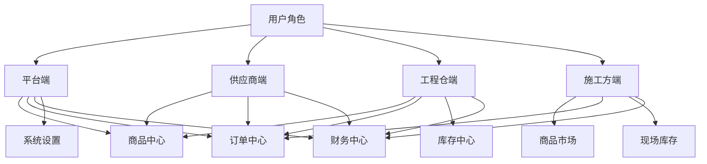

# 产品文档

<cite>
**本文档引用的文件**
- [package.json](file://package.json)
- [apps/pc/src/main.ts](file://apps/pc/src/main.ts)
- [apps/mp/src/main.ts](file://apps/mp/src/main.ts)
- [docs/PRD/01-系统概览与架构.md](file://docs/PRD/01-系统概览与架构.md)
- [docs/PRD/02-业务流程设计.md](file://docs/PRD/02-业务流程设计.md)
- [docs/PRD/03-数据模型与表结构.md](file://docs/PRD/03-数据模型与表结构.md)
- [docs/PRD/06-商品板块功能清单.md](file://docs/PRD/06-商品板块功能清单.md)
- [docs/PRD/07-平台端商品中心功能清单.md](file://docs/PRD/07-平台端商品中心功能清单.md)
- [docs/PRD/13-供应商供货与工程仓配置功能详细设计.md](file://docs/PRD/13-供应商供货与工程仓配置功能详细设计.md)
- [docs/PRD/16-商品SKU菜单功能详细设计.md](file://docs/PRD/16-商品SKU菜单功能详细设计.md)
- [docs/PRD/18-SPU管理功能详细设计.md](file://docs/PRD/18-SPU管理功能详细设计.md)
- [docs/PRD/23-平台商品下架删除影响分析.md](file://docs/PRD/23-平台商品下架删除影响分析.md)
- [docs/供应商端产品PRD.md](file://docs/供应商端产品PRD.md)
- [工程仓端_完整58个功能_全链路.csv](file://工程仓端_完整58个功能_全链路.csv)
- [平台端功能清单_带优先级.csv](file://平台端功能清单_带优先级.csv)
- [工程仓端功能清单_带优先级.csv](file://工程仓端功能清单_带优先级.csv)
- [供应商端功能清单_带优先级.csv](file://供应商端功能清单_带优先级.csv)
- [项目功能排期_四端汇总.csv](file://项目功能排期_四端汇总.csv)
- [脚手架PRD专业模版/00_文档体系架构/02-PRD版本期数管理规范.md](file://脚手架PRD专业模版/00_文档体系架构/02-PRD版本期数管理规范.md)
- [脚手架PRD专业模版/01_PRD编写模板/06-二期迭代需求模板.md](file://脚手架PRD专业模版/01_PRD编写模板/06-二期迭代需求模板.md)
- [docs/01_PRD/更新日志.md](file://docs/01_PRD/更新日志.md)
- [脚手架PRD专业模版/03_辅助模板/更新日志模板.md](file://脚手架PRD专业模版/03_辅助模板/更新日志模板.md)
- [脚手架PRD专业模版/01_PRD编写模板/00-PRD总纲模板.md](file://脚手架PRD专业模版/01_PRD编写模板/00-PRD总纲模板.md)
- [脚手架PRD专业模版/01_PRD编写模板/02-业务流程设计.md](file://脚手架PRD专业模版/01_PRD编写模板/02-业务流程设计.md)
</cite>

## 更新摘要
**变更内容**
- 新增PRD版本期数管理规范章节，建立标准化的版本管理体系
- 新增二期迭代需求模板，提供结构化的迭代需求设计方法
- 更新文档版本管理机制，完善跨端协同的PRD管理流程
- 增强版本追溯性和可追溯性，确保每次变更都有据可查

## 目录
1. [引言](#引言)
2. [项目结构](#项目结构)
3. [核心组件](#核心组件)
4. [架构总览](#架构总览)
5. [详细组件分析](#详细组件分析)
6. [版本期数管理规范](#版本期数管理规范)
7. [二期迭代需求模板](#二期迭代需求模板)
8. [依赖分析](#依赖分析)
9. [性能考虑](#性能考虑)
10. [故障排查指南](#故障排查指南)
11. [结论](#结论)
12. [附录](#附录)

## 引言
本产品文档面向工程材料管理采供一体化平台，覆盖平台端、供应商端、工程仓端与施工方端四端协同的业务目标与技术实现。文档以PRD为核心，结合业务流程、数据模型、功能清单与排期计划，形成从理念到落地的完整产品说明，确保产品经理、开发与测试团队对产品达成一致认知。

**更新** 新增版本期数管理规范和二期迭代需求模板，建立标准化的PRD版本管理体系，确保所有变更都具备可追溯性。

## 项目结构
- 多端架构：平台端（PC Web）、供应商端（PC Web + 小程序）、工程仓端（PC Web + 小程序）、施工方端（小程序）。
- 技术栈：Vue3 + TypeScript，Arco Design UI，Pinia 状态管理，Vite 构建工具。
- 项目脚本：统一通过根目录脚本启动/构建各端应用，便于多端联调与发布。



**图表来源**
- [docs/PRD/01-系统概览与架构.md:66-94](file://docs/PRD/01-系统概览与架构.md#L66-L94)
- [apps/pc/src/main.ts:1-19](file://apps/pc/src/main.ts#L1-L19)
- [apps/mp/src/main.ts:1-14](file://apps/mp/src/main.ts#L1-L14)

**章节来源**
- [package.json:1-23](file://package.json#L1-L23)
- [apps/pc/src/main.ts:1-19](file://apps/pc/src/main.ts#L1-L19)
- [apps/mp/src/main.ts:1-14](file://apps/mp/src/main.ts#L1-L14)
- [docs/PRD/01-系统概览与架构.md:62-134](file://docs/PRD/01-系统概览与架构.md#L62-L134)

## 核心组件
- 平台端（PC Web）：商户管理、商品管理、订单监管、财务对账、系统配置等运营职能。
- 供应商端（PC Web + 小程序）：商品上架、订单履约、资金结算、发票管理。
- 工程仓端（PC Web + 小程序）：商品采购、库存管理、销售订单、财务对账、项目管理。
- 施工方端（小程序）：项目管理、现场库存、领料管理、采购下单、资金管理。

**章节来源**
- [docs/PRD/01-系统概览与架构.md:211-383](file://docs/PRD/01-系统概览与架构.md#L211-L383)

## 架构总览
- 端到端链路：工程仓采购（B2B）与施工方采购（内部销售）双链路，均通过平台托管资金与分账。
- 数据模型：围绕用户与权限、商户管理、项目管理、商品管理、订单管理、库存管理、领料管理、财务管理等核心实体展开。
- 非功能性：性能、安全、兼容性要求明确，支撑多端并发与业务稳定性。



**图表来源**
- [docs/PRD/02-业务流程设计.md:383-494](file://docs/PRD/02-业务流程设计.md#L383-L494)
- [docs/PRD/02-业务流程设计.md:498-621](file://docs/PRD/02-业务流程设计.md#L498-L621)

**章节来源**
- [docs/PRD/01-系统概览与架构.md:387-472](file://docs/PRD/01-系统概览与架构.md#L387-L472)
- [docs/PRD/02-业务流程设计.md:9-73](file://docs/PRD/02-业务流程设计.md#L9-L73)

## 详细组件分析

### 商品板块功能清单（平台端）
- 覆盖商品分类、规格属性、SPU/SKU、供应商供货、商品审核等。
- 平台端负责商品全生命周期治理与价格策略配置。

**章节来源**
- [docs/PRD/06-商品板块功能清单.md](file://docs/PRD/06-商品板块功能清单.md)
- [docs/PRD/07-平台端商品中心功能清单.md](file://docs/PRD/07-平台端商品中心功能清单.md)

### 供应商供货与工程仓配置（平台端）
- 供应商供货关系建立、价格设置、启用/停用。
- 工程仓销售价格配置、BOM套餐管理。

**章节来源**
- [docs/PRD/13-供应商供货与工程仓配置功能详细设计.md](file://docs/PRD/13-供应商供货与工程仓配置功能详细设计.md)

### 商品SKU菜单功能详细设计
- SKU层面的价格、库存、规格与菜单配置，支撑多端展示与下单。

**章节来源**
- [docs/PRD/16-商品SKU菜单功能详细设计.md](file://docs/PRD/16-商品SKU菜单功能详细设计.md)

### SPU管理功能详细设计
- SPU作为商品聚合单元，负责品牌、单位、描述、图片与状态管理。

**章节来源**
- [docs/PRD/18-SPU管理功能详细设计.md](file://docs/PRD/18-SPU管理功能详细设计.md)

### 平台商品下架删除影响分析
- 分析下架/删除对订单、库存、价格、发票等模块的影响与应对策略。

**章节来源**
- [docs/PRD/23-平台商品下架删除影响分析.md](file://docs/PRD/23-平台商品下架删除影响分析.md)

### 供应商端产品PRD（端侧）
- 供应商端的业务流程、财务中心、订单管理、售后管理等模块设计。

**章节来源**
- [docs/供应商端产品PRD.md:1-1093](file://docs/供应商端产品PRD.md#L1-L1093)

### 工程仓端功能清单（端侧）
- 工程仓端从商品浏览、购物车、采购下单、库存管理、出入库、订单管理到财务对账的全链路功能。

**章节来源**
- [工程仓端功能清单_带优先级.csv:1-57](file://工程仓端功能清单_带优先级.csv#L1-L57)

### 平台端功能清单（端侧）
- 平台端覆盖商户管理、商品管理、订单监管、库存总览、财务中心、系统设置等。

**章节来源**
- [平台端功能清单_带优先级.csv:1-68](file://平台端功能清单_带优先级.csv#L1-L68)

### 供应商端功能清单（端侧）
- 供应商端从主体信息、商品中心、订单管理到财务中心、系统设置的完整功能矩阵。

**章节来源**
- [供应商端功能清单_带优先级.csv:1-36](file://供应商端功能清单_带优先级.csv#L1-L36)

### 项目功能排期（四端汇总）
- 四端核心功能点的开发与测试排期，明确可联调时间与依赖关系。

**章节来源**
- [项目功能排期_四端汇总.csv:1-85](file://项目功能排期_四端汇总.csv#L1-L85)

## 版本期数管理规范

### 核心设计理念
> **所有的PRD变更都必须可追溯！** 按版本期数组织PRD，让每一期需求的边界、范围、交付物清晰可查。

**更新** 新增版本期数管理规范，建立标准化的PRD版本管理体系，确保所有变更都有据可查。

### 版本期数命名规范

#### 命名公式
```
YY.M.N-关键词
```

| 部分 | 含义 | 示例 | 说明 |
|:----|:-----|:-----|:-----|
| **YY** | 年份后两位 | `26` = 2026年 | 统一两位 |
| **M** | 月份 | `4` = 4月 | 不用补0 |
| **N** | 本月第N个需求 | `1` = 本月第1期 | 按提需求顺序编号 |
| **关键词** | 本期核心主题 | `0-1搭建` / `购物车优化` | 简短精准描述 |

#### 示例
| 期数名称 | 说明 |
|:--------|------|
| `26.4.1-0-1搭建` | 2026年4月第1个需求，系统从0到1搭建 |
| `26.5.1-购物车优化` | 2026年5月第1个需求，购物车体验优化 |
| `26.5.2-支付接入` | 2026年5月第2个需求，支付系统接入 |

### 目录组织结构
```
prd-docs/
├── releases/                           # 🔝 推荐：按版本期数查看
│   ├── 26.4.1-0-1搭建/
│   │   ├── 版本概览.md                 # ✨ 本期全景总览
│   │   └── （实际文档复用根目录文件）
│   └── 26.5.1-购物车优化/
│       ├── 版本概览.md
│       └── 变更功能文档.md
├── warehouse/ platform/ supplier/ ...  # 📍 按端查看
│   └── 各端完整PRD文档
└── archives/                           # 📦 历史归档
```

### 版本期数添加流程

#### 新需求期数创建步骤
1. **创建版本目录**
   ```bash
   mkdir prd-docs/releases/YY.M.N-关键词
   ```

2. **编写版本概览文档**
   ```
   prd-docs/releases/YY.M.N-关键词/版本概览.md
   ```
   必须包含：
   - 版本信息表（时间、目标、范围）
   - 本期核心变更列表
   - 四端影响范围
   - 下版本路标

3. **更新 `prdData.ts` 数据**
   - 在 `release-section` 下新增版本节点
   - 挂入本期涉及的具体文档模块

4. **复用或新增文档**
   - 一期新增的功能 → 新建对应模块的PRD
   - 优化原有功能 → 直接在原文档中补充 ✨/🔄 标记
   - 不重复编写相同内容的文档，直接复用

### 版本概览文档模板
```markdown
# YY.M.N 期 - 关键词

## 📅 版本信息
| 项 | 值 |
|---|---|
| 版本号 | YY.M.N |
| 核心目标 | 一句话描述 |
| 包含端 | 工程仓/平台/供应商/施工方 |
| PRD数量 | N个功能点 |

## 🎯 本期核心范围

### 功能变更对比表
| 模块 | V1 | V2 | 说明 |
|:-----|:----|:----|:------|
| 购物车 | 旧逻辑 | 新逻辑 | 优化点说明 |

## 📚 本期PRD文档清单
- [x] 文档1
- [x] 文档2

## 🔄 下版本路标
| 期数 | 计划时间 | 核心主题 |
|:-----|:---------|:---------|
| YY.M+1.1 | YYYY年M+1月 | 主题 |
```

### 最佳实践

| 场景 | 建议做法 |
|:------|:---------|
| **3个功能点以内小优化** | 合并到一个期数，放在同一个版本概览里 |
| **跨端大需求** | 单独一个期数，详细拆分各端影响 |
| **Bug修复类** | 不单独建期数，记入更新日志即可 |
| **架构重构** | 必须单独建期数，风险和影响单独评估 |

### 重要提醒
- **永远不要删除历史期数**，归档是唯一正确方式
- **永远不要修改已上线期数的文档**，有变更开新期数
- **跨部门协同时**，直接发「期数+文档名」的链接

**章节来源**
- [脚手架PRD专业模版/00_文档体系架构/02-PRD版本期数管理规范.md:1-129](file://脚手架PRD专业模版/00_文档体系架构/02-PRD版本期数管理规范.md#L1-L129)

## 二期迭代需求模板

### 迭代设计原则
> 二期迭代PRD设计原则：
> 
> ✅ 面向内部读者：所有人都了解一期架构，不重复写已知内容
> ✅ 只写变化：用「前后对比表格」替代大段文字描述
> ✅ 兼容性优先：数据迁移、接口兼容、回滚预案是必备章节
> ✅ 变更地图：开头一句话说清「改哪里、影响范围多大」

**更新** 新增二期迭代需求模板，提供结构化的迭代需求设计方法，确保迭代变更的清晰性和可追溯性。

### 迭代概览

#### 1.1 变更地图（一句话说清）
> **本次迭代修改范围**：{如：工程仓端-商品市场-购物车 + 结算页，共3个功能点，不影响其他端}

#### 1.2 核心目标与背景
| 目标 | 具体描述 | 衡量指标 |
|:----|---------|---------|
| {目标1：如提升结算转化率} | {解决V1中结算流程繁琐的问题} | 转化率提升{N}% |
| {目标2：如降低客服咨询} | {优化库存展示清晰度} | 相关咨询量减少{N}% |

#### 1.3 需求排期与干系人
| 阶段 | 时间 | 负责人 |
|:----|:-----|:------|
| PRD评审 | {YYYY-MM-DD} | {产品} |
| 开发完成 | {YYYY-MM-DD} | {前后端} |
| 测试完成 | {YYYY-MM-DD} | {测试} |
| 灰度发布 | {YYYY-MM-DD} | - |
| 全量上线 | {YYYY-MM-DD} | - |

### 业务变更说明

#### 2.1 核心规则变更对比表
> 仅列出与V1不同的规则，完全相同的业务规则注明「沿用V1，无变化」即可

| 业务场景 | V1.0 现有逻辑 | V{版本号} 新逻辑 | 收益 | 风险点 |
|:--------|:-------------|:---------------|:-----|:-------|
| {场景1：如购物车结算} | {逐一对商品确认} | {批量结算，统一确认} | 减少N步操作 | - |
| {场景2} | {V1逻辑} | {V2逻辑} | {收益} | {风险} |

#### 2.2 变更流程图（仅画差异部分）
```mermaid
flowchart TD
subgraph V1 旧流程
A1[步骤A] --> B1[步骤B]
B1 --> C1[旧步骤C]
end
subgraph V{版本号} 新流程
A2[步骤A] --> B2[步骤B]
B2 --> C2[✅ 新增优化步骤]
C2 --> D2[步骤D]
end
style C1 fill:#fce4ec,stroke:#c62828
style C2 fill:#c8e6c9,stroke:#388e3c
style D2 fill:#c8e6c9,stroke:#388e3c
```

#### 2.3 涉及页面/入口变更
| 页面 | V1入口 | V2入口 | 说明 |
|:----|:------|:------|------|
| {页面名} | {位置} | {新位置/新增入口} | {说明} |

### 数据模型变更

#### 3.1 字段变更对比表
> 不需要完整的领域模型，只列出"新增、修改、删除"的字段和实体

| 实体/表名 | 字段名 | 类型 | V1.0 值范围/约束 | V{版本号} 值范围/约束 | 数据迁移策略 |
|:---------|:------|:-----|:----------------|:-------------------|:------------|
| {表名} | {字段名} | {类型} | {V1约束} | {V2约束，如枚举值新增} | 全量更新默认值 / 无需处理 |
| {表名} | ✨ {新增字段} | {类型} | - | {新字段约束} | 脚本初始化 / 程序自动补全 |
| {表名} | ❌ {废弃字段} | {类型} | {V1约束} | 不再使用 | 下线后N个版本删除 |

#### 3.2 枚举值/状态变更
| 枚举类型 | V1.0 值 | V{版本号} 新增值 | 说明 |
|:--------|:--------|:----------------|------|
| {订单状态} | 0-待审核, 1-已确认 | 2-已取消 | 取消状态独立成单独轨道 |

#### 3.3 索引/性能优化（如有）
| 表名 | 索引字段 | 类型 | 说明 |
|:-----|:---------|:-----|------|
| {表} | {字段} | 普通索引 / 唯一索引 | 解决慢查询问题 |

### 功能点详细设计（仅新增/修改的功能）

#### 4.1 ✨ {功能点1：新增功能名称}（{优先级}）

##### 交互逻辑（标注与V1的差异）
1. {步骤说明，与V1相同则注明「沿用V1」}
2. ✨ **新增**：{V2新增的分支或步骤}
3. 🔄 **修改**：{V2修改的逻辑，注明V1是什么，现在改成什么}
4. ❌ **删除**：{不再执行的逻辑}

##### 原子字段定义（仅新增或修改规则的字段）
| 字段 | 类型 | 必填 | 来源 | 校验规则（标注变更） | 展示规则 | 默认值 |
|:----|:----|:----:|:----|:-------------------|:--------|:-----:|
| ✨ {新增字段} | {类型} | 是/否 | {来源} | {校验规则} | {展示} | {默认值} |
| 🔄 {修改字段} | {类型} | 是/否 | {来源} | {V1规则} → {V2新规则} | {展示} | {默认值} |

##### 边界情况覆盖
| 场景 | 处理逻辑 | 提示文案 |
|:----|:--------|---------|
| {异常/边界场景描述} | {处理方式} | "{文案}" |
| **兼容场景：老版本用户访问** | {降级策略} | "{提示}" |

#### 4.2 🔄 {功能点2：优化功能名称}（{优先级}）

> {同上模板结构，重点标注优化点}

#### 4.3 ❌ {功能点3：下线功能}（如有）
| 功能名称 | 下线原因 | 替代方案 | 下线策略 |
|:--------|:---------|:---------|---------|
| {功能名} | {原因，如使用率低} | {引导用户使用XX新功能} | 灰度下线 / 提示后跳转 / 直接隐藏 |

### 功能权限矩阵
| 功能模块 | 具体操作 | 是否需权限控制 | 说明 |
|:--------|---------|:------------:|------|
| {模块A} | ✨ {新增操作} | ✅ / ❌ | {说明} |
| {模块B} | 🔄 {修改权限范围} | {原：是/否} → {现：是/否} | {说明} |

### 兼容性与风险预案

#### 6.1 兼容性说明
| 维度 | 兼容策略 |
|:----|:---------|
| **前端版本兼容** | {如：V1用户弹窗提示升级 / 向下兼容3个版本 / 强制升级} |
| **API接口兼容** | {如：老接口保留3个月，同时提供新接口 / 无感知兼容} |
| **App/小程序兼容** | {如：审核期间新旧版本兼容说明} |
| **历史数据兼容** | {如：所有历史数据自动迁移，用户无感知} |

#### 6.2 数据迁移方案
| 迁移项 | 迁移方式 | 执行时机 | 回滚方式 |
|:------|:---------|:---------|---------|
| {如：订单状态字段补全} | 脚本批量执行 / 程序懒加载补全 | 发布前预执行 / 发布后执行 | 还原脚本 |

#### 6.3 灰度与发布策略
- **灰度范围**：{如：先放10%流量 / 白名单用户 / 内部测试环境全量}
- **观察指标**：{如：接口成功率、错误日志、用户反馈}
- **全量条件**：{如：灰度运行N小时无异常}

#### 6.4 回滚预案
| 触发回滚条件 | 回滚步骤 |
|:------------|---------|
| {如：核心接口成功率低于99.9%} | 1. 代码回滚到上一版本  2. 数据恢复脚本执行  3. 验证 |
| {如：出现大面积数据异常} | 1. 立即回滚  2. 通知相关人员  3. 事后复盘 |

### 埋点与验收标准

#### 7.1 新增埋点（如有）
| 事件名 | 触发时机 | 上报字段 | 用途 |
|:------|---------|:---------|------|
| {event_name} | {触发时机} | `{字段}` | 衡量转化率 |

#### 7.2 验收标准
| 验收项 | 通过标准 |
|:------|---------|
| 功能测试 | 所有功能点用例通过 |
| 兼容测试 | V1版本用户访问正常 |
| 性能测试 | 核心接口响应时间 ≤ {N}ms |
| 数据验证 | 迁移数据完整准确 |

### 二期迭代模板心法总结
> 💡 **二期迭代模板心法总结**：
> 表格替代文字，对比替代描述，兼容性是灵魂，不重复写一期已经写过的内容！

**章节来源**
- [脚手架PRD专业模版/01_PRD编写模板/06-二期迭代需求模板.md:1-221](file://脚手架PRD专业模版/01_PRD编写模板/06-二期迭代需求模板.md#L1-L221)

## 依赖分析
- 端到端依赖：四端围绕商品、订单、库存、财务、项目五大业务域协作。
- 数据依赖：商品中心（SPU/SKU/分类/属性）、订单中心（采购/销售/状态）、库存中心（入库/出库/批次/盘点）、财务中心（托管/结算/发票/对账）、项目中心（项目/成员/预算/进度）。
- 技术依赖：Arco Design UI、Pinia、Vue Router、Vite，统一构建与运行环境。



**图表来源**
- [docs/PRD/01-系统概览与架构.md:137-209](file://docs/PRD/01-系统概览与架构.md#L137-L209)
- [docs/PRD/03-数据模型与表结构.md:11-70](file://docs/PRD/03-数据模型与表结构.md#L11-L70)

**章节来源**
- [docs/PRD/01-系统概览与架构.md:137-209](file://docs/PRD/01-系统概览与架构.md#L137-L209)
- [docs/PRD/03-数据模型与表结构.md:72-84](file://docs/PRD/03-数据模型与表结构.md#L72-L84)

## 性能考虑
- 页面加载时间 < 2 秒，接口响应时间 < 500ms，支持 1000+ 并发用户。
- 首屏资源优化、组件懒加载、分页与虚拟滚动、缓存策略与CDN加速。
- 小程序端与移动端适配，保证在 1366×768 以上分辨率下稳定运行。

**章节来源**
- [docs/PRD/01-系统概览与架构.md:554-581](file://docs/PRD/01-系统概览与架构.md#L554-L581)

## 故障排查指南
- 登录与鉴权：检查 JWT Token 与 Refresh Token 生命周期，确认权限与角色配置。
- 订单状态异常：核对订单状态机流转、资金冻结/解冻与分账规则。
- 库存不一致：核对入库/出库单据、批次与盘点差异，检查锁定数量与成本价。
- 发票与对账：核对三流合一（订单/资金/发票）与银行对账单匹配规则。
- 小程序/移动端兼容：检查浏览器与系统版本、网络与缓存策略。

**章节来源**
- [docs/PRD/02-业务流程设计.md:423-454](file://docs/PRD/02-业务流程设计.md#L423-L454)
- [docs/PRD/03-数据模型与表结构.md:500-635](file://docs/PRD/03-数据模型与表结构.md#L500-L635)

## 结论
本产品文档以PRD为主线，结合业务流程、数据模型与功能清单，明确了四端协同的业务目标与技术实现路径。通过清晰的功能矩阵、排期计划与故障排查指引，确保产品在设计、开发与测试阶段保持一致的理解与交付节奏。

**更新** 新增版本期数管理规范和二期迭代需求模板，建立了标准化的PRD版本管理体系，确保所有变更都具备可追溯性和规范性，为项目的持续演进提供了坚实的文档基础。

## 附录

### 用例图（概念示意）


### 文档版本管理机制

#### 更新日志维护规则
- 每次有跨PRD的版本变更时，在此记录变更概要、影响范围、涉及文件列表
- 各PRD文件内的版本历史同步追加新版本条目，与全局版本号对齐
- 仅影响单个PRD的小修小改，可只在文件版本历史中记录，不必更新本日志

#### 版本对照索引
| PRD全局版本 | 各文件版本历史标记 | 说明 |
|:----------:|:-----------------:|:----|
| v2.0 | 各文件 `v2.0` 条目 | 11章新模板重构（2026-04-24） |
| v1.0 | 各文件 `v1.0` 条目 | 初始创建（2026-04-24） |

**章节来源**
- [docs/01_PRD/更新日志.md:1-125](file://docs/01_PRD/更新日志.md#L1-L125)
- [脚手架PRD专业模版/03_辅助模板/更新日志模板.md:1-44](file://脚手架PRD专业模版/03_辅助模板/更新日志模板.md#L1-L44)