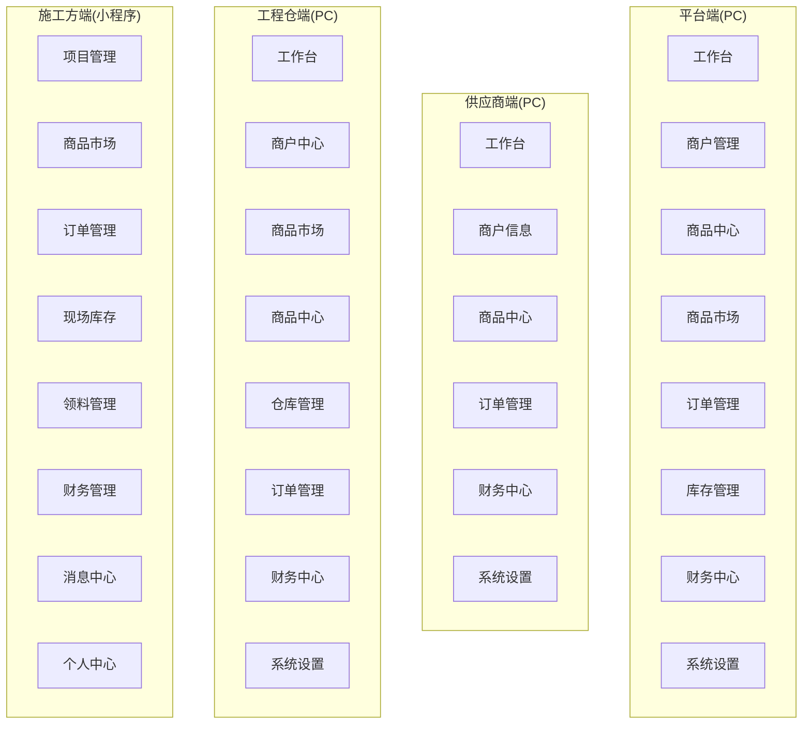
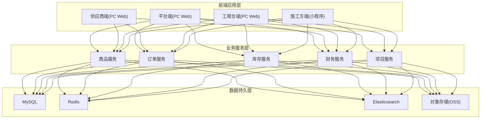
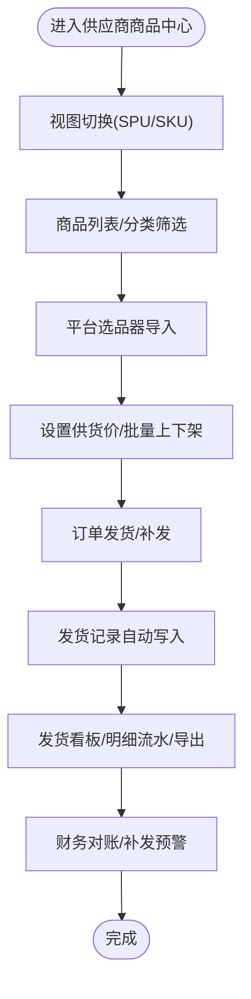
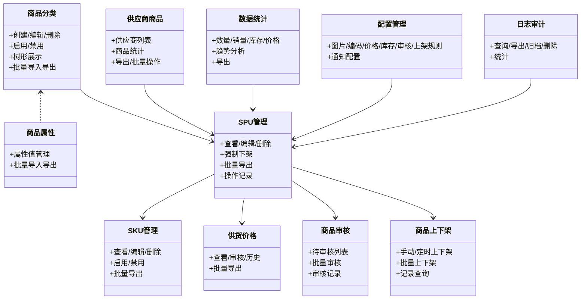
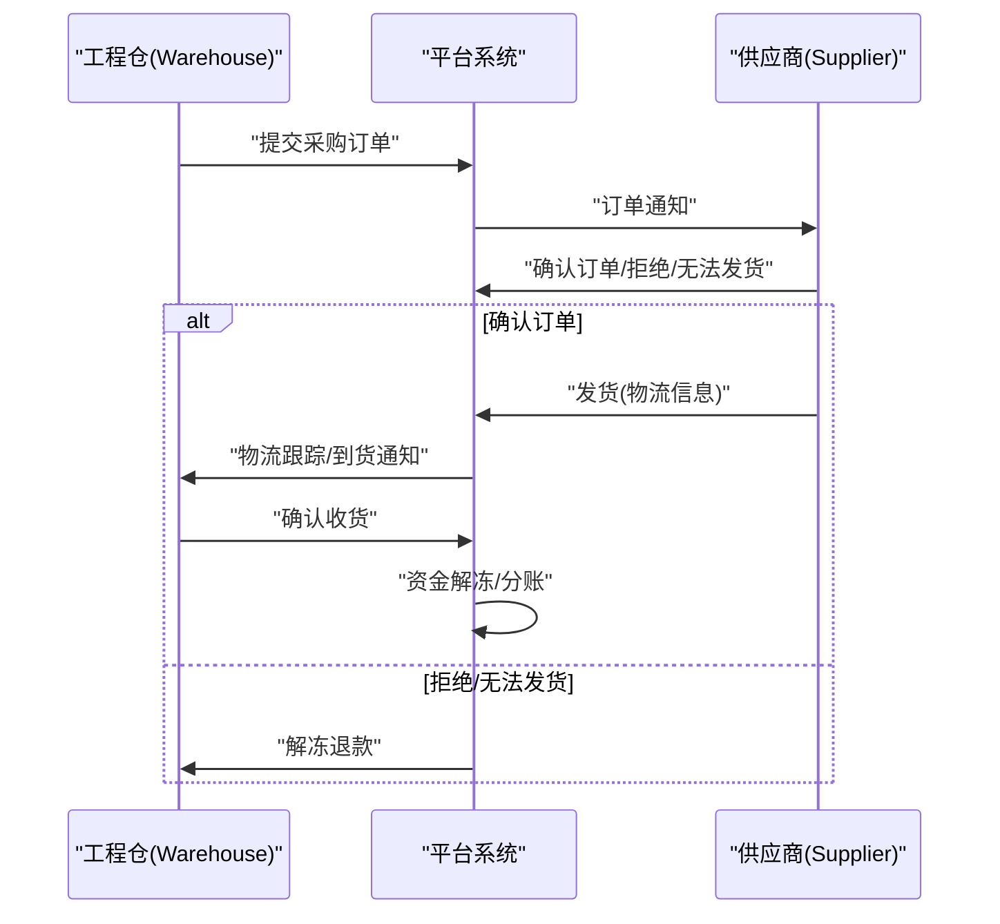
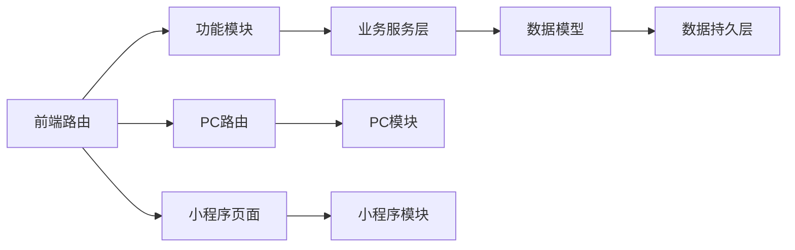

# 产品说明书

<cite>
**本文引用的文件**
- [供应商端商品中心功能说明书.md](file://docs/01_PRD/供应商端/供应商端商品中心功能说明书.md)
- [商品板块功能清单.md](file://docs/04_历史归档/2025_Q4/06-商品板块功能清单.md)
- [平台端商品中心功能清单.md](file://docs/04_历史归档/2025_Q4/07-平台端商品中心功能清单.md)
- [系统概览与架构.md](file://docs/01_PRD/平台端/01-系统概览与架构.md)
- [业务流程设计.md](file://docs/01_PRD/平台端/02-业务流程设计.md)
- [数据模型与表结构.md](file://docs/01_PRD/平台端/03-数据模型与表结构.md)
- [供应商端商品中心功能设计.md](file://docs/01_PRD/供应商端/06-商品中心功能设计.md)
- [平台端商品中心功能设计.md](file://docs/01_PRD/平台端/08-商品市场管理功能设计.md)
- [更新日志.md](file://docs/01_PRD/更新日志.md)
- [目录结构说明.md](file://docs/03_通用资源/03_规范/目录结构说明.md)
- [版本迭代记录.md](file://docs/版本迭代记录.md)
- [06-商品中心功能设计.md](file://docs/04_历史归档/2026_Q1/PM纯净版备份/供应商端/06-商品中心功能设计.md)
- [router/index.ts](file://apps/pc/src/router/index.ts)
- [pages.json](file://apps/mp/src/pages.json)
</cite>

## 更新摘要
**变更内容**
- 更新文档组织结构，移除季度期数标记，采用按文档类型+端的组织方式
- 更新操作手册组织方式，从PRD文档转移到专门的操作手册目录
- 新增v3.0版本发布说明，包含运营专员角色引入
- 更新权限矩阵和用户角色覆盖范围
- 增加版本历史和更新日志的完整性

## 目录
1. [简介](#简介)
2. [项目结构](#项目结构)
3. [核心组件](#核心组件)
4. [架构总览](#架构总览)
5. [详细组件分析](#详细组件分析)
6. [版本演进与更新](#版本演进与更新)
7. [依赖分析](#依赖分析)
8. [性能考虑](#性能考虑)
9. [故障排查指南](#故障排查指南)
10. [结论](#结论)
11. [附录](#附录)

## 简介
本产品说明书面向工程材料管理采供一体化平台，覆盖供应商端商品中心、平台端商品中心两大核心模块，面向平台运营方、供应商、工程仓、施工方四大角色，提供商品数字化、商品市场、订单履约、库存管理、财务结算、项目管理等全链路能力。本文档基于PRD文档与前端路由结构，系统化梳理功能边界、业务流程、数据模型与交互设计，帮助用户高效理解与使用产品。

**更新** v3.0版本引入运营专员角色，扩展了供应商端商品中心的目标用户覆盖范围。

## 项目结构
工程材料管理采供一体化平台采用四端架构：平台端（PC Web）、供应商端（PC Web + 小程序）、工程仓端（PC Web + 小程序）、施工方端（小程序）。前端路由与页面组织清晰划分功能模块，支撑商品中心、商品市场、订单管理、库存管理、财务中心、系统设置等业务域。

**图表来源**
- [系统概览与架构.md](file://docs/01_PRD/平台端/01-系统概览与架构.md)
- [router/index.ts](file://apps/pc/src/router/index.ts)
- [pages.json](file://apps/mp/src/pages.json)

**章节来源**
- [系统概览与架构.md](file://docs/01_PRD/平台端/01-系统概览与架构.md)
- [router/index.ts](file://apps/pc/src/router/index.ts)
- [pages.json](file://apps/mp/src/pages.json)

## 核心组件
- 商品中心（平台端/供应商端）：商品分类、属性、SPU/SKU、价格、审核、上下架、供应商商品管理、数据统计、配置与日志审计。
- 商品市场（平台端/工程仓端/施工方端）：供应商品市场、销售商品市场、BOM基装包、价格策略、购物车、收藏、订单创建。
- 订单管理（平台端/供应商端/工程仓端/施工方端）：采购/销售订单、状态流转、履约跟踪、售后管理。
- 库存管理（平台端/工程仓端/施工方端）：库存总览、入库/出库/调拨/盘点、批次管理、现场库存。
- 财务中心（平台端/供应商端/工程仓端/施工方端）：托管账户、资金流水、结算、账单、发票、分账。
- 系统设置（平台端/供应商端/工程仓端/施工方端）：用户/角色/菜单、分账配置、物流配置、员工与角色管理。

**更新** v3.0版本扩展了供应商端商品中心的目标用户，新增运营专员角色，提升了用户画像覆盖范围。

**章节来源**
- [商品板块功能清单.md](file://docs/04_历史归档/2025_Q4/06-商品板块功能清单.md)
- [平台端商品中心功能清单.md](file://docs/04_历史归档/2025_Q4/07-平台端商品中心功能清单.md)
- [系统概览与架构.md](file://docs/01_PRD/平台端/01-系统概览与架构.md)

## 架构总览
平台采用"四端一体"的多端架构，业务服务层与数据持久层清晰分离，支持PC端与小程序端的统一业务逻辑与数据一致性。

**图表来源**
- [系统概览与架构.md](file://docs/01_PRD/平台端/01-系统概览与架构.md)

**章节来源**
- [系统概览与架构.md](file://docs/01_PRD/平台端/01-系统概览与架构.md)

## 详细组件分析

### 供应商端商品中心
供应商端商品中心是供应商在平台的"数字货架"，承担商品上架、价格设置、发货记录与对账等核心职能。其核心价值体现在：商品数字化、平台商品库、发货全链路追踪、补发异常预警。

**更新** v3.0版本新增运营专员角色，扩展了目标用户群体，提升了商品管理的协作效率。

- 功能组成
  - 商品列表：SPU/SKU双视图切换、分类树筛选、平台选品器、批量上下架与价格管理。
  - 发货记录：发货看板（正常发货/补发/累计/关联订单数）、按SKU维度汇总、补发预警、明细流水与导出。
  - 交互设计：视图切换零感知、发货自动记账、状态标签色彩体系。
  - 业务规则：商品上下架不影响既有订单、发货记录不可删除、来源隔离（平台导入/自建）。
  - 关联模块：与订单管理、商品列表、结算维度强关联。
  - 数据模型：SPU、SKU、发货记录等核心表支撑业务。

**图表来源**
- [供应商端商品中心功能说明书.md](file://docs/01_PRD/供应商端/供应商端商品中心功能说明书.md)

**章节来源**
- [供应商端商品中心功能说明书.md](file://docs/01_PRD/供应商端/供应商端商品中心功能说明书.md)

### 平台端商品中心
平台端商品中心是平台运营方对全平台商品进行统一管理的核心模块，涵盖商品分类、属性、SPU/SKU、价格、审核、上下架、供应商商品管理、数据统计、配置与日志审计。

- 功能组成
  - 商品分类/属性：增删改查、树形展示、批量导入导出。
  - SPU/SKU：查看/编辑/删除、强制下架、批量导出、操作记录。
  - 供货价格：查看/审核/历史查询、批量导出。
  - 商品审核：待审核列表、审核通过/拒绝、批量审核、审核记录。
  - 商品上下架：手动/定时上下架、批量上下架、记录查询。
  - 供应商商品：供应商列表、商品统计、导出、批量操作。
  - 数据统计：商品数量/销量/库存/价格统计、趋势分析、导出。
  - 配置管理：图片/编码/价格/库存/审核/上架规则、通知配置。
  - 日志审计：操作日志查询/导出/归档/删除、统计。

**图表来源**
- [平台端商品中心功能清单.md](file://docs/04_历史归档/2025_Q4/07-平台端商品中心功能清单.md)

**章节来源**
- [平台端商品中心功能清单.md](file://docs/04_历史归档/2025_Q4/07-平台端商品中心功能清单.md)

### 商品板块功能总览
商品板块覆盖商品分类、属性、SPU、SKU、供货价格、审核、库存、采购/销售订单、商品搜索与浏览等全生命周期管理，配合权限矩阵确保各角色操作边界清晰。

- 功能矩阵（部分）
  - 商品分类管理：平台端（✓），供应商端（-），工程仓端（-），施工方端（-）
  - 商品属性管理：平台端（✓），供应商端（-），工程仓端（-），施工方端（-）
  - 商品SPU管理：平台端（✓），供应商端（✓），工程仓端（-），施工方端（-）
  - 商品SKU管理：平台端（✓），供应商端（✓），工程仓端（-），施工方端（-）
  - 供货价格管理：平台端（✓），供应商端（✓），工程仓端（-），施工方端（-）
  - 商品审核管理：平台端（✓），供应商端（-），工程仓端（-），施工方端（-）
  - 库存管理：平台端（-），供应商端（-），工程仓端（✓），施工方端（-）
  - 采购订单管理：平台端（-），供应商端（✓），工程仓端（✓），施工方端（-）
  - 销售订单管理：平台端（-），供应商端（-），工程仓端（✓），施工方端（✓）
  - 商品搜索与浏览：平台端（✓），供应商端（✓），工程仓端（✓），施工方端（✓）

**章节来源**
- [商品板块功能清单.md](file://docs/04_历史归档/2025_Q4/06-商品板块功能清单.md)

### 商品市场与BOM
- 供应商品市场：工程仓端/平台端查看、筛选、排序、收藏、加入购物车、立即购买。
- 销售商品市场：工程仓端/施工方端查看、BOM基装包管理、价格策略、购物车与订单创建。
- BOM基装包：创建/编辑/详情、与商品组合、价格管理。

**章节来源**
- [商品板块功能清单.md](file://docs/04_历史归档/2025_Q4/06-商品板块功能清单.md)
- [业务流程设计.md](file://docs/01_PRD/平台端/02-业务流程设计.md)

### 订单管理与履约
- 采购订单（工程仓→供应商）：创建/编辑/审核/取消、供应商接单/拒绝/发货、工程仓收货。
- 销售订单（工程仓→施工方）：创建/编辑/审核/取消、工程仓接单/拒绝/发货、施工方收货。
- 订单状态流转：待确认→待发货→待收货→已完成；售后中、已取消、已关闭等分支。
- 履约流程：下单→支付冻结→通知→备货→发货→物流跟踪→到货通知→收货确认→资金结算。

**图表来源**
- [业务流程设计.md](file://docs/01_PRD/平台端/02-业务流程设计.md)

**章节来源**
- [业务流程设计.md](file://docs/01_PRD/平台端/02-业务流程设计.md)

### 库存管理
- 工程仓端：入库（采购/退货/调拨/其他）、出库（销售/调拨/报损/其他）、调拨、盘点、批次管理、库存预警。
- 施工方端：现场库存查看、预警、盘点、统计。
- 库存流水：出入库明细、批次、盘点差异、现场库存变动。

**章节来源**
- [商品板块功能清单.md](file://docs/04_历史归档/2025_Q4/06-商品板块功能清单.md)
- [业务流程设计.md](file://docs/01_PRD/平台端/02-业务流程设计.md)

### 财务中心
- 托管账户：账户余额/冻结金额、状态管理。
- 资金流水：充值/提现/支付/收款/退款/服务费等流水记录。
- 结算与账单：结算单、结算明细、账单管理。
- 发票管理：进项/销项发票管理。
- 分账：按规则分配交易资金。

**章节来源**
- [商品板块功能清单.md](file://docs/04_历史归档/2025_Q4/06-商品板块功能清单.md)
- [业务流程设计.md](file://docs/01_PRD/平台端/02-业务流程设计.md)

### 系统设置与权限
- 用户/角色/菜单：RBAC权限模型、菜单配置、角色权限。
- 分账配置：分账规则配置。
- 物流配置：物流服务商配置。
- 员工与角色：员工管理、角色列表、权限分配。

**更新** v3.0版本扩展了权限矩阵，新增运营专员角色的权限配置。

**章节来源**
- [平台端商品中心功能清单.md](file://docs/04_历史归档/2025_Q4/07-平台端商品中心功能清单.md)
- [系统概览与架构.md](file://docs/01_PRD/平台端/01-系统概览与架构.md)

## 版本演进与更新

### v3.0版本发布（2026-04-25）
**核心变更**：供应商端商品中心新增运营专员角色，扩展用户画像覆盖范围

#### 变更概要
供应商端「06-商品中心功能设计.md」的1.3目标用户中新增"运营专员"角色，补充用户画像覆盖范围。

#### 涉及系统与文件
- **供应商端**（1个文件）
  - 商品中心功能设计.md：1.3 目标用户新增"运营专员"角色

#### 权限矩阵更新
运营专员角色在供应商端商品中心具备以下权限：
- 商品管理：查看列表、新增商品、编辑商品、上架/下架
- 库存管理：库存查询、库存流水

**图表来源**
- [06-商品中心功能设计.md](file://docs/04_历史归档/2026_Q1/PM纯净版备份/供应商端/06-商品中心功能设计.md)

**章节来源**
- [更新日志.md](file://docs/01_PRD/更新日志.md)
- [06-商品中心功能设计.md](file://docs/04_历史归档/2026_Q1/PM纯净版备份/供应商端/06-商品中心功能设计.md)

### v2.0版本发布（2026-04-24）
**核心变更**：11章模板重构，全面升级PRD文档结构

#### 变更概要
将所有功能模块PRD文档从旧3-4章模板（功能概述→业务规则→功能点详细设计）全面重构为11章新模板，新增核心设计原则、Mermaid流程图、权限矩阵、非功能性需求、3D功能点模板、异常处理汇总表、接口依赖建议，状态模块新增状态流转图+状态治理矩阵。

#### 模板结构变更
| 旧模板（4章） | 新模板（11章） |
|:-------------|:--------------|
| 版本历史（底部） | 版本历史（顶部，4列含修订人） |
| 功能概述 | 一、功能概述（含核心概念+目标用户） |
| — | 二、核心设计原则（**新增**） |
| 业务规则 | 三、业务规则（含Mermaid流程图） |
| — | 四、权限矩阵（**新增**） |
| — | 五、非功能性需求（**新增**） |
| 功能点详细设计 | 六、功能点详细设计（3D模板：交互+原子字段+边界） |
| — | 七、异常处理汇总表（**新增**） |
| — | 八、接口依赖建议（**新增**） |
| — | 九、状态流转图（**状态模块新增**） |
| 状态治理矩阵 | 十、状态治理矩阵（增强） |

**章节来源**
- [更新日志.md](file://docs/01_PRD/更新日志.md)

### v1.0版本发布（2026-04-24）
**核心变更**：项目初始化阶段，创建四端全部功能模块PRD文档

#### 变更概要
项目初始化阶段，创建四端全部功能模块PRD文档，覆盖所有核心功能点。

#### 涉及系统与文件
- **平台端**：01~24 全部初始文档
- **工程仓端**：01~14 全部初始文档
- **供应商端**：01~10 全部初始文档
- **施工方端**：01~10 全部初始文档

**章节来源**
- [更新日志.md](file://docs/01_PRD/更新日志.md)

## 依赖分析
- 前端路由与页面组织：PC端与小程序端路由清晰划分模块，减少跨端耦合。
- 业务服务层：商品、订单、库存、财务、项目五大服务相互协作，数据持久层统一支撑。
- 数据模型：SPU/SKU/订单/库存/财务等核心实体关系明确，支撑商品中心与订单履约闭环。

**图表来源**
- [router/index.ts](file://apps/pc/src/router/index.ts)
- [pages.json](file://apps/mp/src/pages.json)
- [数据模型与表结构.md](file://docs/01_PRD/平台端/03-数据模型与表结构.md)

**章节来源**
- [router/index.ts](file://apps/pc/src/router/index.ts)
- [pages.json](file://apps/mp/src/pages.json)
- [数据模型与表结构.md](file://docs/01_PRD/平台端/03-数据模型与表结构.md)

## 性能考虑
- 页面加载与接口响应：首屏加载时间<2秒，接口响应时间<500ms（95%）。
- 并发用户：支持1000+同时在线用户。
- 可用性：年度可用性≥99.9%。
- 安全性：JWT Token + Refresh Token、RBAC权限模型、敏感数据AES加密、HTTPS传输、操作日志审计。

**章节来源**
- [系统概览与架构.md](file://docs/01_PRD/平台端/01-系统概览与架构.md)

## 故障排查指南
- 发货记录异常
  - 现象：发货时商品不存在、重复发货、导出超量、图片加载失败、分类树加载失败。
  - 处理：提示"商品信息异常，请刷新"；允许重复发货；超过5000条提示分批导出；显示占位图标；显示全部分类。
- 订单状态异常
  - 现象：超时未确认、供应商拒绝、库存不足导致关闭。
  - 处理：自动解冻退款；支持售后申请与处理。
- 商品状态异常
  - 现象：上下架影响既有订单、来源隔离限制编辑。
  - 处理：商品状态变更不影响既有订单；平台导入商品不可修改SPU信息。

**章节来源**
- [供应商端商品中心功能说明书.md](file://docs/01_PRD/供应商端/供应商端商品中心功能说明书.md)
- [业务流程设计.md](file://docs/01_PRD/平台端/02-业务流程设计.md)

## 结论
本产品说明书系统化梳理了工程材料管理采供一体化平台的四端架构、核心模块与业务流程，重点聚焦供应商端商品中心与平台端商品中心的功能边界、交互设计与数据模型，辅以权限矩阵与故障排查指南，帮助用户高效理解与使用产品，提升使用效率与体验。

**更新** v3.0版本通过引入运营专员角色，进一步完善了用户画像和权限矩阵，提升了平台的协作效率和管理能力。

## 附录
- 术语定义
  - 平台端：平台运营方的管理后台（PC Web）
  - 供应商：建材供应商，商品的卖方
  - 工程仓：建筑工程采购方，商品的买方
  - 施工方：施工现场管理方，工程仓的下级单位
  - SPU：标准产品单位，商品信息聚合的最小单位
  - SKU：库存量单位，库存进出计量的基本单元
  - BOM：物料清单，基装包组合
  - 托管账户：资金托管账户，用于交易资金监管
  - 分账：交易资金按规则分配给各方
  - 领料：施工方从现场库存领取材料
  - 现场库存：施工现场的库存材料
  - 运营专员：协助管理商品信息的运营人员

**章节来源**
- [系统概览与架构.md](file://docs/01_PRD/平台端/01-系统概览与架构.md)
- [06-商品中心功能设计.md](file://docs/04_历史归档/2026_Q1/PM纯净版备份/供应商端/06-商品中心功能设计.md)