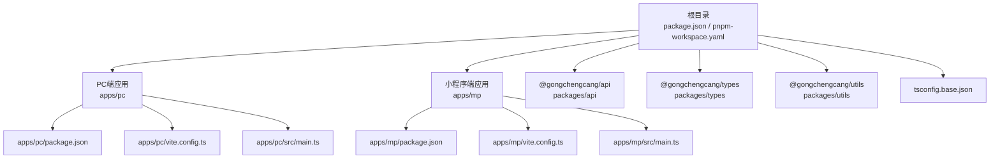
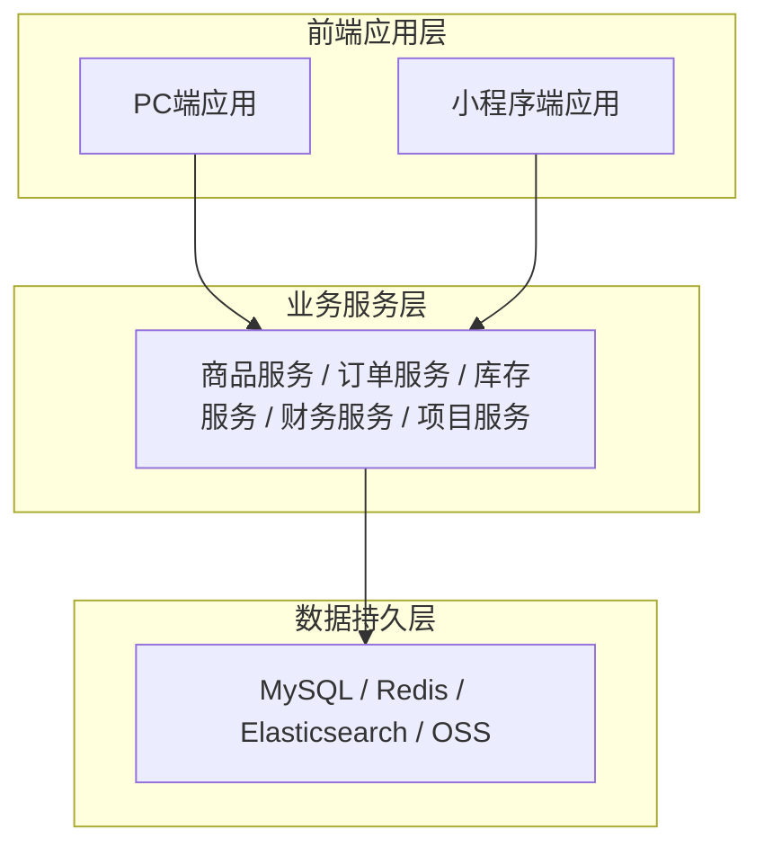
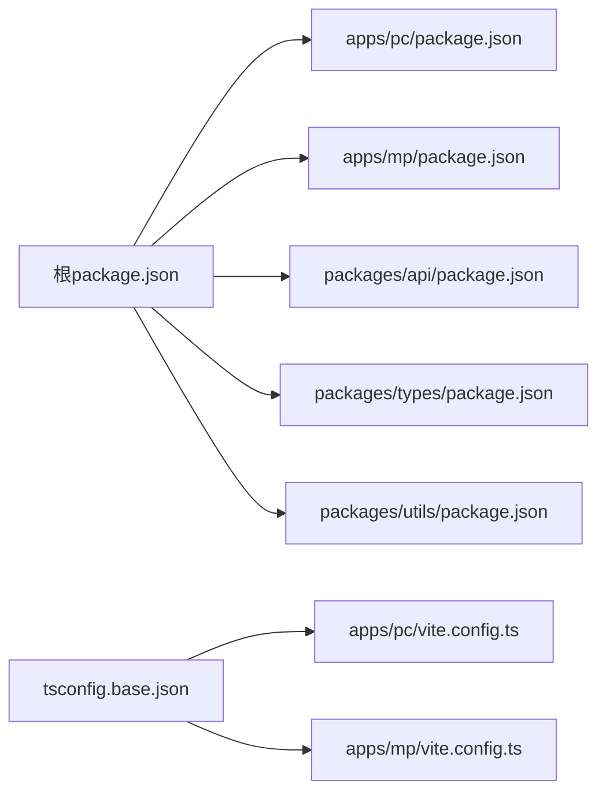

# 开发指南

<cite>
**本文引用的文件**   
- [package.json](file://package.json)
- [pnpm-workspace.yaml](file://pnpm-workspace.yaml)
- [搭建教程.md](file://搭建教程.md)
- [apps/pc/package.json](file://apps/pc/package.json)
- [apps/pc/vite.config.ts](file://apps/pc/vite.config.ts)
- [apps/pc/src/main.ts](file://apps/pc/src/main.ts)
- [apps/mp/package.json](file://apps/mp/package.json)
- [apps/mp/vite.config.ts](file://apps/mp/vite.config.ts)
- [apps/mp/src/main.ts](file://apps/mp/src/main.ts)
- [tsconfig.base.json](file://tsconfig.base.json)
- [apps/pc/public/prd-docs/项目总览.md](file://apps/pc/public/prd-docs/项目总览.md)
- [apps/pc/public/prd-docs/系统功能说明书.md](file://apps/pc/public/prd-docs/系统功能说明书.md)
- [apps/pc/public/prd-docs/更新日志.md](file://apps/pc/public/prd-docs/更新日志.md)
- [apps/pc/public/prd-docs/文档目录架构与口径说明.md](file://apps/pc/public/prd-docs/文档目录架构与口径说明.md)
- [apps/pc/public/prd-docs/platform/01-系统概览与架构.md](file://apps/pc/public/prd-docs/platform/01-系统概览与架构.md)
- [apps/pc/public/prd-docs/platform/02-业务流程设计.md](file://apps/pc/public/prd-docs/platform/02-业务流程设计.md)
- [apps/pc/public/prd-docs/platform/prd.md](file://apps/pc/public/prd-docs/platform/prd.md)
- [apps/pc/public/prd-docs/supplier/01-系统概览与架构.md](file://apps/pc/public/prd-docs/supplier/01-系统概览与架构.md)
- [脚手架PRD专业模版/00_文档体系架构/01-文档目录架构与口径说明.md](file://脚手架PRD专业模版/00_文档体系架构/01-文档目录架构与口径说明.md)
- [脚手架PRD专业模版/00_文档体系架构/02-PRD版本期数管理规范.md](file://脚手架PRD专业模版/00_文档体系架构/02-PRD版本期数管理规范.md)
- [packages/api/package.json](file://packages/api/package.json)
- [.github/workflows/deploy.yml](file://.github/workflows/deploy.yml)
- [deploy-gh-pages.sh](file://deploy-gh-pages.sh)
- [vercel.json](file://vercel.json)
</cite>

## 目录
1. [引言](#引言)
2. [项目结构](#项目结构)
3. [核心组件](#核心组件)
4. [架构总览](#架构总览)
5. [详细组件分析](#详细组件分析)
6. [依赖分析](#依赖分析)
7. [性能考虑](#性能考虑)
8. [故障排查指南](#故障排查指南)
9. [结论](#结论)
10. [附录](#附录)

## 引言
本开发指南面向工程材料管理采供一体化平台的研发团队，目标是统一开发流程、设计原则、技术规范与质量标准，确保平台在PC端与小程序端的一致体验与高质量交付。文档涵盖PRD编写标准、开发规范、代码风格、提交规范、代码审查标准、测试策略、部署流程与版本管理等最佳实践。

**更新** 本版本更新反映了新的PRD文档系统架构，移除了版本期数管理相关的开发规范，更新了文档组织方式，采用按端组织的PRD文档体系。

## 项目结构
本项目采用Monorepo架构，根目录通过脚本统一调度PC端与小程序端的开发与构建；公共包（API、类型、工具）位于packages目录，便于多端复用与类型约束。

**图表来源**
- [package.json:1-23](file://package.json#L1-L23)
- [pnpm-workspace.yaml:1-4](file://pnpm-workspace.yaml#L1-L4)
- [apps/pc/package.json:1-36](file://apps/pc/package.json#L1-L36)
- [apps/pc/vite.config.ts:1-32](file://apps/pc/vite.config.ts#L1-L32)
- [apps/pc/src/main.ts:1-19](file://apps/pc/src/main.ts#L1-L19)
- [apps/mp/package.json:1-39](file://apps/mp/package.json#L1-L39)
- [apps/mp/vite.config.ts:1-17](file://apps/mp/vite.config.ts#L1-L17)
- [apps/mp/src/main.ts:1-14](file://apps/mp/src/main.ts#L1-L14)
- [tsconfig.base.json:1-29](file://tsconfig.base.json#L1-L29)

**章节来源**
- [package.json:1-23](file://package.json#L1-L23)
- [pnpm-workspace.yaml:1-4](file://pnpm-workspace.yaml#L1-L4)
- [搭建教程.md:39-48](file://搭建教程.md#L39-L48)

## 核心组件
- 根脚本与工作区
  - 根package.json提供统一开发与构建脚本，分别代理PC端与小程序端命令；pnpm-workspace.yaml声明Monorepo工作区。
- PC端应用
  - Vite作为构建工具，Arco Design提供企业级组件库，Pinia负责状态管理，Vue Router提供路由能力。
  - 本地开发服务器默认主机与端口、API代理指向本地后端服务。
- 小程序端应用
  - 基于uni-app生态，支持多端编译；通过Vite插件与别名配置实现与公共包的统一引用。
- 公共包
  - @gongchengcang/api、@gongchengcang/types、@gongchengcang/utils通过tsconfig.base.json与各应用的vite.config.ts配置实现路径映射与类型检查。

**章节来源**
- [apps/pc/package.json:6-12](file://apps/pc/package.json#L6-L12)
- [apps/pc/vite.config.ts:6-31](file://apps/pc/vite.config.ts#L6-L31)
- [apps/pc/src/main.ts:1-19](file://apps/pc/src/main.ts#L1-L19)
- [apps/mp/package.json:5-11](file://apps/mp/package.json#L5-L11)
- [apps/mp/vite.config.ts:5-16](file://apps/mp/vite.config.ts#L5-L16)
- [apps/mp/src/main.ts:1-14](file://apps/mp/src/main.ts#L1-L14)
- [tsconfig.base.json:21-26](file://tsconfig.base.json#L21-L26)
- [packages/api/package.json:1-11](file://packages/api/package.json#L1-L11)
- [packages/types/package.json:1-11](file://packages/types/package.json#L1-L11)
- [packages/utils/package.json:1-14](file://packages/utils/package.json#L1-L14)

## 架构总览
系统采用"四端一体"的多端架构：平台端（PC）、供应商端（PC+小程序）、工程仓端（PC+小程序）、施工方端（小程序）。前后端分离，前端通过Vite构建，后端提供REST接口，资金与交易通过托管账户与结算流程贯穿。

**图表来源**
- [apps/pc/public/prd-docs/项目总览.md:13-54](file://apps/pc/public/prd-docs/项目总览.md#L13-L54)
- [apps/pc/public/prd-docs/项目总览.md:139-173](file://apps/pc/public/prd-docs/项目总览.md#L139-L173)

**章节来源**
- [apps/pc/public/prd-docs/项目总览.md:7-27](file://apps/pc/public/prd-docs/项目总览.md#L7-L27)
- [apps/pc/public/prd-docs/项目总览.md:174-199](file://apps/pc/public/prd-docs/项目总览.md#L174-L199)

## 详细组件分析

### PRD编写标准与规范
- 设计理念
  - 零沟通成本开发：研发拿到PRD即可准确实现所有功能。
  - 三大黄金标准：字段级细化、全链路流程图、权限矩阵。
- 列表页PRD七件套与表单页PRD五件套
  - 列表页：搜索筛选、表格列定义、Tag色彩规范、行操作按钮、状态机流转图、权限矩阵、异常场景处理。
  - 表单页：入口规范、完整交互流程图、字段级定义表、分步校验规则、成功/失败反馈。
- 字段级定义6维度模板与常用组件类型
  - 字段名、组件类型、必填、长度限制、验证规则、占位提示。
  - 常用组件：Input、Textarea、Select、Radio、Checkbox、DatePicker、Upload、InputNumber、Switch。
- 权限矩阵标准模板与无权限处理原则
  - 四角色定义：超级管理员、平台管理员、运营人员、只读用户。
  - 无权限处理原则：看不见=不存在（按钮级不渲染、页面级403、接口级返回403）。
- 用户交互标准
  - 加载状态、成功反馈、失败反馈、二次确认场景。
- 验收标准与PRD模块清单
  - 合格PRD应让研发产生"详细""会做""无需再问"的反应。
  - 覆盖平台端与供应商端页面清单，确保无遗漏。

**章节来源**
- [apps/pc/public/prd-docs/platform/prd.md:38-77](file://apps/pc/public/prd-docs/platform/prd.md#L38-L77)
- [apps/pc/public/prd-docs/platform/prd.md:289-325](file://apps/pc/public/prd-docs/platform/prd.md#L289-L325)

### 业务流程与数据模型
- 核心业务流程
  - 双交易链路：工程仓采购链路与施工方采购链路，资金通过平台托管账户流转，完成结算与分账。
  - 项目管理：项目创建、状态流转、进度管理。
  - 商品管理：商品上架、状态流转、价格管理。
  - 库存管理：入库、出库、盘点、批次管理、现场库存。
- 数据模型总览与实体关系
  - 用户与权限、商户管理、项目管理、商品管理、订单管理、库存管理、领料管理、财务管理等实体。
  - 提供实体关系图与实体分类统计，支撑后续接口设计与数据库实现。

**章节来源**
- [apps/pc/public/prd-docs/platform/02-业务流程设计.md:40-65](file://apps/pc/public/prd-docs/platform/02-业务流程设计.md#L40-L65)
- [apps/pc/public/prd-docs/platform/02-业务流程设计.md:123-150](file://apps/pc/public/prd-docs/platform/02-业务流程设计.md#L123-L150)
- [apps/pc/public/prd-docs/platform/02-业务流程设计.md:168-189](file://apps/pc/public/prd-docs/platform/02-业务流程设计.md#L168-L189)
- [apps/pc/public/prd-docs/platform/01-系统概览与架构.md:114-181](file://apps/pc/public/prd-docs/platform/01-系统概览与架构.md#L114-L181)

### 开发环境搭建与运行
- 技术栈与架构
  - 前端：Vue 3 + TypeScript + Vite；PC端使用Arco Design；小程序端基于uni-app。
  - 多端：PC端 + 小程序端；Monorepo组织。
- 本地开发
  - 根目录脚本：dev:pc、dev:mp分别启动PC端与小程序端开发。
  - PC端：本地代理指向本地后端服务，端口可配置。
  - 小程序端：支持多端编译（微信/支付宝），通过Vite插件与别名配置。
- 项目初始化与路由/布局
  - 参考搭建教程中的路由设计与布局组件实践，确保菜单即路由、meta信息与权限控制一致。

**章节来源**
- [搭建教程.md:9-38](file://搭建教程.md#L9-L38)
- [搭建教程.md:102-177](file://搭建教程.md#L102-L177)
- [apps/pc/vite.config.ts:17-26](file://apps/pc/vite.config.ts#L17-L26)
- [apps/mp/vite.config.ts:1-17](file://apps/mp/vite.config.ts#L1-L17)

### 代码结构与模块划分
- Monorepo组织
  - apps：PC端与小程序端应用
  - packages：公共包（api、types、utils）
  - 根package.json与pnpm-workspace.yaml统一管理
- 路由与布局
  - PC端采用「菜单即路由」理念，通过meta控制菜单标题、图标与隐藏。
  - 小程序端通过uni-app插件与别名配置，共享公共包。
- 类型与路径映射
  - tsconfig.base.json统一配置路径别名，避免相对路径地狱，提升可维护性。

**章节来源**
- [pnpm-workspace.yaml:1-4](file://pnpm-workspace.yaml#L1-L4)
- [tsconfig.base.json:21-26](file://tsconfig.base.json#L21-L26)
- [apps/pc/vite.config.ts:8-16](file://apps/pc/vite.config.ts#L8-L16)
- [apps/mp/vite.config.ts:7-15](file://apps/mp/vite.config.ts#L7-L15)

### PRD文档系统架构
- 新的PRD文档组织方式
  - 采用按端组织的文档架构，每个端都有完整的PRD文档体系
  - 文档分为：系统概览与架构、业务流程设计、功能设计、页面导航等章节
  - 支持跨端协同PRD，提供全局视角的系统协同说明
- 文档目录架构与口径说明
  - 项目总览：全局概览、系统功能说明书、版本迭代记录、跨部门协同PRD
  - PRD文档：按端组织，每个端包含完整的功能模块文档
  - 系统操作手册：面向最终用户的操作指南
  - 历史归档：旧版文档归档管理
- 版本管理与更新日志
  - 采用全局更新日志记录跨PRD的版本变更
  - 各PRD文件内保留版本历史，与全局版本号对齐
  - 支持PRD模板重构和功能模块升级

**章节来源**
- [apps/pc/public/prd-docs/文档目录架构与口径说明.md:1-176](file://apps/pc/public/prd-docs/文档目录架构与口径说明.md#L1-L176)
- [apps/pc/public/prd-docs/更新日志.md:1-125](file://apps/pc/public/prd-docs/更新日志.md#L1-L125)
- [apps/pc/public/prd-docs/项目总览.md:1-381](file://apps/pc/public/prd-docs/项目总览.md#L1-L381)

### 接口设计规范与数据模型落地
- 接口设计建议
  - 基于PRD中的业务流程与数据模型，定义清晰的REST接口命名与参数规范。
  - 明确HTTP状态码语义（如403无权限、404资源不存在、200成功、4xx/5xx错误）。
  - 统一响应结构（code、message、data），便于前端统一处理。
- 数据模型落地
  - 参考数据模型与表结构文档，将实体映射为后端数据模型与数据库表结构，确保字段约束与业务规则一致。

**章节来源**
- [apps/pc/public/prd-docs/platform/01-系统概览与架构.md:66-100](file://apps/pc/public/prd-docs/platform/01-系统概览与架构.md#L66-L100)
- [apps/pc/public/prd-docs/supplier/01-系统概览与架构.md:65-93](file://apps/pc/public/prd-docs/supplier/01-系统概览与架构.md#L65-L93)

### 代码审查标准
- 内容审查
  - PRD一致性：功能点是否覆盖PRD七件套/五件套，字段级定义是否完整，流程图是否闭环。
  - 权限矩阵：按钮/页面/接口权限是否与角色矩阵一致。
  - 交互一致性：加载、成功、失败反馈是否符合标准。
- 代码审查
  - 代码风格与TS规范：严格类型、合理抽象、单一职责。
  - 性能与可维护性：避免重复逻辑、合理拆分组件与模块。
  - 安全性：输入校验、权限拦截、敏感信息处理。

**章节来源**
- [apps/pc/public/prd-docs/platform/prd.md:105-134](file://apps/pc/public/prd-docs/platform/prd.md#L105-L134)
- [apps/pc/public/prd-docs/platform/prd.md:289-325](file://apps/pc/public/prd-docs/platform/prd.md#L289-L325)

### 测试策略
- 单元测试
  - 对工具函数、纯函数与业务逻辑模块进行单元测试，覆盖率不低于目标阈值。
- 集成测试
  - 基于Mock API或测试环境，验证关键流程（下单、支付、库存变更、结算）。
- 端到端测试
  - 使用自动化测试工具覆盖核心用户旅程（登录→下单→支付→收货→评价）。
- 兼容性测试
  - 浏览器与移动端兼容性验证，确保在主流设备与浏览器上稳定运行。

### 部署流程与版本管理
- 部署
  - PC端：Vite构建产物部署至静态站点（如GitHub Pages），可通过根目录脚本一键构建与部署。
  - 小程序端：通过uni-app构建多端产物，按平台要求上传。
- 版本管理
  - 使用Git进行版本控制，遵循语义化版本（SemVer）。
  - 发布前进行PRD与代码审查，确保功能与质量达标。
- CI/CD
  - 可结合GitHub Actions实现自动化构建与部署（参考根目录工作流文件）。

**章节来源**
- [apps/pc/package.json:10-12](file://apps/pc/package.json#L10-L12)
- [deploy-gh-pages.sh](file://deploy-gh-pages.sh)
- [.github/workflows/deploy.yml](file://.github/workflows/deploy.yml)
- [vercel.json](file://vercel.json)

## 依赖分析
- 根与子包依赖
  - 根package.json统一脚本与依赖管理，apps与packages通过workspace实现本地依赖解析。
- 类型与路径别名
  - tsconfig.base.json统一配置@路径别名，避免循环依赖与路径漂移。
- 构建与代理
  - PC端Vite配置代理至本地后端，便于联调；小程序端通过uni插件与别名保持一致。

**图表来源**
- [package.json:6-12](file://package.json#L6-L12)
- [apps/pc/package.json:14-34](file://apps/pc/package.json#L14-L34)
- [apps/mp/package.json:12-37](file://apps/mp/package.json#L12-L37)
- [packages/api/package.json:1-11](file://packages/api/package.json#L1-L11)
- [packages/types/package.json:1-11](file://packages/types/package.json#L1-L11)
- [packages/utils/package.json:1-14](file://packages/utils/package.json#L1-L14)
- [tsconfig.base.json:21-26](file://tsconfig.base.json#L21-L26)
- [apps/pc/vite.config.ts:8-16](file://apps/pc/vite.config.ts#L8-L16)
- [apps/mp/vite.config.ts:7-15](file://apps/mp/vite.config.ts#L7-L15)

**章节来源**
- [package.json:1-23](file://package.json#L1-L23)
- [pnpm-workspace.yaml:1-4](file://pnpm-workspace.yaml#L1-L4)
- [tsconfig.base.json:1-29](file://tsconfig.base.json#L1-L29)

## 性能考虑
- 前端性能
  - 组件懒加载、路由按需引入、图片与静态资源优化。
  - 合理使用缓存与骨架屏，提升首屏与弱网体验。
- 接口性能
  - 分页查询、索引优化、批量接口与去重逻辑。
- 构建优化
  - Tree-shaking、按需引入、压缩与Source Map配置。

## 故障排查指南
- 常见问题
  - Edit工具字符串匹配失败：复杂HTML结构导致替换失败，建议改用Write完全重写文件。
  - 路由菜单与页面不同步：检查路由meta配置与hideInMenu。
  - 开发启动命令混淆：根目录与子目录命令不同，注意使用根目录脚本dev:pc/dev:mp。
- 建议流程
  - 先复现问题，再查看控制台与网络面板，定位到具体模块与接口。
  - 对照PRD与权限矩阵，确认是否存在权限或流程问题。
  - 通过分支隔离与最小复现，快速定位并修复。

**章节来源**
- [搭建教程.md:414-456](file://搭建教程.md#L414-L456)

## 结论
本指南以PRD标准为纲，结合系统架构与业务流程，明确了开发规范、代码风格、测试策略与部署流程。通过Monorepo组织与公共包复用，团队可在PC端与小程序端保持一致的开发体验与质量标准，确保产品高效、稳定交付。

**更新** 本版本特别强调了新的PRD文档系统架构，采用按端组织的文档体系，移除了版本期数管理相关的开发规范，简化了文档管理流程，提高了文档的可维护性和查找效率。

## 附录
- PRD模板与清单
  - 参考PRD标准文档中的七件套/五件套模板与四端功能矩阵，确保覆盖所有页面与交互。
- 开发脚本与命令
  - 根目录脚本：dev:pc、dev:mp、build:pc、build:mp、lint、typecheck。
  - PC端脚本：dev、build、preview、lint、deploy。
  - 小程序端脚本：dev:mp-weixin、build:mp-weixin、typecheck。
- PRD文档组织方式
  - 平台端：系统概览与架构、业务流程设计、功能设计、页面导航等完整文档体系
  - 供应商端：系统概览与架构、业务流程设计、功能设计、页面导航等完整文档体系
  - 工程仓端：系统概览与架构、业务流程设计、功能设计、页面导航等完整文档体系
  - 施工方端：系统概览与架构、业务流程设计、功能设计、页面导航等完整文档体系

**章节来源**
- [package.json:6-12](file://package.json#L6-L12)
- [apps/pc/package.json:6-12](file://apps/pc/package.json#L6-L12)
- [apps/mp/package.json:5-11](file://apps/mp/package.json#L5-L11)
- [apps/pc/public/prd-docs/platform/prd.md:18-35](file://apps/pc/public/prd-docs/platform/prd.md#L18-L35)
- [apps/pc/public/prd-docs/supplier/01-系统概览与架构.md:15-42](file://apps/pc/public/prd-docs/supplier/01-系统概览与架构.md#L15-L42)