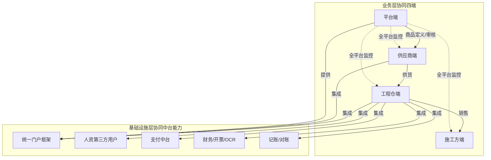
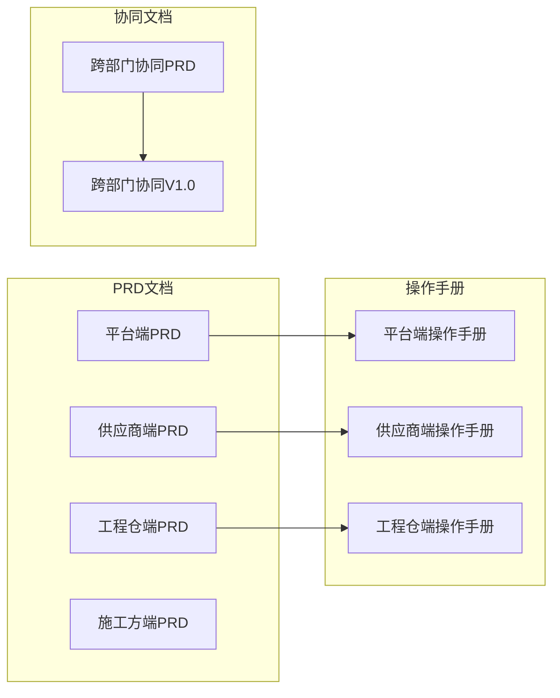

# 文档目录架构与口径说明

<cite>
**本文档引用的文件**
- [产品文档目录架构与口径说明.md](file://脚手架PRD专业模版/00_文档体系架构/01-文档目录架构与口径说明.md)
- [PRD版本期数管理规范.md](file://脚手架PRD专业模版/00_文档体系架构/02-PRD版本期数管理规范.md)
- [文档目录架构与口径说明.md](file://apps/pc/public/prd-docs/文档目录架构与口径说明.md)
- [更新日志.md](file://apps/pc/public/prd-docs/更新日志.md)
- [系统功能说明书.md](file://apps/pc/public/prd-docs/系统功能说明书.md)
- [跨部门协同PRD.md](file://apps/pc/public/prd-docs/跨部门协同PRD.md)
- [跨部门协同.md](file://apps/pc/public/prd-docs/跨部门协同.md)
- [项目总览.md](file://apps/pc/public/prd-docs/项目总览.md)
- [版本概览.md](file://apps/pc/public/prd-docs/releases/26.4.1-0-1搭建/版本概览.md)
- [目录结构说明.md](file://docs/03_通用资源/03_规范/目录结构说明.md)
- [文档命名规范.md](file://docs/03_通用资源/03_规范/文档命名规范.md)
- [文档版本管理规范.md](file://docs/03_通用资源/03_规范/文档版本管理规范.md)
- [PRD编写标准.md](file://docs/03_通用资源/03_规范/PRD编写标准.md)
- [Markdown编写规范.md](file://docs/03_通用资源/03_规范/Markdown编写规范.md)
- [2025_Q4/prd.md](file://apps/pc/public/prd-docs/archives/2025_Q4/prd.md)
- [2026_Q1/pm-platform.md](file://apps/pc/public/prd-docs/archives/2026_Q1/pm-platform.md)
- [索引.md](file://apps/pc/public/prd-docs/archives/2025_Q4/索引.md)
</cite>

## 更新摘要
**所做更改**
- 更新了文档目录架构，从按端组织改为按学期组织的完整文档体系
- 建立了标准化的版本期数命名规范和版本管理流程
- 新增了历史归档按学期组织的完整体系
- 更新了版本概览文档模板和最佳实践
- 完善了跨部门协同PRD的学期化管理
- 扩展了跨部门协同PRD内容，新增接口契约、联调计划、SLA承诺等协作机制
- 增强了技术架构和接口规范的组织结构

## 目录
1. [简介](#简介)
2. [文档体系总览](#文档体系总览)
3. [核心组件](#核心组件)
4. [架构总览](#架构总览)
5. [详细组件分析](#详细组件分析)
6. [依赖关系分析](#依赖关系分析)
7. [性能考虑](#性能考虑)
8. [故障排查指南](#故障排查指南)
9. [结论](#结论)
10. [附录](#附录)

## 简介
本文档系统性阐述工程仓采供一体化平台的产品文档目录架构与口径标准，帮助读者快速定位所需文档、理解文档层次关系与维护规范，并掌握跨端协同与版本演进路径。文档体系采用"按学期组织，边界清晰"的核心原则，通过统一的版本期数命名规范、状态标识与映射关系，确保跨端协同与版本演进的可追溯性与一致性。

**更新** 从简单的按端组织架构演进为完整的按学期组织的文档体系，建立了标准化的版本管理流程和历史归档机制。跨部门协同PRD内容得到显著扩展，新增了接口契约、联调计划、SLA承诺等协作机制。

## 文档体系总览

### 核心原则：按学期组织，边界清晰

```
PRD文档/                      ← ✨ 核心：按学期组织！
├── 2025_Q4/                 ← 按学期组织的完整文档包
│   ├── 01-系统概览与架构.md
│   ├── 02-业务流程设计.md
│   ├── 03-数据模型与表结构.md
│   └── ... 16个功能模块文档
├── 2026_Q1/                 ← 按学期组织的完整文档包
│   ├── pm-construction.md
│   ├── pm-platform.md
│   ├── pm-supplier.md
│   └── pm-warehouse.md
└── releases/                ← 现行版本期数管理
    └── 26.4.1期 - 0-1搭建
        ├── 版本概览.md
        └── 实际交付文档

顶层目录结构

项目总览/                     ← 全局，不随学期变
├── 项目总览
├── 系统功能说明书
├── 版本迭代记录
├── 跨部门协同PRD             ← 全局架构级的协同总纲
└── 文档目录架构与口径说明     ← 当前文档

PRD文档/                      ← 按"学期"组织，每一学期独立完整
├── 2025_Q4/                  ← 2025年第四季度
│   ├── 01-系统概览与架构.md
│   ├── 02-业务流程设计.md
│   ├── 03-数据模型与表结构.md
│   └── prd.md
├── 2026_Q1/                  ← 2026年第一季度
│   ├── pm-construction.md
│   ├── pm-platform.md
│   ├── pm-supplier.md
│   └── pm-warehouse.md
└── releases/                 ← 现行版本期数管理
    └── 26.4.1期 - 0-1搭建
        ├── 版本概览.md
        └── 实际交付文档

系统操作手册/                  ← 面向最终用户的操作指南
├── 平台端操作手册
├── 供应商端操作手册
├── 施工方端操作手册
└── 供应商端操作手册（示例）

历史归档/                     ← 旧版学期文档归档
├── 2025_Q4/
│   ├── 01-系统概览与架构.md
│   ├── 02-业务流程设计.md
│   └── ... 16个功能模块文档
├── 2026_Q1/PM纯净版备份/
│   ├── 供应商端/
│   ├── 工程仓端/
│   ├── 平台端/
│   └── 施工方端/
└── 旧资料/
    ├── 供应商端_产品PRD_最终版.md
    └── ... 其他历史资料
```

### 层次说明

| 层级 | 定位 | 维护频率 | 核心受众 |
|:----|:-----|:--------|:--------|
| **项目总览** | 全局定稿文档 | 低频（架构变更时更新） | 全员 |
| **PRD文档** | 按学期组织 | 每个季度新增一个学期文档包 | 产品/开发/测试 |
| **系统操作手册** | 最终用户操作指南 | 功能上线后补充 | 最终用户 |
| **历史归档** | 过期的学期文档移入 | 学期结束后移入 | 回溯查阅 |

**更新** 从按版本期数组织转变为按学期组织，建立了完整的学期文档管理体系。

## 核心组件
- **项目总览**：提供项目级顶层入口，面向全员，内容相对稳定，仅在架构重大变更时更新。
- **PRD文档**：按学期独立组织的完整交付包，每个学期包含四端完整PRD文档，覆盖交互逻辑、业务规则、字段说明、状态治理。
- **系统操作手册**：面向最终用户的图文操作指南，与PRD互补。
- **历史归档**：按学期组织的只读区域，保留旧版本文档供回溯查阅。

**更新** 新增了按学期组织的完整PRD文档体系，建立了学期文档包的标准格式和管理流程。

## 架构总览
文档体系采用"四端协同 + 多中台集成"的复杂系统设计，跨部门协同分为业务层协同与基础设施层协同两个层面，定义各方职责边界与提供物清单。



**图表来源**
- [跨部门协同PRD.md: 74-96:74-96](file://apps/pc/public/prd-docs/跨部门协同PRD.md#L74-L96)

## 详细组件分析

### 项目总览组件
- **定位与受众**：项目级定稿文档，面向全员，低频更新。
- **核心内容**：系统总览、架构说明、系统协同、平台端/供应商端/工程仓端/施工方端功能说明、跨系统协同、核心概念与术语速查、相关文档入口。
- **价值**：提供"先看概览、再读细节"的导航能力，帮助读者快速把握项目全貌。

**章节来源**
- [项目总览.md: 1-381:1-381](file://apps/pc/public/prd-docs/项目总览.md#L1-L381)

### PRD文档组件
- **组织方式**：按学期独立组织，每个学期包含四端完整PRD文档。
- **学期命名规范**：YYYY_QN（YYYY=年份，QN=季度，N=季度序号）。
- **学期文档包结构**：
  - 2025_Q4：包含16个功能模块的详细设计文档
  - 2026_Q1：包含PM纯净版的四端PRD文档
  - releases：现行版本期数管理，采用YY.M.N命名规范

**更新** 新增了按学期组织的完整文档包结构，建立了学期文档的标准格式和管理流程。

**章节来源**
- [产品文档目录架构与口径说明.md: 84-127:84-127](file://脚手架PRD专业模版/00_文档体系架构/01-文档目录架构与口径说明.md#L84-L127)

### 学期文档管理规范
- **命名规范**：YYYY_QN（如2025_Q4表示2025年第四季度）
- **目录结构**：每个学期独立成目录，包含该季度的所有PRD文档
- **添加流程**：创建学期目录→编写学期概览→更新数据配置→复用或新增文档
- **学期概览模板**：包含学期信息、核心范围、四端影响范围、下学期路标

**更新** 建立了完整的学期文档管理体系，包括命名规范、目录结构和管理流程。

**章节来源**
- [PRD版本期数管理规范.md: 9-129:9-129](file://脚手架PRD专业模版/00_文档体系架构/02-PRD版本期数管理规范.md#L9-L129)

### 学期概览示例
- **2025_Q4**：完成采供一体化平台早期详细设计，包含16个功能模块
- **2026_Q1**：PM纯净版备份，四端PRD的完整版本备份
- **26.4.1期 - 0-1搭建**：现行版本期数管理，完成采供一体化SaaS平台从0到1搭建

**更新** 新增了按学期组织的文档概览示例，展示了不同学期文档包的内容特点。

**章节来源**
- [2025_Q4/prd.md: 1-69:1-69](file://apps/pc/public/prd-docs/archives/2025_Q4/prd.md#L1-L69)
- [2026_Q1/pm-platform.md: 1-326:1-326](file://apps/pc/public/prd-docs/archives/2026_Q1/pm-platform.md#L1-L326)

### 系统功能说明书
- **系统总览**：四端定位与一句话描述
- **架构说明**：整体架构与设计理念（三状态分离、商品两段定义、商户数据隔离、RBAC权限模型）
- **系统协同**：商品链路、采购链路、销售链路、售后链路
- **各端功能说明**：平台端、供应商端、工程仓端、施工方端的功能清单

**章节来源**
- [系统功能说明书.md: 1-263:1-263](file://apps/pc/public/prd-docs/系统功能说明书.md#L1-L263)

### 跨部门协同PRD
- **项目协同全景总览**：业务层协同（四端）与基础设施层协同（中台能力）
- **跨部门干系人与提供物清单**：业务层职责矩阵、基础设施层提供物清单、接口对接依赖
- **工程仓端跨部门集成架构**：统一集成层与外部系统/部门的对接关系
- **各部门提供内容详解**：统一门户权限、第三方用户管理、虚拟账户、开票/OCR、记账/对账、对账能力
- **协同风险与依赖**、**协同沟通机制**、**术语表**
- **接口契约**：新增的接口定义模板和总览表
- **联调计划**：详细的联调排期和测试用例
- **SLA承诺**：各系统的服务等级承诺和降级策略

**更新** 跨部门协同PRD内容得到显著扩展，新增了接口契约、联调计划、SLA承诺等协作机制，形成了完整的跨部门协作体系。

**章节来源**
- [跨部门协同PRD.md: 1-597:1-597](file://apps/pc/public/prd-docs/跨部门协同PRD.md#L1-L597)

### 历史归档组件
- **2025_Q4 旧版详细设计**：包含早期版本的系统概览与架构、四端功能矩阵、核心业务流程、数据实体关系等。
- **2026_Q1 PM纯净版备份**：四端PRD的完整版本备份，便于回溯与对比。
- **旧资料归档**：CSV功能清单、旧PRD、项目排期等。

**更新** 历史归档按学期组织，建立了完整的学期文档归档体系。

**章节来源**
- [索引.md: 38-42:38-42](file://apps/pc/public/prd-docs/archives/2025_Q4/索引.md#L38-L42)

### 跨部门协同V1.0
- **工程仓端V1.0**：针对工程仓端当前版本的跨部门协同能力清单
- **协同背景**：工程仓端作为采供协同平台的核心枢纽
- **干系人清单**：统一门户权限、人资第三方用户、支付中台、平台开票&OCR、鸣鸣很忙记账、财务对账
- **协同能力详述**：六大板块的详细说明和对接要点
- **排期时间线**：甘特图展示各能力的交付进度
- **协同风险与依赖**：风险评估和应对措施

**更新** 新增了工程仓端V1.0的跨部门协同文档，为特定端的协同提供了详细指导。

**章节来源**
- [跨部门协同.md: 1-221:1-221](file://apps/pc/public/prd-docs/跨部门协同.md#L1-L221)

## 依赖关系分析
- **PRD与操作手册映射**：各端PRD功能设计与对应操作手册形成一一对应关系，确保"要做什么"与"怎么操作"互补。
- **PRD与跨部门协同映射**：跨部门协同能力与涉及的PRD端形成映射，便于理解系统集成边界与依赖关系。
- **学期文档间的依赖**：不同学期的文档之间存在依赖关系，需要通过历史归档进行追溯。
- **跨部门协同PRD与工程仓端V1.0**：总体架构PRD与具体端的协同文档形成上下级关系。



**图表来源**
- [产品文档目录架构与口径说明.md: 157-164:157-164](file://脚手架PRD专业模版/00_文档体系架构/01-文档目录架构与口径说明.md#L157-L164)

## 性能考虑
- **文档检索效率**：通过统一的学期命名规范和目录结构，减少跨学期查找成本，提升定位效率。
- **版本演进成本**：PRD更新日志集中记录跨系统、跨PRD文件的版本变更，降低跨学期对齐成本。
- **文档一致性**：通过PRD编写标准与Markdown编写规范，确保各学期PRD在字段级细化、全链路流程图、权限矩阵等方面保持一致。
- **历史文档管理**：按学期组织的历史文档便于版本对比和回溯分析。
- **跨部门协同效率**：通过标准化的接口契约和联调计划，降低跨部门协作的技术成本。

**更新** 新增了跨部门协同效率的性能考虑，包括接口契约标准化和联调计划优化。

## 故障排查指南
- **文档定位问题**：按照"项目总览 → 对应学期 → 学期概览 → 对应端PRD → 具体功能设计"的路径查找，避免遗漏关键信息。
- **跨学期协同问题**：参考跨部门协同PRD，明确各学期职责边界与接口依赖，识别潜在风险点。
- **历史版本回溯**：在历史归档中查找旧版本PRD与变更记录，辅助问题定位与回归分析。
- **学期文档对比**：通过历史归档对比不同学期的文档差异，理解系统演进过程。
- **跨部门接口问题**：参考跨部门协同PRD中的接口契约和联调计划，快速定位接口依赖问题。

**更新** 新增了跨部门协同故障排查指南，包括接口问题定位和联调计划应用。

**章节来源**
- [产品文档目录架构与口径说明.md: 127-136:127-136](file://脚手架PRD专业模版/00_文档体系架构/01-文档目录架构与口径说明.md#L127-L136)

## 结论
本文件建立了工程仓采供一体化平台的文档目录架构与口径标准，明确了各层级文档的定位、维护频率与核心受众，提供了跨学期协同与版本演进的可视化路径。通过统一的学期命名规范、状态标识与映射关系，确保文档体系在长期演进中保持可追溯性与一致性，为研发与产品协作提供坚实基础。

**更新** 从简单的按端组织架构演进为完整的按学期组织体系，建立了标准化的文档管理流程和历史归档机制。跨部门协同PRD内容的扩展进一步完善了协作机制、技术架构和接口规范的组织结构。

## 附录

### 文档状态标识
- ✅ 已有文档：已完成初稿，内容稳定
- ⚠️ 待完善：存在已知内容缺口
- 📦 历史归档：旧版本参考，不在当前迭代范围

**章节来源**
- [产品文档目录架构与口径说明.md: 145-152:145-152](file://脚手架PRD专业模版/00_文档体系架构/01-文档目录架构与口径说明.md#L145-L152)

### 学期命名规范
- **命名公式**：YYYY_QN
- **年份**：2025 = 2025年
- **季度**：Q4 = 第四季度
- **示例**：`2025_Q4` = 2025年第四季度文档包

**更新** 新增了按学期组织的命名规范，与版本期数命名规范形成互补。

**章节来源**
- [PRD版本期数管理规范.md: 9-31:9-31](file://脚手架PRD专业模版/00_文档体系架构/02-PRD版本期数管理规范.md#L9-L31)

### 目录结构说明
- **按文档类型分类**：顶层目录按文档用途分（项目总览 / PRD / 操作手册 / 资源 / 归档）
- **按学期组织**：PRD文档按学期独立组织，每个学期包含四端完整PRD
- **编号导向**：NN_前缀保证目录排列有序

**更新** 新增了按学期组织的目录结构说明，建立了完整的文档分类体系。

**章节来源**
- [目录结构说明.md: 1-18:1-18](file://docs/03_通用资源/03_规范/目录结构说明.md#L1-L18)

### 文档命名规范
- **目录命名**：`NN_中文名称/` — 使用**下划线**连接编号和中文名
- **文件命名**：`NN-中文名称.md` — 使用**短横线**连接编号和中文名
- **图片命名**：`模块_页面_序号.png` — 下划线分隔，全小写英文
- **版本后缀**：`v1.0`、`v1.1`、`v2.0` — 语义化版本号

**更新** 完善了文档命名规范，包括目录命名、文件命名、图片命名和版本后缀。

**章节来源**
- [文档命名规范.md: 1-23:1-23](file://docs/03_通用资源/03_规范/文档命名规范.md#L1-L23)

### 文档版本管理规范
- **版本号规则**：主版本（v1→v2）、次版本（v0→v1）、修订号（.0→.1）
- **PRD文档版本管理**：以**端**为单位管理版本（各端独立迭代）
- **更新日志记录**：统一在 `01_PRD/更新日志.md` 中记录

**更新** 新增了文档版本管理规范，建立了统一的版本管理标准。

**章节来源**
- [文档版本管理规范.md: 1-16:1-16](file://docs/03_通用资源/03_规范/文档版本管理规范.md#L1-L16)

### PRD编写标准
- **核心目标**：零沟通成本开发
- **三大黄金标准**：字段级细化、全链路流程图、权限矩阵
- **列表页PRD七件套与表单页PRD五件套**
- **字段级定义6维度标准模板与常用组件类型清单**
- **权限矩阵标准模板与无权限处理原则**
- **用户交互标准**：加载状态、成功反馈、失败反馈、二次确认场景
- **验收标准**：研发看到后的三种反应与不合格PRD的典型问题

**章节来源**
- [PRD编写标准.md: 1-201:1-201](file://docs/03_通用资源/03_规范/PRD编写标准.md#L1-L201)

### Markdown编写规范
- **标题层级**：#、##、###、####（最多四级）
- **表格**：表头行说明与对齐标记
- **代码块**：指定语言（md、ts、bash等）
- **链接**：同目录与跨目录文件链接
- **图片**：相对路径与描述性Alt文本

**章节来源**
- [Markdown编写规范.md: 1-30:1-30](file://docs/03_通用资源/03_规范/Markdown编写规范.md#L1-L30)

### PRD更新日志
- **全局视角**：一次版本更新涉及哪些PRD
- **文件视角**：该文件自身的变更记录
- **v3.0**：供应商端商品中心新增运营专员角色
- **v2.0**：11章模板重构（全面重构为11章新模板）
- **v1.0**：初始创建（四端全部功能模块PRD文档）

**章节来源**
- [更新日志.md: 1-125:1-125](file://apps/pc/public/prd-docs/更新日志.md#L1-L125)

### 历史归档示例
- **2025_Q4**：早期版本的系统概览与架构、四端功能矩阵、核心业务流程、数据实体关系等
- **2026_Q1 PM纯净版备份**：四端PRD的完整版本备份
- **2025_Q4 PRD查看器初始化标注**：角色为资深产品经理与前端工程专家，实现页面与需求的模块化解耦

**更新** 新增了按学期组织的历史归档示例，展示了不同学期文档包的特点。

**章节来源**
- [2025_Q4/prd.md: 1-69:1-69](file://apps/pc/public/prd-docs/archives/2025_Q4/prd.md#L1-L69)
- [2026_Q1/pm-platform.md: 1-326:1-326](file://apps/pc/public/prd-docs/archives/2026_Q1/pm-platform.md#L1-L326)

### 学期概览文档模板
- **学期信息**：学期号、核心目标、包含端、PRD数量
- **本期核心范围**：功能变更对比表
- **本期PRD文档清单**：按端分类的文档清单
- **下学期路标**：未来学期计划

**更新** 新增了按学期组织的概览文档模板，与版本期数概览模板形成互补。

**章节来源**
- [PRD版本期数管理规范.md: 84-113:84-113](file://脚手架PRD专业模版/00_文档体系架构/02-PRD版本期数管理规范.md#L84-L113)

### 跨部门协同接口契约模板
- **接口总览表**：按对接人和系统分组的接口清单
- **接口详细定义**：请求/响应示例、错误码说明、SLA承诺
- **填写原则**：字段类型一致性、错误码明确性、可执行性

**更新** 新增了跨部门协同接口契约模板，为接口标准化提供指导。

**章节来源**
- [跨部门协同PRD.md: 445-494:445-494](file://apps/pc/public/prd-docs/跨部门协同PRD.md#L445-L494)

### 联调计划与SLA承诺
- **联调排期**：按阶段划分的联调时间安排
- **测试用例**：典型场景的测试用例清单
- **SLA承诺**：各系统的可用性、响应时间、数据一致性承诺
- **问题升级机制**：P0-P2等级的问题处理流程

**更新** 新增了联调计划和SLA承诺章节，完善了跨部门协作的技术保障体系。

**章节来源**
- [跨部门协同PRD.md: 497-543:497-543](file://apps/pc/public/prd-docs/跨部门协同PRD.md#L497-L543)

### 阅读指南（按学期查找文档）
- **快速了解整个项目全貌**：项目总览 → 项目总览.md
- **查看全端功能总清单**：项目总览 → 系统功能说明书.md
- **了解项目级跨系统协同架构**：项目总览 → 跨部门协同PRD.md
- **看某学期具体交付内容**：PRD文档 → 对应学期 → 学期概览
- **学习怎么操作某个功能**：系统操作手册 → 对应端手册
- **查找历史版本资料**：历史归档
- **了解工程仓端协同**：跨部门协同V1.0

**更新** 新增了按学期组织的阅读指南，包括学期文档的查找方法和工程仓端协同文档的定位。

**章节来源**
- [产品文档目录架构与口径说明.md: 165-176:165-176](file://脚手架PRD专业模版/00_文档体系架构/01-文档目录架构与口径说明.md#L165-L176)