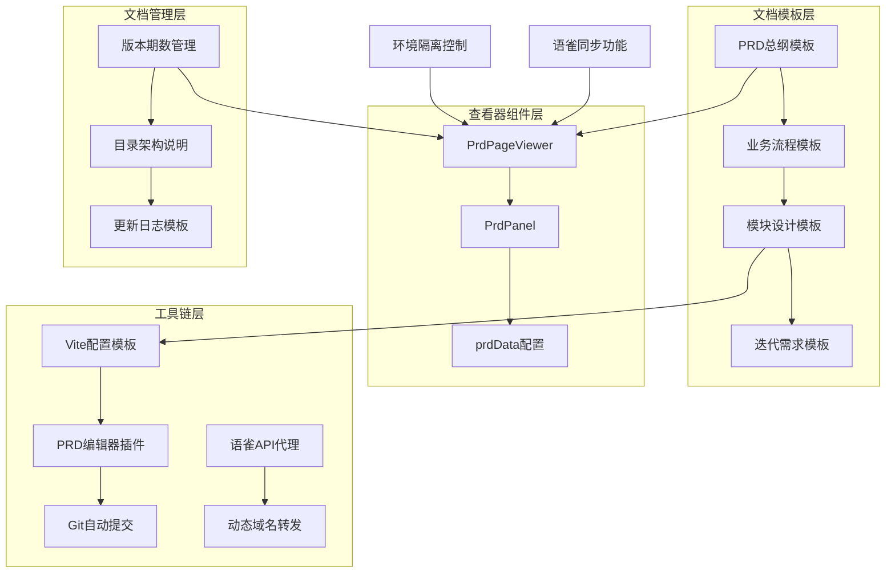
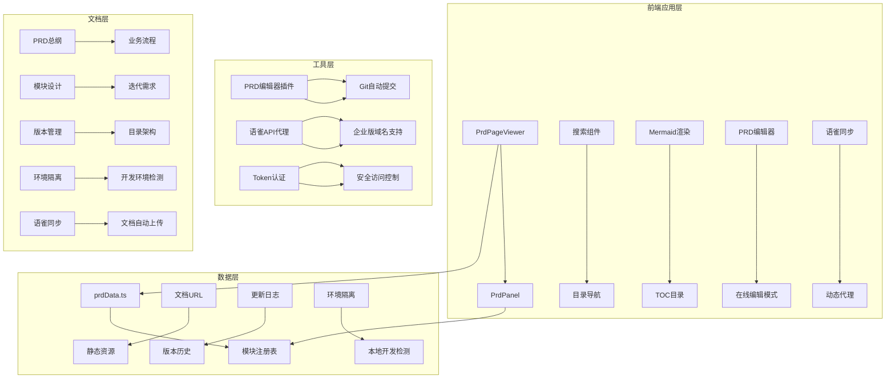
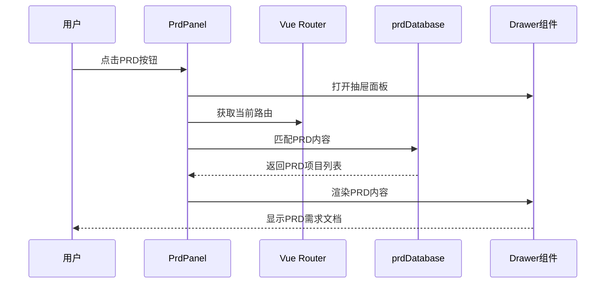
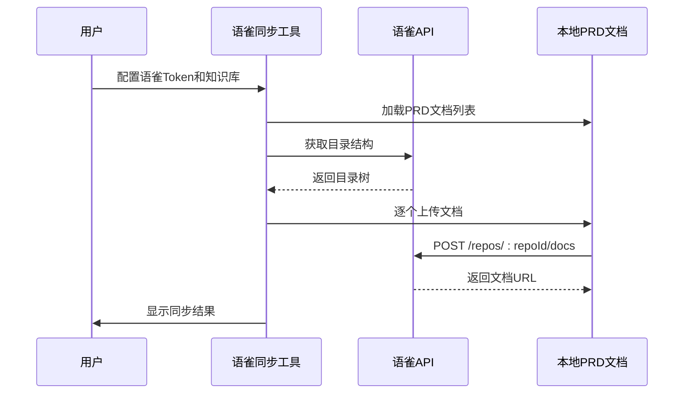
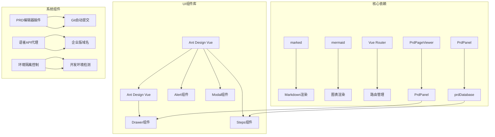

# PRD模板系统

<cite>
**本文档引用的文件**
- [prd.md](file://apps/pc/public/prd-docs/prd.md)
- [01-系统概览与架构.md](file://apps/pc/public/prd-docs/01-系统概览与架构.md)
- [02-业务流程设计.md](file://apps/pc/public/prd-docs/02-业务流程设计.md)
- [04-领域模型设计.md](file://apps/pc/public/prd-docs/04-领域模型设计.md)
- [05-工作台与商户中心功能设计.md](file://apps/pc/public/prd-docs/05-工作台与商户中心功能设计.md)
- [06-商品市场功能设计.md](file://apps/pc/public/prd-docs/06-商品市场功能设计.md)
- [07-采购计划功能设计.md](file://apps/pc/public/prd-docs/07-采购计划功能设计.md)
- [08-商品中心功能设计.md](file://apps/pc/public/prd-docs/08-商品中心功能设计.md)
- [09-采购订单管理功能设计.md](file://apps/pc/public/prd-docs/09-采购订单管理功能设计.md)
- [10-销售订单管理功能设计.md](file://apps/pc/public/prd-docs/10-销售订单管理功能设计.md)
- [11-仓库管理功能设计.md](file://apps/pc/public/prd-docs/11-仓库管理功能设计.md)
- [12-财务中心功能设计.md](file://apps/pc/public/prd-docs/12-财务中心功能设计.md)
- [13-系统设置功能设计.md](file://apps/pc/public/prd-docs/13-系统设置功能设计.md)
- [14-页面导航设计.md](file://apps/pc/public/prd-docs/14-页面导航设计.md)
- [PrdPanel.vue](file://脚手架PRD专业模版/05_PRD查看器组件/PrdPanel.vue)
- [PrdPageViewer.vue](file://脚手架PRD专业模版/05_PRD查看器组件/PrdPageViewer.vue)
- [prdData.ts](file://脚手架PRD专业模版/05_PRD查看器组件/prdData.ts)
- [03-Vite配置集成模板.ts](file://脚手架PRD专业模版/03_配套工具链/03-Vite配置集成模板.ts)
- [01-文档目录架构与口径说明.md](file://脚手架PRD专业模版/00_文档体系架构/01-文档目录架构与口径说明.md)
- [02-PRD版本期数管理规范.md](file://脚手架PRD专业模版/00_文档体系架构/02-PRD版本期数管理规范.md)
- [00-PRD总纲模板.md](file://脚手架PRD专业模版/01_PRD编写模板/00-PRD总纲模板.md)
- [02-业务流程设计.md](file://脚手架PRD专业模版/01_PRD编写模板/02-业务流程设计.md)
- [05-系统模块详细设计-PM纯净版.md](file://脚手架PRD专业模版/01_PRD编写模板/05-系统模块详细设计-PM纯净版.md)
- [06-二期迭代需求模板.md](file://脚手架PRD专业模版/01_PRD编写模板/06-二期迭代需求模板.md)
- [更新日志模板.md](file://脚手架PRD专业模版/03_辅助模板/更新日志模板.md)
- [vite.config.ts](file://apps/pc/vite.config.ts)
- [index.vue](file://apps/pc/src/views/warehouse/prd/index.vue)
</cite>

## 更新摘要
**变更内容**
- 新增PRD编辑器环境隔离功能，仅在本地开发环境启用
- 增强PRD编辑器功能，支持在线编辑保存和Git自动提交
- 新增语雀同步功能，支持PRD文档自动同步到语雀知识库
- 增强Vite配置工具链，提供自定义中间件插件和跨域代理
- 新增语雀API动态转发中间件，支持企业版域名和Token认证

## 目录
1. [简介](#简介)
2. [项目结构](#项目结构)
3. [核心组件](#核心组件)
4. [架构总览](#架构总览)
5. [详细组件分析](#详细组件分析)
6. [依赖分析](#依赖分析)
7. [性能考虑](#性能考虑)
8. [故障排除指南](#故障排除指南)
9. [结论](#结论)
10. [附录](#附录)

## 简介
本PRD模板系统是一套完整的工程仓端产品需求文档体系，包含标准化的PRD模板、可视化查看器组件、版本期数管理体系以及配套工具链。系统采用SKILL格式PRD，提供从项目总览到模块详细设计的完整文档框架，并内置PRD查看器组件，支持多端文档浏览、全文搜索、Mermaid图表渲染等功能。

**更新** 系统现已增强PRD编辑器功能，支持环境隔离、语雀同步和在线编辑保存接口，同时提供更强大的Vite配置工具链支持。

## 项目结构
PRD模板系统采用分层架构设计，主要包含以下层次：



**图表来源**
- [01-文档目录架构与口径说明.md:1-176](file://脚手架PRD专业模版/00_文档体系架构/01-文档目录架构与口径说明.md#L1-L176)
- [02-PRD版本期数管理规范.md:1-129](file://脚手架PRD专业模版/00_文档体系架构/02-PRD版本期数管理规范.md#L1-L129)
- [vite.config.ts:8-85](file://apps/pc/vite.config.ts#L8-L85)

**章节来源**
- [01-文档目录架构与口径说明.md:1-176](file://脚手架PRD专业模版/00_文档体系架构/01-文档目录架构与口径说明.md#L1-L176)
- [02-PRD版本期数管理规范.md:1-129](file://脚手架PRD专业模版/00_文档体系架构/02-PRD版本期数管理规范.md#L1-L129)

## 核心组件
系统包含四大核心组件，每个组件都有明确的职责和功能边界：

### 1. PRD模板体系
- **PRD总纲模板**：提供7大核心部分的标准框架
- **业务流程模板**：跨模块业务流程设计
- **模块设计模板**：PM纯净版功能详细设计
- **迭代需求模板**：二期迭代需求文档

### 2. PRD查看器组件
- **PrdPageViewer**：全功能PRD查看器，支持多端切换、全文搜索、Mermaid渲染
- **PrdPanel**：页面级PRD浮窗查看器，集成到应用布局中
- **prdData配置**：模块注册表，管理文档索引和元数据

### 3. 版本期数管理体系
- **目录架构**：按期数组织文档的完整结构
- **命名规范**：YY.M.N-关键词的标准化命名
- **版本概览**：每期需求的全景总览文档

### 4. 配套工具链
- **Vite配置模板**：提供在线编辑保存接口和语雀API跨域代理
- **PRD编辑器插件**：自动保存Markdown并提交Git
- **跨域代理**：解决本地开发中的跨域问题
- **语雀API代理**：支持企业版域名和Token认证的动态转发

**更新** 新增环境隔离控制，确保PRD编辑器功能仅在本地开发环境启用，避免生产环境风险。

**章节来源**
- [00-PRD总纲模板.md:1-220](file://脚手架PRD专业模版/01_PRD编写模板/00-PRD总纲模板.md#L1-L220)
- [PrdPageViewer.vue:1-515](file://脚手架PRD专业模版/05_PRD查看器组件/PrdPageViewer.vue#L1-L515)
- [PrdPanel.vue:1-185](file://脚手架PRD专业模版/05_PRD查看器组件/PrdPanel.vue#L1-L185)
- [vite.config.ts:1-122](file://apps/pc/vite.config.ts#L1-L122)

## 架构总览
系统采用前后端分离架构，前端使用Vue3 + TypeScript构建，后端提供API接口支持：



**图表来源**
- [PrdPageViewer.vue:129-415](file://脚手架PRD专业模版/05_PRD查看器组件/PrdPageViewer.vue#L129-L415)
- [prdData.ts:1-152](file://脚手架PRD专业模版/05_PRD查看器组件/prdData.ts#L1-L152)
- [vite.config.ts:8-85](file://apps/pc/vite.config.ts#L8-L85)
- [index.vue:387-405](file://apps/pc/src/views/warehouse/prd/index.vue#L387-L405)

## 详细组件分析

### PrdPageViewer组件分析
PrdPageViewer是系统的核心组件，提供完整的PRD文档浏览体验：

```mermaid
classDiagram
class PrdPageViewer {
+activeModule : PrdModule
+currentSource : PrdSource
+loading : boolean
+renderedHtml : string
+searchQuery : string
+tocItems : TocItem[]
+mermaidRenderCounter : number
+loadAndRenderModule(mod)
+buildToc()
+performSearch(kw)
+selectModule(mod)
+renderMermaidInModal()
}
class PrdModule {
+id : string
+name : string
+docFile : string
+docUrl : string
+icon : string
+priority : string
+description : string
}
class TocItem {
+id : string
+text : string
+level : number
}
PrdPageViewer --> PrdModule : "管理"
PrdPageViewer --> TocItem : "生成目录"
PrdPageViewer --> "marked" : "渲染Markdown"
PrdPageViewer --> "mermaid" : "渲染图表"
```

**图表来源**
- [PrdPageViewer.vue:129-415](file://脚手架PRD专业模版/05_PRD查看器组件/PrdPageViewer.vue#L129-L415)
- [prdData.ts:17-25](file://脚手架PRD专业模版/05_PRD查看器组件/prdData.ts#L17-L25)

#### 核心功能特性
1. **多端文档切换**：支持端A、端B、项目视角三种文档源
2. **全文搜索**：支持跨模块文档内容搜索，高亮显示匹配结果
3. **Mermaid图表渲染**：自动识别和渲染流程图、状态图等图表
4. **目录导航**：自动生成文档目录，支持滚动定位
5. **更新日志查看**：集成PRD更新日志功能

**更新** 新增PRD编辑器功能，支持在线编辑模式，提供实时保存和Git自动提交功能。

**章节来源**
- [PrdPageViewer.vue:1-515](file://脚手架PRD专业模版/05_PRD查看器组件/PrdPageViewer.vue#L1-L515)
- [prdData.ts:1-152](file://脚手架PRD专业模版/05_PRD查看器组件/prdData.ts#L1-L152)

### PrdPanel组件分析
PrdPanel提供页面级PRD查看功能，集成到应用布局中：



**图表来源**
- [PrdPanel.vue:48-139](file://脚手架PRD专业模版/05_PRD查看器组件/PrdPanel.vue#L48-L139)

#### 设计特点
1. **全局浮窗按钮**：固定定位的PRD查看入口
2. **路由自动匹配**：根据当前页面自动匹配对应的PRD内容
3. **结构化数据**：使用prddatabase对象存储PRD内容
4. **步骤化展示**：使用Ant Design Steps组件展示PRD需求

**章节来源**
- [PrdPanel.vue:1-185](file://脚手架PRD专业模版/05_PRD查看器组件/PrdPanel.vue#L1-L185)

### Vite配置工具链分析
系统提供完整的开发工具链支持：

```mermaid
flowchart TD
A[Vite开发服务器] --> B[PRD编辑器插件]
A --> C[语雀API代理]
B --> D[POST /api/save-prd-doc]
C --> E[/api/yuque 动态转发]
D --> F[文件写入]
D --> G[Git自动提交]
F --> H[本地开发用]
G --> I[生产环境禁用]
E --> J[企业版域名支持]
E --> K[Token认证]
```

**图表来源**
- [vite.config.ts:8-85](file://apps/pc/vite.config.ts#L8-L85)
- [03-Vite配置集成模板.ts:16-61](file://脚手架PRD专业模版/03_配套工具链/03-Vite配置集成模板.ts#L16-L61)

#### 功能特性
1. **在线编辑保存**：提供PRD文档在线编辑和保存接口
2. **Git自动提交**：保存后自动提交到Git仓库
3. **语雀API代理**：解决跨域问题，支持语雀文档集成
4. **本地开发友好**：仅在本地开发环境启用Git提交功能
5. **动态域名支持**：支持语雀企业版域名的动态转发
6. **Token认证**：提供语雀API的安全访问控制

**更新** 新增语雀API动态转发中间件，支持任意企业版域名和Token认证，提供更灵活的语雀集成方案。

**章节来源**
- [vite.config.ts:1-122](file://apps/pc/vite.config.ts#L1-L122)
- [03-Vite配置集成模板.ts:1-91](file://脚手架PRD专业模版/03_配套工具链/03-Vite配置集成模板.ts#L1-L91)

### 语雀同步功能分析
系统提供完整的PRD文档语雀同步功能：



**图表来源**
- [index.vue:653-753](file://apps/pc/src/views/warehouse/prd/index.vue#L653-L753)

#### 功能特性
1. **环境隔离**：仅在本地开发环境显示语雀同步功能
2. **Token管理**：支持语雀个人访问令牌的配置和持久化
3. **目录同步**：支持按PRD目录结构同步到语雀知识库
4. **批量同步**：支持同步当前文档或全部PRD文档
5. **进度监控**：提供同步进度和结果的实时反馈
6. **错误处理**：完善的错误捕获和用户提示机制

**章节来源**
- [index.vue:368-753](file://apps/pc/src/views/warehouse/prd/index.vue#L368-L753)

## 依赖分析
系统采用模块化设计，各组件之间存在清晰的依赖关系：



**图表来源**
- [PrdPageViewer.vue:132-135](file://脚手架PRD专业模版/05_PRD查看器组件/PrdPageViewer.vue#L132-L135)
- [PrdPanel.vue:49-50](file://脚手架PRD专业模版/05_PRD查看器组件/PrdPanel.vue#L49-L50)
- [vite.config.ts:8-85](file://apps/pc/vite.config.ts#L8-L85)

### 组件耦合度分析
- **低耦合设计**：各组件职责明确，相互独立
- **接口清晰**：通过props和events进行组件通信
- **数据流单一**：采用自上而下的数据流设计
- **可扩展性强**：支持新增文档源和模块类型
- **环境隔离**：通过计算属性实现运行时环境检测

**更新** 新增环境隔离控制机制，确保PRD编辑器和语雀同步功能仅在本地开发环境启用。

**章节来源**
- [PrdPageViewer.vue:1-515](file://脚手架PRD专业模版/05_PRD查看器组件/PrdPageViewer.vue#L1-L515)
- [PrdPanel.vue:1-185](file://脚手架PRD专业模版/05_PRD查看器组件/PrdPanel.vue#L1-L185)

## 性能考虑
系统在性能方面采用了多项优化措施：

### 1. 文档加载优化
- **懒加载机制**：仅在需要时加载文档内容
- **缓存策略**：使用searchCache缓存已加载的文档内容
- **分块渲染**：将文档内容分块渲染，避免长时间阻塞

### 2. 搜索性能优化
- **防抖机制**：搜索输入采用300ms防抖延迟
- **异步搜索**：搜索操作异步执行，不阻塞主线程
- **结果排序**：按模块ID排序，确保稳定的搜索结果

### 3. 图表渲染优化
- **Mermaid异步渲染**：图表渲染异步执行，避免阻塞页面
- **渲染计数器**：使用递增的渲染计数器避免ID冲突
- **错误处理**：图表渲染失败时提供降级处理

### 4. 内存管理
- **定时器清理**：组件卸载时清理所有定时器
- **观察者断开**：清理IntersectionObserver监听器
- **事件监听器移除**：组件销毁时移除所有事件监听

### 5. 环境隔离优化
- **运行时检测**：通过计算属性实现高效的环境检测
- **条件渲染**：使用v-if指令避免不必要的DOM节点创建
- **功能禁用**：在生产环境禁用PRD编辑器功能

**更新** 新增环境隔离优化，确保PRD编辑器和语雀同步功能不会影响生产环境性能。

## 故障排除指南

### 常见问题及解决方案

#### 1. 文档无法加载
**症状**：PRD查看器显示"加载文档失败"
**可能原因**：
- 文档URL配置错误
- 网络连接问题
- CORS跨域限制

**解决方案**：
- 检查prdData.ts中的BASE_PATH配置
- 确认文档文件路径正确
- 配置Vite代理解决跨域问题

#### 2. 搜索功能异常
**症状**：搜索框输入无反应或搜索结果不准确
**可能原因**：
- marked渲染器配置问题
- 搜索缓存污染
- 正则表达式匹配错误

**解决方案**：
- 重新初始化marked渲染器
- 清空searchCache缓存
- 检查正则表达式语法

#### 3. Mermaid图表不显示
**症状**：流程图、状态图无法渲染
**可能原因**：
- Mermaid语法错误
- 渲染超时
- DOM元素不存在

**解决方案**：
- 检查Mermaid语法格式
- 增加渲染超时时间
- 确保容器元素存在

#### 4. PRD编辑器无法保存
**症状**：在线编辑后无法保存或Git提交失败
**可能原因**：
- Git配置问题
- 文件权限不足
- 网络连接问题
- 环境隔离限制

**解决方案**：
- 检查Git配置和权限
- 确认文件路径存在
- 验证网络连接状态
- 确认在本地开发环境运行

#### 5. 语雀同步失败
**症状**：PRD文档无法同步到语雀
**可能原因**：
- 语雀Token配置错误
- 知识库ID格式不正确
- 网络连接问题
- 语雀API限制

**解决方案**：
- 检查语雀Token和知识库ID配置
- 验证Token具有doc.write权限
- 确认网络连接正常
- 检查语雀API是否支持目录获取

**更新** 新增环境隔离相关的故障排除指导。

**章节来源**
- [PrdPageViewer.vue:214-370](file://脚手架PRD专业模版/05_PRD查看器组件/PrdPageViewer.vue#L214-L370)
- [vite.config.ts:42-57](file://apps/pc/vite.config.ts#L42-L57)
- [index.vue:578-595](file://apps/pc/src/views/warehouse/prd/index.vue#L578-L595)

## 结论
PRD模板系统是一个功能完整、架构清晰的产品需求文档管理解决方案。系统采用标准化的PRD模板、智能化的查看器组件、完善的版本管理体系和实用的工具链支持，能够有效提升产品文档的质量和开发效率。

**更新** 系统现已增强PRD编辑器功能，提供环境隔离、语雀同步和在线编辑保存接口，同时具备更强大的Vite配置工具链支持。这些增强功能显著提升了系统的实用性、安全性和开发体验。

### 主要优势
1. **标准化程度高**：提供完整的PRD模板体系，确保文档质量一致性
2. **用户体验优秀**：PrdPageViewer提供流畅的文档浏览体验
3. **扩展性强**：模块化设计支持灵活的功能扩展
4. **开发友好**：完善的工具链支持本地开发和协作
5. **安全性保障**：环境隔离机制确保生产环境安全
6. **协作效率高**：语雀同步功能提升团队协作效率

### 应用价值
- 提升产品文档的规范性和可读性
- 加快开发团队对需求的理解速度
- 降低需求变更带来的沟通成本
- 建立完整的需求文档追溯体系
- 提高团队协作和知识共享效率

## 附录

### 1. 文档模板使用指南
系统提供多种PRD模板，适用于不同场景：

#### 1.1 PRD总纲模板
适用于项目级PRD文档，包含7大核心部分的标准框架

#### 1.2 业务流程模板
专注于跨模块业务流程设计，提供Mermaid流程图支持

#### 1.3 模块设计模板
PM纯净版功能详细设计，聚焦业务层定义

#### 1.4 迭代需求模板
二期迭代需求文档，强调变更对比和兼容性

### 2. 集成指南
#### 2.1 PrdPageViewer集成
1. 在路由中注册PrdPageViewer组件
2. 配置prdData.ts中的模块列表
3. 设置BASE_PATH为实际部署路径

#### 2.2 PrdPanel集成
1. 将PrdPanel组件放入应用布局
2. 配置prdDatabase对象
3. 根据路由匹配PRD内容

#### 2.3 Vite工具链集成
1. 复制vite.config.ts到项目根目录
2. 配置代理规则和中间件
3. 启用PRD编辑功能和语雀同步

#### 2.4 环境隔离配置
1. 确保在本地开发环境运行
2. 验证环境检测逻辑
3. 生产环境自动禁用编辑功能

### 3. 最佳实践
- 定期更新PRD文档，保持与开发进度同步
- 使用版本期数管理规范，确保文档可追溯性
- 建立文档审查机制，保证文档质量
- 利用搜索功能提高文档查找效率
- 合理使用语雀同步功能，提升团队协作效率
- 注意环境隔离，确保生产环境安全
- 定期备份PRD文档，防止数据丢失