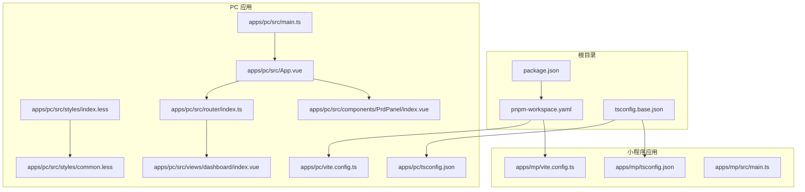
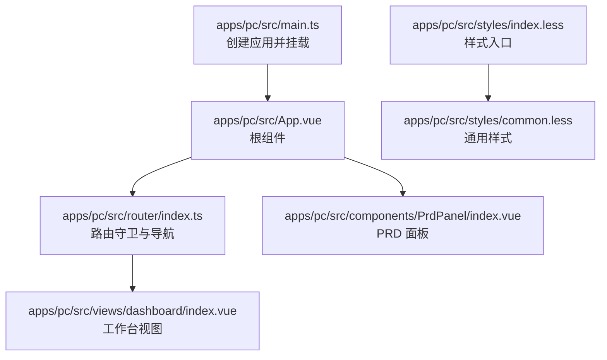
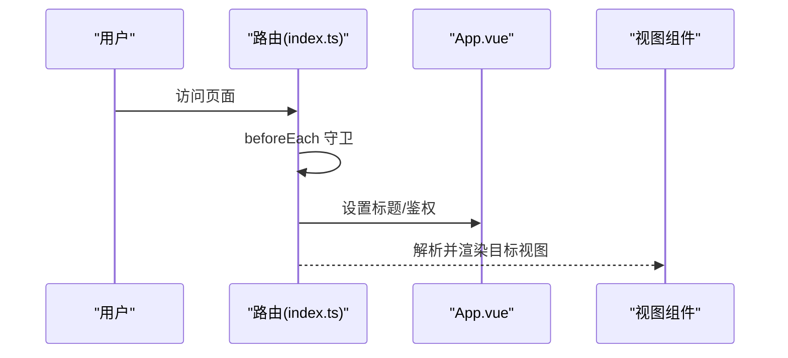
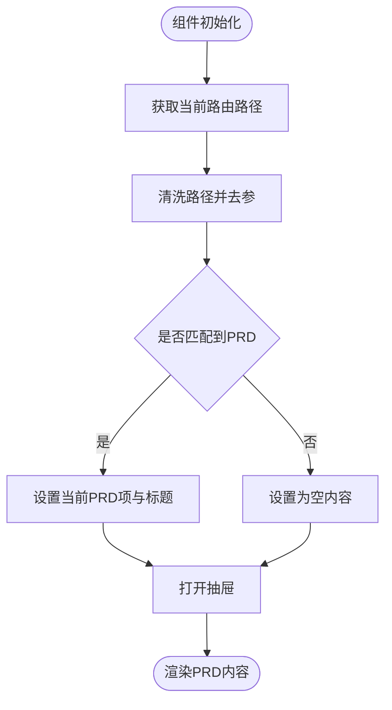
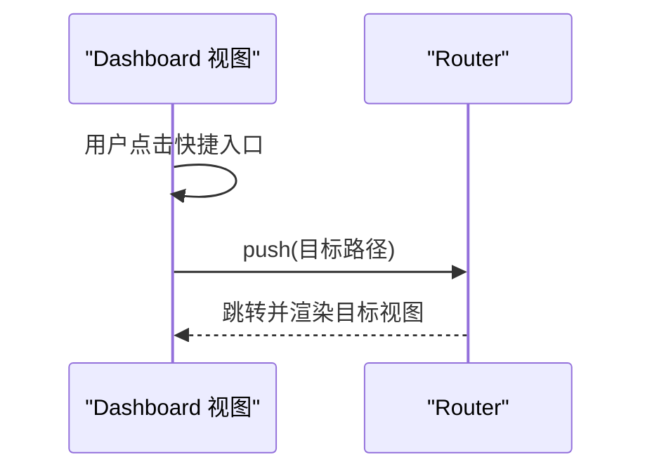
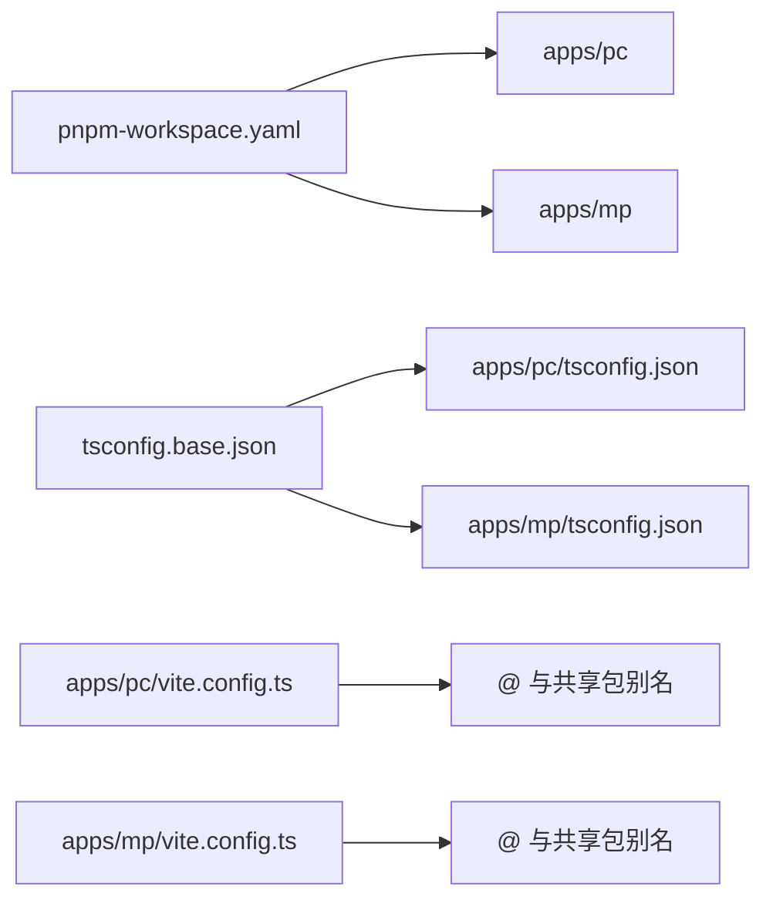

# 代码规范

<cite>
**本文引用的文件**
- [package.json](file://package.json)
- [pnpm-workspace.yaml](file://pnpm-workspace.yaml)
- [tsconfig.base.json](file://tsconfig.base.json)
- [apps/pc/vite.config.ts](file://apps/pc/vite.config.ts)
- [apps/mp/vite.config.ts](file://apps/mp/vite.config.ts)
- [apps/pc/tsconfig.json](file://apps/pc/tsconfig.json)
- [apps/mp/tsconfig.json](file://apps/mp/tsconfig.json)
- [apps/pc/src/main.ts](file://apps/pc/src/main.ts)
- [apps/mp/src/main.ts](file://apps/mp/src/main.ts)
- [apps/pc/src/App.vue](file://apps/pc/src/App.vue)
- [apps/pc/src/styles/index.less](file://apps/pc/src/styles/index.less)
- [apps/pc/src/styles/common.less](file://apps/pc/src/styles/common.less)
- [apps/pc/src/components/PrdPanel/index.vue](file://apps/pc/src/components/PrdPanel/index.vue)
- [apps/pc/src/views/dashboard/index.vue](file://apps/pc/src/views/dashboard/index.vue)
- [apps/pc/src/router/index.ts](file://apps/pc/src/router/index.ts)
</cite>

## 目录
1. [引言](#引言)
2. [项目结构](#项目结构)
3. [核心组件](#核心组件)
4. [架构总览](#架构总览)
5. [详细组件分析](#详细组件分析)
6. [依赖分析](#依赖分析)
7. [性能考虑](#性能考虑)
8. [故障排查指南](#故障排查指南)
9. [结论](#结论)
10. [附录](#附录)

## 引言
本规范面向“工程材料管理平台”的前端与多端开发，覆盖 TypeScript 编码、Vue 组件开发、CSS/Less 样式、文件与目录命名、ESLint/Prettier/Git 钩子等工程化配置与最佳实践。目标是统一团队开发风格、提升可读性与可维护性，并通过工具链保障一致性。

## 项目结构
项目采用 monorepo 结构，根目录通过工作区管理多应用与共享包。PC 端与小程序端分别拥有独立的构建配置、类型配置与入口文件；公共样式与通用组件位于 PC 端源码中。

**图示来源**
- [package.json:1-23](file://package.json#L1-L23)
- [pnpm-workspace.yaml:1-4](file://pnpm-workspace.yaml#L1-L4)
- [tsconfig.base.json:1-29](file://tsconfig.base.json#L1-L29)
- [apps/pc/vite.config.ts:1-32](file://apps/pc/vite.config.ts#L1-L32)
- [apps/mp/vite.config.ts:1-17](file://apps/mp/vite.config.ts#L1-L17)
- [apps/pc/tsconfig.json:1-16](file://apps/pc/tsconfig.json#L1-L16)
- [apps/mp/tsconfig.json:1-16](file://apps/mp/tsconfig.json#L1-L16)
- [apps/pc/src/main.ts:1-19](file://apps/pc/src/main.ts#L1-L19)
- [apps/mp/src/main.ts:1-14](file://apps/mp/src/main.ts#L1-L14)
- [apps/pc/src/App.vue:1-11](file://apps/pc/src/App.vue#L1-L11)
- [apps/pc/src/styles/index.less:1-4](file://apps/pc/src/styles/index.less#L1-L4)
- [apps/pc/src/styles/common.less:1-79](file://apps/pc/src/styles/common.less#L1-L79)
- [apps/pc/src/router/index.ts:1-790](file://apps/pc/src/router/index.ts#L1-L790)
- [apps/pc/src/views/dashboard/index.vue:1-197](file://apps/pc/src/views/dashboard/index.vue#L1-L197)
- [apps/pc/src/components/PrdPanel/index.vue:1-634](file://apps/pc/src/components/PrdPanel/index.vue#L1-L634)

**章节来源**
- [package.json:1-23](file://package.json#L1-L23)
- [pnpm-workspace.yaml:1-4](file://pnpm-workspace.yaml#L1-L4)
- [tsconfig.base.json:1-29](file://tsconfig.base.json#L1-L29)
- [apps/pc/vite.config.ts:1-32](file://apps/pc/vite.config.ts#L1-L32)
- [apps/mp/vite.config.ts:1-17](file://apps/mp/vite.config.ts#L1-L17)
- [apps/pc/tsconfig.json:1-16](file://apps/pc/tsconfig.json#L1-L16)
- [apps/mp/tsconfig.json:1-16](file://apps/mp/tsconfig.json#L1-L16)

## 核心组件
- 应用入口与依赖注入：PC 端在入口集中注册 UI 组件库、状态管理与路由；小程序端采用 SSR 入口并返回 app 与 pinia 实例。
- 路由体系：基于 Vue Router 的多布局路由，包含登录、平台、供应商、工程仓三大布局，覆盖商品、市场、订单、库存、财务、系统设置等模块。
- 样式体系：通过 Less 变量、重置与通用样式组合，形成统一的页面容器、卡片、表格与栅格布局规范。
- 通用组件：PRD 面板组件提供页面级 PRD 文档展示能力，便于开发前阅读与核验。

**章节来源**
- [apps/pc/src/main.ts:1-19](file://apps/pc/src/main.ts#L1-L19)
- [apps/mp/src/main.ts:1-14](file://apps/mp/src/main.ts#L1-L14)
- [apps/pc/src/router/index.ts:1-790](file://apps/pc/src/router/index.ts#L1-L790)
- [apps/pc/src/styles/index.less:1-4](file://apps/pc/src/styles/index.less#L1-L4)
- [apps/pc/src/styles/common.less:1-79](file://apps/pc/src/styles/common.less#L1-L79)
- [apps/pc/src/components/PrdPanel/index.vue:1-634](file://apps/pc/src/components/PrdPanel/index.vue#L1-L634)

## 架构总览
下图展示 PC 端从入口到视图与组件的数据流与依赖关系。

**图示来源**
- [apps/pc/src/main.ts:1-19](file://apps/pc/src/main.ts#L1-L19)
- [apps/pc/src/App.vue:1-11](file://apps/pc/src/App.vue#L1-L11)
- [apps/pc/src/router/index.ts:1-790](file://apps/pc/src/router/index.ts#L1-L790)
- [apps/pc/src/components/PrdPanel/index.vue:1-634](file://apps/pc/src/components/PrdPanel/index.vue#L1-L634)
- [apps/pc/src/views/dashboard/index.vue:1-197](file://apps/pc/src/views/dashboard/index.vue#L1-L197)
- [apps/pc/src/styles/index.less:1-4](file://apps/pc/src/styles/index.less#L1-L4)
- [apps/pc/src/styles/common.less:1-79](file://apps/pc/src/styles/common.less#L1-L79)

## 详细组件分析

### 路由与导航
- 多布局路由：登录、BasicLayout、SupplierLayout、WarehouseLayout，配合嵌套路由组织模块。
- 导航守卫：设置页面标题、鉴权跳转逻辑。
- 路由懒加载：按需导入视图组件，降低首屏体积。

**图示来源**
- [apps/pc/src/router/index.ts:776-787](file://apps/pc/src/router/index.ts#L776-L787)
- [apps/pc/src/App.vue:1-11](file://apps/pc/src/App.vue#L1-L11)

**章节来源**
- [apps/pc/src/router/index.ts:1-790](file://apps/pc/src/router/index.ts#L1-L790)

### PRD 面板组件
- 数据结构：PRD 条目数组，包含需求编号、模块名与内容。
- 匹配逻辑：根据当前路由路径匹配对应 PRD 内容。
- 交互：抽屉式展示，支持空状态与步骤条展示。

**图示来源**
- [apps/pc/src/components/PrdPanel/index.vue:497-527](file://apps/pc/src/components/PrdPanel/index.vue#L497-L527)

**章节来源**
- [apps/pc/src/components/PrdPanel/index.vue:1-634](file://apps/pc/src/components/PrdPanel/index.vue#L1-L634)

### 工作台视图
- 布局：使用栅格系统与卡片组件，展示统计数据、快捷入口、待办事项与最近订单。
- 交互：快捷入口点击跳转至对应页面。

**图示来源**
- [apps/pc/src/views/dashboard/index.vue:117-119](file://apps/pc/src/views/dashboard/index.vue#L117-L119)
- [apps/pc/src/router/index.ts:1-790](file://apps/pc/src/router/index.ts#L1-L790)

**章节来源**
- [apps/pc/src/views/dashboard/index.vue:1-197](file://apps/pc/src/views/dashboard/index.vue#L1-L197)

### 样式与主题
- 样式入口：index.less 引入变量、重置与通用样式。
- 通用类：页面容器、卡片、表格操作区、搜索表单、文本强调与间距类等。
- 组件样式：使用 scoped 与深度选择器，遵循 Less 变量与命名规范。

**章节来源**
- [apps/pc/src/styles/index.less:1-4](file://apps/pc/src/styles/index.less#L1-L4)
- [apps/pc/src/styles/common.less:1-79](file://apps/pc/src/styles/common.less#L1-L79)

## 依赖分析
- monorepo 工作区：通过工作区统一管理 PC 与小程序应用及共享包。
- 构建别名：PC 与小程序均配置 @ 与共享包别名，便于跨包引用。
- 类型配置：共享 base 配置与各应用 tsconfig 扩展，统一编译选项与路径映射。

**图示来源**
- [pnpm-workspace.yaml:1-4](file://pnpm-workspace.yaml#L1-L4)
- [tsconfig.base.json:21-26](file://tsconfig.base.json#L21-L26)
- [apps/pc/tsconfig.json:5-11](file://apps/pc/tsconfig.json#L5-L11)
- [apps/mp/tsconfig.json:5-11](file://apps/mp/tsconfig.json#L5-L11)
- [apps/pc/vite.config.ts:9-15](file://apps/pc/vite.config.ts#L9-L15)
- [apps/mp/vite.config.ts:7-14](file://apps/mp/vite.config.ts#L7-L14)

**章节来源**
- [pnpm-workspace.yaml:1-4](file://pnpm-workspace.yaml#L1-L4)
- [tsconfig.base.json:1-29](file://tsconfig.base.json#L1-L29)
- [apps/pc/tsconfig.json:1-16](file://apps/pc/tsconfig.json#L1-L16)
- [apps/mp/tsconfig.json:1-16](file://apps/mp/tsconfig.json#L1-L16)
- [apps/pc/vite.config.ts:1-32](file://apps/pc/vite.config.ts#L1-L32)
- [apps/mp/vite.config.ts:1-17](file://apps/mp/vite.config.ts#L1-L17)

## 性能考虑
- 路由懒加载：按需导入视图组件，减少初始包体。
- 组件拆分：通用组件（如 PRD 面板）按需展示，避免常驻内存。
- 样式隔离：scoped 与深度选择器合理使用，避免全局污染与重绘。
- 构建优化：启用 sourcemap 便于调试，生产环境可按需关闭。

[本节为通用指导，无需列出具体文件来源]

## 故障排查指南
- 登录与鉴权：若出现反复跳转登录，检查路由守卫中的令牌判断与重定向参数。
- 样式异常：确认样式入口引入顺序与变量定义，避免覆盖冲突。
- 路由标题：若页面标题未更新，检查路由元信息与守卫逻辑。

**章节来源**
- [apps/pc/src/router/index.ts:776-787](file://apps/pc/src/router/index.ts#L776-L787)
- [apps/pc/src/styles/index.less:1-4](file://apps/pc/src/styles/index.less#L1-L4)

## 结论
本规范结合现有工程配置与代码实现，明确了 TS、Vue、Less、目录与文件命名等方面的约束与最佳实践。建议团队在日常开发中严格遵循，配合工具链自动化校验与格式化，持续提升代码质量与协作效率。

[本节为总结性内容，无需列出具体文件来源]

## 附录

### TypeScript 编码规范
- 语言特性
  - 使用严格模式与一致的文件大小写检查。
  - 推荐使用组合式 API（setup）与类型推断。
  - 避免 any，优先使用明确类型或泛型。
- 文件与模块
  - 路径映射与别名统一，避免相对路径过深。
  - 公共类型与工具通过共享包导出，避免重复定义。
- 示例参考
  - [apps/pc/src/router/index.ts:1-790](file://apps/pc/src/router/index.ts#L1-L790)
  - [apps/pc/src/main.ts:1-19](file://apps/pc/src/main.ts#L1-L19)
  - [apps/mp/src/main.ts:1-14](file://apps/mp/src/main.ts#L1-L14)

**章节来源**
- [tsconfig.base.json:10-17](file://tsconfig.base.json#L10-L17)
- [apps/pc/tsconfig.json:5-11](file://apps/pc/tsconfig.json#L5-L11)
- [apps/mp/tsconfig.json:5-12](file://apps/mp/tsconfig.json#L5-L12)

### Vue 组件开发规范
- 组合式 API
  - 使用 setup 语法，明确 props 与 emits 的类型声明。
  - 将副作用逻辑集中在 script setup 中，保持模板简洁。
- 组件组织
  - 通用组件放置于 components 目录，按功能命名。
  - 抽屉、面板等复用组件应具备清晰的可见性控制与数据结构。
- 示例参考
  - [apps/pc/src/components/PrdPanel/index.vue:43-527](file://apps/pc/src/components/PrdPanel/index.vue#L43-L527)
  - [apps/pc/src/views/dashboard/index.vue:83-119](file://apps/pc/src/views/dashboard/index.vue#L83-L119)

**章节来源**
- [apps/pc/src/components/PrdPanel/index.vue:1-634](file://apps/pc/src/components/PrdPanel/index.vue#L1-L634)
- [apps/pc/src/views/dashboard/index.vue:1-197](file://apps/pc/src/views/dashboard/index.vue#L1-L197)

### CSS/Less 样式编写规范
- 结构与层次
  - 样式入口统一引入变量、重置与通用样式。
  - 使用语义化类名，避免过度使用深度选择器。
- 通用样式
  - 页面容器、卡片、表格操作区、搜索表单、文本强调与间距类统一维护。
- 示例参考
  - [apps/pc/src/styles/index.less:1-4](file://apps/pc/src/styles/index.less#L1-L4)
  - [apps/pc/src/styles/common.less:1-79](file://apps/pc/src/styles/common.less#L1-L79)

**章节来源**
- [apps/pc/src/styles/index.less:1-4](file://apps/pc/src/styles/index.less#L1-L4)
- [apps/pc/src/styles/common.less:1-79](file://apps/pc/src/styles/common.less#L1-L79)

### 文件命名约定与目录结构规范
- 目录与文件
  - 视图与组件按功能划分，避免过深层级。
  - 通用组件与布局组件集中管理，便于复用。
- 路由与页面
  - 路由路径与页面职责一一对应，避免歧义。
- 示例参考
  - [apps/pc/src/router/index.ts:1-790](file://apps/pc/src/router/index.ts#L1-L790)

**章节来源**
- [apps/pc/src/router/index.ts:1-790](file://apps/pc/src/router/index.ts#L1-L790)

### 代码格式化规则与注释规范
- 格式化
  - 使用 Prettier 统一格式，结合项目脚本进行批量格式化。
- 注释
  - 函数与复杂逻辑添加必要注释，保持简洁明了。
- 示例参考
  - [package.json:6-12](file://package.json#L6-L12)

**章节来源**
- [package.json:6-12](file://package.json#L6-L12)

### 变量命名约定与函数定义规范
- 命名
  - 变量与函数使用驼峰命名；常量使用大写下划线。
  - 组件与页面使用帕斯卡命名，文件名与组件名保持一致。
- 函数
  - 单一职责，尽量纯函数化；副作用集中在顶层。
- 示例参考
  - [apps/pc/src/components/PrdPanel/index.vue:497-527](file://apps/pc/src/components/PrdPanel/index.vue#L497-L527)

**章节来源**
- [apps/pc/src/components/PrdPanel/index.vue:1-634](file://apps/pc/src/components/PrdPanel/index.vue#L1-L634)

### ESLint、Prettier、Git 钩子配置
- ESLint
  - 在 monorepo 中统一配置规则，确保各应用一致。
- Prettier
  - 与编辑器集成，保存自动格式化；通过脚本批量修复。
- Git 钩子
  - 集成 pre-commit 钩子执行 Lint 与格式化，保证提交质量。
- 示例参考
  - [package.json:6-12](file://package.json#L6-L12)

**章节来源**
- [package.json:6-12](file://package.json#L6-L12)