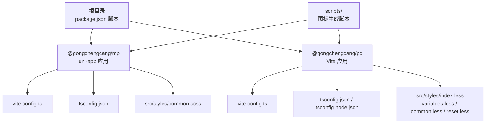
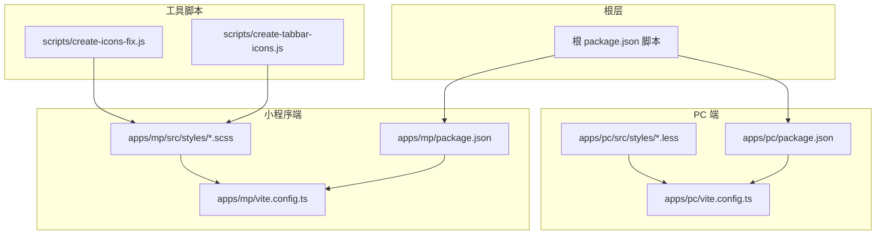
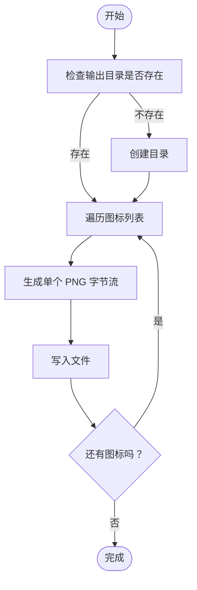
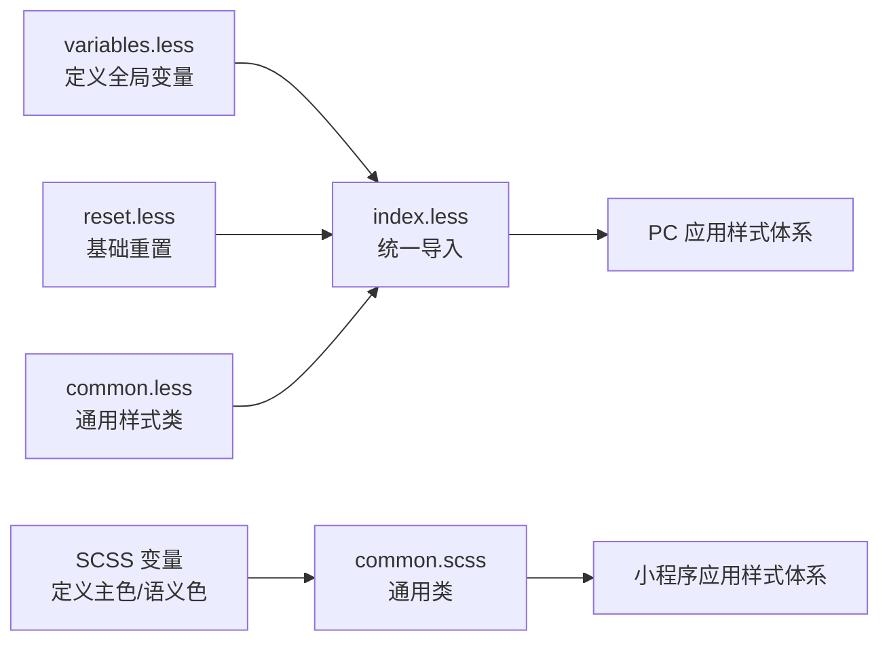
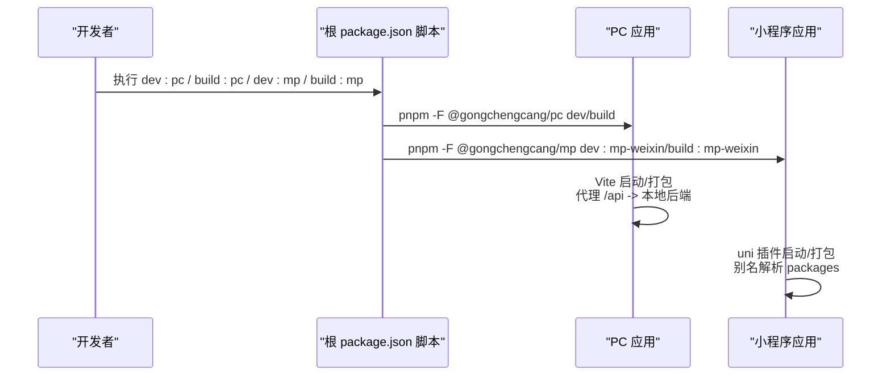
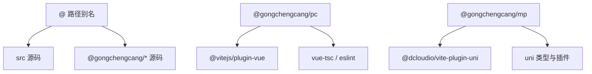

# 开发工具

<cite>
**本文引用的文件**
- [package.json](file://package.json)
- [apps/mp/package.json](file://apps/mp/package.json)
- [apps/pc/package.json](file://apps/pc/package.json)
- [scripts/create-tabbar-icons.js](file://scripts/create-tabbar-icons.js)
- [scripts/create-icons-fix.js](file://scripts/create-icons-fix.js)
- [apps/mp/vite.config.ts](file://apps/mp/vite.config.ts)
- [apps/pc/vite.config.ts](file://apps/pc/vite.config.ts)
- [apps/mp/tsconfig.json](file://apps/mp/tsconfig.json)
- [apps/pc/tsconfig.json](file://apps/pc/tsconfig.json)
- [apps/pc/tsconfig.node.json](file://apps/pc/tsconfig.node.json)
- [apps/pc/src/styles/variables.less](file://apps/pc/src/styles/variables.less)
- [apps/pc/src/styles/common.less](file://apps/pc/src/styles/common.less)
- [apps/pc/src/styles/reset.less](file://apps/pc/src/styles/reset.less)
- [apps/pc/src/styles/index.less](file://apps/pc/src/styles/index.less)
- [apps/mp/src/styles/common.scss](file://apps/mp/src/styles/common.scss)
</cite>

## 目录
1. [简介](#简介)
2. [项目结构](#项目结构)
3. [核心组件](#核心组件)
4. [架构总览](#架构总览)
5. [详细组件分析](#详细组件分析)
6. [依赖分析](#依赖分析)
7. [性能考虑](#性能考虑)
8. [故障排查指南](#故障排查指南)
9. [结论](#结论)
10. [附录](#附录)

## 简介
本文件面向工程材料管理平台的前端与多端开发者，系统化介绍项目中的开发工具与自动化流程，包括：
- 脚手架与多端构建工具（Vite、uni-app）
- 图标资源生成工具（纯 JS 自制 PNG）
- 样式变量管理工具（Less 变量与 SCSS 变量）
- 自定义脚本与命令行工具
- 静态资源处理与构建脚本执行
- 开发调试工具、浏览器插件与 IDE 配置建议

目标是帮助开发者快速上手、高效迭代，减少重复劳动，统一风格与规范。

## 项目结构
项目采用多包工作区（pnpm workspaces）组织，包含 PC 端与小程序端两个应用，以及共享的 packages（api、constants、types、utils）。根目录提供统一的开发与构建脚本，子应用各自维护独立的构建配置与样式体系。

图表来源
- [package.json:1-23](file://package.json#L1-L23)
- [apps/mp/package.json:1-39](file://apps/mp/package.json#L1-L39)
- [apps/pc/package.json:1-36](file://apps/pc/package.json#L1-L36)
- [apps/mp/vite.config.ts:1-17](file://apps/mp/vite.config.ts#L1-L17)
- [apps/pc/vite.config.ts:1-32](file://apps/pc/vite.config.ts#L1-L32)
- [apps/mp/tsconfig.json:1-16](file://apps/mp/tsconfig.json#L1-L16)
- [apps/pc/tsconfig.json:1-16](file://apps/pc/tsconfig.json#L1-L16)
- [apps/pc/tsconfig.node.json:1-12](file://apps/pc/tsconfig.node.json#L1-L12)
- [apps/pc/src/styles/index.less:1-4](file://apps/pc/src/styles/index.less#L1-L4)
- [apps/pc/src/styles/variables.less:1-17](file://apps/pc/src/styles/variables.less#L1-L17)
- [apps/pc/src/styles/common.less:1-79](file://apps/pc/src/styles/common.less#L1-L79)
- [apps/pc/src/styles/reset.less:1-25](file://apps/pc/src/styles/reset.less#L1-L25)
- [apps/mp/src/styles/common.scss:1-111](file://apps/mp/src/styles/common.scss#L1-L111)

章节来源
- [package.json:1-23](file://package.json#L1-L23)
- [apps/mp/package.json:1-39](file://apps/mp/package.json#L1-L39)
- [apps/pc/package.json:1-36](file://apps/pc/package.json#L1-L36)

## 核心组件
- 多端构建与脚手架
  - PC 端：基于 Vite，提供本地开发、打包、预览、类型检查与 ESLint 规范修复脚本。
  - 小程序端：基于 uni-app/Vite 插件，支持微信小程序与 H5 的开发与构建。
- 图标生成工具
  - 通过纯 JS 生成最小有效 PNG（含 IHDR、IDAT、IEND），批量输出 tabbar 图标资源。
- 样式变量管理
  - PC 端：Less 变量集中于 variables.less，并在 index.less 中统一引入；通用样式类在 common.less。
  - 小程序端：SCSS 变量集中于公共样式文件，提供常用布局与按钮类名。
- 路径别名与类型配置
  - 两套应用均配置了 @ 与 packages 的路径别名，便于跨包复用类型、常量、API 与工具。

章节来源
- [apps/pc/package.json:1-36](file://apps/pc/package.json#L1-L36)
- [apps/mp/package.json:1-39](file://apps/mp/package.json#L1-L39)
- [apps/mp/vite.config.ts:1-17](file://apps/mp/vite.config.ts#L1-L17)
- [apps/pc/vite.config.ts:1-32](file://apps/pc/vite.config.ts#L1-L32)
- [apps/pc/src/styles/index.less:1-4](file://apps/pc/src/styles/index.less#L1-L4)
- [apps/pc/src/styles/variables.less:1-17](file://apps/pc/src/styles/variables.less#L1-L17)
- [apps/pc/src/styles/common.less:1-79](file://apps/pc/src/styles/common.less#L1-L79)
- [apps/mp/src/styles/common.scss:1-111](file://apps/mp/src/styles/common.scss#L1-L111)

## 架构总览
下图展示开发工具在项目中的位置与交互关系：根脚本统一调度，各应用独立构建，样式与资源由各自配置管理，图标生成脚本作为外部工具参与资源准备。

图表来源
- [package.json:1-23](file://package.json#L1-L23)
- [apps/pc/package.json:1-36](file://apps/pc/package.json#L1-L36)
- [apps/mp/package.json:1-39](file://apps/mp/package.json#L1-L39)
- [apps/pc/vite.config.ts:1-32](file://apps/pc/vite.config.ts#L1-L32)
- [apps/mp/vite.config.ts:1-17](file://apps/mp/vite.config.ts#L1-L17)
- [apps/pc/src/styles/index.less:1-4](file://apps/pc/src/styles/index.less#L1-L4)
- [apps/mp/src/styles/common.scss:1-111](file://apps/mp/src/styles/common.scss#L1-L111)
- [scripts/create-tabbar-icons.js:1-119](file://scripts/create-tabbar-icons.js#L1-L119)
- [scripts/create-icons-fix.js:1-100](file://scripts/create-icons-fix.js#L1-L100)

## 详细组件分析

### 组件一：图标生成工具
- 功能概述
  - 通过纯 JS 生成最小有效 PNG（IHDR、IDAT、IEND），批量创建 tabbar 图标（含未选中/已选中状态）。
  - 支持自定义颜色，写入到小程序端静态资源目录。
- 使用方式
  - 在仓库根目录执行图标生成脚本，自动在小程序端静态资源目录生成所需 PNG。
  - 如需调整图标集或颜色，可在脚本中修改目标列表与颜色值。
- 关键流程
  - 检查并创建输出目录
  - 为每个图标生成 PNG 字节流
  - 写入文件并打印日志

图表来源
- [scripts/create-tabbar-icons.js:1-119](file://scripts/create-tabbar-icons.js#L1-L119)
- [scripts/create-icons-fix.js:1-100](file://scripts/create-icons-fix.js#L1-L100)

章节来源
- [scripts/create-tabbar-icons.js:1-119](file://scripts/create-tabbar-icons.js#L1-L119)
- [scripts/create-icons-fix.js:1-100](file://scripts/create-icons-fix.js#L1-L100)

### 组件二：样式变量管理工具
- PC 端（Less）
  - 变量集中于 variables.less，统一定义主色、语义色、文本与背景等变量。
  - index.less 统一引入重置、变量与通用样式，保证全局一致性。
  - 常用样式类（如卡片、按钮、布局）集中在 common.less，便于复用。
- 小程序端（SCSS）
  - 以 SCSS 变量形式定义主色与语义色，提供 flex、间距、卡片、按钮等通用类。
  - 与 PC 端保持一致的命名与语义，便于跨端复用与迁移。

图表来源
- [apps/pc/src/styles/variables.less:1-17](file://apps/pc/src/styles/variables.less#L1-L17)
- [apps/pc/src/styles/common.less:1-79](file://apps/pc/src/styles/common.less#L1-L79)
- [apps/pc/src/styles/reset.less:1-25](file://apps/pc/src/styles/reset.less#L1-L25)
- [apps/pc/src/styles/index.less:1-4](file://apps/pc/src/styles/index.less#L1-L4)
- [apps/mp/src/styles/common.scss:1-111](file://apps/mp/src/styles/common.scss#L1-L111)

章节来源
- [apps/pc/src/styles/variables.less:1-17](file://apps/pc/src/styles/variables.less#L1-L17)
- [apps/pc/src/styles/common.less:1-79](file://apps/pc/src/styles/common.less#L1-L79)
- [apps/pc/src/styles/reset.less:1-25](file://apps/pc/src/styles/reset.less#L1-L25)
- [apps/pc/src/styles/index.less:1-4](file://apps/pc/src/styles/index.less#L1-L4)
- [apps/mp/src/styles/common.scss:1-111](file://apps/mp/src/styles/common.scss#L1-L111)

### 组件三：脚手架与构建工具
- 根脚本（根 package.json）
  - 提供统一入口：PC 开发/构建、小程序开发/构建、全栈类型检查与 Lint。
- PC 端（apps/pc）
  - Vite 配置：路径别名、代理（/api -> 本地后端）、构建输出与 SourceMap。
  - 类型与规范：tsconfig 引用 node 配置，ESLint 脚本用于修复。
- 小程序端（apps/mp）
  - uni/Vite 插件：支持微信小程序与 H5。
  - 路径别名：指向 packages 下的源码，便于跨包开发。

图表来源
- [package.json:1-23](file://package.json#L1-L23)
- [apps/pc/package.json:1-36](file://apps/pc/package.json#L1-L36)
- [apps/mp/package.json:1-39](file://apps/mp/package.json#L1-L39)
- [apps/pc/vite.config.ts:1-32](file://apps/pc/vite.config.ts#L1-L32)
- [apps/mp/vite.config.ts:1-17](file://apps/mp/vite.config.ts#L1-L17)

章节来源
- [package.json:1-23](file://package.json#L1-L23)
- [apps/pc/package.json:1-36](file://apps/pc/package.json#L1-L36)
- [apps/mp/package.json:1-39](file://apps/mp/package.json#L1-L39)
- [apps/pc/vite.config.ts:1-32](file://apps/pc/vite.config.ts#L1-L32)
- [apps/mp/vite.config.ts:1-17](file://apps/mp/vite.config.ts#L1-L17)

### 组件四：静态资源处理与构建脚本
- 资源定位
  - 小程序端图标资源位于 apps/mp/src/static/tabbar，由图标生成脚本写入。
  - PC 端样式资源位于 apps/pc/src/styles，通过 Less 入口统一加载。
- 构建行为
  - PC 端：Vite 构建输出 dist，开启 SourceMap；可选部署脚本将 404.html 与 dist 发布至 gh-pages。
  - 小程序端：uni build 输出对应平台产物，支持别名解析 packages。

章节来源
- [scripts/create-tabbar-icons.js:1-119](file://scripts/create-tabbar-icons.js#L1-L119)
- [apps/pc/vite.config.ts:1-32](file://apps/pc/vite.config.ts#L1-L32)
- [apps/pc/package.json:1-36](file://apps/pc/package.json#L1-L36)
- [apps/mp/package.json:1-39](file://apps/mp/package.json#L1-L39)

## 依赖分析
- 路径别名与类型
  - 两套应用均将 @ 映射到 src，将 @gongchengcang/* 映射到 packages 下源码，实现跨包复用。
- 构建插件
  - PC：@vitejs/plugin-vue
  - 小程序：@dcloudio/vite-plugin-uni
- 类型检查与规范
  - PC：vue-tsc、eslint
  - 小程序：uni-cli 相关类型与插件

图表来源
- [apps/pc/vite.config.ts:1-32](file://apps/pc/vite.config.ts#L1-L32)
- [apps/mp/vite.config.ts:1-17](file://apps/mp/vite.config.ts#L1-L17)
- [apps/pc/tsconfig.json:1-16](file://apps/pc/tsconfig.json#L1-L16)
- [apps/mp/tsconfig.json:1-16](file://apps/mp/tsconfig.json#L1-L16)
- [apps/pc/package.json:1-36](file://apps/pc/package.json#L1-L36)
- [apps/mp/package.json:1-39](file://apps/mp/package.json#L1-L39)

章节来源
- [apps/pc/vite.config.ts:1-32](file://apps/pc/vite.config.ts#L1-L32)
- [apps/mp/vite.config.ts:1-17](file://apps/mp/vite.config.ts#L1-L17)
- [apps/pc/tsconfig.json:1-16](file://apps/pc/tsconfig.json#L1-L16)
- [apps/mp/tsconfig.json:1-16](file://apps/mp/tsconfig.json#L1-L16)
- [apps/pc/package.json:1-36](file://apps/pc/package.json#L1-L36)
- [apps/mp/package.json:1-39](file://apps/mp/package.json#L1-L39)

## 性能考虑
- 构建优化
  - PC 端启用 SourceMap 便于调试，生产环境可按需关闭。
  - 小程序端使用 uni 插件进行平台特定优化。
- 资源体积
  - 图标生成脚本产出最小有效 PNG，尺寸可控，适合 tabbar 等小图标场景。
- 开发体验
  - 代理配置将 /api 指向本地后端，避免跨域与频繁切换环境。

## 故障排查指南
- 构建失败
  - 检查根脚本与子应用脚本是否匹配（PC/MP 分别执行对应命令）。
  - 确认 packages 别名映射正确，避免模块解析错误。
- 样式不生效
  - PC 端确认 index.less 是否正确导入 variables.less 与 common.less。
  - 小程序端确认 SCSS 编译与类名拼写。
- 图标缺失
  - 确认图标生成脚本已执行且输出目录存在。
  - 检查小程序端静态资源路径与编译配置。
- 类型检查/ESLint 报错
  - 运行 typecheck 与 lint 脚本，按提示修复类型或格式问题。

章节来源
- [package.json:1-23](file://package.json#L1-L23)
- [apps/pc/src/styles/index.less:1-4](file://apps/pc/src/styles/index.less#L1-L4)
- [apps/mp/src/styles/common.scss:1-111](file://apps/mp/src/styles/common.scss#L1-L111)
- [scripts/create-tabbar-icons.js:1-119](file://scripts/create-tabbar-icons.js#L1-L119)

## 结论
本项目通过统一的根脚本与两套独立的构建配置，实现了 PC 端与小程序端的高效开发；配合图标生成脚本与样式变量体系，保障了资源与样式的统一性与可维护性。建议在日常开发中：
- 使用根脚本统一启动与构建
- 通过图标生成脚本与样式变量体系规范资源与样式
- 严格遵循类型检查与 ESLint 规范
- 遇到问题先核对别名与代理配置

## 附录
- 常用命令
  - PC 开发：根脚本 dev:pc
  - PC 构建：根脚本 build:pc
  - 小程序开发：根脚本 dev:mp
  - 小程序构建：根脚本 build:mp
  - 全栈类型检查：根脚本 typecheck
  - 全栈 Lint：根脚本 lint
- 推荐浏览器插件
  - Vue DevTools（PC 端）
  - 微信开发者工具（小程序端）
- IDE 配置建议
  - VSCode：安装 Vue Language Features、ESLint、Prettier 插件
  - TypeScript：启用“在编辑器中类型检查”与“自动修复”
  - 路径别名：确保 TS/JS 解析器识别 @ 与 @gongchengcang/* 别名