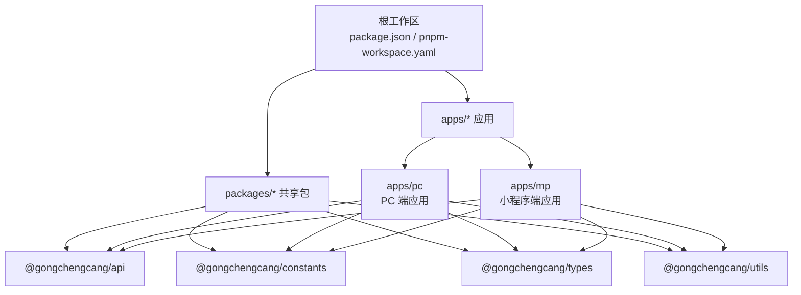
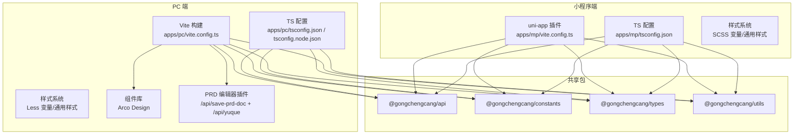
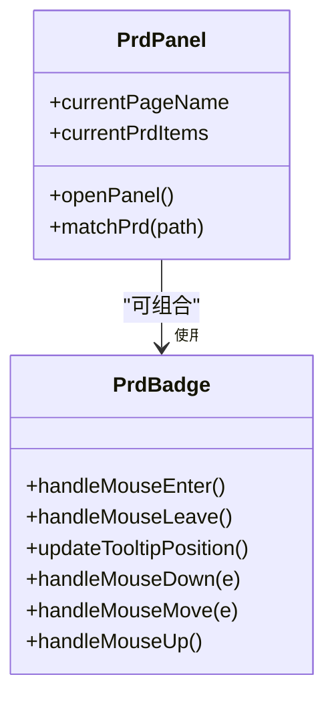
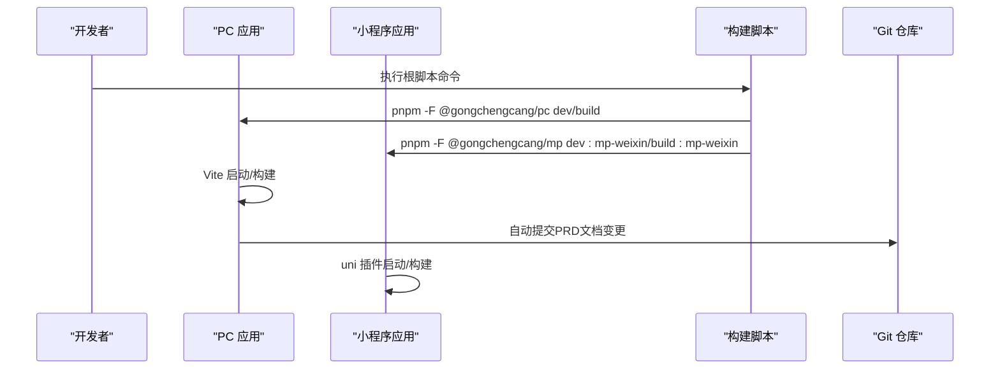
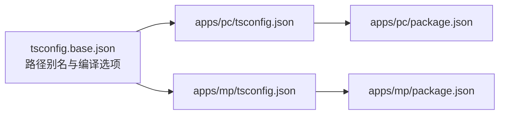

# 开发指南

<cite>
**本文引用的文件**
- [package.json](file://package.json)
- [pnpm-workspace.yaml](file://pnpm-workspace.yaml)
- [apps/mp/package.json](file://apps/mp/package.json)
- [apps/pc/package.json](file://apps/pc/package.json)
- [tsconfig.base.json](file://tsconfig.base.json)
- [apps/mp/vite.config.ts](file://apps/mp/vite.config.ts)
- [apps/pc/vite.config.ts](file://apps/pc/vite.config.ts)
- [apps/mp/tsconfig.json](file://apps/mp/tsconfig.json)
- [apps/pc/tsconfig.json](file://apps/pc/tsconfig.json)
- [apps/pc/tsconfig.node.json](file://apps/pc/tsconfig.node.json)
- [apps/pc/src/styles/variables.less](file://apps/pc/src/styles/variables.less)
- [apps/pc/src/styles/common.less](file://apps/pc/src/styles/common.less)
- [apps/mp/src/styles/common.scss](file://apps/mp/src/styles/common.scss)
- [apps/pc/src/components/PrdBadge/index.vue](file://apps/pc/src/components/PrdBadge/index.vue)
- [apps/pc/src/components/PrdPanel/index.vue](file://apps/pc/src/components/PrdPanel/index.vue)
- [apps/pc/src/components/PrdPanel/prdData.ts](file://apps/pc/src/components/PrdPanel/prdData.ts)
- [scripts/create-icons-fix.js](file://scripts/create-icons-fix.js)
- [scripts/create-tabbar-icons.js](file://scripts/create-tabbar-icons.js)
- [.github/workflows/deploy.yml](file://.github/workflows/deploy.yml)
- [deploy-gh-pages.sh](file://deploy-gh-pages.sh)
- [vercel.json](file://vercel.json)
- [脚手架PRD专业模版/03_配套工具链/03-Vite配置集成模板.ts](file://脚手架PRD专业模版/03_配套工具链/03-Vite配置集成模板.ts)
- [脚手架PRD专业模版/05_PRD查看器组件/PrdPageViewer.vue](file://脚手架PRD专业模版/05_PRD查看器组件/PrdPageViewer.vue)
- [脚手架PRD专业模版/05_PRD查看器组件/PrdPanel.vue](file://脚手架PRD专业模版/05_PRD查看器组件/PrdPanel.vue)
- [脚手架PRD专业模版/05_PRD查看器组件/prdData.ts](file://脚手架PRD专业模版/05_PRD查看器组件/prdData.ts)
</cite>

## 目录
1. [简介](#简介)
2. [项目结构](#项目结构)
3. [核心组件](#核心组件)
4. [架构总览](#架构总览)
5. [详细组件分析](#详细组件分析)
6. [依赖分析](#依赖分析)
7. [性能考虑](#性能考虑)
8. [故障排查指南](#故障排查指南)
9. [结论](#结论)
10. [附录](#附录)

## 简介
本指南面向工程材料管理平台的前端开发团队，目标是统一开发规范、提升代码质量与协作效率。内容覆盖代码规范、TypeScript 类型定义、工具函数使用、样式系统设计、组件开发规范；同时包含项目配置说明、构建流程、开发调试技巧、性能优化策略、Git 提交规范、代码审查流程与测试策略指导，并介绍项目脚手架使用、图标生成工具、样式变量管理，以及常见问题解决方案与调试工具推荐。

**更新** 新增开发环境配置增强与本地开发工作流改进相关内容，包括语雀API代理配置、PRD文档自动Git提交功能、环境隔离与自动同步到GitHub的工作流优化。

## 项目结构
本项目采用 pnpm workspaces 多包结构，包含 PC 端与小程序端两个应用，以及共享的 packages（api、constants、types、utils）。根目录通过统一的脚本命令进行开发与构建。

**章节来源**
- [package.json:1-26](file://package.json#L1-L26)
- [pnpm-workspace.yaml:1-4](file://pnpm-workspace.yaml#L1-L4)

## 核心组件
- 样式系统：PC 端使用 Less，小程序端使用 SCSS；均通过全局变量与通用样式类实现一致的视觉与交互体验。
- 组件体系：基于 Vue 3 + Vite（PC）、Vite 插件（小程序）；组件采用组合式 API 与 TypeScript。
- 构建与运行：PC 使用 Vite，小程序使用 uni-app 生态；支持本地代理与源码映射。
- 开发脚本：统一通过根脚本进行多包并行开发与类型检查。
- **新增** PRD 文档编辑与同步：内置 PRD 编辑器插件，支持在线编辑、自动保存与 Git 提交。

**章节来源**
- [apps/pc/vite.config.ts:8-85](file://apps/pc/vite.config.ts#L8-L85)
- [apps/mp/vite.config.ts:1-17](file://apps/mp/vite.config.ts#L1-L17)
- [apps/pc/tsconfig.json:1-16](file://apps/pc/tsconfig.json#L1-L16)
- [apps/mp/tsconfig.json:1-16](file://apps/mp/tsconfig.json#L1-L16)
- [apps/pc/tsconfig.node.json:1-12](file://apps/pc/tsconfig.node.json#L1-L12)

## 架构总览
下图展示了 PC 端与小程序端的运行时与构建时关系，以及共享包的依赖注入和新增的 PRD 编辑器插件架构。

**图表来源**
- [apps/pc/vite.config.ts:87-123](file://apps/pc/vite.config.ts#L87-L123)
- [apps/mp/vite.config.ts:1-17](file://apps/mp/vite.config.ts#L1-L17)
- [apps/pc/tsconfig.json:1-16](file://apps/pc/tsconfig.json#L1-L16)
- [apps/mp/tsconfig.json:1-16](file://apps/mp/tsconfig.json#L1-L16)
- [apps/pc/tsconfig.node.json:1-12](file://apps/pc/tsconfig.node.json#L1-L12)

## 详细组件分析

### 样式系统设计
- 变量管理：PC 端通过 Less 变量集中管理主色、语义色、文本与边框、背景色及布局尺寸；小程序端通过 SCSS 变量管理主色与通用配色。
- 通用样式：PC 端提供页面容器、卡片、表格操作区、搜索表单、文本语义类与间距类；小程序端提供 Flex 布局、卡片、按钮等通用类。
- 使用建议：优先使用变量与通用类，避免在组件内硬编码颜色与尺寸；组件内部样式尽量局部作用域化。

**章节来源**
- [apps/pc/src/styles/variables.less:1-17](file://apps/pc/src/styles/variables.less#L1-L17)
- [apps/pc/src/styles/common.less:1-79](file://apps/pc/src/styles/common.less#L1-L79)
- [apps/mp/src/styles/common.scss:1-111](file://apps/mp/src/styles/common.scss#L1-L111)

### PRD 面板与徽章组件
- PrdPanel：提供悬浮按钮，打开抽屉式 PRD 文档面板，支持按路由路径匹配 PRD 数据库中的条目，垂直步骤展示 Markdown 内容。
- PrdBadge：在页面元素上渲染需求徽章，支持拖拽移动与自动边界适配，支持简单 Markdown 渲染。
- 设计要点：组件通过 Teleport 将提示层挂载到 body，避免层级与定位问题；使用 :deep 样式穿透保证内容渲染一致性。

**图表来源**
- [apps/pc/src/components/PrdPanel/index.vue:1-634](file://apps/pc/src/components/PrdPanel/index.vue#L1-L634)
- [apps/pc/src/components/PrdBadge/index.vue:1-303](file://apps/pc/src/components/PrdBadge/index.vue#L1-L303)

**章节来源**
- [apps/pc/src/components/PrdPanel/index.vue:1-634](file://apps/pc/src/components/PrdPanel/index.vue#L1-L634)
- [apps/pc/src/components/PrdBadge/index.vue:1-303](file://apps/pc/src/components/PrdBadge/index.vue#L1-L303)

### PRD 查看器组件
- PrdPageViewer：提供全屏 PRD 查看器，支持多端切换、全文搜索、Mermaid 图表渲染、目录导航与更新日志功能。
- 支持的功能：端切换、全文搜索、Mermaid 图表渲染、TOC 目录、更新日志查看、图表放大查看。
- 集成方式：在路由中注册此页面即可使用。

**章节来源**
- [脚手架PRD专业模版/05_PRD查看器组件/PrdPageViewer.vue:1-515](file://脚手架PRD专业模版/05_PRD查看器组件/PrdPageViewer.vue#L1-L515)

### 构建与运行流程
- PC 端：Vite 开发服务器，支持本地代理到后端服务；生产构建输出 dist，开启源码映射；支持 gh-pages 部署。
- 小程序端：uni-app Vite 插件，支持微信小程序与 H5 开发；类型检查通过 vue-tsc。
- 类型配置：统一 base 配置，应用各自 tsconfig 引入路径别名与类型声明。
- **新增** PRD 编辑器插件：提供 /api/save-prd-doc 接口用于在线编辑保存，支持自动提交 Git。

**图表来源**
- [package.json:6-12](file://package.json#L6-L12)
- [apps/pc/package.json:6-12](file://apps/pc/package.json#L6-L12)
- [apps/mp/package.json:5-10](file://apps/mp/package.json#L5-L10)

**章节来源**
- [package.json:1-26](file://package.json#L1-L26)
- [apps/pc/vite.config.ts:87-123](file://apps/pc/vite.config.ts#L87-L123)
- [apps/mp/vite.config.ts:1-17](file://apps/mp/vite.config.ts#L1-L17)
- [apps/pc/tsconfig.json:1-16](file://apps/pc/tsconfig.json#L1-L16)
- [apps/mp/tsconfig.json:1-16](file://apps/mp/tsconfig.json#L1-L16)

### 图标生成工具
- create-icons-fix.js：用于修复或生成图标相关资源。
- create-tabbar-icons.js：用于生成底部导航图标资源。
- 使用建议：在新增或修改图标后，执行相应脚本以保持资源一致性。

**章节来源**
- [scripts/create-icons-fix.js](file://scripts/create-icons-fix.js)
- [scripts/create-tabbar-icons.js](file://scripts/create-tabbar-icons.js)

### 部署与持续集成
- GitHub Actions：通过部署工作流自动化构建与发布。
- GH Pages：PC 端可通过脚本一键部署至 gh-pages。
- Vercel：提供静态托管配置入口。

**章节来源**
- [.github/workflows/deploy.yml:1-200](file://.github/workflows/deploy.yml#L1-L200)
- [deploy-gh-pages.sh:1-200](file://deploy-gh-pages.sh#L1-L200)
- [vercel.json:1-200](file://vercel.json#L1-L200)

### 开发环境配置增强
- **语雀API代理配置**：新增动态语雀API代理中间件，支持任意企业版域名，解决跨域问题。
- **PRD文档自动Git提交**：本地编辑PRD文档后自动提交到GitHub，仅在本地开发环境生效。
- **环境隔离**：通过代理配置和插件机制实现开发环境与生产环境的隔离。

**章节来源**
- [apps/pc/vite.config.ts:12-42](file://apps/pc/vite.config.ts#L12-L42)
- [apps/pc/vite.config.ts:66-74](file://apps/pc/vite.config.ts#L66-L74)
- [脚手架PRD专业模版/03_配套工具链/03-Vite配置集成模板.ts:12-61](file://脚手架PRD专业模版/03_配套工具链/03-Vite配置集成模板.ts#L12-L61)

## 依赖分析
- 路径别名：通过 tsconfig.base.json 与各应用 tsconfig.json 统一配置 @gongchengcang/* 别名，指向 packages 下的 src 目录。
- 运行时依赖：PC 端引入 Arco Design、Vue Router、Pinia；小程序端引入 uni-app 生态与 Vue 3。
- 类型与检查：PC 端使用 vue-tsc 进行类型检查；小程序端通过 @dcloudio/types 提供类型声明。

**图表来源**
- [tsconfig.base.json:1-29](file://tsconfig.base.json#L1-L29)
- [apps/pc/tsconfig.json:1-16](file://apps/pc/tsconfig.json#L1-L16)
- [apps/mp/tsconfig.json:1-16](file://apps/mp/tsconfig.json#L1-L16)
- [apps/pc/package.json:14-24](file://apps/pc/package.json#L14-L24)
- [apps/mp/package.json:12-24](file://apps/mp/package.json#L12-L24)

**章节来源**
- [tsconfig.base.json:1-29](file://tsconfig.base.json#L1-L29)
- [apps/pc/tsconfig.json:1-16](file://apps/pc/tsconfig.json#L1-L16)
- [apps/mp/tsconfig.json:1-16](file://apps/mp/tsconfig.json#L1-L16)

## 性能考虑
- 构建优化：启用源码映射便于调试；生产构建开启 sourcemap 以平衡体积与可观测性。
- 样式优化：统一变量与通用类，减少重复样式；组件内样式作用域化，避免全局污染。
- 组件优化：合理拆分组件，避免过度渲染；使用 Teleport 仅在必要时挂载到 body。
- 开发体验：PC 端本地代理直连后端，减少跨域与中间层开销；小程序端使用 uni 插件提升热更新效率。
- **新增** PRD 编辑器优化：通过中间件直接处理请求，避免额外的网络往返；Git 提交操作设置超时限制，防止阻塞开发流程。

**章节来源**
- [apps/pc/vite.config.ts:27-31](file://apps/pc/vite.config.ts#L27-L31)
- [apps/pc/src/components/PrdBadge/index.vue:13-32](file://apps/pc/src/components/PrdBadge/index.vue#L13-L32)
- [apps/pc/vite.config.ts:68-71](file://apps/pc/vite.config.ts#L68-L71)

## 故障排查指南
- 类型错误：统一执行根脚本进行类型检查，定位到具体应用与文件。
- 构建失败：检查各应用 vite.config.ts 的 alias 与插件配置是否正确；确认 tsconfig 引用关系。
- 样式异常：核对变量与通用类使用是否一致；注意 PC 与小程序端样式语法差异。
- 图标缺失：执行图标生成脚本，确保资源路径与别名一致。
- 部署问题：核对部署脚本与 CI 配置，确认静态资源路径与域名配置。
- **新增** PRD 编辑器问题：检查 /api/save-prd-doc 接口返回状态，确认文件路径存在且可写；验证 Git 配置与权限。

**章节来源**
- [package.json:11-12](file://package.json#L11-L12)
- [apps/pc/vite.config.ts:5-16](file://apps/pc/vite.config.ts#L5-L16)
- [apps/mp/vite.config.ts:5-16](file://apps/mp/vite.config.ts#L5-L16)
- [apps/pc/tsconfig.json:14-15](file://apps/pc/tsconfig.json#L14-L15)
- [apps/pc/vite.config.ts:54-64](file://apps/pc/vite.config.ts#L54-L64)

## 结论
本指南提供了从项目结构、构建流程、样式系统到组件开发与部署的完整实践路径。**更新后的版本**特别强化了开发环境配置与本地工作流优化，包括语雀API代理、PRD文档自动同步到GitHub等增强功能。建议团队在日常开发中遵循统一的代码规范与类型约束，善用共享包与工具脚本，结合 PRD 面板与徽章组件提升需求对齐效率，并通过持续集成与源码映射保障交付质量与可维护性。

## 附录

### 代码规范与最佳实践
- 目录与命名：组件统一使用 PascalCase，页面按功能模块划分；公共样式类使用语义化命名。
- 组件开发：优先使用组合式 API 与 TypeScript；组件间通信通过 props 与 emits；避免在组件内写死路径与常量。
- 样式开发：统一使用变量与通用类；组件样式作用域化；避免深度选择器滥用。
- 路由与页面：页面路由与 PRD 匹配保持一致；抽屉/弹窗等浮层组件谨慎使用 Teleport。
- **新增** PRD 文档管理：使用 PrdPanel 与 PrdBadge 在开发前快速对齐需求细节；通过 PRD 查看器组件提升文档查阅效率。

**章节来源**
- [apps/pc/src/components/PrdPanel/index.vue:56-513](file://apps/pc/src/components/PrdPanel/index.vue#L56-L513)
- [apps/pc/src/styles/common.less:1-79](file://apps/pc/src/styles/common.less#L1-L79)
- [apps/mp/src/styles/common.scss:1-111](file://apps/mp/src/styles/common.scss#L1-L111)

### Git 提交规范与代码审查
- 提交规范：采用"类型: 概述"格式，类型包括 feat、fix、docs、style、refactor、test、chore；概述简洁明确。
- 代码审查：PR 描述需包含变更动机、影响范围与测试验证；至少一次同行评审通过后合并。
- 分支策略：主分支保护，特性分支以 feature/ 或 fix/ 前缀命名，合并后及时删除。
- **新增** PRD 文档同步：本地编辑PRD文档会自动提交到GitHub，确保文档版本与代码同步。

### 测试策略
- 单元测试：针对工具函数与纯函数编写测试用例，使用合适的断言库。
- 组件测试：对交互复杂组件进行快照与交互测试，关注边界条件与错误状态。
- 端到端测试：小程序与 PC 端分别建立关键流程的 E2E 场景，确保集成稳定。
- **新增** PRD 编辑器测试：验证 /api/save-prd-doc 接口的文件保存与 Git 提交功能。

### 开发效率提升技巧
- 快捷脚本：使用根脚本统一执行 lint 与 typecheck，避免逐应用切换。
- 类型辅助：在 VSCode 中启用"在保存时自动类型检查"，提升反馈速度。
- 组件复用：将通用逻辑抽象为 Composables 或工具函数，减少重复代码。
- PRD 对齐：通过 PrdPanel 与 PrdBadge 在开发前快速对齐需求细节，降低返工成本。
- **新增** 本地开发优化：利用语雀API代理减少跨域问题；通过 PRD 自动同步提升文档维护效率。

### 本地开发工作流改进
- **环境隔离**：通过代理配置和插件机制实现开发环境与生产环境的隔离，避免配置冲突。
- **自动同步**：本地编辑PRD文档后自动提交到GitHub，确保团队成员能够实时获取最新文档。
- **语雀集成**：支持任意企业版语雀域名的API代理，解决跨域访问问题。
- **安全控制**：Git 提交操作仅在本地开发环境生效，生产环境自动跳过。

**章节来源**
- [apps/pc/vite.config.ts:12-42](file://apps/pc/vite.config.ts#L12-L42)
- [apps/pc/vite.config.ts:66-74](file://apps/pc/vite.config.ts#L66-L74)
- [脚手架PRD专业模版/03_配套工具链/03-Vite配置集成模板.ts:42-50](file://脚手架PRD专业模版/03_配套工具链/03-Vite配置集成模板.ts#L42-L50)