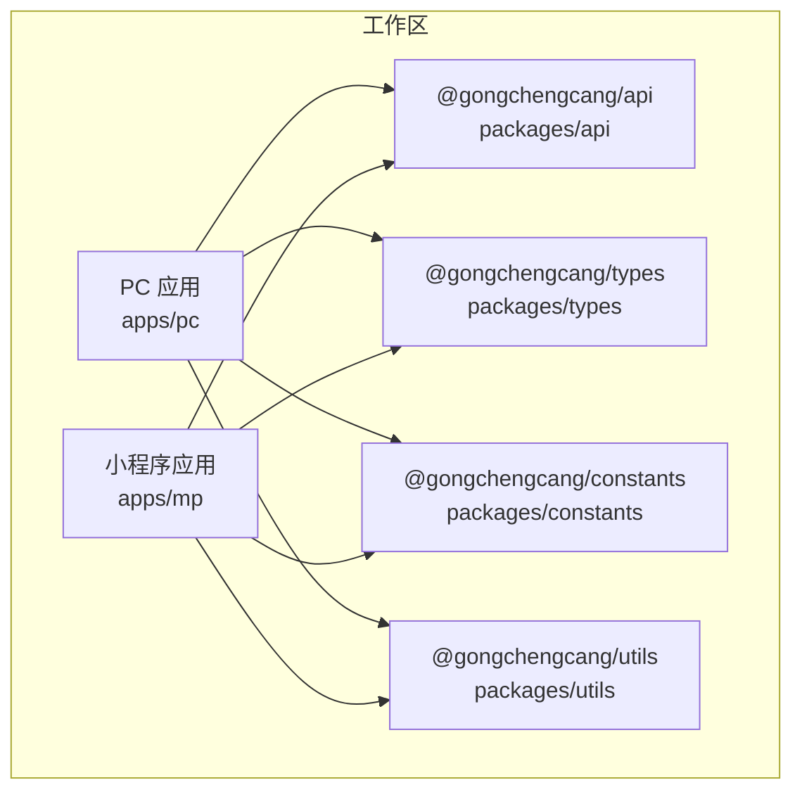
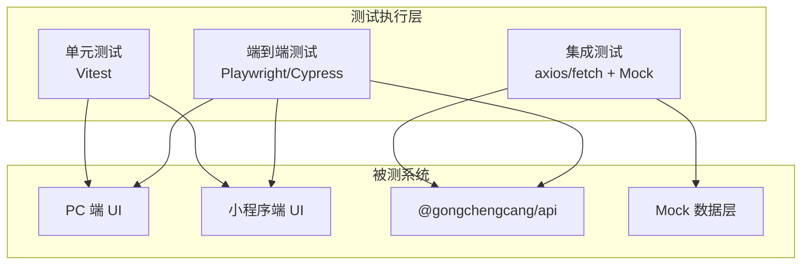
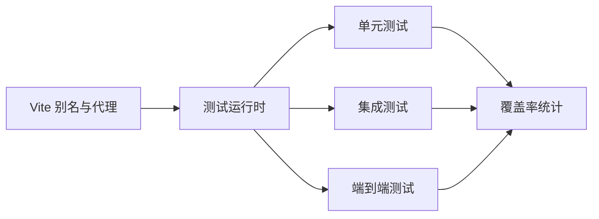

# 测试策略

<cite>
**本文引用的文件**
- [package.json](file://package.json)
- [apps/pc/package.json](file://apps/pc/package.json)
- [apps/mp/package.json](file://apps/mp/package.json)
- [apps/pc/vite.config.ts](file://apps/pc/vite.config.ts)
- [apps/mp/vite.config.ts](file://apps/mp/vite.config.ts)
- [tsconfig.base.json](file://tsconfig.base.json)
- [.github/workflows/deploy.yml](file://.github/workflows/deploy.yml)
- [packages/api/src/mock/user.ts](file://packages/api/src/mock/user.ts)
- [packages/api/src/mock/order.ts](file://packages/api/src/mock/order.ts)
- [packages/api/src/mock/merchant.ts](file://packages/api/src/mock/merchant.ts)
</cite>

## 目录
1. [引言](#引言)
2. [项目结构](#项目结构)
3. [核心组件](#核心组件)
4. [架构总览](#架构总览)
5. [详细组件分析](#详细组件分析)
6. [依赖分析](#依赖分析)
7. [性能考虑](#性能考虑)
8. [故障排查指南](#故障排查指南)
9. [结论](#结论)
10. [附录](#附录)

## 引言
本测试策略文档面向“工程材料管理平台”，目标是建立覆盖单元测试、集成测试与端到端测试的完整测试体系，确保代码质量与功能稳定性。文档将明确测试框架选型、测试用例编写规范、Mock 数据管理、覆盖率要求，并给出组件测试、API 测试、路由测试的实施方案；同时涵盖测试环境配置、持续集成测试与自动化流程的最佳实践与常见问题解决方案。

## 项目结构
该仓库采用多包工作区（pnpm workspaces）组织方式，包含 PC 端与小程序端两个前端应用，以及统一的 API、类型、常量与工具包。测试策略需覆盖以下关键点：
- 多应用与多包的测试隔离与共享
- 前端应用的构建与代理配置对测试的影响
- Mock 层在测试中的使用与维护
- CI 部署流程与测试前置条件

图表来源
- [apps/pc/vite.config.ts:1-32](file://apps/pc/vite.config.ts#L1-L32)
- [apps/mp/vite.config.ts:1-17](file://apps/mp/vite.config.ts#L1-L17)
- [tsconfig.base.json:1-29](file://tsconfig.base.json#L1-L29)

章节来源
- [package.json:1-23](file://package.json#L1-L23)
- [apps/pc/package.json:1-36](file://apps/pc/package.json#L1-L36)
- [apps/mp/package.json:1-39](file://apps/mp/package.json#L1-L39)
- [apps/pc/vite.config.ts:1-32](file://apps/pc/vite.config.ts#L1-L32)
- [apps/mp/vite.config.ts:1-17](file://apps/mp/vite.config.ts#L1-L17)
- [tsconfig.base.json:1-29](file://tsconfig.base.json#L1-L29)

## 核心组件
- 测试框架与运行时
  - 单元测试：建议使用 Vitest（与 Vite 生态契合），或 Jest（当前锁中存在 Jest 依赖）。优先 Vitest 以获得更快的冷启动与更好的 Vite 集成。
  - 集成测试：基于浏览器或 Node 环境的 fetch/axios 请求，结合 Mock 数据层进行接口行为验证。
  - 端到端测试：建议使用 Playwright 或 Cypress，支持跨端（PC/H5/小程序）场景的自动化回归。
- 覆盖率与报告
  - 使用覆盖率工具（如 c8 或 Istanbul）生成报告，建议为单元测试设定不低于 80% 的行覆盖率与 70% 的函数/分支/指令覆盖率阈值。
- Mock 数据管理
  - 利用 packages/api/src/mock 下的现有 Mock 实现，统一管理用户、订单、商户等实体的增删改查与状态变更逻辑，便于测试稳定复现。
- 测试环境与 CI
  - 在 CI 中执行安装、类型检查、单元测试与覆盖率统计，通过部署脚本保证产物可构建与可发布。

章节来源
- [packages/api/src/mock/user.ts:125-150](file://packages/api/src/mock/user.ts#L125-L150)
- [packages/api/src/mock/order.ts:181-229](file://packages/api/src/mock/order.ts#L181-L229)
- [packages/api/src/mock/merchant.ts:282-335](file://packages/api/src/mock/merchant.ts#L282-L335)

## 架构总览
测试架构围绕“分层隔离 + 统一 Mock + 自动化执行”展开：
- 单元层：组件与工具函数测试，使用 Vitest + DOM/Mock 环境
- 集成层：API 接口与服务层测试，使用 axios/fetch + Mock 数据
- 端到端层：真实浏览器/小程序模拟器下的用户路径测试
- CI 层：流水线中完成安装、类型检查、测试与覆盖率上报

图表来源
- [apps/pc/vite.config.ts:1-32](file://apps/pc/vite.config.ts#L1-L32)
- [apps/mp/vite.config.ts:1-17](file://apps/mp/vite.config.ts#L1-L17)
- [packages/api/src/mock/user.ts:125-150](file://packages/api/src/mock/user.ts#L125-L150)
- [packages/api/src/mock/order.ts:181-229](file://packages/api/src/mock/order.ts#L181-L229)
- [packages/api/src/mock/merchant.ts:282-335](file://packages/api/src/mock/merchant.ts#L282-L335)

## 详细组件分析

### 单元测试策略
- 测试范围
  - Vue 组件：渲染、事件、props、slots、组合式函数（composables）与工具函数
  - Pinia Store：状态读写、派生状态、Action 行为
  - 工具函数：纯函数、日期处理、格式化等
- 运行环境
  - 使用 Vitest + jsdom 或 @testing-library/vue（可选）
  - 配置别名与路径映射，确保与 tsconfig.base.json 一致
- Mock 与依赖注入
  - 对外部依赖（如 API、路由、全局状态）进行模块级或函数级 Mock
  - 使用 Mock 数据层（packages/api/src/mock）提供稳定输入
- 编写规范
  - 每个功能模块至少包含：正常路径、边界条件、异常路径
  - 使用 describe/it/xit/fit 分类组织用例，命名清晰表达意图
  - 用例粒度适中，避免过度耦合
- 覆盖率要求
  - 行覆盖率 ≥ 80%，函数/分支/指令覆盖率 ≥ 70%

章节来源
- [tsconfig.base.json:1-29](file://tsconfig.base.json#L1-L29)
- [apps/pc/vite.config.ts:1-32](file://apps/pc/vite.config.ts#L1-L32)
- [apps/mp/vite.config.ts:1-17](file://apps/mp/vite.config.ts#L1-L17)

### 集成测试策略
- 目标
  - 验证 API 层与服务层的行为一致性，包括请求参数、响应结构、错误处理与状态流转
- 数据与 Mock
  - 使用 packages/api/src/mock 下的工厂与 CRUD 方法构造测试数据
  - 对需要真实网络交互的场景，使用代理或本地服务进行隔离测试
- 关键场景
  - 用户管理：创建、更新、删除、状态变更
  - 订单管理：创建、状态变更、取消
  - 商户管理：详情查询、合同与资质列表、新增
- 编写规范
  - 以“请求-断言-清理”的模式组织用例
  - 对易变字段（时间戳、自增 ID）使用固定占位或断言规则而非精确值
- 覆盖率要求
  - 接口与分支覆盖率 ≥ 70%

章节来源
- [packages/api/src/mock/user.ts:125-150](file://packages/api/src/mock/user.ts#L125-L150)
- [packages/api/src/mock/order.ts:181-229](file://packages/api/src/mock/order.ts#L181-L229)
- [packages/api/src/mock/merchant.ts:282-335](file://packages/api/src/mock/merchant.ts#L282-L335)

### 端到端测试策略
- 场景与目标
  - PC/H5：登录 → 商品浏览 → 加入购物车 → 下单 → 支付 → 查看订单
  - 小程序：登录 → 选择工程仓 → 选择商品 → 提交订单 → 查看订单状态
- 工具与配置
  - 推荐 Playwright：跨浏览器与小程序模拟器支持较好
  - 配置代理与静态资源访问，确保测试环境与生产一致
- 流程与断言
  - 以用户旅程为主线，断言关键节点（URL、元素可见性、数据正确性）
  - 对网络请求进行拦截与断言，确保调用链正确
- 覆盖率要求
  - 重点业务路径 ≥ 90% 的通过率，失败用例必须有明确日志与截图

章节来源
- [apps/pc/vite.config.ts:17-26](file://apps/pc/vite.config.ts#L17-L26)
- [apps/mp/vite.config.ts:1-17](file://apps/mp/vite.config.ts#L1-L17)

### 路由与导航测试
- 目标
  - 验证路由守卫、权限控制、动态路由参数解析与面包屑/标题同步
- 实施方案
  - 使用内存路由（Vue Router inMemoryHistory）进行单元测试
  - 在集成测试中使用真实 history，结合 Mock 数据验证导航行为
- 关键断言
  - 登录态校验、角色权限校验、非法路径跳转、参数校验

章节来源
- [apps/pc/package.json:1-36](file://apps/pc/package.json#L1-L36)
- [apps/mp/package.json:1-39](file://apps/mp/package.json#L1-L39)

### API 测试
- 目标
  - 验证接口契约、鉴权、限流、幂等性与错误码
- 实施方案
  - 使用 axios/fetch + Mock 数据层，构造多种输入组合
  - 对敏感操作（支付、转账、删除）进行边界与异常测试
- 关键断言
  - 状态码、响应体结构、时间戳格式、分页字段一致性

章节来源
- [packages/api/src/mock/user.ts:125-150](file://packages/api/src/mock/user.ts#L125-L150)
- [packages/api/src/mock/order.ts:181-229](file://packages/api/src/mock/order.ts#L181-L229)
- [packages/api/src/mock/merchant.ts:282-335](file://packages/api/src/mock/merchant.ts#L282-L335)

### 组件测试
- 目标
  - 验证组件渲染、交互、样式与可访问性
- 实施方案
  - 使用 @testing-library/vue 或 Vitest + jsdom
  - 对复杂组件（抽屉、表格、表单）分别测试子功能
- 关键断言
  - 元素可见性、事件触发、受控/非受控属性、禁用态

章节来源
- [apps/pc/vite.config.ts:1-32](file://apps/pc/vite.config.ts#L1-L32)
- [apps/mp/vite.config.ts:1-17](file://apps/mp/vite.config.ts#L1-L17)

## 依赖分析
- 测试相关依赖现状
  - 锁文件中包含 Jest、Istanbul 等测试相关包，可作为参考但建议以 Vitest 为主
  - 前端应用通过 Vite 配置了别名与代理，测试需保持一致
- 建议的测试依赖
  - 单元测试：vitest、@vitest/ui、@testing-library/vue（可选）
  - 集成测试：axios、msw 或 vitest-fetch-mock（可选）
  - 端到端测试：playwright 或 cypress
  - 覆盖率：c8 或 @vitest/coverage-istanbul

图表来源
- [apps/pc/vite.config.ts:1-32](file://apps/pc/vite.config.ts#L1-L32)
- [apps/mp/vite.config.ts:1-17](file://apps/mp/vite.config.ts#L1-L17)

章节来源
- [pnpm-lock.yaml:1125-1132](file://pnpm-lock.yaml#L1125-L1132)
- [apps/pc/vite.config.ts:1-32](file://apps/pc/vite.config.ts#L1-L32)
- [apps/mp/vite.config.ts:1-17](file://apps/mp/vite.config.ts#L1-L17)

## 性能考虑
- 测试执行速度
  - 使用 Vitest 并启用并发与缓存，减少冷启动时间
  - 将 Mock 数据集中管理，避免重复初始化
- 覆盖率与性能平衡
  - 优先保证关键路径覆盖率，避免过度测试导致 CI 时间过长
- 端到端测试优化
  - 合理拆分用例，避免长链路阻塞；对慢操作使用等待策略与超时控制

## 故障排查指南
- 常见问题
  - 别名解析失败：确认测试配置与 tsconfig.base.json 的路径映射一致
  - 代理不生效：检查 Vite 代理配置与测试环境变量
  - Mock 数据不一致：统一使用 packages/api/src/mock 的工厂方法，避免硬编码
  - CI 失败：先在本地复现，再缩小到具体包与脚本
- 解决步骤
  - 定位失败用例 → 检查依赖版本与别名 → 校验 Mock 数据 → 修正断言或实现
  - 对于端到端测试，增加日志与截图，定位页面元素与网络请求

章节来源
- [apps/pc/vite.config.ts:17-26](file://apps/pc/vite.config.ts#L17-L26)
- [tsconfig.base.json:21-26](file://tsconfig.base.json#L21-L26)
- [packages/api/src/mock/user.ts:125-150](file://packages/api/src/mock/user.ts#L125-L150)
- [packages/api/src/mock/order.ts:181-229](file://packages/api/src/mock/order.ts#L181-L229)
- [packages/api/src/mock/merchant.ts:282-335](file://packages/api/src/mock/merchant.ts#L282-L335)

## 结论
通过分层测试策略与统一的 Mock 数据管理，结合 Vitest/Vite 生态与 Playwright/Cypress 的端到端能力，可在本项目中建立高效、稳定且可持续演进的测试体系。建议在 CI 中强制执行类型检查、单元测试与覆盖率门槛，逐步完善端到端回归，保障平台在多端形态下的质量与稳定性。

## 附录

### 测试环境配置要点
- 安装与依赖
  - 使用 pnpm 安装工作区依赖，确保各包链接正确
- 构建与代理
  - 保持与开发环境一致的别名与代理配置，避免测试与开发差异
- 类型检查
  - 在 CI 中执行类型检查，防止类型错误引入测试盲区

章节来源
- [package.json:6-12](file://package.json#L6-L12)
- [apps/pc/vite.config.ts:1-32](file://apps/pc/vite.config.ts#L1-L32)
- [apps/mp/vite.config.ts:1-17](file://apps/mp/vite.config.ts#L1-L17)

### 持续集成与自动化
- 流水线建议步骤
  - 安装依赖 → 类型检查 → 单元测试与覆盖率 → 集成测试 → 构建产物 → 部署（可选）
- 部署联动
  - 当前部署工作流仅针对 PC 端构建与 GH Pages 发布，可在其基础上扩展测试阶段

章节来源
- [.github/workflows/deploy.yml:1-59](file://.github/workflows/deploy.yml#L1-L59)