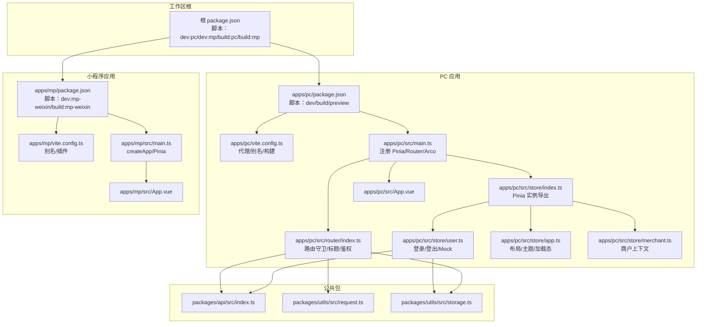
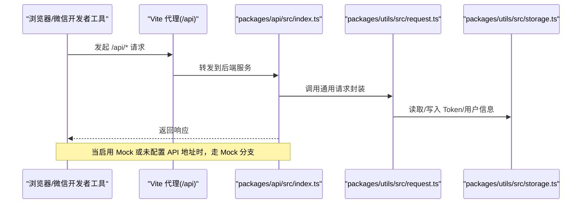
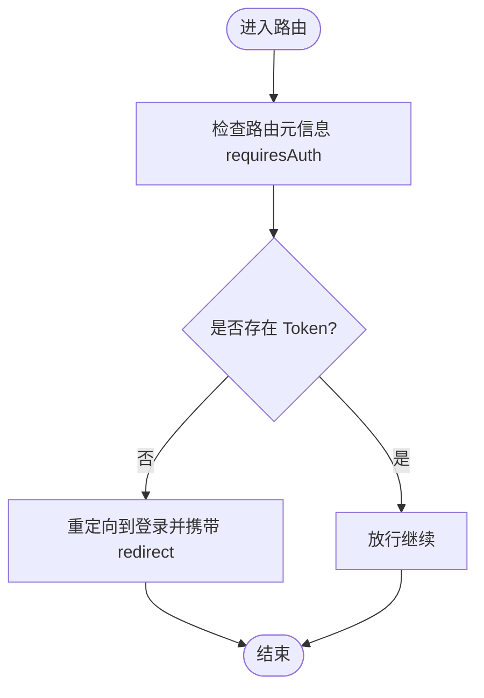
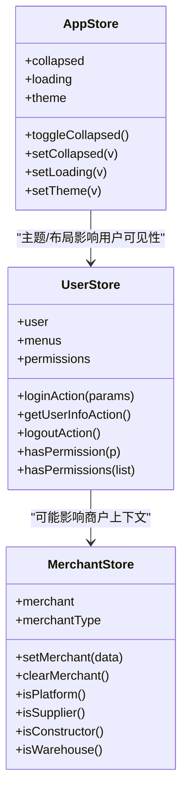
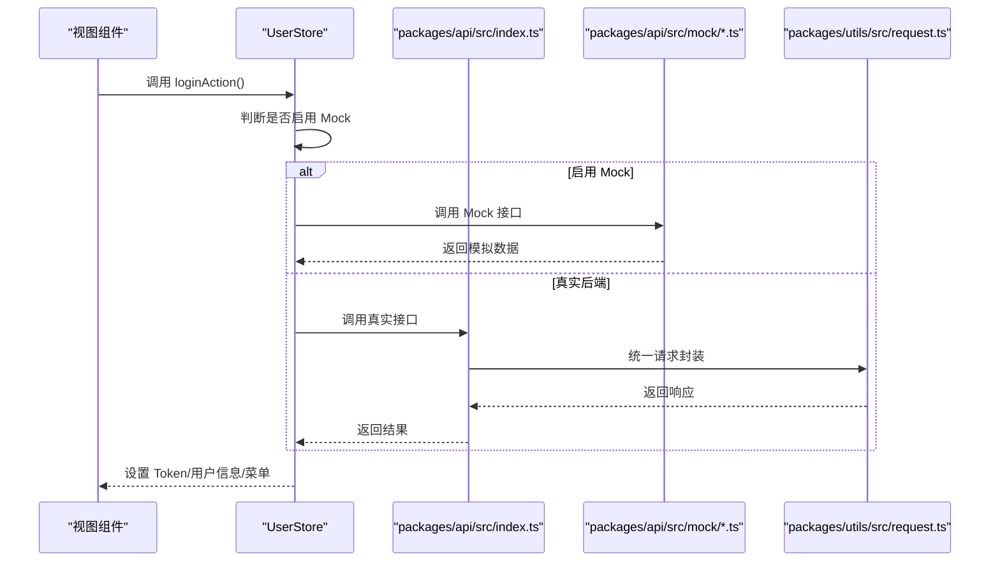
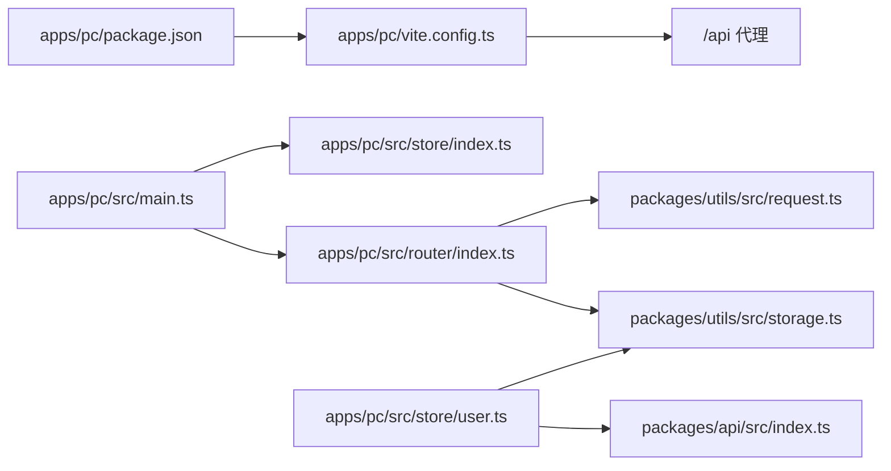

# 调试指南

<cite>
**本文引用的文件**
- [package.json](file://package.json)
- [apps/pc/package.json](file://apps/pc/package.json)
- [apps/mp/package.json](file://apps/mp/package.json)
- [apps/pc/vite.config.ts](file://apps/pc/vite.config.ts)
- [apps/mp/vite.config.ts](file://apps/mp/vite.config.ts)
- [apps/pc/src/main.ts](file://apps/pc/src/main.ts)
- [apps/mp/src/main.ts](file://apps/mp/src/main.ts)
- [apps/pc/src/router/index.ts](file://apps/pc/src/router/index.ts)
- [apps/pc/src/store/index.ts](file://apps/pc/src/store/index.ts)
- [apps/pc/src/store/user.ts](file://apps/pc/src/store/user.ts)
- [apps/pc/src/store/app.ts](file://apps/pc/src/store/app.ts)
- [apps/pc/src/store/merchant.ts](file://apps/pc/src/store/merchant.ts)
- [apps/pc/src/App.vue](file://apps/pc/src/App.vue)
- [apps/mp/src/App.vue](file://apps/mp/src/App.vue)
- [packages/api/src/index.ts](file://packages/api/src/index.ts)
- [packages/api/src/mock/user.ts](file://packages/api/src/mock/user.ts)
- [packages/api/src/mock/product.ts](file://packages/api/src/mock/product.ts)
- [packages/api/src/mock/order.ts](file://packages/api/src/mock/order.ts)
- [packages/api/src/mock/merchant.ts](file://packages/api/src/mock/merchant.ts)
- [packages/api/src/mock/warehouse.ts](file://packages/api/src/mock/warehouse.ts)
- [packages/utils/src/request.ts](file://packages/utils/src/request.ts)
- [packages/utils/src/storage.ts](file://packages/utils/src/storage.ts)
</cite>

## 目录
1. [简介](#简介)
2. [项目结构](#项目结构)
3. [核心组件](#核心组件)
4. [架构总览](#架构总览)
5. [详细组件分析](#详细组件分析)
6. [依赖分析](#依赖分析)
7. [性能考虑](#性能考虑)
8. [故障排查指南](#故障排查指南)
9. [结论](#结论)
10. [附录](#附录)

## 简介
本调试指南面向工程材料管理平台的开发者，聚焦于多端（PC 端、小程序端）开发与调试，覆盖以下主题：
- 开发调试技巧与常用命令
- 浏览器开发者工具、Vue DevTools 使用
- 网络请求监控与拦截
- 状态管理调试（Pinia）
- 常见问题诊断与错误日志分析
- 性能瓶颈定位与优化建议
- 移动端与跨端调试要点
- Mock 数据调试与后端联调
- 调试工具推荐与环境配置最佳实践

## 项目结构
平台采用多包工作区（pnpm workspaces），包含 PC 端应用、小程序端应用、公共 API、类型定义与工具库。关键调试入口与配置集中在各应用的构建脚本、Vite 配置、主入口与状态管理中。

**图表来源**
- [package.json:1-23](file://package.json#L1-L23)
- [apps/pc/package.json:1-36](file://apps/pc/package.json#L1-L36)
- [apps/mp/package.json:1-39](file://apps/mp/package.json#L1-L39)
- [apps/pc/vite.config.ts:1-32](file://apps/pc/vite.config.ts#L1-L32)
- [apps/mp/vite.config.ts:1-17](file://apps/mp/vite.config.ts#L1-L17)
- [apps/pc/src/main.ts:1-19](file://apps/pc/src/main.ts#L1-L19)
- [apps/mp/src/main.ts:1-14](file://apps/mp/src/main.ts#L1-L14)
- [apps/pc/src/router/index.ts:1-790](file://apps/pc/src/router/index.ts#L1-L790)
- [apps/pc/src/store/index.ts:1-10](file://apps/pc/src/store/index.ts#L1-L10)
- [apps/pc/src/store/user.ts:1-112](file://apps/pc/src/store/user.ts#L1-L112)
- [apps/pc/src/store/app.ts:1-36](file://apps/pc/src/store/app.ts#L1-L36)
- [apps/pc/src/store/merchant.ts:1-49](file://apps/pc/src/store/merchant.ts#L1-L49)
- [apps/pc/src/App.vue:1-11](file://apps/pc/src/App.vue#L1-L11)
- [apps/mp/src/App.vue:1-24](file://apps/mp/src/App.vue#L1-L24)
- [packages/api/src/index.ts](file://packages/api/src/index.ts)
- [packages/utils/src/request.ts](file://packages/utils/src/request.ts)
- [packages/utils/src/storage.ts](file://packages/utils/src/storage.ts)

**章节来源**
- [package.json:1-23](file://package.json#L1-L23)
- [apps/pc/package.json:1-36](file://apps/pc/package.json#L1-L36)
- [apps/mp/package.json:1-39](file://apps/mp/package.json#L1-L39)
- [apps/pc/vite.config.ts:1-32](file://apps/pc/vite.config.ts#L1-L32)
- [apps/mp/vite.config.ts:1-17](file://apps/mp/vite.config.ts#L1-L17)

## 核心组件
- 构建与启动
  - 根脚本统一调度 PC/小程序开发与构建，便于一键切换端。
  - PC 端 Vite 提供本地代理、路径别名与 SourceMap；小程序端通过 uni 插件体系运行。
- 主入口与框架装配
  - PC 端在 main 中注册 Arco 组件库、Pinia、Router，并挂载应用。
  - 小程序端通过 createApp 返回 app/pinia，适配多端渲染。
- 路由与鉴权
  - 全局前置守卫读取 Token 决定是否放行或重定向至登录页。
  - 动态设置页面标题，提升调试时的导航可读性。
- 状态管理（Pinia）
  - 用户、应用、商户三类 Store 分治，职责清晰，便于隔离调试。
  - 用户 Store 支持 Mock 登录与菜单回填，便于无后端联调。
- 请求与存储
  - 统一请求封装与本地存储工具，便于在网络面板与 Application 面板定位问题。

**章节来源**
- [apps/pc/src/main.ts:1-19](file://apps/pc/src/main.ts#L1-L19)
- [apps/mp/src/main.ts:1-14](file://apps/mp/src/main.ts#L1-L14)
- [apps/pc/src/router/index.ts:1-790](file://apps/pc/src/router/index.ts#L1-L790)
- [apps/pc/src/store/user.ts:1-112](file://apps/pc/src/store/user.ts#L1-L112)
- [apps/pc/src/store/app.ts:1-36](file://apps/pc/src/store/app.ts#L1-L36)
- [apps/pc/src/store/merchant.ts:1-49](file://apps/pc/src/store/merchant.ts#L1-L49)
- [packages/utils/src/request.ts](file://packages/utils/src/request.ts)
- [packages/utils/src/storage.ts](file://packages/utils/src/storage.ts)

## 架构总览
下图展示从浏览器到后端接口的关键链路，以及 Mock 与真实 API 的切换点。

**图表来源**
- [apps/pc/vite.config.ts:20-25](file://apps/pc/vite.config.ts#L20-L25)
- [apps/pc/src/store/user.ts:40-56](file://apps/pc/src/store/user.ts#L40-L56)
- [packages/api/src/index.ts](file://packages/api/src/index.ts)
- [packages/utils/src/request.ts](file://packages/utils/src/request.ts)
- [packages/utils/src/storage.ts](file://packages/utils/src/storage.ts)

## 详细组件分析

### 路由与鉴权调试
- 关键点
  - 全局前置守卫根据 Token 控制访问，未登录自动跳转登录并携带 redirect 参数。
  - 页面标题动态设置，便于在标签页与面包屑中识别当前模块。
- 调试建议
  - 在控制台检查路由元信息与 Token 存储状态。
  - 切换 Mock 与真实后端时，观察登录流程差异与菜单回填行为。
  - 使用浏览器网络面板验证 /api/* 是否被正确代理。

**图表来源**
- [apps/pc/src/router/index.ts:776-787](file://apps/pc/src/router/index.ts#L776-L787)

**章节来源**
- [apps/pc/src/router/index.ts:1-790](file://apps/pc/src/router/index.ts#L1-L790)

### 状态管理调试（Pinia）
- 用户 Store
  - 支持 Mock 登录与菜单回填，便于离线调试。
  - 登出逻辑区分 Mock 与真实后端，避免异常中断。
- 应用 Store
  - 主题切换通过 DOM 属性生效，便于在 DevTools 中直接切换主题。
- 商户 Store
  - 维护商户类型判断逻辑，便于在不同角色下调试界面与权限。

**图表来源**
- [apps/pc/src/store/user.ts:1-112](file://apps/pc/src/store/user.ts#L1-L112)
- [apps/pc/src/store/app.ts:1-36](file://apps/pc/src/store/app.ts#L1-L36)
- [apps/pc/src/store/merchant.ts:1-49](file://apps/pc/src/store/merchant.ts#L1-L49)

**章节来源**
- [apps/pc/src/store/user.ts:1-112](file://apps/pc/src/store/user.ts#L1-L112)
- [apps/pc/src/store/app.ts:1-36](file://apps/pc/src/store/app.ts#L1-L36)
- [apps/pc/src/store/merchant.ts:1-49](file://apps/pc/src/store/merchant.ts#L1-L49)

### 网络请求与 Mock 调试
- 代理与 Mock
  - PC 端通过 Vite 代理 /api 到本地后端；当启用 Mock 或未配置 API 地址时，用户 Store 走 Mock 分支。
  - Mock 数据位于 packages/api/src/mock 下，覆盖用户、商品、订单、商户、仓库等模块。
- 调试建议
  - 打开浏览器 Network 面板，过滤 XHR/Fetch，观察 /api/* 请求与响应。
  - 在控制台打印 Token 与用户信息，核对鉴权头是否正确。
  - 切换 Mock 与真实后端对比行为差异，定位接口契约不一致问题。

**图表来源**
- [apps/pc/src/store/user.ts:40-73](file://apps/pc/src/store/user.ts#L40-L73)
- [packages/api/src/index.ts](file://packages/api/src/index.ts)
- [packages/api/src/mock/user.ts](file://packages/api/src/mock/user.ts)
- [packages/utils/src/request.ts](file://packages/utils/src/request.ts)

**章节来源**
- [apps/pc/vite.config.ts:20-25](file://apps/pc/vite.config.ts#L20-L25)
- [apps/pc/src/store/user.ts:40-73](file://apps/pc/src/store/user.ts#L40-L73)
- [packages/api/src/mock/user.ts](file://packages/api/src/mock/user.ts)

### 移动端与跨端调试
- 小程序端
  - 使用 uni 插件体系，支持微信开发者工具真机调试。
  - App.vue 生命周期钩子可用于全局日志与初始化。
- 跨端注意事项
  - 样式与交互在不同端可能存在差异，优先以最小复现单元进行调试。
  - 使用 VConsole 或 uni 自带调试工具辅助定位。

**章节来源**
- [apps/mp/package.json:5-10](file://apps/mp/package.json#L5-L10)
- [apps/mp/src/App.vue:1-24](file://apps/mp/src/App.vue#L1-L24)
- [apps/mp/vite.config.ts:1-17](file://apps/mp/vite.config.ts#L1-L17)

## 依赖分析
- 多包工作区
  - 根脚本统一调度 PC/小程序端开发与构建。
  - Vite 配置通过别名指向 packages 下的公共包，便于共享类型、常量与工具。
- 关键耦合点
  - 路由依赖鉴权工具与存储工具。
  - 用户 Store 依赖 API 与存储工具，同时受 Mock 标志影响。
  - PC 端通过 Vite 代理连接后端服务。

**图表来源**
- [apps/pc/package.json:1-36](file://apps/pc/package.json#L1-L36)
- [apps/pc/vite.config.ts:6-26](file://apps/pc/vite.config.ts#L6-L26)
- [apps/pc/src/main.ts:1-19](file://apps/pc/src/main.ts#L1-L19)
- [apps/pc/src/router/index.ts:1-790](file://apps/pc/src/router/index.ts#L1-L790)
- [apps/pc/src/store/user.ts:1-112](file://apps/pc/src/store/user.ts#L1-L112)
- [packages/utils/src/storage.ts](file://packages/utils/src/storage.ts)
- [packages/utils/src/request.ts](file://packages/utils/src/request.ts)
- [packages/api/src/index.ts](file://packages/api/src/index.ts)

**章节来源**
- [apps/pc/package.json:1-36](file://apps/pc/package.json#L1-L36)
- [apps/pc/vite.config.ts:1-32](file://apps/pc/vite.config.ts#L1-L32)

## 性能考虑
- 构建与源码映射
  - PC 端开启 SourceMap，便于定位生产问题。
- 资源体积与懒加载
  - 路由组件采用动态导入，减少首屏体积。
- 状态与渲染
  - Pinia Store 按模块拆分，避免不必要的响应式更新。
- 网络层
  - 统一请求封装与拦截器，减少重复逻辑与网络抖动。

**章节来源**
- [apps/pc/vite.config.ts:29](file://apps/pc/vite.config.ts#L29)
- [apps/pc/src/router/index.ts:4-790](file://apps/pc/src/router/index.ts#L4-L790)
- [packages/utils/src/request.ts](file://packages/utils/src/request.ts)

## 故障排查指南

### 常见问题与诊断步骤
- 登录后无法进入首页
  - 检查 Token 是否写入与路由守卫逻辑。
  - 观察 Network 面板 /api/* 请求是否成功。
  - 若启用 Mock，确认用户与菜单回填是否正常。
- 页面空白或样式异常
  - 检查 main.ts 中组件库与样式引入顺序。
  - 查看 Console 是否有运行时错误。
- 跨端样式错位
  - 使用设备模拟器与真机调试，优先缩小到单页面组件。
- Mock 与真实后端切换不生效
  - 校验环境变量与用户 Store 的 Mock 分支逻辑。

### 错误日志分析
- 控制台日志
  - 在路由守卫、登录流程、登出流程中添加关键日志点。
- 网络面板
  - 过滤 /api/*，关注状态码、响应体与耗时。
- 应用面板
  - 检查 LocalStorage/SessionStorage 中 Token 与用户信息是否正确。

### 性能瓶颈定位
- 首屏加载慢
  - 使用 Performance 面板录制首屏渲染，关注长任务与阻塞资源。
- 路由切换卡顿
  - 检查动态导入的组件体积与懒加载是否生效。
- 状态频繁更新
  - 使用 Vue DevTools 观察 Store 变更频率，避免过度响应。

### 移动端与跨端调试
- 微信开发者工具
  - 使用断点与日志定位逻辑问题。
- 真机联调
  - 通过内网穿透或局域网 IP 访问本地服务，验证真实网络环境下的表现。

### Mock 数据调试
- 启用 Mock
  - 在用户 Store 中触发 Mock 登录，快速验证前端逻辑。
- 扩展 Mock
  - 在 packages/api/src/mock 下新增模块，保持与真实接口的字段对齐。

**章节来源**
- [apps/pc/src/router/index.ts:776-787](file://apps/pc/src/router/index.ts#L776-L787)
- [apps/pc/src/store/user.ts:40-73](file://apps/pc/src/store/user.ts#L40-L73)
- [packages/api/src/mock/user.ts](file://packages/api/src/mock/user.ts)

## 结论
本指南围绕工程材料管理平台的多端架构，提供了从构建、路由、状态管理到网络与 Mock 的全链路调试方法。建议开发者在日常开发中：
- 固化 Mock 与真实后端的切换流程
- 使用浏览器与小程序工具链进行可视化调试
- 借助路由守卫与 Store 的可观测性快速定位问题
- 通过 SourceMap 与性能面板持续优化体验

## 附录

### 调试工具推荐
- 浏览器
  - Network：监控请求与响应
  - Application：查看缓存与存储
  - Performance：分析首屏与交互性能
  - Vue DevTools：调试组件与状态
- 小程序
  - 微信开发者工具：断点、日志与真机调试
- 其他
  - VConsole：移动端快速日志输出

### 调试环境配置最佳实践
- 本地代理
  - 通过 Vite 代理 /api，确保前后端联调稳定。
- 环境变量
  - 使用 Mock 标志与 API 地址控制登录分支与接口地址。
- 构建参数
  - 生产构建开启 SourceMap，便于线上问题回溯。

**章节来源**
- [apps/pc/vite.config.ts:6-26](file://apps/pc/vite.config.ts#L6-L26)
- [apps/pc/src/store/user.ts:40-49](file://apps/pc/src/store/user.ts#L40-L49)
- [apps/pc/src/main.ts:11-18](file://apps/pc/src/main.ts#L11-L18)