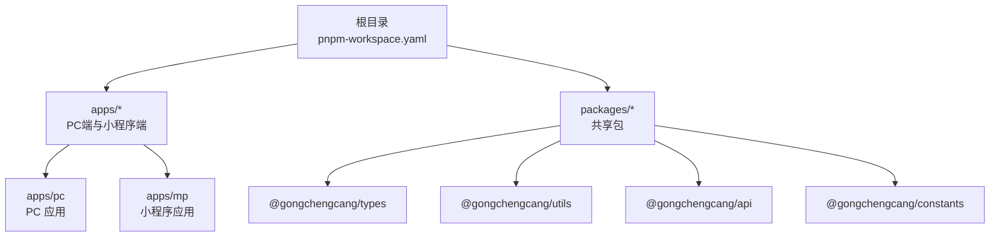
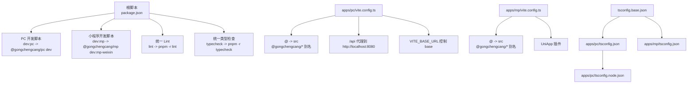
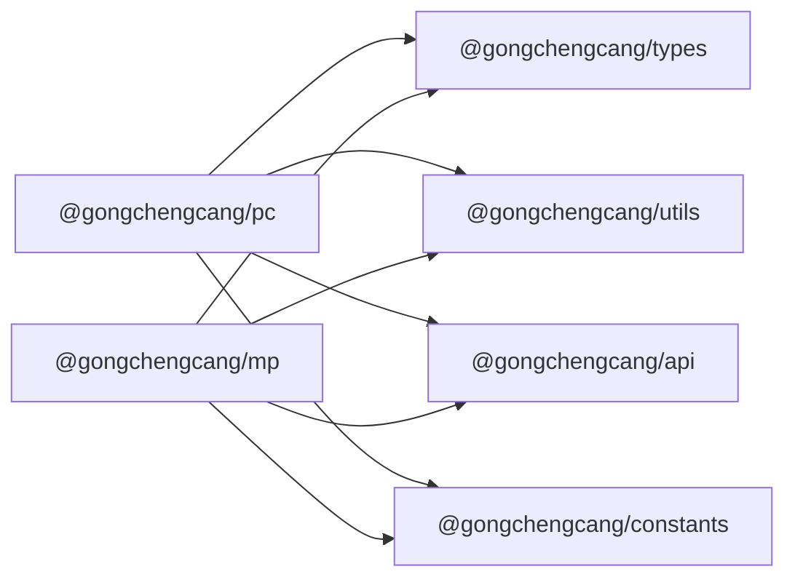

# 项目配置

<cite>
**本文引用的文件**
- [pnpm-workspace.yaml](file://pnpm-workspace.yaml)
- [package.json](file://package.json)
- [tsconfig.base.json](file://tsconfig.base.json)
- [apps/pc/vite.config.ts](file://apps/pc/vite.config.ts)
- [apps/mp/vite.config.ts](file://apps/mp/vite.config.ts)
- [apps/pc/tsconfig.json](file://apps/pc/tsconfig.json)
- [apps/pc/tsconfig.node.json](file://apps/pc/tsconfig.node.json)
- [apps/mp/tsconfig.json](file://apps/mp/tsconfig.json)
- [apps/pc/package.json](file://apps/pc/package.json)
- [apps/mp/package.json](file://apps/mp/package.json)
- [packages/types/package.json](file://packages/types/package.json)
- [packages/utils/package.json](file://packages/utils/package.json)
- [packages/api/package.json](file://packages/api/package.json)
- [packages/constants/package.json](file://packages/constants/package.json)
- [vercel.json](file://vercel.json)
</cite>

## 目录
1. [简介](#简介)
2. [项目结构](#项目结构)
3. [核心组件](#核心组件)
4. [架构总览](#架构总览)
5. [详细组件分析](#详细组件分析)
6. [依赖关系分析](#依赖关系分析)
7. [性能考虑](#性能考虑)
8. [故障排查指南](#故障排查指南)
9. [结论](#结论)
10. [附录](#附录)

## 简介
本文件面向工程材料管理平台的配置与运维人员，系统性梳理 Monorepo 工作空间、Vite 构建、TypeScript 类型检查与路径别名、以及跨端（H5/小程序）差异与环境变量策略。目标是帮助开发者快速理解并安全地修改项目配置，确保在开发、预览与生产部署中的一致性与可维护性。

## 项目结构
本项目采用 pnpm workspaces 的 Monorepo 结构，根目录通过工作空间配置声明包范围，并在各应用与共享包中分别定义独立的构建与类型检查配置。应用层包含 PC 端与小程序端，共享包包含类型、常量、工具与 API 客户端等。

图表来源
- [pnpm-workspace.yaml:1-4](file://pnpm-workspace.yaml#L1-L4)
- [apps/pc/package.json:1-36](file://apps/pc/package.json#L1-L36)
- [apps/mp/package.json:1-39](file://apps/mp/package.json#L1-L39)
- [packages/types/package.json:1-11](file://packages/types/package.json#L1-L11)
- [packages/utils/package.json:1-14](file://packages/utils/package.json#L1-L14)
- [packages/api/package.json:1-11](file://packages/api/package.json#L1-L11)
- [packages/constants/package.json:1-11](file://packages/constants/package.json#L1-L11)

章节来源
- [pnpm-workspace.yaml:1-4](file://pnpm-workspace.yaml#L1-L4)
- [package.json:6-12](file://package.json#L6-L12)

## 核心组件
- Monorepo 工作空间：通过 pnpm 工作空间统一管理多包，支持跨包脚本与依赖解析。
- Vite 配置：PC 端使用 Vue 插件与代理、源码映射；小程序端使用 UniApp 插件与路径别名。
- TypeScript 基础配置：统一编译选项、严格模式、路径别名与模块解析策略。
- 跨端差异：PC 端基于浏览器运行，小程序端基于 UniApp 编译到多端。
- 环境变量与部署：PC 端通过环境变量控制基础路径与代理；部署策略由 vercel.json 与脚本共同定义。

章节来源
- [apps/pc/vite.config.ts:1-32](file://apps/pc/vite.config.ts#L1-L32)
- [apps/mp/vite.config.ts:1-17](file://apps/mp/vite.config.ts#L1-L17)
- [tsconfig.base.json:1-29](file://tsconfig.base.json#L1-L29)
- [apps/pc/tsconfig.json:1-16](file://apps/pc/tsconfig.json#L1-L16)
- [apps/mp/tsconfig.json:1-16](file://apps/mp/tsconfig.json#L1-L16)
- [apps/pc/tsconfig.node.json:1-12](file://apps/pc/tsconfig.node.json#L1-L12)

## 架构总览
下图展示从脚本入口到构建与运行的关键路径，包括工作空间脚本、Vite 配置、TypeScript 类型检查与跨端插件。

图表来源
- [package.json:6-12](file://package.json#L6-L12)
- [apps/pc/vite.config.ts:5-31](file://apps/pc/vite.config.ts#L5-L31)
- [apps/mp/vite.config.ts:5-16](file://apps/mp/vite.config.ts#L5-L16)
- [tsconfig.base.json:21-26](file://tsconfig.base.json#L21-L26)
- [apps/pc/tsconfig.json:2-14](file://apps/pc/tsconfig.json#L2-L14)
- [apps/mp/tsconfig.json:2-14](file://apps/mp/tsconfig.json#L2-L14)
- [apps/pc/tsconfig.node.json:1-12](file://apps/pc/tsconfig.node.json#L1-L12)

## 详细组件分析

### Monorepo 工作空间配置
- 工作空间范围：packages/* 与 apps/*。
- 根脚本：通过 pnpm -F 指定工作区包执行命令，实现对 PC 与小程序的统一入口。
- 共享包：types、utils、api、constants 以 workspace:* 形式被应用依赖，保证版本一致性与类型/工具复用。

章节来源
- [pnpm-workspace.yaml:1-4](file://pnpm-workspace.yaml#L1-L4)
- [package.json:6-12](file://package.json#L6-L12)
- [apps/pc/package.json:16-24](file://apps/pc/package.json#L16-L24)
- [apps/mp/package.json:17-23](file://apps/mp/package.json#L17-L23)
- [packages/types/package.json:1-11](file://packages/types/package.json#L1-L11)
- [packages/utils/package.json:1-14](file://packages/utils/package.json#L1-L14)
- [packages/api/package.json:1-11](file://packages/api/package.json#L1-L11)
- [packages/constants/package.json:1-11](file://packages/constants/package.json#L1-L11)

### Vite 构建配置（PC 端）
- 插件：Vue 插件。
- 路径别名：@ 指向 src；@gongchengcang/* 指向共享包源码。
- 服务器：host 与 port 固定，便于局域网联调；/api 代理到本地后端服务。
- 构建：输出目录 dist，开启源码映射以便调试。
- 基础路径：可通过 VITE_BASE_URL 控制，用于部署在子路径时的静态资源路径。

章节来源
- [apps/pc/vite.config.ts:1-32](file://apps/pc/vite.config.ts#L1-L32)

### Vite 构建配置（小程序端）
- 插件：UniApp 插件，负责多端编译与运行。
- 路径别名：同 PC 端，统一 @ 与 @gongchengcang/* 别名。
- 运行：开发与构建分别通过 uni 与 uni build，支持 H5 与微信小程序等平台。

章节来源
- [apps/mp/vite.config.ts:1-17](file://apps/mp/vite.config.ts#L1-L17)
- [apps/mp/package.json:5-10](file://apps/mp/package.json#L5-L10)

### TypeScript 配置
- 基础配置（tsconfig.base.json）：
  - 统一编译目标、模块系统、严格模式、模块解析策略为 bundler。
  - 启用声明生成、映射与源码映射，便于类型检查与调试。
  - 定义 baseUrl 与 paths，覆盖 @ 与 @gongchengcang/* 别名。
- 应用层 tsconfig：
  - PC：继承基础配置，额外 include Vue 文件与 ts 参考 tsconfig.node.json。
  - MP：继承基础配置，include 中加入 Vue 文件，并声明类型 @dcloudio/types。
- Node 层 tsconfig（PC）：复合编译、严格模式与 bundler 解析，仅包含 vite.config.ts。

章节来源
- [tsconfig.base.json:1-29](file://tsconfig.base.json#L1-L29)
- [apps/pc/tsconfig.json:1-16](file://apps/pc/tsconfig.json#L1-L16)
- [apps/mp/tsconfig.json:1-16](file://apps/mp/tsconfig.json#L1-L16)
- [apps/pc/tsconfig.node.json:1-12](file://apps/pc/tsconfig.node.json#L1-L12)

### 环境变量与部署策略
- 环境变量：
  - VITE_BASE_URL：用于设置 PC 端构建的基础路径，适配子路径部署。
  - /api 代理：PC 端开发服务器通过代理访问后端服务，便于前后端分离联调。
- 部署：
  - vercel.json：定义构建命令、输出目录与重写规则，确保路由与静态资源正确分发。
  - 根脚本 deploy：PC 端构建后复制 404 页面并使用 gh-pages 发布（如需 GitHub Pages）。

章节来源
- [apps/pc/vite.config.ts:6](file://apps/pc/vite.config.ts#L6)
- [apps/pc/vite.config.ts:20-25](file://apps/pc/vite.config.ts#L20-L25)
- [vercel.json:1-11](file://vercel.json#L1-L11)
- [apps/pc/package.json:12](file://apps/pc/package.json#L12)

### 跨端配置差异
- 运行时差异：
  - PC 端：浏览器环境，使用 Vue 生态与 Vite，具备代理与热更新能力。
  - 小程序端：UniApp 编译到多端，使用 @dcloudio/uni-* 依赖与插件，开发与构建方式不同。
- 路径别名一致：两端均使用 @ 与 @gongchengcang/* 别名，降低迁移成本。
- 类型支持：小程序端 include 类型 @dcloudio/types，PC 端不包含该类型声明。

章节来源
- [apps/pc/package.json:14-24](file://apps/pc/package.json#L14-L24)
- [apps/mp/package.json:12-36](file://apps/mp/package.json#L12-L36)
- [apps/mp/tsconfig.json:12](file://apps/mp/tsconfig.json#L12)

## 依赖关系分析
- 包依赖：
  - 应用依赖共享包：@gongchengcang/types、@gongchengcang/utils、@gongchengcang/api、@gongchengcang/constants。
  - 应用依赖第三方库：PC 端包含 vue-router、@arco-design/web-vue；小程序端包含 uni-app 生态与 sass。
- 类型检查：
  - 各包与应用均提供 typecheck 脚本，统一通过根脚本 pnpm -r typecheck 执行。

图表来源
- [apps/pc/package.json:16-24](file://apps/pc/package.json#L16-L24)
- [apps/mp/package.json:17-23](file://apps/mp/package.json#L17-L23)

章节来源
- [apps/pc/package.json:16-24](file://apps/pc/package.json#L16-L24)
- [apps/mp/package.json:17-23](file://apps/mp/package.json#L17-L23)
- [packages/types/package.json:1-11](file://packages/types/package.json#L1-L11)
- [packages/utils/package.json:1-14](file://packages/utils/package.json#L1-L14)
- [packages/api/package.json:1-11](file://packages/api/package.json#L1-L11)
- [packages/constants/package.json:1-11](file://packages/constants/package.json#L1-L11)

## 性能考虑
- 源码映射：PC 端构建开启 sourcemap，便于定位问题但会增大体积，建议生产关闭或使用内联映射策略。
- 代理与网络：开发阶段通过 /api 代理避免跨域，生产环境应确保后端 CORS 或反向代理配置正确。
- 路径别名：统一别名减少模块解析开销，避免深层相对路径导致的解析冲突。
- 类型检查：在 CI 中执行 typecheck，避免运行时类型错误；本地开发可按需启用增量检查。

## 故障排查指南
- 无法解析 @gongchengcang/* 别名
  - 检查 tsconfig.base.json 与应用层 tsconfig.json 的 paths 是否一致。
  - 确认 pnpm 已安装工作空间包且版本为 workspace:*。
- PC 端代理无效
  - 检查 /api 代理配置是否指向正确的后端地址。
  - 确认后端服务已启动且允许跨域访问。
- VITE_BASE_URL 导致资源路径异常
  - 在子路径部署时设置 VITE_BASE_URL，确保静态资源与路由匹配。
- 小程序端类型报错
  - 确认 apps/mp/tsconfig.json 中包含 @dcloudio/types 类型声明。
- 构建失败或类型检查报错
  - 使用根脚本 pnpm -r typecheck 或 pnpm -r lint 定位问题。

章节来源
- [tsconfig.base.json:21-26](file://tsconfig.base.json#L21-L26)
- [apps/pc/vite.config.ts:6](file://apps/pc/vite.config.ts#L6)
- [apps/pc/vite.config.ts:20-25](file://apps/pc/vite.config.ts#L20-L25)
- [apps/mp/tsconfig.json:12](file://apps/mp/tsconfig.json#L12)
- [package.json:11-12](file://package.json#L11-L12)

## 结论
本项目通过 pnpm 工作空间实现多包协同，借助 Vite 与 TypeScript 提供一致的开发体验与严格的类型保障。PC 端与小程序端在运行时与生态上存在差异，但通过统一的别名与配置策略，降低了跨端迁移成本。建议在团队内明确配置修改流程与校验机制，确保变更可追溯、可复现。

## 附录

### 常用配置项速查
- 路径别名
  - @：指向 src
  - @gongchengcang/types、@gongchengcang/utils、@gongchengcang/api、@gongchengcang/constants：指向对应共享包源码
- Vite（PC 端）
  - base：受 VITE_BASE_URL 控制
  - server.proxy：/api 代理到后端
  - build.outDir：dist
  - build.sourcemap：布尔值
- Vite（小程序端）
  - 插件：@dcloudio/vite-plugin-uni
  - 运行：uni / uni build
- TypeScript
  - moduleResolution：bundler
  - strict：true
  - declaration/declarationMap/sourceMap：开启以支持类型与调试
- 环境变量
  - VITE_BASE_URL：用于设置基础路径
- 部署
  - vercel.json：构建命令、输出目录与重写规则
  - 根脚本 deploy：复制 404 页面并发布至 gh-pages（如需）

章节来源
- [tsconfig.base.json:21-26](file://tsconfig.base.json#L21-L26)
- [apps/pc/vite.config.ts:6](file://apps/pc/vite.config.ts#L6)
- [apps/pc/vite.config.ts:20-25](file://apps/pc/vite.config.ts#L20-L25)
- [apps/pc/vite.config.ts:27-30](file://apps/pc/vite.config.ts#L27-L30)
- [apps/mp/vite.config.ts:5-16](file://apps/mp/vite.config.ts#L5-L16)
- [apps/pc/tsconfig.json:2-14](file://apps/pc/tsconfig.json#L2-L14)
- [apps/mp/tsconfig.json:2-14](file://apps/mp/tsconfig.json#L2-L14)
- [apps/pc/tsconfig.node.json:1-12](file://apps/pc/tsconfig.node.json#L1-L12)
- [vercel.json:1-11](file://vercel.json#L1-L11)
- [apps/pc/package.json:12](file://apps/pc/package.json#L12)