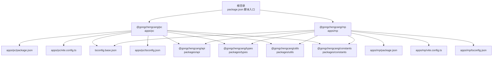
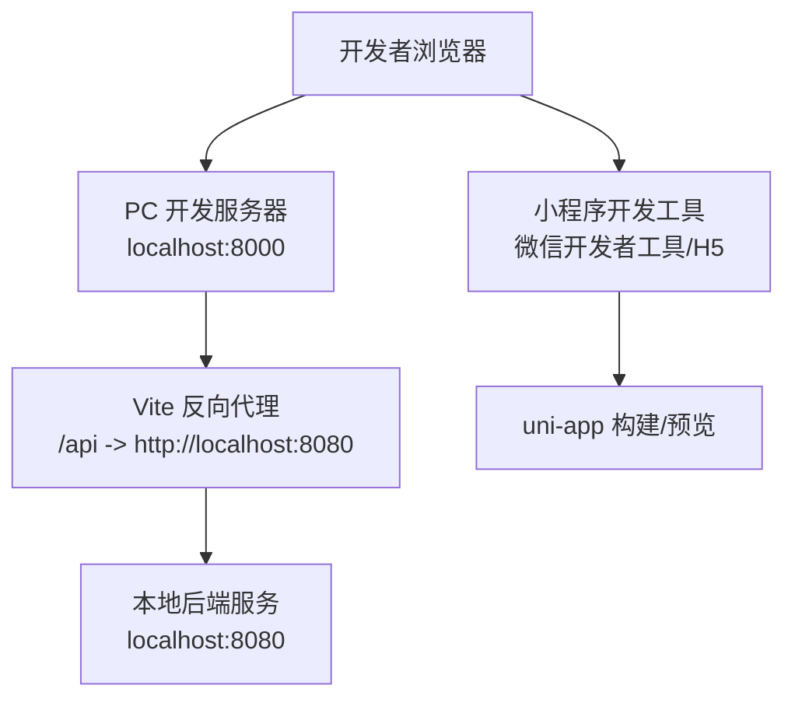
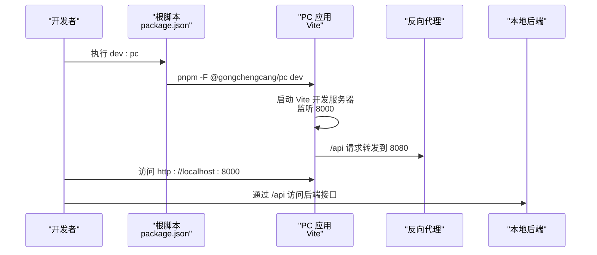
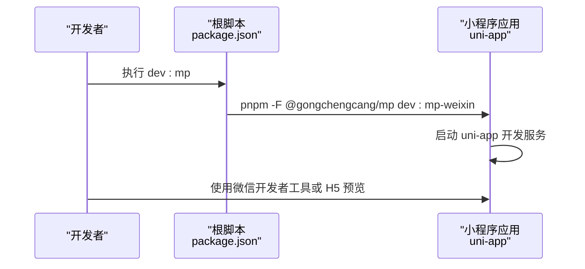
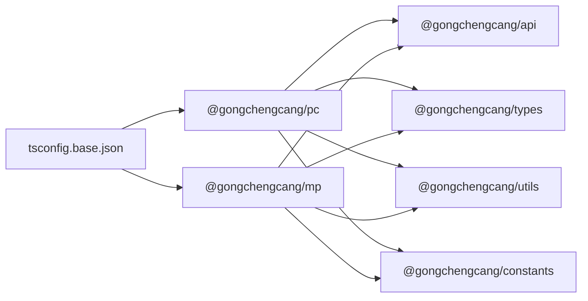

# 快速开始

<cite>
**本文引用的文件**
- [package.json](file://package.json)
- [pnpm-workspace.yaml](file://pnpm-workspace.yaml)
- [apps/pc/package.json](file://apps/pc/package.json)
- [apps/pc/vite.config.ts](file://apps/pc/vite.config.ts)
- [apps/pc/src/main.ts](file://apps/pc/src/main.ts)
- [apps/pc/src/App.vue](file://apps/pc/src/App.vue)
- [apps/pc/tsconfig.json](file://apps/pc/tsconfig.json)
- [apps/mp/package.json](file://apps/mp/package.json)
- [apps/mp/vite.config.ts](file://apps/mp/vite.config.ts)
- [apps/mp/src/main.ts](file://apps/mp/src/main.ts)
- [apps/mp/src/App.vue](file://apps/mp/src/App.vue)
- [apps/mp/tsconfig.json](file://apps/mp/tsconfig.json)
- [tsconfig.base.json](file://tsconfig.base.json)
- [packages/api/package.json](file://packages/api/package.json)
- [packages/types/package.json](file://packages/types/package.json)
- [搭建教程.md](file://搭建教程.md)
</cite>

## 目录
1. [简介](#简介)
2. [项目结构](#项目结构)
3. [核心组件](#核心组件)
4. [架构总览](#架构总览)
5. [详细组件分析](#详细组件分析)
6. [依赖分析](#依赖分析)
7. [性能注意事项](#性能注意事项)
8. [故障排查指南](#故障排查指南)
9. [结论](#结论)
10. [附录](#附录)

## 简介
本指南面向新加入的开发者，帮助你在约30分钟内完成工程材料管理平台的本地开发环境搭建，并成功运行PC端与小程序端。你将获得：
- 开发环境要求（Node.js、pnpm 版本建议）
- 项目克隆与安装步骤
- 依赖安装与开发服务器启动方法
- PC端与小程序端分别的开发命令
- 环境变量与代理配置说明
- 常见问题与调试技巧

## 项目结构
该工程采用 pnpm workspaces 的 Monorepo 架构，包含两个应用与若干共享包：
- apps/pc：PC 管理后台（Vue 3 + Vite）
- apps/mp：小程序端（基于 uni-app，支持微信小程序与 H5）
- packages/*：公共包（api、types、utils、constants），被应用以 workspace:* 方式引用
- 根 package.json：统一的开发与构建脚本入口

图表来源
- [package.json:1-23](file://package.json#L1-L23)
- [pnpm-workspace.yaml:1-4](file://pnpm-workspace.yaml#L1-L4)
- [apps/pc/package.json:1-36](file://apps/pc/package.json#L1-L36)
- [apps/mp/package.json:1-39](file://apps/mp/package.json#L1-L39)
- [apps/pc/vite.config.ts:1-32](file://apps/pc/vite.config.ts#L1-L32)
- [apps/mp/vite.config.ts:1-17](file://apps/mp/vite.config.ts#L1-L17)
- [tsconfig.base.json:1-29](file://tsconfig.base.json#L1-L29)
- [packages/api/package.json:1-11](file://packages/api/package.json#L1-L11)
- [packages/types/package.json:1-11](file://packages/types/package.json#L1-L11)

章节来源
- [package.json:1-23](file://package.json#L1-L23)
- [pnpm-workspace.yaml:1-4](file://pnpm-workspace.yaml#L1-L4)
- [apps/pc/package.json:1-36](file://apps/pc/package.json#L1-L36)
- [apps/mp/package.json:1-39](file://apps/mp/package.json#L1-L39)
- [apps/pc/vite.config.ts:1-32](file://apps/pc/vite.config.ts#L1-L32)
- [apps/mp/vite.config.ts:1-17](file://apps/mp/vite.config.ts#L1-L17)
- [tsconfig.base.json:1-29](file://tsconfig.base.json#L1-L29)
- [packages/api/package.json:1-11](file://packages/api/package.json#L1-L11)
- [packages/types/package.json:1-11](file://packages/types/package.json#L1-L11)

## 核心组件
- 根脚本入口：通过 pnpm -F 指定工作区包，统一管理开发与构建命令
- PC 端：Vite + Vue 3 + Arco Design + Pinia + Vue Router；内置反向代理 /api 到本地后端服务
- 小程序端：uni-app（mp-weixin）+ Vite 插件；支持微信小程序与 H5 双端开发
- 公共包：以 workspace:* 引用，确保类型、常量与 API 定义在两端共享

章节来源
- [package.json:6-12](file://package.json#L6-L12)
- [apps/pc/vite.config.ts:6-26](file://apps/pc/vite.config.ts#L6-L26)
- [apps/mp/vite.config.ts:5-16](file://apps/mp/vite.config.ts#L5-L16)
- [apps/pc/package.json:14-24](file://apps/pc/package.json#L14-L24)
- [apps/mp/package.json:12-24](file://apps/mp/package.json#L12-L24)

## 架构总览
下图展示了本地开发时的请求流向与端口占用关系：

图表来源
- [apps/pc/vite.config.ts:17-25](file://apps/pc/vite.config.ts#L17-L25)

章节来源
- [apps/pc/vite.config.ts:6-31](file://apps/pc/vite.config.ts#L6-L31)

## 详细组件分析

### PC 端开发环境
- 启动命令：根目录执行 npm run dev:pc 或直接进入 apps/pc 并执行 npm run dev
- 服务器配置：host=0.0.0.0，port=8000，默认开启 /api 代理至 http://localhost:8080
- 路由基座：history 模式，base 默认为 /gongchengcang/（可通过环境变量覆盖）

图表来源
- [package.json:7](file://package.json#L7)
- [apps/pc/vite.config.ts:17-25](file://apps/pc/vite.config.ts#L17-L25)

章节来源
- [package.json:6-12](file://package.json#L6-L12)
- [apps/pc/vite.config.ts:6-31](file://apps/pc/vite.config.ts#L6-L31)
- [apps/pc/src/main.ts:1-19](file://apps/pc/src/main.ts#L1-L19)
- [apps/pc/src/App.vue:1-11](file://apps/pc/src/App.vue#L1-L11)
- [apps/pc/tsconfig.json:1-16](file://apps/pc/tsconfig.json#L1-L16)

### 小程序端开发环境
- 启动命令：根目录执行 npm run dev:mp 或进入 apps/mp 并执行 npm run dev:mp-weixin
- 构建目标：默认微信小程序（mp-weixin），也可使用 dev:h5 进行 H5 预览
- 路径别名：统一指向 src 与 packages 下的公共包路径

图表来源
- [package.json:8](file://package.json#L8)
- [apps/mp/package.json:5-11](file://apps/mp/package.json#L5-L11)

章节来源
- [package.json:6-12](file://package.json#L6-L12)
- [apps/mp/package.json:1-39](file://apps/mp/package.json#L1-L39)
- [apps/mp/vite.config.ts:1-17](file://apps/mp/vite.config.ts#L1-L17)
- [apps/mp/src/main.ts:1-14](file://apps/mp/src/main.ts#L1-L14)
- [apps/mp/src/App.vue:1-24](file://apps/mp/src/App.vue#L1-L24)
- [apps/mp/tsconfig.json:1-16](file://apps/mp/tsconfig.json#L1-L16)

### 公共包与类型系统
- packages/api、packages/types 等以 workspace:* 形式被 PC 与 MP 引用
- tsconfig.base.json 统一编译选项与路径映射，确保两端一致的类型检查与导入别名

图表来源
- [apps/pc/package.json:17-20](file://apps/pc/package.json#L17-L20)
- [apps/mp/package.json:17-20](file://apps/mp/package.json#L17-L20)
- [tsconfig.base.json:21-26](file://tsconfig.base.json#L21-L26)

章节来源
- [packages/api/package.json:1-11](file://packages/api/package.json#L1-L11)
- [packages/types/package.json:1-11](file://packages/types/package.json#L1-L11)
- [tsconfig.base.json:1-29](file://tsconfig.base.json#L1-L29)

## 依赖分析
- 包管理器：pnpm（Monorepo 工作区）
- Node.js 版本：建议使用 LTS（如 18.x 或 20.x），以保证与 Vite、TypeScript、uni-app 生态兼容
- pnpm 版本：建议使用 8.x 或以上，以获得更好的工作区解析与链接性能
- 类型检查：根目录提供 typecheck 脚本，可一次性对所有包执行类型检查
- Lint：PC 端提供 ESLint 脚本，可在本地统一格式化与静态检查

章节来源
- [package.json:11-12](file://package.json#L11-L12)
- [apps/pc/package.json:11](file://apps/pc/package.json#L11)
- [搭建教程.md:432-438](file://搭建教程.md#L432-L438)

## 性能注意事项
- Vite 开发服务器默认启用热更新与按需编译，首次启动会生成依赖预构建缓存，后续启动更快
- PC 端开启 sourcemap 便于调试，但会增大体积；生产构建可关闭
- 小程序端建议仅在需要时开启 H5 预览，避免不必要的资源加载

章节来源
- [apps/pc/vite.config.ts:29](file://apps/pc/vite.config.ts#L29)
- [搭建教程.md:416-456](file://搭建教程.md#L416-L456)

## 故障排查指南
- 启动命令混淆
  - 现象：在根目录执行 npm run dev 报错
  - 原因：Monorepo 根目录与子目录命令不同
  - 解决：使用根目录脚本 npm run dev:pc 或 npm run dev:mp；或直接进入 apps/pc 或 apps/mp 执行各自脚本
- 端口冲突
  - 现象：端口 8000 或 8080 被占用
  - 解决：修改 apps/pc/vite.config.ts 中的 server.port 或后端服务端口
- 代理未生效
  - 现象：前端访问 /api 无响应
  - 解决：确认本地后端服务已启动并监听 http://localhost:8080；检查 Vite 代理配置
- 路由历史模式空白页
  - 现象：刷新页面或直接访问二级路由出现 404
  - 解决：部署时需配置回退到 index.html；开发时使用 history 模式需确保基础路径正确
- 类型检查失败
  - 现象：执行 typecheck 报错
  - 解决：根据具体报错修复类型定义或导入路径；确保 tsconfig.base.json 与各应用 tsconfig.json 保持一致

章节来源
- [搭建教程.md:432-438](file://搭建教程.md#L432-L438)
- [apps/pc/vite.config.ts:6-31](file://apps/pc/vite.config.ts#L6-L31)
- [搭建教程.md:416-456](file://搭建教程.md#L416-L456)

## 结论
按照本指南，你可以在30分钟内完成工程材料管理平台的本地开发环境搭建，并分别启动 PC 端与小程序端。建议在开发过程中：
- 使用根脚本统一管理命令，避免目录切换带来的混乱
- 配合类型检查与 Lint，提升代码质量
- 遇到问题优先查看 Vite 代理与端口占用情况

## 附录

### 环境变量与代理配置
- VITE_BASE_URL：用于设置 PC 端路由基础路径（默认 /gongchengcang/）
- /api 代理：PC 端 Vite 将 /api 请求转发至 http://localhost:8080，确保本地后端服务已启动

章节来源
- [apps/pc/vite.config.ts:6](file://apps/pc/vite.config.ts#L6)
- [apps/pc/vite.config.ts:21-24](file://apps/pc/vite.config.ts#L21-L24)

### 本地开发环境搭建流程（步骤化）
- 步骤 1：准备 Node.js 与 pnpm
  - Node.js：建议使用 LTS（18.x/20.x）
  - pnpm：建议使用 8.x+
- 步骤 2：克隆仓库并安装依赖
  - 在根目录执行 pnpm install，自动安装工作区依赖
- 步骤 3：启动后端服务（本地）
  - 启动本地后端服务并监听 http://localhost:8080
- 步骤 4：启动前端
  - PC 端：根目录执行 npm run dev:pc
  - 小程序端：根目录执行 npm run dev:mp
- 步骤 5：访问与调试
  - PC 端：浏览器访问 http://localhost:8000
  - 小程序端：使用微信开发者工具打开 apps/mp 并关联项目

章节来源
- [搭建教程.md:52-100](file://搭建教程.md#L52-L100)
- [搭建教程.md:432-438](file://搭建教程.md#L432-L438)