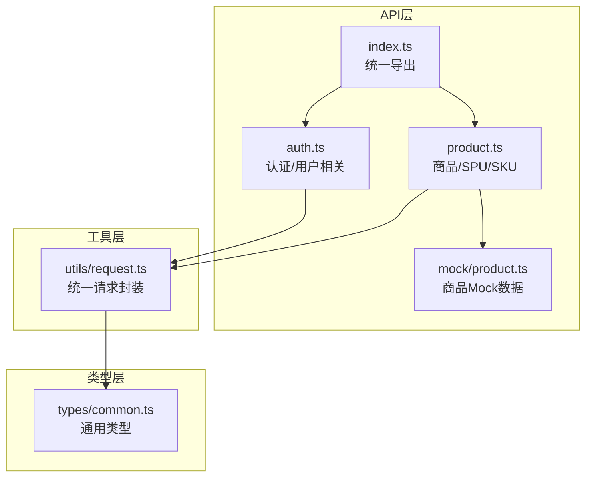
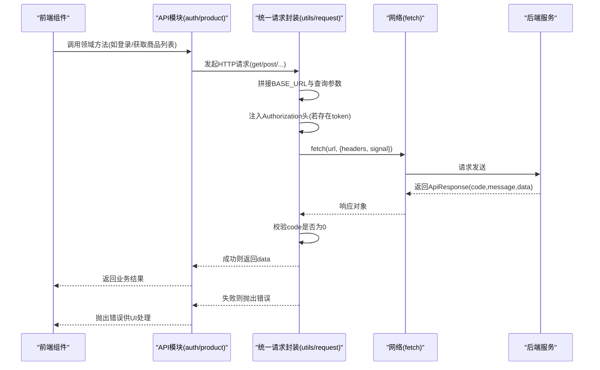
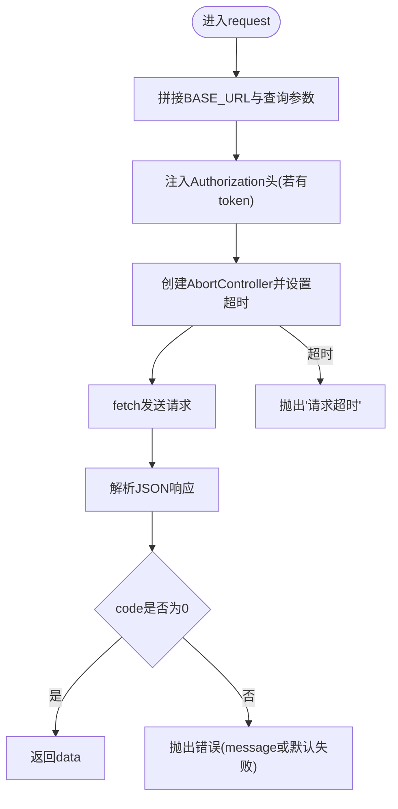
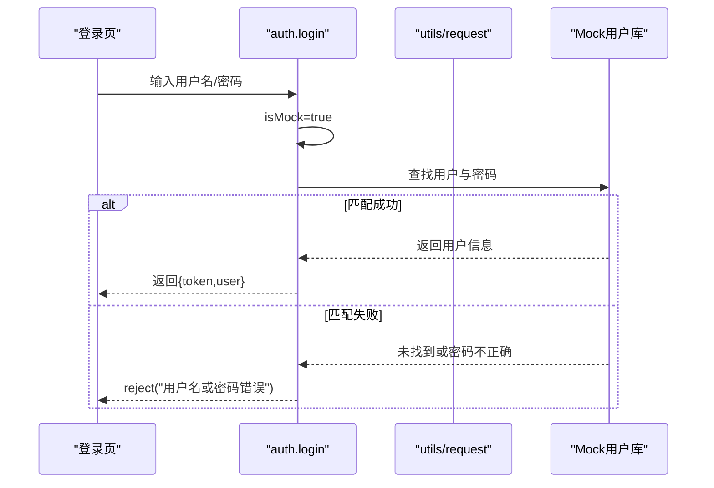
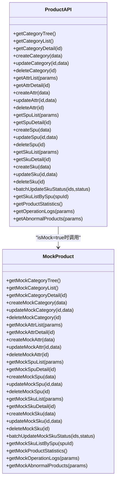
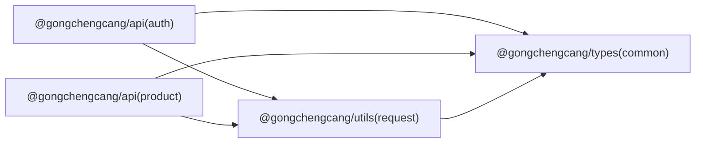

# API框架

<cite>
**本文引用的文件**
- [packages/api/src/index.ts](file://packages/api/src/index.ts)
- [packages/api/src/auth.ts](file://packages/api/src/auth.ts)
- [packages/api/src/product.ts](file://packages/api/src/product.ts)
- [packages/api/src/mock/product.ts](file://packages/api/src/mock/product.ts)
- [packages/utils/src/request.ts](file://packages/utils/src/request.ts)
- [packages/utils/src/index.ts](file://packages/utils/src/index.ts)
- [packages/types/src/index.ts](file://packages/types/src/index.ts)
- [packages/types/src/common.ts](file://packages/types/src/common.ts)
- [apps/pc/vite.config.ts](file://apps/pc/vite.config.ts)
- [package.json](file://package.json)
</cite>

## 目录
1. [简介](#简介)
2. [项目结构](#项目结构)
3. [核心组件](#核心组件)
4. [架构总览](#架构总览)
5. [详细组件分析](#详细组件分析)
6. [依赖关系分析](#依赖关系分析)
7. [性能考虑](#性能考虑)
8. [故障排查指南](#故障排查指南)
9. [结论](#结论)
10. [附录](#附录)

## 简介
本文件为“工程材料管理平台”API框架的综合技术文档，聚焦于统一API封装设计与工程落地实践。内容涵盖：
- 统一HTTP请求封装：请求拦截、响应数据处理、错误处理、超时控制
- API模块化设计：按领域拆分（用户、商品、订单、仓库、财务、资金托管、分账规则等）
- Mock数据支持：开发态离线调试与联调验证
- 环境配置与代理：Vite环境变量与本地代理配置
- 调用最佳实践、性能优化与缓存策略
- 接口文档生成、自动化测试与版本管理建议
- 实际调用示例路径、错误处理流程与数据格式规范

## 项目结构
API框架位于 packages/api，采用“模块化+Mock”的组织方式：
- 模块入口导出：统一从 index.ts 导出各领域API
- 领域模块：auth、user、merchant、product、order、warehouse、finance、custody、splitRule 等
- Mock数据：每个领域提供 mock/* 数据集，用于开发态直连
- 工具层：@gongchengcang/utils 提供统一请求封装
- 类型层：@gongchengcang/types 定义通用响应体、分页、枚举等

图表来源
- [packages/api/src/index.ts:1-11](file://packages/api/src/index.ts#L1-L11)
- [packages/api/src/auth.ts:1-126](file://packages/api/src/auth.ts#L1-L126)
- [packages/api/src/product.ts:1-258](file://packages/api/src/product.ts#L1-L258)
- [packages/api/src/mock/product.ts:1-800](file://packages/api/src/mock/product.ts#L1-L800)
- [packages/utils/src/request.ts:1-108](file://packages/utils/src/request.ts#L1-L108)
- [packages/types/src/common.ts:1-65](file://packages/types/src/common.ts#L1-L65)

章节来源
- [packages/api/src/index.ts:1-11](file://packages/api/src/index.ts#L1-L11)
- [packages/api/src/auth.ts:1-126](file://packages/api/src/auth.ts#L1-L126)
- [packages/api/src/product.ts:1-258](file://packages/api/src/product.ts#L1-L258)
- [packages/utils/src/request.ts:1-108](file://packages/utils/src/request.ts#L1-L108)
- [packages/types/src/common.ts:1-65](file://packages/types/src/common.ts#L1-L65)

## 核心组件
- 统一请求封装（@gongchengcang/utils）
  - 支持 GET/POST/PUT/DELETE/upload 分页查询 getPage
  - 自动注入 Authorization 头（localStorage 中的 gc_token）
  - 统一超时控制与 AbortSignal 取消
  - 统一响应体校验（code=0 视为成功），非0抛出错误
- 领域API模块（@gongchengcang/api）
  - 每个模块导出领域方法，内部可选择直连Mock或真实后端
  - Mock模式下返回内存数据，便于前端联调与演示
- 类型体系（@gongchengcang/types）
  - ApiResponse/PaginationParams/PaginationResult 等通用类型
  - 各领域实体类型（如 User、Spu、Sku、Order 等）

章节来源
- [packages/utils/src/request.ts:1-108](file://packages/utils/src/request.ts#L1-L108)
- [packages/types/src/common.ts:1-65](file://packages/types/src/common.ts#L1-L65)
- [packages/api/src/auth.ts:1-126](file://packages/api/src/auth.ts#L1-L126)
- [packages/api/src/product.ts:1-258](file://packages/api/src/product.ts#L1-L258)

## 架构总览
整体调用链路如下：前端通过模块API发起请求 → 统一请求封装进行URL拼接、参数序列化、鉴权头注入、超时控制 → 后端返回统一响应体 → 响应体校验通过后返回data；异常时抛出错误。

图表来源
- [packages/api/src/auth.ts:86-125](file://packages/api/src/auth.ts#L86-L125)
- [packages/api/src/product.ts:141-186](file://packages/api/src/product.ts#L141-L186)
- [packages/utils/src/request.ts:11-58](file://packages/utils/src/request.ts#L11-L58)

## 详细组件分析

### 统一请求封装（utils/request）
- 关键能力
  - 基础URL与超时：读取环境变量 VITE_API_BASE_URL，默认 /api；默认超时30秒
  - 参数序列化：自动将 params 对象转为查询字符串并附加到URL
  - 鉴权头：从 localStorage 获取 gc_token，并在请求头中设置 Authorization: Bearer
  - 取消控制：使用 AbortController 在超时或外部取消时中断请求
  - 响应处理：JSON解析后校验 code 是否为0，否则抛出错误；成功返回 data
  - 方法封装：get/post/put/del/upload/getPage
- 错误处理
  - 超时：抛出“请求超时”
  - 非超时错误：原样抛出底层异常
- 性能与可用性
  - 通过 AbortController 控制长任务，避免内存泄漏
  - 统一超时时间，避免阻塞UI

图表来源
- [packages/utils/src/request.ts:11-58](file://packages/utils/src/request.ts#L11-L58)

章节来源
- [packages/utils/src/request.ts:1-108](file://packages/utils/src/request.ts#L1-L108)

### 认证与用户模块（auth）
- 功能点
  - 登录：支持Mock直连与真实后端；Mock模式下根据用户名密码匹配返回token与用户信息
  - 刷新token：向后端刷新令牌
  - 获取用户信息：Mock模式返回模拟菜单与用户信息
  - 图形验证码：获取验证码与key
  - 修改密码：提交旧密码与新密码
- Mock策略
  - isMock 开关控制是否走Mock；Mock数据包含多角色用户与菜单树
- 错误处理
  - 用户名或密码错误：直接reject错误
  - 其他异常：由统一请求封装捕获并抛出

图表来源
- [packages/api/src/auth.ts:86-121](file://packages/api/src/auth.ts#L86-L121)

章节来源
- [packages/api/src/auth.ts:1-126](file://packages/api/src/auth.ts#L1-L126)

### 商品模块（product）与Mock数据
- 功能点
  - 商品分类：树形/列表/详情/新增/修改/删除
  - 属性管理：列表/详情/新增/修改/删除
  - SPU/SKU：列表/详情/新增/修改/删除、批量状态更新、按SPU查询SKU
  - 统计与日志：商品统计、操作日志、异常商品
- Mock策略
  - isMock=true 时，所有方法均返回内存Mock数据
  - Mock数据覆盖品类树、属性、SPU/SKU、统计数据、操作日志、异常商品等
- 错误处理
  - 删除/更新/查询不存在资源时，返回错误提示并reject

图表来源
- [packages/api/src/product.ts:1-258](file://packages/api/src/product.ts#L1-L258)
- [packages/api/src/mock/product.ts:1-800](file://packages/api/src/mock/product.ts#L1-L800)

章节来源
- [packages/api/src/product.ts:1-258](file://packages/api/src/product.ts#L1-L258)
- [packages/api/src/mock/product.ts:1-800](file://packages/api/src/mock/product.ts#L1-L800)

### 模块化设计与接口分类管理
- 模块划分
  - 用户与认证：auth、user
  - 商户与权限：merchant
  - 商品与库存：product、warehouse
  - 订单与交易：order
  - 财务与资金：finance、custody
  - 分账规则：splitRule
- 导出策略
  - index.ts 统一导出，便于上层按需引入
- 接口分类
  - CRUD类：列表/详情/新增/修改/删除
  - 查询类：分页查询、条件过滤
  - 批量类：批量状态变更
  - 统计类：运营统计、异常监控

章节来源
- [packages/api/src/index.ts:1-11](file://packages/api/src/index.ts#L1-L11)
- [packages/api/src/auth.ts:1-126](file://packages/api/src/auth.ts#L1-L126)
- [packages/api/src/product.ts:1-258](file://packages/api/src/product.ts#L1-L258)

### Mock数据支持与环境配置切换
- Mock开关
  - 各模块通过 isMock 控制是否启用Mock；Mock数据集中于 mock/* 文件
- 环境配置
  - Vite别名映射至 packages 下的 types/utils/api/constants
  - 本地开发通过代理将 /api 转发到后端服务（如 http://localhost:8080）
- 环境变量
  - VITE_API_BASE_URL 决定基础URL；未配置时默认 /api

章节来源
- [apps/pc/vite.config.ts:1-32](file://apps/pc/vite.config.ts#L1-L32)
- [packages/utils/src/request.ts:8-9](file://packages/utils/src/request.ts#L8-L9)
- [packages/api/src/auth.ts:5-5](file://packages/api/src/auth.ts#L5-L5)
- [packages/api/src/product.ts:50-50](file://packages/api/src/product.ts#L50-L50)

## 依赖关系分析
- 模块间耦合
  - API模块仅依赖 utils 的请求封装与 types 的类型定义
  - Mock数据与API模块松耦合，通过 isMock 切换
- 外部依赖
  - 浏览器原生 fetch 与 AbortController
  - Vite 环境变量与代理配置

图表来源
- [packages/api/src/auth.ts:1-3](file://packages/api/src/auth.ts#L1-L3)
- [packages/api/src/product.ts:1-20](file://packages/api/src/product.ts#L1-L20)
- [packages/utils/src/request.ts:1-1](file://packages/utils/src/request.ts#L1-L1)

章节来源
- [packages/api/src/auth.ts:1-3](file://packages/api/src/auth.ts#L1-L3)
- [packages/api/src/product.ts:1-20](file://packages/api/src/product.ts#L1-L20)
- [packages/utils/src/request.ts:1-1](file://packages/utils/src/request.ts#L1-L1)
- [packages/types/src/common.ts:1-65](file://packages/types/src/common.ts#L1-L65)

## 性能考虑
- 超时与取消
  - 使用 AbortController 控制请求生命周期，避免长时间挂起
- 请求合并与去抖
  - 对高频查询（如搜索）建议在调用侧做去抖/节流
- 分页与懒加载
  - 使用 getPage 与合理的 pageSize，结合虚拟滚动提升渲染性能
- 缓存策略
  - 读多写少场景：对列表/详情结果做内存缓存；写后失效
  - 时效性数据：设置TTL或基于业务事件主动失效
- 上传优化
  - upload 方法支持FormData，建议在调用侧做进度上报与断点续传（扩展）

## 故障排查指南
- 常见问题
  - “请求超时”：检查网络、后端响应时间、VITE_API_BASE_URL 与代理配置
  - “请求失败”：检查后端返回的 code/message，确认业务逻辑分支
  - “未授权”：确认 gc_token 是否存在且未过期
- 排查步骤
  - 打开浏览器Network面板，定位 /api 请求
  - 校验请求头 Authorization 是否正确
  - 校验响应体 code 是否为0
  - 若使用Mock，确认 isMock 开关与数据是否存在
- 建议
  - 在统一请求封装处增加日志打印（开发态）
  - 对关键接口增加重试与降级策略（扩展）

章节来源
- [packages/utils/src/request.ts:51-57](file://packages/utils/src/request.ts#L51-L57)

## 结论
该API框架通过“统一请求封装 + 领域模块 + Mock直连”的组合，实现了高内聚、低耦合、易扩展的前端API层。配合清晰的类型体系与环境配置，能够快速支撑多端（PC/小程序）的工程材料管理平台业务。建议后续在重试、缓存、文档与测试方面持续完善，以进一步提升稳定性与可维护性。

## 附录

### 数据格式规范
- 统一响应体
  - 字段：code（数字）、message（字符串）、data（任意）
  - 成功约定：code=0
- 分页请求/响应
  - 请求：page/pageSize
  - 响应：list、total、page、pageSize、totalPages
- 上传文件
  - 使用 upload 方法，后端接收名为 file 的字段

章节来源
- [packages/types/src/common.ts:14-24](file://packages/types/src/common.ts#L14-L24)
- [packages/types/src/common.ts:6-12](file://packages/types/src/common.ts#L6-L12)
- [packages/utils/src/request.ts:84-100](file://packages/utils/src/request.ts#L84-L100)

### API调用最佳实践
- 统一入口
  - 通过 @gongchengcang/api 的 index.ts 导出按需引入，避免跨模块重复导入
- 错误处理
  - 在调用侧捕获错误并提示用户；区分“超时/无网络/业务错误”
- Token管理
  - 登录成功后持久化 gc_token；刷新token时替换旧token
- Mock与后端切换
  - 开发阶段使用 isMock=true 快速联调；联调完成切换为真实后端

章节来源
- [packages/api/src/index.ts:1-11](file://packages/api/src/index.ts#L1-L11)
- [packages/api/src/auth.ts:86-125](file://packages/api/src/auth.ts#L86-L125)
- [packages/api/src/product.ts:50-50](file://packages/api/src/product.ts#L50-L50)

### 版本管理与自动化测试建议
- 版本管理
  - packages/api 的 package.json 中 version 字段用于标识API版本；建议与后端版本号保持一致
- 自动化测试
  - 单元测试：对请求封装与领域方法进行Mock测试
  - E2E测试：使用真实后端验证统一响应体与鉴权流程
- 接口文档生成
  - 建议基于注释与类型自动生成OpenAPI/Swagger文档，便于前后端协作

章节来源
- [packages/api/package.json:1-11](file://packages/api/package.json#L1-L11)