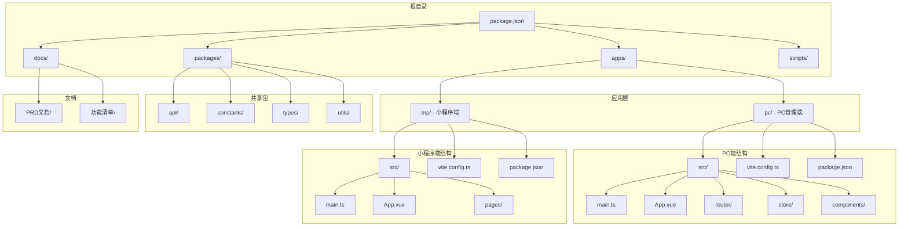
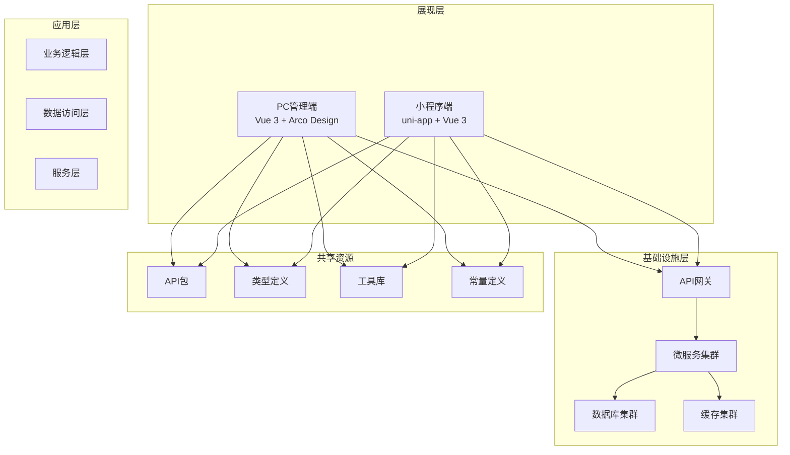
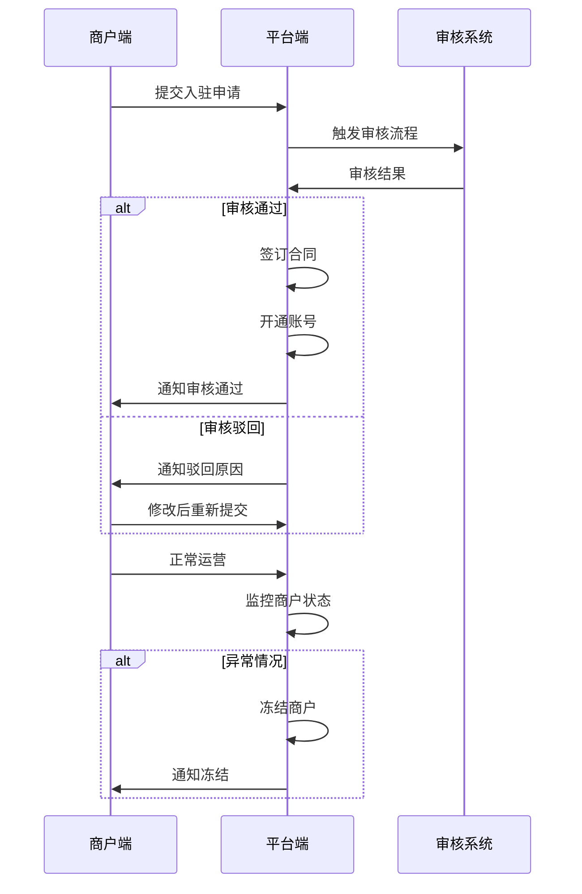
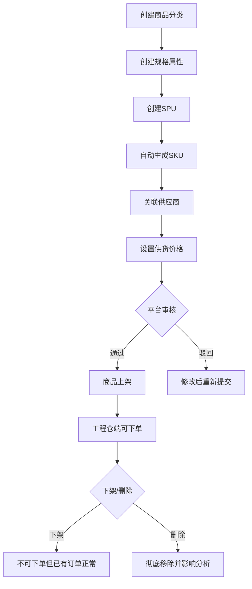
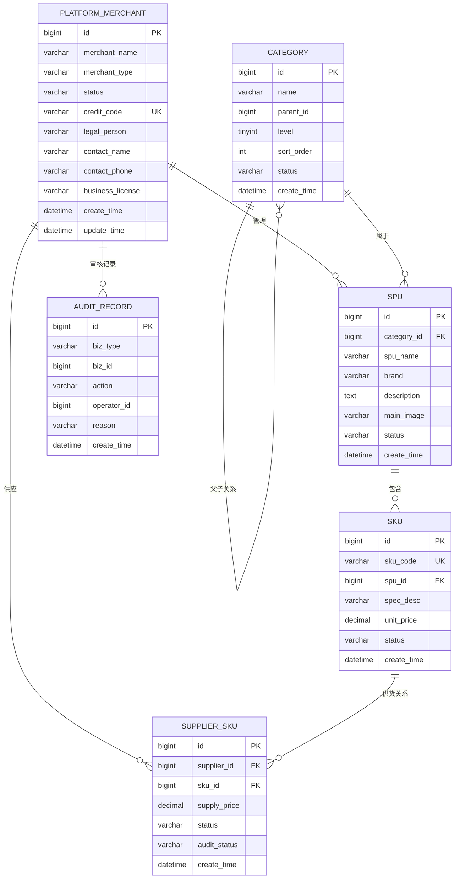

# PRD系统集成

<cite>
**本文档引用的文件**
- [package.json](file://package.json)
- [apps/pc/package.json](file://apps/pc/package.json)
- [apps/mp/package.json](file://apps/mp/package.json)
- [apps/pc/src/main.ts](file://apps/pc/src/main.ts)
- [apps/mp/src/main.ts](file://apps/mp/src/main.ts)
- [apps/pc/src/App.vue](file://apps/pc/src/App.vue)
- [apps/mp/src/App.vue](file://apps/mp/src/App.vue)
- [docs/01_PRD/平台端/01-系统概览与架构.md](file://docs/01_PRD/平台端/01-系统概览与架构.md)
- [docs/01_PRD/平台端/02-业务流程设计.md](file://docs/01_PRD/平台端/02-业务流程设计.md)
- [docs/01_PRD/平台端/03-数据模型与表结构.md](file://docs/01_PRD/平台端/03-数据模型与表结构.md)
</cite>

## 目录
1. [项目简介](#项目简介)
2. [项目结构](#项目结构)
3. [核心组件](#核心组件)
4. [架构概览](#架构概览)
5. [详细组件分析](#详细组件分析)
6. [依赖分析](#依赖分析)
7. [性能考虑](#性能考虑)
8. [故障排除指南](#故障排除指南)
9. [结论](#结论)

## 项目简介

这是一个采供一体化平台的工程仓SaaS系统，采用多端架构设计，包含PC管理端和小程序移动端两个主要客户端。系统通过统一的商品管理体系、商户管理机制和订单监控功能，为平台运营提供完整的管理解决方案。

该系统的核心价值在于：
- **商户全生命周期管理**：从入驻→审核→合同→账号开通→冻结/解冻的完整流程
- **商品标准化定义**：统一分类/属性/SPU/SKU体系，消除数据孤岛
- **全平台订单监控**：跨端查看所有交易数据，异常订单及时干预
- **集中式权限管控**：统一管理用户/角色/权限，支持RBAC精细化授权

## 项目结构

项目采用monorepo架构，通过pnpm workspace进行管理，主要包含以下结构：



**图表来源**
- [package.json:1-26](file://package.json#L1-L26)
- [apps/pc/package.json:1-39](file://apps/pc/package.json#L1-L39)
- [apps/mp/package.json:1-39](file://apps/mp/package.json#L1-L39)

**节内来源**
- [package.json:1-26](file://package.json#L1-L26)
- [apps/pc/package.json:1-39](file://apps/pc/package.json#L1-L39)
- [apps/mp/package.json:1-39](file://apps/mp/package.json#L1-L39)

## 核心组件

### 应用入口组件

系统采用现代化的前端架构，分别针对不同端进行了优化配置：

**PC端应用入口** (`apps/pc/src/main.ts`)
- 使用Vue 3 + TypeScript构建
- 集成Arco Design UI组件库
- 配置Pinia状态管理和Vue Router路由
- 支持开发和生产环境的不同配置

**小程序端应用入口** (`apps/mp/src/main.ts`)
- 采用uni-app框架支持多端编译
- 使用Pinia进行状态管理
- 支持微信小程序和H5双端运行
- 通过工厂函数模式创建应用实例

### 核心UI组件

**PC端根组件** (`apps/pc/src/App.vue`)
- 集成Arco Design的全局配置提供者
- 通过router-view实现路由渲染
- 支持主题定制和国际化配置

**小程序端根组件** (`apps/mp/src/App.vue`)
- 实现uni-app的标准生命周期钩子
- 包含全局样式导入和页面基础样式
- 支持应用启动、显示、隐藏事件处理

**节内来源**
- [apps/pc/src/main.ts:1-19](file://apps/pc/src/main.ts#L1-L19)
- [apps/mp/src/main.ts:1-14](file://apps/mp/src/main.ts#L1-L14)
- [apps/pc/src/App.vue:1-9](file://apps/pc/src/App.vue#L1-L9)
- [apps/mp/src/App.vue:1-24](file://apps/mp/src/App.vue#L1-L24)

## 架构概览

系统采用分层架构设计，通过清晰的职责分离实现高内聚低耦合：



**图表来源**
- [apps/pc/package.json:14-26](file://apps/pc/package.json#L14-L26)
- [apps/mp/package.json:12-24](file://apps/mp/package.json#L12-L24)

### 技术栈分析

**前端技术栈**
- **PC端**：Vue 3.x + TypeScript + Arco Design 2.x
- **小程序端**：uni-app 3.0 + Vue 3 + TypeScript
- **状态管理**：Pinia 2.1.7
- **路由管理**：Vue Router 4.3.0

**开发工具链**
- **构建工具**：Vite 5.1.5
- **包管理器**：pnpm workspace
- **类型检查**：TypeScript ~5.4.2
- **代码质量**：ESLint + vue-tsc

**节内来源**
- [apps/pc/package.json:14-38](file://apps/pc/package.json#L14-L38)
- [apps/mp/package.json:12-38](file://apps/mp/package.json#L12-L38)

## 详细组件分析

### 商户管理系统

根据PRD文档，平台端提供完整的商户全生命周期管理功能：



**图表来源**
- [docs/01_PRD/平台端/02-业务流程设计.md:73-93](file://docs/01_PRD/平台端/02-业务流程设计.md#L73-L93)

### 商品管理体系

系统采用标准化的商品定义流程，确保数据的一致性和完整性：



**图表来源**
- [docs/01_PRD/平台端/02-业务流程设计.md:127-152](file://docs/01_PRD/平台端/02-业务流程设计.md#L127-L152)

### 数据模型设计

系统采用规范化的关系型数据库设计，确保数据的完整性和一致性：



**图表来源**
- [docs/01_PRD/平台端/03-数据模型与表结构.md:203-255](file://docs/01_PRD/平台端/03-数据模型与表结构.md#L203-L255)

**节内来源**
- [docs/01_PRD/平台端/01-系统概览与架构.md:15-63](file://docs/01_PRD/平台端/01-系统概览与架构.md#L15-L63)
- [docs/01_PRD/平台端/02-业务流程设计.md:69-120](file://docs/01_PRD/平台端/02-业务流程设计.md#L69-L120)
- [docs/01_PRD/平台端/03-数据模型与表结构.md:66-114](file://docs/01_PRD/平台端/03-数据模型与表结构.md#L66-L114)

## 依赖分析

系统采用workspace管理模式，通过pnpm实现高效的依赖管理：

```mermaid
graph TB
subgraph "工作区配置"
A[pnpm-workspace.yaml] --> B[apps/pc]
A --> C[apps/mp]
A --> D[packages/api]
A --> E[packages/constants]
A --> F[packages/types]
A --> G[packages/utils]
end
subgraph "PC端依赖"
B --> H[@gongchengcang/api]
B --> I[@gongchengcang/constants]
B --> J[@gongchengcang/types]
B --> K[@gongchengcang/utils]
B --> L[Vue 3.4.21]
B --> M[Arco Design 2.55.0]
B --> N[Pinia 2.1.7]
end
subgraph "小程序端依赖"
C --> H
C --> I
C --> J
C --> K
C --> O[uni-app 3.0]
C --> L
C --> N
end
subgraph "共享包"
D --> P[API接口定义]
E --> Q[常量定义]
F --> R[类型声明]
G --> S[工具函数]
end
```

**图表来源**
- [apps/pc/package.json:14-26](file://apps/pc/package.json#L14-L26)
- [apps/mp/package.json:12-24](file://apps/mp/package.json#L12-L24)

### 依赖管理策略

**版本管理**
- 使用workspace协议(`workspace:*`)实现本地包的版本同步
- 通过pnpm的去重机制避免重复安装
- 支持增量构建和快速安装

**包组织结构**
- `@gongchengcang/api`：统一的API接口定义
- `@gongchengcang/constants`：全局常量和配置
- `@gongchengcang/types`：TypeScript类型声明
- `@gongchengcang/utils`：通用工具函数库

**节内来源**
- [apps/pc/package.json:14-26](file://apps/pc/package.json#L14-L26)
- [apps/mp/package.json:12-24](file://apps/mp/package.json#L12-L24)

## 性能考虑

系统在设计时充分考虑了性能优化，采用多种策略提升用户体验：

### 前端性能优化

**构建优化**
- 使用Vite进行快速开发和构建
- 启用Tree Shaking减少打包体积
- 支持按需加载和懒加载

**运行时优化**
- Pinia提供轻量级状态管理
- Arco Design组件按需引入
- 图片和静态资源优化

### 数据库性能设计

**索引策略**
- 商户表：复合索引(merchant_type, status)，唯一索引(credit_code)
- 分类表：父节点索引(parent_id)
- SKU表：唯一索引(sku_code)

**查询优化**
- 使用分页查询处理大数据量
- 合理的连接查询避免N+1问题
- 缓存热点数据减少数据库压力

## 故障排除指南

### 常见问题诊断

**开发环境问题**
- 确认Node.js版本符合要求
- 检查pnpm安装状态
- 验证workspace配置正确性

**构建问题**
- 清理node_modules和dist目录
- 检查TypeScript配置
- 验证Vite配置文件

**运行时问题**
- 检查浏览器兼容性
- 验证API接口连通性
- 查看控制台错误信息

### 性能监控

**指标监控**
- 页面加载时间
- API响应时间
- 内存使用情况
- CPU占用率

**调试工具**
- Vue DevTools
- 浏览器开发者工具
- 性能分析工具

## 结论

PRD系统集成为了一个功能完善、架构清晰的采供一体化平台。通过标准化的商品管理体系、完善的商户管理机制和强大的订单监控功能，为平台运营提供了全面的技术支撑。

系统的主要优势包括：
- **模块化设计**：清晰的职责分离便于维护和扩展
- **多端适配**：统一的业务逻辑支持PC和小程序两端
- **数据标准化**：规范化的数据模型确保数据一致性
- **开发效率**：现代化的技术栈和工具链提升开发体验

未来可以在以下方面继续优化：
- 增强实时通信功能
- 优化移动端用户体验
- 扩展更多业务场景支持
- 加强安全防护机制