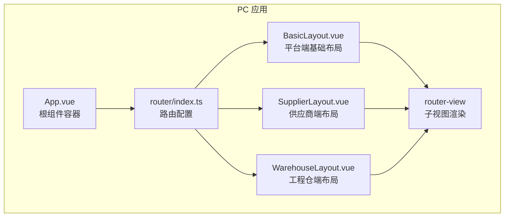
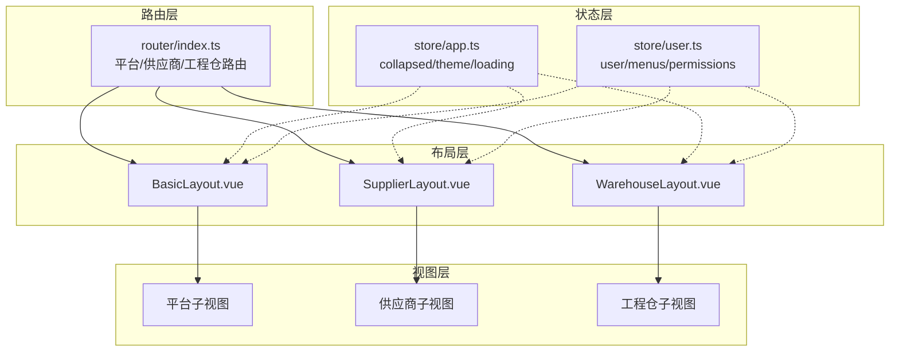
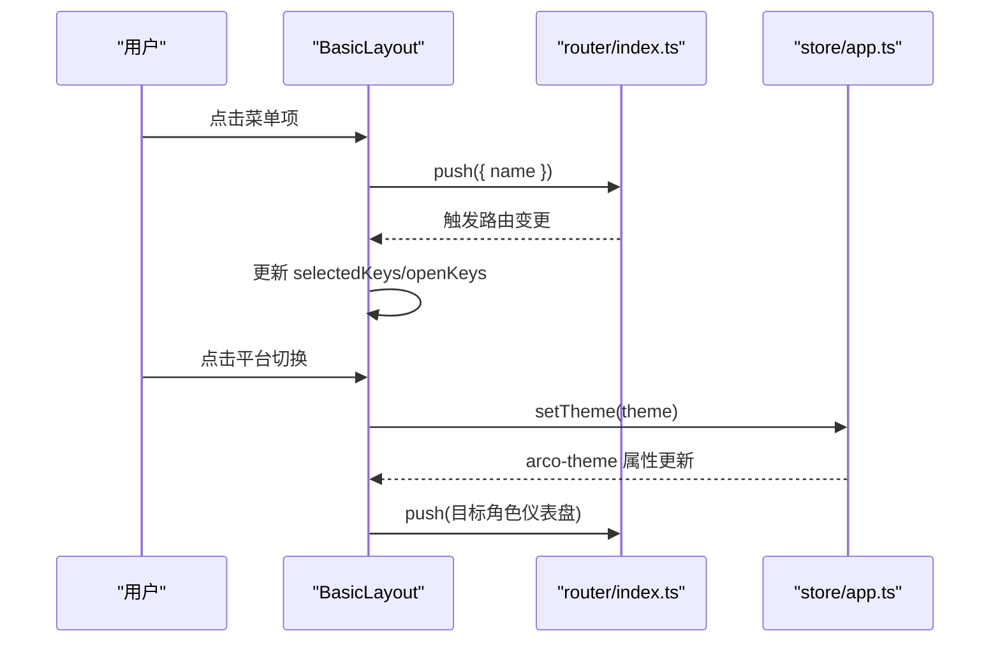
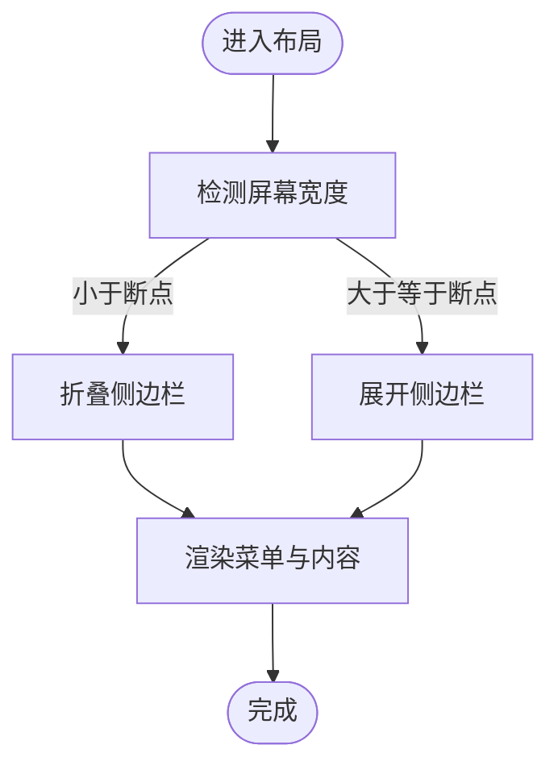
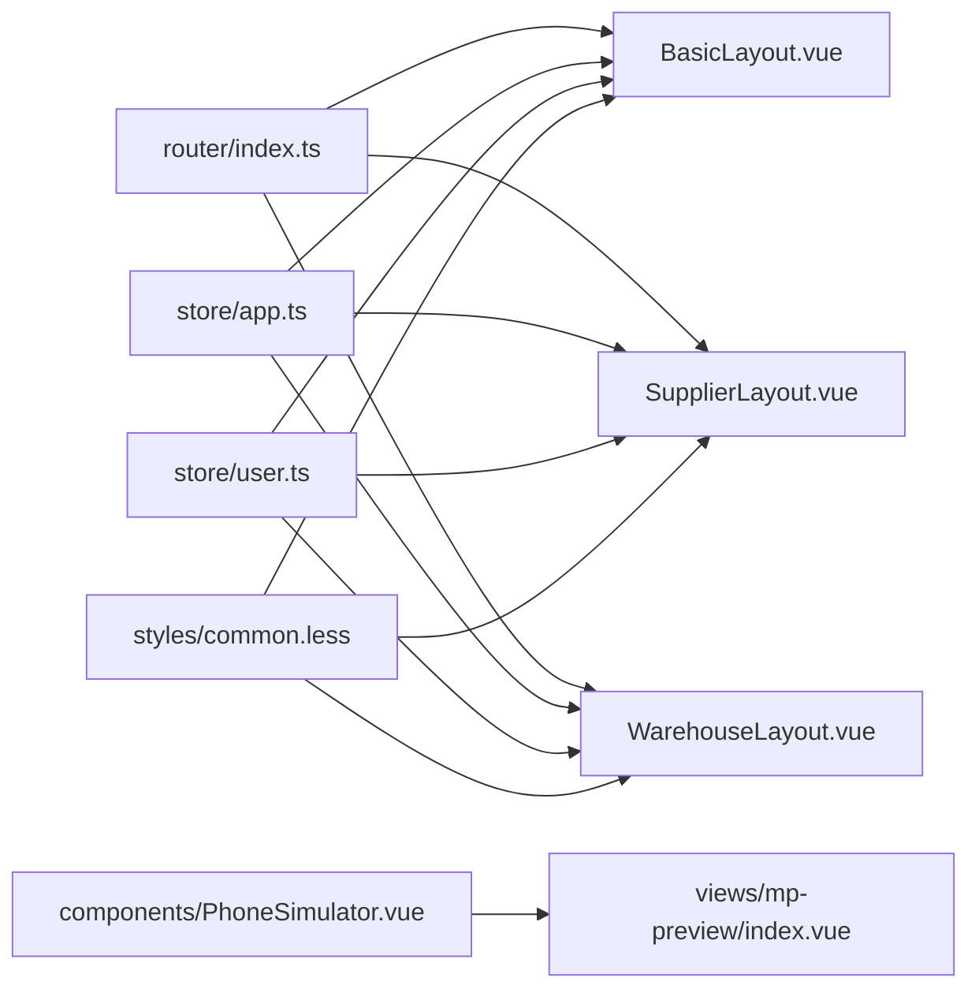

# 布局系统

<cite>
**本文引用的文件**
- [BasicLayout.vue](file://apps/pc/src/layouts/BasicLayout.vue)
- [SupplierLayout.vue](file://apps/pc/src/layouts/SupplierLayout.vue)
- [WarehouseLayout.vue](file://apps/pc/src/layouts/WarehouseLayout.vue)
- [router/index.ts](file://apps/pc/src/router/index.ts)
- [store/app.ts](file://apps/pc/src/store/app.ts)
- [store/user.ts](file://apps/pc/src/store/user.ts)
- [styles/common.less](file://apps/pc/src/styles/common.less)
- [main.ts](file://apps/pc/src/main.ts)
- [App.vue](file://apps/pc/src/App.vue)
- [views/mp-preview/index.vue](file://apps/pc/src/views/mp-preview/index.vue)
- [components/PhoneSimulator.vue](file://apps/pc/src/components/PhoneSimulator.vue)
</cite>

## 目录
1. [简介](#简介)
2. [项目结构](#项目结构)
3. [核心组件](#核心组件)
4. [架构总览](#架构总览)
5. [详细组件分析](#详细组件分析)
6. [依赖分析](#依赖分析)
7. [性能考虑](#性能考虑)
8. [故障排查指南](#故障排查指南)
9. [结论](#结论)
10. [附录](#附录)

## 简介
本文件系统性梳理工程材料管理平台的布局系统，重点覆盖多角色布局架构（BasicLayout 基础布局、SupplierLayout 供应商布局、WarehouseLayout 工程仓布局）的设计理念与实现方式；详解响应式布局、主题切换机制、菜单动态生成、头部导航配置；提供布局组件化开发模式、样式定制方案与移动端适配策略；并总结布局组件的生命周期管理、插槽使用与事件传递机制，最后给出不同角色布局差异与自定义布局的最佳实践。

## 项目结构
布局系统位于 PC 端应用中，采用“路由即布局”的组织方式：通过路由配置为每个角色绑定对应的布局组件，并在布局内渲染子视图。整体结构如下：

图表来源
- [App.vue:1-11](file://apps/pc/src/App.vue#L1-L11)
- [router/index.ts:1-790](file://apps/pc/src/router/index.ts#L1-L790)
- [BasicLayout.vue:1-349](file://apps/pc/src/layouts/BasicLayout.vue#L1-L349)
- [SupplierLayout.vue:1-325](file://apps/pc/src/layouts/SupplierLayout.vue#L1-L325)
- [WarehouseLayout.vue:1-323](file://apps/pc/src/layouts/WarehouseLayout.vue#L1-L323)

章节来源
- [router/index.ts:1-790](file://apps/pc/src/router/index.ts#L1-L790)
- [App.vue:1-11](file://apps/pc/src/App.vue#L1-L11)

## 核心组件
- 基础布局 BasicLayout：面向平台端，负责全局菜单、面包屑、平台切换、头部用户操作等。
- 供应商布局 SupplierLayout：面向供应商端，菜单与头部按钮聚焦供应商场景。
- 工程仓布局 WarehouseLayout：面向工程仓端，菜单与头部按钮聚焦工程仓场景。
- 路由系统：根据角色动态绑定对应布局，支持平台间跳转与子路由渲染。
- 应用状态 store/app：统一管理侧边栏折叠、加载态与主题切换。
- 用户状态 store/user：用户信息与权限，支撑菜单与页面访问控制。
- 公共样式 common.less：页面容器、卡片、表格等通用样式规范。
- 小程序预览 PhoneSimulator：用于移动端适配与演示的手机壳组件。

章节来源
- [BasicLayout.vue:1-349](file://apps/pc/src/layouts/BasicLayout.vue#L1-L349)
- [SupplierLayout.vue:1-325](file://apps/pc/src/layouts/SupplierLayout.vue#L1-L325)
- [WarehouseLayout.vue:1-323](file://apps/pc/src/layouts/WarehouseLayout.vue#L1-L323)
- [router/index.ts:1-790](file://apps/pc/src/router/index.ts#L1-L790)
- [store/app.ts:1-36](file://apps/pc/src/store/app.ts#L1-L36)
- [store/user.ts:1-112](file://apps/pc/src/store/user.ts#L1-L112)
- [styles/common.less:1-79](file://apps/pc/src/styles/common.less#L1-L79)
- [components/PhoneSimulator.vue:1-68](file://apps/pc/src/components/PhoneSimulator.vue#L1-L68)

## 架构总览
多角色布局采用“路由驱动布局”的架构：每个角色拥有独立的路由命名空间与子路由树，布局组件内部通过路由元信息（meta）动态生成菜单与面包屑，头部区域提供平台切换、消息通知、用户下拉等能力。主题切换通过 Pinia store 统一维护并在 DOM 上设置 arco-theme 属性生效。

图表来源
- [router/index.ts:1-790](file://apps/pc/src/router/index.ts#L1-L790)
- [BasicLayout.vue:1-349](file://apps/pc/src/layouts/BasicLayout.vue#L1-L349)
- [SupplierLayout.vue:1-325](file://apps/pc/src/layouts/SupplierLayout.vue#L1-L325)
- [WarehouseLayout.vue:1-323](file://apps/pc/src/layouts/WarehouseLayout.vue#L1-L323)
- [store/app.ts:1-36](file://apps/pc/src/store/app.ts#L1-L36)
- [store/user.ts:1-112](file://apps/pc/src/store/user.ts#L1-L112)

## 详细组件分析

### BasicLayout 基础布局
- 设计理念
  - 以“平台端”为默认入口，菜单来源于顶层 Layout 的子路由，自动过滤隐藏项。
  - 头部提供平台切换（平台/供应商/工程仓），并支持小程序预览入口。
  - 面包屑基于当前路由匹配层级生成，确保导航上下文清晰。
- 关键实现
  - 菜单动态生成：读取路由配置中的 children，过滤 meta.hidden 与 hideInMenu。
  - 选中与展开状态：根据当前路由 name 与父级路由联动 selectedKeys 与 openKeys。
  - 平台切换：写入本地存储 currentPlatform，跳转到对应角色的仪表盘。
  - 头部用户操作：登出时清理认证信息并跳转登录页。
- 响应式与主题
  - 侧边栏可折叠，断点为 xl；主题通过 store/app 切换并作用于 body 的 arco-theme 属性。
- 样式与容器
  - 内容区使用公共类 page-container 控制背景与最小高度，保证与头部高度协调。

图表来源
- [BasicLayout.vue:171-242](file://apps/pc/src/layouts/BasicLayout.vue#L171-L242)
- [router/index.ts:1-790](file://apps/pc/src/router/index.ts#L1-L790)
- [store/app.ts:21-24](file://apps/pc/src/store/app.ts#L21-L24)

章节来源
- [BasicLayout.vue:1-349](file://apps/pc/src/layouts/BasicLayout.vue#L1-L349)
- [router/index.ts:1-790](file://apps/pc/src/router/index.ts#L1-L790)
- [store/app.ts:1-36](file://apps/pc/src/store/app.ts#L1-L36)

### SupplierLayout 供应商布局
- 设计理念
  - 专注于供应商视角的功能菜单与头部操作，平台切换仅显示平台与工程仓两个选项。
  - 登出后跳转至登录页，适合独立角色的业务闭环。
- 关键实现
  - 菜单来源：读取 /supplier 路由下的子路由，同样过滤隐藏项。
  - 选中与展开：根据当前路由 name 与父级 name 维护状态。
  - 平台切换：跳转到平台或工程仓仪表盘。
- 样式与容器
  - 与基础布局一致的页面容器与卡片样式，保持视觉一致性。

章节来源
- [SupplierLayout.vue:1-325](file://apps/pc/src/layouts/SupplierLayout.vue#L1-L325)
- [router/index.ts:380-523](file://apps/pc/src/router/index.ts#L380-L523)
- [store/app.ts:1-36](file://apps/pc/src/store/app.ts#L1-L36)

### WarehouseLayout 工程仓布局
- 设计理念
  - 面向工程仓的业务菜单与头部操作，平台切换仅显示平台与供应商两个选项。
  - 登出后跳转至登录页，便于独立角色的业务闭环。
- 关键实现
  - 菜单来源：读取 /warehouse 路由下的子路由，过滤隐藏项。
  - 选中与展开：根据当前路由 name 与父级 name 维护状态。
  - 平台切换：跳转到平台或供应商仪表盘。
- 样式与容器
  - 与基础布局一致的页面容器与卡片样式，保持视觉一致性。

章节来源
- [WarehouseLayout.vue:1-323](file://apps/pc/src/layouts/WarehouseLayout.vue#L1-L323)
- [router/index.ts:524-763](file://apps/pc/src/router/index.ts#L524-L763)
- [store/app.ts:1-36](file://apps/pc/src/store/app.ts#L1-L36)

### 菜单动态生成与面包屑
- 动态生成
  - 基础布局：从 Layout 子路由中提取菜单，支持二级子菜单过滤。
  - 供应商布局：从 /supplier 子路由中提取菜单。
  - 工程仓布局：从 /warehouse 子路由中提取菜单。
- 面包屑
  - 基于 route.matched 过滤 meta.title，逐级生成导航路径。

章节来源
- [BasicLayout.vue:192-202](file://apps/pc/src/layouts/BasicLayout.vue#L192-L202)
- [SupplierLayout.vue:165-177](file://apps/pc/src/layouts/SupplierLayout.vue#L165-L177)
- [WarehouseLayout.vue:165-176](file://apps/pc/src/layouts/WarehouseLayout.vue#L165-L176)

### 头部导航与平台切换
- 平台切换
  - 基础布局：支持平台/供应商/工程仓三端切换，跳转到对应仪表盘。
  - 供应商布局：支持平台/工程仓切换。
  - 工程仓布局：支持平台/供应商切换。
- 用户操作
  - 提供消息通知、用户下拉菜单（个人中心、系统设置、退出登录）。
- 小程序预览
  - 所有布局均提供小程序预览入口，路由携带角色参数。

章节来源
- [BasicLayout.vue:57-242](file://apps/pc/src/layouts/BasicLayout.vue#L57-L242)
- [SupplierLayout.vue:57-220](file://apps/pc/src/layouts/SupplierLayout.vue#L57-L220)
- [WarehouseLayout.vue:57-219](file://apps/pc/src/layouts/WarehouseLayout.vue#L57-L219)

### 响应式布局与移动端适配
- 响应式断点
  - 侧边栏 collapsible 设置 breakpoint="xl"，在小屏设备上自动折叠。
- 移动端预览
  - 使用 PhoneSimulator 组件模拟手机屏幕，内置时间、信号、电量等状态栏。
  - 小程序预览页提供角色切换与页面列表，支持在手机壳内渲染不同角色页面。

图表来源
- [BasicLayout.vue:3-9](file://apps/pc/src/layouts/BasicLayout.vue#L3-L9)
- [SupplierLayout.vue:3-9](file://apps/pc/src/layouts/SupplierLayout.vue#L3-L9)
- [WarehouseLayout.vue:3-9](file://apps/pc/src/layouts/WarehouseLayout.vue#L3-L9)

章节来源
- [components/PhoneSimulator.vue:1-68](file://apps/pc/src/components/PhoneSimulator.vue#L1-L68)
- [views/mp-preview/index.vue:1-789](file://apps/pc/src/views/mp-preview/index.vue#L1-L789)

### 主题切换机制
- 实现方式
  - store/app 中维护 theme 状态，setTheme 将值写入 body 的 arco-theme 属性。
  - 布局组件通过 store 访问 theme，配合 Arco 主题系统实现全局主题切换。
- 使用建议
  - 在用户设置或系统偏好变化时调用 setTheme，确保与 UI 组件主题一致。

章节来源
- [store/app.ts:21-24](file://apps/pc/src/store/app.ts#L21-L24)
- [main.ts:1-19](file://apps/pc/src/main.ts#L1-L19)

### 样式定制方案
- 页面容器
  - 使用 page-container 类统一背景色与最小高度，避免内容区与头部重叠。
- 通用卡片与表单
  - card-container、search-form、table-actions 等类提供一致的间距与排版。
- 布局组件样式
  - 各布局通过 scoped less 定义 logo/header/content/footer 等区域样式，保持结构清晰。

章节来源
- [styles/common.less:1-79](file://apps/pc/src/styles/common.less#L1-L79)
- [BasicLayout.vue:245-348](file://apps/pc/src/layouts/BasicLayout.vue#L245-L348)
- [SupplierLayout.vue:223-324](file://apps/pc/src/layouts/SupplierLayout.vue#L223-L324)
- [WarehouseLayout.vue:222-322](file://apps/pc/src/layouts/WarehouseLayout.vue#L222-L322)

### 布局组件化开发模式与生命周期
- 组件化
  - 布局组件作为路由容器，内部通过 router-view 渲染子视图，形成“布局 + 视图”的组合。
- 生命周期
  - 布局组件在路由变更时通过 watch 监听 route.name 更新菜单选中与展开状态。
  - PhoneSimulator 组件在挂载时启动时间更新定时器，在卸载时清理定时器，避免内存泄漏。
- 插槽与事件
  - PhoneSimulator 提供默认插槽，用于承载小程序页面组件。
  - mp-preview 通过事件与插槽实现页面导航与登录状态管理。

章节来源
- [BasicLayout.vue:204-216](file://apps/pc/src/layouts/BasicLayout.vue#L204-L216)
- [SupplierLayout.vue:179-191](file://apps/pc/src/layouts/SupplierLayout.vue#L179-L191)
- [WarehouseLayout.vue:178-190](file://apps/pc/src/layouts/WarehouseLayout.vue#L178-L190)
- [components/PhoneSimulator.vue:23-46](file://apps/pc/src/components/PhoneSimulator.vue#L23-L46)
- [views/mp-preview/index.vue:611-623](file://apps/pc/src/views/mp-preview/index.vue#L611-L623)

## 依赖分析
- 路由与布局
  - router/index.ts 为每个角色配置独立的布局组件与子路由，实现“路由即布局”的解耦。
- 状态与布局
  - store/app 提供 collapsed、theme 等全局状态，被各布局组件消费。
  - store/user 提供用户与权限信息，支撑菜单与页面访问控制。
- 样式与组件
  - common.less 提供页面容器与通用样式，布局组件通过 scoped less 覆盖细节。
  - PhoneSimulator 作为通用手机壳组件，被 mp-preview 使用。

图表来源
- [router/index.ts:1-790](file://apps/pc/src/router/index.ts#L1-L790)
- [BasicLayout.vue:1-349](file://apps/pc/src/layouts/BasicLayout.vue#L1-L349)
- [SupplierLayout.vue:1-325](file://apps/pc/src/layouts/SupplierLayout.vue#L1-L325)
- [WarehouseLayout.vue:1-323](file://apps/pc/src/layouts/WarehouseLayout.vue#L1-L323)
- [store/app.ts:1-36](file://apps/pc/src/store/app.ts#L1-L36)
- [store/user.ts:1-112](file://apps/pc/src/store/user.ts#L1-L112)
- [styles/common.less:1-79](file://apps/pc/src/styles/common.less#L1-L79)
- [components/PhoneSimulator.vue:1-68](file://apps/pc/src/components/PhoneSimulator.vue#L1-L68)
- [views/mp-preview/index.vue:1-789](file://apps/pc/src/views/mp-preview/index.vue#L1-L789)

章节来源
- [router/index.ts:1-790](file://apps/pc/src/router/index.ts#L1-L790)
- [store/app.ts:1-36](file://apps/pc/src/store/app.ts#L1-L36)
- [store/user.ts:1-112](file://apps/pc/src/store/user.ts#L1-L112)

## 性能考虑
- 菜单渲染优化
  - 菜单数据来源于路由配置，避免额外请求；通过 computed 缓存 menuList，减少重复计算。
- 路由懒加载
  - 子视图采用异步导入，降低首屏体积，提升初始加载速度。
- 主题切换
  - 主题切换仅更新 body 属性，避免全量重绘，性能开销较小。
- 响应式交互
  - 折叠状态通过 store 管理，避免频繁 DOM 查询，提升交互流畅度。

## 故障排查指南
- 登录态失效导致页面无法访问
  - 路由守卫会拦截未登录用户并跳转登录页；检查 token 是否存在与有效。
- 菜单不显示或显示异常
  - 检查路由 meta 中的 title、hidden、hideInMenu 字段是否正确设置。
- 平台切换后跳转错误
  - 检查 handleSwitchPlatform 的跳转逻辑与目标路由是否存在。
- 主题切换无效
  - 确认 setTheme 是否被调用且 body 上的 arco-theme 属性已更新。
- 小程序预览空白
  - 检查 mp-preview 的角色与页面映射是否正确，以及 PhoneSimulator 插槽是否正常渲染。

章节来源
- [router/index.ts:776-787](file://apps/pc/src/router/index.ts#L776-L787)
- [BasicLayout.vue:226-242](file://apps/pc/src/layouts/BasicLayout.vue#L226-L242)
- [store/app.ts:21-24](file://apps/pc/src/store/app.ts#L21-L24)
- [views/mp-preview/index.vue:532-623](file://apps/pc/src/views/mp-preview/index.vue#L532-L623)

## 结论
该布局系统以“路由即布局”的方式实现了多角色分离与统一管理，结合 Pinia 状态管理与 Arco 主题系统，提供了良好的扩展性与可维护性。通过动态菜单、面包屑、平台切换与移动端预览，满足了平台端、供应商端与工程仓端的差异化需求。建议在后续迭代中持续优化菜单权限控制、主题持久化与移动端交互体验。

## 附录
- 最佳实践
  - 菜单与路由保持一一对应，meta 字段语义明确。
  - 布局组件尽量只做容器职责，业务逻辑下沉到子视图。
  - 使用 scoped less 与公共样式类，统一风格与复用性。
  - 主题切换与侧边栏折叠状态持久化到 store，避免重复计算。
  - 小程序预览作为开发调试工具，提供角色与页面映射的可视化支持。