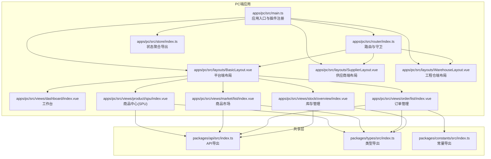
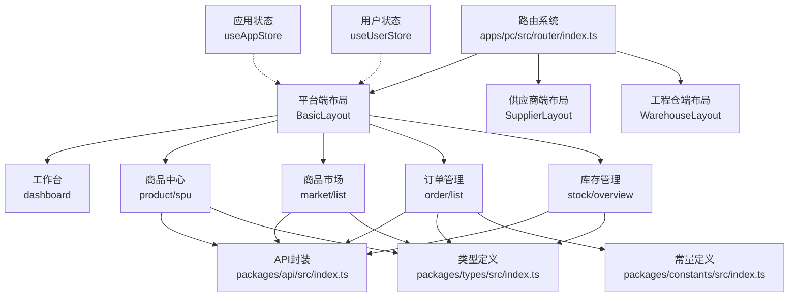
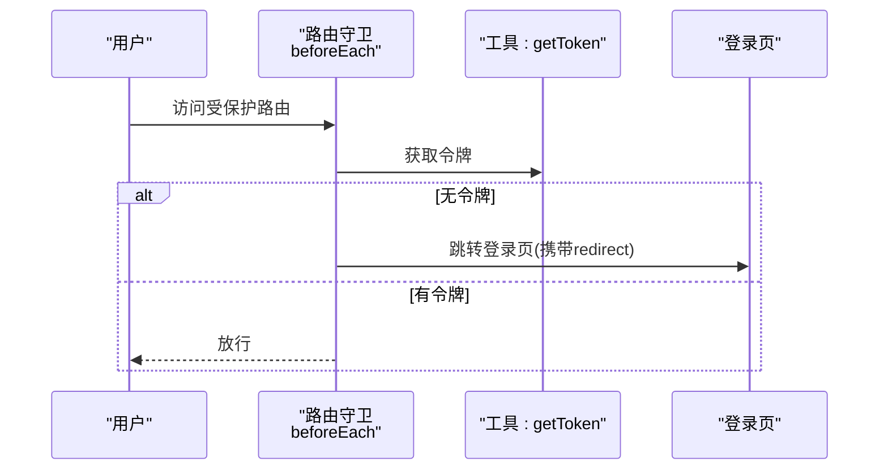
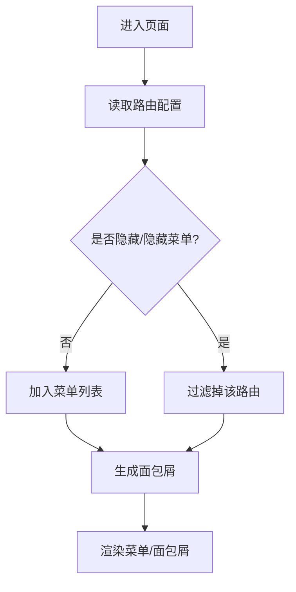
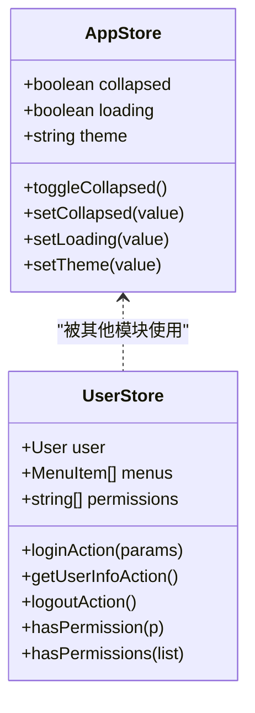
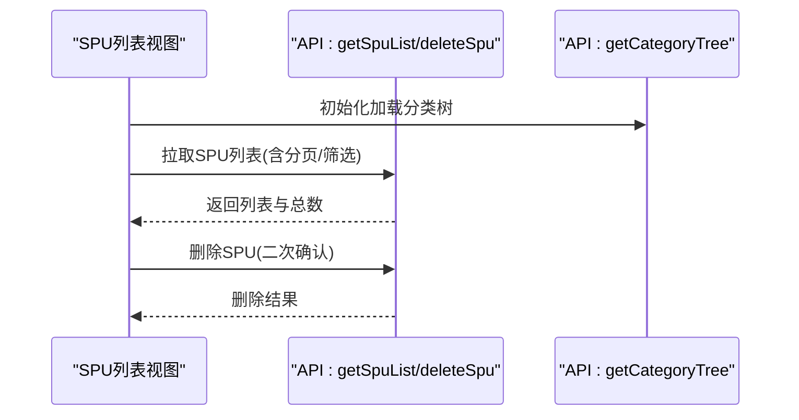
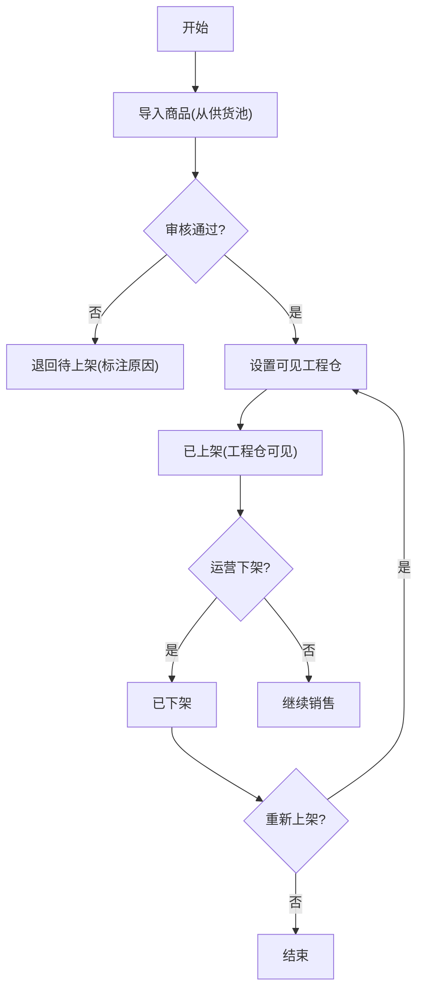
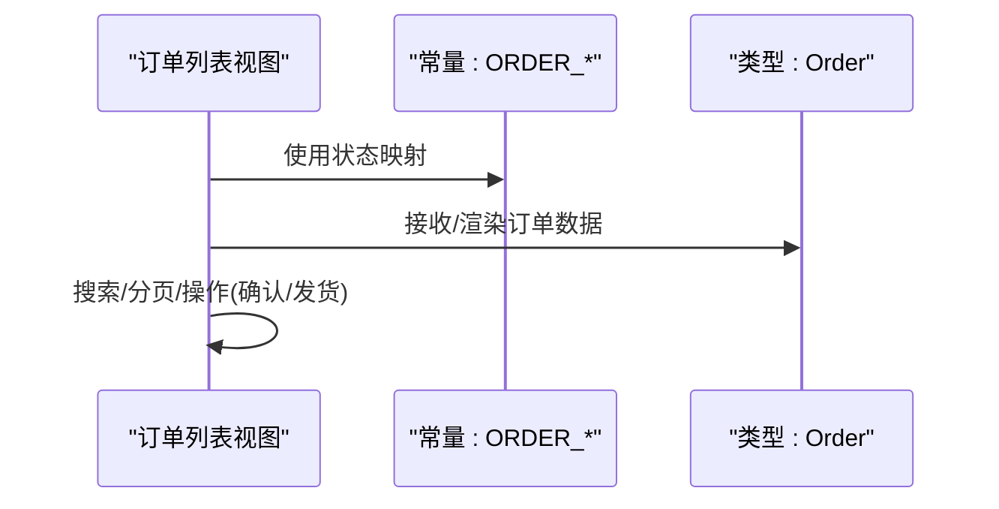
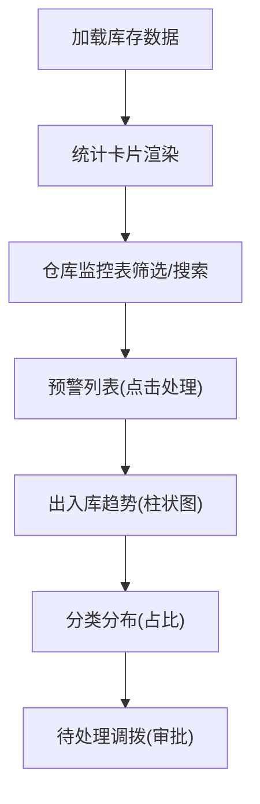
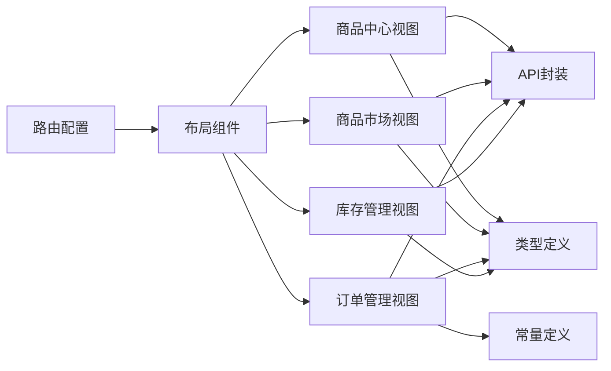

# 核心功能模块

<cite>
**本文引用的文件**
- [apps/pc/src/main.ts](file://apps/pc/src/main.ts)
- [apps/pc/src/router/index.ts](file://apps/pc/src/router/index.ts)
- [apps/pc/src/store/index.ts](file://apps/pc/src/store/index.ts)
- [apps/pc/src/store/app.ts](file://apps/pc/src/store/app.ts)
- [apps/pc/src/store/user.ts](file://apps/pc/src/store/user.ts)
- [apps/pc/src/layouts/BasicLayout.vue](file://apps/pc/src/layouts/BasicLayout.vue)
- [apps/pc/src/layouts/SupplierLayout.vue](file://apps/pc/src/layouts/SupplierLayout.vue)
- [apps/pc/src/layouts/WarehouseLayout.vue](file://apps/pc/src/layouts/WarehouseLayout.vue)
- [apps/pc/src/views/dashboard/index.vue](file://apps/pc/src/views/dashboard/index.vue)
- [apps/pc/src/views/product/spu/index.vue](file://apps/pc/src/views/product/spu/index.vue)
- [apps/pc/src/views/market/list/index.vue](file://apps/pc/src/views/market/list/index.vue)
- [apps/pc/src/views/order/list/index.vue](file://apps/pc/src/views/order/list/index.vue)
- [apps/pc/src/views/stock/overview/index.vue](file://apps/pc/src/views/stock/overview/index.vue)
- [packages/api/src/index.ts](file://packages/api/src/index.ts)
- [packages/types/src/index.ts](file://packages/types/src/index.ts)
- [packages/constants/src/index.ts](file://packages/constants/src/index.ts)
</cite>

## 目录
1. [引言](#引言)
2. [项目结构](#项目结构)
3. [核心组件](#核心组件)
4. [架构总览](#架构总览)
5. [详细组件分析](#详细组件分析)
6. [依赖分析](#依赖分析)
7. [性能考虑](#性能考虑)
8. [故障排查指南](#故障排查指南)
9. [结论](#结论)
10. [附录](#附录)

## 引言
本文件面向工程材料管理平台的核心功能模块，围绕“商品中心、商品市场、订单管理、库存管理”四大业务模块，系统梳理整体架构、模块间协作关系、数据流向与业务边界；同时介绍多角色权限体系、路由系统设计、状态管理架构、布局系统实现，以及API封装设计、类型定义规范与组件化开发模式。文档提供模块概览图与关键流程图，帮助开发者快速定位功能模块并理解业务逻辑。

## 项目结构
平台采用多端（PC、小程序）与多布局（平台端、供应商端、工程仓端）架构，核心运行时在 PC 端应用中初始化，统一注册路由、状态管理与主题样式，通过不同布局组件承载各角色的导航与内容区。

**图表来源**
- [apps/pc/src/main.ts:1-19](file://apps/pc/src/main.ts#L1-L19)
- [apps/pc/src/router/index.ts:1-790](file://apps/pc/src/router/index.ts#L1-L790)
- [apps/pc/src/store/index.ts:1-10](file://apps/pc/src/store/index.ts#L1-L10)
- [apps/pc/src/layouts/BasicLayout.vue:1-349](file://apps/pc/src/layouts/BasicLayout.vue#L1-L349)
- [apps/pc/src/layouts/SupplierLayout.vue:1-325](file://apps/pc/src/layouts/SupplierLayout.vue#L1-L325)
- [apps/pc/src/layouts/WarehouseLayout.vue:1-323](file://apps/pc/src/layouts/WarehouseLayout.vue#L1-L323)
- [apps/pc/src/views/dashboard/index.vue:1-197](file://apps/pc/src/views/dashboard/index.vue#L1-L197)
- [apps/pc/src/views/product/spu/index.vue:1-473](file://apps/pc/src/views/product/spu/index.vue#L1-L473)
- [apps/pc/src/views/market/list/index.vue:1-800](file://apps/pc/src/views/market/list/index.vue#L1-L800)
- [apps/pc/src/views/order/list/index.vue:1-197](file://apps/pc/src/views/order/list/index.vue#L1-L197)
- [apps/pc/src/views/stock/overview/index.vue:1-800](file://apps/pc/src/views/stock/overview/index.vue#L1-L800)
- [packages/api/src/index.ts:1-11](file://packages/api/src/index.ts#L1-L11)
- [packages/types/src/index.ts:1-10](file://packages/types/src/index.ts#L1-L10)
- [packages/constants/src/index.ts:1-7](file://packages/constants/src/index.ts#L1-L7)

**章节来源**
- [apps/pc/src/main.ts:1-19](file://apps/pc/src/main.ts#L1-L19)
- [apps/pc/src/router/index.ts:1-790](file://apps/pc/src/router/index.ts#L1-L790)
- [apps/pc/src/store/index.ts:1-10](file://apps/pc/src/store/index.ts#L1-L10)

## 核心组件
- 应用入口与插件注册：初始化 Vue 应用，注册 Arco 设计、Pinia、路由与全局样式。
- 路由系统：基于 vue-router 的 hash 历史模式，定义平台端、供应商端、工程仓端三层布局与子路由，统一前置守卫进行登录态校验与标题设置。
- 状态管理：基于 Pinia，提供应用状态（折叠、主题、加载）、用户状态（登录、菜单、权限）与商户状态等。
- 布局系统：三大布局组件分别承载平台端、供应商端、工程仓端的菜单、面包屑、头部操作与内容区。
- 视图模块：四大业务模块的首页与核心页面，承载具体业务逻辑与交互。

**章节来源**
- [apps/pc/src/main.ts:1-19](file://apps/pc/src/main.ts#L1-L19)
- [apps/pc/src/router/index.ts:1-790](file://apps/pc/src/router/index.ts#L1-L790)
- [apps/pc/src/store/index.ts:1-10](file://apps/pc/src/store/index.ts#L1-L10)
- [apps/pc/src/store/app.ts:1-36](file://apps/pc/src/store/app.ts#L1-L36)
- [apps/pc/src/store/user.ts:1-112](file://apps/pc/src/store/user.ts#L1-L112)
- [apps/pc/src/layouts/BasicLayout.vue:1-349](file://apps/pc/src/layouts/BasicLayout.vue#L1-L349)
- [apps/pc/src/layouts/SupplierLayout.vue:1-325](file://apps/pc/src/layouts/SupplierLayout.vue#L1-L325)
- [apps/pc/src/layouts/WarehouseLayout.vue:1-323](file://apps/pc/src/layouts/WarehouseLayout.vue#L1-L323)

## 架构总览
平台采用“多布局 + 多角色 + 统一路由 + 状态管理”的前端架构。路由根据角色切换布局，布局根据路由动态生成菜单与面包屑；状态管理集中于 Pinia，提供跨模块共享能力；API 与类型、常量通过 packages 统一导出，确保模块间契约一致。

**图表来源**
- [apps/pc/src/router/index.ts:1-790](file://apps/pc/src/router/index.ts#L1-L790)
- [apps/pc/src/layouts/BasicLayout.vue:1-349](file://apps/pc/src/layouts/BasicLayout.vue#L1-L349)
- [apps/pc/src/layouts/SupplierLayout.vue:1-325](file://apps/pc/src/layouts/SupplierLayout.vue#L1-L325)
- [apps/pc/src/layouts/WarehouseLayout.vue:1-323](file://apps/pc/src/layouts/WarehouseLayout.vue#L1-L323)
- [apps/pc/src/store/app.ts:1-36](file://apps/pc/src/store/app.ts#L1-L36)
- [apps/pc/src/store/user.ts:1-112](file://apps/pc/src/store/user.ts#L1-L112)
- [apps/pc/src/views/product/spu/index.vue:1-473](file://apps/pc/src/views/product/spu/index.vue#L1-L473)
- [apps/pc/src/views/market/list/index.vue:1-800](file://apps/pc/src/views/market/list/index.vue#L1-L800)
- [apps/pc/src/views/order/list/index.vue:1-197](file://apps/pc/src/views/order/list/index.vue#L1-L197)
- [apps/pc/src/views/stock/overview/index.vue:1-800](file://apps/pc/src/views/stock/overview/index.vue#L1-L800)
- [packages/api/src/index.ts:1-11](file://packages/api/src/index.ts#L1-L11)
- [packages/types/src/index.ts:1-10](file://packages/types/src/index.ts#L1-L10)
- [packages/constants/src/index.ts:1-7](file://packages/constants/src/index.ts#L1-L7)

## 详细组件分析

### 路由系统与权限守卫
- 路由结构：以 Layout 为根，平台端、供应商端、工程仓端分别作为独立布局，内部包含多级子路由与权限元信息。
- 登录守卫：统一在前置守卫中检查 token，未登录跳转登录页并携带 redirect 参数。
- 标题设置：根据 meta.title 动态设置页面标题。

**图表来源**
- [apps/pc/src/router/index.ts:776-787](file://apps/pc/src/router/index.ts#L776-L787)

**章节来源**
- [apps/pc/src/router/index.ts:1-790](file://apps/pc/src/router/index.ts#L1-L790)

### 布局系统与菜单生成
- 平台端布局：根据当前路由动态生成菜单与面包屑，支持平台切换与用户操作。
- 供应商端/工程仓端布局：与平台端类似，但菜单与平台切换逻辑略有差异。
- 菜单图标：通过映射表将字符串图标转换为 Arco 图标组件。

**图表来源**
- [apps/pc/src/layouts/BasicLayout.vue:192-202](file://apps/pc/src/layouts/BasicLayout.vue#L192-L202)
- [apps/pc/src/layouts/SupplierLayout.vue:165-177](file://apps/pc/src/layouts/SupplierLayout.vue#L165-L177)
- [apps/pc/src/layouts/WarehouseLayout.vue:165-176](file://apps/pc/src/layouts/WarehouseLayout.vue#L165-L176)

**章节来源**
- [apps/pc/src/layouts/BasicLayout.vue:1-349](file://apps/pc/src/layouts/BasicLayout.vue#L1-L349)
- [apps/pc/src/layouts/SupplierLayout.vue:1-325](file://apps/pc/src/layouts/SupplierLayout.vue#L1-L325)
- [apps/pc/src/layouts/WarehouseLayout.vue:1-323](file://apps/pc/src/layouts/WarehouseLayout.vue#L1-L323)

### 状态管理架构
- 应用状态：控制侧边栏折叠、全局加载、主题切换等。
- 用户状态：登录、登出、获取用户信息、权限判断等。
- 模块导出：store/index.ts 统一导出各模块 store，便于在组件中按需引入。

**图表来源**
- [apps/pc/src/store/app.ts:1-36](file://apps/pc/src/store/app.ts#L1-L36)
- [apps/pc/src/store/user.ts:1-112](file://apps/pc/src/store/user.ts#L1-L112)

**章节来源**
- [apps/pc/src/store/index.ts:1-10](file://apps/pc/src/store/index.ts#L1-L10)
- [apps/pc/src/store/app.ts:1-36](file://apps/pc/src/store/app.ts#L1-L36)
- [apps/pc/src/store/user.ts:1-112](file://apps/pc/src/store/user.ts#L1-L112)

### 商品中心（SPU/SKU 管理）
- 功能要点：分类树筛选、关键词搜索、SPU 列表与操作（新增、编辑、详情、管理SKU、删除）、权限矩阵与路由联动。
- 数据流：加载分类树 → 拉取 SPU 列表 → 分页与筛选 → 操作（删除弹窗二次确认）。
- 交互细节：路由参数透传、分页重置、权限控制不渲染按钮。

**图表来源**
- [apps/pc/src/views/product/spu/index.vue:403-426](file://apps/pc/src/views/product/spu/index.vue#L403-L426)
- [apps/pc/src/views/product/spu/index.vue:457-471](file://apps/pc/src/views/product/spu/index.vue#L457-L471)

**章节来源**
- [apps/pc/src/views/product/spu/index.vue:1-473](file://apps/pc/src/views/product/spu/index.vue#L1-L473)

### 商品市场（商品生命周期与权限控制）
- 功能要点：四状态（全部/待上架/已上架/已下架）、导入商品、批量上架/下架/调价、设置可见工程仓权限、搜索筛选。
- 业务流程：从供货池导入 → 待上架 → 审核通过 → 设置可见工程仓 → 已上架；价格变动需审批并留痕；区域化运营通过工程仓权限控制。
- 数据契约：API 与类型定义统一，常量用于状态与枚举。

**图表来源**
- [apps/pc/src/views/market/list/index.vue:728-747](file://apps/pc/src/views/market/list/index.vue#L728-L747)

**章节来源**
- [apps/pc/src/views/market/list/index.vue:1-800](file://apps/pc/src/views/market/list/index.vue#L1-L800)
- [packages/api/src/index.ts:1-11](file://packages/api/src/index.ts#L1-L11)
- [packages/types/src/index.ts:1-10](file://packages/types/src/index.ts#L1-L10)
- [packages/constants/src/index.ts:1-7](file://packages/constants/src/index.ts#L1-L7)

### 订单管理（列表与状态流转）
- 功能要点：订单列表、搜索筛选（类型/状态/时间）、创建订单、查看、确认、发货。
- 状态映射：通过常量定义订单状态与支付状态的颜色与文案。
- 数据契约：类型定义与常量统一，便于跨模块复用。

**图表来源**
- [apps/pc/src/views/order/list/index.vue:89-105](file://apps/pc/src/views/order/list/index.vue#L89-L105)
- [apps/pc/src/views/order/list/index.vue:187-195](file://apps/pc/src/views/order/list/index.vue#L187-L195)

**章节来源**
- [apps/pc/src/views/order/list/index.vue:1-197](file://apps/pc/src/views/order/list/index.vue#L1-L197)
- [packages/constants/src/index.ts:1-7](file://packages/constants/src/index.ts#L1-L7)
- [packages/types/src/index.ts:1-10](file://packages/types/src/index.ts#L1-L10)

### 库存管理（总览与预警）
- 功能要点：仓库统计卡片、仓库监控表、库存预警、出入库趋势、分类分布、待处理调拨。
- 交互细节：容量条颜色随使用率变化、预警/缺货标识、导出报表、调拨申请表单。
- 数据契约：类型定义与视图组件解耦，便于扩展。

**图表来源**
- [apps/pc/src/views/stock/overview/index.vue:391-404](file://apps/pc/src/views/stock/overview/index.vue#L391-L404)
- [apps/pc/src/views/stock/overview/index.vue:505-538](file://apps/pc/src/views/stock/overview/index.vue#L505-L538)
- [apps/pc/src/views/stock/overview/index.vue:540-558](file://apps/pc/src/views/stock/overview/index.vue#L540-L558)
- [apps/pc/src/views/stock/overview/index.vue:560-566](file://apps/pc/src/views/stock/overview/index.vue#L560-L566)
- [apps/pc/src/views/stock/overview/index.vue:568-571](file://apps/pc/src/views/stock/overview/index.vue#L568-L571)

**章节来源**
- [apps/pc/src/views/stock/overview/index.vue:1-800](file://apps/pc/src/views/stock/overview/index.vue#L1-L800)

### 工作台（仪表盘）
- 功能要点：统计数据卡片、快捷入口、待处理事项、最近订单。
- 交互细节：点击快捷入口跳转对应模块。

**章节来源**
- [apps/pc/src/views/dashboard/index.vue:1-197](file://apps/pc/src/views/dashboard/index.vue#L1-L197)

## 依赖分析
- 路由依赖：路由配置集中于 router/index.ts，通过 meta 字段控制标题、图标、权限与隐藏。
- 状态依赖：布局组件依赖 useAppStore 控制折叠与主题；用户权限通过 useUserStore 提供。
- API 依赖：四大业务模块均通过 packages/api 统一导出的接口访问后端服务。
- 类型与常量：通过 packages/types 与 packages/constants 统一导出，保证模块间契约一致。

**图表来源**
- [apps/pc/src/router/index.ts:1-790](file://apps/pc/src/router/index.ts#L1-L790)
- [apps/pc/src/layouts/BasicLayout.vue:1-349](file://apps/pc/src/layouts/BasicLayout.vue#L1-L349)
- [apps/pc/src/views/product/spu/index.vue:1-473](file://apps/pc/src/views/product/spu/index.vue#L1-L473)
- [apps/pc/src/views/market/list/index.vue:1-800](file://apps/pc/src/views/market/list/index.vue#L1-L800)
- [apps/pc/src/views/order/list/index.vue:1-197](file://apps/pc/src/views/order/list/index.vue#L1-L197)
- [apps/pc/src/views/stock/overview/index.vue:1-800](file://apps/pc/src/views/stock/overview/index.vue#L1-L800)
- [packages/api/src/index.ts:1-11](file://packages/api/src/index.ts#L1-L11)
- [packages/types/src/index.ts:1-10](file://packages/types/src/index.ts#L1-L10)
- [packages/constants/src/index.ts:1-7](file://packages/constants/src/index.ts#L1-L7)

**章节来源**
- [apps/pc/src/router/index.ts:1-790](file://apps/pc/src/router/index.ts#L1-L790)
- [apps/pc/src/layouts/BasicLayout.vue:1-349](file://apps/pc/src/layouts/BasicLayout.vue#L1-L349)
- [packages/api/src/index.ts:1-11](file://packages/api/src/index.ts#L1-L11)
- [packages/types/src/index.ts:1-10](file://packages/types/src/index.ts#L1-L10)
- [packages/constants/src/index.ts:1-7](file://packages/constants/src/index.ts#L1-L7)

## 性能考虑
- 路由懒加载：路由组件采用动态导入，减少首屏体积。
- 状态粒度：Pinia Store 按模块拆分，避免不必要的响应式开销。
- 表格与图表：使用虚拟滚动与按需渲染，降低大数据量下的渲染压力。
- 图标与样式：通过统一图标映射与样式变量，减少重复计算与样式冲突。

## 故障排查指南
- 登录态问题：检查路由守卫中的 token 获取与登录页跳转逻辑。
- 权限控制：确认用户权限数组与 hasPermission/hasPermissions 的判断逻辑。
- API 请求：核对 packages/api 的导出与调用路径，确保请求参数与返回结构一致。
- 类型不匹配：核对 packages/types 的导出与组件中的类型使用，避免编译或运行时错误。

**章节来源**
- [apps/pc/src/router/index.ts:776-787](file://apps/pc/src/router/index.ts#L776-L787)
- [apps/pc/src/store/user.ts:93-110](file://apps/pc/src/store/user.ts#L93-L110)
- [packages/api/src/index.ts:1-11](file://packages/api/src/index.ts#L1-L11)
- [packages/types/src/index.ts:1-10](file://packages/types/src/index.ts#L1-L10)

## 结论
本平台通过“多布局 + 多角色 + 统一路由 + 状态管理 + 统一API/类型/常量”的架构，实现了商品中心、商品市场、订单管理、库存管理四大核心模块的清晰边界与高效协作。路由守卫保障登录安全，布局系统适配多角色导航，状态管理提供跨模块共享能力，API/类型/常量统一契约，组件化开发提升可维护性与可扩展性。建议后续持续完善权限矩阵与审计留痕，强化异常处理与性能优化。

## 附录
- 模块概览图与核心流程图已在前述章节中给出，便于快速定位功能模块与理解业务逻辑。
- 开发者可依据路由配置与布局组件快速切换角色与页面，依据 store 文件与视图组件理解状态与交互。