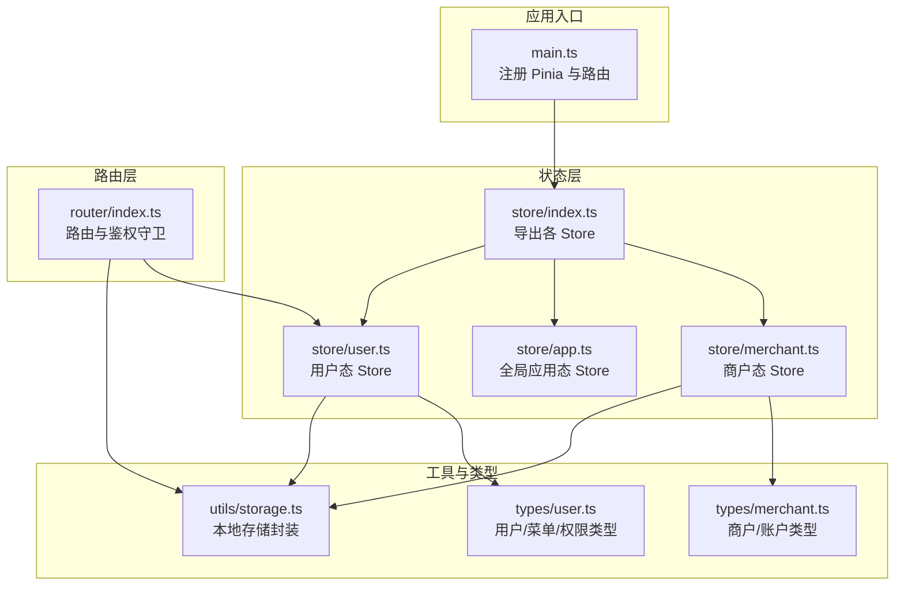
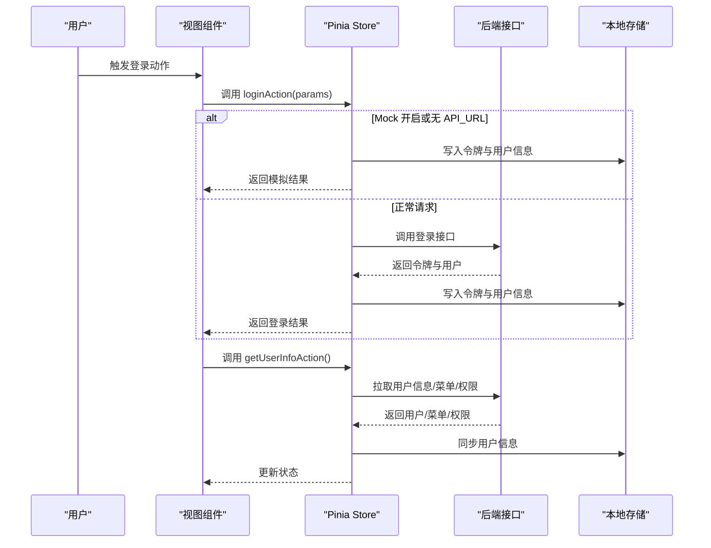
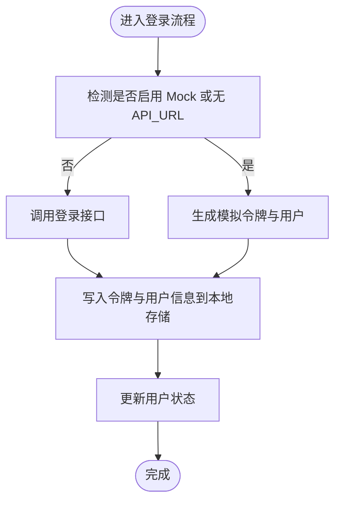
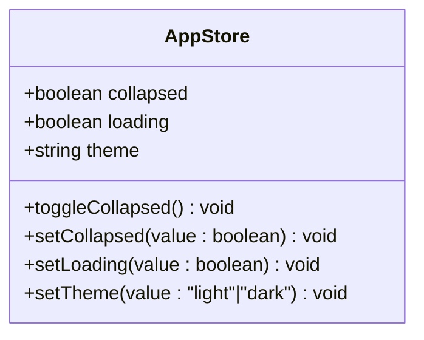
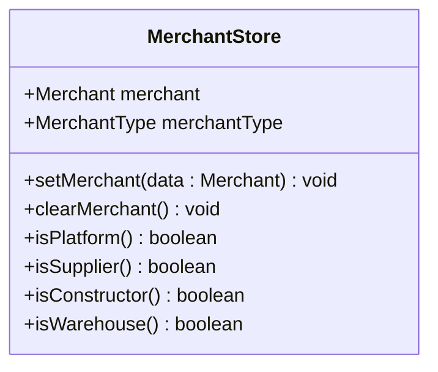
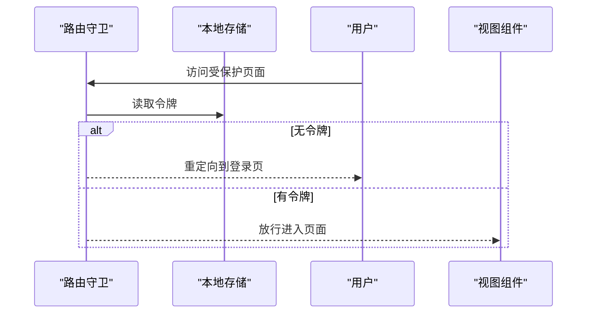
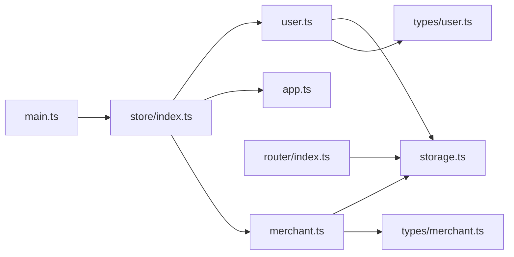

# 状态管理系统

<cite>
**本文引用的文件**
- [apps/pc/src/store/index.ts](file://apps/pc/src/store/index.ts)
- [apps/pc/src/store/user.ts](file://apps/pc/src/store/user.ts)
- [apps/pc/src/store/app.ts](file://apps/pc/src/store/app.ts)
- [apps/pc/src/store/merchant.ts](file://apps/pc/src/store/merchant.ts)
- [apps/pc/src/main.ts](file://apps/pc/src/main.ts)
- [packages/types/src/user.ts](file://packages/types/src/user.ts)
- [packages/types/src/merchant.ts](file://packages/types/src/merchant.ts)
- [packages/utils/src/storage.ts](file://packages/utils/src/storage.ts)
- [apps/pc/src/router/index.ts](file://apps/pc/src/router/index.ts)
</cite>

## 目录
1. [简介](#简介)
2. [项目结构](#项目结构)
3. [核心组件](#核心组件)
4. [架构总览](#架构总览)
5. [详细组件分析](#详细组件分析)
6. [依赖分析](#依赖分析)
7. [性能考虑](#性能考虑)
8. [故障排查指南](#故障排查指南)
9. [结论](#结论)
10. [附录](#附录)

## 简介
本文件面向“工程材料管理平台”的前端状态管理子系统，系统性梳理基于 Pinia 的状态架构设计与实现，覆盖以下主题：
- Store 模块划分：用户态、全局应用态、商户态
- 状态持久化策略：本地存储与登录态同步
- 异步状态处理：登录、登出、用户信息拉取
- 订阅与联动：路由守卫与主题切换
- 最佳实践、性能优化与调试技巧
- 实际使用模式与跨组件共享方案

## 项目结构
状态管理位于 PC 端应用中，采用 Pinia 进行集中式状态管理，并通过路由守卫与工具函数实现鉴权与持久化。

图表来源
- [apps/pc/src/main.ts:1-19](file://apps/pc/src/main.ts#L1-L19)
- [apps/pc/src/store/index.ts:1-10](file://apps/pc/src/store/index.ts#L1-L10)
- [apps/pc/src/store/user.ts:1-112](file://apps/pc/src/store/user.ts#L1-L112)
- [apps/pc/src/store/app.ts:1-36](file://apps/pc/src/store/app.ts#L1-L36)
- [apps/pc/src/store/merchant.ts:1-49](file://apps/pc/src/store/merchant.ts#L1-L49)
- [packages/utils/src/storage.ts:1-88](file://packages/utils/src/storage.ts#L1-L88)
- [packages/types/src/user.ts:1-191](file://packages/types/src/user.ts#L1-L191)
- [packages/types/src/merchant.ts:1-291](file://packages/types/src/merchant.ts#L1-L291)
- [apps/pc/src/router/index.ts:1-790](file://apps/pc/src/router/index.ts#L1-L790)

章节来源
- [apps/pc/src/main.ts:1-19](file://apps/pc/src/main.ts#L1-L19)
- [apps/pc/src/store/index.ts:1-10](file://apps/pc/src/store/index.ts#L1-L10)

## 核心组件
- 用户态 Store（useUserStore）
  - 职责：登录、登出、获取用户信息、权限校验
  - 关键字段：用户对象、菜单列表、权限集合
  - 关键方法：loginAction、getUserInfoAction、logoutAction、hasPermission、hasPermissions
- 全局应用态 Store（useAppStore）
  - 职责：侧边栏折叠、全局加载态、主题切换
  - 关键字段：collapsed、loading、theme
  - 关键方法：toggleCollapsed、setCollapsed、setLoading、setTheme
- 商户态 Store（useMerchantStore）
  - 职责：当前商户信息与类型判定
  - 关键字段：merchant、merchantType
  - 关键方法：setMerchant、clearMerchant、isPlatform/isSupplier/isConstructor/isWarehouse

章节来源
- [apps/pc/src/store/user.ts:35-111](file://apps/pc/src/store/user.ts#L35-L111)
- [apps/pc/src/store/app.ts:4-35](file://apps/pc/src/store/app.ts#L4-L35)
- [apps/pc/src/store/merchant.ts:6-47](file://apps/pc/src/store/merchant.ts#L6-L47)

## 架构总览
Pinia 在应用启动时被注入，随后在各页面组件中以组合式 API 方式访问 Store。登录态与商户态通过本地存储进行持久化，路由守卫根据令牌决定是否放行。

图表来源
- [apps/pc/src/store/user.ts:40-73](file://apps/pc/src/store/user.ts#L40-L73)
- [packages/utils/src/storage.ts:10-41](file://packages/utils/src/storage.ts#L10-L41)

## 详细组件分析

### 用户态 Store（useUserStore）
- 设计要点
  - 使用组合式 API 定义 Store，返回响应式状态与方法
  - 支持 Mock 模式与真实 API 切换，便于开发联调
  - 登录成功后写入令牌与用户信息，登出时清理并跳转登录页
  - 提供权限校验方法，支持单权限与多权限判断
- 数据结构与复杂度
  - 状态为轻量对象与数组，读写操作时间复杂度 O(1)
  - 权限判断基于数组包含性检查，平均 O(n)，n 为权限数量
- 错误处理
  - 登出时对网络异常进行忽略处理，保证本地清理流程稳定
- 性能建议
  - 将权限列表作为只读快照缓存，避免重复计算
  - 对频繁调用的权限判断可引入 memo 化

图表来源
- [apps/pc/src/store/user.ts:40-56](file://apps/pc/src/store/user.ts#L40-L56)
- [packages/utils/src/storage.ts:10-41](file://packages/utils/src/storage.ts#L10-L41)

章节来源
- [apps/pc/src/store/user.ts:35-111](file://apps/pc/src/store/user.ts#L35-L111)
- [packages/types/src/user.ts:6-149](file://packages/types/src/user.ts#L6-L149)

### 全局应用态 Store（useAppStore）
- 设计要点
  - 维护布局折叠、全局加载态与主题色
  - 主题切换通过设置 DOM 属性实现，便于样式系统联动
- 使用场景
  - 侧边栏折叠控制、加载遮罩、深浅主题切换

图表来源
- [apps/pc/src/store/app.ts:4-35](file://apps/pc/src/store/app.ts#L4-L35)

章节来源
- [apps/pc/src/store/app.ts:1-36](file://apps/pc/src/store/app.ts#L1-L36)

### 商户态 Store（useMerchantStore）
- 设计要点
  - 维护当前商户信息与类型枚举
  - 提供类型判定方法，便于不同角色界面差异化渲染
  - 设置与清空商户信息时同步本地存储
- 类型与职责
  - Merchant 与 MerchantType 来源于类型定义，确保强类型约束

图表来源
- [apps/pc/src/store/merchant.ts:6-47](file://apps/pc/src/store/merchant.ts#L6-L47)
- [packages/types/src/merchant.ts:31-47](file://packages/types/src/merchant.ts#L31-L47)

章节来源
- [apps/pc/src/store/merchant.ts:1-49](file://apps/pc/src/store/merchant.ts#L1-L49)
- [packages/types/src/merchant.ts:1-291](file://packages/types/src/merchant.ts#L1-L291)

### 状态持久化与订阅机制
- 持久化策略
  - 令牌与用户信息：登录成功后写入本地存储；登出时统一清理
  - 商户信息：设置与清空时同步本地存储
- 订阅与联动
  - 路由守卫在导航前检查令牌，未登录则重定向至登录页
  - 应用主题变更通过 Store 方法直接作用于 DOM 属性，实现全局样式联动

图表来源
- [apps/pc/src/router/index.ts:776-787](file://apps/pc/src/router/index.ts#L776-L787)
- [packages/utils/src/storage.ts:6-16](file://packages/utils/src/storage.ts#L6-L16)

章节来源
- [packages/utils/src/storage.ts:1-88](file://packages/utils/src/storage.ts#L1-L88)
- [apps/pc/src/router/index.ts:1-790](file://apps/pc/src/router/index.ts#L1-L790)

## 依赖分析
- 组件耦合
  - Store 之间低耦合：用户态与商户态独立，仅通过本地存储交互
  - 与工具层弱耦合：通过 storage 工具函数进行本地存储
  - 与路由层弱耦合：路由守卫仅依赖令牌读取，不直接依赖具体 Store
- 外部依赖
  - Pinia：集中式状态容器
  - Vue Router：导航守卫与页面跳转
  - @arco-design/web-vue：UI 主题切换依赖 DOM 属性

图表来源
- [apps/pc/src/store/user.ts:1-112](file://apps/pc/src/store/user.ts#L1-L112)
- [apps/pc/src/store/merchant.ts:1-49](file://apps/pc/src/store/merchant.ts#L1-L49)
- [apps/pc/src/store/app.ts:1-36](file://apps/pc/src/store/app.ts#L1-L36)
- [packages/utils/src/storage.ts:1-88](file://packages/utils/src/storage.ts#L1-L88)
- [packages/types/src/user.ts:1-191](file://packages/types/src/user.ts#L1-L191)
- [packages/types/src/merchant.ts:1-291](file://packages/types/src/merchant.ts#L1-L291)
- [apps/pc/src/router/index.ts:1-790](file://apps/pc/src/router/index.ts#L1-L790)
- [apps/pc/src/main.ts:1-19](file://apps/pc/src/main.ts#L1-L19)
- [apps/pc/src/store/index.ts:1-10](file://apps/pc/src/store/index.ts#L1-L10)

章节来源
- [apps/pc/src/store/index.ts:1-10](file://apps/pc/src/store/index.ts#L1-L10)
- [apps/pc/src/main.ts:1-19](file://apps/pc/src/main.ts#L1-L19)

## 性能考虑
- 状态粒度
  - 将用户信息拆分为 user、menus、permissions，避免单一大对象频繁重渲染
- 异步处理
  - 登录与获取用户信息为 IO 密集型，应结合全局 loading 状态提升用户体验
- 主题切换
  - 主题切换仅修改 DOM 属性，开销极小；如需动画可在外层组件添加过渡
- 存储策略
  - 令牌与用户信息分离存储，减少序列化体积；对大对象使用懒加载或分段存储

## 故障排查指南
- 登录后无法进入受保护页面
  - 检查路由守卫是否正确读取令牌
  - 确认登录流程是否写入令牌与用户信息
- 登出后仍可访问受保护页面
  - 检查登出流程是否调用清理函数并跳转登录页
- 权限判断失效
  - 确认用户信息拉取后权限集合已更新
  - 避免在权限未就绪时进行权限判断
- 主题切换无效
  - 检查主题切换方法是否设置了正确的 DOM 属性值

章节来源
- [apps/pc/src/router/index.ts:776-787](file://apps/pc/src/router/index.ts#L776-L787)
- [apps/pc/src/store/user.ts:75-91](file://apps/pc/src/store/user.ts#L75-L91)
- [apps/pc/src/store/app.ts:21-24](file://apps/pc/src/store/app.ts#L21-L24)
- [packages/utils/src/storage.ts:56-61](file://packages/utils/src/storage.ts#L56-L61)

## 结论
该状态管理架构以 Pinia 为核心，围绕用户态、全局应用态、商户态三大 Store 构建，配合本地存储与路由守卫形成完整的登录态与权限控制闭环。整体设计简洁清晰、职责明确，具备良好的扩展性与维护性。建议后续在权限缓存、异步状态合并与调试工具方面进一步完善。

## 附录
- 实际使用模式
  - 在页面组件中通过组合式 API 获取 Store 实例，调用对应方法更新状态
  - 在布局组件中订阅全局应用态，实现主题与布局联动
  - 在菜单组件中订阅用户态的菜单与权限，动态渲染菜单树
- 跨组件状态共享
  - 通过 Store 实例在任意组件中共享状态，无需层层 props 下传
  - 对于高频渲染区域，可使用 computed 从 Store 中派生计算属性，降低重渲染成本