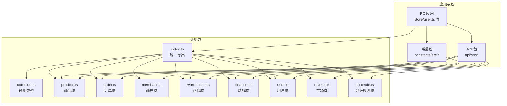
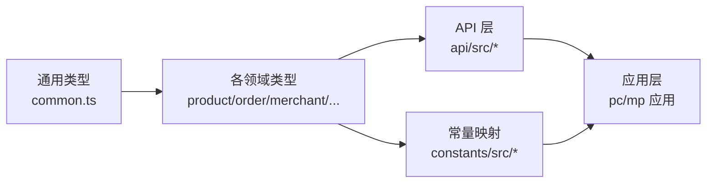
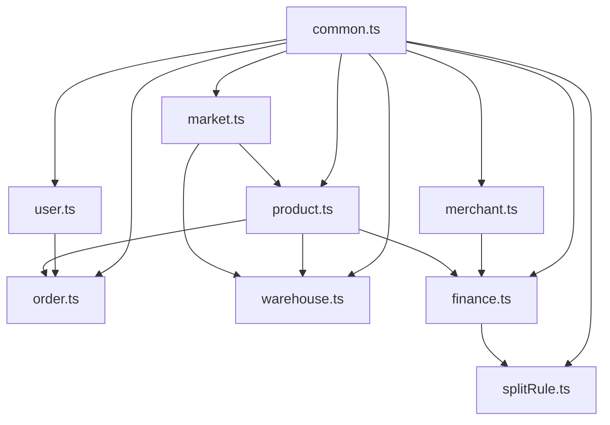

# 类型系统

<cite>
**本文引用的文件**   
- [packages/types/src/index.ts](file://packages/types/src/index.ts)
- [packages/types/src/common.ts](file://packages/types/src/common.ts)
- [packages/types/src/product.ts](file://packages/types/src/product.ts)
- [packages/types/src/order.ts](file://packages/types/src/order.ts)
- [packages/types/src/merchant.ts](file://packages/types/src/merchant.ts)
- [packages/types/src/warehouse.ts](file://packages/types/src/warehouse.ts)
- [packages/types/src/finance.ts](file://packages/types/src/finance.ts)
- [packages/types/src/user.ts](file://packages/types/src/user.ts)
- [packages/types/src/market.ts](file://packages/types/src/market.ts)
- [packages/types/src/splitRule.ts](file://packages/types/src/splitRule.ts)
- [tsconfig.base.json](file://tsconfig.base.json)
- [packages/constants/src/index.ts](file://packages/constants/src/index.ts)
- [packages/constants/src/product.ts](file://packages/constants/src/product.ts)
- [packages/api/src/index.ts](file://packages/api/src/index.ts)
- [packages/api/src/product.ts](file://packages/api/src/product.ts)
- [packages/api/src/mock/product.ts](file://packages/api/src/mock/product.ts)
- [apps/pc/src/store/user.ts](file://apps/pc/src/store/user.ts)
- [apps/pc/src/store/app.ts](file://apps/pc/src/store/app.ts)
</cite>

## 目录
1. [引言](#引言)
2. [项目结构](#项目结构)
3. [核心组件](#核心组件)
4. [架构总览](#架构总览)
5. [详细组件分析](#详细组件分析)
6. [依赖分析](#依赖分析)
7. [性能考虑](#性能考虑)
8. [故障排查指南](#故障排查指南)
9. [结论](#结论)
10. [附录](#附录)

## 引言
本文件系统化梳理工程材料管理平台的 TypeScript 类型系统，聚焦于类型设计架构、接口定义规范、枚举管理、泛型与类型推导策略，并结合业务实体（商品、订单、商户、仓库、财务）、API 响应、表单校验与状态管理等场景，总结类型安全最佳实践、扩展与兼容策略，以及模块化组织与代码提示优化方法。目标是帮助开发者在复杂业务中保持类型一致性、可维护性与可演进性。

## 项目结构
类型系统采用“包内模块化 + 路径别名”的组织方式：
- 核心类型包：packages/types/src 下按领域拆分模块（如 product、order、merchant、warehouse、finance、user、market、splitRule、common）
- 统一出口：index.ts 导出各模块类型，便于统一引入
- 路径别名：tsconfig.base.json 中配置 @gongchengcang/types 指向 packages/types/src，确保跨应用与包引用一致
- 常量映射：packages/constants/src 提供业务选项与映射，复用类型枚举值
- API 层：packages/api/src 使用并暴露类型，形成“类型-实现”闭环

图表来源
- [packages/types/src/index.ts:1-10](file://packages/types/src/index.ts#L1-L10)
- [tsconfig.base.json:21-26](file://tsconfig.base.json#L21-L26)
- [packages/constants/src/index.ts:1-6](file://packages/constants/src/index.ts#L1-L6)
- [packages/api/src/index.ts:1-10](file://packages/api/src/index.ts#L1-L10)

章节来源
- [packages/types/src/index.ts:1-10](file://packages/types/src/index.ts#L1-L10)
- [tsconfig.base.json:1-29](file://tsconfig.base.json#L1-L29)

## 核心组件
- 通用类型与工具
  - 分页参数与结果：PaginationParams、PaginationResult
  - API 响应包装：ApiResponse、ApiErrorResponse
  - 选择与树形选项：SelectOption、TreeOption
  - 上传文件：UploadFile
  - 地址与时间范围：Address、TimeRange
- 领域类型
  - 商品：类别、属性、SPU/SKU、价格、统计、异常、供应商/仓库产品等
  - 订单：订单主体、明细、状态、支付方式与采购计划
  - 商户：租户类型、合同、资质、资金托管账户等
  - 仓储：仓库、区域、库位、库存与出入库记录
  - 财务：账户、交易、分账规则、资金托管
  - 用户：用户、角色、权限、菜单、登录参数与返回
  - 市场：市场商品、价格调整、类目、库存预警
  - 分账规则：规则项、状态、审计、版本与日志

章节来源
- [packages/types/src/common.ts:1-65](file://packages/types/src/common.ts#L1-L65)
- [packages/types/src/product.ts:1-431](file://packages/types/src/product.ts#L1-L431)
- [packages/types/src/order.ts:1-124](file://packages/types/src/order.ts#L1-L124)
- [packages/types/src/merchant.ts:1-291](file://packages/types/src/merchant.ts#L1-L291)
- [packages/types/src/warehouse.ts:1-112](file://packages/types/src/warehouse.ts#L1-L112)
- [packages/types/src/finance.ts:1-95](file://packages/types/src/finance.ts#L1-L95)
- [packages/types/src/user.ts:1-191](file://packages/types/src/user.ts#L1-L191)
- [packages/types/src/market.ts:1-212](file://packages/types/src/market.ts#L1-L212)
- [packages/types/src/splitRule.ts:1-166](file://packages/types/src/splitRule.ts#L1-L166)

## 架构总览
类型系统遵循“领域驱动 + 可复用”的设计原则：
- 领域内聚：每个模块聚焦单一业务域，避免类型耦合扩散
- 可复用抽象：common.ts 提供跨域通用类型，减少重复定义
- 明确边界：枚举与字面量类型用于约束取值范围，提升可读性与安全性
- 统一入口：index.ts 汇总导出，降低导入成本与路径差异
- 与实现解耦：API 包仅使用类型，不引入运行时依赖，保证纯类型契约

图表来源
- [packages/types/src/common.ts:1-65](file://packages/types/src/common.ts#L1-L65)
- [packages/types/src/product.ts:1-431](file://packages/types/src/product.ts#L1-L431)
- [packages/types/src/order.ts:1-124](file://packages/types/src/order.ts#L1-L124)
- [packages/types/src/merchant.ts:1-291](file://packages/types/src/merchant.ts#L1-L291)
- [packages/types/src/warehouse.ts:1-112](file://packages/types/src/warehouse.ts#L1-L112)
- [packages/types/src/finance.ts:1-95](file://packages/types/src/finance.ts#L1-L95)
- [packages/types/src/user.ts:1-191](file://packages/types/src/user.ts#L1-L191)
- [packages/types/src/market.ts:1-212](file://packages/types/src/market.ts#L1-L212)
- [packages/types/src/splitRule.ts:1-166](file://packages/types/src/splitRule.ts#L1-L166)
- [packages/constants/src/index.ts:1-6](file://packages/constants/src/index.ts#L1-L6)
- [packages/api/src/index.ts:1-10](file://packages/api/src/index.ts#L1-L10)

## 详细组件分析

### 通用类型与工具（common.ts）
- 设计要点
  - 分页：统一 page/pageSize，结果包含 list/total/page/pageSize/totalPages
  - API 响应：统一 code/message/data；错误响应支持字段级错误数组
  - 选择与树形：SelectOption/TreeOption 支持层级与禁用
  - 上传文件：标准化上传状态与元信息
  - 地址与时间范围：标准化地理与时间区间表达
- 复杂度与性能
  - 通用类型为 O(1) 结构，不引入计算开销
  - 通过 Record<string, string[]> 等轻量结构承载动态字段，利于扩展
- 最佳实践
  - 所有 API 返回统一包裹 ApiResponse
  - 表单校验错误统一映射到 ApiErrorResponse.errors 的键值对
  - 上传组件统一使用 UploadFile，便于统一处理

章节来源
- [packages/types/src/common.ts:1-65](file://packages/types/src/common.ts#L1-L65)

### 商品域（product.ts）
- 设计要点
  - 枚举：类别状态、SPU/SKU 状态、属性类型、价格类型、审计状态
  - 接口：Category/Attr/Spu/Sku、价格信息、操作日志、统计、异常商品、供应商/仓库产品
  - 参数：创建/更新参数接口，分离入参与存储结构
  - 选项：各类状态与类型对应的 SelectOption 列表，便于 UI 绑定
- 复杂度与性能
  - 数据结构以扁平对象为主，查询与遍历成本低
  - 规则：通过枚举与字面量类型约束取值，减少运行时校验
- 最佳实践
  - 使用 CreateXxxParams/UpdateXxxParams 明确入参约束
  - 通过 Options 列表与映射表配合，实现前后端一致的展示与校验
  - 对于规格 specs 使用 Record<string, string>，保持灵活与类型安全

章节来源
- [packages/types/src/product.ts:1-431](file://packages/types/src/product.ts#L1-L431)

### 订单域（order.ts）
- 设计要点
  - 订单主体：包含买卖双方、仓库、明细、金额与支付状态
  - 订单类型与状态：枚举化，统一管理生命周期
  - 支付方式与状态：PayType/PayStatus
  - 采购计划：Plan/PlanItem，支持估算与实际金额
- 复杂度与性能
  - 订单明细为数组，聚合计算可通过 reduce 等函数式方法完成
  - 枚举与字面量类型确保状态机清晰，利于前端状态管理
- 最佳实践
  - 在 store 中以只读快照保存订单数据，避免直接修改
  - 使用泛型辅助计算（如金额合计）时，明确输入输出类型

章节来源
- [packages/types/src/order.ts:1-124](file://packages/types/src/order.ts#L1-L124)

### 商户域（merchant.ts）
- 设计要点
  - 租户类型与商户信息：TenantType/Merchant
  - 合同与资质：Contract/Qualification 及其表单数据结构
  - 资金托管：账户状态、开立与绑卡流程的状态机
- 复杂度与性能
  - 企业信息、结算账户等结构化数据便于表单与校验
  - 状态枚举覆盖开立、绑卡、账户余额等关键节点
- 最佳实践
  - 将表单数据结构与持久化结构分离（FormData vs 实体）
  - 通过状态机枚举约束流程合法性，减少分支判断

章节来源
- [packages/types/src/merchant.ts:1-291](file://packages/types/src/merchant.ts#L1-L291)

### 仓储域（warehouse.ts）
- 设计要点
  - 仓库、区域、库位：层次化结构，支持状态与容量
  - 库存与出入库记录：Stock/StockRecord，区分多种出入库类型
- 复杂度与性能
  - 库位编码与行列层结构便于定位与检索
  - 出入库类型枚举化，简化业务分支
- 最佳实践
  - 库存冻结/可用量分离，避免并发写导致的不一致
  - 出入库记录保留前/后数量，便于审计与对账

章节来源
- [packages/types/src/warehouse.ts:1-112](file://packages/types/src/warehouse.ts#L1-L112)

### 财务域（finance.ts）
- 设计要点
  - 账户与交易：Account/Transaction，支持多种交易类型与状态
  - 分账规则：OrderSplitRule 及其项，支持按订单/商品/客户维度
  - 资金托管：FundCustody 与状态
- 复杂度与性能
  - 规则项支持百分比或固定值，优先级控制决定匹配顺序
  - 交易状态机清晰，便于前端展示与风控
- 最佳实践
  - 分账规则版本化与日志化，保障变更可追溯
  - 交易流水与账户余额异步同步时，使用幂等与重试策略

章节来源
- [packages/types/src/finance.ts:1-95](file://packages/types/src/finance.ts#L1-L95)
- [packages/types/src/splitRule.ts:1-166](file://packages/types/src/splitRule.ts#L1-L166)

### 用户域（user.ts）
- 设计要点
  - 用户、角色、权限、菜单：完整的 RBAC 模型
  - 登录参数与返回：LoginParams/LoginResult
  - 菜单项：MenuItem 支持层级
- 复杂度与性能
  - 权限类型枚举化，便于前端路由与按钮级权限控制
  - 菜单树结构支持懒加载与渲染优化
- 最佳实践
  - 将权限与菜单从用户信息中分离，按需加载
  - 登录成功后统一写入 token 与用户信息，store 内部保持不可变

章节来源
- [packages/types/src/user.ts:1-191](file://packages/types/src/user.ts#L1-L191)

### 市场域（market.ts）
- 设计要点
  - 市场商品：包含供应商、供应状态、上下架状态、标签与权重
  - 价格调整：单批调价、申请与审批流程
  - 库存预警：告警级别与处理状态
- 复杂度与性能
  - 供应商列表与优先级便于智能推荐与下单
  - 告警级别枚举化，便于统一处理
- 最佳实践
  - 价格调整记录与审批流程解耦，支持异步审批
  - 库存预警与安全库存联动，触发补货提醒

章节来源
- [packages/types/src/market.ts:1-212](file://packages/types/src/market.ts#L1-L212)

### 类型安全最佳实践
- 枚举与字面量
  - 使用 enum/联合字面量限定取值，避免魔法字符串
- 泛型与条件类型
  - 对 API 响应使用泛型包裹数据体，保持请求/响应一致性
- 只读与不可变
  - 在 store 中以只读快照保存类型化数据，避免意外修改
- 选项与映射
  - 通过 Options 列表与映射表（如 PRODUCT_STATUS_MAP）统一展示与校验
- 入参与实体分离
  - CreateXxxParams/UpdateXxxParams 与实体结构分离，便于校验与转换

章节来源
- [packages/types/src/common.ts:14-24](file://packages/types/src/common.ts#L14-L24)
- [packages/types/src/product.ts:110-133](file://packages/types/src/product.ts#L110-L133)
- [packages/types/src/product.ts:166-196](file://packages/types/src/product.ts#L166-L196)
- [packages/types/src/user.ts:131-143](file://packages/types/src/user.ts#L131-L143)

### 类型扩展与兼容策略
- 向后兼容
  - 新增字段使用可选属性，避免破坏既有消费方
  - 通过 Options 列表新增选项，不改变现有枚举值
- 版本化
  - 对于复杂规则（如分账规则），使用版本号与日志追踪变更
- 迁移策略
  - 旧字段标注废弃，逐步替换为新字段与新类型
  - 通过映射表与适配器处理历史数据格式

章节来源
- [packages/types/src/splitRule.ts:146-166](file://packages/types/src/splitRule.ts#L146-L166)
- [packages/types/src/merchant.ts:165-171](file://packages/types/src/merchant.ts#L165-L171)

### 模块化管理与代码提示优化
- 统一导出与路径别名
  - index.ts 汇总导出，tsconfig.base.json 配置路径别名，确保跨包引用一致
- 常量映射
  - constants 包提供枚举到显示文本与颜色的映射，提升开发体验
- API 与类型解耦
  - API 包仅使用类型，不引入运行时逻辑，利于 IDE 提示与编译检查

章节来源
- [packages/types/src/index.ts:1-10](file://packages/types/src/index.ts#L1-L10)
- [tsconfig.base.json:21-26](file://tsconfig.base.json#L21-L26)
- [packages/constants/src/index.ts:1-6](file://packages/constants/src/index.ts#L1-L6)
- [packages/api/src/index.ts:1-10](file://packages/api/src/index.ts#L1-L10)

## 依赖分析
类型系统内部依赖关系清晰，遵循“通用 -> 领域”的层次化设计；外部依赖主要来自应用层与 API 层，API 层通过 @gongchengcang/types 引用类型，常量包通过 @gongchengcang/types 引用枚举与类型。

图表来源
- [packages/types/src/common.ts:1-65](file://packages/types/src/common.ts#L1-L65)
- [packages/types/src/product.ts:1-431](file://packages/types/src/product.ts#L1-L431)
- [packages/types/src/order.ts:1-124](file://packages/types/src/order.ts#L1-L124)
- [packages/types/src/merchant.ts:1-291](file://packages/types/src/merchant.ts#L1-L291)
- [packages/types/src/warehouse.ts:1-112](file://packages/types/src/warehouse.ts#L1-L112)
- [packages/types/src/finance.ts:1-95](file://packages/types/src/finance.ts#L1-L95)
- [packages/types/src/user.ts:1-191](file://packages/types/src/user.ts#L1-L191)
- [packages/types/src/market.ts:1-212](file://packages/types/src/market.ts#L1-L212)
- [packages/types/src/splitRule.ts:1-166](file://packages/types/src/splitRule.ts#L1-L166)

## 性能考虑
- 类型层面
  - 使用字面量联合类型替代宽泛字符串，减少运行时校验
  - 通过 Record 与数组表达动态结构，避免深层嵌套带来的遍历成本
- 应用层面
  - store 中缓存只读快照，避免重复计算与深拷贝
  - API 响应统一包装，便于前端节流与去抖

## 故障排查指南
- 常见问题
  - 字段缺失或类型不匹配：检查 Create/Update 参数与实体是否一致
  - 状态非法：确认状态枚举取值是否在允许范围内
  - API 响应结构不一致：统一使用 ApiResponse 包裹
- 定位方法
  - 在 API 层打印请求与响应类型签名
  - 在 store 中对关键数据进行类型断言与防御性编程
  - 使用常量映射核对 UI 展示与后端枚举的一致性

章节来源
- [packages/types/src/common.ts:14-24](file://packages/types/src/common.ts#L14-L24)
- [packages/api/src/product.ts:205-257](file://packages/api/src/product.ts#L205-L257)
- [apps/pc/src/store/user.ts:35-112](file://apps/pc/src/store/user.ts#L35-L112)

## 结论
该类型系统以“领域划分 + 通用抽象 + 枚举约束 + 统一导出”为核心，实现了高内聚、低耦合、强一致的类型契约。通过常量映射与 API 解耦，提升了开发效率与可维护性。建议持续：
- 保持枚举与选项的同步更新
- 对新增字段采用可选策略，确保向后兼容
- 在复杂规则场景引入版本化与日志化机制
- 加强类型文档与示例，提升团队协作效率

## 附录

### 类型使用示例与场景
- 商品管理
  - 创建/更新 SPU/SKU：使用 CreateSpuParams/UpdateSpuParams 与 CreateSkuParams/UpdateSkuParams
  - 批量上下架：使用 SkuStatus 枚举与批量更新接口
- 订单处理
  - 订单状态机：基于 OrderStatus/PayStatus 控制流程
  - 采购计划：PurchasePlan/PurchasePlanItem 支持估算与执行
- 商户与财务
  - 合同与资质：Contract/Qualification 及其表单结构
  - 账户与交易：Account/Transaction 支持多种交易类型
- 市场与仓储
  - 市场商品：MarketProduct 与供应商优先级
  - 库存预警：StockAlert 与安全库存联动

章节来源
- [packages/api/src/product.ts:205-257](file://packages/api/src/product.ts#L205-L257)
- [packages/api/src/mock/product.ts:1-25](file://packages/api/src/mock/product.ts#L1-L25)
- [packages/constants/src/product.ts:1-25](file://packages/constants/src/product.ts#L1-L25)
- [apps/pc/src/store/user.ts:35-112](file://apps/pc/src/store/user.ts#L35-L112)
- [apps/pc/src/store/app.ts:1-36](file://apps/pc/src/store/app.ts#L1-L36)