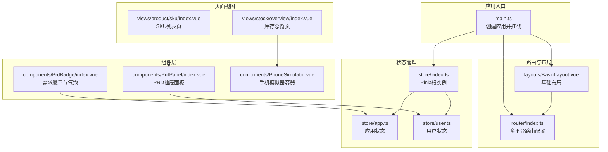
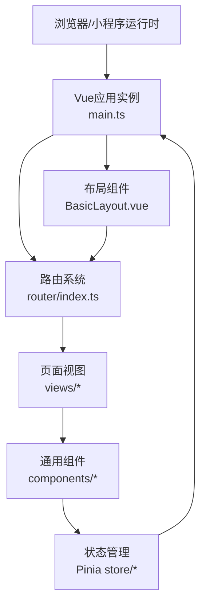
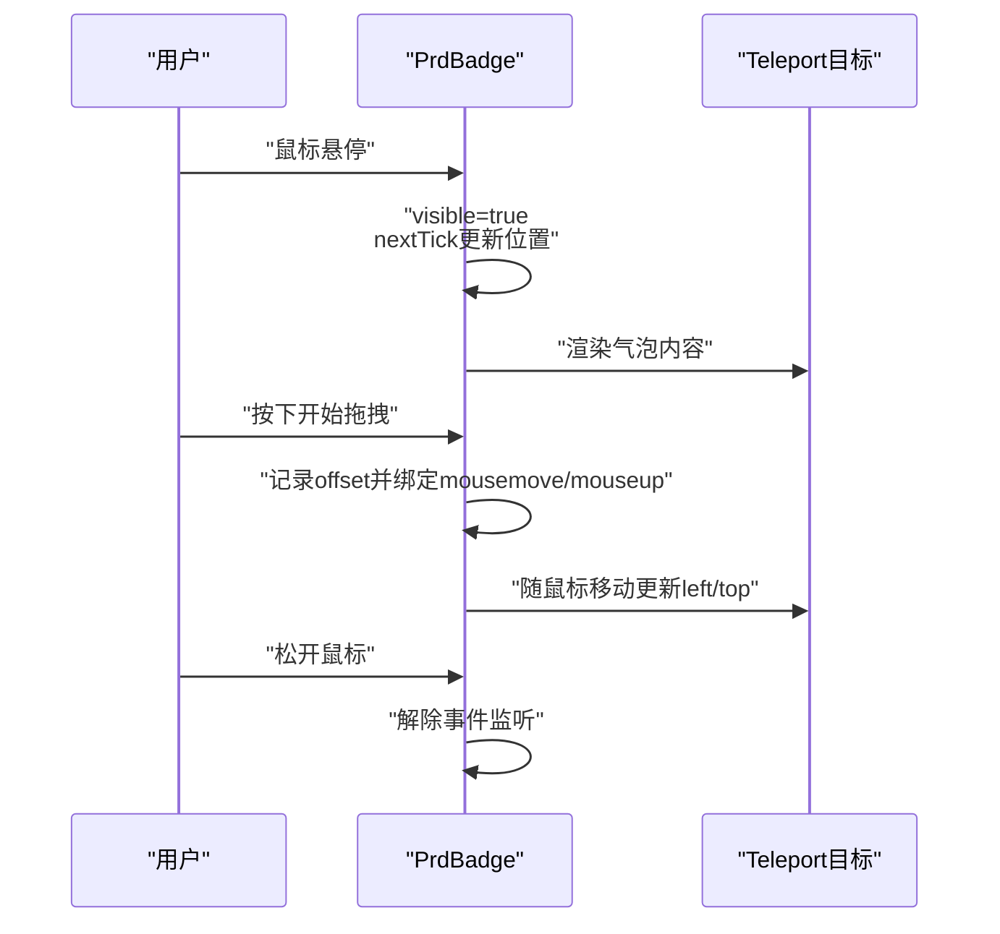
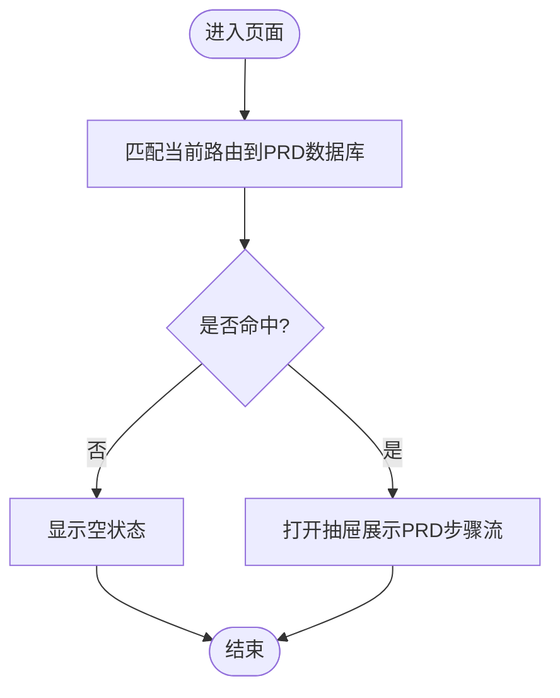
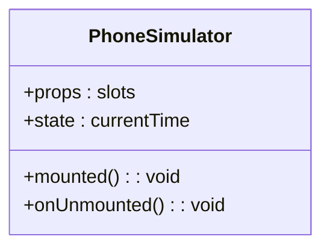
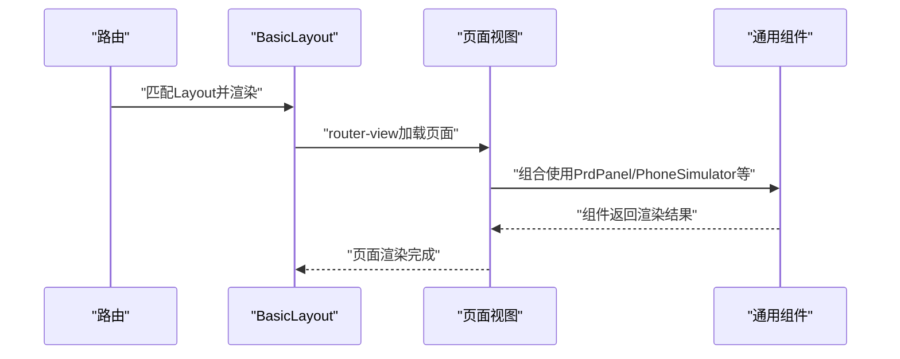
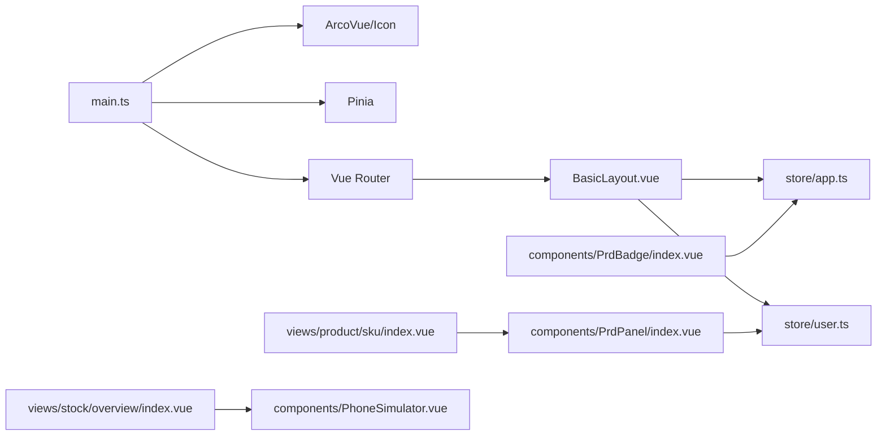

# 组件架构

<cite>
**本文引用的文件**
- [apps/pc/src/components/PrdBadge/index.vue](file://apps/pc/src/components/PrdBadge/index.vue)
- [apps/pc/src/components/PrdPanel/index.vue](file://apps/pc/src/components/PrdPanel/index.vue)
- [apps/pc/src/components/PhoneSimulator.vue](file://apps/pc/src/components/PhoneSimulator.vue)
- [apps/pc/src/layouts/BasicLayout.vue](file://apps/pc/src/layouts/BasicLayout.vue)
- [apps/pc/src/main.ts](file://apps/pc/src/main.ts)
- [apps/pc/src/router/index.ts](file://apps/pc/src/router/index.ts)
- [apps/pc/src/store/index.ts](file://apps/pc/src/store/index.ts)
- [apps/pc/src/store/app.ts](file://apps/pc/src/store/app.ts)
- [apps/pc/src/store/user.ts](file://apps/pc/src/store/user.ts)
- [apps/pc/src/views/product/sku/index.vue](file://apps/pc/src/views/product/sku/index.vue)
- [apps/pc/src/views/stock/overview/index.vue](file://apps/pc/src/views/stock/overview/index.vue)
</cite>

## 目录
1. [引言](#引言)
2. [项目结构](#项目结构)
3. [核心组件](#核心组件)
4. [架构总览](#架构总览)
5. [详细组件分析](#详细组件分析)
6. [依赖分析](#依赖分析)
7. [性能考虑](#性能考虑)
8. [故障排查指南](#故障排查指南)
9. [结论](#结论)
10. [附录](#附录)

## 引言
本文件面向“工程材料管理平台”的前端组件化架构，系统梳理基础组件设计、业务组件封装、组件通信机制与复用策略；深入解析组件的 props 设计、事件处理、插槽使用与生命周期管理；总结组件开发最佳实践、性能优化技巧与可访问性设计；并给出组件库的组织结构、命名规范、文档编写与版本管理建议。同时通过真实页面与组件示例，展示组件的实际使用场景与扩展方法。

## 项目结构
本项目采用多端（PC 端、小程序端）与多平台（平台端、供应商端、施工方端、工程仓端）的分层组织方式，前端以 Vue 3 + TypeScript + Pinia + Vue Router + Arco Design 为核心技术栈。组件层位于 PC 端应用的 components 目录，页面视图位于 views 目录，布局层位于 layouts 目录，状态管理位于 store 目录，路由配置位于 router 目录。

图表来源
- [apps/pc/src/main.ts:1-19](file://apps/pc/src/main.ts#L1-L19)
- [apps/pc/src/router/index.ts:1-790](file://apps/pc/src/router/index.ts#L1-L790)
- [apps/pc/src/layouts/BasicLayout.vue:1-349](file://apps/pc/src/layouts/BasicLayout.vue#L1-L349)
- [apps/pc/src/components/PrdBadge/index.vue:1-303](file://apps/pc/src/components/PrdBadge/index.vue#L1-L303)
- [apps/pc/src/components/PrdPanel/index.vue:1-634](file://apps/pc/src/components/PrdPanel/index.vue#L1-L634)
- [apps/pc/src/components/PhoneSimulator.vue:1-144](file://apps/pc/src/components/PhoneSimulator.vue#L1-L144)
- [apps/pc/src/views/product/sku/index.vue:1-200](file://apps/pc/src/views/product/sku/index.vue#L1-L200)
- [apps/pc/src/views/stock/overview/index.vue:1-200](file://apps/pc/src/views/stock/overview/index.vue#L1-L200)
- [apps/pc/src/store/index.ts:1-10](file://apps/pc/src/store/index.ts#L1-L10)
- [apps/pc/src/store/app.ts:1-36](file://apps/pc/src/store/app.ts#L1-L36)
- [apps/pc/src/store/user.ts:1-112](file://apps/pc/src/store/user.ts#L1-L112)

章节来源
- [apps/pc/src/main.ts:1-19](file://apps/pc/src/main.ts#L1-L19)
- [apps/pc/src/router/index.ts:1-790](file://apps/pc/src/router/index.ts#L1-L790)
- [apps/pc/src/layouts/BasicLayout.vue:1-349](file://apps/pc/src/layouts/BasicLayout.vue#L1-L349)

## 核心组件
本节聚焦三个关键组件：PrdBadge（需求徽章）、PrdPanel（PRD抽屉面板）、PhoneSimulator（手机模拟器），它们分别承担“轻量提示”、“内容聚合展示”和“容器化预览”的职责，体现了组件的单一职责与可复用性。

- PrdBadge：基于 Teleport 将气泡渲染到 body，支持拖拽、边界适配与动态内容渲染，适合在任意页面叠加提示。
- PrdPanel：根据当前路由匹配 PRD 数据库，以步骤流形式展示需求文档，配合抽屉组件实现非侵入式阅读体验。
- PhoneSimulator：提供手机外观与状态栏，作为移动端预览的容器，内部通过插槽承载任意内容。

章节来源
- [apps/pc/src/components/PrdBadge/index.vue:1-303](file://apps/pc/src/components/PrdBadge/index.vue#L1-L303)
- [apps/pc/src/components/PrdPanel/index.vue:1-634](file://apps/pc/src/components/PrdPanel/index.vue#L1-L634)
- [apps/pc/src/components/PhoneSimulator.vue:1-144](file://apps/pc/src/components/PhoneSimulator.vue#L1-L144)

## 架构总览
整体采用“布局 + 路由 + 组件 + 页面 + 状态”的分层架构。布局层负责导航与面包屑；路由层负责多平台路径映射与鉴权守卫；组件层提供通用能力；页面层组合组件完成业务；状态层集中管理主题、菜单、用户等全局状态。

图表来源
- [apps/pc/src/main.ts:1-19](file://apps/pc/src/main.ts#L1-L19)
- [apps/pc/src/layouts/BasicLayout.vue:1-349](file://apps/pc/src/layouts/BasicLayout.vue#L1-L349)
- [apps/pc/src/router/index.ts:1-790](file://apps/pc/src/router/index.ts#L1-L790)
- [apps/pc/src/store/index.ts:1-10](file://apps/pc/src/store/index.ts#L1-L10)

## 详细组件分析

### PrdBadge 组件分析
- 设计理念：以“轻提示 + 可拖拽气泡”为核心，避免遮挡页面主体，提升阅读体验。
- Props 设计：reqId、moduleName、content、top、right，满足不同页面定位与内容渲染。
- 事件处理：鼠标进入/离开控制可见性；拖拽事件计算偏移并更新气泡位置；卸载时清理事件监听。
- 插槽与生命周期：无插槽；使用 onMounted/onUnmounted 管理副作用。
- 性能与可访问性：Teleport 渲染到 body，避免层级问题；边界检测防止溢出；提供关闭按钮便于用户交互。

图表来源
- [apps/pc/src/components/PrdBadge/index.vue:71-133](file://apps/pc/src/components/PrdBadge/index.vue#L71-L133)

章节来源
- [apps/pc/src/components/PrdBadge/index.vue:1-303](file://apps/pc/src/components/PrdBadge/index.vue#L1-L303)

### PrdPanel 组件分析
- 设计理念：将分散的需求文档以步骤流形式集中展示，支持按页面维度检索与展示。
- 数据结构：内置 PRD 数据库，键为路由路径，值为页面名称与需求条目数组。
- 匹配逻辑：清洗路由路径后进行前缀/后缀匹配，返回对应 PRD 内容。
- 交互设计：悬浮按钮打开抽屉；抽屉内使用步骤流与卡片展示 Markdown 内容；空状态提示。
- 与状态管理：依赖路由与用户权限（如需），通过路由驱动内容切换。

图表来源
- [apps/pc/src/components/PrdPanel/index.vue:497-527](file://apps/pc/src/components/PrdPanel/index.vue#L497-L527)

章节来源
- [apps/pc/src/components/PrdPanel/index.vue:1-634](file://apps/pc/src/components/PrdPanel/index.vue#L1-L634)

### PhoneSimulator 组件分析
- 设计理念：提供手机外观与状态栏，作为移动端预览容器，内部通过插槽承载任意内容。
- 生命周期：mounted 更新时间，每秒更新一次；unmounted 清理定时器。
- 样式与可访问性：提供状态栏、刘海、Home Indicator 等视觉元素；滚动区域禁用滚动条，提升一致性。

图表来源
- [apps/pc/src/components/PhoneSimulator.vue:23-46](file://apps/pc/src/components/PhoneSimulator.vue#L23-L46)

章节来源
- [apps/pc/src/components/PhoneSimulator.vue:1-144](file://apps/pc/src/components/PhoneSimulator.vue#L1-L144)

### 基础布局与页面使用示例
- 基础布局：BasicLayout 负责侧边菜单、面包屑、头部工具区与内容区，支持平台切换与用户下拉菜单。
- 页面示例：
  - SKU 列表页：展示筛选器、表格列与操作按钮，结合 PrdPanel 展示 PRD 抽屉。
  - 库存总览页：展示统计卡片与仓库列表，结合 PhoneSimulator 进行移动端预览。

图表来源
- [apps/pc/src/layouts/BasicLayout.vue:1-349](file://apps/pc/src/layouts/BasicLayout.vue#L1-L349)
- [apps/pc/src/views/product/sku/index.vue:1-200](file://apps/pc/src/views/product/sku/index.vue#L1-L200)
- [apps/pc/src/views/stock/overview/index.vue:1-200](file://apps/pc/src/views/stock/overview/index.vue#L1-L200)

章节来源
- [apps/pc/src/layouts/BasicLayout.vue:1-349](file://apps/pc/src/layouts/BasicLayout.vue#L1-L349)
- [apps/pc/src/views/product/sku/index.vue:1-200](file://apps/pc/src/views/product/sku/index.vue#L1-L200)
- [apps/pc/src/views/stock/overview/index.vue:1-200](file://apps/pc/src/views/stock/overview/index.vue#L1-L200)

## 依赖分析
- 应用入口依赖：ArcoVue、ArcoVueIcon、Pinia、Vue Router。
- 路由系统：多平台路由配置，包含平台切换与鉴权守卫。
- 状态管理：Pinia 根实例，app 与 user 两个 Store，分别管理应用状态与用户信息。
- 组件依赖：PrdPanel 依赖路由与用户状态；PrdBadge 依赖应用状态；PhoneSimulator 为纯展示容器。

图表来源
- [apps/pc/src/main.ts:1-19](file://apps/pc/src/main.ts#L1-L19)
- [apps/pc/src/router/index.ts:1-790](file://apps/pc/src/router/index.ts#L1-L790)
- [apps/pc/src/store/index.ts:1-10](file://apps/pc/src/store/index.ts#L1-L10)
- [apps/pc/src/store/app.ts:1-36](file://apps/pc/src/store/app.ts#L1-L36)
- [apps/pc/src/store/user.ts:1-112](file://apps/pc/src/store/user.ts#L1-L112)
- [apps/pc/src/views/product/sku/index.vue:1-200](file://apps/pc/src/views/product/sku/index.vue#L1-L200)
- [apps/pc/src/views/stock/overview/index.vue:1-200](file://apps/pc/src/views/stock/overview/index.vue#L1-L200)
- [apps/pc/src/components/PrdPanel/index.vue:1-634](file://apps/pc/src/components/PrdPanel/index.vue#L1-L634)
- [apps/pc/src/components/PrdBadge/index.vue:1-303](file://apps/pc/src/components/PrdBadge/index.vue#L1-L303)
- [apps/pc/src/components/PhoneSimulator.vue:1-144](file://apps/pc/src/components/PhoneSimulator.vue#L1-L144)

章节来源
- [apps/pc/src/main.ts:1-19](file://apps/pc/src/main.ts#L1-L19)
- [apps/pc/src/store/index.ts:1-10](file://apps/pc/src/store/index.ts#L1-L10)
- [apps/pc/src/store/app.ts:1-36](file://apps/pc/src/store/app.ts#L1-L36)
- [apps/pc/src/store/user.ts:1-112](file://apps/pc/src/store/user.ts#L1-L112)

## 性能考虑
- 组件渲染优化
  - 使用 Teleport 将重型气泡渲染到 body，避免 DOM 层级过深导致的重绘。
  - 在 PrdBadge 中仅在鼠标悬停时显示气泡，减少不必要的 DOM 结构。
- 事件与内存
  - 在 PrdBadge 卸载时清理 mousemove/mouseup 事件监听，避免内存泄漏。
  - PhoneSimulator 在 mounted 后启动定时器，unmounted 时及时清理。
- 路由与懒加载
  - 路由组件采用动态导入，按需加载页面，降低首屏体积。
- 状态管理
  - Pinia Store 使用组合式 API，按需暴露状态与方法，避免全局污染。
- 可访问性
  - 提供关闭按钮与键盘可操作性（如需），确保用户可随时关闭气泡或抽屉。
  - 为图片与图标提供替代文本，增强屏幕阅读器支持。

## 故障排查指南
- 气泡无法拖拽或位置异常
  - 检查 PrdBadge 的鼠标事件绑定与 dragOffset 计算逻辑。
  - 确认 Teleport 目标存在且样式未被覆盖。
- PRD 抽屉内容为空
  - 检查路由路径清洗逻辑与 PRD 数据库键值匹配。
  - 确认路由变更后 computed 响应式更新。
- 手机模拟器时间不更新
  - 检查 mounted 是否正确启动定时器，unmounted 是否清理。
- 菜单与面包屑不一致
  - 检查路由 meta.title 与 matched 匹配逻辑。
- 登录态失效
  - 检查路由守卫中的鉴权逻辑与 Token 获取。

章节来源
- [apps/pc/src/components/PrdBadge/index.vue:105-133](file://apps/pc/src/components/PrdBadge/index.vue#L105-L133)
- [apps/pc/src/components/PrdPanel/index.vue:497-527](file://apps/pc/src/components/PrdPanel/index.vue#L497-L527)
- [apps/pc/src/components/PhoneSimulator.vue:35-46](file://apps/pc/src/components/PhoneSimulator.vue#L35-L46)
- [apps/pc/src/layouts/BasicLayout.vue:200-216](file://apps/pc/src/layouts/BasicLayout.vue#L200-L216)
- [apps/pc/src/router/index.ts:776-787](file://apps/pc/src/router/index.ts#L776-L787)

## 结论
本项目通过“布局 + 路由 + 组件 + 页面 + 状态”的清晰分层，实现了跨平台、可复用的组件化架构。PrdBadge、PrdPanel、PhoneSimulator 等组件分别解决了“提示叠加”“需求聚合”“容器预览”的典型问题，配合 Pinia 与 Vue Router 形成稳定的状态与导航体系。建议后续进一步完善组件库文档、测试与自动化发布流程，持续提升可维护性与扩展性。

## 附录

### 组件开发最佳实践
- Props 设计
  - 明确必填与可选参数，提供合理默认值。
  - 使用 TypeScript 接口约束 props 类型，增强 IDE 提示与编译期检查。
- 事件处理
  - 事件命名采用“onXxx”语义化前缀，避免与原生事件冲突。
  - 在组件销毁时清理事件监听，防止内存泄漏。
- 插槽使用
  - 仅在必要时提供具名插槽，保持组件接口简洁。
  - 为插槽提供默认内容或占位提示，提升可读性。
- 生命周期管理
  - 在 mounted 中初始化外部资源（定时器、订阅），在 unmounted 中释放。
  - 对于频繁更新的状态，使用防抖/节流优化性能。

### 组件库组织结构与命名规范
- 组织结构
  - components/基础组件目录，按功能拆分子目录（如 PrdBadge、PrdPanel、PhoneSimulator）。
  - views/页面视图目录，按业务域划分（如 product、stock、market）。
  - layouts/布局目录，按平台划分（BasicLayout、SupplierLayout、WarehouseLayout）。
  - store/状态管理目录，按领域拆分（app、user、merchant）。
- 命名规范
  - 组件文件夹与 index.vue 文件名一致，体现“目录即组件”的语义。
  - 组件导出统一使用默认导出，便于按需引入。
  - 路由命名采用 PascalCase，页面组件采用 index.vue。

### 文档编写与版本管理
- 文档编写
  - 为每个组件编写 README，说明用途、props、事件、插槽与使用示例。
  - 提供 Storybook 或示例页面，演示不同状态与交互。
- 版本管理
  - 使用语义化版本（SemVer），遵循“主版本.次版本.修订号”。
  - 发布前进行变更日志记录，明确破坏性变更与修复项。