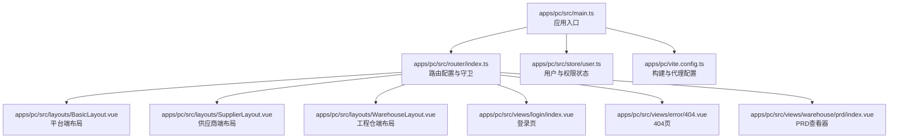
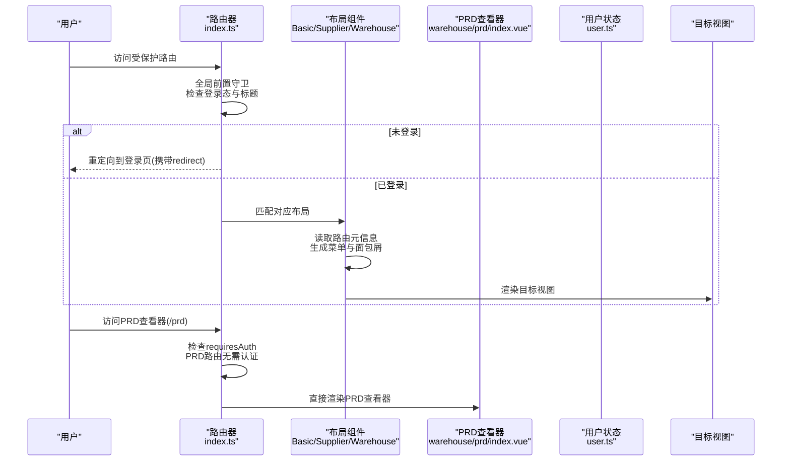
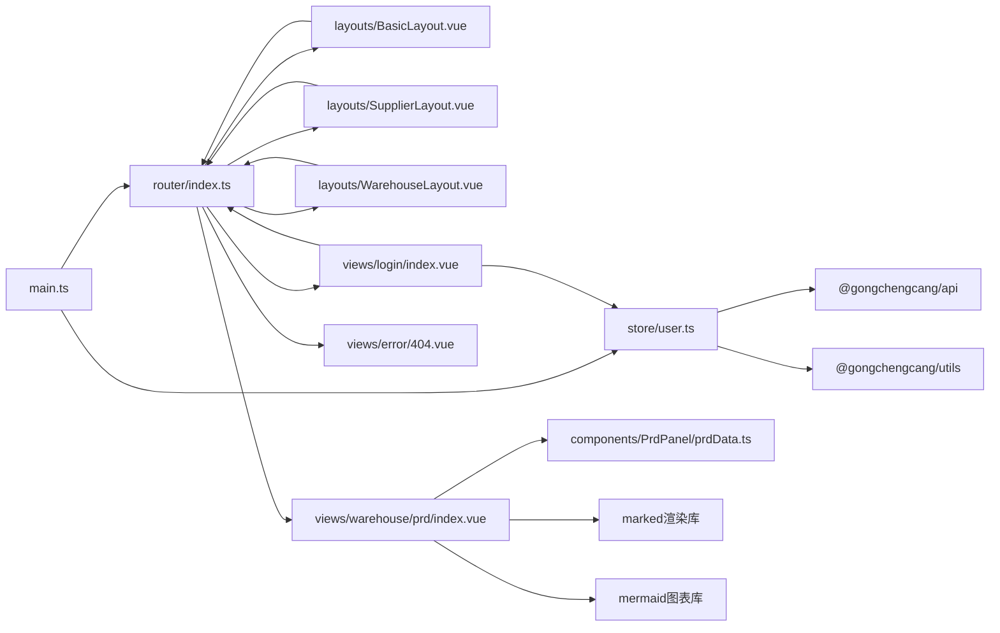

# 路由系统

<cite>
**本文引用的文件**
- [apps/pc/src/router/index.ts](file://apps/pc/src/router/index.ts)
- [apps/pc/src/main.ts](file://apps/pc/src/main.ts)
- [apps/pc/src/layouts/BasicLayout.vue](file://apps/pc/src/layouts/BasicLayout.vue)
- [apps/pc/src/layouts/SupplierLayout.vue](file://apps/pc/src/layouts/SupplierLayout.vue)
- [apps/pc/src/layouts/WarehouseLayout.vue](file://apps/pc/src/layouts/WarehouseLayout.vue)
- [apps/pc/src/store/user.ts](file://apps/pc/src/store/user.ts)
- [apps/pc/src/views/login/index.vue](file://apps/pc/src/views/login/index.vue)
- [apps/pc/src/views/system/menu/index.vue](file://apps/pc/src/views/system/menu/index.vue)
- [apps/pc/src/views/system/role/index.vue](file://apps/pc/src/views/system/role/index.vue)
- [apps/pc/src/views/error/404.vue](file://apps/pc/src/views/error/404.vue)
- [apps/pc/src/views/warehouse/prd/index.vue](file://apps/pc/src/views/warehouse/prd/index.vue)
- [apps/pc/src/components/PrdPanel/prdData.ts](file://apps/pc/src/components/PrdPanel/prdData.ts)
- [apps/pc/public/prd-docs/prd.md](file://apps/pc/public/prd-docs/prd.md)
- [apps/pc/public/prd-docs/platform/prd.md](file://apps/pc/public/prd-docs/platform/prd.md)
- [apps/pc/vite.config.ts](file://apps/pc/vite.config.ts)
</cite>

## 更新摘要
**变更内容**
- 新增PRD查看器路由（/prd），支持无需认证访问PRD文档系统
- 更新路由配置与守卫逻辑，确保PRD路由的特殊访问需求
- 增强PRD文档系统的技术实现说明，包括多端文档支持与搜索功能

## 目录
1. [简介](#简介)
2. [项目结构](#项目结构)
3. [核心组件](#核心组件)
4. [架构总览](#架构总览)
5. [详细组件分析](#详细组件分析)
6. [依赖关系分析](#依赖关系分析)
7. [性能考量](#性能考量)
8. [故障排查指南](#故障排查指南)
9. [结论](#结论)
10. [附录](#附录)

## 简介
本文件面向工程材料管理平台的前端路由系统，基于 Vue Router 4 的配置与实现，系统性解析多角色路由设计（平台端、供应商端、工程仓端、施工方端）、嵌套路由结构、路由守卫与权限控制、路由元信息、动态菜单与面包屑、以及路由懒加载与性能优化策略。文档同时提供最佳实践、常见问题解决方案与路由跳转示例，帮助开发者快速理解并扩展平台的路由能力。

**更新** 新增PRD查看器路由系统，支持无需认证访问的PRD文档查看功能，涵盖多端文档支持与全文搜索能力。

## 项目结构
平台前端采用 PC 端主应用，配合多布局与多角色路由组织。路由配置集中于路由器入口文件，通过不同布局组件承载各角色的菜单、面包屑与内容区域；全局守卫统一处理鉴权与标题更新；Pinia 状态管理提供用户与权限数据；Vite 提供构建与代理支持。

图表来源
- [apps/pc/src/main.ts:1-19](file://apps/pc/src/main.ts#L1-L19)
- [apps/pc/src/router/index.ts:1-796](file://apps/pc/src/router/index.ts#L1-L796)
- [apps/pc/src/layouts/BasicLayout.vue:1-349](file://apps/pc/src/layouts/BasicLayout.vue#L1-L349)
- [apps/pc/src/layouts/SupplierLayout.vue:1-325](file://apps/pc/src/layouts/SupplierLayout.vue#L1-L325)
- [apps/pc/src/layouts/WarehouseLayout.vue:1-323](file://apps/pc/src/layouts/WarehouseLayout.vue#L1-L323)
- [apps/pc/src/views/login/index.vue:1-399](file://apps/pc/src/views/login/index.vue#L1-L399)
- [apps/pc/src/views/error/404.vue:1-28](file://apps/pc/src/views/error/404.vue#L1-L28)
- [apps/pc/src/views/warehouse/prd/index.vue:1-1467](file://apps/pc/src/views/warehouse/prd/index.vue#L1-L1467)
- [apps/pc/src/store/user.ts:1-112](file://apps/pc/src/store/user.ts#L1-L112)
- [apps/pc/vite.config.ts:1-32](file://apps/pc/vite.config.ts#L1-L32)

章节来源
- [apps/pc/src/router/index.ts:1-796](file://apps/pc/src/router/index.ts#L1-L796)
- [apps/pc/src/main.ts:1-19](file://apps/pc/src/main.ts#L1-L19)
- [apps/pc/vite.config.ts:1-32](file://apps/pc/vite.config.ts#L1-L32)

## 核心组件
- 路由器与守卫：集中定义在路由器入口，使用哈希历史模式，全局前置守卫负责标题更新与登录态校验。
- 多布局组件：平台端、供应商端、工程仓端分别提供独立侧边菜单、面包屑与头部操作区。
- 用户与权限状态：通过 Pinia Store 维护用户信息、菜单树与权限集合，并提供权限判断方法。
- 登录与404：登录页支持多端选择与跳转；404页提供返回首页能力。
- **新增** PRD查看器：无需认证即可访问的PRD文档查看系统，支持多端文档切换与全文搜索。
- 构建与代理：Vite 配置基础路径、别名与本地代理，便于开发调试。

章节来源
- [apps/pc/src/router/index.ts:771-787](file://apps/pc/src/router/index.ts#L771-L787)
- [apps/pc/src/layouts/BasicLayout.vue:192-242](file://apps/pc/src/layouts/BasicLayout.vue#L192-L242)
- [apps/pc/src/layouts/SupplierLayout.vue:165-220](file://apps/pc/src/layouts/SupplierLayout.vue#L165-L220)
- [apps/pc/src/layouts/WarehouseLayout.vue:165-220](file://apps/pc/src/layouts/WarehouseLayout.vue#L165-L220)
- [apps/pc/src/store/user.ts:35-111](file://apps/pc/src/store/user.ts#L35-L111)
- [apps/pc/src/views/login/index.vue:173-187](file://apps/pc/src/views/login/index.vue#L173-L187)
- [apps/pc/src/views/error/404.vue:14-18](file://apps/pc/src/views/error/404.vue#L14-L18)
- [apps/pc/src/views/warehouse/prd/index.vue:1-1467](file://apps/pc/src/views/warehouse/prd/index.vue#L1-L1467)
- [apps/pc/vite.config.ts:5-31](file://apps/pc/vite.config.ts#L5-L31)

## 架构总览
平台路由采用"多布局 + 嵌套路由"的组织方式，顶层路由根据角色切换不同布局；每个布局内部维护自身的菜单树与面包屑，路由元信息用于控制菜单显示、图标与标题等；全局守卫统一拦截未登录访问并重定向至登录页，携带 redirect 参数以便登录后回跳。

**更新** PRD查看器路由作为独立的无需认证路由存在，位于顶层路由配置中，支持直接访问PRD文档系统。

图表来源
- [apps/pc/src/router/index.ts:776-787](file://apps/pc/src/router/index.ts#L776-L787)
- [apps/pc/src/layouts/BasicLayout.vue:192-242](file://apps/pc/src/layouts/BasicLayout.vue#L192-L242)
- [apps/pc/src/layouts/SupplierLayout.vue:165-220](file://apps/pc/src/layouts/SupplierLayout.vue#L165-L220)
- [apps/pc/src/layouts/WarehouseLayout.vue:165-220](file://apps/pc/src/layouts/WarehouseLayout.vue#L165-L220)
- [apps/pc/src/store/user.ts:58-73](file://apps/pc/src/store/user.ts#L58-L73)
- [apps/pc/src/views/warehouse/prd/index.vue:1-1467](file://apps/pc/src/views/warehouse/prd/index.vue#L1-L1467)

## 详细组件分析

### 路由配置与守卫
- 路由结构：顶层包含登录、平台端、供应商端、工程仓端与404兜底；平台端路由以"/"为根，包含仪表盘、商户、商品、市场、订单、库存、财务、系统设置等模块；供应商端与工程仓端路由以"/supplier""/warehouse"为前缀，各自包含仪表盘、商户信息、商品中心、订单管理、财务中心、系统设置等模块。
- **新增** PRD查看器路由：位于平台端路由配置中，路径为"/prd"，组件为"views/warehouse/prd/index.vue"，meta配置包含title、icon与requiresAuth:false，支持无需认证访问。
- 嵌套路由：各模块下使用 children 定义二级菜单，支持重定向与隐藏菜单项；面包屑通过 route.matched 过滤 meta.title 生效。
- 全局守卫：设置页面标题；对 requiresAuth !== false 的路由进行登录态校验，未登录则重定向到登录页并携带 redirect 参数。
- 历史模式：使用哈希历史模式，基础路径为"/gongchengcang/"。

章节来源
- [apps/pc/src/router/index.ts:4-769](file://apps/pc/src/router/index.ts#L4-L769)
- [apps/pc/src/router/index.ts:31-35](file://apps/pc/src/router/index.ts#L31-L35)
- [apps/pc/src/router/index.ts:776-787](file://apps/pc/src/router/index.ts#L776-L787)
- [apps/pc/src/router/index.ts:771-774](file://apps/pc/src/router/index.ts#L771-L774)

### 多角色布局与菜单生成
- 平台端布局：从顶层路由中筛选 children，过滤 hideInMenu 与 hidden 后生成菜单树；面包屑基于 matched 中 meta.title；支持平台切换与小程序预览跳转。
- 供应商端布局：从"/supplier"路由中筛选 children，生成菜单树与面包屑；支持平台与工程仓端切换。
- 工程仓端布局：从"/warehouse"路由中筛选 children，生成菜单树与面包屑；支持平台与供应商端切换。

章节来源
- [apps/pc/src/layouts/BasicLayout.vue:192-242](file://apps/pc/src/layouts/BasicLayout.vue#L192-L242)
- [apps/pc/src/layouts/SupplierLayout.vue:165-220](file://apps/pc/src/layouts/SupplierLayout.vue#L165-L220)
- [apps/pc/src/layouts/WarehouseLayout.vue:165-220](file://apps/pc/src/layouts/WarehouseLayout.vue#L165-L220)

### 权限控制与菜单管理
- 用户状态：提供登录、获取用户信息、登出与权限判断方法；mock 模式下可直接填充模拟用户与菜单。
- 菜单管理：系统菜单页支持搜索、展开/折叠、增删改操作；菜单树递归过滤与展开逻辑清晰。
- 角色与权限：系统角色页支持按商户筛选、角色类型识别与权限配置抽屉；权限树结构与接口字段映射明确。

章节来源
- [apps/pc/src/store/user.ts:35-111](file://apps/pc/src/store/user.ts#L35-L111)
- [apps/pc/src/views/system/menu/index.vue:108-167](file://apps/pc/src/views/system/menu/index.vue#L108-L167)
- [apps/pc/src/views/system/role/index.vue:81-214](file://apps/pc/src/views/system/role/index.vue#L81-L214)

### 登录流程与回跳
- 登录页：支持选择登录端（平台/供应商/施工方/工程仓），提交后写入当前端标识，调用用户状态登录与获取用户信息，成功后根据 redirect 或默认跳转至仪表盘。
- 登出：调用用户状态登出，清空认证信息并强制跳转至登录页。

章节来源
- [apps/pc/src/views/login/index.vue:173-187](file://apps/pc/src/views/login/index.vue#L173-L187)
- [apps/pc/src/store/user.ts:75-91](file://apps/pc/src/store/user.ts#L75-L91)

### PRD查看器系统
**新增** PRD查看器是一个独立的文档查看系统，无需用户认证即可访问。

- **路由配置**：位于"/prd"路径，requiresAuth设置为false，允许匿名访问。
- **组件功能**：提供左侧模块导航树与右侧文档内容渲染，支持多端文档切换（工程仓端、平台端、供应商端、施工方端）。
- **文档加载**：从public/prd-docs目录动态加载MD文件，支持完整的Markdown渲染与Mermaid图表显示。
- **搜索功能**：提供全文搜索能力，支持关键词高亮与搜索结果导航。
- **目录索引**：自动生成文档目录，支持滚动监听与高亮显示。
- **更新日志**：内置更新日志查看功能，支持目录导航与内容高亮。

章节来源
- [apps/pc/src/router/index.ts:31-35](file://apps/pc/src/router/index.ts#L31-L35)
- [apps/pc/src/views/warehouse/prd/index.vue:1-1467](file://apps/pc/src/views/warehouse/prd/index.vue#L1-L1467)
- [apps/pc/src/components/PrdPanel/prdData.ts:1-531](file://apps/pc/src/components/PrdPanel/prdData.ts#L1-L531)

### 错误处理与404
- 404 页面：展示结果与返回首页按钮，点击后跳转至首页。

章节来源
- [apps/pc/src/views/error/404.vue:14-18](file://apps/pc/src/views/error/404.vue#L14-L18)

### 路由懒加载与性能优化
- 路由懒加载：所有视图组件均通过动态导入实现按需加载，减少首屏体积。
- **PRD查看器优化**：PRD查看器组件采用异步加载，避免影响主应用性能。
- 构建与代理：Vite 配置基础路径、别名与本地代理，便于开发环境联调；生产构建开启源码映射便于问题定位。

章节来源
- [apps/pc/src/router/index.ts:8, 38, 421, 596, 765-768:8-8](file://apps/pc/src/router/index.ts#L8-L8)
- [apps/pc/src/router/index.ts:33](file://apps/pc/src/router/index.ts#L33)
- [apps/pc/vite.config.ts:5-31](file://apps/pc/vite.config.ts#L5-L31)

## 依赖关系分析
- 应用入口依赖路由器与状态管理；路由器依赖工具库与视图组件；布局组件依赖路由器与状态管理；用户状态依赖 API 与工具库；菜单与角色页面依赖 API 与类型定义。
- 路由守卫依赖登录态工具；布局组件依赖路由元信息生成菜单与面包屑；登录页依赖用户状态与路由。
- **新增** PRD查看器依赖PRD数据模块与Markdown渲染库，支持多端文档切换与搜索功能。

图表来源
- [apps/pc/src/main.ts:1-19](file://apps/pc/src/main.ts#L1-L19)
- [apps/pc/src/router/index.ts:1-796](file://apps/pc/src/router/index.ts#L1-L796)
- [apps/pc/src/layouts/BasicLayout.vue:122-127](file://apps/pc/src/layouts/BasicLayout.vue#L122-L127)
- [apps/pc/src/layouts/SupplierLayout.vue:117-122](file://apps/pc/src/layouts/SupplierLayout.vue#L117-L122)
- [apps/pc/src/layouts/WarehouseLayout.vue:117-122](file://apps/pc/src/layouts/WarehouseLayout.vue#L117-L122)
- [apps/pc/src/views/login/index.vue:147-153](file://apps/pc/src/views/login/index.vue#L147-L153)
- [apps/pc/src/views/warehouse/prd/index.vue:210-216](file://apps/pc/src/views/warehouse/prd/index.vue#L210-L216)
- [apps/pc/src/store/user.ts:4-6](file://apps/pc/src/store/user.ts#L4-L6)

章节来源
- [apps/pc/src/main.ts:1-19](file://apps/pc/src/main.ts#L1-L19)
- [apps/pc/src/router/index.ts:1-796](file://apps/pc/src/router/index.ts#L1-L796)
- [apps/pc/src/store/user.ts:1-112](file://apps/pc/src/store/user.ts#L1-L112)

## 性能考量
- 路由懒加载：所有视图组件采用动态导入，有效降低首屏 JavaScript 体积，提升初始渲染速度。
- **PRD查看器性能**：PRD查看器采用异步加载与按需渲染策略，避免影响主应用性能；文档内容采用分步渲染，先渲染Markdown再渲染Mermaid图表。
- 历史模式与基础路径：使用哈希历史模式与基础路径"/gongchengcang/"，避免服务端配置复杂度，适合静态部署。
- 构建优化：生产构建开启源码映射，便于定位问题；开发环境配置代理，提升联调效率。
- 菜单与面包屑：布局组件通过路由元信息动态生成菜单与面包屑，避免硬编码，减少维护成本。

章节来源
- [apps/pc/src/router/index.ts:8, 38, 421, 596, 765-768:8-8](file://apps/pc/src/router/index.ts#L8-L8)
- [apps/pc/src/views/warehouse/prd/index.vue:510-593](file://apps/pc/src/views/warehouse/prd/index.vue#L510-L593)
- [apps/pc/vite.config.ts:5-31](file://apps/pc/vite.config.ts#L5-L31)

## 故障排查指南
- 登录后无法回跳：检查登录页是否正确传递 redirect 参数，守卫是否正确读取并跳转。
- 未登录被重定向：确认登录态工具返回值与守卫逻辑一致；检查 redirect 参数是否正确。
- 菜单不显示或面包屑异常：检查路由元信息中的 title、icon、hideInMenu、hidden 字段；确认布局组件是否正确过滤。
- **新增** PRD查看器无法访问：检查路由配置中的requiresAuth是否设置为false；确认PRD文档文件路径是否正确。
- **新增** PRD文档加载失败：检查public/prd-docs目录结构；确认MD文件编码与路径；查看浏览器控制台错误信息。
- **新增** PRD搜索功能异常：检查搜索缓存机制；确认文档内容是否正确加载；验证正则表达式匹配逻辑。
- 404 页面：确认兜底路由已配置且路径匹配规则正确；检查目标路径是否存在。
- 开发代理无效：检查 Vite 代理配置与后端服务端口；确认请求路径与代理前缀一致。

章节来源
- [apps/pc/src/router/index.ts:776-787](file://apps/pc/src/router/index.ts#L776-L787)
- [apps/pc/src/views/login/index.vue:173-187](file://apps/pc/src/views/login/index.vue#L173-L187)
- [apps/pc/src/layouts/BasicLayout.vue:192-242](file://apps/pc/src/layouts/BasicLayout.vue#L192-L242)
- [apps/pc/src/views/error/404.vue:14-18](file://apps/pc/src/views/error/404.vue#L14-L18)
- [apps/pc/src/views/warehouse/prd/index.vue:510-593](file://apps/pc/src/views/warehouse/prd/index.vue#L510-L593)
- [apps/pc/vite.config.ts:20-26](file://apps/pc/vite.config.ts#L20-L26)

## 结论
本路由系统以 Vue Router 4 为基础，结合多布局与嵌套路由，实现了平台端、供应商端、工程仓端的清晰分离与统一管理。通过全局守卫与状态管理，实现了登录态与权限控制；通过路由元信息与布局组件，实现了动态菜单与面包屑；通过懒加载与构建配置，兼顾了性能与开发体验。

**更新** 新增的PRD查看器路由系统进一步完善了平台的文档管理能力，支持多端PRD文档的统一查看与搜索，无需用户认证即可访问，提升了文档的可访问性与使用体验。整体架构清晰、扩展性强，适合在多端场景下持续演进。

## 附录
- 路由跳转示例
  - 登录成功后回跳：登录页提交后根据 redirect 或默认跳转至仪表盘。
  - 平台端切换：平台端布局支持切换至供应商端或工程仓端，自动跳转至对应端仪表盘。
  - 供应商端切换：供应商端布局支持切换至平台端或工程仓端。
  - 工程仓端切换：工程仓端布局支持切换至平台端或供应商端。
  - **新增** PRD查看器访问：直接访问"/prd"路径即可进入PRD文档查看界面，支持多端文档切换。
  - 小程序预览：各布局提供小程序预览入口，携带角色参数。
- 权限验证流程
  - 登录：选择登录端，提交用户名密码，写入当前端标识，调用用户状态登录与获取用户信息。
  - 获取用户信息：mock 模式下填充模拟用户与菜单；非 mock 模式调用后端接口。
  - 权限判断：通过用户状态提供的 hasPermission 与 hasPermissions 方法进行细粒度权限校验。
  - **新增** PRD查看器权限：PRD路由设置requiresAuth为false，无需认证即可访问。
- 错误处理机制
  - 未登录：全局守卫拦截并重定向至登录页，携带 redirect 参数。
  - 404：兜底路由渲染 404 页面，提供返回首页按钮。
  - 登出：清空认证信息并强制跳转至登录页。
  - **新增** PRD文档错误：PRD查看器组件提供详细的错误处理与重试机制。

章节来源
- [apps/pc/src/views/login/index.vue:173-187](file://apps/pc/src/views/login/index.vue#L173-L187)
- [apps/pc/src/layouts/BasicLayout.vue:226-238](file://apps/pc/src/layouts/BasicLayout.vue#L226-L238)
- [apps/pc/src/layouts/SupplierLayout.vue:205-212](file://apps/pc/src/layouts/SupplierLayout.vue#L205-L212)
- [apps/pc/src/layouts/WarehouseLayout.vue:204-211](file://apps/pc/src/layouts/WarehouseLayout.vue#L204-L211)
- [apps/pc/src/router/index.ts:776-787](file://apps/pc/src/router/index.ts#L776-L787)
- [apps/pc/src/views/error/404.vue:14-18](file://apps/pc/src/views/error/404.vue#L14-L18)
- [apps/pc/src/store/user.ts:93-99](file://apps/pc/src/store/user.ts#L93-L99)
- [apps/pc/src/views/warehouse/prd/index.vue:582-587](file://apps/pc/src/views/warehouse/prd/index.vue#L582-L587)