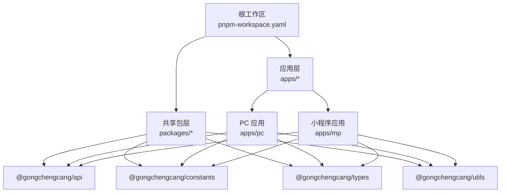
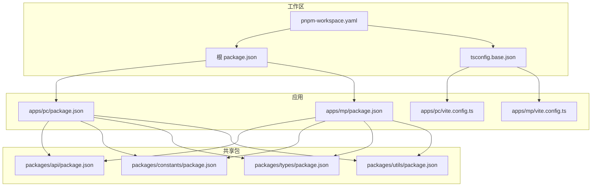
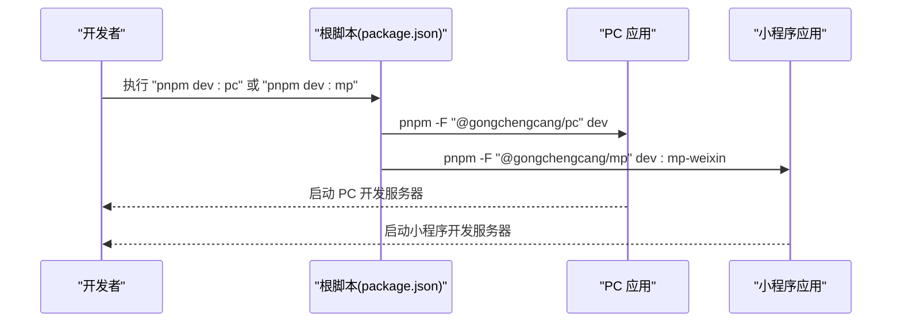
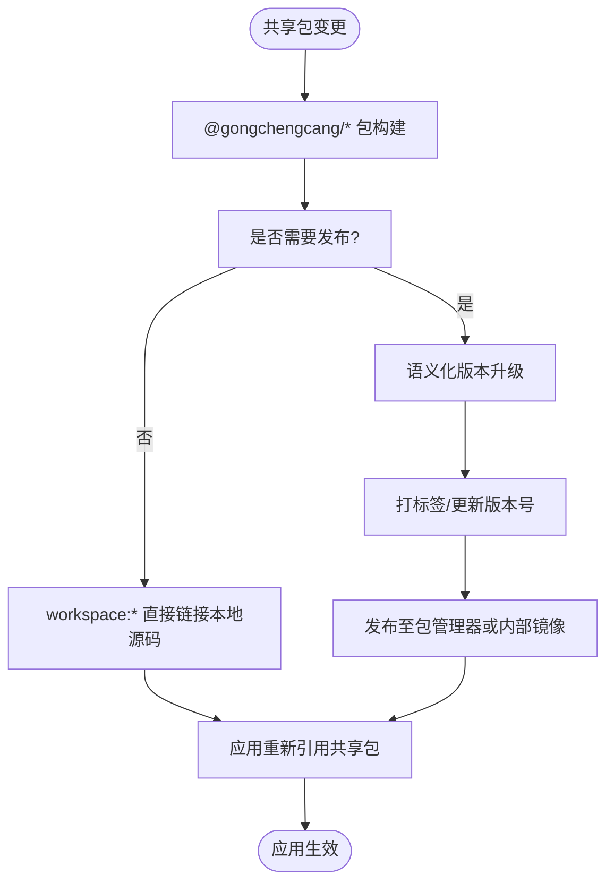
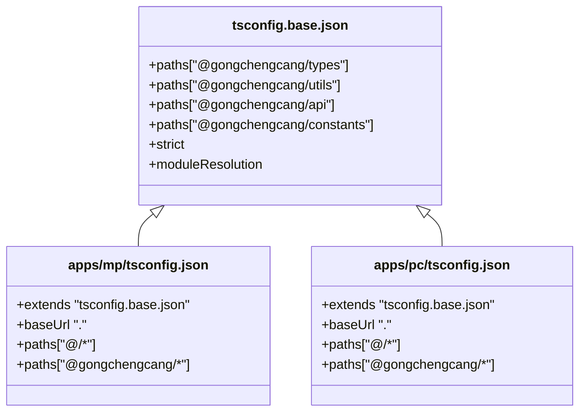
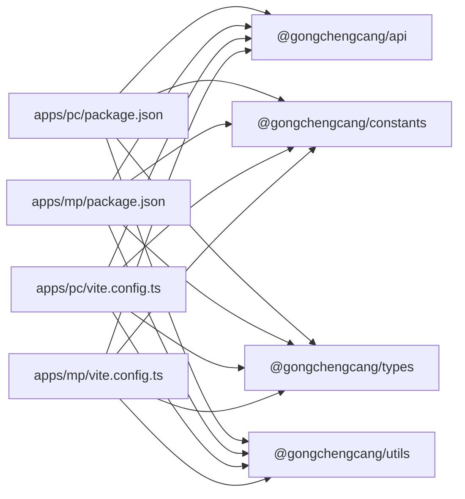

# Monorepo架构设计

<cite>
**本文档引用的文件**
- [pnpm-workspace.yaml](file://pnpm-workspace.yaml)
- [package.json](file://package.json)
- [tsconfig.base.json](file://tsconfig.base.json)
- [apps/mp/package.json](file://apps/mp/package.json)
- [apps/pc/package.json](file://apps/pc/package.json)
- [apps/mp/vite.config.ts](file://apps/mp/vite.config.ts)
- [apps/pc/vite.config.ts](file://apps/pc/vite.config.ts)
- [apps/mp/tsconfig.json](file://apps/mp/tsconfig.json)
- [packages/api/package.json](file://packages/api/package.json)
- [packages/constants/package.json](file://packages/constants/package.json)
- [packages/types/package.json](file://packages/types/package.json)
- [packages/utils/package.json](file://packages/utils/package.json)
</cite>

## 目录
1. [引言](#引言)
2. [项目结构](#项目结构)
3. [核心组件](#核心组件)
4. [架构总览](#架构总览)
5. [详细组件分析](#详细组件分析)
6. [依赖关系分析](#依赖关系分析)
7. [性能考量](#性能考量)
8. [故障排查指南](#故障排查指南)
9. [结论](#结论)
10. [附录](#附录)

## 引言
本项目采用 pnpm workspace 的 Monorepo 架构，统一管理工程材料管理平台的多端应用与共享包。通过工作区配置与路径别名，实现跨应用的依赖复用、类型一致与构建优化；借助根脚本与工作区命令，达成开发与构建流程的统一调度。本文档将系统阐述 pnpm workspace 的工作原理与配置方式，详解 apps/pc 与 apps/mp 如何在工作区内协同，packages 下共享包（api、constants、types、utils）如何被多应用引用与版本管理，并给出依赖关系图、模块间通信机制、版本同步策略、最佳实践与常见问题解决方案。

## 项目结构
- 根工作区定义：通过 pnpm-workspace.yaml 声明 packages/* 与 apps/* 为工作区成员，使 pnpm 能识别并统一管理这些包。
- 应用层：apps/pc 与 apps/mp 分别代表 PC 端与小程序端应用，各自拥有独立的构建配置与依赖。
- 共享包层：packages/api、packages/constants、packages/types、packages/utils 提供跨应用可复用的逻辑与类型定义。
- 全局配置：tsconfig.base.json 统一编译选项与路径映射，确保各应用与共享包的类型检查一致性。

图表来源
- [pnpm-workspace.yaml:1-4](file://pnpm-workspace.yaml#L1-L4)
- [apps/pc/package.json:1-36](file://apps/pc/package.json#L1-L36)
- [apps/mp/package.json:1-39](file://apps/mp/package.json#L1-L39)
- [packages/api/package.json:1-11](file://packages/api/package.json#L1-L11)
- [packages/constants/package.json:1-11](file://packages/constants/package.json#L1-L11)
- [packages/types/package.json:1-11](file://packages/types/package.json#L1-L11)
- [packages/utils/package.json:1-14](file://packages/utils/package.json#L1-L14)

章节来源
- [pnpm-workspace.yaml:1-4](file://pnpm-workspace.yaml#L1-L4)
- [package.json:1-23](file://package.json#L1-L23)
- [tsconfig.base.json:1-29](file://tsconfig.base.json#L1-L29)

## 核心组件
- 工作区配置与脚本
  - pnpm-workspace.yaml：声明工作区成员，使 packages/* 与 apps/* 成为受控包集合。
  - 根 package.json：提供统一的开发与构建脚本，使用 pnpm -F 指定工作区目标，便于集中执行。
- 应用配置
  - apps/pc 与 apps/mp 的 package.json：声明对共享包的 workspace:* 依赖，确保本地联调时指向本地源码而非发布包。
  - 各自的 vite.config.ts：设置路径别名，将 @gongchengcang/* 映射到 packages 下对应源码目录，保证开发期可直接导入共享模块。
- 共享包配置
  - packages/api、packages/constants、packages/types、packages/utils 的 package.json：均以 src/index.ts 作为入口与类型定义入口，便于统一导出与类型检查。
- 全局类型配置
  - tsconfig.base.json：定义严格模式、模块解析策略、路径映射，以及 @gongchengcang/* 到 packages 的映射，确保所有子项目共享同一套编译与类型规则。

章节来源
- [pnpm-workspace.yaml:1-4](file://pnpm-workspace.yaml#L1-L4)
- [package.json:6-12](file://package.json#L6-L12)
- [apps/pc/package.json:14-24](file://apps/pc/package.json#L14-L24)
- [apps/mp/package.json:12-24](file://apps/mp/package.json#L12-L24)
- [apps/pc/vite.config.ts:8-16](file://apps/pc/vite.config.ts#L8-L16)
- [apps/mp/vite.config.ts:7-15](file://apps/mp/vite.config.ts#L7-L15)
- [packages/api/package.json:1-11](file://packages/api/package.json#L1-L11)
- [packages/constants/package.json:1-11](file://packages/constants/package.json#L1-L11)
- [packages/types/package.json:1-11](file://packages/types/package.json#L1-L11)
- [packages/utils/package.json:1-14](file://packages/utils/package.json#L1-L14)
- [tsconfig.base.json:21-26](file://tsconfig.base.json#L21-L26)

## 架构总览
Monorepo 将多端应用与共享包置于同一仓库，通过以下机制实现统一管理：
- 依赖管理：workspace:* 使应用直接引用本地共享包源码，避免发布与版本漂移带来的不一致。
- 类型一致性：tsconfig.base.json 的路径映射与严格编译选项，确保所有项目共享相同的类型规则。
- 构建与开发：各应用独立构建，但共享包变更会即时反映到应用中，提升迭代效率。
- 发布与协作：统一的脚本与工作区命令，便于 CI/CD 流水线与团队协作。

图表来源
- [pnpm-workspace.yaml:1-4](file://pnpm-workspace.yaml#L1-L4)
- [package.json:1-23](file://package.json#L1-L23)
- [tsconfig.base.json:1-29](file://tsconfig.base.json#L1-L29)
- [apps/pc/package.json:1-36](file://apps/pc/package.json#L1-L36)
- [apps/pc/vite.config.ts:1-32](file://apps/pc/vite.config.ts#L1-L32)
- [apps/mp/package.json:1-39](file://apps/mp/package.json#L1-L39)
- [apps/mp/vite.config.ts:1-17](file://apps/mp/vite.config.ts#L1-L17)
- [packages/api/package.json:1-11](file://packages/api/package.json#L1-L11)
- [packages/constants/package.json:1-11](file://packages/constants/package.json#L1-L11)
- [packages/types/package.json:1-11](file://packages/types/package.json#L1-L11)
- [packages/utils/package.json:1-14](file://packages/utils/package.json#L1-L14)

## 详细组件分析

### 应用层：apps/pc 与 apps/mp
- 依赖关系
  - apps/pc 与 apps/mp 在各自的 package.json 中声明对 @gongchengcang/api、@gongchengcang/constants、@gongchengcang/types、@gongchengcang/utils 的 workspace:* 依赖，确保本地开发时直接使用本地源码。
- 路径别名与类型映射
  - apps/pc/vite.config.ts 与 apps/mp/vite.config.ts 配置了 @gongchengcang/* 到 packages 对应 src 目录的别名，使应用内可直接以命名空间导入共享模块。
  - apps/mp/tsconfig.json 继承 tsconfig.base.json，并在 baseUrl 与 paths 中补充 @gongchengcang/* 映射，保证类型检查与路径解析一致。
- 开发与构建
  - apps/pc 使用 Vite，支持代理、构建输出与预览。
  - apps/mp 使用 uni-app 生态，分别提供 mp-weixin 与 h5 的开发与构建脚本。

图表来源
- [package.json:7-10](file://package.json#L7-L10)
- [apps/pc/package.json:6-12](file://apps/pc/package.json#L6-L12)
- [apps/mp/package.json:5-11](file://apps/mp/package.json#L5-L11)

章节来源
- [apps/pc/package.json:14-24](file://apps/pc/package.json#L14-L24)
- [apps/mp/package.json:17-20](file://apps/mp/package.json#L17-L20)
- [apps/pc/vite.config.ts:8-16](file://apps/pc/vite.config.ts#L8-L16)
- [apps/mp/vite.config.ts:7-15](file://apps/mp/vite.config.ts#L7-L15)
- [apps/mp/tsconfig.json:2-14](file://apps/mp/tsconfig.json#L2-L14)

### 共享包层：packages/api、packages/constants、packages/types、packages/utils
- 统一入口与类型
  - 各共享包的 package.json 将 main 与 types 指向 src/index.ts，便于应用以单一入口导入。
- 依赖与版本
  - packages/utils 显式声明 dayjs 依赖；其他共享包通过应用侧统一依赖管理，减少重复安装。
- 版本策略
  - 当前各共享包 version 均为 1.0.0，建议采用语义化版本并在变更时统一升级，结合 workspace:* 保持应用与共享包的版本一致性。

图表来源
- [packages/api/package.json:1-11](file://packages/api/package.json#L1-L11)
- [packages/constants/package.json:1-11](file://packages/constants/package.json#L1-L11)
- [packages/types/package.json:1-11](file://packages/types/package.json#L1-L11)
- [packages/utils/package.json:10-12](file://packages/utils/package.json#L10-L12)

章节来源
- [packages/api/package.json:1-11](file://packages/api/package.json#L1-L11)
- [packages/constants/package.json:1-11](file://packages/constants/package.json#L1-L11)
- [packages/types/package.json:1-11](file://packages/types/package.json#L1-L11)
- [packages/utils/package.json:1-14](file://packages/utils/package.json#L1-L14)

### 类型系统与路径映射
- 全局类型配置
  - tsconfig.base.json 定义严格编译选项、模块解析策略与 @gongchengcang/* 到 packages 的映射，确保所有子项目共享一致的类型规则。
- 应用类型覆盖
  - apps/mp/tsconfig.json 继承全局配置，并在 baseUrl 与 paths 中补充 @gongchengcang/* 映射，避免类型检查差异导致的构建失败。

图表来源
- [tsconfig.base.json:21-26](file://tsconfig.base.json#L21-L26)
- [apps/mp/tsconfig.json:2-14](file://apps/mp/tsconfig.json#L2-L14)

章节来源
- [tsconfig.base.json:1-29](file://tsconfig.base.json#L1-L29)
- [apps/mp/tsconfig.json:2-14](file://apps/mp/tsconfig.json#L2-L14)

## 依赖关系分析
- 工作区成员
  - pnpm-workspace.yaml 声明 packages/* 与 apps/* 为工作区成员，使 pnpm 能在本地解析 workspace:* 依赖。
- 应用对共享包的依赖
  - apps/pc 与 apps/mp 的 package.json 中，对 @gongchengcang/api、@gongchengcang/constants、@gongchengcang/types、@gongchengcang/utils 均使用 workspace:*，确保本地联调。
- 路径别名与模块解析
  - 各应用的 vite.config.ts 与 tsconfig.json 配置 @gongchengcang/* 到 packages 对应 src 的映射，保证导入与类型检查一致。

图表来源
- [apps/pc/package.json:14-24](file://apps/pc/package.json#L14-L24)
- [apps/mp/package.json:17-20](file://apps/mp/package.json#L17-L20)
- [apps/pc/vite.config.ts:8-16](file://apps/pc/vite.config.ts#L8-L16)
- [apps/mp/vite.config.ts:7-15](file://apps/mp/vite.config.ts#L7-L15)

章节来源
- [pnpm-workspace.yaml:1-4](file://pnpm-workspace.yaml#L1-L4)
- [apps/pc/package.json:14-24](file://apps/pc/package.json#L14-L24)
- [apps/mp/package.json:17-20](file://apps/mp/package.json#L17-L20)
- [apps/pc/vite.config.ts:8-16](file://apps/pc/vite.config.ts#L8-L16)
- [apps/mp/vite.config.ts:7-15](file://apps/mp/vite.config.ts#L7-L15)

## 性能考量
- 依赖解析与安装
  - workspace:* 使 pnpm 直接链接本地源码，避免重复下载与安装，显著缩短安装时间。
- 构建缓存
  - 各应用独立构建，共享包变更后仅需增量构建受影响的应用，减少整体构建时间。
- 类型检查
  - 通过 tsconfig.base.json 的统一配置，避免重复类型检查任务，提高类型检查效率。
- 代理与热更新
  - apps/pc 的开发服务器代理配置可减少跨域与网络延迟，提升开发体验。

## 故障排查指南
- 无法解析 @gongchengcang/* 模块
  - 检查各应用的 vite.config.ts 与 tsconfig.json 是否正确配置 @gongchengcang/* 到 packages 的映射。
  - 确认 pnpm-workspace.yaml 是否包含 packages/* 与 apps/*。
- 类型检查报错
  - 确保 tsconfig.base.json 的 paths 与 baseUrl 配置一致，且各应用继承该配置。
- 本地联调失效
  - 确认 apps/pc 与 apps/mp 的 package.json 中共享包依赖使用 workspace:*。
- 构建产物异常
  - 检查各应用的 vite.config.ts 输出目录与代理配置，确保构建与开发环境一致。

章节来源
- [pnpm-workspace.yaml:1-4](file://pnpm-workspace.yaml#L1-L4)
- [apps/pc/vite.config.ts:8-16](file://apps/pc/vite.config.ts#L8-L16)
- [apps/mp/vite.config.ts:7-15](file://apps/mp/vite.config.ts#L7-L15)
- [apps/mp/tsconfig.json:2-14](file://apps/mp/tsconfig.json#L2-L14)
- [apps/pc/package.json:14-24](file://apps/pc/package.json#L14-L24)
- [apps/mp/package.json:17-20](file://apps/mp/package.json#L17-L20)

## 结论
本项目的 Monorepo 架构通过 pnpm workspace 实现了工程材料管理平台多端应用与共享包的统一管理。工作区配置与路径别名确保了依赖复用与类型一致性，独立构建与本地联调提升了开发效率。结合统一脚本与类型配置，团队可在保证质量的前提下快速迭代与协作。建议后续引入版本同步策略与自动化发布流程，进一步完善 Monorepo 的治理能力。

## 附录
- 最佳实践
  - 使用 workspace:* 管理本地共享包依赖，避免版本漂移。
  - 通过 tsconfig.base.json 统一编译与类型规则，确保各应用一致性。
  - 为共享包提供清晰的导出入口与类型定义，便于应用导入与 IDE 支持。
  - 在 CI/CD 中使用 pnpm -F 指令，按需执行特定应用或包的任务。
- 常见问题
  - 路径别名未生效：检查 vite.config.ts 与 tsconfig.json 的 @gongchengcang/* 映射。
  - 类型检查失败：确认继承 tsconfig.base.json 且 paths 配置一致。
  - 本地联调异常：核对 package.json 中共享包依赖是否为 workspace:*。