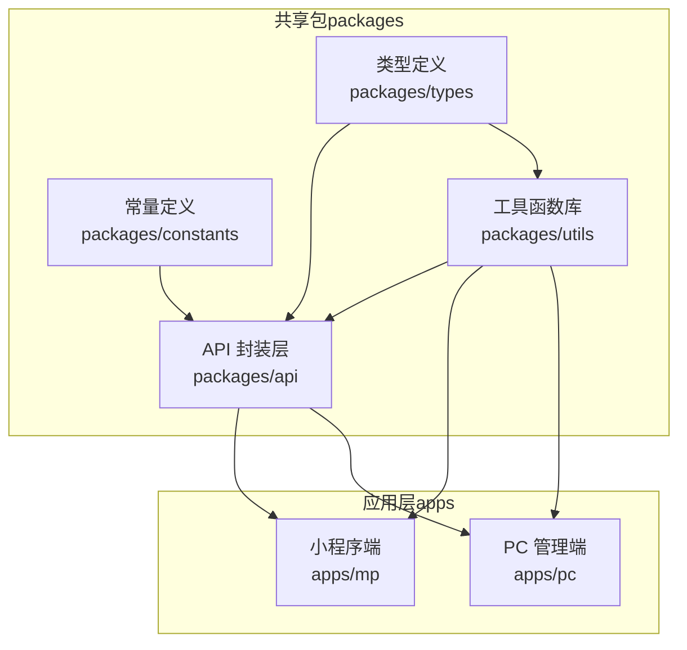
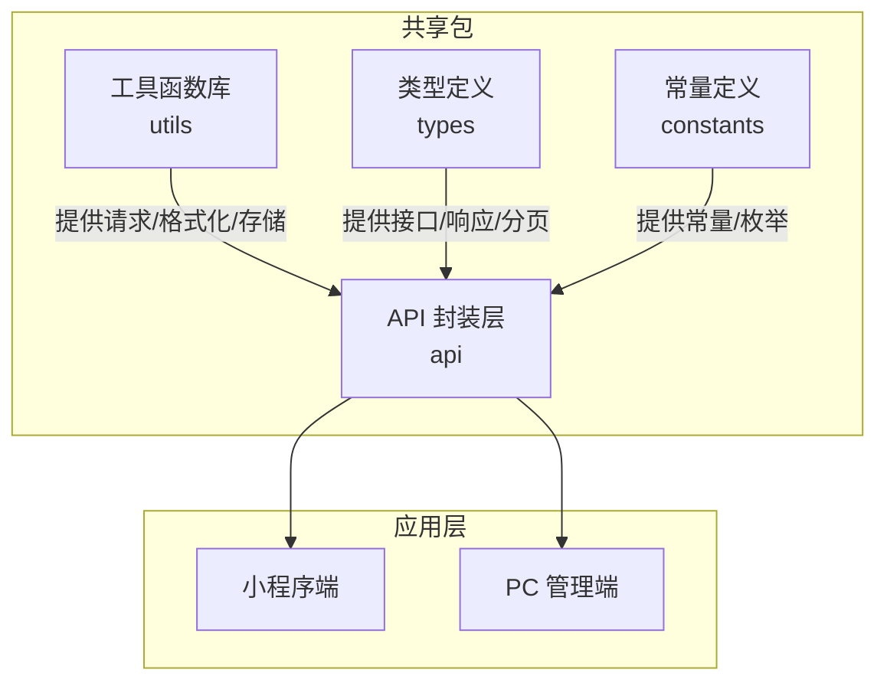
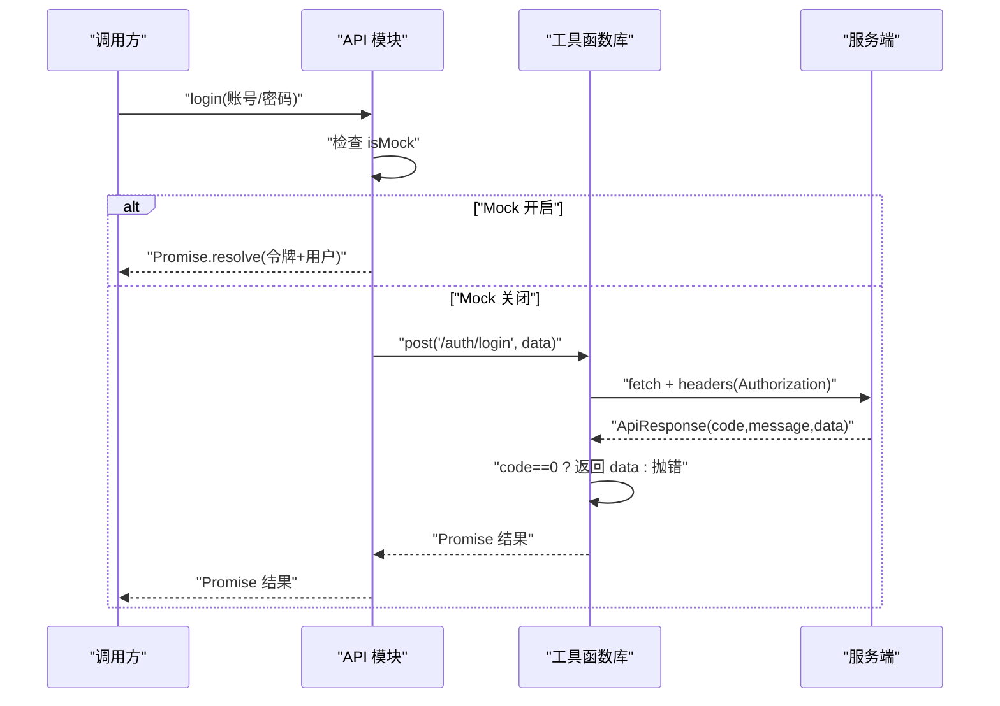
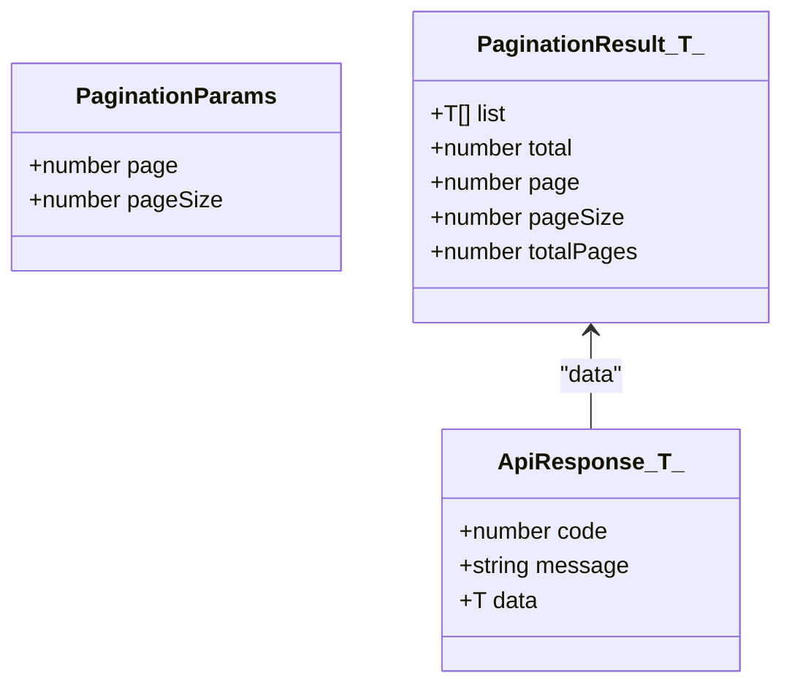
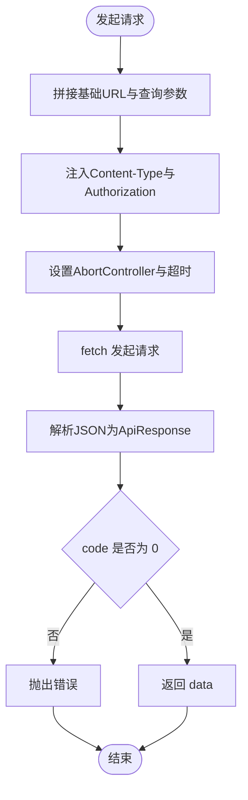
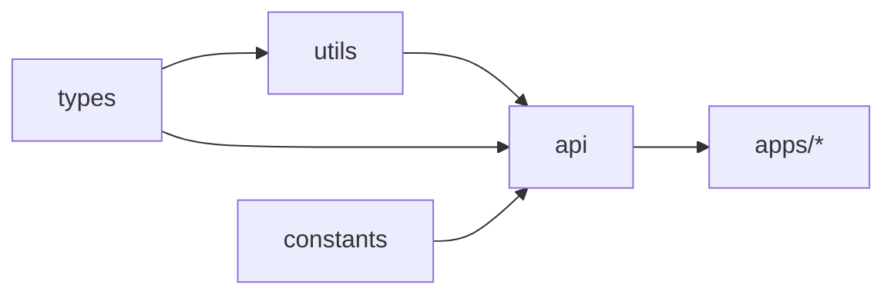

# 共享包架构

<cite>
**本文引用的文件**
- [packages/api/src/index.ts](file://packages/api/src/index.ts)
- [packages/api/src/auth.ts](file://packages/api/src/auth.ts)
- [packages/api/src/user.ts](file://packages/api/src/user.ts)
- [packages/constants/src/index.ts](file://packages/constants/src/index.ts)
- [packages/types/src/index.ts](file://packages/types/src/index.ts)
- [packages/types/src/common.ts](file://packages/types/src/common.ts)
- [packages/utils/src/index.ts](file://packages/utils/src/index.ts)
- [packages/utils/src/request.ts](file://packages/utils/src/request.ts)
</cite>

## 目录
1. [引言](#引言)
2. [项目结构](#项目结构)
3. [核心组件](#核心组件)
4. [架构总览](#架构总览)
5. [详细组件分析](#详细组件分析)
6. [依赖分析](#依赖分析)
7. [性能考虑](#性能考虑)
8. [故障排查指南](#故障排查指南)
9. [结论](#结论)
10. [附录](#附录)

## 引言
本文件面向“工程材料管理平台”的共享包架构，聚焦 packages 目录下的四个子包：API 封装层、常量定义、TypeScript 类型定义、工具函数库。文档从设计理念、职责划分、统一接口设计、错误处理机制、请求拦截器配置、类型组织方式、常量分类管理、工具函数复用策略等方面进行系统性说明，并给出版本管理、发布流程与使用规范建议，帮助开发者在多端应用中高效、一致地复用能力。

## 项目结构
共享包采用“按领域/职责分包”的模块化组织方式，每个包通过统一的入口文件导出子模块，便于按需引入与树摇优化。整体结构如下：

图表来源
- [packages/api/src/index.ts:1-11](file://packages/api/src/index.ts#L1-L11)
- [packages/utils/src/index.ts:1-7](file://packages/utils/src/index.ts#L1-L7)

章节来源
- [packages/api/src/index.ts:1-11](file://packages/api/src/index.ts#L1-L11)
- [packages/constants/src/index.ts:1-7](file://packages/constants/src/index.ts#L1-L7)
- [packages/types/src/index.ts:1-10](file://packages/types/src/index.ts#L1-L10)
- [packages/utils/src/index.ts:1-7](file://packages/utils/src/index.ts#L1-L7)

## 核心组件
- API 封装层：围绕业务域（认证、用户、商户、商品、订单、仓库、财务、资金托管、分账规则等）提供统一的请求方法与 Mock 能力，屏蔽底层网络细节，统一返回结构与错误处理。
- 常量定义：集中管理业务常量、配置常量与枚举类型，避免散落全局污染命名空间。
- 类型定义：提供跨域复用的接口规范、分页与响应体结构、通用选项与地址结构等，确保前后端契约一致。
- 工具函数库：提供格式化、校验、存储、请求、日期、树形结构处理与上传等通用能力，支持请求拦截器与超时控制。

章节来源
- [packages/api/src/auth.ts:1-126](file://packages/api/src/auth.ts#L1-L126)
- [packages/api/src/user.ts:1-172](file://packages/api/src/user.ts#L1-L172)
- [packages/utils/src/request.ts:1-108](file://packages/utils/src/request.ts#L1-L108)
- [packages/types/src/common.ts:1-65](file://packages/types/src/common.ts#L1-L65)

## 架构总览
共享包与应用层的交互关系如下：

图表来源
- [packages/api/src/index.ts:1-11](file://packages/api/src/index.ts#L1-L11)
- [packages/utils/src/index.ts:1-7](file://packages/utils/src/index.ts#L1-L7)
- [packages/types/src/index.ts:1-10](file://packages/types/src/index.ts#L1-L10)
- [packages/constants/src/index.ts:1-7](file://packages/constants/src/index.ts#L1-L7)

## 详细组件分析

### API 封装层
- 设计理念
  - 领域内聚：每个业务域一个模块，统一导出，便于按需引入。
  - 双态模式：内置 isMock 标志位，支持本地 Mock 与真实后端切换，便于联调与测试。
  - 统一契约：所有请求返回统一的 ApiResponse 结构，错误码非零即抛错，简化上层判断。
- 职责划分
  - 认证域：登录、登出、刷新令牌、获取验证码、修改密码、获取用户信息与菜单。
  - 用户域：用户、角色、菜单的增删改查与状态变更，支持分页查询。
  - 其他域：商户、商品、订单、仓库、财务、资金托管、分账规则等，均遵循相同模式。
- 错误处理机制
  - 后端返回 code 非 0 即视为失败，抛出 message 作为错误信息。
  - 请求超时通过 AbortController 控制，超时错误统一为“请求超时”。
  - Mock 场景下显式 reject，便于上层感知异常。
- 请求拦截器配置
  - 自动注入 Authorization 头（Bearer Token），支持自定义头与超时时间。
  - 支持 GET 查询参数拼接、POST/PUT JSON 序列化、DELETE 参数传递、文件上传（multipart/form-data）。
  - 提供 getPage 辅助方法，直接返回分页结果。

图表来源
- [packages/api/src/auth.ts:86-125](file://packages/api/src/auth.ts#L86-L125)
- [packages/utils/src/request.ts:11-82](file://packages/utils/src/request.ts#L11-L82)

章节来源
- [packages/api/src/auth.ts:1-126](file://packages/api/src/auth.ts#L1-L126)
- [packages/api/src/user.ts:1-172](file://packages/api/src/user.ts#L1-L172)
- [packages/utils/src/request.ts:1-108](file://packages/utils/src/request.ts#L1-L108)

### TypeScript 类型定义
- 模块化组织
  - 通用类型：分页参数/结果、统一响应体、下拉/树形选项、上传文件、地址、时间范围等。
  - 业务类型：按领域拆分（用户、商户、商品、订单、仓库、财务、市场、分账规则等），统一导出入口。
- 接口规范
  - ApiResponse<T>：约定 code、message、data 字段，统一错误与成功路径。
  - PaginationParams/PaginationResult<T>：标准化分页查询与返回。
  - SelectOption/TreeOption：通用选择与树形控件数据结构。
- 泛型使用与类型推导优化
  - 所有请求方法均使用泛型 T，确保返回值类型安全与自动推导。
  - 分页辅助方法 getPage<T> 直接返回 PaginationResult<T>，减少重复声明。
- 与 API 的协作
  - API 层函数签名明确入参与出参类型，结合 utils 的 request 方法，形成“类型驱动”的调用链。

图表来源
- [packages/types/src/common.ts:1-65](file://packages/types/src/common.ts#L1-L65)

章节来源
- [packages/types/src/common.ts:1-65](file://packages/types/src/common.ts#L1-L65)
- [packages/types/src/index.ts:1-10](file://packages/types/src/index.ts#L1-L10)

### 常量定义
- 分类管理
  - 业务常量：如用户类型、状态、权限标识等。
  - 配置常量：如默认分页大小、上传限制、枚举映射等。
  - 枚举类型：通过联合类型或数字枚举表达离散取值，配合类型系统保证安全。
- 组织方式
  - 每个领域一个文件，统一从 index.ts 导出，便于按需引入与 tree-shaking。
- 使用场景
  - API 层用于构造请求参数与校验；UI 层用于渲染下拉/标签；工具层用于格式化与转换。

章节来源
- [packages/constants/src/index.ts:1-7](file://packages/constants/src/index.ts#L1-L7)

### 工具函数库
- 功能模块
  - request：统一的 HTTP 客户端，支持 GET/POST/PUT/DELETE/upload 与分页辅助方法。
  - format：数值/金额/百分比等格式化工具。
  - validate：表单与业务校验规则。
  - storage：本地存储封装（localStorage/sessionStorage）。
  - date：日期格式化、区间计算等。
  - tree：树形结构构建与遍历。
- 复用策略
  - API 层仅依赖 utils 的 request，不直接耦合具体网络实现，便于替换与扩展。
  - 通用工具独立于业务，可被任意应用层或共享包复用。
  - 通过统一入口导出，避免路径硬编码，降低维护成本。

图表来源
- [packages/utils/src/request.ts:11-82](file://packages/utils/src/request.ts#L11-L82)

章节来源
- [packages/utils/src/index.ts:1-7](file://packages/utils/src/index.ts#L1-L7)
- [packages/utils/src/request.ts:1-108](file://packages/utils/src/request.ts#L1-L108)

## 依赖分析
- 包间依赖
  - utils 被 api 与应用层广泛依赖，承担网络与通用工具职责。
  - types 为 api 与 utils 的类型契约提供者，贯穿整个调用链。
  - constants 为 api 与 UI 提供稳定常量，避免魔法数。
- 外部依赖
  - Vite 环境变量 import.meta.env.VITE_API_BASE_URL 用于配置基础域名。
  - 浏览器原生 fetch 与 AbortController 实现请求与超时控制。
- 循环依赖
  - 当前结构清晰，未见循环依赖迹象；若后续扩展，应保持“utils → api → 应用层”的单向依赖。

图表来源
- [packages/api/src/index.ts:1-11](file://packages/api/src/index.ts#L1-L11)
- [packages/utils/src/index.ts:1-7](file://packages/utils/src/index.ts#L1-L7)
- [packages/types/src/index.ts:1-10](file://packages/types/src/index.ts#L1-L10)
- [packages/constants/src/index.ts:1-7](file://packages/constants/src/index.ts#L1-L7)

章节来源
- [packages/api/src/index.ts:1-11](file://packages/api/src/index.ts#L1-L11)
- [packages/utils/src/index.ts:1-7](file://packages/utils/src/index.ts#L1-L7)
- [packages/types/src/index.ts:1-10](file://packages/types/src/index.ts#L1-L10)
- [packages/constants/src/index.ts:1-7](file://packages/constants/src/index.ts#L1-L7)

## 性能考虑
- 请求缓存与去重
  - 对高频 GET 请求（如字典/枚举/列表）建议在应用层增加内存缓存与去重逻辑，减少重复请求。
- 分页加载
  - 使用 getPage 辅助方法，合理设置 page/pageSize，避免一次性加载过多数据。
- 超时与中断
  - 合理设置超时阈值，避免长时间占用连接；在页面切换或组件卸载时主动 abort 请求。
- 体积优化
  - 通过按需导入与 tree-shaking，确保未使用的 API/工具不会进入产物。
- Mock 切换
  - 在开发阶段启用 isMock，减少真实后端压力；生产环境关闭 Mock，确保真实数据一致性。

## 故障排查指南
- 登录失败
  - 检查 isMock 配置与账号密码是否匹配；确认返回的 token 是否写入 localStorage。
- 请求超时
  - 检查 VITE_API_BASE_URL 是否正确；适当提高超时阈值；确认网络连通性。
- 401/403
  - 确认 Authorization 头是否正确注入；检查 token 是否过期；必要时调用刷新接口。
- 分页异常
  - 确认传入的分页参数类型与取值范围；核对后端分页字段是否一致。
- Mock 数据缺失
  - 检查 Mock 数据是否覆盖到目标场景；必要时补充 Mock 函数与数据源。

章节来源
- [packages/api/src/auth.ts:86-125](file://packages/api/src/auth.ts#L86-L125)
- [packages/utils/src/request.ts:11-82](file://packages/utils/src/request.ts#L11-L82)

## 结论
该共享包架构以“领域分包、类型驱动、工具下沉”为核心原则，实现了 API、常量、类型与工具的高内聚低耦合。通过统一的请求封装与错误处理机制，显著降低了应用层的样板代码与心智负担；通过模块化的类型与常量组织，提升了契约一致性与可维护性。建议在后续迭代中持续完善 Mock 覆盖面、增强工具函数的边界条件处理，并建立完善的版本与发布规范。

## 附录

### 版本管理与发布流程（建议）
- 版本号策略
  - 采用语义化版本（主.次.补丁），小改动与修复走补丁版本，新增功能走次版本，破坏性变更走主版本。
- 提交规范
  - 规范提交信息（feat(api): 新增用户列表接口；fix(utils): 修复请求超时判断）。
- 发布流程
  - 在 CI 中执行打包与单元测试；通过后自动发布至私有/公共 npm 仓库；生成 CHANGELOG 并打 Tag。
- 回滚策略
  - 保留最近三个版本的发布记录；出现问题时快速回滚至上一个稳定版本。

### 使用规范
- 导入方式
  - 优先使用统一入口导出，避免直接引用内部文件路径。
- 类型安全
  - 明确指定泛型参数，确保返回值类型正确；尽量使用 ApiResponse 与 PaginationResult 的标准结构。
- 错误处理
  - 在调用 API 前做好输入校验；捕获错误并提示用户；区分业务错误与网络错误。
- Mock 与真实环境
  - 开发阶段开启 isMock；联调阶段关闭并配置正确的 VITE_API_BASE_URL；生产环境严格禁用 Mock。