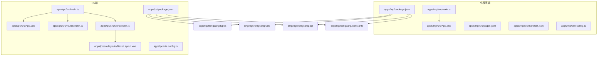
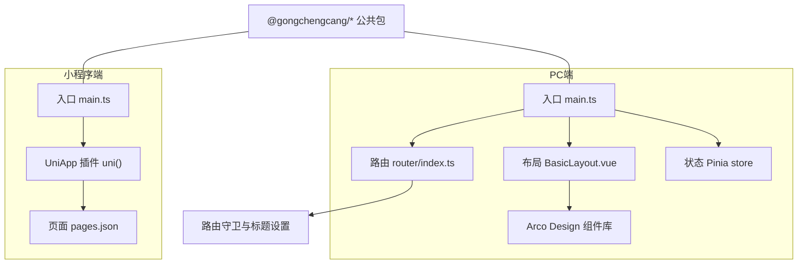
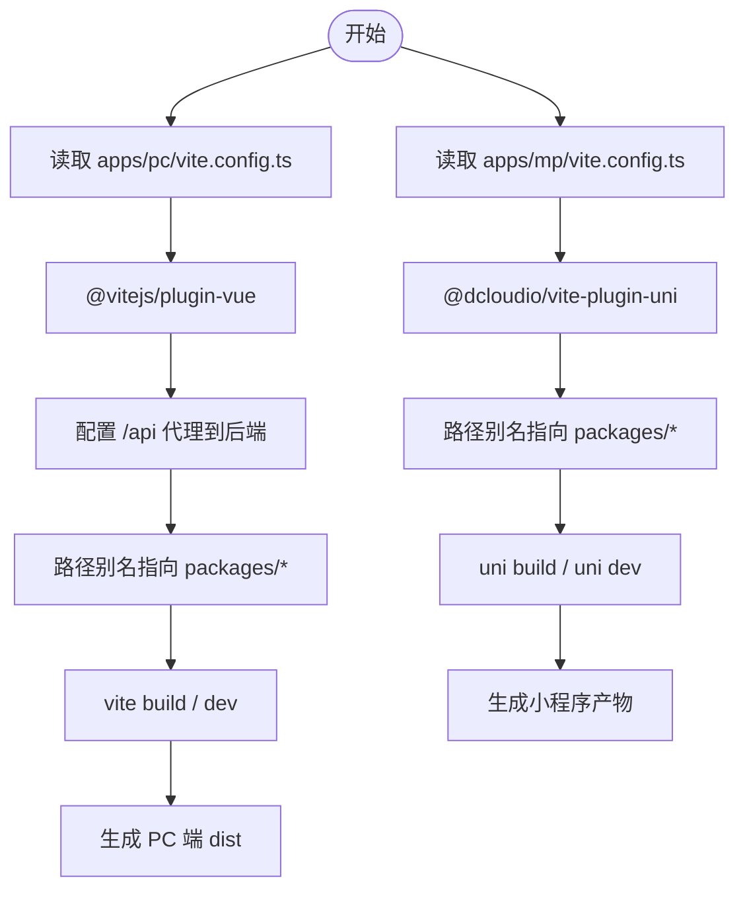
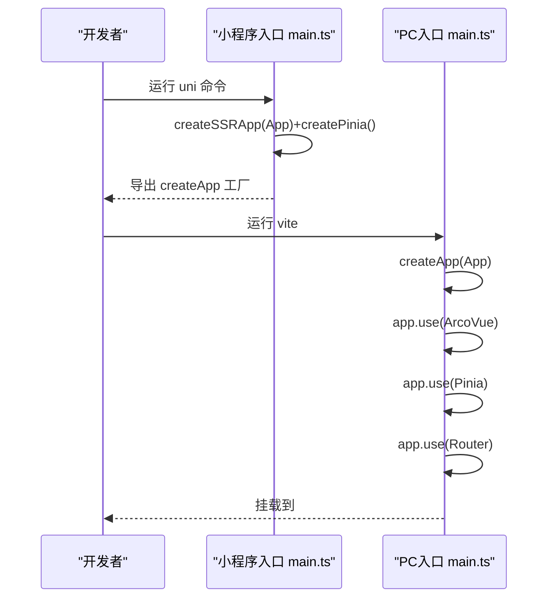
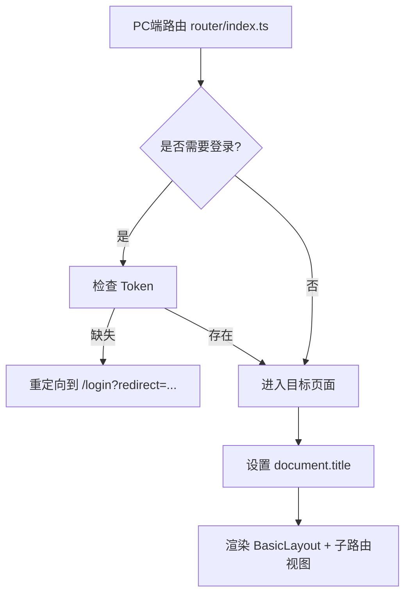
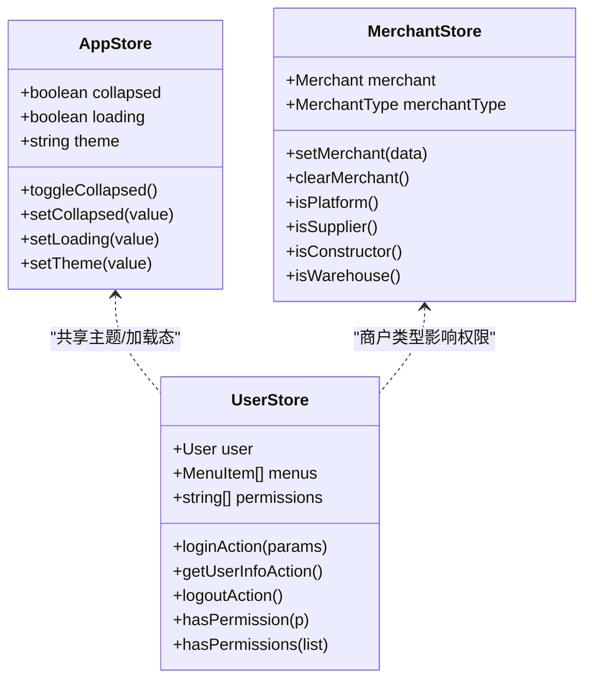
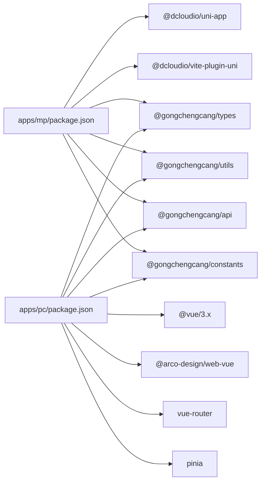

# 多端统一架构

<cite>
**本文引用的文件**
- [apps/mp/vite.config.ts](file://apps/mp/vite.config.ts)
- [apps/pc/vite.config.ts](file://apps/pc/vite.config.ts)
- [apps/mp/package.json](file://apps/mp/package.json)
- [apps/pc/package.json](file://apps/pc/package.json)
- [apps/mp/src/main.ts](file://apps/mp/src/main.ts)
- [apps/pc/src/main.ts](file://apps/pc/src/main.ts)
- [apps/mp/src/App.vue](file://apps/mp/src/App.vue)
- [apps/pc/src/App.vue](file://apps/pc/src/App.vue)
- [apps/mp/src/pages.json](file://apps/mp/src/pages.json)
- [apps/pc/src/router/index.ts](file://apps/pc/src/router/index.ts)
- [apps/pc/src/store/index.ts](file://apps/pc/src/store/index.ts)
- [apps/pc/src/store/app.ts](file://apps/pc/src/store/app.ts)
- [apps/pc/src/store/user.ts](file://apps/pc/src/store/user.ts)
- [apps/pc/src/store/merchant.ts](file://apps/pc/src/store/merchant.ts)
- [apps/pc/src/layouts/BasicLayout.vue](file://apps/pc/src/layouts/BasicLayout.vue)
- [apps/pc/src/styles/common.less](file://apps/pc/src/styles/common.less)
- [apps/pc/src/views/mp-preview/index.vue](file://apps/pc/src/views/mp-preview/index.vue)
- [apps/mp/src/manifest.json](file://apps/mp/src/manifest.json)
</cite>

## 目录
1. [引言](#引言)
2. [项目结构](#项目结构)
3. [核心组件](#核心组件)
4. [架构总览](#架构总览)
5. [详细组件分析](#详细组件分析)
6. [依赖分析](#依赖分析)
7. [性能考虑](#性能考虑)
8. [故障排查指南](#故障排查指南)
9. [结论](#结论)
10. [附录](#附录)

## 引言
本文件面向“工程材料管理平台”的多端统一架构，围绕 UniApp 在 PC 端与小程序端的一套代码多端运行展开，系统化阐述 Vite 构建配置差异、多端代码适配机制（条件编译、平台 API 封装、样式兼容）、多端路由与状态管理共享、组件库适配方案，并给出性能优化与跨端兼容最佳实践。目标是帮助开发者在不牺牲开发体验的前提下，高效维护与扩展多端应用。

## 项目结构
工程采用多包工作区组织，核心目录如下：
- apps/mp：基于 UniApp 的小程序端应用，支持微信小程序等多端打包
- apps/pc：基于 Vue 3 + Vite 的 PC 端应用，使用 Arco Design 组件库
- packages/*：公共包（api、constants、types、utils），被两端共享
- docs：产品文档与 PRD

图表来源
- [apps/mp/package.json:1-39](file://apps/mp/package.json#L1-L39)
- [apps/pc/package.json:1-36](file://apps/pc/package.json#L1-L36)
- [apps/mp/src/main.ts:1-14](file://apps/mp/src/main.ts#L1-L14)
- [apps/pc/src/main.ts:1-19](file://apps/pc/src/main.ts#L1-L19)
- [apps/pc/src/router/index.ts:1-790](file://apps/pc/src/router/index.ts#L1-L790)
- [apps/pc/src/store/index.ts:1-10](file://apps/pc/src/store/index.ts#L1-L10)
- [apps/pc/src/layouts/BasicLayout.vue:1-349](file://apps/pc/src/layouts/BasicLayout.vue#L1-L349)

章节来源
- [apps/mp/package.json:1-39](file://apps/mp/package.json#L1-L39)
- [apps/pc/package.json:1-36](file://apps/pc/package.json#L1-L36)

## 核心组件
- 构建与入口
  - 小程序端：使用 @dcloudio/vite-plugin-uni 插件，入口通过 createSSRApp 创建应用实例，配合 Pinia 初始化
  - PC 端：使用 @vitejs/plugin-vue，入口直接挂载到 DOM，引入 ArcoVue、路由与 Pinia
- 路由与布局
  - 小程序端：pages.json 声明页面与 tabbar，适合原生小程序导航
  - PC 端：Vue Router 配置多级嵌套路由与面包屑，BasicLayout 提供侧边菜单、头部与内容区域
- 状态管理
  - 全端共享 Store：Pinia，包含 app（主题、折叠、loading）、user（登录、菜单、权限）、merchant（商户类型判断）
- 组件库与样式
  - PC 端：Arco Design，Less 变量与通用样式类
  - 小程序端：基于 UniApp 原生组件生态，样式以 SCSS 为主

章节来源
- [apps/mp/src/main.ts:1-14](file://apps/mp/src/main.ts#L1-L14)
- [apps/pc/src/main.ts:1-19](file://apps/pc/src/main.ts#L1-L19)
- [apps/mp/src/pages.json:1-235](file://apps/mp/src/pages.json#L1-L235)
- [apps/pc/src/router/index.ts:1-790](file://apps/pc/src/router/index.ts#L1-L790)
- [apps/pc/src/store/app.ts:1-36](file://apps/pc/src/store/app.ts#L1-L36)
- [apps/pc/src/store/user.ts:1-112](file://apps/pc/src/store/user.ts#L1-L112)
- [apps/pc/src/store/merchant.ts:1-49](file://apps/pc/src/store/merchant.ts#L1-L49)
- [apps/pc/src/styles/common.less:1-79](file://apps/pc/src/styles/common.less#L1-L79)

## 架构总览
多端统一的核心在于“共享业务逻辑 + 平台差异化适配”。PC 端通过 Vite + Vue Router + Pinia 实现现代化前端体验；小程序端通过 UniApp 的 pages.json 与插件体系实现多端打包。公共包（api、types、utils、constants）在两端共享，确保数据模型与接口一致。

图表来源
- [apps/pc/src/main.ts:1-19](file://apps/pc/src/main.ts#L1-L19)
- [apps/pc/src/router/index.ts:1-790](file://apps/pc/src/router/index.ts#L1-L790)
- [apps/pc/src/layouts/BasicLayout.vue:1-349](file://apps/pc/src/layouts/BasicLayout.vue#L1-L349)
- [apps/mp/src/main.ts:1-14](file://apps/mp/src/main.ts#L1-L14)
- [apps/mp/src/pages.json:1-235](file://apps/mp/src/pages.json#L1-L235)

## 详细组件分析

### 构建配置与差异化设置
- 小程序端（apps/mp/vite.config.ts）
  - 使用 @dcloudio/vite-plugin-uni 插件进行多端编译
  - 路径别名指向 packages 下的公共包，便于共享类型与工具
- PC 端（apps/pc/vite.config.ts）
  - 使用 @vitejs/plugin-vue
  - 配置本地开发服务器代理（/api -> 本地后端服务）
  - 输出目录 dist 与源码映射开启，便于调试与部署

图表来源
- [apps/mp/vite.config.ts:1-17](file://apps/mp/vite.config.ts#L1-L17)
- [apps/pc/vite.config.ts:1-32](file://apps/pc/vite.config.ts#L1-L32)

章节来源
- [apps/mp/vite.config.ts:1-17](file://apps/mp/vite.config.ts#L1-L17)
- [apps/pc/vite.config.ts:1-32](file://apps/pc/vite.config.ts#L1-L32)

### 多端入口与初始化
- 小程序端入口
  - createSSRApp + createPinia，导出 createApp 工厂函数，供 uni-app 生命周期调用
- PC 端入口
  - createApp + ArcoVue + ArcoVueIcon + Pinia + Router，直接挂载到 #app

图表来源
- [apps/mp/src/main.ts:1-14](file://apps/mp/src/main.ts#L1-L14)
- [apps/pc/src/main.ts:1-19](file://apps/pc/src/main.ts#L1-L19)

章节来源
- [apps/mp/src/main.ts:1-14](file://apps/mp/src/main.ts#L1-L14)
- [apps/pc/src/main.ts:1-19](file://apps/pc/src/main.ts#L1-L19)

### 多端路由与导航
- 小程序端
  - 通过 pages.json 声明页面与 tabbar，适合原生小程序导航模型
- PC 端
  - Vue Router 定义多层级路由，包含 Layout 嵌套、面包屑、权限守卫与标题设置
  - 支持平台切换（平台/供应商/施工方/工程仓），并在 BasicLayout 中动态渲染菜单

图表来源
- [apps/pc/src/router/index.ts:776-789](file://apps/pc/src/router/index.ts#L776-L789)
- [apps/pc/src/layouts/BasicLayout.vue:192-238](file://apps/pc/src/layouts/BasicLayout.vue#L192-L238)

章节来源
- [apps/mp/src/pages.json:1-235](file://apps/mp/src/pages.json#L1-L235)
- [apps/pc/src/router/index.ts:1-790](file://apps/pc/src/router/index.ts#L1-L790)
- [apps/pc/src/layouts/BasicLayout.vue:1-349](file://apps/pc/src/layouts/BasicLayout.vue#L1-L349)

### 状态管理共享与平台适配
- Store 结构
  - app：主题、侧边栏折叠、全局 loading
  - user：登录态、菜单、权限、Mock 登录与登出
  - merchant：商户类型判断（平台/供应商/施工方/工程仓）
- 平台切换
  - BasicLayout 提供平台下拉切换，写入本地存储并跳转对应路由
  - mp-preview 页面用于在 PC 端模拟小程序页面流

图表来源
- [apps/pc/src/store/app.ts:1-36](file://apps/pc/src/store/app.ts#L1-L36)
- [apps/pc/src/store/user.ts:1-112](file://apps/pc/src/store/user.ts#L1-L112)
- [apps/pc/src/store/merchant.ts:1-49](file://apps/pc/src/store/merchant.ts#L1-L49)

章节来源
- [apps/pc/src/store/index.ts:1-10](file://apps/pc/src/store/index.ts#L1-L10)
- [apps/pc/src/store/app.ts:1-36](file://apps/pc/src/store/app.ts#L1-L36)
- [apps/pc/src/store/user.ts:1-112](file://apps/pc/src/store/user.ts#L1-L112)
- [apps/pc/src/store/merchant.ts:1-49](file://apps/pc/src/store/merchant.ts#L1-L49)
- [apps/pc/src/layouts/BasicLayout.vue:181-238](file://apps/pc/src/layouts/BasicLayout.vue#L181-L238)

### 组件库适配方案
- PC 端
  - 使用 @arco-design/web-vue，全局注册组件库与图标
  - Less 变量与通用样式类提升一致性
- 小程序端
  - 基于 uni-app 原生组件生态，避免引入第三方 UI 库导致体积膨胀
  - 样式以 SCSS 为主，注意小程序端对部分 CSS 属性的兼容性

章节来源
- [apps/pc/src/main.ts:1-19](file://apps/pc/src/main.ts#L1-L19)
- [apps/pc/src/styles/common.less:1-79](file://apps/pc/src/styles/common.less#L1-L79)
- [apps/mp/src/App.vue:1-24](file://apps/mp/src/App.vue#L1-L24)

### 多端代码适配机制
- 条件编译与平台 API 封装
  - 通过 packages/* 公共包抽象 API 与工具，两端统一调用
  - 在 PC 端可利用 Mock 开关与环境变量隔离后端依赖
- 样式兼容
  - PC 端使用 Less，小程序端使用 SCSS；保持组件样式边界清晰，避免跨端冲突
- 页面与导航
  - 小程序端以 pages.json 为中心，PC 端以路由为中心；在共享逻辑层屏蔽差异

章节来源
- [apps/pc/src/store/user.ts:40-56](file://apps/pc/src/store/user.ts#L40-L56)
- [apps/pc/src/store/user.ts:58-73](file://apps/pc/src/store/user.ts#L58-L73)
- [apps/pc/src/store/user.ts:75-91](file://apps/pc/src/store/user.ts#L75-L91)
- [apps/mp/src/pages.json:1-235](file://apps/mp/src/pages.json#L1-L235)

### 小程序预览与跨端演示
- mp-preview 页面
  - 在 PC 端模拟小程序页面流，支持角色切换（工程仓/施工方/供应商）
  - 内置大量页面映射，便于联调与演示
- manifest.json
  - 配置各平台（微信、支付宝、百度、字节等）基础能力开关与 H5 路由模式

章节来源
- [apps/pc/src/views/mp-preview/index.vue:1-789](file://apps/pc/src/views/mp-preview/index.vue#L1-L789)
- [apps/mp/src/manifest.json:1-58](file://apps/mp/src/manifest.json#L1-L58)

## 依赖分析
- 两端均依赖公共包：@gongchengcang/types、@gongchengcang/utils、@gongchengcang/api、@gongchengcang/constants
- 小程序端依赖 @dcloudio/uni-app 生态与 @dcloudio/vite-plugin-uni
- PC 端依赖 @vitejs/plugin-vue、Arco Design、vue-router、pinia

图表来源
- [apps/mp/package.json:1-39](file://apps/mp/package.json#L1-L39)
- [apps/pc/package.json:1-36](file://apps/pc/package.json#L1-L36)

章节来源
- [apps/mp/package.json:1-39](file://apps/mp/package.json#L1-L39)
- [apps/pc/package.json:1-36](file://apps/pc/package.json#L1-L36)

## 性能考虑
- 构建与打包
  - PC 端开启 sourcemap 便于调试；生产构建建议关闭或启用独立映射
  - 小程序端使用 uni build，按需打包减少体积
- 资源与网络
  - PC 端开发阶段配置 /api 代理，避免跨域；生产环境通过反向代理统一转发
- 运行时
  - Pinia Store 按模块拆分，避免单点过大的状态树
  - 路由懒加载组件，降低首屏负载
  - Arco Design 按需引入组件与图标，减少打包体积

## 故障排查指南
- 登录与鉴权
  - 若路由跳转异常，检查路由守卫中 Token 获取与重定向逻辑
- 构建问题
  - 小程序端 uni 命令失败：确认 @dcloudio/vite-plugin-uni 版本与 uni-app 版本匹配
  - PC 端代理无效：确认本地后端服务已启动且代理 target 地址正确
- 样式问题
  - 小程序端样式不生效：检查 SCSS 编译与小程序端兼容性
  - PC 端样式覆盖：确认 Less 变量与作用域，避免全局污染
- 预览与演示
  - mp-preview 无法切换角色：检查 provide/inject 与路由 query 参数

章节来源
- [apps/pc/src/router/index.ts:776-789](file://apps/pc/src/router/index.ts#L776-L789)
- [apps/pc/vite.config.ts:20-26](file://apps/pc/vite.config.ts#L20-L26)
- [apps/pc/src/views/mp-preview/index.vue:425-437](file://apps/pc/src/views/mp-preview/index.vue#L425-L437)

## 结论
通过“共享业务逻辑 + 平台差异化适配”，本项目实现了 PC 端与小程序端的一套代码多端运行。Vite 与 UniApp 的差异化配置分别满足了现代前端开发与多端打包的需求；Pinia 与 Vue Router 提供了清晰的状态与路由管理；Arco Design 与原生组件生态保证了良好的用户体验与跨端兼容性。后续可在组件库按需引入、路由懒加载、构建产物分析等方面持续优化。

## 附录
- 关键文件索引
  - 小程序端：vite.config.ts、package.json、main.ts、App.vue、pages.json、manifest.json
  - PC 端：vite.config.ts、package.json、main.ts、App.vue、router/index.ts、store/*、layouts/BasicLayout.vue、styles/common.less、views/mp-preview/index.vue