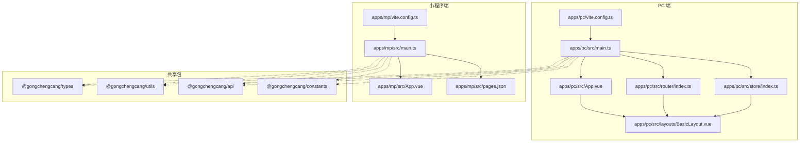
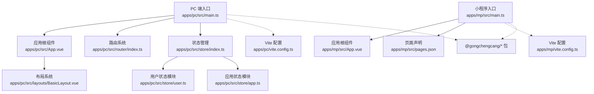
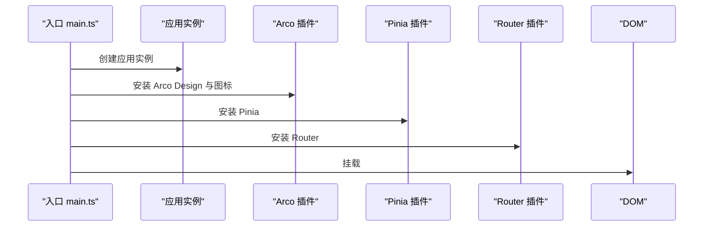
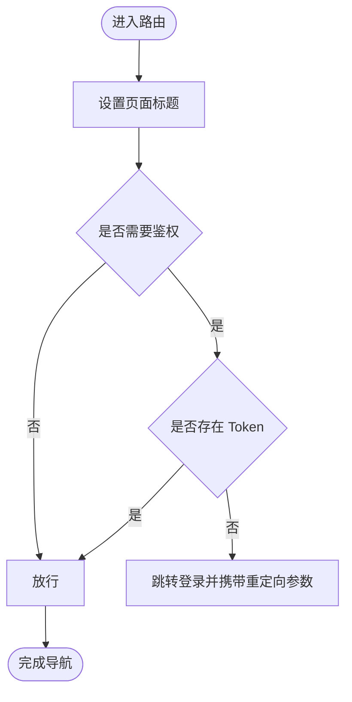
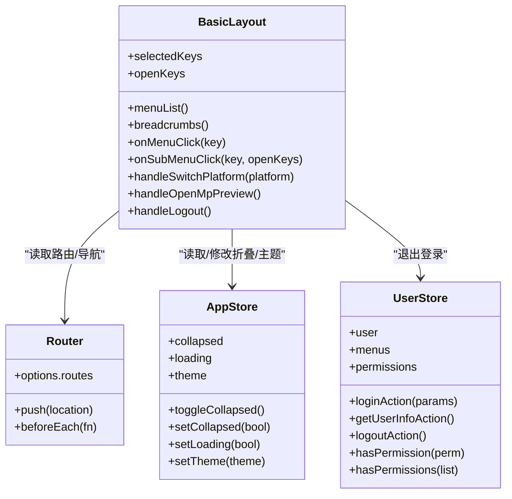
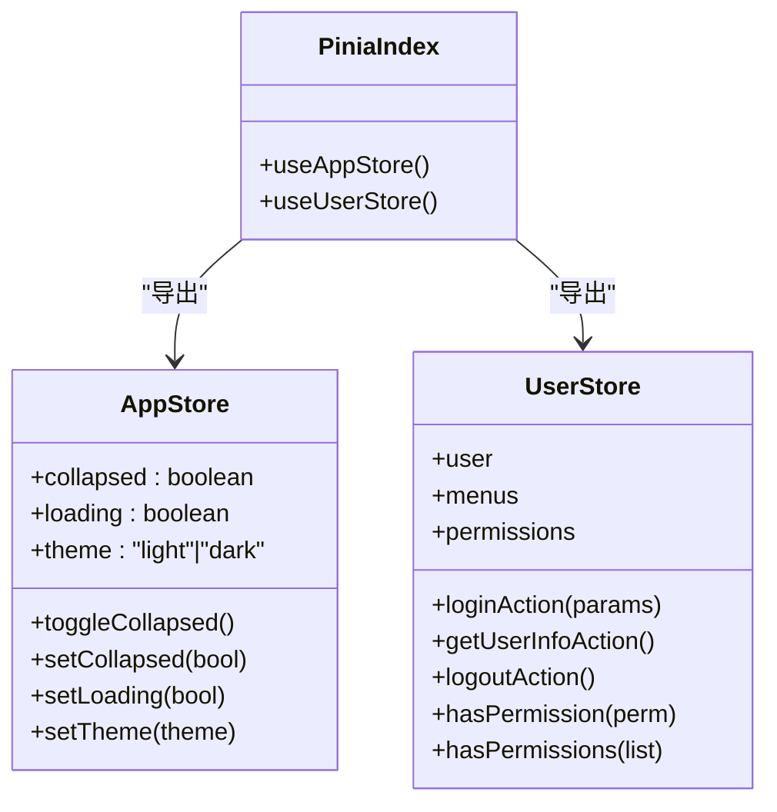
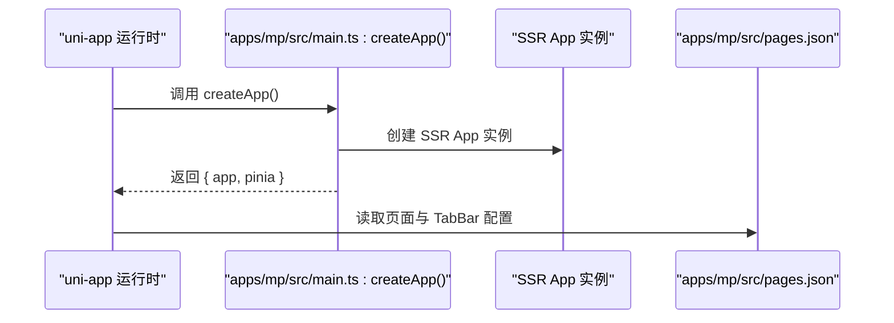
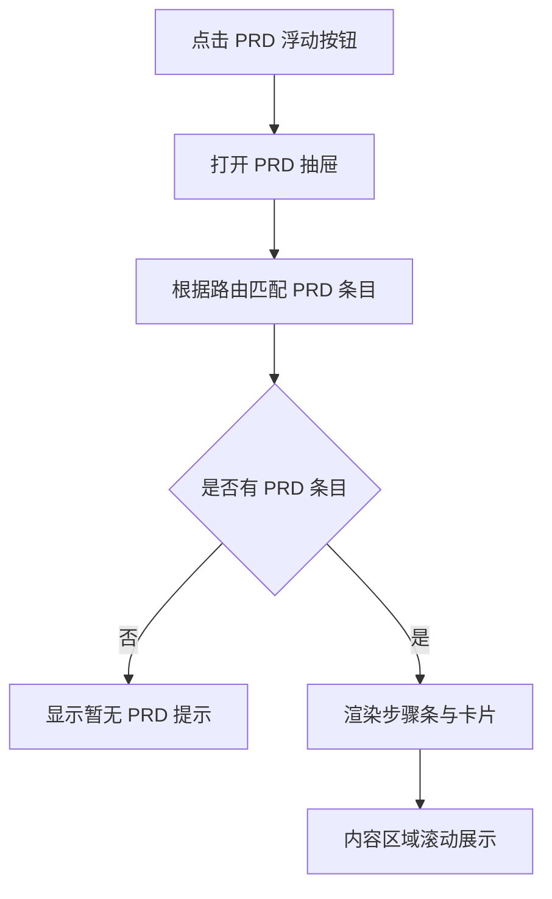
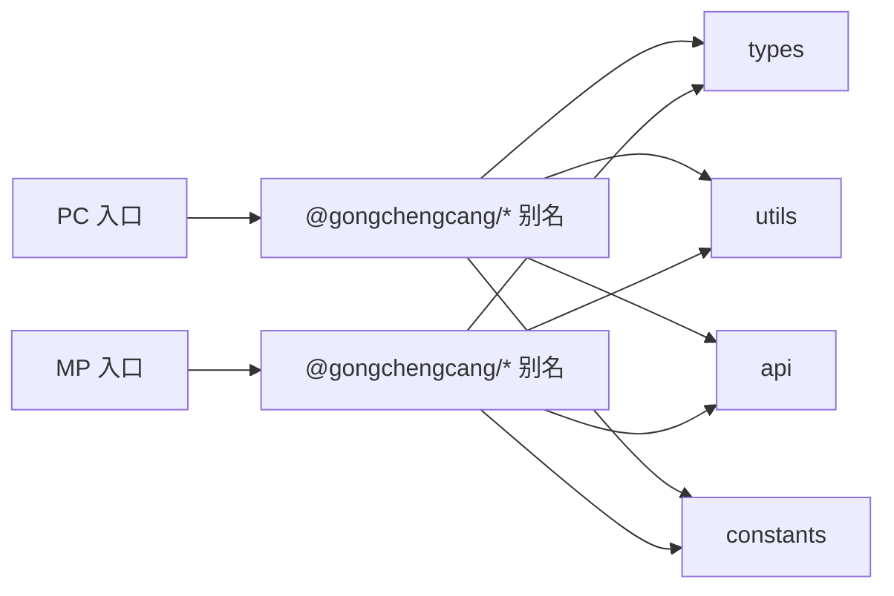

# 应用层架构

<cite>
**本文引用的文件**   
- [apps/pc/src/main.ts](file://apps/pc/src/main.ts)
- [apps/pc/src/App.vue](file://apps/pc/src/App.vue)
- [apps/pc/src/router/index.ts](file://apps/pc/src/router/index.ts)
- [apps/pc/src/layouts/BasicLayout.vue](file://apps/pc/src/layouts/BasicLayout.vue)
- [apps/pc/src/store/index.ts](file://apps/pc/src/store/index.ts)
- [apps/pc/src/store/app.ts](file://apps/pc/src/store/app.ts)
- [apps/pc/src/store/user.ts](file://apps/pc/src/store/user.ts)
- [apps/pc/src/components/PrdPanel/index.vue](file://apps/pc/src/components/PrdPanel/index.vue)
- [apps/pc/src/styles/common.less](file://apps/pc/src/styles/common.less)
- [apps/pc/vite.config.ts](file://apps/pc/vite.config.ts)
- [apps/mp/src/main.ts](file://apps/mp/src/main.ts)
- [apps/mp/src/App.vue](file://apps/mp/src/App.vue)
- [apps/mp/src/pages.json](file://apps/mp/src/pages.json)
- [apps/mp/vite.config.ts](file://apps/mp/vite.config.ts)
</cite>

## 目录
1. [引言](#引言)
2. [项目结构](#项目结构)
3. [核心组件](#核心组件)
4. [架构总览](#架构总览)
5. [详细组件分析](#详细组件分析)
6. [依赖分析](#依赖分析)
7. [性能考虑](#性能考虑)
8. [故障排查指南](#故障排查指南)
9. [结论](#结论)
10. [附录](#附录)

## 引言
本文件面向工程材料管理平台的应用层，系统化阐述 PC 端与小程序端的独立架构设计，覆盖入口文件结构、路由系统、状态管理、布局系统；深入解析 Vue 3 Composition API 的应用模式与最佳实践；详解 Pinia 状态管理的模块化设计、状态持久化与异步处理；并给出应用启动流程、错误边界处理与性能监控机制，以及扩展与定制化开发指导。

## 项目结构
工程采用多应用多包的组织方式：
- apps/pc：基于 Vue 3 + Vite 的 PC 端应用，使用 Arco Design 作为 UI 基础组件库，采用 Pinia 进行状态管理，具备完整的布局与路由体系。
- apps/mp：基于 uni-app 的小程序端应用，通过 pages.json 声明页面与 TabBar，使用 Vite 插件构建。
- packages/*：共享的类型、常量、API 封装与工具库，通过 Vite alias 在两端复用。

**图表来源**
- [apps/pc/src/main.ts:1-19](file://apps/pc/src/main.ts#L1-L19)
- [apps/pc/src/App.vue:1-11](file://apps/pc/src/App.vue#L1-L11)
- [apps/pc/src/router/index.ts:1-790](file://apps/pc/src/router/index.ts#L1-L790)
- [apps/pc/src/layouts/BasicLayout.vue:1-349](file://apps/pc/src/layouts/BasicLayout.vue#L1-L349)
- [apps/pc/src/store/index.ts:1-10](file://apps/pc/src/store/index.ts#L1-L10)
- [apps/pc/vite.config.ts:1-32](file://apps/pc/vite.config.ts#L1-L32)
- [apps/mp/src/main.ts:1-14](file://apps/mp/src/main.ts#L1-L14)
- [apps/mp/src/App.vue:1-24](file://apps/mp/src/App.vue#L1-L24)
- [apps/mp/src/pages.json:1-235](file://apps/mp/src/pages.json#L1-L235)
- [apps/mp/vite.config.ts:1-17](file://apps/mp/vite.config.ts#L1-L17)

**章节来源**
- [apps/pc/src/main.ts:1-19](file://apps/pc/src/main.ts#L1-L19)
- [apps/pc/src/router/index.ts:1-790](file://apps/pc/src/router/index.ts#L1-L790)
- [apps/pc/src/layouts/BasicLayout.vue:1-349](file://apps/pc/src/layouts/BasicLayout.vue#L1-L349)
- [apps/pc/src/store/index.ts:1-10](file://apps/pc/src/store/index.ts#L1-L10)
- [apps/pc/vite.config.ts:1-32](file://apps/pc/vite.config.ts#L1-L32)
- [apps/mp/src/main.ts:1-14](file://apps/mp/src/main.ts#L1-L14)
- [apps/mp/src/pages.json:1-235](file://apps/mp/src/pages.json#L1-L235)
- [apps/mp/vite.config.ts:1-17](file://apps/mp/vite.config.ts#L1-L17)

## 核心组件
- 入口与挂载
  - PC 端：在入口文件中创建应用实例，安装 Arco Design、图标、Pinia、Router，并挂载到 DOM。
  - 小程序端：导出工厂函数 createApp，内部创建 SSR App 实例并返回 app 与 pinia，便于 uni-app 生命周期集成。
- 应用根组件
  - PC 端：根组件包裹 Arco ConfigProvider，内含通用组件面板用于 PRD 展示。
  - 小程序端：生命周期钩子用于应用启动、显示、隐藏日志输出。
- 路由系统
  - PC 端：采用 hash 模式，集中声明多层级路由与权限元信息，全局前置守卫处理标题与鉴权。
  - 小程序端：通过 pages.json 声明页面与 TabBar，实现原生小程序导航。
- 状态管理
  - PC 端：Pinia Store 聚合导出，包含应用状态与用户状态模块，支持主题、加载、折叠状态与登录/登出、权限校验等。
- 布局系统
  - PC 端：BasicLayout 提供侧边栏、面包屑、头部工具条、内容区与页脚，动态菜单与面包屑基于路由生成，支持平台切换与预览跳转。
- 构建与别名
  - 两端均通过 Vite 配置 alias 指向 packages，PC 端额外配置代理与基础路径，便于本地联调。

**章节来源**
- [apps/pc/src/main.ts:1-19](file://apps/pc/src/main.ts#L1-L19)
- [apps/mp/src/main.ts:1-14](file://apps/mp/src/main.ts#L1-L14)
- [apps/pc/src/App.vue:1-11](file://apps/pc/src/App.vue#L1-L11)
- [apps/mp/src/App.vue:1-24](file://apps/mp/src/App.vue#L1-L24)
- [apps/pc/src/router/index.ts:1-790](file://apps/pc/src/router/index.ts#L1-L790)
- [apps/mp/src/pages.json:1-235](file://apps/mp/src/pages.json#L1-L235)
- [apps/pc/src/store/index.ts:1-10](file://apps/pc/src/store/index.ts#L1-L10)
- [apps/pc/src/store/app.ts:1-36](file://apps/pc/src/store/app.ts#L1-L36)
- [apps/pc/src/store/user.ts:1-112](file://apps/pc/src/store/user.ts#L1-L112)
- [apps/pc/src/layouts/BasicLayout.vue:1-349](file://apps/pc/src/layouts/BasicLayout.vue#L1-L349)
- [apps/pc/vite.config.ts:1-32](file://apps/pc/vite.config.ts#L1-L32)
- [apps/mp/vite.config.ts:1-17](file://apps/mp/vite.config.ts#L1-L17)

## 架构总览
PC 端与小程序端分别独立运行，共享同一套业务与技术栈的 packages。PC 端采用“布局 + 路由 + Pinia”的经典前端架构；小程序端采用 uni-app 的页面声明式导航。两者通过统一的 alias 与构建配置实现一致的开发体验与依赖复用。

**图表来源**
- [apps/pc/src/main.ts:1-19](file://apps/pc/src/main.ts#L1-L19)
- [apps/pc/src/App.vue:1-11](file://apps/pc/src/App.vue#L1-L11)
- [apps/pc/src/router/index.ts:1-790](file://apps/pc/src/router/index.ts#L1-L790)
- [apps/pc/src/store/index.ts:1-10](file://apps/pc/src/store/index.ts#L1-L10)
- [apps/pc/src/layouts/BasicLayout.vue:1-349](file://apps/pc/src/layouts/BasicLayout.vue#L1-L349)
- [apps/pc/src/store/user.ts:1-112](file://apps/pc/src/store/user.ts#L1-L112)
- [apps/pc/src/store/app.ts:1-36](file://apps/pc/src/store/app.ts#L1-L36)
- [apps/mp/src/main.ts:1-14](file://apps/mp/src/main.ts#L1-L14)
- [apps/mp/src/App.vue:1-24](file://apps/mp/src/App.vue#L1-L24)
- [apps/mp/src/pages.json:1-235](file://apps/mp/src/pages.json#L1-L235)
- [apps/pc/vite.config.ts:1-32](file://apps/pc/vite.config.ts#L1-L32)
- [apps/mp/vite.config.ts:1-17](file://apps/mp/vite.config.ts#L1-L17)

## 详细组件分析

### PC 端入口与启动流程
- 初始化顺序：创建应用 -> 安装 Arco Design 与图标 -> 安装 Pinia -> 安装 Router -> 挂载 DOM。
- 样式引入：全局样式与 Arco 样式在入口处集中引入，确保组件渲染一致性。
- 启动流程要点：入口文件仅承担装配职责，业务逻辑下沉至路由守卫、布局与各页面视图。

**图表来源**
- [apps/pc/src/main.ts:1-19](file://apps/pc/src/main.ts#L1-L19)

**章节来源**
- [apps/pc/src/main.ts:1-19](file://apps/pc/src/main.ts#L1-L19)

### 路由系统与权限控制
- 路由结构：采用嵌套路由与多布局（平台端、供应商端、工程仓端），支持重定向、面包屑与菜单联动。
- 全局前置守卫：设置页面标题、校验登录态；未登录自动跳转登录页并携带重定向参数。
- 路由懒加载：页面组件通过动态导入，提升首屏性能。
- 404 处理：兜底未匹配路由至 404 页面。

**图表来源**
- [apps/pc/src/router/index.ts:776-787](file://apps/pc/src/router/index.ts#L776-L787)

**章节来源**
- [apps/pc/src/router/index.ts:1-790](file://apps/pc/src/router/index.ts#L1-L790)

### 布局系统与菜单生成
- 侧边栏与菜单：根据路由动态生成菜单树，支持图标映射、折叠状态与子菜单展开。
- 面包屑：基于 matched 路由生成，仅展示带标题的节点。
- 平台切换：支持在不同角色平台间切换，切换后跳转对应工作台。
- 预览功能：提供小程序预览入口，便于跨端联调。
- 用户操作：退出登录时清理认证信息并跳转登录页。

**图表来源**
- [apps/pc/src/layouts/BasicLayout.vue:122-243](file://apps/pc/src/layouts/BasicLayout.vue#L122-L243)
- [apps/pc/src/router/index.ts:1-790](file://apps/pc/src/router/index.ts#L1-L790)
- [apps/pc/src/store/app.ts:1-36](file://apps/pc/src/store/app.ts#L1-L36)
- [apps/pc/src/store/user.ts:1-112](file://apps/pc/src/store/user.ts#L1-L112)

**章节来源**
- [apps/pc/src/layouts/BasicLayout.vue:1-349](file://apps/pc/src/layouts/BasicLayout.vue#L1-L349)
- [apps/pc/src/store/app.ts:1-36](file://apps/pc/src/store/app.ts#L1-L36)
- [apps/pc/src/store/user.ts:1-112](file://apps/pc/src/store/user.ts#L1-L112)

### 状态管理：Pinia 模块化设计
- Store 聚合导出：index.ts 聚合导出多个模块，便于在组件中按需引入。
- 应用状态模块：管理侧边栏折叠、全局加载态、主题切换（写入 body 属性以驱动 Arco 主题）。
- 用户状态模块：封装登录、获取用户信息、登出、权限判断等方法；支持 Mock 与真实接口切换。
- 持久化与异步：用户信息与 Token 通过工具函数进行本地存储；异步请求在 Store 内部处理并更新状态。

**图表来源**
- [apps/pc/src/store/index.ts:1-10](file://apps/pc/src/store/index.ts#L1-L10)
- [apps/pc/src/store/app.ts:1-36](file://apps/pc/src/store/app.ts#L1-L36)
- [apps/pc/src/store/user.ts:1-112](file://apps/pc/src/store/user.ts#L1-L112)

**章节来源**
- [apps/pc/src/store/index.ts:1-10](file://apps/pc/src/store/index.ts#L1-L10)
- [apps/pc/src/store/app.ts:1-36](file://apps/pc/src/store/app.ts#L1-L36)
- [apps/pc/src/store/user.ts:1-112](file://apps/pc/src/store/user.ts#L1-L112)

### Vue 3 Composition API 应用模式
- 组件设计原则
  - 使用 <script setup> 与 TypeScript，增强类型安全与可读性。
  - 将副作用（如路由、状态）集中在组件外层，组件内部聚焦渲染与事件。
  - 通过 computed、watch、ref、reactive 管理响应式数据与派生状态。
- 生命周期管理
  - PC 端：根组件在模板中挂载通用组件面板，布局组件在 setup 中完成菜单、面包屑与平台切换逻辑。
  - 小程序端：通过 App 的生命周期钩子进行应用级日志与初始化。
- 响应式数据处理
  - Store 管理全局状态，组件通过组合式 API 访问与更新。
  - 布局组件监听路由变化，自动同步选中与展开菜单项。

**章节来源**
- [apps/pc/src/layouts/BasicLayout.vue:122-243](file://apps/pc/src/layouts/BasicLayout.vue#L122-L243)
- [apps/pc/src/App.vue:1-11](file://apps/pc/src/App.vue#L1-L11)
- [apps/mp/src/App.vue:1-24](file://apps/mp/src/App.vue#L1-L24)

### 小程序端入口与页面声明
- 入口文件：导出 createApp 工厂函数，创建 SSR App 实例并返回 app 与 pinia，适配 uni-app 生命周期。
- 页面声明：通过 pages.json 声明页面路径、导航栏标题与 TabBar 列表，实现原生小程序导航体验。
- 构建配置：使用 @dcloudio/vite-plugin-uni 插件，保持与 PC 端一致的 alias 与包复用。

**图表来源**
- [apps/mp/src/main.ts:1-14](file://apps/mp/src/main.ts#L1-L14)
- [apps/mp/src/pages.json:1-235](file://apps/mp/src/pages.json#L1-L235)

**章节来源**
- [apps/mp/src/main.ts:1-14](file://apps/mp/src/main.ts#L1-L14)
- [apps/mp/src/pages.json:1-235](file://apps/mp/src/pages.json#L1-L235)
- [apps/mp/vite.config.ts:1-17](file://apps/mp/vite.config.ts#L1-L17)

### PRD 面板组件与开发辅助
- 组件职责：在 PC 端提供浮动按钮与抽屉，展示当前页面对应的 PRD 条目，提升开发效率。
- 数据来源：内置 PRD 数据库，按路由路径匹配并渲染。
- 交互细节：悬浮提示、步骤条展示、Markdown 预格式化内容滚动展示。

**图表来源**
- [apps/pc/src/components/PrdPanel/index.vue:1-634](file://apps/pc/src/components/PrdPanel/index.vue#L1-L634)

**章节来源**
- [apps/pc/src/components/PrdPanel/index.vue:1-634](file://apps/pc/src/components/PrdPanel/index.vue#L1-L634)

## 依赖分析
- 构建与别名
  - 两端均配置 alias 指向 packages/*，统一类型、工具、API 与常量。
  - PC 端额外配置代理与基础路径，便于本地联调后端服务。
- 组件与样式
  - PC 端使用 Arco Design 组件库，样式通过 less 与变量体系统一风格。
  - 通用样式类（如 page-container、card-container、flex 布局）在公共样式文件中集中定义。

**图表来源**
- [apps/pc/vite.config.ts:8-16](file://apps/pc/vite.config.ts#L8-L16)
- [apps/mp/vite.config.ts:7-15](file://apps/mp/vite.config.ts#L7-L15)

**章节来源**
- [apps/pc/vite.config.ts:1-32](file://apps/pc/vite.config.ts#L1-L32)
- [apps/mp/vite.config.ts:1-17](file://apps/mp/vite.config.ts#L1-L17)

## 性能考虑
- 路由懒加载：页面组件采用动态导入，减少初始包体与首屏加载时间。
- 菜单与面包屑：基于路由计算，避免冗余渲染与重复数据。
- 全局样式与主题：通过变量与主题属性控制，降低样式重绘成本。
- 开发体验：PC 端开启源码映射，便于调试；代理配置简化跨域联调。
- 建议
  - 对高频组件启用 keep-alive 或缓存策略。
  - 对大列表采用虚拟滚动或分页加载。
  - 对静态资源使用 CDN 与压缩优化。

[本节为通用性能建议，无需特定文件引用]

## 故障排查指南
- 登录与鉴权
  - 现象：访问受保护路由被重定向至登录页。
  - 排查：检查本地 Token 是否存在；确认全局前置守卫逻辑与路由元信息。
- 主题与布局异常
  - 现象：主题切换无效或菜单折叠状态不一致。
  - 排查：确认 Store 中 theme 与 collapsed 的更新；检查 body 属性是否正确写入。
- 小程序页面无法打开
  - 现象：pages.json 中声明的页面在小程序端不可见。
  - 排查：核对页面路径、TabBar 配置与图标路径；确认 uni 插件已正确安装。
- 样式冲突
  - 现象：组件样式覆盖或变量未生效。
  - 排查：检查 less 变量与作用域；确认 Arco 主题属性是否正确设置。

**章节来源**
- [apps/pc/src/router/index.ts:776-787](file://apps/pc/src/router/index.ts#L776-L787)
- [apps/pc/src/store/app.ts:21-24](file://apps/pc/src/store/app.ts#L21-L24)
- [apps/mp/src/pages.json:202-233](file://apps/mp/src/pages.json#L202-L233)

## 结论
本架构以 PC 端与小程序端双入口为核心，结合路由、布局与 Pinia 状态管理，形成清晰的职责分离与可扩展结构。通过共享包与统一构建配置，两端在开发体验与依赖复用上保持一致。Composition API 与模块化 Store 使状态与逻辑更易维护；PRD 面板等开发辅助提升了协作效率。后续可在路由与状态层面进一步细化权限与缓存策略，持续优化性能与可维护性。

[本节为总结性内容，无需特定文件引用]

## 附录
- 扩展与定制化开发指导
  - 新增页面：在路由中添加新路由项，必要时在布局中补充菜单与面包屑元信息。
  - 新增 Store 模块：在 store 目录新增模块文件并通过 index.ts 聚合导出。
  - 新增页面样式：在 styles 目录新增 less 文件，遵循现有变量与类名规范。
  - 小程序新增页面：在 pages.json 中新增页面项，确保路径与导航栏标题正确。
  - Mock 与联调：通过环境变量切换 Mock 与真实接口；PC 端使用代理配置联调后端。

**章节来源**
- [apps/pc/src/router/index.ts:1-790](file://apps/pc/src/router/index.ts#L1-L790)
- [apps/pc/src/store/index.ts:1-10](file://apps/pc/src/store/index.ts#L1-L10)
- [apps/pc/src/styles/common.less:1-79](file://apps/pc/src/styles/common.less#L1-L79)
- [apps/mp/src/pages.json:1-235](file://apps/mp/src/pages.json#L1-L235)
- [apps/pc/src/store/user.ts:40-56](file://apps/pc/src/store/user.ts#L40-L56)