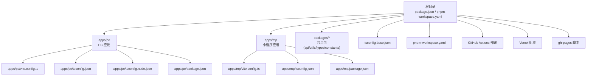
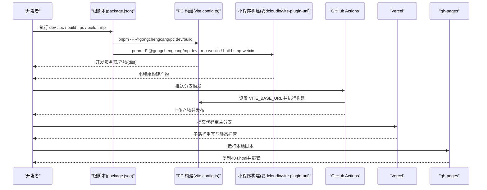
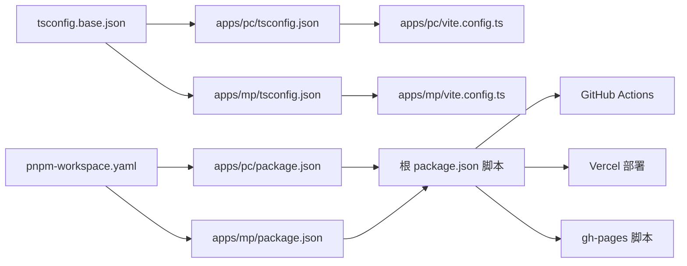

# 构建配置架构

<cite>
**本文引用的文件**
- [apps/pc/vite.config.ts](file://apps/pc/vite.config.ts)
- [apps/mp/vite.config.ts](file://apps/mp/vite.config.ts)
- [apps/pc/tsconfig.json](file://apps/pc/tsconfig.json)
- [apps/pc/tsconfig.node.json](file://apps/pc/tsconfig.node.json)
- [apps/mp/tsconfig.json](file://apps/mp/tsconfig.json)
- [tsconfig.base.json](file://tsconfig.base.json)
- [package.json](file://package.json)
- [pnpm-workspace.yaml](file://pnpm-workspace.yaml)
- [.github/workflows/deploy.yml](file://.github/workflows/deploy.yml)
- [vercel.json](file://vercel.json)
- [deploy-gh-pages.sh](file://deploy-gh-pages.sh)
- [apps/pc/package.json](file://apps/pc/package.json)
- [apps/mp/package.json](file://apps/mp/package.json)
</cite>

## 目录
1. [引言](#引言)
2. [项目结构](#项目结构)
3. [核心组件](#核心组件)
4. [架构总览](#架构总览)
5. [详细组件分析](#详细组件分析)
6. [依赖关系分析](#依赖关系分析)
7. [性能考量](#性能考量)
8. [故障排查指南](#故障排查指南)
9. [结论](#结论)
10. [附录](#附录)

## 引言
本文件面向工程材料管理平台的构建配置架构，系统性阐述Vite构建工具在PC端与小程序端的差异化配置策略，涵盖开发服务器、代理、生产构建优化与源码映射；同时说明TypeScript多环境编译配置（路径映射、模块解析、编译选项）如何在monorepo中统一与分发；最后给出构建流程自动化、环境变量管理与产物分析的最佳实践。

## 项目结构
该仓库采用monorepo组织方式，通过工作区统一管理PC端与小程序端应用及共享包，并以独立的构建配置文件实现差异化目标平台与输出策略。

图表来源
- [package.json:1-23](file://package.json#L1-L23)
- [pnpm-workspace.yaml:1-4](file://pnpm-workspace.yaml#L1-L4)
- [apps/pc/vite.config.ts:1-32](file://apps/pc/vite.config.ts#L1-L32)
- [apps/mp/vite.config.ts:1-17](file://apps/mp/vite.config.ts#L1-L17)
- [apps/pc/tsconfig.json:1-16](file://apps/pc/tsconfig.json#L1-L16)
- [apps/pc/tsconfig.node.json:1-12](file://apps/pc/tsconfig.node.json#L1-L12)
- [apps/mp/tsconfig.json:1-16](file://apps/mp/tsconfig.json#L1-L16)
- [tsconfig.base.json:1-29](file://tsconfig.base.json#L1-L29)

章节来源
- [package.json:1-23](file://package.json#L1-L23)
- [pnpm-workspace.yaml:1-4](file://pnpm-workspace.yaml#L1-L4)

## 核心组件
- Vite配置（PC端/小程序端）
  - PC端：启用Vue插件、路径别名、开发服务器与代理、构建输出与源码映射。
  - 小程序端：基于UniApp插件，统一使用Vite生态，路径别名与共享包映射一致。
- TypeScript配置（基础/应用层）
  - 基础配置：统一编译目标、严格模式、模块解析策略、路径映射。
  - 应用层：继承基础配置，补充应用特定路径映射与类型声明。
- 工作区与脚本
  - pnpm工作区定义各包位置；根脚本统一触发各应用构建与类型检查。
- 自动化与部署
  - GitHub Actions流水线：安装pnpm、安装依赖、设置Vite基础路径、构建并上传产物。
  - Vercel：自定义重写规则与输出目录，适配子路径部署。
  - gh-pages脚本：本地构建后复制SPA路由支持文件并部署。

章节来源
- [apps/pc/vite.config.ts:1-32](file://apps/pc/vite.config.ts#L1-L32)
- [apps/mp/vite.config.ts:1-17](file://apps/mp/vite.config.ts#L1-L17)
- [tsconfig.base.json:1-29](file://tsconfig.base.json#L1-L29)
- [apps/pc/tsconfig.json:1-16](file://apps/pc/tsconfig.json#L1-L16)
- [apps/pc/tsconfig.node.json:1-12](file://apps/pc/tsconfig.node.json#L1-L12)
- [apps/mp/tsconfig.json:1-16](file://apps/mp/tsconfig.json#L1-L16)
- [package.json:6-12](file://package.json#L6-L12)
- [.github/workflows/deploy.yml:36-39](file://.github/workflows/deploy.yml#L36-L39)
- [vercel.json:1-11](file://vercel.json#L1-L11)
- [deploy-gh-pages.sh:1-27](file://deploy-gh-pages.sh#L1-L27)

## 架构总览
下图展示从开发者命令到最终部署的关键路径，以及PC端与小程序端构建差异点。

图表来源
- [package.json:6-12](file://package.json#L6-L12)
- [apps/pc/vite.config.ts:5-31](file://apps/pc/vite.config.ts#L5-L31)
- [.github/workflows/deploy.yml:36-39](file://.github/workflows/deploy.yml#L36-L39)
- [vercel.json:1-11](file://vercel.json#L1-L11)
- [deploy-gh-pages.sh:12-23](file://deploy-gh-pages.sh#L12-L23)

## 详细组件分析

### PC端构建配置
- 插件与别名
  - 启用Vue插件，统一引入路径别名，便于跨包引用共享模块。
- 开发服务器与代理
  - 绑定主机与端口，配置/api前缀代理到本地后端服务，便于前后端联调。
- 生产构建
  - 输出目录为dist，开启源码映射，便于线上问题定位与回溯。
- 基础路径
  - 通过环境变量控制base路径，默认指向/gongchengcang/，CI中可覆盖为仓库名子路径。

章节来源
- [apps/pc/vite.config.ts:5-31](file://apps/pc/vite.config.ts#L5-L31)

### 小程序端构建配置
- 插件与别名
  - 使用UniApp Vite插件，统一别名与共享包映射，确保多端一致性。
- 平台差异
  - 通过命令选择目标平台（如微信小程序），实现多端同构开发。

章节来源
- [apps/mp/vite.config.ts:5-16](file://apps/mp/vite.config.ts#L5-L16)
- [apps/mp/package.json:5-10](file://apps/mp/package.json#L5-L10)

### TypeScript编译配置
- 基础配置（tsconfig.base.json）
  - 编译目标与模块：ES2020 + ESNext，严格模式，隔离模块，禁用emit。
  - 路径映射：统一@gongchengcang/* 到 packages/* 对应源码目录。
  - 模块解析：bundler模式，适配现代打包器。
- 应用层配置
  - PC端：继承基础配置，补充应用内@/*路径映射与references指向node侧tsconfig。
  - 小程序端：继承基础配置，补充平台类型声明与应用内路径映射。
- Node侧配置（PC端）
  - 仅包含vite.config.ts，复合编译，bundler解析，严格模式。

章节来源
- [tsconfig.base.json:1-29](file://tsconfig.base.json#L1-L29)
- [apps/pc/tsconfig.json:1-16](file://apps/pc/tsconfig.json#L1-L16)
- [apps/pc/tsconfig.node.json:1-12](file://apps/pc/tsconfig.node.json#L1-L12)
- [apps/mp/tsconfig.json:1-16](file://apps/mp/tsconfig.json#L1-L16)

### monorepo工作区与脚本
- 工作区定义
  - packages与apps均纳入工作区，实现跨包依赖与类型共享。
- 根脚本
  - 提供统一入口：开发PC/小程序、构建PC/小程序、类型检查与代码质量检查。
- 应用脚本
  - PC端：dev/build/preview/类型检查/代码质量/部署。
  - 小程序端：多平台开发与构建命令。

章节来源
- [pnpm-workspace.yaml:1-4](file://pnpm-workspace.yaml#L1-L4)
- [package.json:6-12](file://package.json#L6-L12)
- [apps/pc/package.json:6-12](file://apps/pc/package.json#L6-L12)
- [apps/mp/package.json:5-10](file://apps/mp/package.json#L5-L10)

### 构建流程自动化与部署
- GitHub Actions
  - 安装pnpm与依赖，执行构建，设置VITE_BASE_URL以适配仓库名子路径，上传产物。
- Vercel
  - 自定义构建命令与输出目录，配置子路径重写，适配多环境部署。
- gh-pages脚本
  - 本地构建后复制index.html为404.html以支持SPA路由，添加.nojekyll避免Jekyll处理，推送至gh-pages分支。

章节来源
- [.github/workflows/deploy.yml:1-59](file://.github/workflows/deploy.yml#L1-L59)
- [vercel.json:1-11](file://vercel.json#L1-L11)
- [deploy-gh-pages.sh:1-27](file://deploy-gh-pages.sh#L1-L27)

## 依赖关系分析
- 包依赖与解析
  - 共享包通过workspace:*在应用间共享，TypeScript路径映射与Vite别名保持一致，避免重复解析与构建偏差。
- 构建插件耦合
  - PC端依赖@vitejs/plugin-vue，小程序端依赖@dcloudio/vite-plugin-uni，二者均与各自平台生态深度集成。
- 环境变量与部署
  - VITE_BASE_URL贯穿开发与CI，确保产物在不同子路径下正确加载。

图表来源
- [tsconfig.base.json:1-29](file://tsconfig.base.json#L1-L29)
- [apps/pc/tsconfig.json:1-16](file://apps/pc/tsconfig.json#L1-L16)
- [apps/mp/tsconfig.json:1-16](file://apps/mp/tsconfig.json#L1-L16)
- [apps/pc/vite.config.ts:1-32](file://apps/pc/vite.config.ts#L1-L32)
- [apps/mp/vite.config.ts:1-17](file://apps/mp/vite.config.ts#L1-L17)
- [pnpm-workspace.yaml:1-4](file://pnpm-workspace.yaml#L1-L4)
- [apps/pc/package.json:1-36](file://apps/pc/package.json#L1-L36)
- [apps/mp/package.json:1-39](file://apps/mp/package.json#L1-L39)
- [package.json:6-12](file://package.json#L6-L12)
- [.github/workflows/deploy.yml:36-39](file://.github/workflows/deploy.yml#L36-L39)
- [vercel.json:1-11](file://vercel.json#L1-L11)
- [deploy-gh-pages.sh:12-23](file://deploy-gh-pages.sh#L12-L23)

## 性能考量
- Tree Shaking
  - 使用ES模块与bundler解析策略，结合严格模式与无emit的类型检查，减少冗余导出与未使用代码。
- 代码分割
  - 建议在PC端配合路由级动态导入与组件级异步组件，利用Vite默认的动态导入能力进行自然分割。
- 懒加载
  - 将非首屏资源（如大组件、图表库、富文本等）采用异步加载，降低初始包体。
- 缓存策略
  - 在部署端设置合理的静态资源缓存与版本化策略；在Vercel中可通过重写与CDN缓存优化命中率。
- 源码映射
  - 生产构建开启sourcemap，便于问题定位；同时注意体积与安全影响，必要时采用分离式sourcemap或按需生成。

## 故障排查指南
- 代理无效或跨域
  - 检查开发服务器代理配置与后端监听地址，确认changeOrigin与路径前缀匹配。
- 路径解析失败
  - 确认TypeScript路径映射与Vite别名一致，且应用层tsconfig正确继承基础配置。
- CI构建路径错误
  - 确认VITE_BASE_URL在CI中被正确注入，且与部署平台的子路径一致。
- SPA路由404
  - 在构建后复制index.html为404.html，或在部署平台配置回退路由。
- 类型检查失败
  - 检查复合编译配置与references指向，确保vite.config.ts被包含在node侧编译范围。

章节来源
- [apps/pc/vite.config.ts:17-26](file://apps/pc/vite.config.ts#L17-L26)
- [apps/pc/tsconfig.json:13-14](file://apps/pc/tsconfig.json#L13-L14)
- [apps/pc/tsconfig.node.json:10](file://apps/pc/tsconfig.node.json#L10)
- [.github/workflows/deploy.yml:38-39](file://.github/workflows/deploy.yml#L38-L39)
- [deploy-gh-pages.sh:15-16](file://deploy-gh-pages.sh#L15-L16)

## 结论
本项目通过清晰的monorepo边界与统一的TypeScript配置，结合Vite在PC端与小程序端的差异化插件与别名策略，实现了高内聚、低耦合的构建体系。配合CI/CD与多种部署方案，能够稳定地支撑多端产物的持续交付与运行优化。

## 附录
- 最佳实践清单
  - 统一使用bundler解析与严格TS配置，减少运行时差异。
  - 在PC端启用路由与组件级懒加载，结合Vite动态导入实现自然分割。
  - 在CI中显式设置VITE_BASE_URL，确保产物在不同子路径下可用。
  - 部署前生成404.html或配置回退路由，保障SPA路由体验。
  - 使用源码映射辅助问题定位，同时平衡体积与安全性。