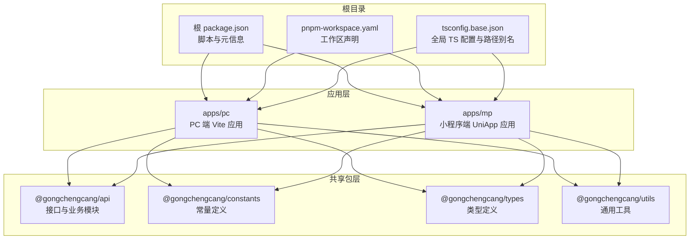
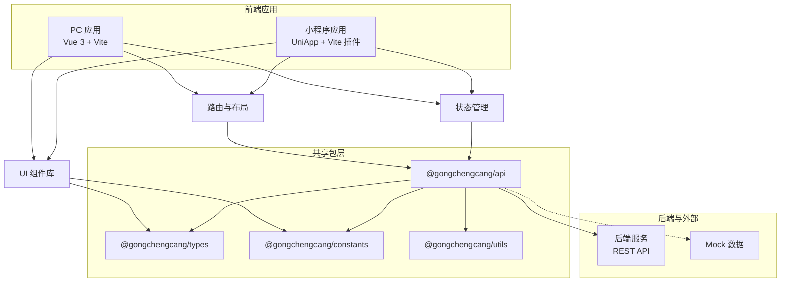
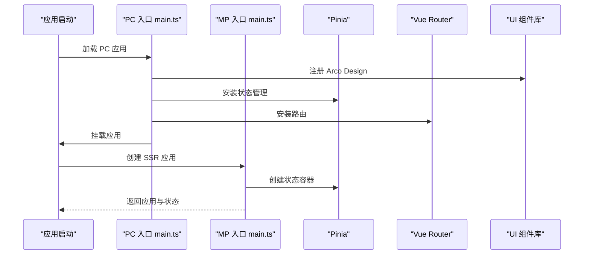
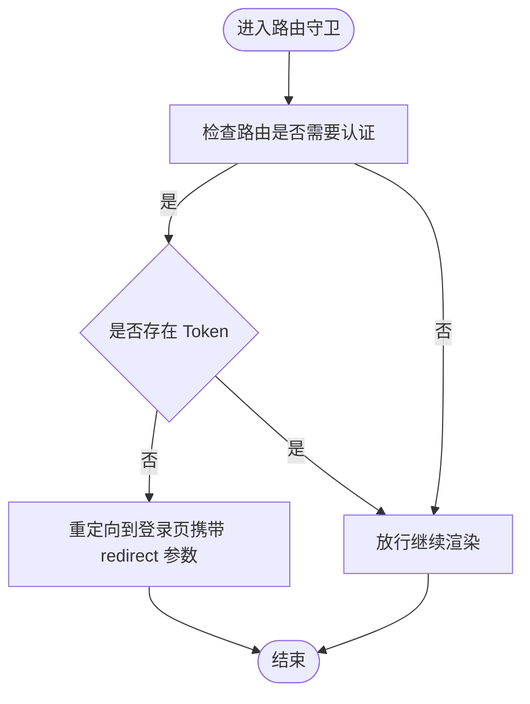
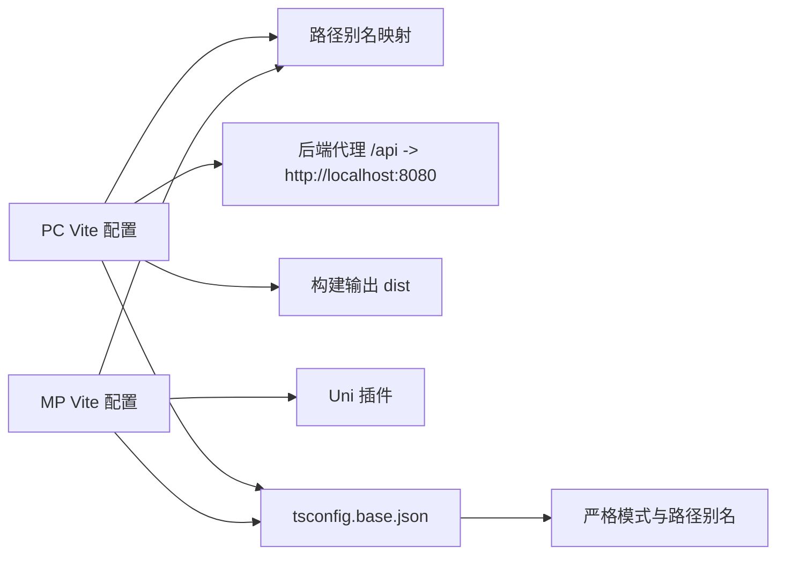
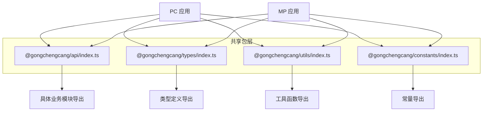
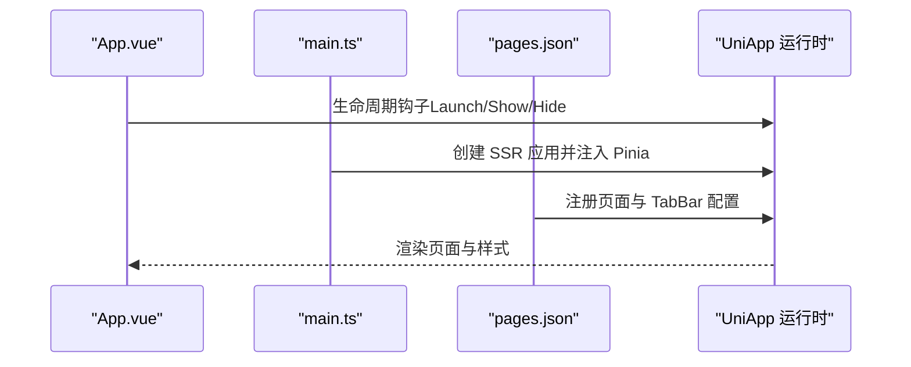
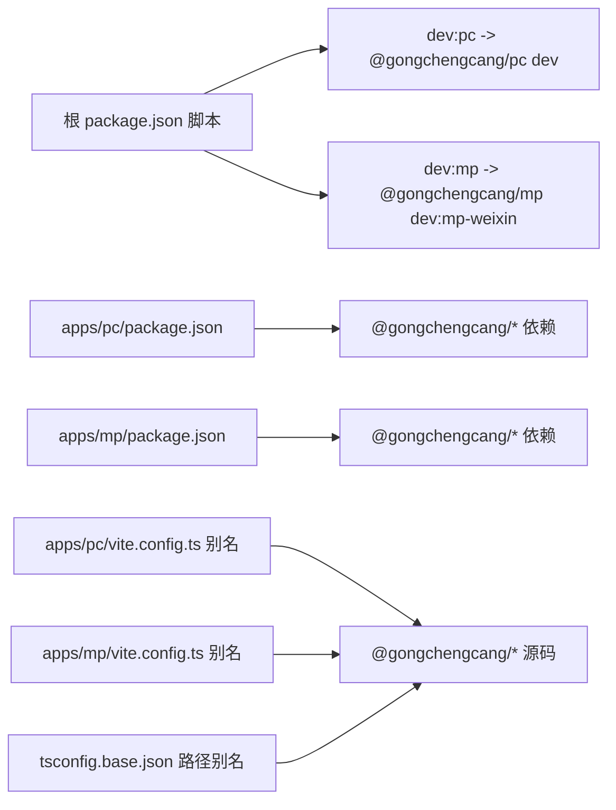

# 系统架构

<cite>
**本文引用的文件**
- [package.json](file://package.json)
- [pnpm-workspace.yaml](file://pnpm-workspace.yaml)
- [tsconfig.base.json](file://tsconfig.base.json)
- [apps/mp/package.json](file://apps/mp/package.json)
- [apps/pc/package.json](file://apps/pc/package.json)
- [apps/mp/src/main.ts](file://apps/mp/src/main.ts)
- [apps/pc/src/main.ts](file://apps/pc/src/main.ts)
- [apps/mp/vite.config.ts](file://apps/mp/vite.config.ts)
- [apps/pc/vite.config.ts](file://apps/pc/vite.config.ts)
- [apps/mp/src/App.vue](file://apps/mp/src/App.vue)
- [apps/pc/src/App.vue](file://apps/pc/src/App.vue)
- [apps/mp/src/pages.json](file://apps/mp/src/pages.json)
- [apps/pc/src/router/index.ts](file://apps/pc/src/router/index.ts)
- [packages/api/src/index.ts](file://packages/api/src/index.ts)
- [packages/types/src/index.ts](file://packages/types/src/index.ts)
- [packages/utils/src/index.ts](file://packages/utils/src/index.ts)
- [packages/constants/src/index.ts](file://packages/constants/src/index.ts)
</cite>

## 目录
1. [引言](#引言)
2. [项目结构](#项目结构)
3. [核心组件](#核心组件)
4. [架构总览](#架构总览)
5. [详细组件分析](#详细组件分析)
6. [依赖分析](#依赖分析)
7. [性能考量](#性能考量)
8. [故障排查指南](#故障排查指南)
9. [结论](#结论)
10. [附录](#附录)

## 引言
本文件面向工程材料管理平台的系统架构文档，聚焦于 Monorepo 架构设计、多端统一（UniApp）与前后端分离模式。文档从应用层（apps/pc、apps/mp）到共享包层（packages/api、packages/constants、packages/types、packages/utils），系统阐述职责划分、依赖关系、构建配置、模块化设计与代码组织原则，并给出架构决策说明、技术选型理由、性能优化策略与扩展性考虑，辅以架构图与组件交互图，帮助开发者快速理解整体设计。

## 项目结构
工程采用 pnpm workspaces 的 Monorepo 组织方式，将应用与共享包解耦，通过统一的 TypeScript 基础配置与路径别名，实现跨应用复用与一致的开发体验。

- 根目录脚本：通过根脚本统一触发各应用的开发与构建命令，便于本地联调与 CI 集成。
- 工作区定义：apps 与 packages 均纳入工作区，支持跨包依赖与版本管理。
- 路径别名：基于 tsconfig.base.json 的 paths，将 @gongchengcang/types、@gongchengcang/utils、@gongchengcang/api、@gongchengcang/constants 映射到对应共享包源码，确保类型、工具与 API 在多端一致可用。

图表来源
- [package.json:1-23](file://package.json#L1-L23)
- [pnpm-workspace.yaml:1-4](file://pnpm-workspace.yaml#L1-L4)
- [tsconfig.base.json:21-26](file://tsconfig.base.json#L21-L26)

章节来源
- [package.json:6-12](file://package.json#L6-L12)
- [pnpm-workspace.yaml:1-4](file://pnpm-workspace.yaml#L1-L4)
- [tsconfig.base.json:21-26](file://tsconfig.base.json#L21-L26)

## 核心组件
- 应用层
  - apps/pc：基于 Vue 3 + Vite 的 PC 端应用，使用路由与状态管理，具备 Arco Design 主题样式与代理配置。
  - apps/mp：基于 UniApp 的多端统一应用，支持微信小程序与 H5，统一入口与构建配置。
- 共享包层
  - packages/api：集中导出各业务模块的请求封装与 Mock 数据，作为应用层与后端 API 的契约层。
  - packages/types：集中导出各业务领域的 TypeScript 类型定义，保证前后端与多端类型一致性。
  - packages/utils：集中导出日期格式化、请求封装、存储、树结构处理、校验等通用工具函数。
  - packages/constants：集中导出枚举、状态码、配置常量等，避免魔法值，提升可维护性。

章节来源
- [apps/pc/package.json:14-24](file://apps/pc/package.json#L14-L24)
- [apps/mp/package.json:12-24](file://apps/mp/package.json#L12-L24)
- [packages/api/src/index.ts](file://packages/api/src/index.ts)
- [packages/types/src/index.ts](file://packages/types/src/index.ts)
- [packages/utils/src/index.ts](file://packages/utils/src/index.ts)
- [packages/constants/src/index.ts](file://packages/constants/src/index.ts)

## 架构总览
系统采用“Monorepo + 多端统一 + 前后端分离”的整体架构。应用层通过共享包层提供统一的类型、常量与工具；构建层分别由 Vite（PC）与 Uni 插件（小程序/H5）驱动；运行时通过路由与状态管理组织视图与业务逻辑；API 层通过统一的请求封装与 Mock 支持前后端并行开发。

图表来源
- [apps/pc/src/main.ts:11-18](file://apps/pc/src/main.ts#L11-L18)
- [apps/mp/src/main.ts:5-12](file://apps/mp/src/main.ts#L5-L12)
- [apps/pc/src/router/index.ts:1-10](file://apps/pc/src/router/index.ts#L1-L10)
- [packages/api/src/index.ts](file://packages/api/src/index.ts)
- [packages/utils/src/index.ts](file://packages/utils/src/index.ts)
- [packages/types/src/index.ts](file://packages/types/src/index.ts)
- [packages/constants/src/index.ts](file://packages/constants/src/index.ts)

## 详细组件分析

### 应用入口与运行时初始化
- apps/pc/src/main.ts：创建应用实例，注册 Arco Design 组件库与图标、Pinia、Vue Router，挂载根节点。
- apps/mp/src/main.ts：创建 SSR 应用实例，注入 Pinia，返回应用与状态容器，供 UniApp 生命周期使用。

图表来源
- [apps/pc/src/main.ts:11-18](file://apps/pc/src/main.ts#L11-L18)
- [apps/mp/src/main.ts:5-12](file://apps/mp/src/main.ts#L5-L12)

章节来源
- [apps/pc/src/main.ts:1-19](file://apps/pc/src/main.ts#L1-L19)
- [apps/mp/src/main.ts:1-14](file://apps/mp/src/main.ts#L1-L14)

### 路由与页面组织（PC 端）
- apps/pc/src/router/index.ts：集中定义多角色布局与路由表，支持懒加载视图、权限控制与标题设置；在导航守卫中校验登录态并重定向至登录页。
- apps/mp/src/pages.json：小程序端页面与 TabBar 配置，统一导航栏标题与图标资源路径。

图表来源
- [apps/pc/src/router/index.ts:776-787](file://apps/pc/src/router/index.ts#L776-L787)

章节来源
- [apps/pc/src/router/index.ts:1-790](file://apps/pc/src/router/index.ts#L1-L790)
- [apps/mp/src/pages.json:1-235](file://apps/mp/src/pages.json#L1-L235)

### 构建与开发配置
- apps/pc/vite.config.ts：配置基础路径、代理、别名与构建输出；开启源码映射便于调试。
- apps/mp/vite.config.ts：集成 Uni 插件，配置路径别名指向共享包源码，确保多端一致解析。
- tsconfig.base.json：统一编译选项、严格模式、路径别名，保障类型检查与模块解析一致性。

图表来源
- [apps/pc/vite.config.ts:6-31](file://apps/pc/vite.config.ts#L6-L31)
- [apps/mp/vite.config.ts:5-16](file://apps/mp/vite.config.ts#L5-L16)
- [tsconfig.base.json:2-26](file://tsconfig.base.json#L2-L26)

章节来源
- [apps/pc/vite.config.ts:1-32](file://apps/pc/vite.config.ts#L1-L32)
- [apps/mp/vite.config.ts:1-17](file://apps/mp/vite.config.ts#L1-L17)
- [tsconfig.base.json:1-29](file://tsconfig.base.json#L1-L29)

### 共享包层职责与导出
- packages/api/src/index.ts：集中导出各业务模块（如 auth、user、product、order、warehouse、finance、custody、merchant、splitRule）的接口与 Mock，作为应用层调用后端的统一入口。
- packages/types/src/index.ts：集中导出各业务领域类型，确保前后端与多端类型一致。
- packages/utils/src/index.ts：集中导出日期格式化、请求封装、存储、树结构处理、校验等工具函数。
- packages/constants/src/index.ts：集中导出枚举、状态码、配置常量等。

图表来源
- [packages/api/src/index.ts](file://packages/api/src/index.ts)
- [packages/types/src/index.ts](file://packages/types/src/index.ts)
- [packages/utils/src/index.ts](file://packages/utils/src/index.ts)
- [packages/constants/src/index.ts](file://packages/constants/src/index.ts)

章节来源
- [packages/api/src/index.ts](file://packages/api/src/index.ts)
- [packages/types/src/index.ts](file://packages/types/src/index.ts)
- [packages/utils/src/index.ts](file://packages/utils/src/index.ts)
- [packages/constants/src/index.ts](file://packages/constants/src/index.ts)

### 多端统一（UniApp）与页面生命周期
- apps/mp/src/App.vue：小程序应用生命周期钩子与全局样式引入，统一页面背景与字体。
- apps/mp/src/main.ts：创建 SSR 应用并注入 Pinia，返回应用实例供多端运行时使用。
- apps/mp/src/pages.json：小程序页面与 TabBar 配置，统一导航栏标题与图标资源路径。

图表来源
- [apps/mp/src/App.vue:1-24](file://apps/mp/src/App.vue#L1-L24)
- [apps/mp/src/main.ts:5-12](file://apps/mp/src/main.ts#L5-L12)
- [apps/mp/src/pages.json:1-235](file://apps/mp/src/pages.json#L1-L235)

章节来源
- [apps/mp/src/App.vue:1-24](file://apps/mp/src/App.vue#L1-L24)
- [apps/mp/src/main.ts:1-14](file://apps/mp/src/main.ts#L1-L14)
- [apps/mp/src/pages.json:1-235](file://apps/mp/src/pages.json#L1-L235)

## 依赖分析
- 应用对共享包的依赖：apps/pc 与 apps/mp 均通过 workspace:* 依赖共享包，确保版本一致与热更新。
- 路径别名与模块解析：tsconfig.base.json 与各应用 vite.config.ts 的 alias 保持一致，避免重复与歧义。
- 开发与构建脚本：根脚本统一触发各应用的 dev/build，便于联调与部署。

图表来源
- [package.json:6-12](file://package.json#L6-L12)
- [apps/pc/package.json:14-24](file://apps/pc/package.json#L14-L24)
- [apps/mp/package.json:17-20](file://apps/mp/package.json#L17-L20)
- [apps/pc/vite.config.ts:8-15](file://apps/pc/vite.config.ts#L8-L15)
- [apps/mp/vite.config.ts:7-14](file://apps/mp/vite.config.ts#L7-L14)
- [tsconfig.base.json:21-26](file://tsconfig.base.json#L21-L26)

章节来源
- [package.json:6-12](file://package.json#L6-L12)
- [apps/pc/package.json:14-24](file://apps/pc/package.json#L14-L24)
- [apps/mp/package.json:17-20](file://apps/mp/package.json#L17-L20)
- [apps/pc/vite.config.ts:8-15](file://apps/pc/vite.config.ts#L8-L15)
- [apps/mp/vite.config.ts:7-14](file://apps/mp/vite.config.ts#L7-L14)
- [tsconfig.base.json:21-26](file://tsconfig.base.json#L21-L26)

## 性能考量
- 构建与打包
  - PC 端启用源码映射便于调试，建议在生产构建关闭或仅生成独立映射文件。
  - 合理拆分路由视图，利用动态导入实现按需加载，降低首屏体积。
- 运行时优化
  - 使用 Pinia 替代 Vuex，减少样板代码与体积。
  - UI 组件库按需引入，避免整库打包。
- 多端一致性
  - 通过共享包统一工具与类型，减少重复计算与分支逻辑，提升缓存命中率。
- 开发体验
  - 代理配置统一指向本地后端，减少跨域与网络抖动带来的调试成本。

## 故障排查指南
- 登录态失效导致页面跳转
  - 现象：访问受保护路由被重定向至登录页。
  - 排查：检查路由守卫中的 Token 获取逻辑与存储位置。
  - 参考路径：[apps/pc/src/router/index.ts:776-787](file://apps/pc/src/router/index.ts#L776-L787)
- 小程序页面无法显示或 TabBar 异常
  - 现象：页面未注册或 TabBar 图标不显示。
  - 排查：核对 pages.json 中页面路径与图标路径，确保资源存在且路径正确。
  - 参考路径：[apps/mp/src/pages.json:1-235](file://apps/mp/src/pages.json#L1-L235)
- 构建别名解析失败
  - 现象：模块导入报错或路径解析不到共享包。
  - 排查：确认 tsconfig.base.json 与各应用 vite.config.ts 的 alias 一致，且路径指向 src。
  - 参考路径：[tsconfig.base.json:21-26](file://tsconfig.base.json#L21-L26)、[apps/pc/vite.config.ts:8-15](file://apps/pc/vite.config.ts#L8-L15)、[apps/mp/vite.config.ts:7-14](file://apps/mp/vite.config.ts#L7-L14)

章节来源
- [apps/pc/src/router/index.ts:776-787](file://apps/pc/src/router/index.ts#L776-L787)
- [apps/mp/src/pages.json:1-235](file://apps/mp/src/pages.json#L1-L235)
- [tsconfig.base.json:21-26](file://tsconfig.base.json#L21-L26)
- [apps/pc/vite.config.ts:8-15](file://apps/pc/vite.config.ts#L8-L15)
- [apps/mp/vite.config.ts:7-14](file://apps/mp/vite.config.ts#L7-L14)

## 结论
本架构以 Monorepo 为核心，结合 UniApp 实现多端统一，配合前后端分离与共享包层，形成高内聚、低耦合、可扩展的工程体系。通过统一的构建与类型配置、清晰的职责划分与依赖关系，既满足当前业务迭代效率，也为未来横向扩展与纵向深度优化提供了坚实基础。

## 附录
- 技术选型理由
  - Vite：更快的冷启动与热更新，适合多端开发与快速迭代。
  - UniApp：一次开发多端运行，降低维护成本。
  - Pinia：轻量状态管理，API 更友好，体积更小。
  - Arco Design：企业级 UI 组件库，PC 端风格统一。
  - pnpm workspaces：Monorepo 管理与依赖去重，提升安装与构建效率。
- 扩展性建议
  - 新增角色/模块时，优先在共享包层沉淀类型与工具，再在应用层路由与页面中组合使用。
  - 对大型页面采用按需加载与懒加载策略，持续监控首屏指标。
  - 逐步引入测试与类型检查流水线，保障共享包变更的稳定性。