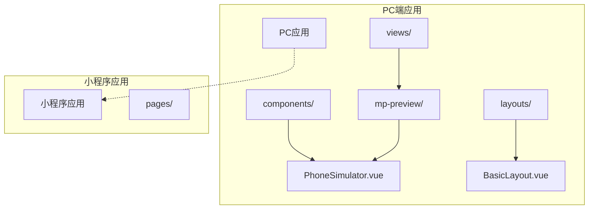
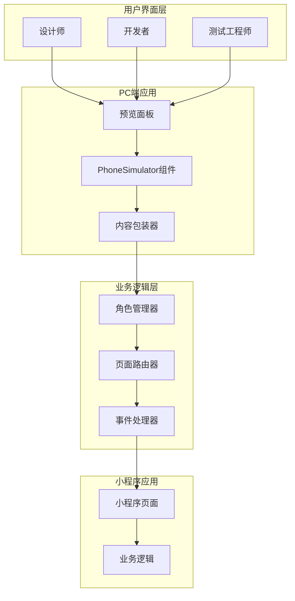
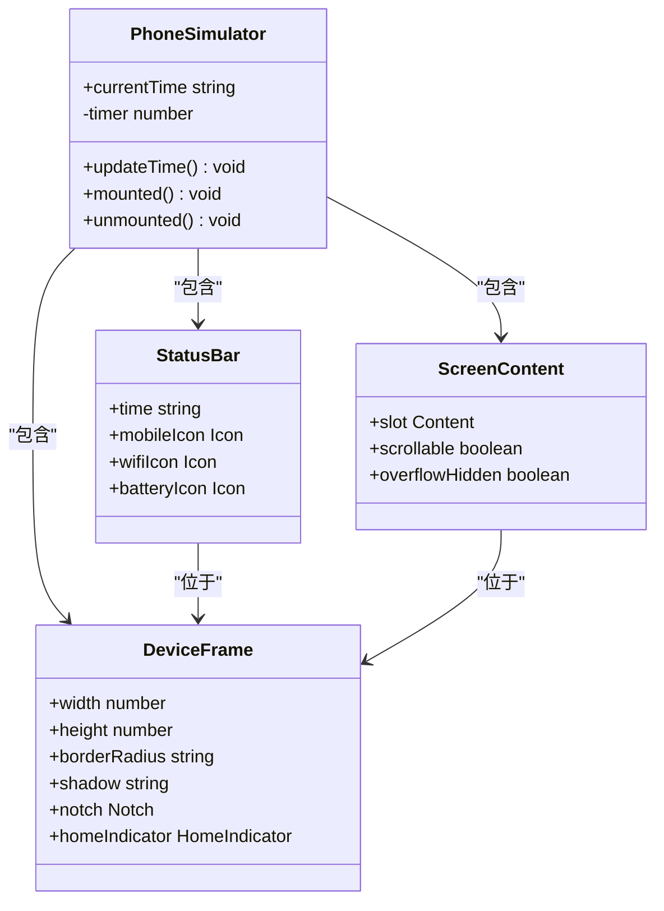
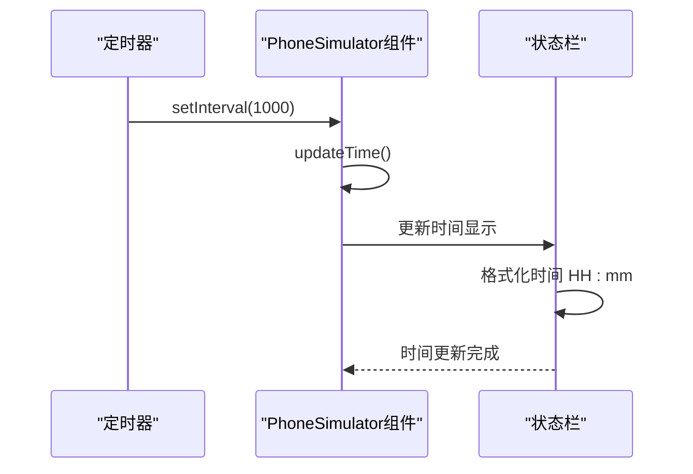
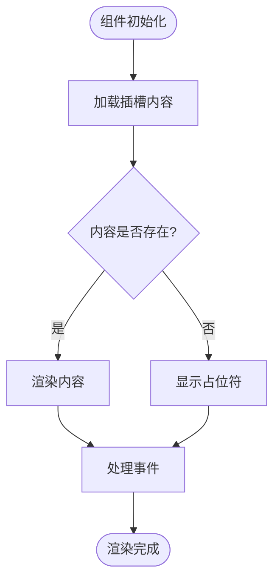
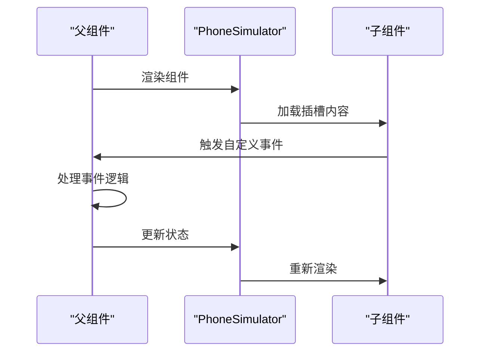
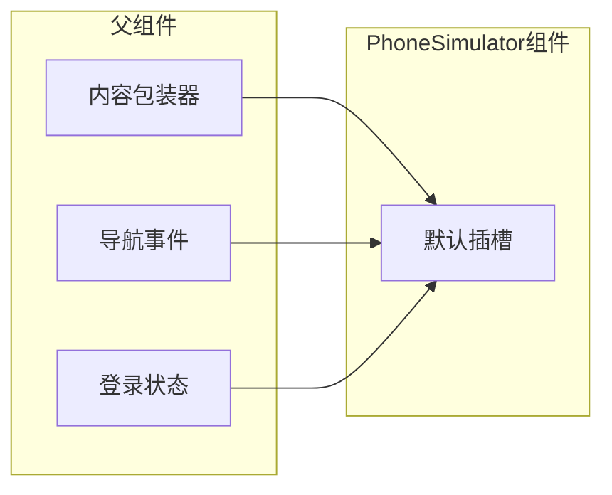
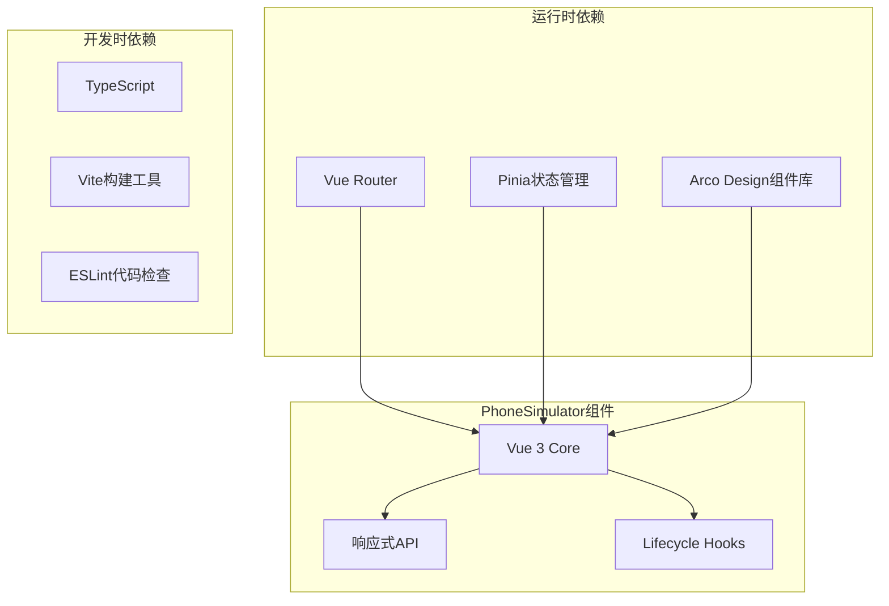
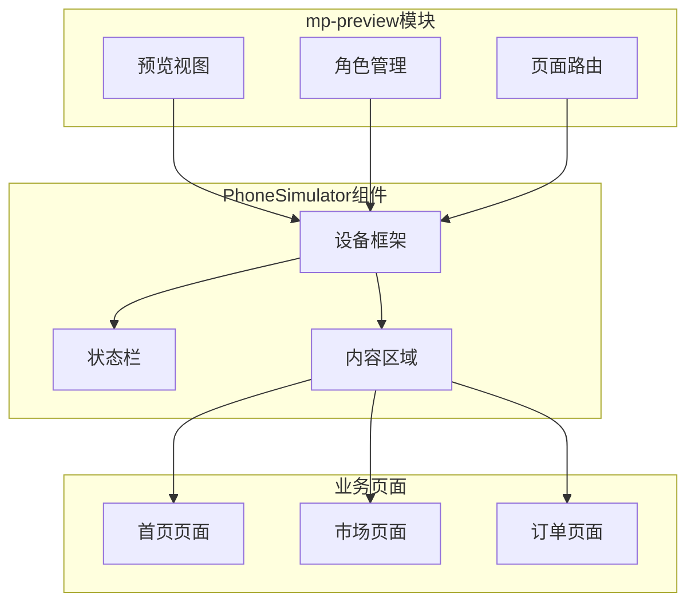
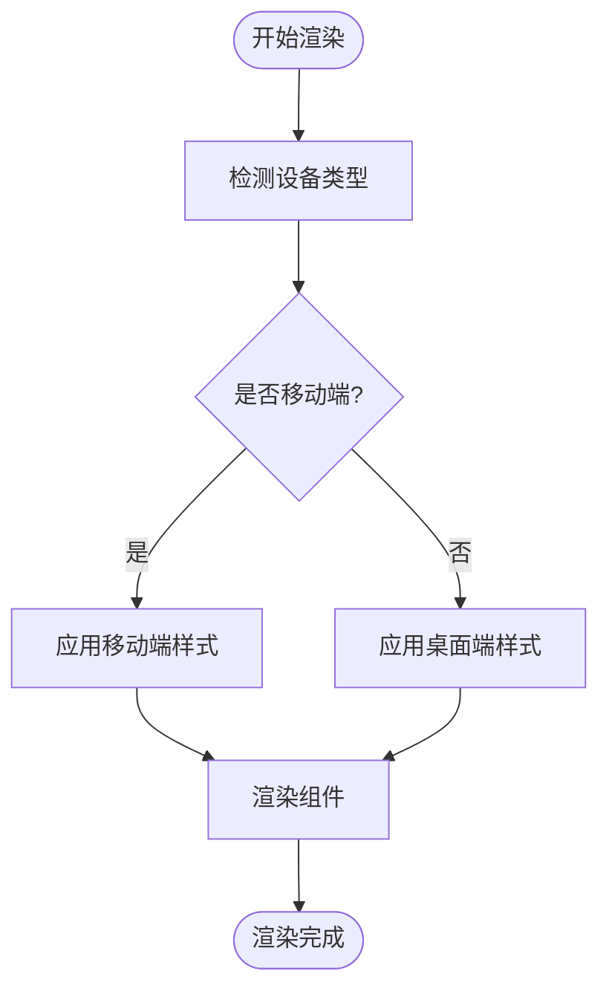

# 业务组件

<cite>
**本文档引用的文件**
- [PhoneSimulator.vue](file://apps/pc/src/components/PhoneSimulator.vue)
- [index.vue](file://apps/pc/src/views/mp-preview/index.vue)
- [index.vue](file://apps/pc/src/views/mp-preview/pages/index.vue)
- [BasicLayout.vue](file://apps/pc/src/layouts/BasicLayout.vue)
- [package.json](file://apps/pc/package.json)
- [package.json](file://package.json)
</cite>

## 目录
1. [简介](#简介)
2. [项目结构](#项目结构)
3. [核心组件](#核心组件)
4. [架构概览](#架构概览)
5. [详细组件分析](#详细组件分析)
6. [依赖分析](#依赖分析)
7. [性能考虑](#性能考虑)
8. [故障排除指南](#故障排除指南)
9. [结论](#结论)
10. [附录](#附录)

## 简介

PhoneSimulator手机模拟器组件是工程材料管理平台中的一个关键业务组件，专门用于在PC端提供移动端预览功能。该组件通过模拟真实手机设备的外观和交互体验，帮助设计师和开发者在桌面环境中高效地测试和调试小程序页面。

该组件实现了完整的手机外观渲染（包括刘海屏、状态栏、Home指示条等），提供了实时的时间显示功能，并通过插槽机制支持任意内容的嵌入展示。它在多端适配、移动端预览、开发调试等场景中发挥着重要作用。

## 项目结构

工程材料管理平台采用多应用架构，PhoneSimulator组件位于PC端应用中，作为通用组件被多个业务模块共享使用。



**图表来源**
- [PhoneSimulator.vue:1-144](file://apps/pc/src/components/PhoneSimulator.vue#L1-L144)
- [index.vue:1-200](file://apps/pc/src/views/mp-preview/index.vue#L1-L200)

**章节来源**
- [PhoneSimulator.vue:1-144](file://apps/pc/src/components/PhoneSimulator.vue#L1-L144)
- [package.json:1-36](file://apps/pc/package.json#L1-L36)

## 核心组件

PhoneSimulator组件是一个基于Vue 3 Composition API构建的响应式组件，具有以下核心特性：

### 组件架构特点
- **响应式时间显示**：自动更新的状态栏时间显示
- **完整的手机外观**：精确还原iPhone X+级别的设备外观
- **灵活的内容插槽**：支持任意Vue组件内容嵌入
- **生命周期管理**：智能的定时器管理和内存清理

### 技术栈
- Vue 3 + TypeScript
- SCSS样式预处理器
- 响应式设计原则
- 组件化开发模式

**章节来源**
- [PhoneSimulator.vue:23-47](file://apps/pc/src/components/PhoneSimulator.vue#L23-L47)

## 架构概览

PhoneSimulator组件在整个系统架构中扮演着移动端预览和调试的关键角色，连接着PC端开发环境和小程序业务逻辑。



**图表来源**
- [index.vue:310-314](file://apps/pc/src/views/mp-preview/index.vue#L310-L314)
- [PhoneSimulator.vue:1-21](file://apps/pc/src/components/PhoneSimulator.vue#L1-L21)

## 详细组件分析

### 组件结构分析

PhoneSimulator组件采用了清晰的层次结构设计，每个部分都有明确的职责分工：



**图表来源**
- [PhoneSimulator.vue:1-144](file://apps/pc/src/components/PhoneSimulator.vue#L1-L144)

### 核心功能实现

#### 时间显示系统
组件内置了实时时间更新机制，通过定时器每秒更新状态栏时间：



**图表来源**
- [PhoneSimulator.vue:28-33](file://apps/pc/src/components/PhoneSimulator.vue#L28-L33)
- [PhoneSimulator.vue:37-46](file://apps/pc/src/components/PhoneSimulator.vue#L37-L46)

#### 插槽内容系统
组件通过默认插槽支持任意内容的动态加载和渲染：



**图表来源**
- [PhoneSimulator.vue:14-16](file://apps/pc/src/components/PhoneSimulator.vue#L14-L16)

### 属性配置分析

PhoneSimulator组件目前不提供外部属性配置，但具有以下内部配置特征：

| 配置项 | 类型 | 默认值 | 描述 |
|--------|------|--------|------|
| 设备尺寸 | number | 375×812 | iPhone X+标准尺寸 |
| 边框圆角 | string | 50px | 设备边框圆角半径 |
| 内边距 | number | 12px | 设备内边距 |
| 阴影效果 | string | 多层阴影 | 设备立体感效果 |
| 状态栏高度 | number | 44px | 状态栏固定高度 |
| 内容区域 | object | flex布局 | 自适应内容区域 |

### 事件处理机制

组件通过插槽内容与父组件进行事件通信，实现了松耦合的设计模式：



**图表来源**
- [index.vue:311-313](file://apps/pc/src/views/mp-preview/index.vue#L311-L313)
- [index.vue](file://apps/pc/src/views/mp-preview/pages/index.vue#L166)

### 插槽使用方式

PhoneSimulator组件采用默认插槽设计，支持灵活的内容嵌入：



**图表来源**
- [PhoneSimulator.vue:14-16](file://apps/pc/src/components/PhoneSimulator.vue#L14-L16)

## 依赖分析

### 外部依赖关系

PhoneSimulator组件的依赖关系相对简单，主要依赖于Vue框架的核心功能：



**图表来源**
- [package.json:14-34](file://apps/pc/package.json#L14-L34)

### 内部集成关系

组件在项目中的集成关系体现了良好的模块化设计：



**图表来源**
- [index.vue:310-314](file://apps/pc/src/views/mp-preview/index.vue#L310-L314)
- [PhoneSimulator.vue:1-21](file://apps/pc/src/components/PhoneSimulator.vue#L1-L21)

**章节来源**
- [package.json:14-34](file://apps/pc/package.json#L14-L34)
- [package.json:1-23](file://package.json#L1-L23)

## 性能考虑

### 渲染性能优化

PhoneSimulator组件在设计时充分考虑了性能优化：

1. **虚拟DOM优化**：使用Vue 3的Composition API减少不必要的重渲染
2. **内存管理**：在组件卸载时自动清理定时器，防止内存泄漏
3. **样式优化**：使用CSS变量和SCSS预处理器提高样式复用性
4. **懒加载策略**：插槽内容按需加载，避免初始渲染负担

### 移动端适配策略

组件通过以下机制实现多端适配：



### 开发调试友好性

组件提供了完善的开发调试支持：

- 实时时间显示便于测试时间相关功能
- 灵活的插槽机制支持各种内容类型
- 清晰的组件边界便于单元测试
- 完整的TypeScript类型定义

## 故障排除指南

### 常见问题及解决方案

#### 时间显示异常
**问题描述**：状态栏时间不更新或显示错误
**解决方案**：
1. 检查浏览器时间同步设置
2. 验证定时器是否正常启动
3. 确认组件生命周期钩子执行情况

#### 插槽内容不显示
**问题描述**：PhoneSimulator中没有显示预期内容
**解决方案**：
1. 确认父组件正确传递插槽内容
2. 检查插槽内容组件的渲染逻辑
3. 验证事件监听器是否正确绑定

#### 样式显示异常
**问题描述**：组件外观不符合预期
**解决方案**：
1. 检查SCSS编译配置
2. 验证CSS变量定义
3. 确认浏览器兼容性

### 调试技巧

1. **控制台日志**：在关键生命周期钩子添加调试信息
2. **组件检查**：使用Vue DevTools检查组件状态
3. **网络监控**：监控插槽内容的加载情况
4. **性能分析**：使用浏览器性能工具分析渲染性能

**章节来源**
- [PhoneSimulator.vue:37-46](file://apps/pc/src/components/PhoneSimulator.vue#L37-L46)

## 结论

PhoneSimulator手机模拟器组件是工程材料管理平台中一个设计精良、功能完备的业务组件。它成功地解决了PC端移动端预览的技术难题，为设计师和开发者提供了高效的调试工具。

### 主要优势

1. **设计理念先进**：采用现代前端技术栈，符合Vue 3最佳实践
2. **用户体验优秀**：完整还原真实设备外观，提供沉浸式预览体验
3. **扩展性强**：灵活的插槽机制支持各种内容类型的嵌入
4. **维护成本低**：清晰的代码结构和完善的注释便于后续维护

### 应用价值

该组件在项目中的价值体现在：
- 显著提升开发调试效率
- 改善跨端适配开发体验
- 降低移动端测试成本
- 提高整体开发质量

## 附录

### 使用示例

#### 基本使用方式
```vue
<template>
  <PhoneSimulator>
    <YourComponent />
  </PhoneSimulator>
</template>
```

#### 在mp-preview中的集成
```vue
<template>
  <PhoneSimulator>
    <component :is="currentComponent" @navigate="handleNavigate" />
  </PhoneSimulator>
</template>
```

### 样式定制方案

组件提供了多种样式定制选项：

1. **尺寸调整**：通过修改设备框架尺寸适配不同设备
2. **主题定制**：支持深色/浅色主题切换
3. **动画效果**：可配置过渡动画和交互效果
4. **响应式适配**：支持不同屏幕尺寸的自适应

### 最佳实践建议

1. **组件复用**：在多个业务模块中统一使用该组件
2. **性能监控**：定期监控组件的渲染性能
3. **版本管理**：建立组件变更的版本控制机制
4. **文档维护**：保持组件文档与代码同步更新