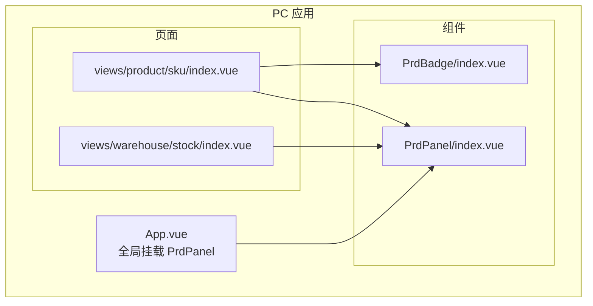
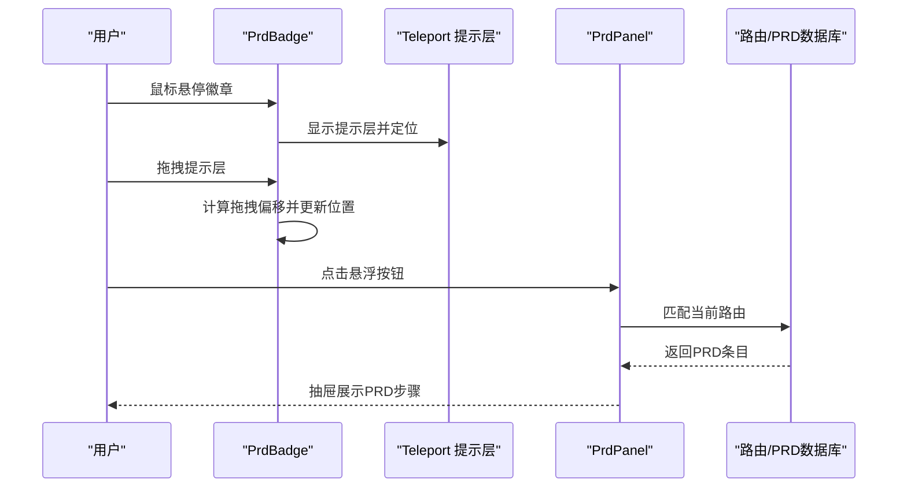
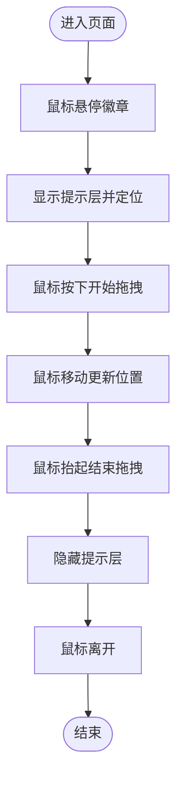
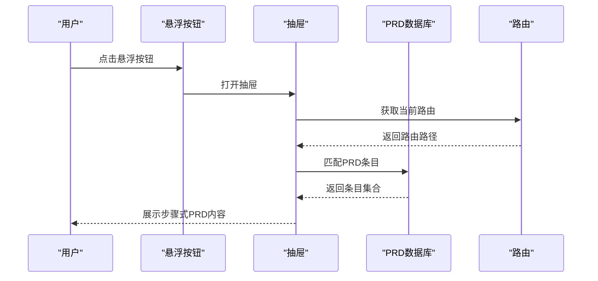
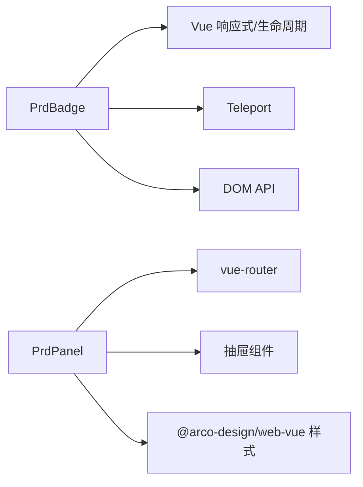

# 基础组件

<cite>
**本文引用的文件**
- [apps/pc/src/components/PrdBadge/index.vue](file://apps/pc/src/components/PrdBadge/index.vue)
- [apps/pc/src/components/PrdPanel/index.vue](file://apps/pc/src/components/PrdPanel/index.vue)
- [apps/pc/src/App.vue](file://apps/pc/src/App.vue)
- [apps/pc/src/views/product/sku/index.vue](file://apps/pc/src/views/product/sku/index.vue)
- [apps/pc/src/views/warehouse/stock/index.vue](file://apps/pc/src/views/warehouse/stock/index.vue)
- [apps/pc/src/main.ts](file://apps/pc/src/main.ts)
- [apps/pc/src/styles/common.less](file://apps/pc/src/styles/common.less)
</cite>

## 目录
1. [简介](#简介)
2. [项目结构](#项目结构)
3. [核心组件](#核心组件)
4. [架构总览](#架构总览)
5. [详细组件分析](#详细组件分析)
6. [依赖关系分析](#依赖关系分析)
7. [性能考量](#性能考量)
8. [故障排查指南](#故障排查指南)
9. [结论](#结论)
10. [附录](#附录)

## 简介
本文件聚焦于工程材料管理平台的两个基础UI组件：PrdBadge 徽章组件与 PrdPanel 面板组件。前者用于在页面中展示“需求编号”和“模块名称”，并通过气泡提示展示富文本内容；后者作为悬浮入口，打开一个抽屉式的PRD需求面板，展示当前页面对应的PRD条目。文档将从设计理念、功能特性、属性配置、事件处理、样式定制、HTML/CSS/TypeScript实现、使用示例、响应式与无障碍、性能优化等方面进行系统阐述，帮助开发者正确理解与使用这些组件。

## 项目结构
- 组件位于 PC 端应用的组件目录中，分别提供独立的 Vue 单文件组件实现。
- 全局在应用根组件中引入 PrdPanel，使其在所有页面均可访问。
- 多个业务页面通过局部引入 PrdPanel 或在页面内嵌入 PrdBadge 的方式使用组件。

图表来源
- [apps/pc/src/App.vue:1-11](file://apps/pc/src/App.vue#L1-L11)
- [apps/pc/src/components/PrdBadge/index.vue:1-303](file://apps/pc/src/components/PrdBadge/index.vue#L1-L303)
- [apps/pc/src/components/PrdPanel/index.vue:1-634](file://apps/pc/src/components/PrdPanel/index.vue#L1-L634)
- [apps/pc/src/views/product/sku/index.vue:1-800](file://apps/pc/src/views/product/sku/index.vue#L1-L800)
- [apps/pc/src/views/warehouse/stock/index.vue:1-800](file://apps/pc/src/views/warehouse/stock/index.vue#L1-L800)

章节来源
- [apps/pc/src/App.vue:1-11](file://apps/pc/src/App.vue#L1-L11)
- [apps/pc/src/main.ts:1-19](file://apps/pc/src/main.ts#L1-L19)

## 核心组件
- PrdBadge：轻量级徽章，承载需求编号与模块名称，支持鼠标悬停显示气泡提示，并可拖拽移动提示框。
- PrdPanel：悬浮入口按钮，打开抽屉式面板，展示当前页面对应的PRD条目集合，支持步骤式浏览与Markdown渲染。

章节来源
- [apps/pc/src/components/PrdBadge/index.vue:1-303](file://apps/pc/src/components/PrdBadge/index.vue#L1-L303)
- [apps/pc/src/components/PrdPanel/index.vue:1-634](file://apps/pc/src/components/PrdPanel/index.vue#L1-L634)

## 架构总览
- PrdBadge 采用 Teleport 将提示层挂载到 body，避免被父容器裁剪，同时通过计算样式控制徽章位置与提示框位置。
- PrdPanel 通过路由匹配当前页面，动态加载 PRD 数据库中的条目，使用抽屉组件展示步骤式内容。
- 全局在 App.vue 中挂载 PrdPanel，保证所有页面均具备 PRD 面板入口。

图表来源
- [apps/pc/src/components/PrdBadge/index.vue:13-31](file://apps/pc/src/components/PrdBadge/index.vue#L13-L31)
- [apps/pc/src/components/PrdBadge/index.vue:71-133](file://apps/pc/src/components/PrdBadge/index.vue#L71-L133)
- [apps/pc/src/components/PrdPanel/index.vue:8-40](file://apps/pc/src/components/PrdPanel/index.vue#L8-L40)
- [apps/pc/src/components/PrdPanel/index.vue:497-527](file://apps/pc/src/components/PrdPanel/index.vue#L497-L527)

## 详细组件分析

### PrdBadge 徽章组件
- 设计理念
  - 在页面中以“需求编号 + 模块名称”的形式标识需求来源，便于开发与评审对齐。
  - 通过气泡提示承载更丰富的 Markdown 内容，支持标题、列表、强调、代码块等。
  - 支持拖拽移动提示框，提升在复杂页面中的可用性。
- 功能特性
  - 悬停显示提示层，自动定位到徽章下方，避免遮挡。
  - 自动适配窗口边界，防止溢出。
  - 支持拖拽移动，拖拽时隐藏提示层，释放鼠标后恢复显示。
  - 内容渲染支持粗体、斜体、无序列表、换行、代码块等 Markdown 语法。
- 属性配置
  - reqId: number —— 需求编号
  - moduleName: string —— 模块名称
  - content: string —— 提示内容（支持 Markdown）
  - top?: string —— 徽章相对定位的top偏移，默认“-8px”
  - right?: string —— 徽章相对定位的right偏移，默认“-4px”
- 事件处理机制
  - 鼠标进入：显示提示层并计算定位
  - 鼠标离开：保持提示层状态（拖拽时除外）
  - 鼠标按下：开始拖拽，记录偏移
  - 鼠标移动：根据偏移更新提示层位置
  - 鼠标抬起：结束拖拽，移除事件监听
  - 组件卸载：清理事件监听，避免内存泄漏
- 样式定制
  - 徽章采用渐变背景与阴影，hover 时缩放增强视觉反馈。
  - 提示层采用固定定位，支持拖拽移动，内部使用深度选择器适配 Markdown 渲染。
  - 提示层头部包含需求编号、标题与关闭按钮，内容区域支持滚动。
- HTML 结构与 CSS
  - 容器包含徽章与 Teleport 提示层，提示层包含头部、分割线与内容区。
  - 使用 Less 编写样式，支持深选择器覆盖第三方组件样式。
- TypeScript 实现要点
  - 使用响应式 ref/computed 管理可见性、位置与样式。
  - 使用生命周期钩子在卸载时清理事件。
  - 使用 nextTick 确保 DOM 更新后再计算定位。
- 使用示例
  - 在任意页面中引入 PrdBadge，传入 reqId、moduleName、content 等属性即可。
  - 示例路径参考：[apps/pc/src/views/product/sku/index.vue:257-481](file://apps/pc/src/views/product/sku/index.vue#L257-L481)

图表来源
- [apps/pc/src/components/PrdBadge/index.vue:71-133](file://apps/pc/src/components/PrdBadge/index.vue#L71-L133)

章节来源
- [apps/pc/src/components/PrdBadge/index.vue:1-303](file://apps/pc/src/components/PrdBadge/index.vue#L1-L303)
- [apps/pc/src/views/product/sku/index.vue:257-481](file://apps/pc/src/views/product/sku/index.vue#L257-L481)

### PrdPanel 面板组件
- 设计理念
  - 以悬浮按钮形式提供“打开PRD”入口，避免占用主内容区域。
  - 抽屉式展示当前页面的PRD条目，使用步骤组件组织内容，便于阅读与导航。
  - 内置 PRD 数据库，按路由路径匹配页面对应的条目集合。
- 功能特性
  - 悬浮按钮带提示文字与阴影，hover 时显示“打开PRD”提示。
  - 抽屉宽度固定，展示 PRD 步骤与内容卡片，支持空状态占位。
  - 内容采用 Markdown 渲染，保留代码块与列表等格式。
- 属性配置
  - 本组件在当前仓库中未定义外部 props；其内容由内部 PRD 数据库与路由匹配决定。
- 事件处理机制
  - 点击悬浮按钮：打开抽屉
  - 路由变化：重新匹配当前页面 PRD 条目
- 样式定制
  - 悬浮按钮采用圆形、阴影与过渡动画，提示文字通过伪元素箭头增强指向性。
  - 抽屉内容区域使用步骤与卡片组件，Markdown 内容使用等宽字体与滚动条。
- HTML 结构与 CSS
  - 容器包含悬浮按钮与抽屉；抽屉内包含空状态与步骤列表，步骤描述中嵌入卡片与预格式文本。
- TypeScript 实现要点
  - 使用路由对象获取当前路径，清洗路径后与 PRD 数据库匹配。
  - 使用计算属性缓存当前页面名称与条目列表，避免重复匹配。
  - 使用抽屉组件展示内容，支持空状态与步骤式布局。
- 使用示例
  - 全局引入：在 App.vue 中挂载 PrdPanel
  - 局部引入：在业务页面中直接使用 PrdPanel
  - 示例路径参考：
    - 全局挂载：[apps/pc/src/App.vue:1-11](file://apps/pc/src/App.vue#L1-L11)
    - 局部使用（示例之一）：[apps/pc/src/views/warehouse/stock/index.vue:1-402](file://apps/pc/src/views/warehouse/stock/index.vue#L1-L402)

图表来源
- [apps/pc/src/components/PrdPanel/index.vue:8-40](file://apps/pc/src/components/PrdPanel/index.vue#L8-L40)
- [apps/pc/src/components/PrdPanel/index.vue:497-527](file://apps/pc/src/components/PrdPanel/index.vue#L497-L527)

章节来源
- [apps/pc/src/components/PrdPanel/index.vue:1-634](file://apps/pc/src/components/PrdPanel/index.vue#L1-L634)
- [apps/pc/src/App.vue:1-11](file://apps/pc/src/App.vue#L1-L11)
- [apps/pc/src/views/warehouse/stock/index.vue:1-402](file://apps/pc/src/views/warehouse/stock/index.vue#L1-L402)

## 依赖关系分析
- PrdBadge
  - 依赖 Vue 响应式系统（ref/computed/lifecycle）
  - 依赖 Teleport 将提示层挂载到 body
  - 依赖浏览器 DOM API 计算位置与事件监听
- PrdPanel
  - 依赖 vue-router 获取当前路由
  - 依赖抽屉组件展示内容
  - 依赖第三方 UI 组件库样式（Arco Design）

图表来源
- [apps/pc/src/components/PrdBadge/index.vue:34-134](file://apps/pc/src/components/PrdBadge/index.vue#L34-L134)
- [apps/pc/src/components/PrdPanel/index.vue:43-528](file://apps/pc/src/components/PrdPanel/index.vue#L43-L528)
- [apps/pc/src/main.ts:1-19](file://apps/pc/src/main.ts#L1-L19)

章节来源
- [apps/pc/src/components/PrdBadge/index.vue:34-134](file://apps/pc/src/components/PrdBadge/index.vue#L34-L134)
- [apps/pc/src/components/PrdPanel/index.vue:43-528](file://apps/pc/src/components/PrdPanel/index.vue#L43-L528)
- [apps/pc/src/main.ts:1-19](file://apps/pc/src/main.ts#L1-L19)

## 性能考量
- PrdBadge
  - 仅在悬停时计算定位，避免频繁布局重排
  - 拖拽时隐藏提示层，减少不必要的 DOM 更新
  - 使用 nextTick 确保 DOM 更新后再计算位置
  - 卸载时清理事件监听，避免内存泄漏
- PrdPanel
  - 路由变化时才重新匹配 PRD 条目，避免每次渲染重复计算
  - 抽屉内容使用滚动区域，避免一次性渲染过多节点
  - Markdown 渲染采用预格式文本与等宽字体，减少样式计算开销
- 通用建议
  - 避免在高频事件中进行昂贵的 DOM 查询
  - 合理使用深度选择器，避免样式穿透导致的性能问题
  - 在移动端测试拖拽与滚动的流畅性

[本节为通用性能指导，无需特定文件引用]

## 故障排查指南
- 提示层位置异常
  - 检查徽章的 top/right 偏移是否与父容器定位冲突
  - 确认 Teleport 是否正确挂载到 body
- 提示层被遮挡或溢出
  - 确认窗口尺寸变化时是否重新计算位置
  - 检查 z-index 是否足够高
- 拖拽无效
  - 确认鼠标按下时是否正确记录偏移
  - 检查鼠标抬起事件是否移除
- PRD 面板未显示内容
  - 检查路由路径是否与 PRD 数据库键匹配
  - 确认页面是否正确引入组件或全局挂载
- 样式不生效
  - 检查 scoped 样式与深度选择器的使用
  - 确认第三方组件库样式是否被覆盖

章节来源
- [apps/pc/src/components/PrdBadge/index.vue:71-133](file://apps/pc/src/components/PrdBadge/index.vue#L71-L133)
- [apps/pc/src/components/PrdPanel/index.vue:497-527](file://apps/pc/src/components/PrdPanel/index.vue#L497-L527)

## 结论
PrdBadge 与 PrdPanel 作为工程材料管理平台的基础组件，分别承担“需求标识 + 悬浮提示”和“PRD入口 + 步骤化展示”的职责。它们通过简洁的 API、良好的可定制性与合理的性能设计，为开发与评审提供了高效、直观的信息通道。建议在新页面中优先引入 PrdPanel，配合 PrdBadge 在关键位置标注需求来源，以提升团队协作效率与文档一致性。

[本节为总结性内容，无需特定文件引用]

## 附录
- 使用示例路径
  - 全局挂载 PrdPanel：[apps/pc/src/App.vue:1-11](file://apps/pc/src/App.vue#L1-L11)
  - 局部使用 PrdPanel：[apps/pc/src/views/warehouse/stock/index.vue:1-402](file://apps/pc/src/views/warehouse/stock/index.vue#L1-L402)
  - 局部使用 PrdBadge：[apps/pc/src/views/product/sku/index.vue:257-481](file://apps/pc/src/views/product/sku/index.vue#L257-L481)
- 样式参考
  - 通用样式类：[apps/pc/src/styles/common.less:1-79](file://apps/pc/src/styles/common.less#L1-L79)
- 依赖注入
  - 应用初始化：[apps/pc/src/main.ts:1-19](file://apps/pc/src/main.ts#L1-L19)