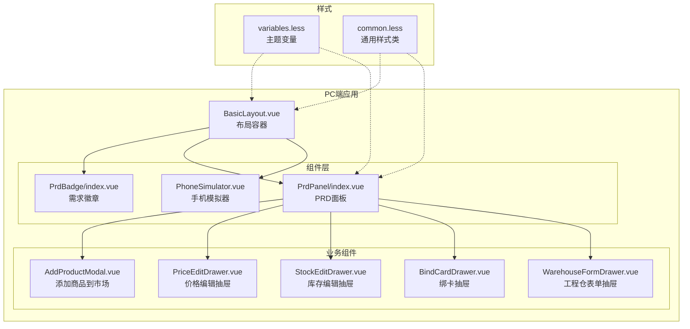
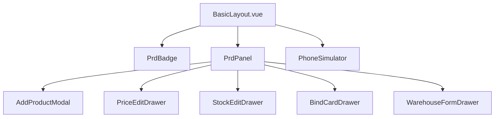
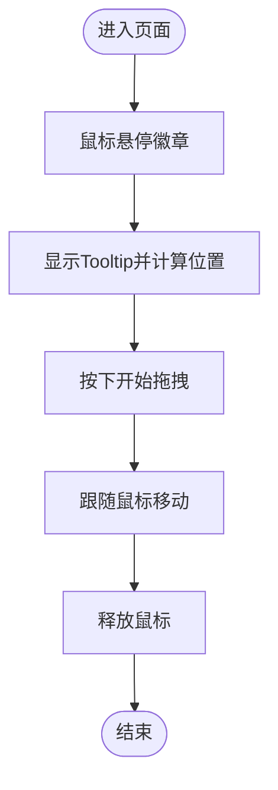
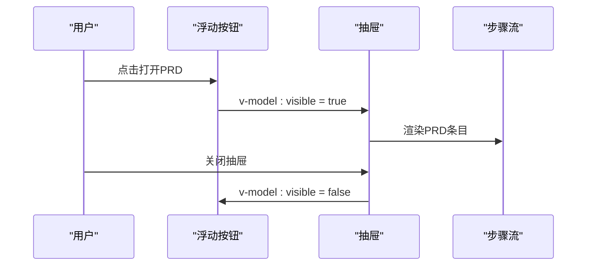
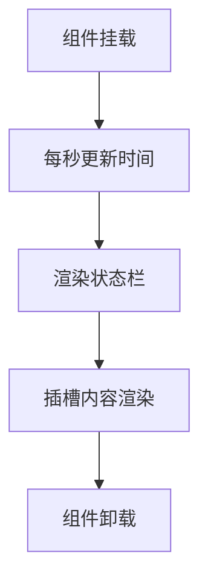
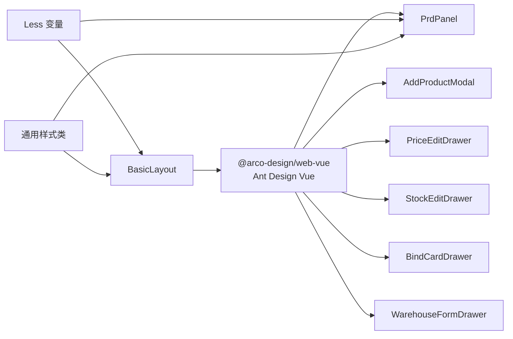

# 组件库文档

<cite>
**本文引用的文件**
- [apps/pc/src/components/PrdBadge/index.vue](file://apps/pc/src/components/PrdBadge/index.vue)
- [apps/pc/src/components/PrdPanel/index.vue](file://apps/pc/src/components/PrdPanel/index.vue)
- [apps/pc/src/components/PhoneSimulator.vue](file://apps/pc/src/components/PhoneSimulator.vue)
- [apps/pc/src/views/construction/market/components/AddProductModal.vue](file://apps/pc/src/views/construction/market/components/AddProductModal.vue)
- [apps/pc/src/views/construction/market/components/PriceEditDrawer.vue](file://apps/pc/src/views/construction/market/components/PriceEditDrawer.vue)
- [apps/pc/src/views/construction/market/components/StockEditDrawer.vue](file://apps/pc/src/views/construction/market/components/StockEditDrawer.vue)
- [apps/pc/src/views/finance/custody/components/BindCardDrawer.vue](file://apps/pc/src/views/finance/custody/components/BindCardDrawer.vue)
- [apps/pc/src/views/construction/list/components/WarehouseFormDrawer.vue](file://apps/pc/src/views/construction/list/components/WarehouseFormDrawer.vue)
- [apps/pc/src/layouts/BasicLayout.vue](file://apps/pc/src/layouts/BasicLayout.vue)
- [apps/pc/src/styles/variables.less](file://apps/pc/src/styles/variables.less)
- [apps/pc/src/styles/common.less](file://apps/pc/src/styles/common.less)
</cite>

## 目录
1. [简介](#简介)
2. [项目结构](#项目结构)
3. [核心组件](#核心组件)
4. [架构总览](#架构总览)
5. [组件详解](#组件详解)
6. [依赖关系分析](#依赖关系分析)
7. [性能与可用性](#性能与可用性)
8. [故障排查指南](#故障排查指南)
9. [结论](#结论)
10. [附录](#附录)

## 简介
本组件库面向“工程材料管理平台”的PC端与多端应用，提供基础UI组件与业务组件，覆盖产品需求展示、移动端预览、工程仓市场与库存管理、资金托管绑卡等典型业务场景。文档聚焦以下目标：
- 基础组件：按钮、输入框、表格、表单等的属性、事件、插槽与样式定制
- 业务组件：商品卡片、订单状态、库存状态等的使用方法与最佳实践
- 响应式与无障碍：适配不同屏幕与辅助技术
- 开发规范：命名约定、主题定制、扩展指南

## 项目结构
组件库主要分布在 PC 端应用的 components、views 与 layouts 目录，并辅以全局样式变量与通用样式类。

图表来源
- [apps/pc/src/layouts/BasicLayout.vue:1-349](file://apps/pc/src/layouts/BasicLayout.vue#L1-L349)
- [apps/pc/src/components/PrdBadge/index.vue:1-303](file://apps/pc/src/components/PrdBadge/index.vue#L1-L303)
- [apps/pc/src/components/PrdPanel/index.vue:1-634](file://apps/pc/src/components/PrdPanel/index.vue#L1-L634)
- [apps/pc/src/components/PhoneSimulator.vue:1-144](file://apps/pc/src/components/PhoneSimulator.vue#L1-L144)
- [apps/pc/src/views/construction/market/components/AddProductModal.vue:1-85](file://apps/pc/src/views/construction/market/components/AddProductModal.vue#L1-L85)
- [apps/pc/src/views/construction/market/components/PriceEditDrawer.vue:1-78](file://apps/pc/src/views/construction/market/components/PriceEditDrawer.vue#L1-L78)
- [apps/pc/src/views/construction/market/components/StockEditDrawer.vue:1-92](file://apps/pc/src/views/construction/market/components/StockEditDrawer.vue#L1-L92)
- [apps/pc/src/views/finance/custody/components/BindCardDrawer.vue:1-165](file://apps/pc/src/views/finance/custody/components/BindCardDrawer.vue#L1-L165)
- [apps/pc/src/views/construction/list/components/WarehouseFormDrawer.vue:1-126](file://apps/pc/src/views/construction/list/components/WarehouseFormDrawer.vue#L1-L126)
- [apps/pc/src/styles/variables.less:1-17](file://apps/pc/src/styles/variables.less#L1-L17)
- [apps/pc/src/styles/common.less:1-79](file://apps/pc/src/styles/common.less#L1-L79)

章节来源
- [apps/pc/src/layouts/BasicLayout.vue:1-349](file://apps/pc/src/layouts/BasicLayout.vue#L1-L349)
- [apps/pc/src/styles/variables.less:1-17](file://apps/pc/src/styles/variables.less#L1-L17)
- [apps/pc/src/styles/common.less:1-79](file://apps/pc/src/styles/common.less#L1-L79)

## 核心组件
- 布局容器：BasicLayout 提供侧边栏、面包屑、头部工具条与内容区域，支撑页面骨架与导航。
- PRD 展示：PrdPanel 将 PRD 内容以步骤流形式展示；PrdBadge 用于悬浮需求提示气泡。
- 移动端预览：PhoneSimulator 提供 iPhone X 风格的手机壳容器，便于在桌面端预览移动端页面。
- 业务抽屉/模态：AddProductModal、PriceEditDrawer、StockEditDrawer、BindCardDrawer、WarehouseFormDrawer 等，封装常用业务交互。

章节来源
- [apps/pc/src/layouts/BasicLayout.vue:1-349](file://apps/pc/src/layouts/BasicLayout.vue#L1-L349)
- [apps/pc/src/components/PrdBadge/index.vue:1-303](file://apps/pc/src/components/PrdBadge/index.vue#L1-L303)
- [apps/pc/src/components/PrdPanel/index.vue:1-634](file://apps/pc/src/components/PrdPanel/index.vue#L1-L634)
- [apps/pc/src/components/PhoneSimulator.vue:1-144](file://apps/pc/src/components/PhoneSimulator.vue#L1-L144)

## 架构总览
组件库采用“布局 + 业务组件 + 样式变量”的分层组织，业务组件通过 Ant Design Vue 的组件（如 Drawer、Modal、Form、Steps 等）组合实现，统一使用 Less 变量与通用样式类进行主题与排版控制。

图表来源
- [apps/pc/src/layouts/BasicLayout.vue:1-349](file://apps/pc/src/layouts/BasicLayout.vue#L1-L349)
- [apps/pc/src/components/PrdBadge/index.vue:1-303](file://apps/pc/src/components/PrdBadge/index.vue#L1-L303)
- [apps/pc/src/components/PrdPanel/index.vue:1-634](file://apps/pc/src/components/PrdPanel/index.vue#L1-L634)
- [apps/pc/src/components/PhoneSimulator.vue:1-144](file://apps/pc/src/components/PhoneSimulator.vue#L1-L144)
- [apps/pc/src/views/construction/market/components/AddProductModal.vue:1-85](file://apps/pc/src/views/construction/market/components/AddProductModal.vue#L1-L85)
- [apps/pc/src/views/construction/market/components/PriceEditDrawer.vue:1-78](file://apps/pc/src/views/construction/market/components/PriceEditDrawer.vue#L1-L78)
- [apps/pc/src/views/construction/market/components/StockEditDrawer.vue:1-92](file://apps/pc/src/views/construction/market/components/StockEditDrawer.vue#L1-L92)
- [apps/pc/src/views/finance/custody/components/BindCardDrawer.vue:1-165](file://apps/pc/src/views/finance/custody/components/BindCardDrawer.vue#L1-L165)
- [apps/pc/src/views/construction/list/components/WarehouseFormDrawer.vue:1-126](file://apps/pc/src/views/construction/list/components/WarehouseFormDrawer.vue#L1-L126)

## 组件详解

### PrdBadge（需求徽章）
- 设计理念：在页面关键元素旁展示需求编号与标题，支持拖拽移动与关闭，避免遮挡主内容。
- 关键属性
  - reqId：需求编号
  - moduleName：模块名称
  - content：富文本内容（支持加粗、斜体、列表、换行渲染）
  - top/right：徽章定位偏移
- 交互行为
  - 鼠标悬停显示 Tooltip
  - 拖拽移动 Tooltip 位置
  - 点击关闭按钮隐藏
- 样式定制
  - 徽章与 Tooltip 使用 Less 变量控制颜色与阴影
  - 支持通过容器样式覆盖定位

图表来源
- [apps/pc/src/components/PrdBadge/index.vue:71-133](file://apps/pc/src/components/PrdBadge/index.vue#L71-L133)

章节来源
- [apps/pc/src/components/PrdBadge/index.vue:1-303](file://apps/pc/src/components/PrdBadge/index.vue#L1-L303)

### PrdPanel（PRD 面板）
- 设计理念：将页面对应的 PRD 文档以步骤流形式集中展示，浮动按钮一键打开，适合开发前阅读与核对。
- 数据源
  - 通过路由路径匹配 PRD 条目集合，支持多页面映射
  - Markdown 内容经预格式化展示于卡片中
- 关键属性
  - 无显式 props，依赖路由与内置数据库
- 交互行为
  - 点击浮动按钮打开抽屉
  - 抽屉内使用 Steps + Card 呈现 PRD 条目
- 使用建议
  - 在各业务页面引入，确保路由路径与 PRD 映射一致
  - 如需扩展 PRD，向数据库追加条目

图表来源
- [apps/pc/src/components/PrdPanel/index.vue:1-634](file://apps/pc/src/components/PrdPanel/index.vue#L1-L634)

章节来源
- [apps/pc/src/components/PrdPanel/index.vue:1-634](file://apps/pc/src/components/PrdPanel/index.vue#L1-L634)

### PhoneSimulator（手机模拟器）
- 设计理念：提供 iPhone X 风格的手机壳容器，内置状态栏与 Home Indicator，便于在桌面端预览移动端页面。
- 插槽
  - 默认插槽：承载被模拟的页面内容
- 行为特性
  - 实时时钟更新
  - 滚动区域禁用滚动条
- 样式定制
  - 支持通过外部容器控制尺寸与阴影

图表来源
- [apps/pc/src/components/PhoneSimulator.vue:23-46](file://apps/pc/src/components/PhoneSimulator.vue#L23-L46)

章节来源
- [apps/pc/src/components/PhoneSimulator.vue:1-144](file://apps/pc/src/components/PhoneSimulator.vue#L1-L144)

### AddProductModal（添加商品到工程仓市场）
- 用途：在工程仓市场中批量选择商品并绑定到指定工程仓。
- 关键属性
  - visible：是否显示
  - warehouses：工程仓列表
- 事件
  - update:visible：控制显隐
  - success：提交成功回调
- 表单字段
  - warehouseId：目标工程仓
  - productIds：所选商品 ID 列表（使用 Transfer 组件）
- 最佳实践
  - 打开时重置表单
  - 提交前校验必填项

章节来源
- [apps/pc/src/views/construction/market/components/AddProductModal.vue:1-85](file://apps/pc/src/views/construction/market/components/AddProductModal.vue#L1-L85)

### PriceEditDrawer（价格编辑抽屉）
- 用途：对商品销售价进行调整。
- 关键属性
  - visible：是否显示
  - product：当前商品对象（含 productName、spec、salePrice）
- 事件
  - update:visible：控制显隐
  - success：提交成功回调
- 表单字段
  - salePrice：新价格（数值输入，精度两位）

章节来源
- [apps/pc/src/views/construction/market/components/PriceEditDrawer.vue:1-78](file://apps/pc/src/views/construction/market/components/PriceEditDrawer.vue#L1-L78)

### StockEditDrawer（库存编辑抽屉）
- 用途：对商品库存进行出入库调整。
- 关键属性
  - visible：是否显示
  - product：当前商品对象（含 productName、spec、stock）
- 事件
  - update:visible：控制显隐
  - success：提交成功回调
- 表单字段
  - type：in（入库）/ out（出库）
  - quantity：数量（正整数）
  - remark：备注（最大长度 200）

章节来源
- [apps/pc/src/views/construction/market/components/StockEditDrawer.vue:1-92](file://apps/pc/src/views/construction/market/components/StockEditDrawer.vue#L1-L92)

### BindCardDrawer（绑卡抽屉）
- 用途：为资金托管绑定或重新绑定银行卡账户。
- 关键属性
  - visible：是否显示
  - cardId：绑卡记录 ID（存在则为重新绑卡）
  - tenantId：商户 ID（传入后可禁用选择）
- 事件
  - update:visible：控制显隐
  - success：提交成功回调
- 表单字段
  - tenantId、bankName、bankCode、bankBranch、bankAccount、accountName、cardType
- 行为特性
  - 加载商户列表
  - 显示加载状态与错误提示
  - 提交前校验表单

章节来源
- [apps/pc/src/views/finance/custody/components/BindCardDrawer.vue:1-165](file://apps/pc/src/views/finance/custody/components/BindCardDrawer.vue#L1-L165)

### WarehouseFormDrawer（工程仓表单抽屉）
- 用途：新增或编辑工程仓信息。
- 关键属性
  - visible：是否显示
  - warehouse：工程仓对象（编辑模式时传入）
- 事件
  - update:visible：控制显隐
  - success：提交成功回调
- 表单字段
  - code、name、contact、phone、province、city、district、address、status
- 校验规则
  - 编码、名称、联系人、电话为必填

章节来源
- [apps/pc/src/views/construction/list/components/WarehouseFormDrawer.vue:1-126](file://apps/pc/src/views/construction/list/components/WarehouseFormDrawer.vue#L1-L126)

### 基础组件与通用能力
- 表单与校验：各业务组件普遍使用 Ant Design Vue 的 Form/FormItem 与校验规则，结合 ref.validate() 进行提交前校验。
- 抽屉与模态：Drawer/Modal 统一使用 v-model:visible 控制显隐，@ok/@cancel/@cancel 事件驱动提交与关闭。
- 样式与主题：通过 Less 变量（如 --primary-color、--background-color）与通用类（如 .page-container、.card-container）实现主题一致性与布局规范。

章节来源
- [apps/pc/src/views/construction/market/components/PriceEditDrawer.vue:1-78](file://apps/pc/src/views/construction/market/components/PriceEditDrawer.vue#L1-L78)
- [apps/pc/src/views/construction/market/components/StockEditDrawer.vue:1-92](file://apps/pc/src/views/construction/market/components/StockEditDrawer.vue#L1-L92)
- [apps/pc/src/views/finance/custody/components/BindCardDrawer.vue:1-165](file://apps/pc/src/views/finance/custody/components/BindCardDrawer.vue#L1-L165)
- [apps/pc/src/views/construction/list/components/WarehouseFormDrawer.vue:1-126](file://apps/pc/src/views/construction/list/components/WarehouseFormDrawer.vue#L1-L126)
- [apps/pc/src/styles/variables.less:1-17](file://apps/pc/src/styles/variables.less#L1-L17)
- [apps/pc/src/styles/common.less:1-79](file://apps/pc/src/styles/common.less#L1-L79)

## 依赖关系分析
- 组件间依赖
  - PrdPanel 依赖路由与内置 PRD 数据库，渲染 PrdBadge/Tooltip
  - 业务抽屉/模态依赖 Ant Design Vue 组件（Drawer、Modal、Form、Radio、Input、Select、Transfer 等）
  - 布局组件 BasicLayout 依赖路由与状态管理，提供面包屑、菜单与头部工具
- 外部依赖
  - Ant Design Vue：提供表单、布局、反馈等基础 UI 能力
  - Less：提供变量与混入，统一主题与样式

图表来源
- [apps/pc/src/components/PrdPanel/index.vue:1-634](file://apps/pc/src/components/PrdPanel/index.vue#L1-L634)
- [apps/pc/src/views/construction/market/components/AddProductModal.vue:1-85](file://apps/pc/src/views/construction/market/components/AddProductModal.vue#L1-L85)
- [apps/pc/src/views/construction/market/components/PriceEditDrawer.vue:1-78](file://apps/pc/src/views/construction/market/components/PriceEditDrawer.vue#L1-L78)
- [apps/pc/src/views/construction/market/components/StockEditDrawer.vue:1-92](file://apps/pc/src/views/construction/market/components/StockEditDrawer.vue#L1-L92)
- [apps/pc/src/views/finance/custody/components/BindCardDrawer.vue:1-165](file://apps/pc/src/views/finance/custody/components/BindCardDrawer.vue#L1-L165)
- [apps/pc/src/views/construction/list/components/WarehouseFormDrawer.vue:1-126](file://apps/pc/src/views/construction/list/components/WarehouseFormDrawer.vue#L1-L126)
- [apps/pc/src/layouts/BasicLayout.vue:1-349](file://apps/pc/src/layouts/BasicLayout.vue#L1-L349)
- [apps/pc/src/styles/variables.less:1-17](file://apps/pc/src/styles/variables.less#L1-L17)
- [apps/pc/src/styles/common.less:1-79](file://apps/pc/src/styles/common.less#L1-L79)

章节来源
- [apps/pc/src/layouts/BasicLayout.vue:1-349](file://apps/pc/src/layouts/BasicLayout.vue#L1-L349)
- [apps/pc/src/styles/variables.less:1-17](file://apps/pc/src/styles/variables.less#L1-L17)
- [apps/pc/src/styles/common.less:1-79](file://apps/pc/src/styles/common.less#L1-L79)

## 性能与可用性
- 性能
  - 抽屉/模态按需渲染，避免常驻 DOM
  - Tooltip 使用 Teleport 渲染至 body，减少层级嵌套带来的重绘
  - 表单校验在提交时触发，避免频繁验证
- 可用性
  - 交互反馈：提交状态 loading、成功/失败提示
  - 表单必填项与长度限制，提升输入体验
  - 抽屉宽度与内容滚动优化，保证信息可读性

## 故障排查指南
- 表单无法提交
  - 检查是否调用 ref.validate() 并捕获异常
  - 确认必填字段与规则配置
- 抽屉/模态无法关闭
  - 确认 v-model:visible 与 @cancel/@ok 事件绑定
  - 检查 unmount-on-close 或显式 emit('update:visible', false)
- PRD 面板无内容
  - 检查路由路径与 PRD 映射是否匹配
  - 确认 PRD 数据库中是否存在对应条目
- 样式异常
  - 检查 Less 变量是否正确导入
  - 确认通用样式类是否被覆盖

章节来源
- [apps/pc/src/views/finance/custody/components/BindCardDrawer.vue:137-155](file://apps/pc/src/views/finance/custody/components/BindCardDrawer.vue#L137-L155)
- [apps/pc/src/views/construction/list/components/WarehouseFormDrawer.vue:117-124](file://apps/pc/src/views/construction/list/components/WarehouseFormDrawer.vue#L117-L124)
- [apps/pc/src/components/PrdPanel/index.vue:497-523](file://apps/pc/src/components/PrdPanel/index.vue#L497-L523)
- [apps/pc/src/styles/variables.less:1-17](file://apps/pc/src/styles/variables.less#L1-L17)

## 结论
本组件库以布局与业务组件为核心，结合 Ant Design Vue 的成熟生态与 Less 主题体系，形成了一套可复用、可扩展且易于维护的 UI 能力。通过 PRD 面板与需求徽章强化开发协作，通过多种抽屉/模态覆盖典型业务流程，满足工程材料管理平台在多端场景下的使用需求。

## 附录

### 组件开发规范与命名约定
- 文件命名
  - 组件文件夹采用 PascalCase（如 PrdBadge、PrdPanel）
  - 组件文件统一使用 index.vue
- 属性与事件
  - 使用语义化命名，如 visible、warehouseId、product
  - 事件统一使用 update:xxx 与业务事件 success
- 样式
  - 使用 Less 变量控制主题色与间距
  - 通用样式类用于页面容器与卡片等基础布局

### 主题定制指南
- 变量覆盖
  - 在 :root 中修改 --primary-color、--background-color 等变量
- 组件样式
  - 通过 scoped 样式覆盖组件内部样式
  - 使用 :deep 选择器穿透第三方组件样式

章节来源
- [apps/pc/src/styles/variables.less:1-17](file://apps/pc/src/styles/variables.less#L1-L17)
- [apps/pc/src/styles/common.less:1-79](file://apps/pc/src/styles/common.less#L1-L79)