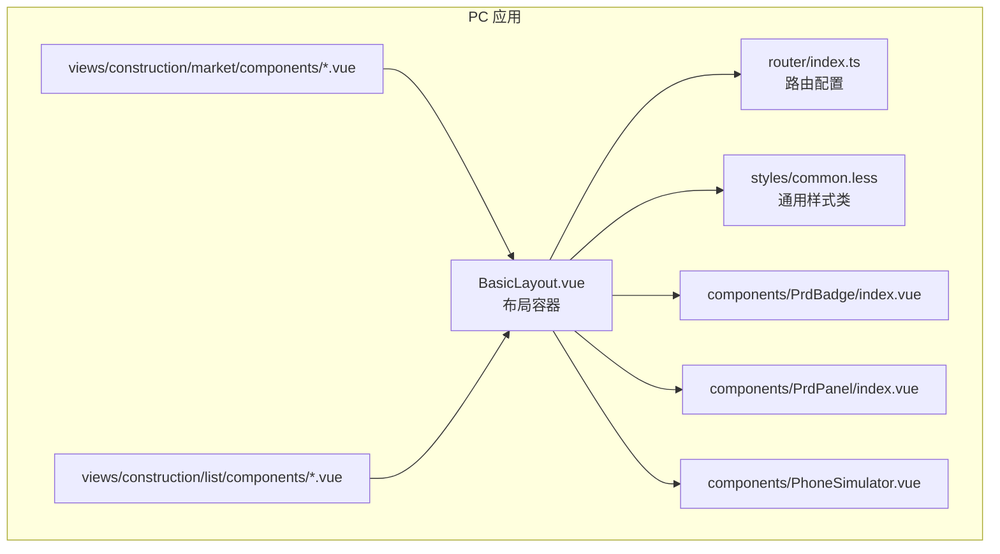
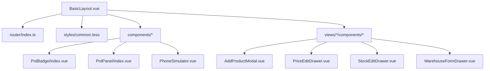
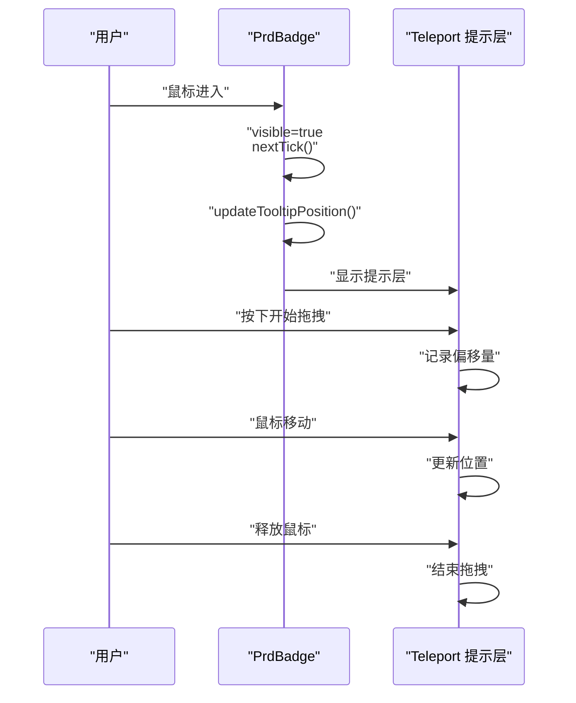
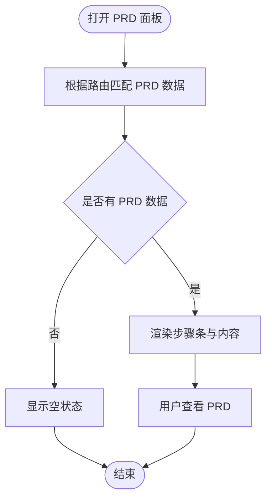
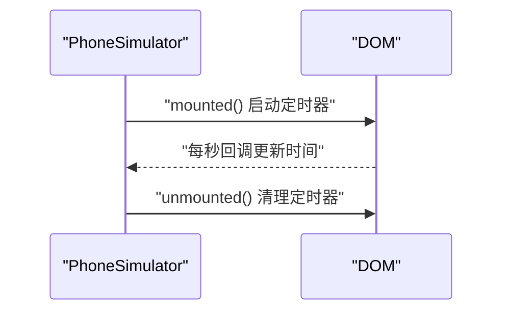
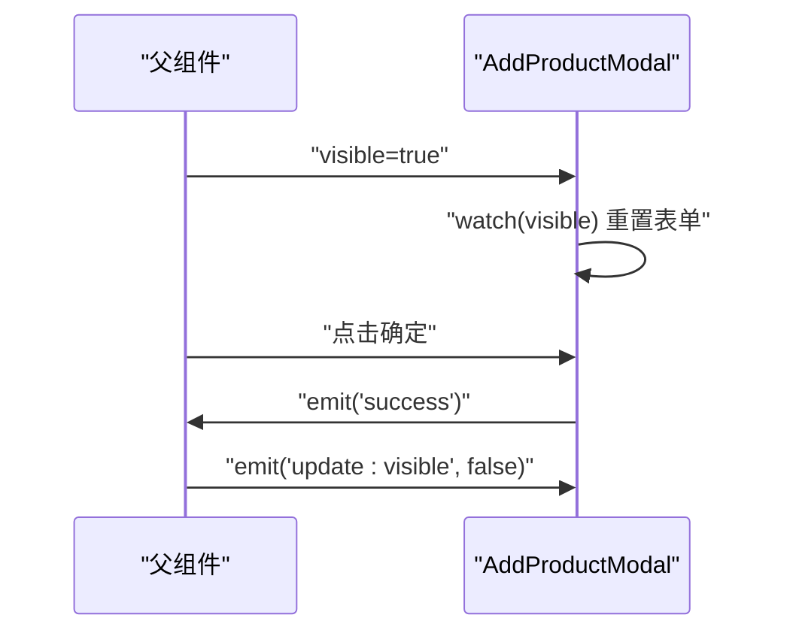
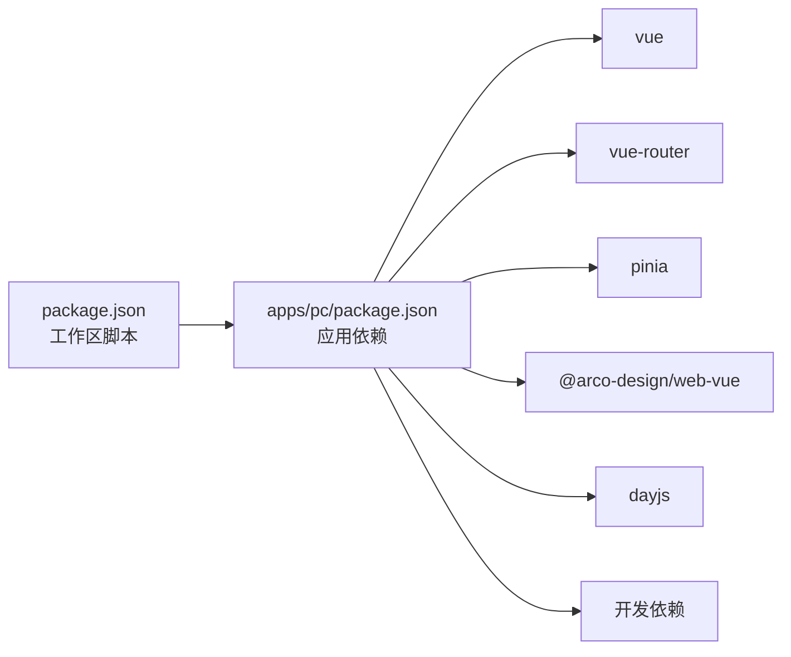

# 组件开发规范

<cite>
**本文引用的文件**
- [apps/pc/src/components/PrdBadge/index.vue](file://apps/pc/src/components/PrdBadge/index.vue)
- [apps/pc/src/components/PrdPanel/index.vue](file://apps/pc/src/components/PrdPanel/index.vue)
- [apps/pc/src/components/PhoneSimulator.vue](file://apps/pc/src/components/PhoneSimulator.vue)
- [apps/pc/src/views/construction/market/components/AddProductModal.vue](file://apps/pc/src/views/construction/market/components/AddProductModal.vue)
- [apps/pc/src/views/construction/market/components/PriceEditDrawer.vue](file://apps/pc/src/views/construction/market/components/PriceEditDrawer.vue)
- [apps/pc/src/views/construction/market/components/StockEditDrawer.vue](file://apps/pc/src/views/construction/market/components/StockEditDrawer.vue)
- [apps/pc/src/views/construction/list/components/WarehouseFormDrawer.vue](file://apps/pc/src/views/construction/list/components/WarehouseFormDrawer.vue)
- [apps/pc/src/styles/common.less](file://apps/pc/src/styles/common.less)
- [apps/pc/src/layouts/BasicLayout.vue](file://apps/pc/src/layouts/BasicLayout.vue)
- [apps/pc/src/router/index.ts](file://apps/pc/src/router/index.ts)
- [apps/pc/package.json](file://apps/pc/package.json)
- [package.json](file://package.json)
</cite>

## 目录
1. [引言](#引言)
2. [项目结构](#项目结构)
3. [核心组件](#核心组件)
4. [架构总览](#架构总览)
5. [详细组件分析](#详细组件分析)
6. [依赖分析](#依赖分析)
7. [性能考虑](#性能考虑)
8. [故障排查指南](#故障排查指南)
9. [结论](#结论)
10. [附录](#附录)

## 引言
本规范旨在为工程材料管理平台的组件开发制定统一标准，覆盖组件命名约定、文件组织结构、代码风格、最佳实践（props设计、事件命名、插槽使用）、生命周期与状态管理、样式隔离策略、测试与文档、版本管理、复用性与性能优化、兼容性处理等方面。通过统一规范，提升组件库一致性与可维护性，降低沟通成本，提高开发效率。

## 项目结构
项目采用多应用与多包的工作区结构，PC端应用位于 apps/pc，移动端应用位于 apps/mp，公共包位于 packages（api、constants、types、utils）。PC端组件主要集中在 apps/pc/src/components 与各业务视图目录下的 components 子目录中；样式采用 less/scss，并通过公共样式类进行统一规范。

**图表来源**
- [apps/pc/src/layouts/BasicLayout.vue:1-349](file://apps/pc/src/layouts/BasicLayout.vue#L1-L349)
- [apps/pc/src/router/index.ts:1-790](file://apps/pc/src/router/index.ts#L1-L790)
- [apps/pc/src/styles/common.less:1-79](file://apps/pc/src/styles/common.less#L1-L79)
- [apps/pc/src/components/PrdBadge/index.vue:1-303](file://apps/pc/src/components/PrdBadge/index.vue#L1-L303)
- [apps/pc/src/components/PrdPanel/index.vue:1-634](file://apps/pc/src/components/PrdPanel/index.vue#L1-L634)
- [apps/pc/src/components/PhoneSimulator.vue:1-144](file://apps/pc/src/components/PhoneSimulator.vue#L1-L144)

**章节来源**
- [apps/pc/src/layouts/BasicLayout.vue:1-349](file://apps/pc/src/layouts/BasicLayout.vue#L1-L349)
- [apps/pc/src/router/index.ts:1-790](file://apps/pc/src/router/index.ts#L1-L790)
- [apps/pc/src/styles/common.less:1-79](file://apps/pc/src/styles/common.less#L1-L79)

## 核心组件
- PrdBadge：需求徽章与可拖拽提示气泡，演示 props、事件、Teleport、计算样式与拖拽交互。
- PrdPanel：PRD抽屉面板，演示路由驱动的数据匹配、步骤条渲染、Markdown内容展示。
- PhoneSimulator：手机模拟器容器，演示插槽使用、生命周期管理与状态更新。
- AddProductModal / PriceEditDrawer / StockEditDrawer / WarehouseFormDrawer：典型抽屉/模态对话框组件，演示 props/emit、表单校验、受控状态与业务交互。

**章节来源**
- [apps/pc/src/components/PrdBadge/index.vue:1-303](file://apps/pc/src/components/PrdBadge/index.vue#L1-L303)
- [apps/pc/src/components/PrdPanel/index.vue:1-634](file://apps/pc/src/components/PrdPanel/index.vue#L1-L634)
- [apps/pc/src/components/PhoneSimulator.vue:1-144](file://apps/pc/src/components/PhoneSimulator.vue#L1-L144)
- [apps/pc/src/views/construction/market/components/AddProductModal.vue:1-85](file://apps/pc/src/views/construction/market/components/AddProductModal.vue#L1-L85)
- [apps/pc/src/views/construction/market/components/PriceEditDrawer.vue:1-78](file://apps/pc/src/views/construction/market/components/PriceEditDrawer.vue#L1-L78)
- [apps/pc/src/views/construction/market/components/StockEditDrawer.vue:1-92](file://apps/pc/src/views/construction/market/components/StockEditDrawer.vue#L1-L92)
- [apps/pc/src/views/construction/list/components/WarehouseFormDrawer.vue:1-126](file://apps/pc/src/views/construction/list/components/WarehouseFormDrawer.vue#L1-L126)

## 架构总览
PC端采用 Vue 3 + TypeScript + Vite + Arco Design 的技术栈，通过 Pinia 管理全局状态，Vue Router 管理页面路由与面包屑导航，Arco 提供 UI 组件库。组件通过 props 接收外部数据，通过 emits 与父组件通信，内部状态通过 ref/computed/watch 管理，样式通过 scoped 与公共类组合实现隔离与复用。

**图表来源**
- [apps/pc/src/layouts/BasicLayout.vue:1-349](file://apps/pc/src/layouts/BasicLayout.vue#L1-L349)
- [apps/pc/src/router/index.ts:1-790](file://apps/pc/src/router/index.ts#L1-L790)
- [apps/pc/src/styles/common.less:1-79](file://apps/pc/src/styles/common.less#L1-L79)
- [apps/pc/src/components/PrdBadge/index.vue:1-303](file://apps/pc/src/components/PrdBadge/index.vue#L1-L303)
- [apps/pc/src/components/PrdPanel/index.vue:1-634](file://apps/pc/src/components/PrdPanel/index.vue#L1-L634)
- [apps/pc/src/components/PhoneSimulator.vue:1-144](file://apps/pc/src/components/PhoneSimulator.vue#L1-L144)
- [apps/pc/src/views/construction/market/components/AddProductModal.vue:1-85](file://apps/pc/src/views/construction/market/components/AddProductModal.vue#L1-L85)
- [apps/pc/src/views/construction/market/components/PriceEditDrawer.vue:1-78](file://apps/pc/src/views/construction/market/components/PriceEditDrawer.vue#L1-L78)
- [apps/pc/src/views/construction/market/components/StockEditDrawer.vue:1-92](file://apps/pc/src/views/construction/market/components/StockEditDrawer.vue#L1-L92)
- [apps/pc/src/views/construction/list/components/WarehouseFormDrawer.vue:1-126](file://apps/pc/src/views/construction/list/components/WarehouseFormDrawer.vue#L1-L126)

## 详细组件分析

### PrdBadge 组件
- 设计要点
  - 使用 Teleport 将提示层挂载到 body，避免层级与定位问题。
  - 通过 props 接收 reqId、moduleName、content、top/right 等参数。
  - 计算样式 badgeStyle/tooltipStyle 实现定位与动态布局。
  - 支持鼠标悬停显示、拖拽移动、边界检测与自动回弹。
  - 内容渲染采用正则替换实现简单 Markdown 渲染。
- 生命周期与事件
  - 悬停显示：mouseenter 触发展示并计算位置。
  - 拖拽交互：mousedown 记录偏移，mousemove 更新位置，mouseup 结束拖拽。
  - 卸载时移除全局事件监听，防止内存泄漏。
- 样式隔离
  - 使用 scoped 与 :deep 选择器组合，保证局部样式与第三方组件样式不冲突。

**图表来源**
- [apps/pc/src/components/PrdBadge/index.vue:71-133](file://apps/pc/src/components/PrdBadge/index.vue#L71-L133)

**章节来源**
- [apps/pc/src/components/PrdBadge/index.vue:1-303](file://apps/pc/src/components/PrdBadge/index.vue#L1-L303)

### PrdPanel 组件
- 设计要点
  - 基于路由路径匹配 PRD 数据库，动态生成步骤条与内容。
  - 使用抽屉容器展示 PRD 内容，支持空状态与 Markdown 渲染。
  - 通过 computed 计算当前页面名称与 PRD 列表，保证响应式更新。
- 交互与数据流
  - 打开面板 -> 展示 PRD 步骤条 -> 用户滚动查看。
  - 与 BasicLayout 的面包屑配合，形成完整的页面上下文。

**图表来源**
- [apps/pc/src/components/PrdPanel/index.vue:497-527](file://apps/pc/src/components/PrdPanel/index.vue#L497-L527)

**章节来源**
- [apps/pc/src/components/PrdPanel/index.vue:1-634](file://apps/pc/src/components/PrdPanel/index.vue#L1-L634)

### PhoneSimulator 组件
- 设计要点
  - 插槽承载子内容，模拟手机外观与状态栏。
  - 使用生命周期钩子定时更新时间，卸载时清理定时器。
  - 样式通过 scoped 与伪元素实现逼真外观。
- 复用性
  - 作为容器组件，可被任意页面内容包裹，便于预览与演示。

**图表来源**
- [apps/pc/src/components/PhoneSimulator.vue:23-46](file://apps/pc/src/components/PhoneSimulator.vue#L23-L46)

**章节来源**
- [apps/pc/src/components/PhoneSimulator.vue:1-144](file://apps/pc/src/components/PhoneSimulator.vue#L1-L144)

### 抽屉/模态对话框组件（AddProductModal / PriceEditDrawer / StockEditDrawer / WarehouseFormDrawer）
- 设计要点
  - 统一使用 visible 控制显隐，通过 update:visible 与父组件双向绑定。
  - 通过 emits.success 传递成功事件，由父组件处理后续逻辑。
  - 表单组件使用 v-model 或受控属性，watch 监听 props.visible 重置表单。
  - 校验通过后再 emit success，避免无效提交。
- 事件命名规范
  - update:visible：用于显隐状态同步。
  - success：用于提交成功回调。
- 插槽使用规范
  - PhoneSimulator 使用默认插槽承载内容，遵循 Vue 插槽约定。

**图表来源**
- [apps/pc/src/views/construction/market/components/AddProductModal.vue:29-84](file://apps/pc/src/views/construction/market/components/AddProductModal.vue#L29-L84)
- [apps/pc/src/views/construction/market/components/PriceEditDrawer.vue:36-68](file://apps/pc/src/views/construction/market/components/PriceEditDrawer.vue#L36-L68)
- [apps/pc/src/views/construction/market/components/StockEditDrawer.vue:44-82](file://apps/pc/src/views/construction/market/components/StockEditDrawer.vue#L44-L82)
- [apps/pc/src/views/construction/list/components/WarehouseFormDrawer.vue:58-124](file://apps/pc/src/views/construction/list/components/WarehouseFormDrawer.vue#L58-L124)

**章节来源**
- [apps/pc/src/views/construction/market/components/AddProductModal.vue:1-85](file://apps/pc/src/views/construction/market/components/AddProductModal.vue#L1-L85)
- [apps/pc/src/views/construction/market/components/PriceEditDrawer.vue:1-78](file://apps/pc/src/views/construction/market/components/PriceEditDrawer.vue#L1-L78)
- [apps/pc/src/views/construction/market/components/StockEditDrawer.vue:1-92](file://apps/pc/src/views/construction/market/components/StockEditDrawer.vue#L1-L92)
- [apps/pc/src/views/construction/list/components/WarehouseFormDrawer.vue:1-126](file://apps/pc/src/views/construction/list/components/WarehouseFormDrawer.vue#L1-L126)

## 依赖分析
- 应用依赖
  - Vue 3、Vue Router、Pinia、@arco-design/web-vue、dayjs 等。
  - 开发依赖包括 Vite、TypeScript、ESLint、Less 等。
- 包管理
  - 工作区通过 pnpm workspace 管理，PC 应用与公共包解耦，便于独立构建与发布。
- 路由与布局
  - BasicLayout 作为主布局，router/index.ts 定义多端路由与面包屑，组件通过路由与布局协同工作。

**图表来源**
- [package.json:1-23](file://package.json#L1-L23)
- [apps/pc/package.json:1-36](file://apps/pc/package.json#L1-L36)

**章节来源**
- [package.json:1-23](file://package.json#L1-L23)
- [apps/pc/package.json:1-36](file://apps/pc/package.json#L1-L36)
- [apps/pc/src/router/index.ts:1-790](file://apps/pc/src/router/index.ts#L1-L790)
- [apps/pc/src/layouts/BasicLayout.vue:1-349](file://apps/pc/src/layouts/BasicLayout.vue#L1-L349)

## 性能考虑
- 组件渲染
  - 使用 computed 与响应式数据，避免不必要的重渲染。
  - 在 PrdBadge 中仅在悬停时计算位置，减少 DOM 查询频率。
- 事件与内存
  - 在组件卸载时移除全局事件监听，防止内存泄漏。
- 样式与动画
  - 使用 scoped 与 :deep 降低样式冲突，合理使用 transform/opacity 等硬件加速属性。
- 路由与布局
  - 布局组件保持稳定，避免频繁重建；路由切换使用过渡动画时注意性能。

## 故障排查指南
- 事件未触发
  - 检查是否正确使用 defineEmits 与事件名，确保父组件监听的事件名一致。
- 状态不同步
  - 检查 update:visible 是否与 v-model 绑定一致，确保双向绑定生效。
- 样式冲突
  - 使用 scoped 与 :deep 限定作用域，必要时引入公共样式类统一规范。
- 路由与面包屑
  - 确认路由 meta.title 与面包屑计算逻辑，避免标题或路径不一致。

**章节来源**
- [apps/pc/src/views/construction/market/components/AddProductModal.vue:32-43](file://apps/pc/src/views/construction/market/components/AddProductModal.vue#L32-L43)
- [apps/pc/src/views/construction/market/components/PriceEditDrawer.vue:39-50](file://apps/pc/src/views/construction/market/components/PriceEditDrawer.vue#L39-L50)
- [apps/pc/src/views/construction/market/components/StockEditDrawer.vue:47-58](file://apps/pc/src/views/construction/market/components/StockEditDrawer.vue#L47-L58)
- [apps/pc/src/views/construction/list/components/WarehouseFormDrawer.vue:61-72](file://apps/pc/src/views/construction/list/components/WarehouseFormDrawer.vue#L61-L72)
- [apps/pc/src/layouts/BasicLayout.vue:200-216](file://apps/pc/src/layouts/BasicLayout.vue#L200-L216)

## 结论
通过统一的组件命名、文件组织、代码风格与最佳实践，结合生命周期与状态管理、样式隔离策略、测试与文档规范、版本管理与复用性设计，工程材料管理平台的组件库将具备更高的质量与可维护性。建议在后续迭代中持续完善测试与文档，强化组件复用与性能优化，确保跨端一致性与用户体验。

## 附录

### 组件命名约定
- 文件夹命名：采用帕斯卡命名，如 PrdBadge、PrdPanel、PhoneSimulator。
- 组件导出：默认导出组件，文件名为 index.vue。
- 组件名：与文件夹名一致，便于 import 时清晰识别。

### 文件组织结构
- 组件目录：apps/pc/src/components/<组件名>/index.vue
- 业务组件：apps/pc/src/views/<模块>/components/<组件名>.vue
- 样式：apps/pc/src/styles/common.less 与组件内 scoped 样式组合使用

### 代码风格要求
- TypeScript
  - 使用 defineProps/defineEmits/defineSlots 等组合式 API。
  - 接口命名使用大写开头，如 PrdItem。
- 模板
  - 使用语义化标签与可访问性属性。
  - 事件绑定使用小驼峰命名，如 click、mouseenter、mouseup。
- 样式
  - 优先使用 scoped，必要时使用 :deep 限定第三方组件样式。
  - 通用样式类统一在 common.less 中维护。

### props 设计原则
- 必需与可选：明确区分必填与可选 props，提供合理默认值。
- 类型约束：使用 TypeScript 接口定义 props 类型，确保类型安全。
- 受控与非受控：对于表单类组件，优先采用受控模式，通过 v-model 或 update:visible 同步状态。

### 事件命名规范
- update:visible：用于显隐状态同步。
- success：用于提交成功回调。
- 自定义事件：使用小驼峰命名，语义明确，避免与内置事件冲突。

### 插槽使用规范
- 默认插槽：PhoneSimulator 使用默认插槽承载内容，父组件传入任意子节点。
- 具名插槽：在需要更细粒度控制时使用具名插槽，但应保持简洁与易用。

### 生命周期管理
- mounted：初始化定时器、订阅事件、获取初始数据。
- unmounted：清理定时器、移除全局事件监听、释放资源。
- watch：监听 props 变化，重置内部状态或执行副作用。

### 状态管理
- 组件内部状态：使用 ref/computed/watch 管理本地状态。
- 全局状态：通过 Pinia 管理跨组件共享的状态，避免 props 逐层传递。

### 样式隔离策略
- 组件样式：使用 scoped 隔离，避免污染全局。
- 第三方组件：使用 :deep 选择器，限定样式范围。
- 通用样式：通过 common.less 提供统一的布局与排版规范。

### 测试方法
- 单元测试：针对组件逻辑（如计算属性、事件处理）编写测试用例。
- 集成测试：验证组件与父组件协作（如表单校验、事件回调）。
- 端到端测试：使用自动化测试工具验证真实用户流程。

### 文档编写规范
- 组件文档：包含 props、events、slots、使用示例与注意事项。
- PRD 集成：PrdPanel 与路由联动，确保文档与页面上下文一致。
- 更新日志：记录版本变更与破坏性改动，便于升级与迁移。

### 版本管理要求
- 语义化版本：遵循 MAJOR.MINOR.PATCH，破坏性改动提升主版本。
- 工作区版本：通过 pnpm workspace 管理公共包版本，保持一致性。
- 发布策略：组件库独立发布，应用通过 workspace:* 引用最新版本。

### 组件复用性设计
- 抽象容器组件：如 PhoneSimulator，提供统一外观与内容承载能力。
- 通用表单组件：通过 props 与 emits 解耦业务逻辑，提升复用性。
- 插槽扩展：在不影响默认行为的前提下，允许父组件定制内容。

### 性能优化技巧
- 懒加载：路由级懒加载组件，减少首屏体积。
- 虚拟滚动：大数据列表使用虚拟滚动，降低 DOM 节点数量。
- 防抖节流：输入类组件使用防抖，滚动/窗口事件使用节流。
- 样式优化：合理使用 transform/opacity，避免强制同步布局。

### 兼容性处理方案
- 浏览器兼容：使用 polyfill 与编译目标，确保在主流浏览器运行。
- 移动端适配：使用媒体查询与弹性布局，适配不同屏幕尺寸。
- 第三方组件：关注 Arco 版本更新，及时修复不兼容问题。