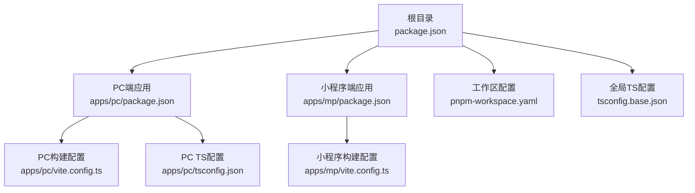
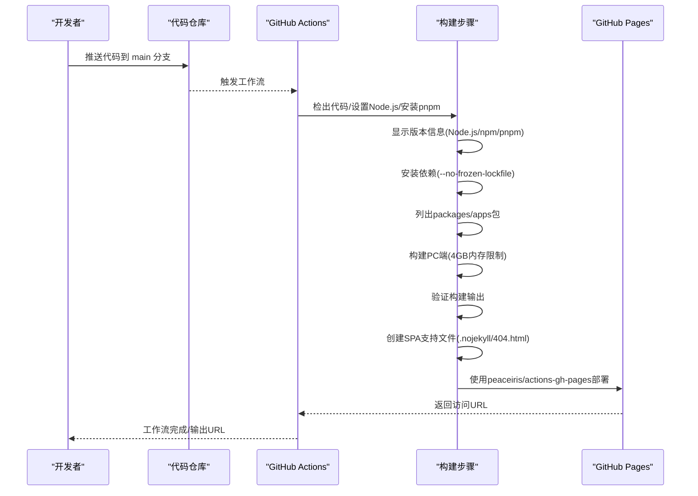
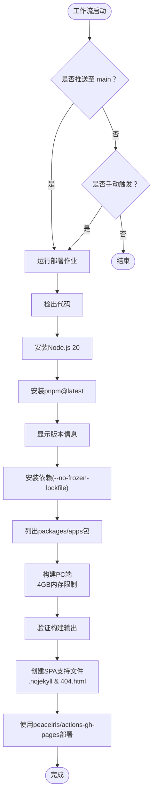
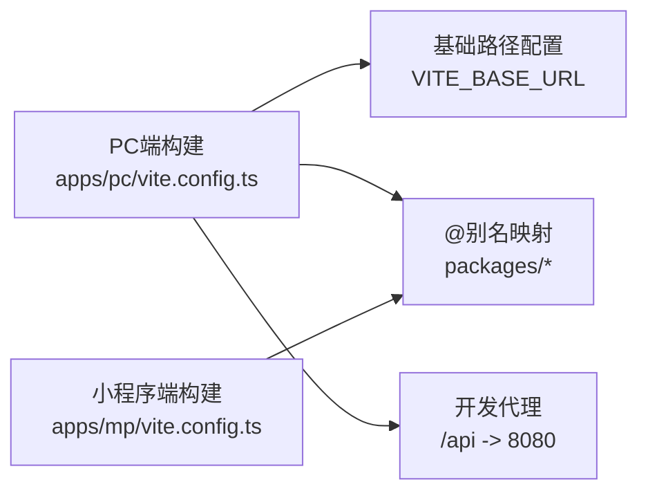
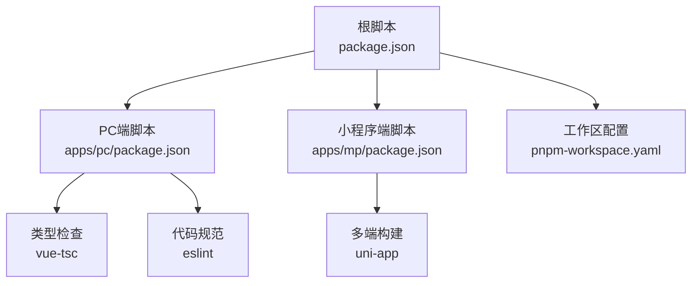
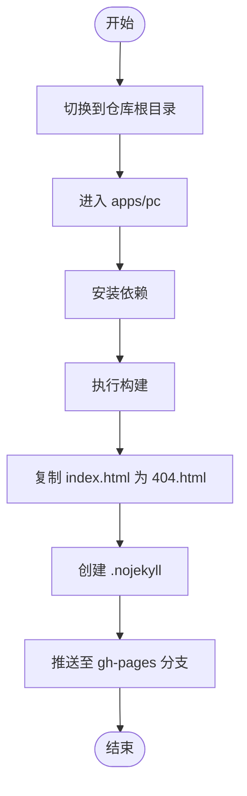
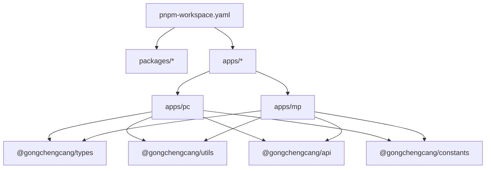

# CI/CD流程

<cite>
**本文引用的文件**   
- [.github/workflows/deploy.yml](file://.github/workflows/deploy.yml)
- [package.json](file://package.json)
- [pnpm-workspace.yaml](file://pnpm-workspace.yaml)
- [apps/pc/package.json](file://apps/pc/package.json)
- [apps/pc/vite.config.ts](file://apps/pc/vite.config.ts)
- [apps/mp/package.json](file://apps/mp/package.json)
- [apps/mp/vite.config.ts](file://apps/mp/vite.config.ts)
- [tsconfig.base.json](file://tsconfig.base.json)
- [apps/pc/tsconfig.json](file://apps/pc/tsconfig.json)
- [deploy-gh-pages.sh](file://deploy-gh-pages.sh)
</cite>

## 更新摘要
**变更内容**   
- 重大重构GitHub Actions部署工作流，简化pnpm安装方式为直接使用npm安装pnpm@latest
- 新增调试和验证步骤，包括依赖列表显示、构建输出验证、环境版本检查
- 改进构建流程，采用更清晰的步骤组织和错误处理
- 增强工作流的可观测性和可维护性

## 目录
1. [简介](#简介)
2. [项目结构](#项目结构)
3. [核心组件](#核心组件)
4. [架构总览](#架构总览)
5. [详细组件分析](#详细组件分析)
6. [依赖关系分析](#依赖关系分析)
7. [性能考量](#性能考量)
8. [故障排查指南](#故障排查指南)
9. [结论](#结论)
10. [附录](#附录)

## 简介
本文件面向工程材料管理平台的开发与运维团队，系统化梳理当前仓库的CI/CD现状与可扩展方案，重点覆盖以下方面：
- GitHub Actions工作流配置与触发条件
- 自动化构建流程（含多应用构建矩阵）
- 测试与类型检查验证流程
- 自动部署至GitHub Pages的策略与优化
- 环境变量与构建参数管理
- 代码质量、安全与性能测试的集成建议
- 工作流监控、日志分析与失败重试机制
- 可维护性与持续优化建议

**更新** 当前仓库已采用经过重大重构的GitHub Actions部署工作流，简化了pnpm安装流程，增强了调试和验证能力，显著提升了构建的可观测性和可维护性。

## 项目结构
本项目采用monorepo结构，使用pnpm workspace进行包管理，包含PC端与小程序端两个应用，以及共享的packages（api、constants、types、utils）。

**图表来源**
- [package.json:1-26](file://package.json#L1-L26)
- [pnpm-workspace.yaml:1-4](file://pnpm-workspace.yaml#L1-L4)
- [apps/pc/package.json:1-39](file://apps/pc/package.json#L1-L39)
- [apps/mp/package.json:1-39](file://apps/mp/package.json#L1-L39)
- [apps/pc/vite.config.ts:1-32](file://apps/pc/vite.config.ts#L1-L32)
- [apps/mp/vite.config.ts:1-17](file://apps/mp/vite.config.ts#L1-L17)
- [tsconfig.base.json:1-29](file://tsconfig.base.json#L1-L29)
- [apps/pc/tsconfig.json:1-16](file://apps/pc/tsconfig.json#L1-L16)

**章节来源**
- [package.json:1-26](file://package.json#L1-L26)
- [pnpm-workspace.yaml:1-4](file://pnpm-workspace.yaml#L1-L4)

## 核心组件
- GitHub Actions工作流：负责在推送主分支或手动触发时，执行PC端构建与部署至GitHub Pages，采用peaceiris/actions-gh-pages实现一体化部署。
- 构建工具链：Vite（PC端）、uni-app（小程序端），配合pnpm workspace统一管理依赖与脚本。
- 部署系统：peaceiris/actions-gh-pages提供GitHub Pages部署能力，内置SPA路由支持。
- 类型检查与代码质量：通过根级与各应用内脚本提供类型检查与ESLint规则（PC端）。

**更新** 工作流采用经过重大重构的简化pnpm安装方式，通过npm安装pnpm@latest，并新增了完整的调试和验证步骤，显著提升了构建流程的可观测性和可维护性。

**章节来源**
- [.github/workflows/deploy.yml:1-66](file://.github/workflows/deploy.yml#L1-L66)
- [apps/pc/package.json:6-12](file://apps/pc/package.json#L6-L12)
- [apps/mp/package.json:5-10](file://apps/mp/package.json#L5-L10)
- [package.json:6-12](file://package.json#L6-L12)

## 架构总览
下图展示从代码提交到部署的端到端流程，包括工作流触发、构建与部署步骤。

**图表来源**
- [.github/workflows/deploy.yml:18-66](file://.github/workflows/deploy.yml#L18-L66)
- [apps/pc/vite.config.ts:6](file://apps/pc/vite.config.ts#L6)
- [apps/pc/package.json:6-12](file://apps/pc/package.json#L6-L12)

## 详细组件分析

### GitHub Actions工作流（deploy.yml）
- 触发条件
  - 推送至main分支
  - 手动触发（workflow_dispatch）
- 权限与并发
  - 设置内容写入权限（简化为write级别）
  - 使用concurrency分组避免并发冲突
- 步骤分解
  - 检出代码
  - 安装Node.js 20
  - **更新** 简化pnpm安装：使用npm install -g pnpm@latest替代复杂的pnpm v4配置
  - **新增** 显示版本信息：检查Node.js、npm、pnpm版本确保环境一致性
  - 安装依赖（使用--no-frozen-lockfile避免锁定文件问题）
  - **新增** 列出packages/apps包：验证工作区结构完整性
  - 构建PC端（设置base路径以适配GitHub Pages子路径，启用4GB内存限制）
  - **新增** 验证构建输出：检查dist目录存在性和index.html内容
  - 创建SPA支持文件（.nojekyll和404.html）
  - 使用peaceiris/actions-gh-pages部署至gh-pages分支
- 环境变量
  - 通过env注入VITE_BASE_URL，确保静态资源路径正确
  - 通过NODE_OPTIONS设置--max-old-space-size=4096，提升内存容量

**更新** 工作流经过重大重构，主要改进包括：
- 简化pnpm安装方式，直接使用npm安装pnpm@latest
- 新增完整的调试和验证步骤，包括版本检查、包列表显示、构建输出验证
- 改进构建流程的可观测性和可维护性

**图表来源**
- [.github/workflows/deploy.yml:3-16](file://.github/workflows/deploy.yml#L3-L16)
- [.github/workflows/deploy.yml:18-66](file://.github/workflows/deploy.yml#L18-L66)

**章节来源**
- [.github/workflows/deploy.yml:1-66](file://.github/workflows/deploy.yml#L1-L66)

### 构建与打包配置
- PC端（Vite）
  - 基础路径：通过VITE_BASE_URL控制，工作流中注入以适配子路径部署
  - 别名映射：指向packages下的共享模块，便于统一管理
  - 开发服务器代理：本地调试API转发
  - 构建产物：dist目录，开启Source Map便于问题定位
- 小程序端（uni-app）
  - 构建插件：使用@vite-plugin-uni
  - 别名映射：同PC端一致，保证跨应用一致性

**图表来源**
- [apps/pc/vite.config.ts:6](file://apps/pc/vite.config.ts#L6)
- [apps/pc/vite.config.ts:9-15](file://apps/pc/vite.config.ts#L9-L15)
- [apps/mp/vite.config.ts:7-15](file://apps/mp/vite.config.ts#L7-L15)

**章节来源**
- [apps/pc/vite.config.ts:1-32](file://apps/pc/vite.config.ts#L1-L32)
- [apps/mp/vite.config.ts:1-17](file://apps/mp/vite.config.ts#L1-L17)

### 依赖与脚本组织
- 根级脚本
  - 提供PC与小程序的开发与构建入口，统一通过pnpm workspace执行
  - 提供根级类型检查与lint任务，便于整体质量把控
- 应用级脚本
  - PC端：dev/build/preview/typecheck/lint/deploy
  - 小程序端：dev/h5/build等多平台构建
- 工作区配置
  - packages与apps均纳入workspace，实现共享模块与应用的统一管理

**图表来源**
- [package.json:6-12](file://package.json#L6-L12)
- [apps/pc/package.json:6-12](file://apps/pc/package.json#L6-L12)
- [apps/mp/package.json:5-10](file://apps/mp/package.json#L5-L10)
- [pnpm-workspace.yaml:1-4](file://pnpm-workspace.yaml#L1-L4)

**章节来源**
- [package.json:1-26](file://package.json#L1-L26)
- [apps/pc/package.json:1-39](file://apps/pc/package.json#L1-L39)
- [apps/mp/package.json:1-39](file://apps/mp/package.json#L1-L39)
- [pnpm-workspace.yaml:1-4](file://pnpm-workspace.yaml#L1-L4)

### 本地部署脚本（gh-pages）
- 功能概述
  - 在本地安装依赖、构建PC端、复制index.html为404.html以支持SPA路由、创建.nojekyll以禁用Jekyll处理、最后将dist目录推送到gh-pages分支
- 适用场景
  - 作为备用部署通道或离线环境部署
- 注意事项
  - 需要确保本地已配置正确的Git用户与远程仓库
  - 与GitHub Actions部署策略需保持一致的产物与路径

**图表来源**
- [deploy-gh-pages.sh:1-27](file://deploy-gh-pages.sh#L1-L27)

**章节来源**
- [deploy-gh-pages.sh:1-27](file://deploy-gh-pages.sh#L1-L27)

## 依赖关系分析
- monorepo结构
  - packages与apps共同纳入workspace，PC端与小程序端共享types、api、constants、utils等模块
- 构建耦合点
  - PC端构建依赖Vite配置中的别名映射与基础路径
  - 小程序端构建依赖uni插件与多平台目标
- 质量与类型检查
  - 根级与应用级脚本分别承担类型检查与lint职责，建议在CI中统一执行

**图表来源**
- [pnpm-workspace.yaml:1-4](file://pnpm-workspace.yaml#L1-L4)
- [apps/pc/vite.config.ts:9-15](file://apps/pc/vite.config.ts#L9-L15)
- [apps/mp/vite.config.ts:7-15](file://apps/mp/vite.config.ts#L7-L15)
- [tsconfig.base.json:21-26](file://tsconfig.base.json#L21-L26)

**章节来源**
- [pnpm-workspace.yaml:1-4](file://pnpm-workspace.yaml#L1-L4)
- [apps/pc/vite.config.ts:1-32](file://apps/pc/vite.config.ts#L1-L32)
- [apps/mp/vite.config.ts:1-17](file://apps/mp/vite.config.ts#L1-L17)
- [tsconfig.base.json:1-29](file://tsconfig.base.json#L1-L29)

## 性能考量
- 构建性能
  - 使用pnpm替代npm/yarn，提升依赖安装速度与磁盘占用
  - 在CI中启用pnpm缓存机制，减少重复安装时间
  - 通过NODE_OPTIONS设置4GB最大堆内存，提升大型项目的构建稳定性
- 产物体积
  - 合理拆分路由与组件，结合Vite的动态导入与懒加载
  - 保留Source Map便于问题定位，但发布前可考虑关闭以减小体积
- 部署效率
  - GitHub Pages部署仅上传dist目录，避免不必要的文件传输
  - 子路径部署需确保基础路径与资源路径一致，避免二次请求失败
- **更新** SPA支持优化
  - .nojekyll文件确保GitHub Pages不使用Jekyll处理静态文件
  - 404.html文件支持前端路由的客户端导航
- **更新** 工作流性能优化
  - 简化的pnpm安装方式减少了安装步骤和潜在的配置复杂性
  - 新增的调试步骤有助于快速定位问题，减少重试次数
  - 更清晰的步骤组织提高了工作流的可维护性

**更新** 性能优化措施包括：
- 简化的pnpm安装流程，直接使用npm安装pnpm@latest
- 增强的调试和验证步骤，提高问题诊断效率
- 改进的构建流程组织，提升整体可观测性

## 故障排查指南
- 构建失败
  - 检查VITE_BASE_URL是否与GitHub Pages子路径一致
  - 确认pnpm workspace依赖安装是否成功
  - 查看构建日志中的TypeScript与ESLint错误
  - **新增** 检查版本显示步骤是否正常输出Node.js、npm、pnpm版本信息
  - **新增** 验证依赖安装步骤是否成功执行
- 部署失败
  - 确认GitHub Pages权限与工作流权限配置
  - 检查上传的产物目录是否为apps/pc/dist
  - 若出现404路由问题，确认是否生成了404.html
  - **更新** 检查peaceiris/actions-gh-pages配置参数是否正确
- 本地部署异常
  - 确保gh-pages命令可用且远程仓库可写
  - 检查.gitignore中是否排除了dist或相关文件
- **新增** 内存相关问题
  - 如遇内存不足错误，检查NODE_OPTIONS设置
  - 验证pnpm v4缓存配置是否正确
  - 监控构建过程中的内存使用情况
- **新增** 工作流调试问题
  - 检查pnpm安装步骤是否成功
  - 验证包列表显示步骤是否正确列出packages/apps
  - 确认构建输出验证步骤是否能正确读取dist目录

**章节来源**
- [.github/workflows/deploy.yml:9-16](file://.github/workflows/deploy.yml#L9-L16)
- [apps/pc/vite.config.ts:6](file://apps/pc/vite.config.ts#L6)
- [apps/pc/package.json:10](file://apps/pc/package.json#L10)
- [deploy-gh-pages.sh:15-19](file://deploy-gh-pages.sh#L15-L19)

## 结论
当前仓库已具备完善的PC端静态站点自动化部署能力，采用peaceiris/actions-gh-pages实现了更简洁的一体化部署流程。**更新** 主要改进包括：
- 重大重构的GitHub Actions工作流，简化pnpm安装方式为npm install -g pnpm@latest
- 新增完整的调试和验证步骤，包括版本检查、包列表显示、构建输出验证
- 改进构建流程的可观测性和可维护性
- 通过NODE_OPTIONS设置4GB内存限制，增强大型项目构建稳定性

建议在现有基础上补充：
- 多应用构建矩阵（PC端与小程序端并行构建）
- 统一的测试与类型检查任务（在CI中执行）
- 安全扫描与代码质量门禁（如ESLint、依赖漏洞扫描）
- 失败重试与日志归档机制
- 更细粒度的部署策略（预发布/生产环境分离）

## 附录

### 建议的CI/CD增强清单
- 触发策略
  - 增加pull_request触发，对PR进行快速质量检查
  - 对main分支推送增加保护分支策略
- 构建矩阵
  - 并行构建PC端与小程序端，缩短总耗时
  - 支持不同Node版本矩阵（如18/20）进行兼容性验证
- 质量与安全
  - 在CI中执行根级lint与typecheck
  - 引入依赖漏洞扫描（如npm audit或类似工具）
- 部署策略
  - 分环境部署（dev/staging/prod），使用不同分支或环境变量
  - 部署前进行健康检查与回滚预案
- 监控与日志
  - 归档构建日志与产物Artifacts
  - 失败重试与告警通知（邮件/IM）
- **更新** 性能优化增强
  - 集成pnpm缓存监控和性能分析
  - 添加内存使用情况监控
  - 实施构建时间基准测试
- **更新** SPA支持增强
  - 集成前端路由测试，确保所有路由都能正确加载
  - 添加404页面的用户体验优化
  - 监控GitHub Pages的部署成功率和访问统计
- **更新** 工作流可观测性增强
  - 添加更多调试步骤和日志输出
  - 实施失败重试机制和告警通知
  - 建立工作流性能基准测试