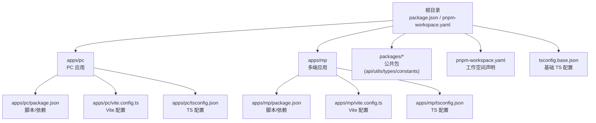
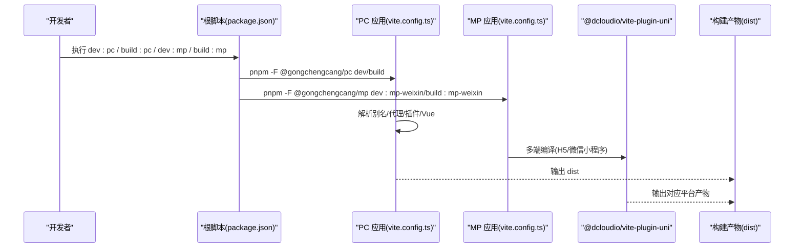
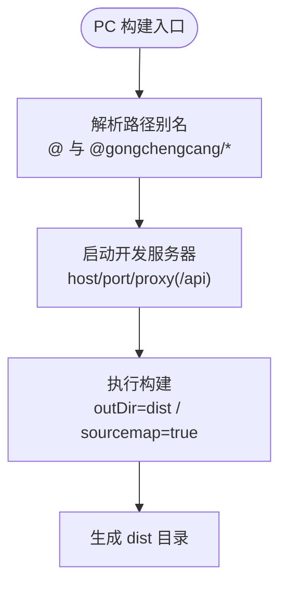
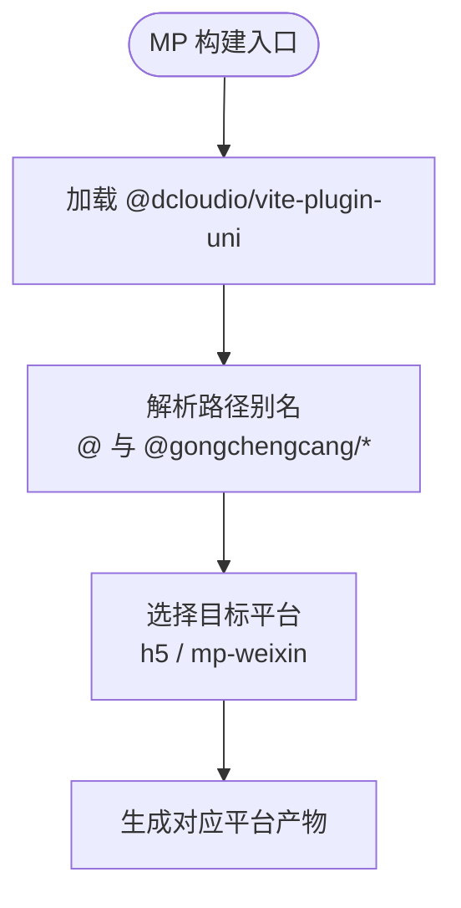
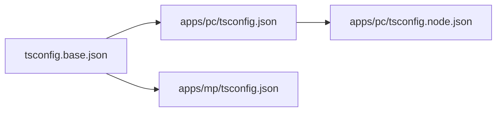
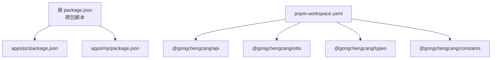
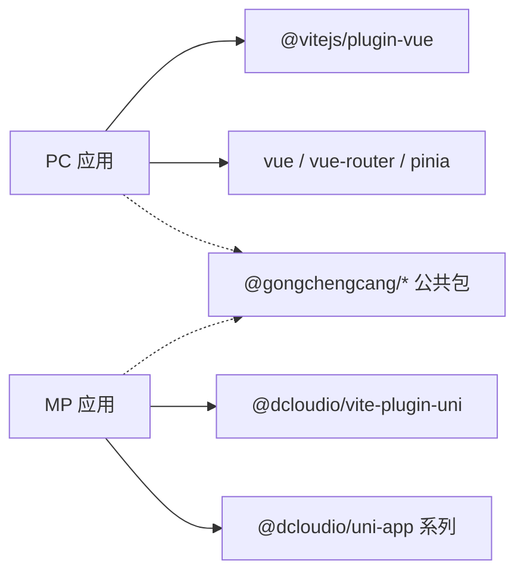

# 构建配置

<cite>
**本文引用的文件**
- [apps/pc/vite.config.ts](file://apps/pc/vite.config.ts)
- [apps/mp/vite.config.ts](file://apps/mp/vite.config.ts)
- [apps/pc/tsconfig.json](file://apps/pc/tsconfig.json)
- [apps/mp/tsconfig.json](file://apps/mp/tsconfig.json)
- [tsconfig.base.json](file://tsconfig.base.json)
- [apps/pc/tsconfig.node.json](file://apps/pc/tsconfig.node.json)
- [package.json](file://package.json)
- [pnpm-workspace.yaml](file://pnpm-workspace.yaml)
- [apps/pc/package.json](file://apps/pc/package.json)
- [apps/mp/package.json](file://apps/mp/package.json)
- [deploy-gh-pages.sh](file://deploy-gh-pages.sh)
- [vercel.json](file://vercel.json)
</cite>

## 目录
1. [简介](#简介)
2. [项目结构](#项目结构)
3. [核心组件](#核心组件)
4. [架构总览](#架构总览)
5. [详细组件分析](#详细组件分析)
6. [依赖分析](#依赖分析)
7. [性能考虑](#性能考虑)
8. [故障排查指南](#故障排查指南)
9. [结论](#结论)
10. [附录](#附录)

## 简介
本文件面向工程材料管理平台的构建配置，覆盖 Vite 构建配置、TypeScript 编译配置与 Monorepo 工作空间配置。重点对比 PC 端与小程序端（H5/微信小程序）在构建工具、插件、代理与输出上的差异；梳理开发与生产环境的构建流程、环境变量注入方式、静态资源处理策略；并提供构建性能优化建议、缓存策略与代码分割配置思路，帮助开发者根据不同的部署目标快速理解与调整构建配置。

## 项目结构
该仓库采用 pnpm workspaces 的 Monorepo 结构，将公共包与多端应用分层组织：
- packages：公共包（类型、常量、API、工具）
- apps：多端应用
  - pc：PC Web 应用
  - mp：多端统一源码（H5/微信小程序等）

图表来源
- [package.json:6-12](file://package.json#L6-L12)
- [pnpm-workspace.yaml:1-4](file://pnpm-workspace.yaml#L1-L4)
- [apps/pc/vite.config.ts:1-32](file://apps/pc/vite.config.ts#L1-L32)
- [apps/mp/vite.config.ts:1-17](file://apps/mp/vite.config.ts#L1-L17)
- [apps/pc/tsconfig.json:1-16](file://apps/pc/tsconfig.json#L1-L16)
- [apps/mp/tsconfig.json:1-16](file://apps/mp/tsconfig.json#L1-L16)
- [tsconfig.base.json:1-29](file://tsconfig.base.json#L1-L29)

章节来源
- [package.json:6-12](file://package.json#L6-L12)
- [pnpm-workspace.yaml:1-4](file://pnpm-workspace.yaml#L1-L4)

## 核心组件
- Vite 构建配置
  - PC 端：启用 Vue 插件、路径别名、本地开发服务器与代理、构建输出目录与 Source Map。
  - 小程序端：使用 @dcloudio/vite-plugin-uni 统一多端构建。
- TypeScript 编译配置
  - 基于 tsconfig.base.json 的严格模式与模块解析策略，PC 端额外包含 tsconfig.node.json 用于 Vite 配置文件类型检查。
  - 多端共享路径映射，指向 packages 下的公共包。
- Monorepo 工作空间
  - pnpm-workspace.yaml 声明 packages 与 apps 为工作空间；根 package.json 提供跨包脚本，通过 pnpm -F 指定作用域执行。

章节来源
- [apps/pc/vite.config.ts:5-31](file://apps/pc/vite.config.ts#L5-L31)
- [apps/mp/vite.config.ts:5-16](file://apps/mp/vite.config.ts#L5-L16)
- [apps/pc/tsconfig.json:1-16](file://apps/pc/tsconfig.json#L1-L16)
- [apps/mp/tsconfig.json:1-16](file://apps/mp/tsconfig.json#L1-L16)
- [tsconfig.base.json:1-29](file://tsconfig.base.json#L1-L29)
- [apps/pc/tsconfig.node.json:1-12](file://apps/pc/tsconfig.node.json#L1-L12)
- [package.json:6-12](file://package.json#L6-L12)
- [pnpm-workspace.yaml:1-4](file://pnpm-workspace.yaml#L1-L4)

## 架构总览
下图展示从命令到构建产物的关键路径，以及多端差异点：

图表来源
- [package.json:6-12](file://package.json#L6-L12)
- [apps/pc/vite.config.ts:1-32](file://apps/pc/vite.config.ts#L1-L32)
- [apps/mp/vite.config.ts:1-17](file://apps/mp/vite.config.ts#L1-L17)

## 详细组件分析

### PC 端构建配置
- 别名与路径映射
  - 使用路径别名简化导入，指向 src 与 packages 下的公共包。
- 开发服务器
  - host、port 设置便于局域网联调。
  - 代理规则将 /api 请求转发至后端服务，便于前后端分离开发。
- 构建输出
  - 输出目录为 dist，开启 Source Map 便于调试。
- TypeScript 配置
  - 继承基础 TS 配置，包含路径映射与引用 tsconfig.node.json。
  - tsconfig.node.json 仅包含 Vite 配置文件类型检查范围。

图表来源
- [apps/pc/vite.config.ts:8-31](file://apps/pc/vite.config.ts#L8-L31)
- [apps/pc/tsconfig.json:3-14](file://apps/pc/tsconfig.json#L3-L14)
- [apps/pc/tsconfig.node.json:1-12](file://apps/pc/tsconfig.node.json#L1-L12)

章节来源
- [apps/pc/vite.config.ts:5-31](file://apps/pc/vite.config.ts#L5-L31)
- [apps/pc/tsconfig.json:1-16](file://apps/pc/tsconfig.json#L1-L16)
- [apps/pc/tsconfig.node.json:1-12](file://apps/pc/tsconfig.node.json#L1-L12)

### 小程序端构建配置
- 插件与平台
  - 使用 @dcloudio/vite-plugin-uni，支持 H5 与微信小程序等多端输出。
- 路径别名
  - 同样映射 @ 与 @gongchengcang/* 到 src 与 packages。
- 类型支持
  - 在 tsconfig 中引入 @dcloudio/types，确保小程序端类型安全。

图表来源
- [apps/mp/vite.config.ts:5-16](file://apps/mp/vite.config.ts#L5-L16)
- [apps/mp/tsconfig.json:12-14](file://apps/mp/tsconfig.json#L12-L14)

章节来源
- [apps/mp/vite.config.ts:1-17](file://apps/mp/vite.config.ts#L1-L17)
- [apps/mp/tsconfig.json:1-16](file://apps/mp/tsconfig.json#L1-L16)

### TypeScript 编译配置
- 基础配置
  - 严格模式、ESNext 模块、DOM/DOM.Iterable 库、bundler 模块解析、保留 JSX、开启 declaration/declarationMap/sourceMap。
- 多端 tsconfig
  - apps/*/tsconfig.json 继承基础配置，并添加各自路径映射与类型声明。
  - PC 端额外包含 tsconfig.node.json，限定 Vite 配置文件的类型检查范围。

图表来源
- [tsconfig.base.json:1-29](file://tsconfig.base.json#L1-L29)
- [apps/pc/tsconfig.json:1-16](file://apps/pc/tsconfig.json#L1-L16)
- [apps/mp/tsconfig.json:1-16](file://apps/mp/tsconfig.json#L1-L16)
- [apps/pc/tsconfig.node.json:1-12](file://apps/pc/tsconfig.node.json#L1-L12)

章节来源
- [tsconfig.base.json:1-29](file://tsconfig.base.json#L1-L29)
- [apps/pc/tsconfig.json:1-16](file://apps/pc/tsconfig.json#L1-L16)
- [apps/mp/tsconfig.json:1-16](file://apps/mp/tsconfig.json#L1-L16)
- [apps/pc/tsconfig.node.json:1-12](file://apps/pc/tsconfig.node.json#L1-L12)

### Monorepo 工作空间配置
- 工作空间声明
  - pnpm-workspace.yaml 声明 packages 与 apps 为工作空间，使各包间可相互引用。
- 跨包脚本
  - 根 package.json 提供 dev:pc、build:pc、dev:mp、build:mp 等脚本，内部通过 pnpm -F 指定作用域执行。
- 包内依赖
  - apps/pc 与 apps/mp 的 package.json 内部依赖 @gongchengcang/* 使用 workspace:*，实现本地开发时的即时同步。

图表来源
- [package.json:6-12](file://package.json#L6-L12)
- [pnpm-workspace.yaml:1-4](file://pnpm-workspace.yaml#L1-L4)
- [apps/pc/package.json:16-24](file://apps/pc/package.json#L16-L24)
- [apps/mp/package.json:17-21](file://apps/mp/package.json#L17-L21)

章节来源
- [pnpm-workspace.yaml:1-4](file://pnpm-workspace.yaml#L1-L4)
- [package.json:6-12](file://package.json#L6-L12)
- [apps/pc/package.json:1-36](file://apps/pc/package.json#L1-L36)
- [apps/mp/package.json:1-39](file://apps/mp/package.json#L1-L39)

## 依赖分析
- 组件耦合
  - PC 端与 MP 端分别依赖各自的构建插件（Vue 插件 vs @dcloudio/vite-plugin-uni），耦合度低，便于独立演进。
  - 公共包通过路径别名与 workspace:* 引用，降低重复与版本不一致风险。
- 直接与间接依赖
  - PC 端直接依赖 @vitejs/plugin-vue、vue、vue-router、pinia 等；MP 端依赖 @dcloudio/uni-app 生态。
- 外部集成点
  - 开发代理：PC 端通过 /api 代理到本地后端服务。
  - 部署：PC 端支持 gh-pages 与 Vercel 部署配置。

图表来源
- [apps/pc/package.json:14-34](file://apps/pc/package.json#L14-L34)
- [apps/mp/package.json:12-37](file://apps/mp/package.json#L12-L37)

章节来源
- [apps/pc/package.json:1-36](file://apps/pc/package.json#L1-L36)
- [apps/mp/package.json:1-39](file://apps/mp/package.json#L1-L39)

## 性能考虑
- 构建优化策略
  - 代码分割：利用 Vite 默认的动态导入进行路由级或组件级懒加载，减少首屏体积。
  - 资源压缩：生产构建默认启用压缩；如需进一步优化，可在 Vite 配置中启用更激进的压缩选项。
  - 静态资源处理：合理设置 public 与 src/assets 的边界；对大图片建议使用现代格式并配合 CDN。
  - Source Map：开发阶段开启，生产阶段按需关闭以提升构建速度与产物体积可控性。
- 缓存策略
  - 浏览器缓存：通过文件指纹命名与长效缓存策略，结合 CDN 实现静态资源缓存。
  - 构建缓存：Vite 支持基于 ESM 的原生缓存；pnpm 的 store 也可复用依赖构建结果。
- 代码分割配置思路
  - 路由级拆分：将大型页面或第三方库拆分为独立 chunk。
  - 第三方库抽离：将稳定不变的依赖单独打包，提升缓存命中率。
  - 动态导入：对非首屏使用的功能模块使用动态导入，延迟加载。
- 环境变量注入
  - 通过 Vite 的环境变量前缀（如 VITE_）注入到客户端代码；避免将敏感信息写入前端。
  - 不同环境（开发/生产）可通过 .env 文件区分，Vite 会自动合并。

[本节为通用性能建议，无需特定文件引用]

## 故障排查指南
- 代理无效或 404
  - 确认开发服务器代理配置与后端接口前缀一致；检查 /api 代理是否正确指向后端地址。
- 路由刷新 404（PC SPA）
  - 在构建完成后复制 index.html 为 404.html，以支持历史模式路由回退。
- 多端构建失败
  - 确认已安装 @dcloudio/vite-plugin-uni 与对应平台运行时；检查 tsconfig 中的类型声明是否齐全。
- 路径别名报错
  - 确保 apps/*/tsconfig.json 的路径映射与 tsconfig.base.json 的 baseUrl 保持一致。
- 部署异常
  - Vercel：确认 rewrites 规则与 base 配置一致；确保输出目录与构建命令正确。
  - GitHub Pages：确认 dist 目录结构与 404.html、.nojekyll 是否存在。

章节来源
- [apps/pc/vite.config.ts:17-26](file://apps/pc/vite.config.ts#L17-L26)
- [deploy-gh-pages.sh:15-23](file://deploy-gh-pages.sh#L15-L23)
- [vercel.json:6-10](file://vercel.json#L6-L10)

## 结论
本项目的构建体系以 Vite 为核心，结合 pnpm workspaces 实现多端与公共包的高效协同。PC 端侧重开发代理与 SPA 路由支持，小程序端通过 @dcloudio/vite-plugin-uni 实现多端统一构建。通过合理的路径别名、严格的 TypeScript 配置与清晰的 Monorepo 结构，开发者可以快速适配不同部署场景并持续优化构建性能。

[本节为总结性内容，无需特定文件引用]

## 附录

### 环境变量与部署参考
- 环境变量注入
  - 通过 Vite 的 VITE_ 前缀注入到客户端代码；开发与生产环境可分别维护 .env.development 与 .env.production。
- 部署参考
  - GitHub Pages：使用脚本自动复制 404.html 并推送至 gh-pages 分支。
  - Vercel：通过 vercel.json 指定构建命令、输出目录与重写规则，确保路由与 base 正确。

章节来源
- [deploy-gh-pages.sh:1-27](file://deploy-gh-pages.sh#L1-L27)
- [vercel.json:1-11](file://vercel.json#L1-L11)