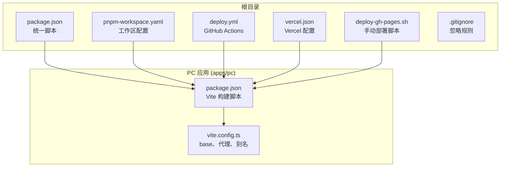
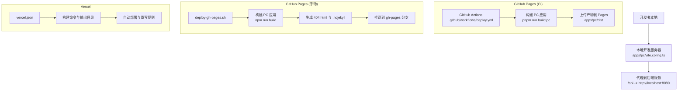
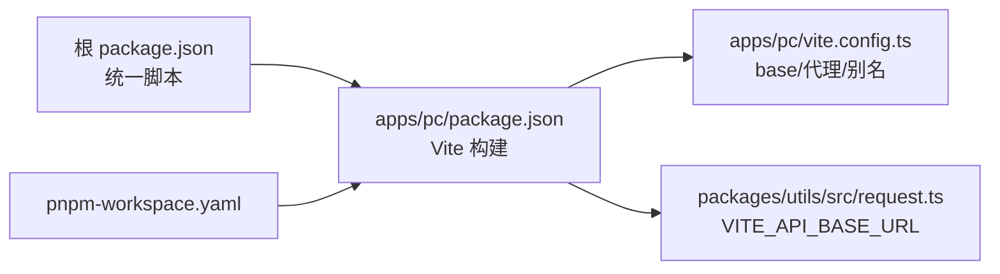

# 环境部署

<cite>
**本文引用的文件**   
- [deploy.yml](file://.github/workflows/deploy.yml)
- [vercel.json](file://vercel.json)
- [deploy-gh-pages.sh](file://deploy-gh-pages.sh)
- [package.json](file://package.json)
- [pnpm-workspace.yaml](file://pnpm-workspace.yaml)
- [apps/pc/package.json](file://apps/pc/package.json)
- [apps/pc/vite.config.ts](file://apps/pc/vite.config.ts)
- [.gitignore](file://.gitignore)
- [packages/utils/src/request.ts](file://packages/utils/src/request.ts)
- [packages/api/src/vite-env.d.ts](file://packages/api/src/vite-env.d.ts)
</cite>

## 目录
1. [简介](#简介)
2. [项目结构](#项目结构)
3. [核心组件](#核心组件)
4. [架构总览](#架构总览)
5. [详细组件分析](#详细组件分析)
6. [依赖分析](#依赖分析)
7. [性能考虑](#性能考虑)
8. [故障排查指南](#故障排查指南)
9. [结论](#结论)
10. [附录](#附录)

## 简介
本文件面向运维与开发团队，提供工程材料管理平台在不同环境下的部署指南，覆盖以下内容：
- GitHub Pages 自动化部署（CI/CD）与手动部署脚本
- Vercel 托管部署配置
- 本地开发服务器启动与代理配置
- 域名与 CNAME 文件设置、HTTPS 配置要点
- 开发、测试、生产环境的部署差异与注意事项
- 部署前检查清单、常见问题排查与回滚策略

## 项目结构
该仓库采用 monorepo 结构，PC 端应用位于 apps/pc，通过 pnpm workspace 管理多包协作；根目录提供统一的构建与运行脚本。

图表来源
- [package.json:6-12](file://package.json#L6-L12)
- [pnpm-workspace.yaml:1-4](file://pnpm-workspace.yaml#L1-L4)
- [.github/workflows/deploy.yml:1-59](file://.github/workflows/deploy.yml#L1-L59)
- [vercel.json:1-11](file://vercel.json#L1-L11)
- [deploy-gh-pages.sh:1-27](file://deploy-gh-pages.sh#L1-L27)
- [apps/pc/package.json:6-12](file://apps/pc/package.json#L6-L12)
- [apps/pc/vite.config.ts:5-26](file://apps/pc/vite.config.ts#L5-L26)

章节来源
- [package.json:6-12](file://package.json#L6-L12)
- [pnpm-workspace.yaml:1-4](file://pnpm-workspace.yaml#L1-L4)

## 核心组件
- 统一构建与运行脚本：根 package.json 提供 dev:pc、build:pc 等跨包脚本，便于在 monorepo 中统一调用。
- Vite 构建与代理：apps/pc 的 vite.config.ts 定义了 base 路径、本地开发代理、路径别名等，直接影响部署路径与开发体验。
- CI/CD 部署：GitHub Actions 在主分支推送或手动触发时自动构建并发布到 GitHub Pages。
- 手动部署脚本：deploy-gh-pages.sh 支持本地一键构建、生成 SPA 路由所需的 404 页面、禁用 Jekyll，并推送到 gh-pages 分支。
- Vercel 配置：vercel.json 定义构建命令、输出目录与重写规则，适配子路径部署与 SPA 路由。
- 请求与环境变量：packages/utils/src/request.ts 使用 import.meta.env.VITE_API_BASE_URL 作为后端接口前缀，packages/api/src/vite-env.d.ts 声明 VITE_API_URL 类型，用于前后端联调与部署配置。

章节来源
- [apps/pc/package.json:6-12](file://apps/pc/package.json#L6-L12)
- [apps/pc/vite.config.ts:5-26](file://apps/pc/vite.config.ts#L5-L26)
- [.github/workflows/deploy.yml:1-59](file://.github/workflows/deploy.yml#L1-L59)
- [deploy-gh-pages.sh:1-27](file://deploy-gh-pages.sh#L1-L27)
- [vercel.json:1-11](file://vercel.json#L1-L11)
- [packages/utils/src/request.ts:8-8](file://packages/utils/src/request.ts#L8-L8)
- [packages/api/src/vite-env.d.ts:3-5](file://packages/api/src/vite-env.d.ts#L3-L5)

## 架构总览
下图展示三种部署方式的总体流程与关键配置点：

图表来源
- [apps/pc/vite.config.ts:17-25](file://apps/pc/vite.config.ts#L17-L25)
- [.github/workflows/deploy.yml:36-47](file://.github/workflows/deploy.yml#L36-L47)
- [deploy-gh-pages.sh:12-23](file://deploy-gh-pages.sh#L12-L23)
- [vercel.json:3-10](file://vercel.json#L3-L10)

## 详细组件分析

### GitHub Pages 自动化部署（CI）
- 触发条件：向 main 分支推送或手动触发 workflow_dispatch。
- 关键步骤：
  - 安装 pnpm（版本固定）
  - 安装依赖
  - 构建 PC 应用（设置 VITE_BASE_URL 以支持子路径）
  - 配置 GitHub Pages 并上传 dist 产物
  - 部署到 Pages
- 环境变量：VITE_BASE_URL 由 CI 注入，值为仓库名对应的子路径，确保静态资源与路由正确。
- 注意事项：
  - Pages 仅支持静态托管，不支持服务端逻辑。
  - 若自定义域名，请参考“域名与 HTTPS”章节。

章节来源
- [.github/workflows/deploy.yml:1-59](file://.github/workflows/deploy.yml#L1-L59)

### GitHub Pages 手动部署脚本
- 功能：本地一键构建、生成 SPA 路由所需文件、禁用 Jekyll、推送到 gh-pages 分支。
- 步骤要点：
  - 进入 apps/pc 目录执行构建
  - 复制 index.html 为 404.html，保证 SPA 路由回退
  - 创建 .nojekyll，避免 GitHub Pages 使用 Jekyll 渲染
  - 使用 gh-pages 推送 dist 到 gh-pages 分支
- 输出：控制台打印访问地址，便于快速验证。

章节来源
- [deploy-gh-pages.sh:1-27](file://deploy-gh-pages.sh#L1-L27)

### Vercel 部署配置
- 构建命令：在 apps/pc 目录执行构建
- 输出目录：apps/pc/dist
- 安装命令：pnpm install
- 重写规则：
  - 将 /gongchengcang/(.*) 重写到 /$1，适配子路径部署
  - 将 /(.*) 重写到 /，实现 SPA 路由兜底
- 适用场景：需要更灵活的重写、缓存与边缘优化的线上托管。

章节来源
- [vercel.json:1-11](file://vercel.json#L1-L11)

### 本地开发服务器启动
- 启动命令：根 package.json 提供 dev:pc，内部调用 apps/pc 的 Vite 开发服务器。
- 本地代理：vite.config.ts 将 /api 代理到 http://localhost:8080，便于联调后端。
- 路径别名：@ 及 @gongchengcang/* 指向 packages 与 apps 对应源码，提升开发体验。
- 端口与主机：server.host 与 server.port 可在本地调整。

章节来源
- [package.json:7-7](file://package.json#L7-L7)
- [apps/pc/package.json:7-7](file://apps/pc/package.json#L7-L7)
- [apps/pc/vite.config.ts:17-25](file://apps/pc/vite.config.ts#L17-L25)

### 域名与 CNAME 文件设置、HTTPS 配置
- GitHub Pages 子路径：CI 与手动脚本均通过 VITE_BASE_URL 或子路径部署，无需额外 CNAME 文件。
- 自定义域名：若需绑定自定义域名，可在仓库 Settings → Pages 中添加自定义域名；如需启用 HTTPS，确保域名解析生效且 Pages 启用自定义域名。
- Vercel：在 Vercel 控制台绑定自定义域名并启用 SSL；重写规则可配合子路径部署。
- 注意：本仓库未提供 CNAME 文件，如需自定义域名请在对应平台进行配置。

章节来源
- [.github/workflows/deploy.yml:38-39](file://.github/workflows/deploy.yml#L38-L39)
- [apps/pc/vite.config.ts:6-6](file://apps/pc/vite.config.ts#L6-L6)

### 开发、测试、生产环境的部署差异与注意事项
- 开发环境
  - 使用本地 Vite 代理 /api 到后端服务
  - 通过 import.meta.env.VITE_API_BASE_URL 指向后端接口
- 测试环境
  - 保持与开发一致的代理与 base 配置，但指向测试后端
  - 如使用 Pages/Vercel，需在对应平台设置环境变量或构建参数
- 生产环境
  - GitHub Pages：通过 CI 自动部署，使用仓库名子路径
  - Vercel：通过 vercel.json 配置子路径与重写，便于多环境共存
- 共同注意：
  - SPA 路由必须生成 404.html 或配置重写规则
  - 确保 base 路径与实际部署路径一致
  - 代理与后端接口域名需与生产环境一致

章节来源
- [apps/pc/vite.config.ts:6-6](file://apps/pc/vite.config.ts#L6-L6)
- [apps/pc/vite.config.ts:17-25](file://apps/pc/vite.config.ts#L17-L25)
- [packages/utils/src/request.ts:8-8](file://packages/utils/src/request.ts#L8-L8)

## 依赖分析
- monorepo 工作区：pnpm-workspace.yaml 声明 packages/* 与 apps/* 为工作区，统一安装与脚本分发。
- PC 应用依赖：apps/pc/package.json 定义 Vite、Vue、Pinia、Arco Design 等依赖，以及本地部署脚本。
- 请求层：packages/utils/src/request.ts 读取 import.meta.env.VITE_API_BASE_URL 作为接口前缀，确保在不同环境可切换。

图表来源
- [package.json:6-12](file://package.json#L6-L12)
- [pnpm-workspace.yaml:1-4](file://pnpm-workspace.yaml#L1-L4)
- [apps/pc/package.json:6-12](file://apps/pc/package.json#L6-L12)
- [apps/pc/vite.config.ts:5-16](file://apps/pc/vite.config.ts#L5-L16)
- [packages/utils/src/request.ts:8-8](file://packages/utils/src/request.ts#L8-L8)

章节来源
- [package.json:6-12](file://package.json#L6-L12)
- [pnpm-workspace.yaml:1-4](file://pnpm-workspace.yaml#L1-L4)
- [apps/pc/package.json:6-12](file://apps/pc/package.json#L6-L12)
- [apps/pc/vite.config.ts:5-16](file://apps/pc/vite.config.ts#L5-L16)
- [packages/utils/src/request.ts:8-8](file://packages/utils/src/request.ts#L8-L8)

## 性能考虑
- 构建产物：开启 sourcemap 便于调试，生产建议关闭或仅在必要时启用。
- 代理与网络：本地开发使用 /api 代理减少跨域与复杂鉴权处理；生产环境建议直接配置 CORS 与安全头。
- CDN 与缓存：Vercel 默认具备边缘缓存能力，结合 vercel.json 的重写规则可优化首屏加载。
- 资源体积：合理拆分路由与组件，避免单页过大；按需加载与懒路由有助于提升性能。

章节来源
- [apps/pc/vite.config.ts:29-29](file://apps/pc/vite.config.ts#L29-L29)

## 故障排查指南
- 404 页面导致的路由异常
  - 症状：刷新或直连路由报错
  - 解决：确保生成 404.html 或在托管平台配置 SPA 路由兜底
  - 参考：手动脚本中复制 index.html 为 404.html 的步骤
- base 路径不匹配
  - 症状：静态资源 404 或路由错位
  - 解决：确认 VITE_BASE_URL 与部署路径一致；GitHub Pages 使用仓库名子路径
  - 参考：CI 注入 VITE_BASE_URL；Vite base 默认子路径
- 代理未生效
  - 症状：前端无法访问后端接口
  - 解决：检查 vite.config.ts 的 /api 代理目标是否正确；确认后端服务可达
- 环境变量未生效
  - 症状：接口前缀错误或鉴权失败
  - 解决：检查 import.meta.env.VITE_API_BASE_URL 设置；在托管平台或本地 .env 中配置
- CI/CD 失败
  - 症状：构建失败或 Pages 未更新
  - 解决：检查 Node 版本、pnpm 安装、构建命令与输出目录；确认 Pages 权限
- Vercel 重写不生效
  - 症状：子路径访问 404
  - 解决：核对 vercel.json 的 rewrites 字段与实际部署路径

章节来源
- [deploy-gh-pages.sh:15-16](file://deploy-gh-pages.sh#L15-L16)
- [.github/workflows/deploy.yml:38-39](file://.github/workflows/deploy.yml#L38-L39)
- [apps/pc/vite.config.ts:6-6](file://apps/pc/vite.config.ts#L6-L6)
- [apps/pc/vite.config.ts:20-24](file://apps/pc/vite.config.ts#L20-L24)
- [packages/utils/src/request.ts:8-8](file://packages/utils/src/request.ts#L8-L8)
- [vercel.json:6-9](file://vercel.json#L6-L9)

## 结论
本部署文档提供了从本地开发到 GitHub Pages 与 Vercel 的完整部署路径。通过统一的 monorepo 脚本、明确的 base 路径与代理配置、以及 CI/CD 与手动脚本的互补，团队可以稳定地在不同环境中交付应用。建议在生产环境优先使用 Vercel 以获得更好的性能与可维护性，同时保留 GitHub Pages 作为快速预览与演示的选择。

## 附录

### 部署前检查清单
- 本地开发
  - 确认本地代理 /api 可达后端服务
  - 确认 import.meta.env.VITE_API_BASE_URL 指向正确后端
- GitHub Pages（CI）
  - 确认主分支推送权限与 Pages 权限
  - 确认 VITE_BASE_URL 与仓库名一致
- GitHub Pages（手动）
  - 确认已安装 gh-pages 并可执行 npx gh-pages
  - 确认 dist 目录包含 404.html 与 .nojekyll
- Vercel
  - 确认 vercel.json 的构建命令、输出目录与重写规则
  - 确认已绑定自定义域名并启用 SSL（如需）

章节来源
- [.github/workflows/deploy.yml:9-12](file://.github/workflows/deploy.yml#L9-L12)
- [deploy-gh-pages.sh:15-19](file://deploy-gh-pages.sh#L15-L19)
- [vercel.json:3-10](file://vercel.json#L3-L10)

### 回滚策略
- GitHub Pages
  - 保留历史提交与 gh-pages 分支，必要时回退到上一个稳定提交
  - 如需快速回滚，可重新触发最近一次成功的 CI 任务
- Vercel
  - 在 Vercel 控制台选择“回滚到上次成功部署”
  - 若需更细粒度回滚，可基于 Git 标签或分支进行回滚
- 本地
  - 使用版本控制回退到上一个稳定构建

章节来源
- [.github/workflows/deploy.yml:49-59](file://.github/workflows/deploy.yml#L49-L59)
- [vercel.json:1-11](file://vercel.json#L1-L11)