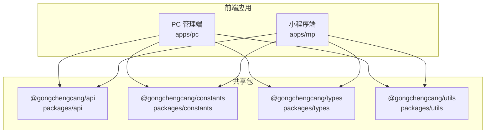
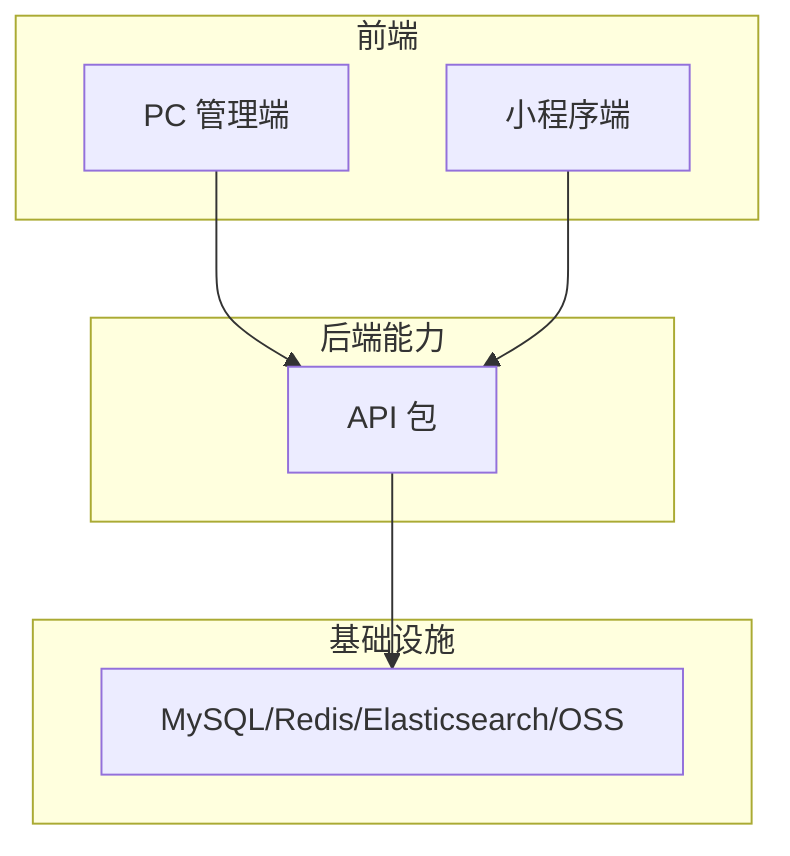
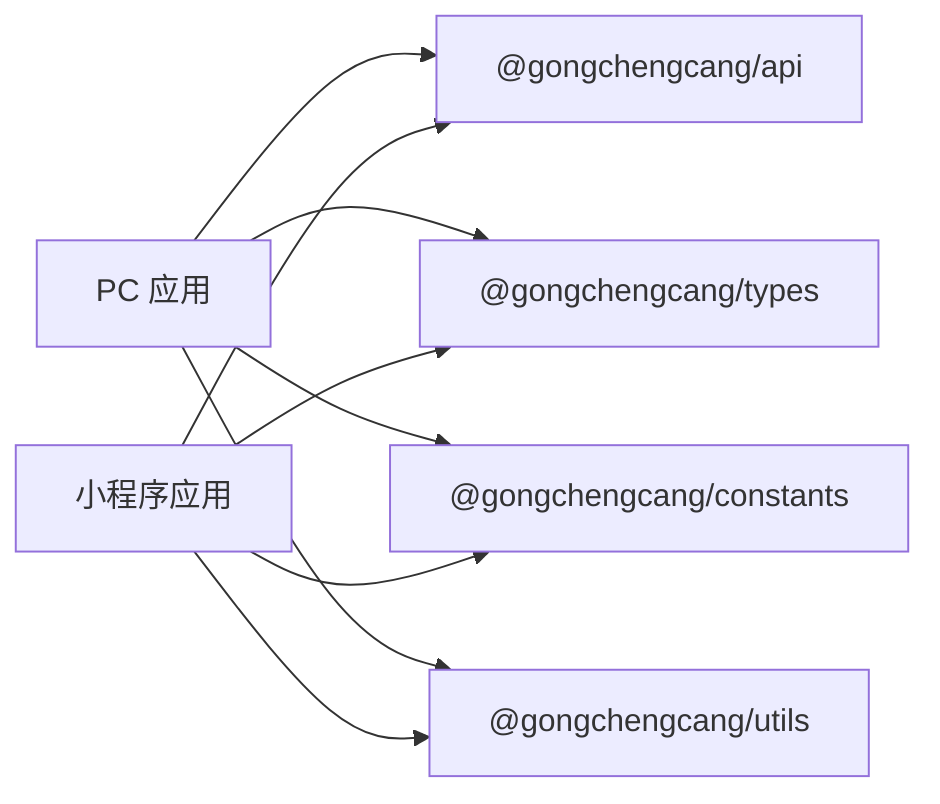

# 监控运维

<cite>
**本文引用的文件**
- [package.json](file://package.json)
- [apps/mp/package.json](file://apps/mp/package.json)
- [apps/pc/package.json](file://apps/pc/package.json)
- [packages/api/src/index.ts](file://packages/api/src/index.ts)
- [packages/constants/src/index.ts](file://packages/constants/src/index.ts)
- [packages/types/src/index.ts](file://packages/types/src/index.ts)
- [packages/utils/src/index.ts](file://packages/utils/src/index.ts)
- [docs/PRD/01-系统概览与架构.md](file://docs/PRD/01-系统概览与架构.md)
- [vercel.json](file://vercel.json)
- [.github/workflows/deploy.yml](file://.github/workflows/deploy.yml)
</cite>

## 目录
1. [简介](#简介)
2. [项目结构](#项目结构)
3. [核心组件](#核心组件)
4. [架构总览](#架构总览)
5. [详细组件分析](#详细组件分析)
6. [依赖分析](#依赖分析)
7. [性能考虑](#性能考虑)
8. [故障排查指南](#故障排查指南)
9. [结论](#结论)
10. [附录](#附录)

## 简介
本监控运维文档面向“工程材料管理采供一体化平台”，目标是帮助运维团队建立完善的监控体系，覆盖应用性能监控、错误日志收集、用户行为分析与系统健康检查；并提供告警规则建议、日志管理策略、性能基准测试方法、运维工具使用、故障排查流程、数据备份策略、安全加固措施、最佳实践、应急预案与版本升级策略，确保系统稳定运行。

## 项目结构
该工程采用多包工作区（monorepo）组织方式，前端包含 PC 管理端与小程序端，后端能力通过统一的 API 包进行导出，公共常量、类型与工具以独立包提供复用。部署方面，PC 端可本地预览或通过 GitHub Actions 在 Vercel 上部署。

图表来源
- [apps/pc/package.json:1-36](file://apps/pc/package.json#L1-L36)
- [apps/mp/package.json:1-39](file://apps/mp/package.json#L1-L39)
- [packages/api/src/index.ts:1-11](file://packages/api/src/index.ts#L1-L11)
- [packages/constants/src/index.ts:1-7](file://packages/constants/src/index.ts#L1-L7)
- [packages/types/src/index.ts:1-10](file://packages/types/src/index.ts#L1-L10)
- [packages/utils/src/index.ts:1-7](file://packages/utils/src/index.ts#L1-L7)

章节来源
- [package.json:1-23](file://package.json#L1-L23)
- [apps/pc/package.json:1-36](file://apps/pc/package.json#L1-L36)
- [apps/mp/package.json:1-39](file://apps/mp/package.json#L1-L39)
- [packages/api/src/index.ts:1-11](file://packages/api/src/index.ts#L1-L11)
- [packages/constants/src/index.ts:1-7](file://packages/constants/src/index.ts#L1-L7)
- [packages/types/src/index.ts:1-10](file://packages/types/src/index.ts#L1-L10)
- [packages/utils/src/index.ts:1-7](file://packages/utils/src/index.ts#L1-L7)

## 核心组件
- 前端应用
  - PC 管理端：基于 Vue 3 + Vite，Arco Design 组件库，提供平台端、供应商端、工程仓端等管理功能。
  - 小程序端：基于 uni-app，支持微信/支付宝小程序，覆盖工程仓、供应商、施工方端的移动端场景。
- 共享包
  - API 包：集中导出认证、用户、商户、商品、订单、仓库、财务、托管、分账规则等模块接口。
  - 常量包：导出用户、商户、订单、商品、仓库、财务等领域的常量定义。
  - 类型包：导出用户、商户、商品、订单、仓库、财务、通用、分账规则、市场等类型声明。
  - 工具包：导出格式化、校验、存储、请求、日期、树形结构等工具函数。
- 部署与 CI/CD
  - 本地开发与构建脚本在各应用包内定义。
  - GitHub Actions 工作流负责自动化部署。
  - Vercel JSON 提供部署配置入口。

章节来源
- [apps/pc/package.json:1-36](file://apps/pc/package.json#L1-L36)
- [apps/mp/package.json:1-39](file://apps/mp/package.json#L1-L39)
- [packages/api/src/index.ts:1-11](file://packages/api/src/index.ts#L1-L11)
- [packages/constants/src/index.ts:1-7](file://packages/constants/src/index.ts#L1-L7)
- [packages/types/src/index.ts:1-10](file://packages/types/src/index.ts#L1-L10)
- [packages/utils/src/index.ts:1-7](file://packages/utils/src/index.ts#L1-L7)
- [.github/workflows/deploy.yml](file://.github/workflows/deploy.yml)
- [vercel.json](file://vercel.json)

## 架构总览
系统采用多端架构，前端 PC 与小程序分别承载不同角色的业务操作，后端能力通过统一 API 包抽象。PRD 文档中明确了系统拓扑、多端功能矩阵与核心业务模块，为监控与运维提供了边界与范围。

图表来源
- [docs/PRD/01-系统概览与架构.md:64-94](file://docs/PRD/01-系统概览与架构.md#L64-L94)
- [apps/pc/package.json:14-24](file://apps/pc/package.json#L14-L24)
- [apps/mp/package.json:12-23](file://apps/mp/package.json#L12-L23)

章节来源
- [docs/PRD/01-系统概览与架构.md:62-94](file://docs/PRD/01-系统概览与架构.md#L62-L94)

## 详细组件分析

### 监控指标定义
- 应用性能指标
  - 前端
    - 首屏加载时间、交互延迟、路由切换耗时、关键资源体积。
    - 接口成功率、平均/95 分位响应时间、超时率。
    - 前端错误率（JS 异常、资源加载失败、网络错误）。
  - 后端
    - 接口 QPS、成功率、平均/95 分位响应时间、P99 延迟。
    - 数据库查询耗时、慢查询比例、连接池使用率。
    - 缓存命中率、缓存失效与重建频率。
    - 文件存储（OSS）上传/下载吞吐与错误率。
- 可用性与健康
  - 服务存活探针、健康检查端点返回状态。
  - 关键业务流程（下单、支付、结算）的端到端可用性。
- 日志与审计
  - 请求日志（含用户标识、租户标识、操作时间、耗时、结果）。
  - 关键操作审计日志（新增/修改/删除、权限变更、资金变动）。
  - 错误日志（异常堆栈、上下文参数、重试次数）。
- 用户行为分析
  - 页面访问路径、功能模块使用频次、关键转化漏斗。
  - 登录/注册、下单、支付、发票申请等关键事件追踪。
- 安全与合规
  - 登录失败、越权访问、敏感操作告警。
  - HTTPS/TLS 证书到期提醒、弱密码与弱口令检测。

章节来源
- [docs/PRD/01-系统概览与架构.md:554-581](file://docs/PRD/01-系统概览与架构.md#L554-L581)

### 告警规则配置
- 前端
  - 首屏加载 > 2 秒占比超过阈值。
  - 关键接口 95 分位响应 > 500ms 或失败率 > 1%。
  - 前端错误率突增（如 JS 异常/资源加载失败）。
- 后端
  - 接口 P99 响应 > 1 秒或失败率 > 0.5%。
  - 数据库慢查询占比 > 5%，连接池空闲/活跃异常。
  - 缓存命中率骤降或失效频繁。
  - OSS 上传/下载错误率 > 1%。
- 基础设施
  - CPU/内存/磁盘 IO 异常，磁盘空间不足。
  - 网络延迟/丢包异常，DNS 解析失败。
- 安全
  - 登录失败/暴力破解尝试、越权访问、敏感操作未授权。
  - 证书即将过期或已过期。
- 建议
  - 采用分级告警（P1/P2/P3），区分紧急修复与观察项。
  - 为关键业务流程设置端到端可用性告警。
  - 对高频告警设置静默窗口与抑制规则，避免噪声。

章节来源
- [docs/PRD/01-系统概览与架构.md:556-564](file://docs/PRD/01-系统概览与架构.md#L556-L564)

### 日志管理策略
- 日志采集
  - 前端：上报关键错误与性能指标至日志平台；埋点 SDK 记录用户行为事件。
  - 后端：统一输出结构化 JSON 日志，包含时间戳、级别、服务名、租户/用户 ID、请求链路 ID、模块、方法、耗时、结果码。
- 存储与保留
  - 前端错误与性能日志短期保留（7-14 天），长期归档。
  - 后端审计与业务日志按月/季度归档，保留 3-12 个月视法规而定。
- 查询与可视化
  - 使用日志检索与仪表板，建立关键指标看板（QPS、错误率、P95 延迟、缓存命中率）。
- 合规与脱敏
  - 对手机号、身份证号、银行卡号等敏感字段脱敏或掩码处理。
  - 审计日志不可篡改，满足监管要求。

章节来源
- [docs/PRD/01-系统概览与架构.md:565-571](file://docs/PRD/01-系统概览与架构.md#L565-L571)

### 性能基准测试
- 前端
  - 使用 Lighthouse、WebPageTest 等工具评估首屏加载与交互延迟。
  - 基于 Vite 预览环境进行压力测试，模拟并发用户与关键页面访问。
- 后端
  - 使用 JMeter/Artillery/K6 等压测工具，针对核心接口（商品查询、下单、支付）施加负载。
  - 关注数据库慢查询、缓存命中率变化与线程池/连接池饱和情况。
- 基础设施
  - 对 OSS 上传/下载进行吞吐与延迟测试，评估带宽与节点分布。
- 结果与优化
  - 输出基准报告，识别瓶颈并制定优化方案（缓存策略、索引优化、CDN 加速、异步处理）。

章节来源
- [apps/pc/package.json:6-12](file://apps/pc/package.json#L6-L12)
- [apps/mp/package.json:5-11](file://apps/mp/package.json#L5-L11)

### 运维工具使用
- 前端
  - DevTools 性能分析、Network 面板监控接口质量。
  - 性能监控 SDK（如埋点 SDK）接入与可视化看板。
- 后端
  - APM 工具（如 SkyWalking/OpenTelemetry）接入，采集 Trace/Metrics/Logs。
  - Prometheus/Grafana 搭建监控与告警。
- 自动化
  - GitHub Actions 工作流执行构建与部署。
  - Vercel 部署配置与预览分支管理。

章节来源
- [.github/workflows/deploy.yml](file://.github/workflows/deploy.yml)
- [vercel.json](file://vercel.json)

### 故障排查流程
- 快速定位
  - 查看健康检查与存活探针状态，确认服务可用性。
  - 检查关键接口错误日志与链路追踪，定位异常模块。
- 影响面评估
  - 依据用户/租户维度与业务流程，评估受影响范围。
- 临时处置
  - 降级非关键功能、启用备用缓存/存储、回滚最近变更。
- 根因分析
  - 复现问题、分析日志与指标、形成根因报告与改进措施。
- 复盘与改进
  - 更新监控阈值与告警规则，补充预案与演练。

章节来源
- [docs/PRD/01-系统概览与架构.md:554-581](file://docs/PRD/01-系统概览与架构.md#L554-L581)

### 数据备份策略
- 数据库
  - 定期全量备份 + 增量/日志备份，异地容灾。
  - 备份校验与恢复演练，确保可恢复性。
- 配置与代码
  - CI/CD 配置、部署脚本纳入版本管理。
  - 关键配置（密钥、证书）加密存储与轮换。
- 日志与审计
  - 审计日志与业务日志定期归档与离线保存。

章节来源
- [docs/PRD/01-系统概览与架构.md:565-571](file://docs/PRD/01-系统概览与架构.md#L565-L571)

### 安全加固措施
- 认证与授权
  - JWT + 刷新令牌，RBAC 权限模型，最小权限原则。
- 传输与存储
  - HTTPS/TLS，敏感字段 AES 加密存储。
- 审计与合规
  - 关键操作审计日志，合规留存与不可抵赖。
- 边界防护
  - WAF/DDoS 防护，API 限流与熔断，输入校验与参数过滤。

章节来源
- [docs/PRD/01-系统概览与架构.md:565-571](file://docs/PRD/01-系统概览与架构.md#L565-L571)

### 运维最佳实践
- 监控先行：在开发阶段即埋点与打点，上线即有可观测性。
- 告警精简：避免噪声，聚焦高价值指标与业务关键路径。
- 渐进式发布：灰度/蓝绿发布，快速回滚。
- 文化建设：故障复盘常态化，知识沉淀与培训。

章节来源
- [docs/PRD/01-系统概览与架构.md:554-581](file://docs/PRD/01-系统概览与架构.md#L554-L581)

### 应急预案
- 重大故障（P1）
  - 立即成立应急小组，启动降级与隔离策略，优先保障核心链路。
  - 通过短信/邮件/企业微信通知相关方，同步进展。
- 中等故障（P2/P3）
  - 按照标准流程处置，必要时升级为 P1。
- 预案演练
  - 定期组织演练，验证告警、处置流程与沟通机制。

章节来源
- [docs/PRD/01-系统概览与架构.md:554-581](file://docs/PRD/01-系统概览与架构.md#L554-L581)

### 版本升级策略
- 开发与测试
  - 本地与 CI 环境充分测试，包括性能与兼容性。
- 灰度发布
  - 小流量验证，逐步扩大范围，观察指标与日志。
- 回滚准备
  - 保持二进制与配置可回滚，准备好回滚脚本与预案。
- 上线后观察
  - 密切关注关键指标与告警，准备应急处置。

章节来源
- [apps/pc/package.json:6-12](file://apps/pc/package.json#L6-L12)
- [apps/mp/package.json:5-11](file://apps/mp/package.json#L5-L11)

## 依赖分析
- 前端依赖关系
  - PC 端依赖 Arco Design、Vue Router、Pinia、@gongchengcang/api/types/constants/utils。
  - 小程序端依赖 uni-app 生态与相同共享包。
- 共享包依赖
  - API 包导出各领域模块接口，供前端调用。
  - 常量/类型/工具包提供跨端一致性与复用。

图表来源
- [apps/pc/package.json:14-24](file://apps/pc/package.json#L14-L24)
- [apps/mp/package.json:12-23](file://apps/mp/package.json#L12-L23)
- [packages/api/src/index.ts:1-11](file://packages/api/src/index.ts#L1-L11)
- [packages/types/src/index.ts:1-10](file://packages/types/src/index.ts#L1-L10)
- [packages/constants/src/index.ts:1-7](file://packages/constants/src/index.ts#L1-L7)
- [packages/utils/src/index.ts:1-7](file://packages/utils/src/index.ts#L1-L7)

章节来源
- [apps/pc/package.json:14-24](file://apps/pc/package.json#L14-L24)
- [apps/mp/package.json:12-23](file://apps/mp/package.json#L12-L23)
- [packages/api/src/index.ts:1-11](file://packages/api/src/index.ts#L1-L11)
- [packages/types/src/index.ts:1-10](file://packages/types/src/index.ts#L1-L10)
- [packages/constants/src/index.ts:1-7](file://packages/constants/src/index.ts#L1-L7)
- [packages/utils/src/index.ts:1-7](file://packages/utils/src/index.ts#L1-L7)

## 性能考虑
- 前端
  - 代码分割与懒加载，减少首屏体积；CDN 加速静态资源。
  - 接口合并与缓存策略，降低重复请求。
- 后端
  - 数据库索引优化、读写分离、连接池调优。
  - 缓存热点数据，合理设置过期策略。
- 基础设施
  - CDN 与边缘节点优化，缩短用户访问距离。
  - 对 OSS 上传/下载进行带宽与节点优化。

章节来源
- [docs/PRD/01-系统概览与架构.md:556-564](file://docs/PRD/01-系统概览与架构.md#L556-L564)

## 故障排查指南
- 常见问题定位步骤
  - 检查健康检查与存活探针。
  - 查看关键接口错误日志与链路追踪。
  - 分析前端性能指标与错误上报。
  - 核对数据库慢查询与缓存命中率。
- 升级与回滚
  - 采用灰度发布，准备回滚脚本与配置。
- 证书与安全
  - 关注证书到期与安全扫描结果，及时处理。

章节来源
- [docs/PRD/01-系统概览与架构.md:554-581](file://docs/PRD/01-系统概览与架构.md#L554-L581)

## 结论
通过建立完善的监控体系、标准化的日志与告警策略、严格的备份与安全加固措施，以及规范的故障排查与版本升级流程，工程材料管理平台可以实现高可用、可观察与可持续演进的运维目标。建议在现有 monorepo 架构基础上，持续完善可观测性工具链与自动化运维流程。

## 附录
- 部署与 CI/CD
  - 本地开发与构建脚本位于各应用包内。
  - GitHub Actions 工作流负责自动化部署。
  - Vercel JSON 提供部署入口配置。

章节来源
- [apps/pc/package.json:6-12](file://apps/pc/package.json#L6-L12)
- [apps/mp/package.json:5-11](file://apps/mp/package.json#L5-L11)
- [.github/workflows/deploy.yml](file://.github/workflows/deploy.yml)
- [vercel.json](file://vercel.json)