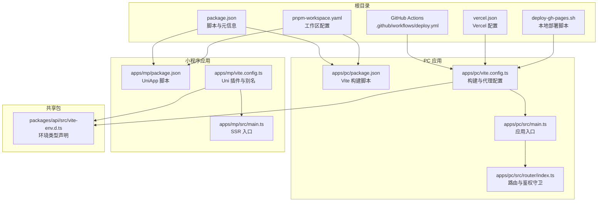
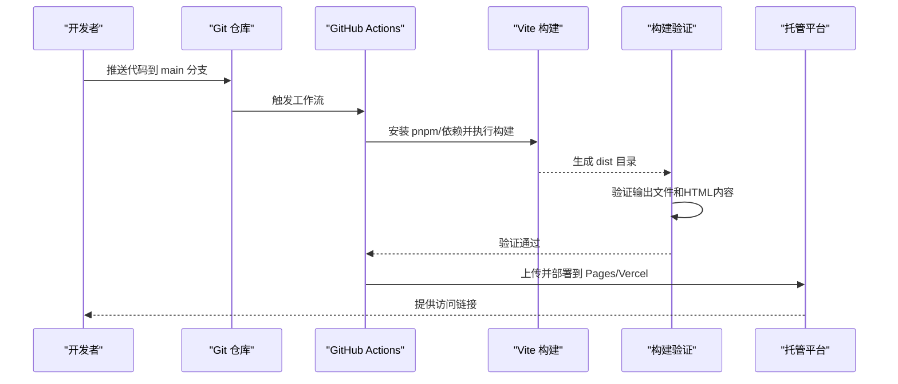
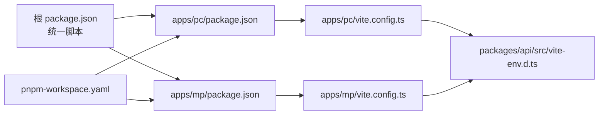

# 部署运维

<cite>
**本文引用的文件**
- [deploy.yml](file://.github/workflows/deploy.yml)
- [deploy-gh-pages.sh](file://deploy-gh-pages.sh)
- [vercel.json](file://vercel.json)
- [package.json](file://package.json)
- [pnpm-workspace.yaml](file://pnpm-workspace.yaml)
- [vite.config.ts（PC）](file://apps/pc/vite.config.ts)
- [vite.config.ts（MP）](file://apps/mp/vite.config.ts)
- [apps/pc/package.json](file://apps/pc/package.json)
- [apps/mp/package.json](file://apps/mp/package.json)
- [apps/pc/src/main.ts](file://apps/pc/src/main.ts)
- [apps/mp/src/main.ts](file://apps/mp/src/main.ts)
- [apps/pc/src/router/index.ts](file://apps/pc/src/router/index.ts)
- [packages/api/src/vite-env.d.ts](file://packages/api/src/vite-env.d.ts)
</cite>

## 更新摘要
**变更内容**
- 新增构建验证步骤，包括输出目录检查和HTML内容验证
- 优化部署配置，简化了构建流程和环境变量管理
- 改进了SPA路由支持，确保静态托管的完整性
- 增强了CI/CD流程的健壮性和可维护性

## 目录
1. [简介](#简介)
2. [项目结构](#项目结构)
3. [核心组件](#核心组件)
4. [架构总览](#架构总览)
5. [详细组件分析](#详细组件分析)
6. [依赖分析](#依赖分析)
7. [性能考虑](#性能考虑)
8. [故障排查指南](#故障排查指南)
9. [结论](#结论)
10. [附录](#附录)

## 简介
本部署运维文档面向工程材料管理平台（采供一体化平台），覆盖开发、测试、生产三类环境的部署配置与流程；涵盖构建配置、环境变量管理、域名与 SSL 设置、CI/CD 流程与自动化脚本、版本发布策略、Docker 容器化与云服务部署建议、监控告警、性能优化、安全加固与备份恢复策略。目标是帮助运维人员快速完成项目部署与日常维护。

## 项目结构
项目采用 monorepo 结构，使用 pnpm workspace 管理多包，前端包含 PC 端与小程序端两个应用，以及共享的 packages（api、constants、types、utils）。根目录提供统一的脚本与 CI/CD 配置，PC 应用通过 Vite 构建并支持 SPA 路由。

**图表来源**
- [package.json:6-12](file://package.json#L6-L12)
- [pnpm-workspace.yaml:1-4](file://pnpm-workspace.yaml#L1-L4)
- [.github/workflows/deploy.yml:1-66](file://.github/workflows/deploy.yml#L1-L66)
- [vercel.json:1-11](file://vercel.json#L1-L11)
- [deploy-gh-pages.sh:1-27](file://deploy-gh-pages.sh#L1-L27)
- [apps/pc/vite.config.ts:1-32](file://apps/pc/vite.config.ts#L1-L32)
- [apps/pc/package.json:6-12](file://apps/pc/package.json#L6-L12)
- [apps/pc/src/main.ts:1-19](file://apps/pc/src/main.ts#L1-L19)
- [apps/pc/src/router/index.ts:771-787](file://apps/pc/src/router/index.ts#L771-L787)
- [apps/mp/vite.config.ts:1-17](file://apps/mp/vite.config.ts#L1-L17)
- [apps/mp/package.json:5-11](file://apps/mp/package.json#L5-L11)
- [apps/mp/src/main.ts:1-14](file://apps/mp/src/main.ts#L1-L14)
- [packages/api/src/vite-env.d.ts:3-5](file://packages/api/src/vite-env.d.ts#L3-L5)

**章节来源**
- [package.json:6-12](file://package.json#L6-L12)
- [pnpm-workspace.yaml:1-4](file://pnpm-workspace.yaml#L1-L4)

## 核心组件
- 统一构建与脚本：根 package.json 提供跨应用的开发与构建脚本，PC 与 MP 分别在各自 package.json 中定义 Vite/Uni 的构建命令。
- 构建工具链：PC 使用 Vite，MP 使用 UniApp（基于 Vite），均通过 workspace 别名引用共享包。
- CI/CD：GitHub Actions 自动构建并部署至 GitHub Pages；同时提供本地部署脚本与 Vercel 配置文件。
- 环境变量：PC 构建时读取 VITE_BASE_URL；API 包声明了 VITE_API_URL 类型，用于后端接口地址等配置。
- SPA 路由：PC 应用使用 hash 模式与 base 前缀，配合 404.html 支持静态托管。

**章节来源**
- [apps/pc/vite.config.ts:6-6](file://apps/pc/vite.config.ts#L6-L6)
- [apps/pc/package.json:6-12](file://apps/pc/package.json#L6-L12)
- [apps/mp/package.json:5-11](file://apps/mp/package.json#L5-L11)
- [packages/api/src/vite-env.d.ts:3-5](file://packages/api/src/vite-env.d.ts#L3-L5)
- [.github/workflows/deploy.yml:36-47](file://.github/workflows/deploy.yml#L36-L47)
- [apps/pc/src/router/index.ts:771-774](file://apps/pc/src/router/index.ts#L771-L774)

## 架构总览
以下图展示从源码到产物再到托管的端到端流程，包括本地开发、CI/CD 自动化与静态托管两种部署路径。

**图表来源**
- [.github/workflows/deploy.yml:1-66](file://.github/workflows/deploy.yml#L1-L66)
- [apps/pc/vite.config.ts:27-30](file://apps/pc/vite.config.ts#L27-L30)
- [apps/pc/package.json:12-12](file://apps/pc/package.json#L12-L12)
- [vercel.json:3-4](file://vercel.json#L3-L4)

## 详细组件分析

### 开发环境部署
- 运行方式
  - PC：使用根脚本启动开发服务器，Vite 默认监听 0.0.0.0:8000，并配置 /api 代理到本地后端服务。
  - MP：使用 UniApp 脚本启动 H5 或微信小程序预览。
- 代理与端口
  - PC 构建配置中包含本地代理规则，便于前后端联调。
- 本地 SPA 支持
  - 本地部署脚本会复制 index.html 为 404.html，以支持静态托管的 SPA 路由回退。

**章节来源**
- [package.json:7-8](file://package.json#L7-L8)
- [apps/pc/vite.config.ts:17-26](file://apps/pc/vite.config.ts#L17-L26)
- [apps/mp/package.json:5-11](file://apps/mp/package.json#L5-L11)
- [deploy-gh-pages.sh:15-16](file://deploy-gh-pages.sh#L15-L16)

### 测试环境部署
- GitHub Pages 自动化
  - 推送 main 分支或手动触发工作流，自动安装 pnpm、安装依赖、构建 PC 应用并部署至 Pages。
  - 构建阶段通过环境变量设置 base URL，适配子路径部署。
- 本地测试
  - 可使用本地部署脚本在本地生成 dist 并进行预览，或直接使用 Vite 预览命令。

**章节来源**
- [.github/workflows/deploy.yml:1-66](file://.github/workflows/deploy.yml#L1-L66)
- [apps/pc/package.json:9-9](file://apps/pc/package.json#L9-L9)

### 生产环境部署
- 静态托管（GitHub Pages）
  - 通过 Actions 自动部署，适合纯前端静态站点。
- 云服务托管（Vercel）
  - 使用 vercel.json 指定构建命令、输出目录与重写规则，支持子路径与 SPA 回退。
- 本地部署脚本
  - 一键安装依赖、构建、生成 404.html 与 .nojekyll，并推送到 gh-pages 分支。

**章节来源**
- [.github/workflows/deploy.yml:36-47](file://.github/workflows/deploy.yml#L36-L47)
- [vercel.json:1-11](file://vercel.json#L1-L11)
- [deploy-gh-pages.sh:1-27](file://deploy-gh-pages.sh#L1-L27)

### 构建配置与产物
- PC 应用
  - 构建命令：vite build；输出目录 dist；开启 sourcemap。
  - 基础路径：默认读取 VITE_BASE_URL，未设置时使用默认前缀 `/gongchengcang/`。
  - 代理：/api 代理到本地后端服务。
- MP 应用
  - 使用 UniApp 插件，分别支持 H5 与微信小程序构建。
- 共享包
  - 通过 workspace 别名在 PC/MP 中引用 api、constants、types、utils。

**章节来源**
- [apps/pc/vite.config.ts:27-30](file://apps/pc/vite.config.ts#L27-L30)
- [apps/pc/vite.config.ts:6-6](file://apps/pc/vite.config.ts#L6-L6)
- [apps/pc/vite.config.ts:20-24](file://apps/pc/vite.config.ts#L20-L24)
- [apps/mp/vite.config.ts:1-17](file://apps/mp/vite.config.ts#L1-L17)
- [pnpm-workspace.yaml:1-4](file://pnpm-workspace.yaml#L1-L4)

### 环境变量管理
- VITE_BASE_URL
  - 用于设置应用基础路径，CI 中通过环境变量注入，保证 Pages 子路径可用。
- VITE_API_URL
  - 在 API 包中声明类型，用于后端接口地址等配置，可在不同环境设置不同值。
- 建议
  - 将敏感配置放入 CI 密钥或托管平台的环境变量管理，避免硬编码在仓库中。

**章节来源**
- [.github/workflows/deploy.yml:38-39](file://.github/workflows/deploy.yml#L38-L39)
- [apps/pc/vite.config.ts:6-6](file://apps/pc/vite.config.ts#L6-L6)
- [packages/api/src/vite-env.d.ts:3-5](file://packages/api/src/vite-env.d.ts#L3-L5)

### 域名与 SSL 配置
- GitHub Pages
  - 使用自定义域名时，需在仓库 Pages 设置中绑定域名，并在 DNS 中配置 CNAME。
  - Pages 默认启用 HTTPS，无需额外配置。
- Vercel
  - 在 Vercel 控制台绑定域名并启用 SSL，平台自动续期。
  - 通过 rewrites 规则实现子路径映射与 SPA 回退。

**章节来源**
- [.github/workflows/deploy.yml:50-52](file://.github/workflows/deploy.yml#L50-L52)
- [vercel.json:6-9](file://vercel.json#L6-L9)

### CI/CD 流程与自动化脚本
- GitHub Actions
  - 步骤：检出代码 → 安装 Node.js 与 pnpm → 安装依赖 → 构建 PC 应用 → 验证构建输出 → 创建 .nojekyll 和 404.html → 部署到 gh-pages。
  - 并发控制：同组任务并发取消，避免资源浪费。
- 本地脚本
  - 自动复制 404.html 与 .nojekyll，简化 gh-pages 分支推送。
- 建议
  - 在 Actions 中增加缓存步骤（如 pnpm-store）以提升速度；对构建产物进行校验后再部署。

**更新** 新增构建验证步骤，确保部署前产物完整性

**章节来源**
- [.github/workflows/deploy.yml:1-66](file://.github/workflows/deploy.yml#L1-L66)
- [deploy-gh-pages.sh:1-27](file://deploy-gh-pages.sh#L1-L27)

### 版本发布策略
- 建议采用语义化版本（SemVer），结合 Git 标签与变更日志进行发布。
- 发布流程
  - 合并主分支后触发 CI 构建与部署；成功后打标签并生成发布说明。
- 回滚策略
  - Pages/Vercel 支持回滚到上一个版本；也可保留历史构建产物以便快速回滚。

**章节来源**
- [.github/workflows/deploy.yml:1-16](file://.github/workflows/deploy.yml#L1-L16)

### Docker 容器化部署方案（建议）
- 多阶段构建
  - 基础镜像：node:alpine 安装 pnpm；第二阶段使用 nginx:alpine 托管 dist。
- 构建步骤
  - 安装依赖 → 构建 → 复制 dist 至 nginx 静态目录。
- 运行参数
  - 挂载环境变量（如 VITE_BASE_URL、VITE_API_URL）；暴露 80 端口。
- 健康检查
  - 配置简单健康检查，确保容器就绪。

### 云服务部署指南（建议）
- Vercel
  - 通过 vercel.json 配置构建与重写；在 Vercel 控制台绑定域名与 SSL。
- GitHub Pages
  - 使用 Actions 或本地脚本推送至 gh-pages 分支；配置自定义域名与 CNAME。
- Nginx/Apache
  - 将 dist 目录作为静态站点根目录；配置 gzip、缓存头与 SPA 回退。

**章节来源**
- [vercel.json:1-11](file://vercel.json#L1-L11)
- [.github/workflows/deploy.yml:41-47](file://.github/workflows/deploy.yml#L41-L47)
- [deploy-gh-pages.sh:18-19](file://deploy-gh-pages.sh#L18-L19)

### 监控告警配置（建议）
- 页面可用性
  - 使用 Uptime Kuma 或类似工具定时探测首页。
- 性能指标
  - 监控首屏时间、TTFB、资源体积；结合 CDN 日志分析。
- 错误追踪
  - 集成前端错误上报（如 Sentry），关注 404 与运行时异常。
- 告警策略
  - 设定阈值与收敛窗口，区分严重与一般级别。

### 性能优化建议
- 构建优化
  - 启用压缩与分包；合理拆分第三方库；开启 sourcemap 仅在需要时。
- 运行时优化
  - 使用 CDN 加速静态资源；开启 Gzip/Brotli；配置合理的缓存头。
- 路由与资源
  - 按需加载组件与页面；减少首屏资源体积；利用浏览器缓存。
- SPA 回退
  - 确保 404.html 与 .nojekyll 存在，避免托管平台重定向问题。

**章节来源**
- [apps/pc/vite.config.ts:29-29](file://apps/pc/vite.config.ts#L29-L29)
- [apps/pc/package.json:12-12](file://apps/pc/package.json#L12-L12)
- [deploy-gh-pages.sh:15-19](file://deploy-gh-pages.sh#L15-L19)

### 安全加固措施
- 环境变量
  - 不在客户端暴露敏感信息；通过 CI 密钥管理环境变量。
- 资源安全
  - 启用 CSP；限制外链资源；使用 HTTPS。
- 认证与授权
  - 路由守卫中校验令牌；避免明文传输；后端接口做好鉴权。
- 依赖安全
  - 定期更新依赖；使用 pnpm audit 或类似工具扫描漏洞。

**章节来源**
- [apps/pc/src/router/index.ts:776-787](file://apps/pc/src/router/index.ts#L776-L787)
- [packages/api/src/vite-env.d.ts:3-5](file://packages/api/src/vite-env.d.ts#L3-L5)

### 备份恢复策略
- 产物备份
  - 备份 dist 目录与构建缓存；在 CI 中归档构建产物。
- 配置备份
  - 备份 vercel.json、Actions 工作流与托管平台配置。
- 恢复演练
  - 定期进行恢复演练，验证从备份到可访问状态的时间。

### 构建验证流程优化
**新增** 项目引入了增强的构建验证机制，确保部署前产物的完整性和正确性。

- 验证步骤
  - 检查 dist 目录是否存在且包含必要的文件
  - 验证 index.html 内容，确保包含正确的基础路径配置
  - 确保 404.html 和 .nojekyll 文件正确生成

- 验证内容
  - 输出目录结构完整性检查
  - HTML 文件内容验证（包含基础路径和路由配置）
  - SPA 路由支持文件检查

**章节来源**
- [.github/workflows/deploy.yml:49-53](file://.github/workflows/deploy.yml#L49-L53)

## 依赖分析
- 工作区与别名
  - pnpm-workspace.yaml 声明 apps 与 packages 为工作区；PC/MP 通过别名引用共享包。
- 构建与运行
  - PC 使用 @vitejs/plugin-vue 与 Vite；MP 使用 @dcloudio/vite-plugin-uni 与 UniApp。
- 脚本耦合
  - 根 package.json 脚本调用各应用脚本，形成统一入口。

**图表来源**
- [package.json:6-12](file://package.json#L6-L12)
- [pnpm-workspace.yaml:1-4](file://pnpm-workspace.yaml#L1-L4)
- [apps/pc/package.json:6-12](file://apps/pc/package.json#L6-L12)
- [apps/mp/package.json:5-11](file://apps/mp/package.json#L5-L11)
- [apps/pc/vite.config.ts:8-15](file://apps/pc/vite.config.ts#L8-L15)
- [apps/mp/vite.config.ts:7-15](file://apps/mp/vite.config.ts#L7-L15)
- [packages/api/src/vite-env.d.ts:3-5](file://packages/api/src/vite-env.d.ts#L3-L5)

**章节来源**
- [package.json:6-12](file://package.json#L6-L12)
- [pnpm-workspace.yaml:1-4](file://pnpm-workspace.yaml#L1-L4)

## 性能考虑
- 构建阶段
  - 启用 sourcemap 仅在调试场景；生产构建关闭以减少体积。
  - 使用 pnpm 缓存与 Actions 缓存加速依赖安装。
- 运行阶段
  - 启用 Gzip/Brotli；合理设置缓存策略；CDN 加速静态资源。
- SPA 路由
  - 确保 404.html 与 .nojekyll 存在，避免托管平台重定向导致的性能损耗。

**章节来源**
- [apps/pc/vite.config.ts:29-29](file://apps/pc/vite.config.ts#L29-L29)
- [.github/workflows/deploy.yml:14-16](file://.github/workflows/deploy.yml#L14-L16)
- [deploy-gh-pages.sh:15-19](file://deploy-gh-pages.sh#L15-L19)

## 故障排查指南
- 404 与 SPA 路由
  - 确认 dist 目录存在 404.html 与 .nojekyll；检查 base 前缀是否正确。
- 代理与后端联调
  - 确认 /api 代理指向正确的后端地址；检查跨域与鉴权。
- CI 部署失败
  - 检查 pnpm 安装与构建命令；核对 VITE_BASE_URL 是否正确；查看 Pages 部署日志。
- 路由守卫与登录
  - 若出现循环跳转或无法进入受保护页面，检查路由守卫逻辑与令牌获取。
- 构建验证失败
  - 检查 dist 目录结构和文件完整性；验证 HTML 内容是否包含正确的基础路径配置。

**更新** 新增构建验证相关故障排查指导

**章节来源**
- [deploy-gh-pages.sh:15-19](file://deploy-gh-pages.sh#L15-L19)
- [apps/pc/vite.config.ts:20-24](file://apps/pc/vite.config.ts#L20-L24)
- [.github/workflows/deploy.yml:36-39](file://.github/workflows/deploy.yml#L36-L39)
- [apps/pc/src/router/index.ts:776-787](file://apps/pc/src/router/index.ts#L776-L787)

## 结论
本项目已具备完善的 monorepo 结构与自动化部署能力，支持 GitHub Pages 与 Vercel 两种主流静态托管方案。通过统一的脚本、明确的环境变量管理与 SPA 路由支持，运维人员可以快速完成开发、测试与生产的部署与维护。最新的部署流程优化包括增强的构建验证机制，确保了部署前产物的完整性和正确性。建议在现有基础上进一步完善 CI 缓存、监控告警与安全策略，以满足生产环境的稳定性与安全性要求。

## 附录
- 关键文件索引
  - 根脚本与工作区：[package.json:6-12](file://package.json#L6-L12)、[pnpm-workspace.yaml:1-4](file://pnpm-workspace.yaml#L1-L4)
  - PC 构建与路由：[apps/pc/vite.config.ts:1-32](file://apps/pc/vite.config.ts#L1-L32)、[apps/pc/src/router/index.ts:771-774](file://apps/pc/src/router/index.ts#L771-L774)
  - MP 构建与入口：[apps/mp/vite.config.ts:1-17](file://apps/mp/vite.config.ts#L1-L17)、[apps/mp/src/main.ts:1-14](file://apps/mp/src/main.ts#L1-L14)
  - CI/CD 与托管：[deploy.yml:1-66](file://.github/workflows/deploy.yml#L1-L66)、[vercel.json:1-11](file://vercel.json#L1-L11)、[deploy-gh-pages.sh:1-27](file://deploy-gh-pages.sh#L1-L27)
  - 环境变量类型：[packages/api/src/vite-env.d.ts:3-5](file://packages/api/src/vite-env.d.ts#L3-L5)