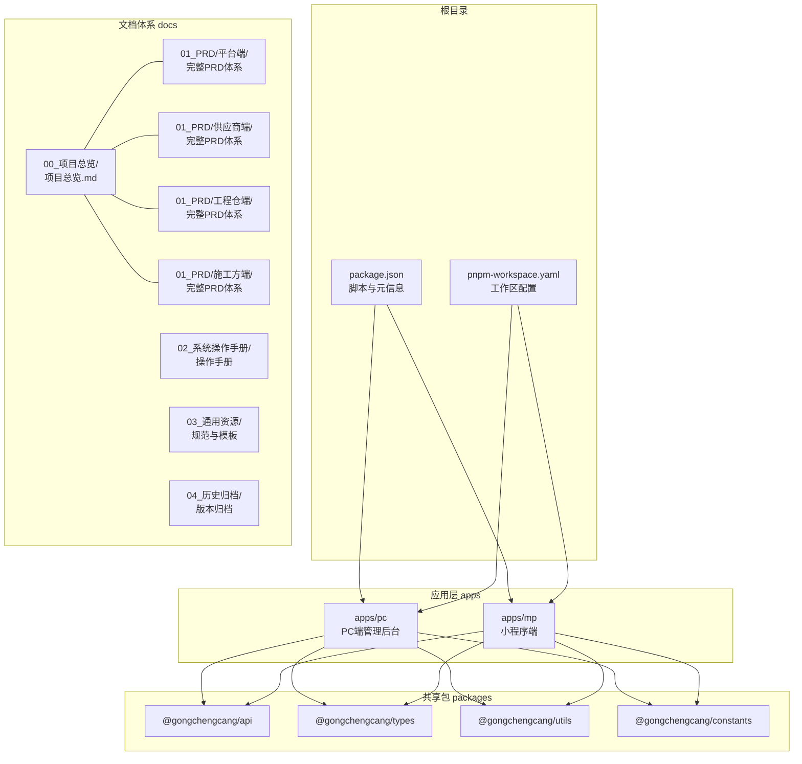
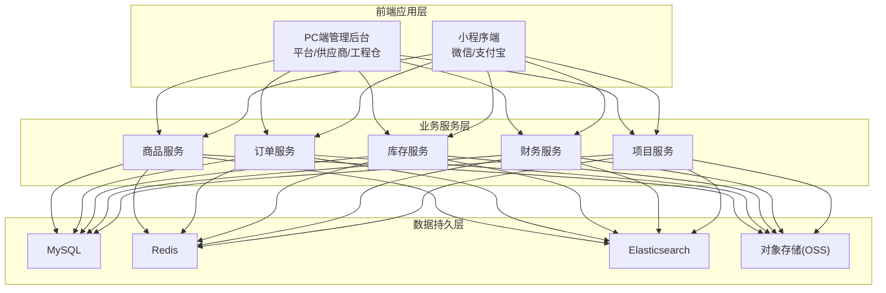
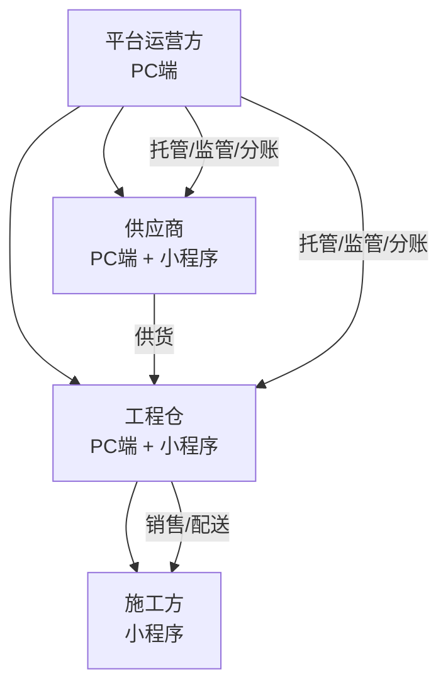
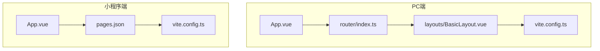
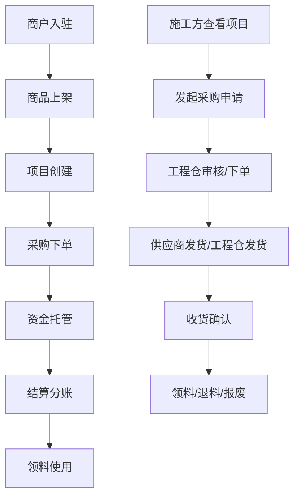
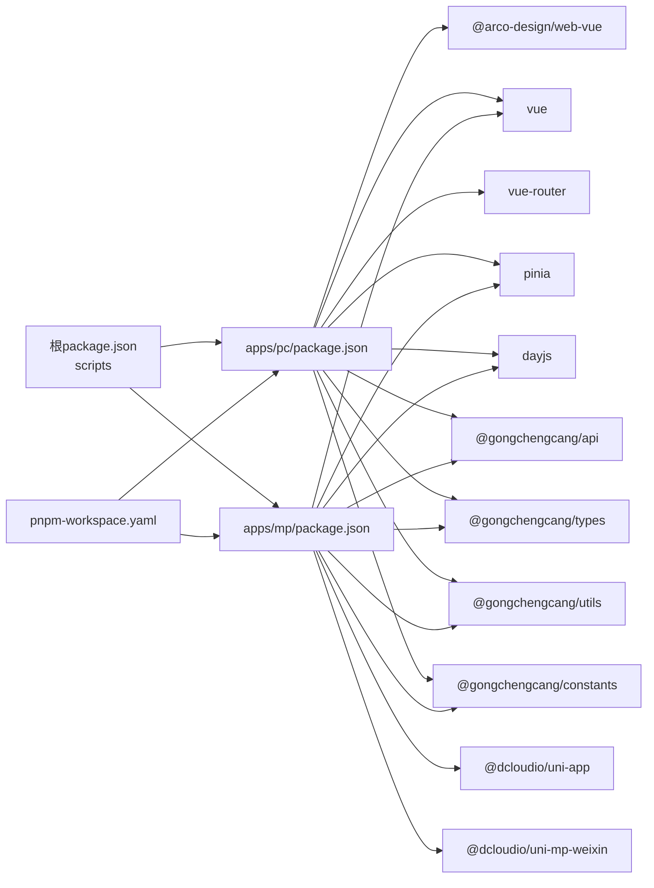

# 项目概述

<cite>
**本文引用的文件**
- [package.json](file://package.json)
- [pnpm-workspace.yaml](file://pnpm-workspace.yaml)
- [apps/pc/package.json](file://apps/pc/package.json)
- [apps/mp/package.json](file://apps/mp/package.json)
- [apps/pc/vite.config.ts](file://apps/pc/vite.config.ts)
- [apps/mp/vite.config.ts](file://apps/mp/vite.config.ts)
- [apps/pc/src/App.vue](file://apps/pc/src/App.vue)
- [apps/mp/src/App.vue](file://apps/mp/src/App.vue)
- [apps/pc/src/router/index.ts](file://apps/pc/src/router/index.ts)
- [apps/pc/src/layouts/BasicLayout.vue](file://apps/pc/src/layouts/BasicLayout.vue)
- [apps/mp/src/pages.json](file://apps/mp/src/pages.json)
- [docs/00_项目总览/项目总览.md](file://docs/00_项目总览/项目总览.md)
- [docs/01_PRD/平台端/01-系统概览与架构.md](file://docs/01_PRD/平台端/01-系统概览与架构.md)
- [docs/01_PRD/平台端/02-业务流程设计.md](file://docs/01_PRD/平台端/02-业务流程设计.md)
- [docs/01_PRD/供应商端/01-系统概览与架构.md](file://docs/01_PRD/供应商端/01-系统概览与架构.md)
- [docs/01_PRD/工程仓端/03-数据模型与表结构.md](file://docs/01_PRD/工程仓端/03-数据模型与表结构.md)
- [docs/01_PRD/施工方端/prd.md](file://docs/01_PRD/施工方端/prd.md)
- [docs/03_通用资源/03_规范/文档命名规范.md](file://docs/03_通用资源/03_规范/文档命名规范.md)
</cite>

## 更新摘要
**所做更改**
- 更新PRD文档组织方式，反映新的目录结构
- 移除版本期数相关的描述，采用新的文档命名规范
- 更新文档导航结构，反映按端划分的PRD组织方式
- 重新整理项目总览文档的结构和内容

## 目录
1. [引言](#引言)
2. [项目结构](#项目结构)
3. [核心组件](#核心组件)
4. [架构总览](#架构总览)
5. [详细组件分析](#详细组件分析)
6. [依赖分析](#依赖分析)
7. [性能考虑](#性能考虑)
8. [故障排查指南](#故障排查指南)
9. [结论](#结论)
10. [附录](#附录)

## 引言
本项目是面向建筑工程行业的"工程材料管理采供一体化平台"，定位为一个B2B工程材料管理SaaS平台，连接平台运营方、供应商、工程仓（采购方）与施工方，覆盖商品、订单、库存、财务、项目与系统管理等核心业务域，实现从"商户入驻—商品上架—项目分配—采购下单—资金托管—结算分账—现场领料"的全链路数字化闭环。

项目以"四端协同"为核心：平台端（PC Web）、供应商端（PC Web + 小程序）、工程仓端（PC Web + 小程序）、施工方端（小程序），通过统一的前端多端架构与共享的packages，支撑跨端一致体验与高复用能力。

**更新** 项目采用新的PRD文档组织方式，按端划分文档结构，移除了版本期数相关的描述，采用统一的文档命名规范。

## 项目结构
项目采用monorepo组织方式，根目录通过脚本与工作区配置统一管理前后端与共享包，四端应用分别位于apps目录，共享能力位于packages目录，文档位于docs目录。新的PRD文档组织方式按端划分，每个端都有完整的PRD文档体系。



**图表来源**
- [package.json:1-23](file://package.json#L1-L23)
- [pnpm-workspace.yaml:1-4](file://pnpm-workspace.yaml#L1-L4)
- [apps/pc/package.json:1-36](file://apps/pc/package.json#L1-L36)
- [apps/mp/package.json:1-39](file://apps/mp/package.json#L1-L39)

**章节来源**
- [package.json:1-23](file://package.json#L1-L23)
- [pnpm-workspace.yaml:1-4](file://pnpm-workspace.yaml#L1-L4)

## 核心组件
- 多端前端应用
  - PC端管理后台：基于Vue 3 + TypeScript + Vite + Arco Design，提供平台端、供应商端、工程仓端三套布局与路由体系，覆盖商品、订单、库存、财务、系统等管理模块。
  - 小程序端：基于UniApp生态，统一适配微信/支付宝小程序，提供采购市场、订单管理、资金托管、库存盘点、我的中心等移动端能力。
- 共享包
  - api：统一接口封装与调用约定
  - types：全局TypeScript类型定义
  - utils：通用工具函数与本地存储、鉴权等基础设施
  - constants：全局常量与枚举
- 架构与路由
  - PC端：基于vue-router的多布局路由，支持平台端、供应商端、工程仓端三类角色切换；内置面包屑、侧边栏、头部导航与用户态管理。
  - 小程序：基于pages.json声明式页面与tabBar配置，提供统一入口与导航。

**章节来源**
- [apps/pc/src/router/index.ts:1-790](file://apps/pc/src/router/index.ts#L1-L790)
- [apps/pc/src/layouts/BasicLayout.vue:1-349](file://apps/pc/src/layouts/BasicLayout.vue#L1-L349)
- [apps/pc/src/App.vue:1-11](file://apps/pc/src/App.vue#L1-L11)
- [apps/mp/src/App.vue:1-24](file://apps/mp/src/App.vue#L1-L24)
- [apps/mp/src/pages.json:1-235](file://apps/mp/src/pages.json#L1-L235)
- [apps/pc/vite.config.ts:1-32](file://apps/pc/vite.config.ts#L1-L32)
- [apps/mp/vite.config.ts:1-17](file://apps/mp/vite.config.ts#L1-L17)

## 架构总览
系统采用"四端协同 + 业务服务层 + 数据持久层"的分层架构。四端分别承担不同角色职责，业务服务层抽象商品、订单、库存、财务、项目等核心领域服务，数据持久层采用MySQL、Redis、Elasticsearch、对象存储等技术栈支撑数据与检索需求。



**图表来源**
- [docs/01_PRD/平台端/01-系统概览与架构.md:68-100](file://docs/01_PRD/平台端/01-系统概览与架构.md#L68-L100)

**章节来源**
- [docs/01_PRD/平台端/01-系统概览与架构.md:68-100](file://docs/01_PRD/平台端/01-系统概览与架构.md#L68-L100)

## 详细组件分析

### 四端角色与职责
- 平台运营方（PC端）
  - 职责：商户管理、商品审核、交易监管、财务管理、系统运营
  - 能力：商户入驻审核、商品分类与SPU/SKU管理、市场与BOM配置、订单与资金监管、财务报表与分账配置
- 供应商（PC端 + 小程序）
  - 职责：主体信息维护、商品上架与供货、订单处理、财务结算与发票
  - 能力：商品中心、订单管理、财务中心、系统设置
- 工程仓（PC端 + 小程序）
  - 职责：项目管理、采购计划与订单、库存管理、发料与销售、财务结算
  - 能力：商品市场、仓库管理、订单管理、库存盘点、财务中心、系统设置
- 施工方（小程序）
  - 职责：项目管理、现场采购与库存、领料退料报废、资金与发票管理
  - 能力：项目管理、采购市场、订单管理、现场库存、领料管理、资金管理、消息中心



**图表来源**
- [docs/01_PRD/平台端/01-系统概览与架构.md:185-194](file://docs/01_PRD/平台端/01-系统概览与架构.md#L185-L194)

**章节来源**
- [docs/01_PRD/平台端/01-系统概览与架构.md:185-194](file://docs/01_PRD/平台端/01-系统概览与架构.md#L185-L194)

### 多端架构设计
- PC端管理后台
  - 技术栈：Vue 3 + TypeScript + Vite + Arco Design
  - 路由：基于vue-router，支持平台端、供应商端、工程仓端三类布局与角色切换
  - 布局：BasicLayout侧边栏菜单 + 面包屑 + 头部导航 + 内容区 + 页脚
- 小程序端
  - 技术栈：UniApp + Vue 3 + TypeScript
  - 页面：基于pages.json声明，支持tabBar统一导航
  - 适配：微信/支付宝小程序统一构建与运行



**图表来源**
- [apps/pc/src/App.vue:1-11](file://apps/pc/src/App.vue#L1-L11)
- [apps/pc/src/router/index.ts:1-790](file://apps/pc/src/router/index.ts#L1-L790)
- [apps/pc/src/layouts/BasicLayout.vue:1-349](file://apps/pc/src/layouts/BasicLayout.vue#L1-L349)
- [apps/pc/vite.config.ts:1-32](file://apps/pc/vite.config.ts#L1-L32)
- [apps/mp/src/App.vue:1-24](file://apps/mp/src/App.vue#L1-L24)
- [apps/mp/src/pages.json:1-235](file://apps/mp/src/pages.json#L1-L235)
- [apps/mp/vite.config.ts:1-17](file://apps/mp/vite.config.ts#L1-L17)

**章节来源**
- [apps/pc/src/App.vue:1-11](file://apps/pc/src/App.vue#L1-L11)
- [apps/pc/src/router/index.ts:1-790](file://apps/pc/src/router/index.ts#L1-L790)
- [apps/pc/src/layouts/BasicLayout.vue:1-349](file://apps/pc/src/layouts/BasicLayout.vue#L1-L349)
- [apps/mp/src/App.vue:1-24](file://apps/mp/src/App.vue#L1-L24)
- [apps/mp/src/pages.json:1-235](file://apps/mp/src/pages.json#L1-L235)
- [apps/pc/vite.config.ts:1-32](file://apps/pc/vite.config.ts#L1-L32)
- [apps/mp/vite.config.ts:1-17](file://apps/mp/vite.config.ts#L1-L17)

### 核心业务流程概览
- 主业务流程：商户入驻 → 商品上架 → 项目创建 → 采购下单 → 资金托管 → 结算分账 → 领料使用
- 资金流转：施工方/工程仓 → 平台托管账户 → 供应商（或工程仓 → 施工方），支持充值、冻结、解冻、分账、提现
- 施工方业务：查看分配项目 → 发起采购申请 → 工程仓审核/下单 → 供应商发货/工程仓发货 → 施工方收货确认 → 领料使用/退料/报废



**图表来源**
- [docs/01_PRD/平台端/02-业务流程设计.md:168-187](file://docs/01_PRD/平台端/02-业务流程设计.md#L168-L187)

**章节来源**
- [docs/01_PRD/平台端/02-业务流程设计.md:168-187](file://docs/01_PRD/平台端/02-业务流程设计.md#L168-L187)

### 供应链双交易链路
- 链路一：工程仓采购（B2B外部采购）
  - 买方：工程仓，卖方：供应商
  - 订单：采购订单，资金流向：工程仓 → 供应商
- 链路二：施工方采购（内部销售/项目配送）
  - 买方：施工方，卖方：工程仓
  - 订单：销售订单（项目订单），资金流向：施工方 → 工程仓
- 平台在两条链路中均提供资金托管与分账能力，并对发票、库存、项目进行协同管理。

```mermaid
sequenceDiagram
participant S as "供应商"
participant W as "工程仓"
participant C as "施工方"
participant P as "平台托管"
Note over S,W,C : 链路一：工程仓采购
S->>W : 发货
W->>P : 支付/冻结
P-->>W : 解冻/分账
W-->>S : 收款
Note over S,W,C : 链路二：施工方采购
W->>C : 发货配送至现场
C->>P : 支付/冻结
P-->>W : 解冻/分账
W-->>C : 收款
```

**图表来源**
- [docs/01_PRD/平台端/02-业务流程设计.md:191-208](file://docs/01_PRD/平台端/02-业务流程设计.md#L191-L208)

**章节来源**
- [docs/01_PRD/平台端/02-业务流程设计.md:191-208](file://docs/01_PRD/平台端/02-业务流程设计.md#L191-L208)

### 新的PRD文档组织方式
项目采用按端划分的PRD文档组织方式，每个端都有完整的PRD文档体系，包括系统概览与架构、业务流程设计、数据模型与表结构、功能设计等模块。

- **平台端PRD**：包含系统概览与架构、业务流程设计、数据模型与表结构、商品市场管理、订单管理、库存管理、财务中心、系统设置等功能模块
- **供应商端PRD**：包含系统概览与架构、业务流程设计、数据模型与表结构、商品中心、订单管理、财务中心、系统设置等功能模块
- **工程仓端PRD**：包含系统概览与架构、业务流程设计、数据模型与表结构、商品市场、商品中心、采购订单管理、销售订单管理、仓库管理、财务中心、系统设置等功能模块
- **施工方端PRD**：包含系统概览与架构、业务流程设计、数据模型与表结构、首页与项目、商品市场、购物车、订单管理、库存与个人中心、页面导航设计等功能模块

**章节来源**
- [docs/01_PRD/平台端/01-系统概览与架构.md:1-206](file://docs/01_PRD/平台端/01-系统概览与架构.md#L1-L206)
- [docs/01_PRD/供应商端/01-系统概览与架构.md:1-177](file://docs/01_PRD/供应商端/01-系统概览与架构.md#L1-L177)
- [docs/01_PRD/工程仓端/03-数据模型与表结构.md:1-374](file://docs/01_PRD/工程仓端/03-数据模型与表结构.md#L1-L374)
- [docs/01_PRD/施工方端/prd.md:1-249](file://docs/01_PRD/施工方端/prd.md#L1-L249)

## 依赖分析
- 工作区与脚本
  - 根package.json提供统一脚本：dev:pc、dev:mp、build:pc、build:mp、lint、typecheck
  - pnpm-workspace.yaml声明apps与packages为工作区包，便于统一安装与开发
- PC端依赖
  - Vue 3、Arco Design、vue-router、Pinia、dayjs、@gongchengcang/api/types/utils/constants
- 小程序端依赖
  - UniApp 3、@dcloudio/uni-*系列、Vue 3、Pinia、dayjs、@gongchengcang/api/types/utils/constants
- 构建与别名
  - PC端Vite：基础路径、代理、构建输出与源码映射
  - 小程序端Vite：UniApp插件与packages别名解析



**图表来源**
- [package.json:6-12](file://package.json#L6-L12)
- [pnpm-workspace.yaml:1-4](file://pnpm-workspace.yaml#L1-L4)
- [apps/pc/package.json:14-24](file://apps/pc/package.json#L14-L24)
- [apps/mp/package.json:12-24](file://apps/mp/package.json#L12-L24)

**章节来源**
- [package.json:1-23](file://package.json#L1-L23)
- [pnpm-workspace.yaml:1-4](file://pnpm-workspace.yaml#L1-L4)
- [apps/pc/package.json:1-36](file://apps/pc/package.json#L1-L36)
- [apps/mp/package.json:1-39](file://apps/mp/package.json#L1-L39)

## 性能考虑
- 前端性能
  - Vite构建优化、按需加载与路由懒加载
  - Arco Design组件按需引入，减少首屏体积
  - 小程序端通过UniApp统一打包，提升编译效率
- 运行时性能
  - 代理配置与开发服务器host/port调整，便于联调与热更新
  - 源码映射开启，便于调试与问题定位

**章节来源**
- [apps/pc/vite.config.ts:17-31](file://apps/pc/vite.config.ts#L17-L31)
- [apps/mp/vite.config.ts:1-17](file://apps/mp/vite.config.ts#L1-L17)

## 故障排查指南
- 登录与鉴权
  - PC端路由守卫校验token，未登录自动跳转登录页并携带重定向参数
- 构建与代理
  - PC端开发代理指向本地后端服务，如无法访问，请检查后端端口与跨域配置
- 小程序构建
  - 小程序端通过uni命令构建，若构建失败，检查依赖安装与Vite插件配置
- 页面与导航
  - 小程序端tabBar与页面标题在pages.json中集中配置，修改后需重新构建

**章节来源**
- [apps/pc/src/router/index.ts:776-787](file://apps/pc/src/router/index.ts#L776-L787)
- [apps/pc/vite.config.ts:20-26](file://apps/pc/vite.config.ts#L20-L26)
- [apps/mp/vite.config.ts:1-7](file://apps/mp/vite.config.ts#L1-L7)
- [apps/mp/src/pages.json:196-235](file://apps/mp/src/pages.json#L196-L235)

## 结论
本项目以"四端协同 + 业务服务 + 数据持久层"的架构，围绕工程材料的采供全链路提供SaaS化解决方案。通过统一的多端前端框架与共享包，实现跨端一致体验与高复用能力；通过清晰的角色分工与业务流程设计，支撑平台运营、供应商、工程仓与施工方的高效协作。项目具备良好的扩展性与工程化实践，适合在建筑行业推广落地。

**更新** 新的PRD文档组织方式提供了更清晰的端到端文档结构，每个端都有完整的PRD文档体系，便于团队协作与文档维护。

## 附录
- 术语
  - 平台端：平台运营方的管理后台（PC Web）
  - 供应商：建材供应商，商品的卖方
  - 工程仓：建筑工程采购方，商品的买方
  - 施工方：施工现场管理方，工程仓的下级单位
  - SPU：标准产品单位，商品信息聚合的最小单位
  - SKU：库存量单位，库存进出计量的基本单元
  - BOM：物料清单，基装包组合
  - 托管账户：资金托管账户，用于交易资金监管
  - 分账：交易资金按规则分配给各方
  - 领料：施工方从现场库存领取材料
  - 现场库存：施工现场的库存材料
- 文档命名规范
  - 目录命名：使用下划线连接编号和中文名，编号范围00~99
  - 文件命名：使用短横线连接编号和中文名，编号范围01~99
  - 图片命名：模块_页面_序号.png，全小写英文
  - 版本后缀：语义化版本号v1.0、v1.1、v2.0

**章节来源**
- [docs/01_PRD/平台端/01-系统概览与架构.md:164-172](file://docs/01_PRD/平台端/01-系统概览与架构.md#L164-L172)
- [docs/03_通用资源/03_规范/文档命名规范.md:1-23](file://docs/03_通用资源/03_规范/文档命名规范.md#L1-L23)