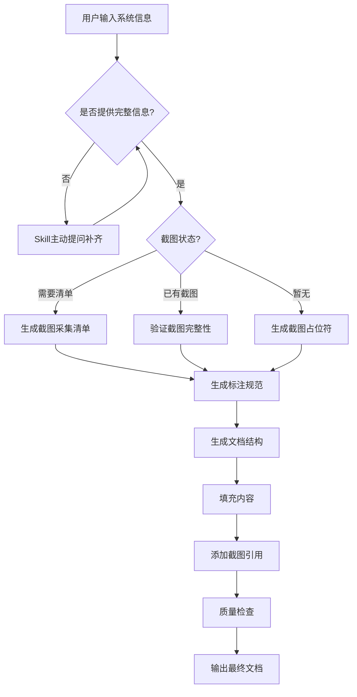

# 系统操作手册生成器

> 版本：v2.0 | 适用场景：企业级B端/C端系统操作手册生成

## 技能概述

面向**最终用户**的操作说明书生成器，内置截图规范、状态流转图、错误处理和跨模块串联能力。

### PRD → 操作手册映射

```
PRD（需求规格）                      操作手册（用户指南）
────────────────────                ────────────────────
写给研发/测试看                      写给最终用户看  
定义"系统应该做成什么样"              教会用户"怎么用这个系统"
含业务规则/状态矩阵/边界情况          只保留用户关心的操作路径
含字段校验/异常处理逻辑               转为FAQ/注意事项
含技术实现细节                       全部剔除
```

### 核心原则

| # | 原则 | 说明 |
|:-:|:----|:------|
| 1 | **用户视角** | 不说"系统校验…"而说"请确保…" |
| 2 | **步骤化** | 每一步都有明确的操作指引，5-7步为宜 |
| 3 | **零技术词** | 彻底不出现 API、数据库、字段类型、状态码等技术术语 |
| 4 | **截图优先** | 每个核心操作页必须有截图标注，一张图胜过千字 |
| 5 | **异常前置** | 用户可能犯错的地方提前加⚠️警示，而非等用户遇到才找答案 |

### 解决的核心问题

| 问题 | 方案 |
|:----|:------|
| 文档结构混乱，用户找不到信息 | 固定9章节结构，每章固定格式 |
| 风险提示缺失，用户点错按钮造成损失 | 高风险操作自动添加⚠️警示块 |
| 状态流转不清，用户不知道当前能做什么 | 强制生成状态流转图+状态说明表 |
| 跨模块操作割裂，用户不知道怎么串联 | 强制生成2个以上典型工作场景 |
| 截图不规范，标注混乱、图文对不上 | 截图采集清单+标注规范+图文联动规则 |
| 错误处理缺失，用户报错不知道怎么解决 | 常见错误提示对照表+错误截图采集 |

---

## 🎯 何时调用

**自动触发场景：**
- 用户说"帮我写操作手册"、"生成用户指南"、"写说明书"
- 系统上线前需要给用户培训材料
- 新功能上线需要更新帮助文档

**典型触发词：**
- "给这个功能写个使用说明"
- "生成操作手册"
- "写用户帮助文档"
- "怎么用这个系统的说明书"

---

## 📋 输出模板库

### 模板A：完整操作手册（推荐，适用大多数B端系统）

> 适合功能完整的PC端管理后台、供应商系统、仓管系统等。

```markdown
# [系统/模块名称] 操作手册

> 版本：v1.0 | 更新日期：YYYY-MM-DD | 适用角色：[角色列表]

---

## 📖 一、操作前必读

| ⚠️ 规则 | 说明 | 后果 |
|:-------|:----|:----|
| [规则1] | [详细说明] | [若违反] |
| [规则2] | [详细说明] | [若违反] |

> (5条以上核心规则的表格，让用户在操作前就了解禁区)

---

## 📖 二、快速入门（5分钟上手）

### 2.1 登录系统
1. 打开浏览器，访问 [系统地址]
2. 输入管理员分配的 **账号** 和 **密码**
3. 点击 **「登录」** 按钮
> 📸 [截图占位符]：登录页，标注①②③

### 2.2 完成第一个任务（以最核心的任务为例）

[3-5步完成，让用户立刻有成就感]

---

## 🧭 三、功能详解

### 3.1 [模块/页面名称]

#### 📸 页面概览

> 📸 截图：[文件名] | 标注要点：①搜索区 ②操作区 ③数据列表 ④行操作

| 标注 | 名称 | 作用 |
|:---|:---|:---|
| ① | [区域] | [作用说明] |
| ② | [区域] | [作用说明] |

#### 📋 操作步骤

**如何[核心操作1]**
> ⚠️ **重要警示**：[如果操作错误会有什么后果？]
1. 点击 **[按钮名称]**
2. 在弹出的窗口中，填写：
   - **[字段A]**：[填写说明，示例值]
   - **[字段B]**：[填写说明，示例值]
3. 点击 **「确认/提交」**
4. 操作成功后，[什么变化？提示什么？]
> 📸 截图：[页面/弹窗截图]

#### 📊 字段说明

| 字段名称 | 说明 | 示例 |
|:---|:---|:---|
| [字段名] | [这个字段用来做什么] | [示例值] |

#### 🔄 状态说明

| 状态 | 含义 | 可执行操作 |
|:---|:---|:---|
| [状态A] | [什么情况下是这个状态] | [能做什么] |

#### 📈 状态流转图

```
[状态A] →（操作1）→ [状态B] →（操作2）→ [状态C]
  ↓                   ↓
（取消）            （售后）
  ↓                   ↓
[已取消]            [售后处理中]
```

### 3.2 [模块二名称]...

---

## 🔗 四、典型工作场景

### 场景一：[场景名称]

| 步骤 | 角色 | 模块 | 操作 | 截图 |
|:---|:---|:---|:---|:---|
| 1 | [角色] | [模块] | [操作] | 📸 |
| 2 | [角色] | [模块] | [操作] | 📸 |

### 场景二：[场景名称]

---

## ❓ 五、常见问题（FAQ）

| # | 问题 | 答案 |
|:-:|:---|:----|
| 1 | [问题] | [具体回答] |
| 2 | [问题] | [具体回答] |

（至少10个Q&A，覆盖使用中最高频的问题）

---

## ⚠️ 六、注意事项与常见错误提示

### 6.1 核心注意事项

[表格：序号 | 规则 | 详细说明]

### 6.2 常见错误提示及处理方法

| 提示信息 | 含义 | 处理方法 | 截图 |
|:--------|:----|:--------|:----|
| [错误提示文字] | [含义] | [操作步骤] | 📸 |

---

## 📞 七、联系支持

| 类型 | 联系方式 | 说明 |
|:---|:--------|:----|
| 平台客服 | [联系方式] | [使用问题] |
| 技术支持 | [联系方式] | [故障/异常] |

---

## 📋 附录A：文档版本记录

| 版本 | 日期 | 修订内容 | 修订人 |
|:---|:----|:--------|:-----|
| v1.0 | YYYY-MM-DD | 初版 | [姓名] |

---

## 📸 附录B：截图索引

| 截图文件 | 页面 | 标注内容 | 版本 |
|:--------|:----|:--------|:---:|
| `xx_01.png` | [页面名称] | ①②③ | v1.0 |
```

---

### 模板B：快速参考卡（适用简单功能/移动端）

> 适合功能点少、操作路径短的场景。一页纸，重点突出。

```markdown
# [功能名称] — 操作速查

> 📱 适用端：[PC/iOS/Android/小程序] | 适用角色：[角色列表]

---

## 入口
> 📸 [截图/路径说明]

## 核心操作

| # | 操作 | 步骤 | ⚠️ 注意 |
|:-:|:----|:----|:-------|
| 1 | [操作名] | 点击A → 填写B → 提交 | [注意点] |
| 2 | [操作名] | 点击C → 确认D | [注意点] |

## 常见问题
- **Q1**：A → 回答
- **Q2**：B → 回答

---

> 详细说明请参见完整操作手册：[链接]
```

---

### 模板C：管理后台操作指南（适用后台管理系统）

> 适合权限复杂、角色多、流程长的 B2B 后台系统。重点突出多角色操作差异。

```markdown
# [系统名称] 管理后台操作指南

> 版本：v1.0 | 适用角色：[管理员/运营/财务/...]

---

## 一、角色权限速览

| 角色 | 可访问模块 | 核心操作 | 不能做什么 |
|:----|:----------|---------|:----------|
| [角色A] | 模块1/2/3 | 新增、编辑、审核 | 不能删除、不能导出 |
| [角色B] | 模块1/4/5 | 查看、导出 | 不能新增、不能编辑 |

---

## 二、按角色分章

### 2.1 [角色A] 操作指南
> 📸 截图快速入口

[分模块说明该角色可用的所有操作]

### 2.2 [角色B] 操作指南
> 📸 截图快速入口
```
---

---

### 模板D：新功能发布说明（适用版本更新）

> 适合每次版本迭代时，告诉用户"变了什么、怎么用"。

```markdown
# [版本号] 新功能发布说明

> 发布日期：YYYY-MM-DD

---

## ✨ 新增功能

| 功能 | 说明 | 入口 | 📸 | 操作要点 |
|:----|:----|:----|:--:|:--------|
| [功能名] | [一句话说明] | [路径] | 截图 | [关键操作] |

## 🔧 功能优化

| 功能 | 变化前 | 变化后 | 影响 |
|:----|:------|:------|:----|
| [功能名] | [原来的样子] | [现在的样子] | [用户需要适应什么] |

## ⚠️ 注意事项

- [升级后需要做什么]
- [数据迁移/权限变更等]
```

---

## 🖼️ 截图规范（核心能力）

### 1. 截图采集清单模板

当用户需要截图时，按以下格式输出采集清单：

```markdown
## 📸 截图采集清单

### 采集要求

| 项目 | 规格 |
|:---|:---|
| 格式 | PNG / JPG |
| 分辨率 | 1920×1080 或 1366×768 |
| 单张大小 | ≤ 2MB |
| 命名规范 | `模块_页面_序号.png` |

### 按模块截图清单

#### 模块一：[模块名称]

| 序号 | 截图内容 | 标注要点 | 命名建议 | 优先级 |
|:---|:--------|:--------|:--------|:----:|
| 1 | [页面/弹窗] | ①搜索区 ②操作区 ③列表 | `order_01.png` | P0 |
| 2 | [页面/弹窗] | ①表单字段 ②确认按钮 | `order_02.png` | P0 |
| 3 | 操作成功提示 | ⑤成功提示条 | `order_03.png` | P1 |

#### 错误场景截图（重要！）

| 序号 | 截图内容 | 触发条件 | 命名建议 | 优先级 |
|:---|:--------|:--------|:--------|:----:|
| 1 | [错误提示] | [操作] | `error_order_01.png` | P1 |
```

### 2. 截图标注规范

| 符号 | 名称 | 用途 | 示例 |
|:---|:---|:---|:---|
| ①②③... | 圆圈编号 | 标记页面关键元素 | 圈出"登录按钮"标为① |
| → | 箭头 | 指示操作路径 | 从菜单指向下拉项 |
| 🟩 高亮框 | 绿色框 | 标记正向操作按钮 | 框出"确认"按钮 |
| 🟥 高亮框 | 红色框 | 标记风险操作按钮 | 框出"删除"按钮 |
| 🟨 背景高亮 | 黄色底纹 | 标记重要内容 | 错误提示标黄 |

**标注密度控制**：
- 单张截图标注数量：3-8个
- 超过8个 → 拆分为多张截图
- 标注编号与文档"页面概览"表格一一对应

### 3. 图文联动规范

| 场景 | 引用格式 |
|:----|:--------|
| 章节开头 | `> 📸 参见截图：[文件名]` |
| 步骤中 | `（见截图标注①）` |
| 表格中 | 增加"图示"列 |
| 错误提示 | `> 📸 错误截图：[文件名]` |
| 暂无截图 | `> 📸 **[截图占位符]**：需要截取[页面]，标注要点：[列表]` |

### 4. 高风险操作自动识别

生成文档时自动检测高风险关键词并添加⚠️警示：

```yaml
高风险词库:
  "确认": "⚠️ 此操作代表承诺，确认后不可撤销，请核实后再操作"
  "删除": "⚠️ 删除后数据不可恢复，请确认是否删除"  
  "下架": "⚠️ 下架后用户端立即不可见，重新上架需审核"
  "结算": "⚠️ 结算单生成后不可修改，请核对后再操作"
  "提交审核": "⚠️ 提交后无法自行修改，请仔细检查"
  "禁用": "⚠️ 禁用后该账号将无法登录"
  "发货": "⚠️ 发货后收货地址不可修改，请确认地址无误"
```

---

## 🚀 使用流程（六步法）



### Step 1 — 明确读者与场景

先问清楚：

| 问题 | 作用 |
|:----|:----|
| 这个系统/功能的最终用户是谁？ | 决定语言风格和技术深度 |
| 用户最常做的前3个操作是什么？ | 决定快速入门的内容 |
| 用户最常见的3个问题是什么？ | 决定FAQ的方向 |
| 用户主要用什么端操作？（PC/手机/小程序） | 决定模板选择 |
| 截图状态如何？ | 决定生成采集清单还是直接引用 |

### Step 2 — 截图规划

```yaml
截图状态判断:
  - "已有截图" → 验证命名规范、检查标注与文字对应、生成截图索引表
  - "需要清单" → 生成按模块的截图采集清单（含错误场景）
  - "暂无" → 生成标准化截图占位符，标注每个截图需要标注哪些要点
```

### Step 3 — 从PRD提取操作手册内容

> 如果已有PRD，可以直接从中提取用户视角的内容。

| PRD章节 | 操作手册对应 | 提取方式 |
|:--------|:------------|:---------|
| 功能概述 | 快速入门 | 将"为什么做"改为"怎么进" |
| 交互逻辑 | 功能详解-操作步骤 | 直接复用步骤，改为用户语言 |
| 字段定义 | 字段说明表 | 去掉校验规则，加上示例值 |
| 状态定义 | 状态说明+流转图 | 去掉状态码，保留颜色+含义+操作 |
| 边界情况 | FAQ + 注意事项 | 将异常场景转为FAQ问题+答案 |
| 权限矩阵 | 角色权限速览 | 简化：去掉技术标识，加"不能做什么" |
| 接口需求 | ❌ 不提取 | 用户不关心接口 |
| 核心设计原则 | ❌ 不提取 | 用户不关心设计思想 |

### Step 4 — 选择模板

| 场景 | 推荐模板 |
|:----|:--------|
| 完整B端系统（多模块多角色） | 模板A + 模板C混合 |
| 简单功能/小程序 | 模板B |
| 版本更新 | 模板D |
| 管理后台 + 多角色 | 模板C |

### Step 5 — 填充内容

**PRD语言 → 操作手册语言**

```
PRD: "系统校验用户输入的手机号格式"
手册: "请输入11位手机号码，例如 13800138000"

PRD: "若库存不足，系统阻断提交并返回错误提示"
手册: "库存不足时提交会失败，请先检查库存数量"

PRD: "商品状态为下架时，加購按钮置灰不可点击"
手册: "商品显示'已下架'时无法加入购物车"

PRD: "权限校验：采购员角色可访问，主管只读"
手册: "采购员可以操作，主管只能查看"
```

**操作步骤书写规范：**

| 规范 | 说明 | 好例子 | 坏例子 |
|:----|:----|:-------|:-------|
| 用动词开头 | 每步以动作词开头 | "点击「新建」按钮" | "你会看到新建按钮" |
| 按钮名加引号 | 界面元素加引号或加粗 | 点击 **「确认」** | 点确认 |
| 步骤5-7步 | 单个操作不超过7步 | 5步 | 14步（应拆分） |
| 异常前置 | 常见错误提前说明 | "注意：如果xxx，请先yyy" | 用户遇到才去找 |
| 截图关联 | 每步关联截图标注 | （见截图标注①） | 无截图引用 |

**PRD → 操作手册 转换映射**

| PRD内容 | 操作手册输出 |
|:--------|:------------|
| 商品新增功能流程 | 操作步骤+截图占位符+字段表 |
| 订单状态变更逻辑 | 状态流转图+状态说明表 |
| 售后处理流程 | 操作步骤+⚠️警示+FAQ |
| 权限矩阵设计 | 角色权限速览表 |
| 字段校验规则 | 字段说明+错误提示表 |
| 异常场景设计 | FAQ（"如果…怎么办？"） |

### Step 6 — 质量检查

| # | 检查项 |
|:-:|-------|
| 1 | 是否有快速入门章节，让新用户5分钟上手？ |
| 2 | 每个操作是否步骤化（3-7步）？ |
| 3 | 是否没有技术术语（API/字段类型/状态码/数据库）？ |
| 4 | 🔴 **每个核心页面是否有截图引用？** |
| 5 | 🔴 **截图标注是否与文字描述对应？** |
| 6 | 每个字段表是否有示例值？ |
| 7 | 状态说明是否有颜色标记和可执行操作？ |
| 8 | 🔴 **有状态变更的模块是否有状态流转图？** |
| 9 | FAQ是否覆盖用户最高频的10个问题？ |
| 10 | 是否有注意事项章节？
| 11 | 🔴 **高风险操作前是否有⚠️警示？** |
| 12 | 是否有联系支持渠道？ |
| 13 | 🔴 **是否有常见错误提示对照表？** |
| 14 | 同一术语是否全文统一？ |
| 15 | 🔴 **截图单张标注是否≤8个？** |

---

## 💡 最佳实践

### ✅ 应该做的

| 实践 | 说明 |
|:----|:------|
| **新人测试** | 写完后找个没用过系统的人读一遍，看能否跟着操作成功 |
| **截图要带标注** | 不用整屏截图，截关键区域+数字标注 |
| **步骤要可逆** | "如果操作错了，可以点击「取消」返回" |
| **FAQ用真实问题** | 从客服/运营收集真实用户问题，不要自己编 |
| **版本号对齐** | 操作手册版本号与系统版本号保持一致 |
| **多条路径** | 如果一个操作有PC和App两种方式，分开说明 |
| **截图错误场景** | 正常流程截图80% + 错误场景截图20% |
| **截图命名规范化** | 模块_页面_序号.png，方便维护和查找 |

### ❌ 不应该做的

| 错误 | 正确做法 |
|:----|:---------|
| 写字段校验规则 | 写"请输入11位手机号"而不是"系统校验长度=11" |
| 写技术实现 | 写"导出后为Excel文件"而不是"调用/export接口" |
| 写业务规则 | 写"超过30天未操作，购物车自动清空"而不是"规则ID=R001" |
| 写状态流转逻辑 | 写"审核通过后进入上架状态"而不是"状态A→B" |
| 一步写太长 | 将"点击...填写...选择...提交...确认"拆成5步 |
| 遗漏异常路径 | 每一步都问"如果这里出错了用户怎么办" |
| 截图整屏截取 | 只截关键区域并标注，不要全屏大图