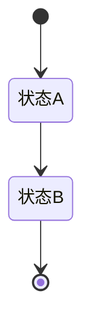
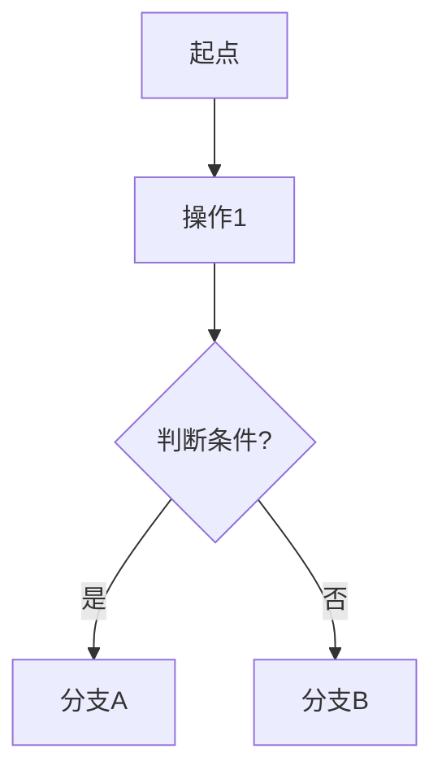

# 通用PRD生成器（融合版）

## 技能概述

标准化、可复制的**全链路PRD生成脚手架**，融合三层最佳实践：
1. **四层递进输出**（业务灵魂→功能全景→页面PRD→流程图）— 源自`prd-generator-helper`
2. **标准化16列格式**（全链路可追踪）— 源自`product-requirement-generator`
3. **模块详细设计的完整深度**（功能定位/核心概念/目标用户/业务规则/字段表/交互逻辑/界面元素/异常处理）— 源自`docs/PRD`详细风格

> 任何项目，一键生成专业级PRD！

---

## 🎯 何时调用

**自动触发场景：**
- 用户说"帮我写需求"、"生成PRD"、"做产品设计"
- 任何项目开始前需要梳理需求
- 需要为现有系统补充PRD文档

---

## 📋 输出目录结构

生成时按以下目录结构产出文档：

```
项目名/
├── prd.md                      # 主PRD（四层递进：灵魂→全景→PrdPanel→流程图）
├── 01-系统概览与架构.md          # 系统定位、目标用户、模块树、技术栈
├── 02-业务流程设计.md            # 核心业务流程、状态流转、Mermaid图
├── 03-数据模型与表结构.md        # 核心表DDL、字段规范、实体关系
├── 04-领域模型设计.md            # 实体、领域服务、领域事件
├── 05-模块A功能详细设计.md        # 模块A的完整功能点详细设计
├── 06-模块B功能详细设计.md        # 模块B的完整功能点详细设计
├── 07-模块C功能详细设计.md        # ...
└── ...
```

---

## 🚀 使用流程（五步法）

### Step 1 - 业务灵魂确认（必须先做！）

> 任何项目开始前，先确认核心设计原则和业务边界。这是文档的"魂"。

```markdown
## 核心设计原则

| 原则 | 说明 | 示例 |
|------|------|------|
| 原则一 | 一句话描述 | 具体场景举例 |
| 原则二 | 一句话描述 | 具体场景举例 |
| 原则三 | 一句话描述 | 具体场景举例 |

> 用一句话总结这个项目的"灵魂"
```

**需要确认的内容：**
- 项目的核心商业模式是什么？
- 有哪些端/角色参与？
- 哪些功能是"绝对禁止"的（不做什么比做什么更重要）？
- 行业特有的信任机制/业务习惯是什么？

**输出产物：** 主PRD的「核心设计原则」章节

---

### Step 2 - 终端边界与角色定义

> 梳理项目的所有终端和用户角色。

**格式1：终端边界**

| 端 | 核心诉求 | 禁忌功能 |
|:----:|---------|---------|
| 端A | 做什么 | 禁止做什么 |
| 端B | 做什么 | 禁止做什么 |

**格式2：角色定义**

| 角色 | 系统标识 | 核心职责 | 核心模块 | 使用端 |
|:----:|:-------:|---------|---------|:------:|
| 角色A | role_a | 职责描述 | 模块列表 | PC/App |
| 角色B | role_b | 职责描述 | 模块列表 | 小程序 |

**输出产物：** 01-系统概览与架构.md 的「目标用户」章节

---

### Step 3 - 功能全景输出（三列/八列/十六列CSV）

> 按模块梳理所有功能点，形成完整的功能清单。根据项目阶段选择详细程度。

**轻量版（三列）— 快速梳理：**

| 模块 | 功能点 | 优先级 |
|------|-------|:------:|

**标准版（八列）— SKILL推荐：**

| 所属端 | 模块 | 一级菜单 | 二级菜单 | 核心功能点 | 物理文件 | 优先级 | 备注 |
|-------|------|---------|---------|-----------|---------|:------:|------|

**完整版（十六列）— Jira就绪：**

| 功能编码 | Jira链接 | 开发状态 | 预估工时 | 开发负责人 | 测试负责人 | 所属端 | 模块 | 一级菜单 | 优先级 | 二级菜单 | 功能点 | 功能说明 | 适用角色 | 前置条件 | 输入字段 | 输出字段 | 交互说明 | 后置条件 | 异常场景 | 业务场景逻辑 | 数据流转 | 页面元素 | 依赖外部接口 |
|:-------:|:--------:|:--------:|:-------:|:---------:|:---------:|:-----:|:----:|:-------:|:----:|:-------:|:-----:|:-------:|:-------:|:-------:|:-------:|:-------:|:-------:|:-------:|:-------:|:----------:|:-------:|:-------:|:----------:|

**优先级定义：**

| 级别 | 标准 |
|:----:|------|
| **P0** | 没有此功能业务跑不通，核心MVP |
| **P1** | 一期必须完成，影响核心体验 |
| **P2** | 二期优化，不影响主流程 |
| **P3** | 后续迭代，锦上添花 |

**输出产物：** prd.md 的「功能全景」章节 + 各模块详细文件的章节结构

---

### Step 4 - 模块级详细设计

> 每个模块生成一个独立的MD文件，按统一模板展开全部细节。

#### 模块MD文件通用模板

```markdown
# 项目名 - [模块名称]功能详细设计

> 版本：v1.0  
> 文档状态：初稿  
> 所属章节：[第X章]

---

## 一、功能概述

### 1.1 功能定位
[1-2段话阐述：这个模块为什么存在？解决什么业务问题？在系统中的位置？]

### 1.2 核心概念
| 概念 | 说明 | 示例 |
|-----|------|------|
| 概念A | 精确定义 | 具体例子 |
| 概念B | 精确定义 | 具体例子 |

### 1.3 目标用户
- **角色A**：职责描述
- **角色B**：职责描述

### 1.4 模块范围
| 功能分类 | 主要功能 | 涉及角色 |
|---------|---------|---------|
| 分类A | 功能1、功能2 | 角色A |
| 分类B | 功能3、功能4 | 角色B |

---

## 二、业务规则

### 2.1 [规则类别1]
- **规则标题**：详细说明
  - 子规则1（具体约束）
  - 子规则2（示例说明）
  - 异常情况说明
- **规则标题**：详细说明

### 2.2 [规则类别2]
- **规则标题**：详细说明

> **规则编写要点：**
> - 每条规则包含：标题 + 详细说明 + 示例（必要时）
> - 覆盖：展示规则、操作规则、权限规则、校验规则、状态规则
> - 每条规则2-5个子项

---

## 三、功能点详细设计

### 3.1 [功能点名称]（P0/P1/P2）

#### 功能说明
[1段话描述这个功能是做什么的]

#### 入口路径
[具体的导航路径，如：左侧导航→模块名→功能名]

#### 交互逻辑
1. 第一步：详细描述操作
2. 第二步：详细描述操作
3. 第三步：详细描述操作
...
N. 异常分支：描述

#### 字段说明
| 字段名称 | 字段说明 | 组件类型 | 必填 | 校验规则 | 默认值 | 数据来源 |
|---------|---------|---------|:----:|---------|:------:|---------|

#### 业务规则
- 规则1（该功能点特有的规则）
- 规则2

#### 界面元素
- 元素1（位置+样式+交互）
- 元素2

#### 异常处理
| 异常场景 | 处理方式 | 提示信息 |
|---------|---------|---------|
| 场景1 | 前端/后端处理 | "具体提示文字" |
| 场景2 | 前端/后端处理 | "具体提示文字" |

#### 权限控制
[哪些角色可查看/操作]

---

## 四、状态流转（可选）



---

## 五、版本历史
| 版本 | 日期 | 修订内容 |
|:----:|:----:|---------|
| v1.0 | 2026-04-24 | 初始创建 |
```

#### 每个功能点详细设计的检查清单

每个功能点的设计必须覆盖以下12个维度：

| # | 维度 | 说明 | 必须包含 |
|:-:|------|------|:-------:|
| 1 | **功能说明** | 一句话描述功能做什么 | ✅ |
| 2 | **入口路径** | 用户如何进入该功能 | ✅ |
| 3 | **交互逻辑** | 步骤式的完整操作流程 | ✅ |
| 4 | **字段说明** | 表格：字段名/类型/组件/必填/校验/默认值/来源 | ✅ |
| 5 | **业务规则** | 该功能特有的约束条件 | ✅ |
| 6 | **界面元素** | 页面上的按钮/弹窗/表格/组件列表 | ✅ |
| 7 | **异常处理** | 表格：异常场景/处理方式/提示信息 | ✅ |
| 8 | **权限控制** | 哪些角色可查看/操作 | ✅ |
| 9 | **前置条件** | 操作前必须满足的条件 | ✅ |
| 10 | **后置条件** | 操作后系统发生的变化 | ✅ |
| 11 | **数据来源** | 数据从哪里来（接口/本地计算/前端输入） | ✅ |
| 12 | **并发/一致性** | 并发操作时的数据一致性问题（如有） | 必要时 |

---

### Step 5 - 页面级PRD数据库（PrdPanel格式）

> 将每个页面的PRD写入统一的PrdPanel数据库格式，用于前端组件渲染。

```typescript
const prdDatabase = {
  // ========== [模块A] ==========
  '/路由路径': {
    name: '页面名称',
    items: [
      { 
        reqId: 'PRJ-001', 
        moduleName: '功能/模块名', 
        priority: 'P0/P1/P2',
        content: `功能描述：
- 细节点1
- 细节点2
- 交互说明`
      },
      {
        reqId: 'PRJ-002',
        moduleName: '功能/模块名',
        priority: 'P0/P1/P2',
        content: `...`
      }
    ]
  },
  // ========== [模块B] ==========
  '/路由路径2': {
    name: '页面名称2',
    items: [ ... ]
  }
}
```

**输出产物：** prd.md 的「页面级PRD」章节

---

### Step 6 - 业务流程图（Mermaid）

> 使用Mermaid语法绘制核心业务流程。

**必画流程：**
1. **核心业务流程**（sequenceDiagram）：展示各角色/系统间的交互时序
2. **状态流转**（stateDiagram-v2）：展示核心对象（如订单）的生命周期
3. **分支流程**（graph TB）：展示带判断的业务分支（如收货→有货损/无货损）



**输出产物：**
- prd.md 的「业务流程图」章节
- 02-业务流程设计.md 的全部内容

---

### Step 7 - 数据模型与DDL（可选，按项目需要）

> 复杂项目需要产出数据模型文档。

**数据模型模板：**

```markdown
# 项目名 - 数据模型与表结构

## 一、核心表结构

### 1.1 [表名]（`table_name`）

| 字段名 | 类型 | 约束 | 描述 | 默认值 |
|-------|------|:----:|------|:------:|
| `id` | BIGINT | PK | 主键ID | - |
| `field_a` | VARCHAR(50) | UNIQUE NOT NULL | 字段描述 | - |
| `field_b` | DECIMAL(18,2) | NOT NULL | 金额字段 | - |

**关联关系：** FK→关联表.id
**业务规则：**
- 规则1
- 规则2
```

**包含内容：**
- 核心表DDL（字段名/类型/约束/描述/默认值）
- 字段命名规范
- 索引策略
- 实体关系图（ER图 ASCII或Mermaid）
- 并发控制策略（乐观锁等）

**输出产物：** 03-数据模型与表结构.md

---

### Step 8 - 领域模型设计（可选，DDD项目需要）

> 面向DDD（领域驱动设计）项目的领域模型文档。

**领域模型模板：**

```markdown
# 项目名 - 领域模型设计

## 一、核心领域实体

### 1.1 [实体名]（EntityName）

**核心属性：** id, field1, field2, status

**关联关系：**
- 1:N 关联实体A
- N:1 关联实体B

**领域方法：**
- `methodName(param)`: 方法描述
- `canDoSomething()`: 校验方法

**业务规则：**
- 规则1
```

**包含内容：**
- 领域实体列表（核心属性+关联关系+领域方法+业务规则）
- 领域服务列表（服务名+方法签名+描述）
- 领域事件列表（事件名+触发条件+监听处理）
- 分层架构图

**输出产物：** 04-领域模型设计.md

---

## 📦 内置功能模板库

### 通用CRUD模板

```markdown
### [实体]列表查询

**字段说明：** 筛选条件（关键词/状态Tab/时间范围）+ 表格列表 + 分页
**交互逻辑：** 页面加载→调用列表接口→渲染表格→切换Tab→重新查询→点击行→跳转详情
**界面元素：** 搜索栏、Tab切换、表格、分页控件、新建按钮
**异常处理：** 加载失败→重试 | 无数据→空状态 | 搜索无结果→提示
```

### 审核流程模板

```markdown
### [单据]审核

**字段说明：** 审核状态（待审核/已通过/已拒绝）+ 审核意见（必填，200字）+ 审核人
**交互逻辑：** 打开审核弹窗→查看单据详情→填写意见→提交→状态变更→通知
**界面元素：** 审核弹窗、意见文本域、通过/拒绝按钮
**异常处理：** 已审核→提示"该单据已被审核" | 无权限→按钮隐藏
```

### 列表+详情模板

```markdown
### [单据]列表
**字段说明：** 状态Tab + 筛选条件 + 列表表格（编号/名称/状态/时间/操作）
**交互逻辑：** Tab切换→筛选→分页→点击行→跳转详情

### [单据]详情
**字段说明：** 基本信息区 + 明细表格区 + 操作日志区
**交互逻辑：** 加载详情→分区域渲染→动态操作按钮
**界面元素：** 信息卡片、明细表格、日志时间线、底部操作栏
```

---

## 📐 文档质量检查清单

生成完毕后，逐项检查：

| # | 检查项 | 标注 |
|:-:|-------|:----:|
| 1 | 是否有「核心设计原则」章节？ | ✅ |
| 2 | 是否有「术语表」？ | ✅ |
| 3 | 是否有「用户角色与权限矩阵」？ | ✅ |
| 4 | 功能全景是否覆盖了所有功能点？ | ✅ |
| 5 | 每个功能点是否包含12个完整维度？ | ✅ |
| 6 | 是否有完整的字段说明表（含校验规则）？ | ✅ |
| 7 | 是否有异常处理表（异常场景/处理方式/提示）？ | ✅ |
| 8 | 是否有明确的前置条件/后置条件？ | ✅ |
| 9 | 是否有业务规则（≥5条/模块）？ | ✅ |
| 10 | 是否有Mermaid流程图？ | ✅ |
| 11 | 是否有权限控制说明？ | ✅ |
| 12 | 是否有界面元素清单？ | ✅ |
| 13 | 数据模型是否有字段规范说明？ | ✅ |
| 14 | 是否有版本历史？ | ✅ |

---

## 💡 最佳实践与常见误区

### ✅ 应该做的

| 实践 | 说明 |
|------|------|
| **先灵魂后细节** | 先确认核心设计原则，再展开功能设计 |
| **不做比做什么更重要** | 明确列出"不做"的功能范围 |
| **每条规则带示例** | 规则说明必须有具体数值例子 |
| **异常场景全覆盖** | 每个功能点至少3个异常场景 |
| **字段校验写清楚** | 格式/长度/必填/取值范围 |
| **状态流转画出来** | 用Mermaid画出核心状态机 |

### ❌ 不应该做的

| 错误 | 正确做法 |
|------|---------|
| 只列功能名，没有细节 | 每个功能点展开12个维度 |
| 没有校验规则 | 每个字段标注校验规则 |
| 只写正常流程 | 覆盖异常场景表 |
| 缺少权限说明 | 每个功能点标注角色权限 |
| 业务规则笼统 | 每条规则有约束条件+子规则+示例 |
| 字段表没有组件类型 | 标注Input/Select/DatePicker等 |

---

## 🎯 一句话快速启动

> **"帮我按融合PRD标准，生成一个[项目名]的完整PRD，包含：1）系统概览 2）业务流程 3）数据模型 4）领域模型 5）[模块A/B/C]的详细功能设计"**
