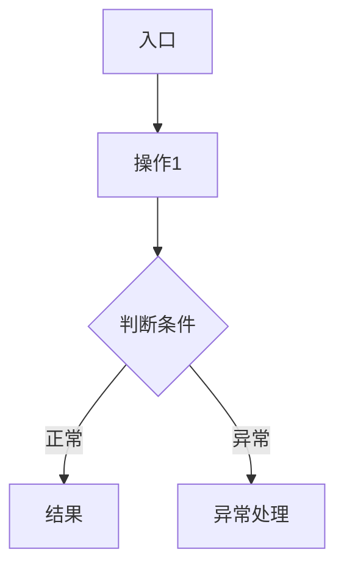
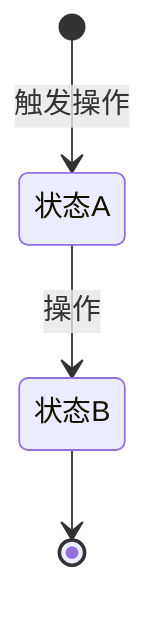
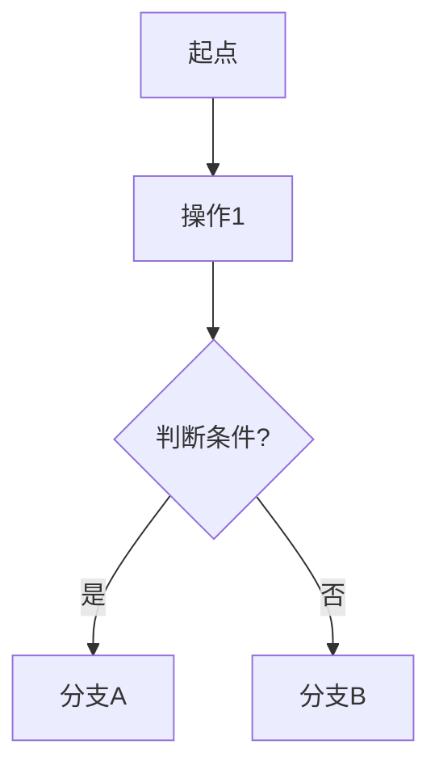

# 通用PRD生成器（融合版）

## 技能概述

标准化、可复制的**全链路PRD生成脚手架**，融合三层最佳实践：
1. **四层递进输出**（业务灵魂→功能全景→页面PRD→流程图）— 源自`prd-generator-helper`
2. **标准化16列格式**（全链路可追踪）— 源自`product-requirement-generator`
3. **模块详细设计的完整深度**（功能定位/核心概念/目标用户/业务规则/字段定义/交互逻辑/边界覆盖/异常汇总/权限矩阵）— 源自`docs/PRD`详细风格（PM纯净版）

> 任何项目，一键生成专业级PRD！

---

## 🎯 何时调用

**自动触发场景：**
- 用户说"帮我写需求"、"生成PRD"、"做产品设计"
- 任何项目开始前需要梳理需求
- 需要为现有系统补充PRD文档

---

## 📋 输出目录结构

生成时按以下目录结构产出文档：

```
项目名/
├── prd.md                      # 主PRD（四层递进：灵魂→全景→PrdPanel→流程图）
├── 01-系统概览与架构.md          # 系统定位、目标用户、模块树、技术栈
├── 02-业务流程设计.md            # 核心业务流程、状态流转、Mermaid图
├── 03-数据模型与表结构.md        # 核心表DDL、字段规范、实体关系
├── 04-领域模型设计.md            # 实体、领域服务、领域事件
├── 05-模块A功能详细设计.md        # 模块A的完整功能点详细设计
├── 06-模块B功能详细设计.md        # 模块B的完整功能点详细设计
├── 07-模块C功能详细设计.md        # ...
└── ...
```

---

## 🚀 使用流程（五步法）

### Step 1 - 业务灵魂确认（必须先做！）

> 任何项目开始前，先确认核心设计原则和业务边界。这是文档的"魂"。

```markdown
## 核心设计原则

| 原则 | 说明 | 示例 |
|------|------|------|
| 原则一 | 一句话描述 | 具体场景举例 |
| 原则二 | 一句话描述 | 具体场景举例 |
| 原则三 | 一句话描述 | 具体场景举例 |

> 用一句话总结这个项目的"灵魂"
```

**需要确认的内容：**
- 项目的核心商业模式是什么？
- 有哪些端/角色参与？
- 哪些功能是"绝对禁止"的（不做什么比做什么更重要）？
- 行业特有的信任机制/业务习惯是什么？

**输出产物：** 主PRD的「核心设计原则」章节

---

### Step 2 - 终端边界与角色定义

> 梳理项目的所有终端和用户角色。

**格式1：终端边界**

| 端 | 核心诉求 | 禁忌功能 |
|:----:|---------|---------|
| 端A | 做什么 | 禁止做什么 |
| 端B | 做什么 | 禁止做什么 |

**格式2：角色定义**

| 角色 | 系统标识 | 核心职责 | 核心模块 | 使用端 |
|:----:|:-------:|---------|---------|:------:|
| 角色A | role_a | 职责描述 | 模块列表 | PC/App |
| 角色B | role_b | 职责描述 | 模块列表 | 小程序 |

**输出产物：** 01-系统概览与架构.md 的「目标用户」章节

---

### Step 3 - 功能全景输出（三列/八列/十六列CSV）

> 按模块梳理所有功能点，形成完整的功能清单。根据项目阶段选择详细程度。

**轻量版（三列）— 快速梳理：**

| 模块 | 功能点 | 优先级 |
|------|-------|:------:|

**标准版（八列）— SKILL推荐：**

| 所属端 | 模块 | 一级菜单 | 二级菜单 | 核心功能点 | 物理文件 | 优先级 | 备注 |
|-------|------|---------|---------|-----------|---------|:------:|------|

**完整版（十六列）— Jira就绪：**

| 功能编码 | Jira链接 | 开发状态 | 预估工时 | 开发负责人 | 测试负责人 | 所属端 | 模块 | 一级菜单 | 优先级 | 二级菜单 | 功能点 | 功能说明 | 适用角色 | 前置条件 | 输入字段 | 输出字段 | 交互说明 | 后置条件 | 异常场景 | 业务场景逻辑 | 数据流转 | 页面元素 | 依赖外部接口 |
|:-------:|:--------:|:--------:|:-------:|:---------:|:---------:|:-----:|:----:|:-------:|:----:|:-------:|:-----:|:-------:|:-------:|:-------:|:-------:|:-------:|:-------:|:-------:|:-------:|:----------:|:-------:|:-------:|:----------:|

**优先级定义：**

| 级别 | 标准 |
|:----:|------|
| **P0** | 没有此功能业务跑不通，核心MVP |
| **P1** | 一期必须完成，影响核心体验 |
| **P2** | 二期优化，不影响主流程 |
| **P3** | 后续迭代，锦上添花 |

**输出产物：** prd.md 的「功能全景」章节 + 各模块详细文件的章节结构

---

### Step 4 - 模块级详细设计

> 每个模块生成一个独立的MD文件，按统一模板展开全部细节。

#### 模块MD文件通用模板（PM纯净版）

> **PM纯净版** = 聚焦业务层定义，已移除技术细节（字段类型、API路径、HTTP状态码、安全实现方式）。
> 完整模板文件参见 `prd-脚手架/05-系统模块详细设计-PM纯净版.md`
> 配套写作指南参见 `prd-脚手架/PM纯净版分析指南.md`（含每章填充指南+自检问题+交付清单）

```markdown
# 项目名 - [模块名称]功能详细设计

> 版本：v1.0  
> 文档状态：初稿  
> 所属章节：[第X章]

<!-- PRD六层模型（PM纯净版）： -->
<!-- 核心层：功能概述 → 设计原则 → 业务规则 → 功能点详情 -->
<!-- 扩展层：权限矩阵 → 非功能性需求 → 异常汇总 → 接口需求 -->
<!-- 治理层：状态流转图 → 状态治理矩阵 → 版本历史 -->

---

## 一、功能概述

### 1.1 功能定位
[1-2段话阐述：这个模块为什么存在？解决什么业务问题？在系统中的位置？]

### 1.2 核心概念
| 概念 | 说明 | 示例 |
|:----|------|------|
| 概念A | 精确定义 | 具体例子 |
| 概念B | 精确定义 | 具体例子 |

### 1.3 目标用户
- **角色A**（核心用户）：职责描述
- **角色B**：职责描述

### 1.4 模块范围
| 功能分类 | 主要功能 | 涉及角色 |
|:--------|---------|---------|
| 分类A | 功能1、功能2 | 角色A |
| 分类B | 功能3、功能4 | 角色B |

---

## 二、核心设计原则

> **本系统的核心设计原则：一句话概括。**

### 2.1 [原则一]
[用表格或文字说明该原则的核心规则]

### 2.2 [原则二]
[用表格或文字说明]

---

## 三、业务规则

### 3.1 [规则类别1]
- **规则标题**：详细说明（含示例）
- **规则标题**：详细说明

### 3.2 [规则类别2]
- **规则标题**：详细说明

### 3.3 核心业务流程图



---

## 四、权限矩阵

| 功能模块 | 具体操作 | 角色A | 角色B | 角色C | 说明 |
|:--------|---------|:----:|:----:|:----:|------|
| 模块A | 操作1 | ✅ | ✅ | ❌ | - |
| 模块A | 操作2 | ✅ | ❌ | ❌ | - |
| 模块B | 操作3 | ✅ | ✅ | ✅ | 只读 |

---

## 五、非功能性需求

| 场景 | 性能指标 | 说明 |
|:----|:-------:|------|
| 列表查询 | ≤ 500ms | 含筛选+分页 |
| 提交保存 | ≤ 1s | - |

### 安全要求
| 风险点 | 预期防护策略 |
|:------|:-----------|
| 越权操作 | 操作接口校验用户角色 |
| 重复提交 | 阻止短时间内重复提交 |

---

## 六、功能点详细设计

> 每个功能点采用**3D模板**：交互逻辑 → 字段定义 → 边界情况覆盖。
> **字段定义已移除技术类型**（String/Decimal/Integer/Enum），由开发技术方案补充。

### 6.1 [功能点名称]（P0/P1/P2）

#### 交互逻辑
1. 页面加载：[描述]
2. [步骤2]
3. 若[条件A] → [处理A]；若[条件B] → [处理B]
4. 提交后：[成功处理]；[失败处理]

#### 字段定义
| 字段 | 必填 | 来源 | 校验规则 | 展示规则 | 默认值 |
|:----|:----:|:----|:--------|:--------|:-----:|
| 字段名 | 是 | 来源 | 非空/长度≤N/格式 | 展示样式 | - |
| 字段名 | 是 | 接口 | ≥0 | 红色加粗 | - |
| 字段名 | 否 | 用户选择 | 必选其一 | 下拉选择器 | 默认值 |

#### 边界情况覆盖
| 场景 | 处理逻辑 | 提示文案 |
|:----|:--------|---------|
| 异常场景 | 前端+后端处理 | "用户看到的提示" |
| 场景2 | 处理方式 | "提示文案" |

---

## 七、异常处理汇总表

> 合并前端处理+后端处理为一列，移除HTTP状态码等技术细节。

| 异常场景 | 触发条件 | 处理方式 | 提示文案 |
|:--------|:--------|:--------|---------|
| 场景描述 | 触发逻辑 | 产品期望的处理行为 | "提示文案" |
| 场景描述 | 触发逻辑 | 产品期望的处理行为 | "提示文案" |

---

## 八、接口需求说明

> 移除具体API路径，产品只定义"需要什么接口能力"。
> 接口路径、入参出参、P95指标由开发技术方案补充。

| 接口用途 | 核心能力要求 |
|:--------|:-----------|
| 列表查询 | 按条件筛选+分页返回列表数据 |
| 创建/提交 | 接收表单数据并保存 |

---

## 九、状态流转图（状态模块必写）



---

## 十、状态治理矩阵（状态模块必写）

### 10.1 动作定义表
| 动作ID | 动作名称 | 触发方式 | 触发角色 | 说明 |
|:-----:|---------|---------|:-------:|------|
| XX-01 | 动作名 | 点击按钮 | 角色 | 说明 |

### 10.2 状态×操作矩阵
| 状态 \ 操作 | 动作1 | 动作2 | 动作3 |
|:----------:|:----:|:----:|:----:|
| **状态A** | ✅ | ❌ | ✅ |
| **状态B** | ❌ | ✅ | ❌ |

---

## 十一、版本历史

| 版本 | 日期 | 修订内容 | 修订人 |
|:----:|:----:|---------|:-----:|
| v1.0 | YYYY-MM-DD | 初始创建，覆盖全部N个功能点 | PM |
```

#### 每个功能点详细设计的检查清单（PM纯净版）

每个功能点的设计必须覆盖以下4个核心维度（4D模板）：

| # | 维度 | 说明 | 必须包含 |
|:-:|------|------|:-------:|
| 1 | **交互逻辑** | 入口→页面形式→步骤式操作路径，覆盖正常+分支+异常+加载/空/错误状态 | ✅ |
| 2 | **字段定义** | 字段名/必填/来源/校验规则/展示规则/默认值（不含字段类型） | ✅ |
| 3 | **操作定义** | 每个按钮的可见条件/点击行为/二次确认/成功反馈/失败反馈 | ✅ |
| 4 | **边界情况覆盖** | 异常场景穷举，含处理逻辑+提示文案 | ✅ |

#### 模块级文档检查清单

| # | 章节 | 说明 | 必须包含 |
|:-:|------|------|:-------:|
| 1 | 一、功能概述 | 功能定位/核心概念/目标用户/模块范围 | ✅ |
| 2 | 二、核心设计原则 | 业务设计思想，作为上层约束 | ✅ |
| 3 | 三、业务规则 | 文字规则 + Mermaid流程图 | ✅ |
| 4 | 四、权限矩阵 | 角色×操作权限总表 | ✅ |
| 5 | 五、非功能性需求 | 性能指标 + 安全要求 | ✅ |
| 6 | 六、功能点详细设计 | 每个功能点的4D模板（交互+字段+操作+边界） | ✅ |
| 7 | 七、异常处理汇总表 | 模块级异常场景汇总 | ✅ |
| 8 | 八、接口需求说明 | 接口能力定义（不含路径） | ✅ |
| 9 | 九、状态流转图 | 状态模块必写 | 状态模块 |
| 10 | 十、状态治理矩阵 | 动作定义+状态×操作矩阵 | 状态模块 |
| 11 | 十一、版本历史 | 版本/日期/修订内容/修订人 | ✅ |

---

### Step 5 - 页面级PRD数据库（PrdPanel格式）

> 将每个页面的PRD写入统一的PrdPanel数据库格式，用于前端组件渲染。

```typescript
const prdDatabase = {
  // ========== [模块A] ==========
  '/路由路径': {
    name: '页面名称',
    items: [
      { 
        reqId: 'PRJ-001', 
        moduleName: '功能/模块名', 
        priority: 'P0/P1/P2',
        content: `功能描述：
- 细节点1
- 细节点2
- 交互说明`
      },
      {
        reqId: 'PRJ-002',
        moduleName: '功能/模块名',
        priority: 'P0/P1/P2',
        content: `...`
      }
    ]
  },
  // ========== [模块B] ==========
  '/路由路径2': {
    name: '页面名称2',
    items: [ ... ]
  }
}
```

**输出产物：** prd.md 的「页面级PRD」章节

---

### Step 6 - 业务流程图（Mermaid）

> 使用Mermaid语法绘制核心业务流程。

**必画流程：**
1. **核心业务流程**（sequenceDiagram）：展示各角色/系统间的交互时序
2. **状态流转**（stateDiagram-v2）：展示核心对象（如订单）的生命周期
3. **分支流程**（graph TB）：展示带判断的业务分支（如收货→有货损/无货损）



**输出产物：**
- prd.md 的「业务流程图」章节
- 02-业务流程设计.md 的全部内容

---

### Step 7 - 数据模型与DDL（可选，按项目需要）

> 复杂项目需要产出数据模型文档。

**数据模型模板：**

```markdown
# 项目名 - 数据模型与表结构

## 一、核心表结构

### 1.1 [表名]（`table_name`）

| 字段名 | 类型 | 约束 | 描述 | 默认值 |
|-------|------|:----:|------|:------:|
| `id` | BIGINT | PK | 主键ID | - |
| `field_a` | VARCHAR(50) | UNIQUE NOT NULL | 字段描述 | - |
| `field_b` | DECIMAL(18,2) | NOT NULL | 金额字段 | - |

**关联关系：** FK→关联表.id
**业务规则：**
- 规则1
- 规则2
```

**包含内容：**
- 核心表DDL（字段名/类型/约束/描述/默认值）
- 字段命名规范
- 索引策略
- 实体关系图（ER图 ASCII或Mermaid）
- 并发控制策略（乐观锁等）

**输出产物：** 03-数据模型与表结构.md

---

### Step 8 - 领域模型设计（可选，DDD项目需要）

> 面向DDD（领域驱动设计）项目的领域模型文档。

**领域模型模板：**

```markdown
# 项目名 - 领域模型设计

## 一、核心领域实体

### 1.1 [实体名]（EntityName）

**核心属性：** id, field1, field2, status

**关联关系：**
- 1:N 关联实体A
- N:1 关联实体B

**领域方法：**
- `methodName(param)`: 方法描述
- `canDoSomething()`: 校验方法

**业务规则：**
- 规则1
```

**包含内容：**
- 领域实体列表（核心属性+关联关系+领域方法+业务规则）
- 领域服务列表（服务名+方法签名+描述）
- 领域事件列表（事件名+触发条件+监听处理）
- 分层架构图

**输出产物：** 04-领域模型设计.md

---

## 📦 内置功能模板库

### 通用CRUD模板

```markdown
### [实体]列表查询

**字段说明：** 筛选条件（关键词/状态Tab/时间范围）+ 表格列表 + 分页
**交互逻辑：** 页面加载→调用列表接口→渲染表格→切换Tab→重新查询→点击行→跳转详情
**界面元素：** 搜索栏、Tab切换、表格、分页控件、新建按钮
**异常处理：** 加载失败→重试 | 无数据→空状态 | 搜索无结果→提示
```

### 审核流程模板

```markdown
### [单据]审核

**字段说明：** 审核状态（待审核/已通过/已拒绝）+ 审核意见（必填，200字）+ 审核人
**交互逻辑：** 打开审核弹窗→查看单据详情→填写意见→提交→状态变更→通知
**界面元素：** 审核弹窗、意见文本域、通过/拒绝按钮
**异常处理：** 已审核→提示"该单据已被审核" | 无权限→按钮隐藏
```

### 列表+详情模板

```markdown
### [单据]列表
**字段说明：** 状态Tab + 筛选条件 + 列表表格（编号/名称/状态/时间/操作）
**交互逻辑：** Tab切换→筛选→分页→点击行→跳转详情

### [单据]详情
**字段说明：** 基本信息区 + 明细表格区 + 操作日志区
**交互逻辑：** 加载详情→分区域渲染→动态操作按钮
**界面元素：** 信息卡片、明细表格、日志时间线、底部操作栏
```

---

## 📐 文档质量检查清单

生成完毕后，逐项检查。PM纯净版额外验证——是否误写了技术细节。

### 章节完整性

| # | 检查项 | 标注 |
|:-:|-------|:----:|
| 1 | 是否有版本历史（含修订人列）？ | ✅ |
| 2 | 是否有术语表？ | ✅ |
| 3 | 是否有核心设计原则章节？ | ✅ |
| 4 | 是否有用户角色与权限矩阵？ | ✅ |
| 5 | 功能全景是否覆盖了所有功能点？ | ✅ |
| 6 | 业务规则是否有Mermaid流程图？ | ✅ |
| 7 | 每个功能点是否有4D完整设计（交互+字段+操作+边界）？ | ✅ |
| 8 | 是否有模块级异常处理汇总表？ | ✅ |
| 9 | 是否有接口需求说明（不含API路径）？ | ✅ |

### PM纯净版专项检查

| # | 检查项 | 标注 |
|:-:|-------|:----:|
| 10 | 字段定义表是否不含技术类型（String/Decimal/Enum）？ | ✅ |
| 11 | 业务规则是否用结构化表格（规则ID+触发+动作+例外）替代段落？ | ✅ |
| 12 | 异常处理是否合并前后端为统一的"处理方式"列？ | ✅ |
| 13 | 状态模块是否有状态×操作矩阵？ | ✅ |
| 14 | 数据模型是否有字段规范说明？ | ✅ |

---

## 💡 最佳实践与常见误区

### ✅ 应该做的

| 实践 | 说明 |
|------|------|
| **先灵魂后细节** | 先确认核心设计原则，再展开功能设计 |
| **不做比做什么更重要** | 明确列出"不做"的功能范围 |
| **每条规则带示例** | 规则说明必须有具体数值例子 |
| **异常场景全覆盖** | 每个功能点至少3个异常场景 |
| **字段校验写清楚** | 格式/长度/必填/取值范围 |
| **状态流转画出来** | 用Mermaid画出核心状态机 |

### ❌ 不应该做的

| 错误 | 正确做法 |
|------|---------|
| 只列功能名，没有细节 | 每个功能点展开4D模板（交互+字段+操作+边界） |
| 没有校验规则 | 每个字段标注校验规则 |
| 只写正常流程 | 覆盖异常场景表 |
| 缺少权限说明 | 用权限矩阵统一管理角色权限 |
| 业务规则笼统 | 每条规则有约束条件+子规则+示例 |
| 字段表包含技术类型（String/Decimal/Enum） | PM纯净版不写字段类型，由开发补充 |
| 写API路径/HTTP状态码 | 只写接口能力描述，路径由技术方案定 |
| 拆分前后端处理方式 | 合并为统一的"处理方式"列，描述产品期望行为 |

### 📎 附录：PM纯净版不该写的内容对照表

| 如果你在想... | 这是... | 应该... |
|:---|:---|:---|
| "用Redis还是MySQL" | 技术实现 | 删掉，或改为"需支持高并发" |
| "接口路径是POST /api/xxx" | 技术实现 | 删掉，研发自己定 |
| "前端用Table组件" | 技术实现 | 删掉，或改为"列表以表格形式展示" |
| "字段类型是String(100)" | 技术实现 | 删掉，或改为"字段说明+校验规则" |
| "加一个分布式锁" | 技术实现 | 改为"需防止并发重复提交" |
| "HTTP状态码返回200/400" | 技术实现 | 删掉，研发自己定 |
| "数据库行锁+Redis预扣减" | 技术实现 | 改为"需防止超卖" |
| "这个按钮用防抖500ms" | 技术实现 | 改为"阻止短时间内重复提交" |

---

## 🎯 一句话快速启动

> **"帮我按融合PRD标准，生成一个[项目名]的完整PRD，包含：1）系统概览 2）业务流程 3）数据模型 4）领域模型 5）[模块A/B/C]的详细功能设计"**
